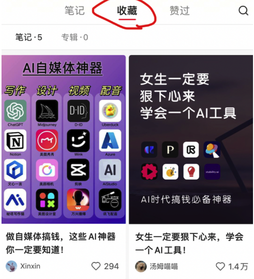
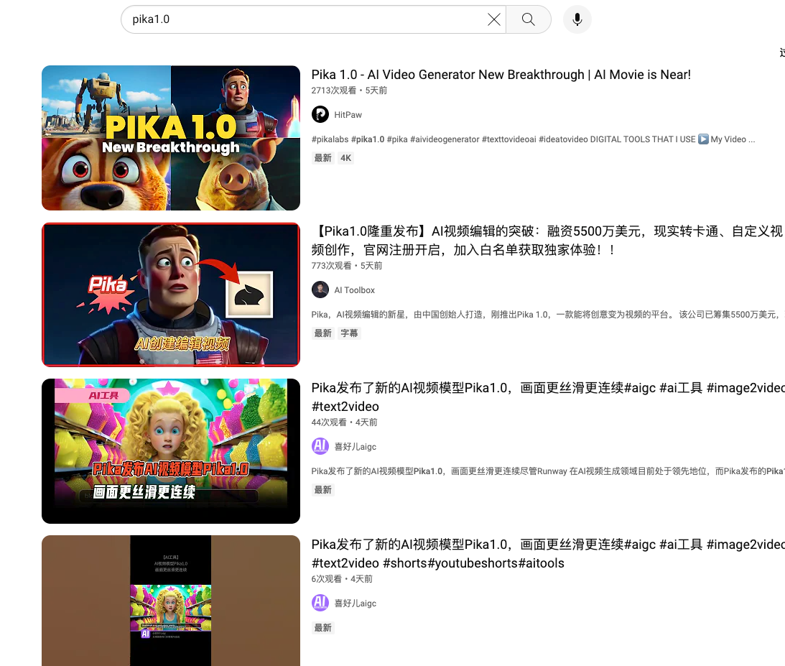

# 1. AI小红书的玩法是什么？新手如何入局并成功变现？
---
哈喽，大家好，我是亚超，首先非常感谢菜花和张哥团队的邀请，让我有机会能分享我的小红书经验。

大家有什么问题或建议都可以随时跟我说哈，没必要把我当作老师，我们可以是一起交流的战友，一起从小红书平台中分一杯羹。

简单的自我介绍一下，我的真名就叫亚超，大学毕业后在北京做了4年的产品经理，今年2月份裸辞了，想要出来自己闯闯，目前坐标广州，在尝试短视频电商以及个人IP打造，离得近的小伙伴有机会可以一起交流~

我从大三的时候就开始自己找项目做副业，尝试过非常多的方向，有过一些小成绩，比如大学做了一个技术类的公众号，变现了将近10W；还做过抖音短视频带货，目前粉丝3.9W，橱窗销量4800+；做过外卖cps，总佣金2W左右；也做过视频号，两个账号加起来3W多粉丝。

目前在做的呢，是AI方向的账号，目前小红书粉丝9800+，抖音粉丝4000+，已经引流私域好友2000+，两个多月的时间总变现将近1W了，虽然不算很多，但我很看好未来的发展潜力。

这部分也是本次实战的主要方向，在接下来的三周内，我会把做账号的经验，以及各种变现方法的总结，全部分享给大家，有钱一起赚~

今天的分享主题是：AI小红书的玩法是什么，以及新手如何入局并成功变现？先让大家对整个流程有个基本了解。

## 1.1 什么是AI小红书
---
简单地说就是，做一个分享AI工具的账号，吸引对AI领域，或自媒体领域感兴趣的粉丝，然后通过接广告、卖账号、卖课程等方式变现。

比如下面这几个账号：

大家都知道，今年由于chatGPT和AI绘画的爆火，把AI的热度全都带了起来，所以我们的目的就是借助AI这阵风，完成短视频账号的起号与运营变现。

## 1.2 为什么会选择小红书平台？
---
其实一开始我想要做AI账号时，首选的平台是抖音，因为目前来说，抖音的用户和流量都是最大的，但是实际结果来看，我把同一个视频分发到抖音、小红书和视频号，只有小红书的效果是最好的，涨粉效果也一直很稳定。

从这个结果来倒推，为什么要选择小红书平台？而不选抖音和视频号？

一方面来说，抖音现在虽然用户量最多，但同时它也是最卷的一个平台，现在入局做抖音，除非你的内容非常有差异化，能做出与众不同的内容，否则很难涨粉了，你想一下，你现在刷抖音的时候，关注新博主的机会多吗？肯定很少了吧。

现在能做好抖音的，要么是付费，要么是有极强的内容能力。%E2%80%8B+至于视频号呢，我自己测试来看，视频号的流量是最不稳定的，有的视频能上万播放，有的视频却只有两位数播放，并且它的用户群体年龄偏大，确实不太适合做AI这种新时代的内容。

另一方面，小红书天然是一个分享与种草的平台，用户群体也都是喜欢关注新鲜事物的年轻人，所以非常契合AI工具分享的定位。

比如我下面这条视频，点赞量8000多，收藏量却有1.3W多，这在其他平台是不可能出现的，只有小红书的用户才热衷于收藏笔记。

另外，小红书的长尾流量也非常不错，只要爆了一条笔记，后面能持续吃到很多流量，上面那条视频是两个月以前发的，现在每天还有很多人来点赞和收藏。即使我好几天不发笔记，每天都能涨粉99+，非常香

这就是我们为什么要选择小红书平台的原因，尤其对于新人来说，小红书是最容易上手的，也是最容易变现看到结果的

## 1.3 如何入局 AI 小红书？
---
那么，我们应该如何入局小红书呢？

其实我在做这个AI账号之前，对于小红书并没有太深入的了解，全都是在做的过程中不断调整和优化的。

对于新人来说，做小红书的方法就是：抄。

当然，这不是让大家一模一样的去抄袭哈，“抄”的意思就是模仿，爆款的内容都是重复的，真正能百分百原创的人非常少，大家都是互相借鉴而已。

所以，我们首先要做的就是：去刷同行的账号，找到适合你的风格，去模仿他就可以了。

在小红书随便搜关于AI的关键词，比如：AI工具、AI分享等，你就能找到非常多的对标账号。

我建议最开始先不用着急那么快就确定模仿对象，前期先“多去看”。

AI账号的风格有很多种，有做图文的，有做视频的，有真人出镜的，也有不露脸只配音的，慢慢找到你能做的那一种就可以了。

看到感兴趣的笔记，点个赞点个关注，很快你的主页就会给你推荐非常多的同行账号。

这里还要注意，刷对标账号的时候，要记得研究他的变现方式，是靠接广告，还是引流到私域进行变现的，如果是引流私域的，你可以主动加上他的好友，卧底他的朋友圈，很快就能摸透他的变现方式。

不过反过来讲，前期其实也没必要太过于关注变现方式，因为这个赛道，当你有了基础粉丝之后，各种变现方式就会自然而然地找过来。

## 1.4 AI 小红书有哪些变现的方式？
---
下面拿我自己举例，简单分享一下我已经跑通的几种变现方式，先说个大概，后面有一节直播课，专门分享变现方式的，如果有需要，我也会把我这边的合作资源共享给大家~

1. 当我账号到了3000多粉丝，就有了第一个广告主找了过来，推广他们开发的AI工具网站，广告费300块，后续我也接到了阿里、百度等旗下的app推广。

   

2. 分销课程，市面上有很多卖chatGPT或AI绘画的课程，他们会主动来找你，让你帮他推广，给你分销佣金。因为我以后想走知识付费这条赛道，所以目前在推广副业的课程，199元的客单价，已转化了30多人。

   

3. 分销账号，类似于上面这种，有的团队开发了chatGPT镜像网站，只要有用户通过你的邀请链接进行充值，你就能得到返佣。

   

4. 付费社群，这是我自己运营的付费社群，主要分享AI与自媒体工具与变现教程的，目前转化100多个人了，也算跑通了。

   

5. 付费课程，如果你自己有能力，可以自己出一套课程，做知识付费，这条路也算我接下来想要重要去做的，做个人IP，算是一条长期走的路。

以上是我已经跑通的几种主要变现方式，当然，在你做的过程中还会发现其他的变现方式，比如有的人会找我帮他做AI头像，做数字人等等，但都被我拒绝了，不是我感兴趣的。

总之，AI小红书赛道的变现方式是非常多样的，短期和长期的都有，大家可以根据自己的账号定位以及兴趣方向，选择适合自己的那一种。

大家可以先去小红书搜搜相关的账号，亲身体验一下~

另外，大家刷到的对标账号自己默默关注就行了，不要转发到群里哈，我希望大家都能找到适合自己的账号风格，不要一窝蜂的去模仿同一个账号，那样也容易被我们自己卷死哈哈~

好啦，本节分享主要就是给大家介绍AI小红书的基本概况和变现方式，让大家有一个全面的了解，至于做账号时的各种细节和经验，后面的课程我都会一一分享。

# 2. 新手入局AI小红书如何正确起号？
---
哈喽大家好，今天来分享一下第二节的内容，关于新手入局AI小红书如何正确起号

第一节课里面我提到，对于新手来说，做小红书的方法就是一个字：抄。

小红书起号如何“抄”
那么我们具体应该怎么抄呢？

我分为五步给大家讲解

## 2.1 确定账号定位
---
账号定位分为两部分：内容定位和商业定位。

大家报名参加AI小红书挑战，其实就算定好位了。

我们的定位就是+分享AI工具的垂类账号

内容上来说，只发布有关AI工具相关的内容，前期可以把范围尽可能缩小，比如你可以只分享AI绘画的工具，或只分享AI写作的，这样更容易让粉丝清楚地知道你是做什么的，才会更愿意关注你；

如果你的账号什么类型的笔记都发，那么即使某一篇笔记爆了，用户可能只会点赞收藏，很少会关注，因为他对你的下一篇内容没有什么期待

商业定位（变现方式）的话，就可以跟着内容定位来走，对于工具类型的账号，常见的变现方式就是：接工具类app的广告、卖课程、卖账号/服务等等。

为了方便大家理解，我列了一个简单的思维导图：

红色的，是我现在的定位，大家可以根据自己的喜好确定好自己的细分定位。

## 2.2 搭建账号
---
确定好定位之后，第二步就可以开始做账号的搭建。

账号搭建就是你的账号名称、头像、简介、背景、个人信息这些。

账号名称，我的建议是：用你的名字+内容定位（真名或花名都行，要好记好输入的）

比如：王总的ai绘画世界、派哥AI工具库、叮当的AI工具箱、AI写作刘学姐

头像的话，如果你以后想往个人IP的方向走，建议直接用自己本人的头像，更有信任感；或者用AI绘画做一个有科技的头像，突出专业性

## 2.3 找对标账号、确定内容形式
---
接下来第三步，确定你的对标账号与内容形式。

对于新人来说，我的建议就是：找到你认为做得好的账号，一比一去模仿他就可以了。

这里想要说明一下，虽然我们做的是小红书，但是去调研账号的时候，除了小红书，还可以去刷刷抖音和视频号，同样能看到很多新的思路。

关于AI工具的账号，有很多种内容形式，我这里也简单分类总结一下

第一种就是纯图文的，在小红书最常见

第二种，录屏演示工具的使用方法，这种比较吃你的剪辑能力

第三种：第一视角拍摄讲解

第四种，不露脸的出镜口播（用的是苹果手机的Memoji表情）

第五种：真人出镜的口播

对于新人来说，可以先从图文的方式入手，比较简单。

## 2.4 制作并发布笔记
---
确定好自己想做的内容形式之后，第四步就可以开始制作笔记并发布了。

关于如何做内容，是明天的分享内容，其实也没什么难，有基础的朋友可以自己去做就行了。

图文的话，我用的是稿定设计，网页版的，里面有很多小红书模板。

视频剪辑，就用+剪映，电脑端的，非常好用。

前期几条内容，没必要太过于追求完美，你可以先按照自己的方式去发就行，在做的过程中慢慢调整。

## 2.5 运营账号并变现
---
最后第五步，就是账号的运营和变现，这部分是在下周有一节直播课，我给大家详细说下我已经跑通的变现流程。

好啦，今天的分享就到这里，给大家留个小作业：回去想好自己的账号定位与内容形式，准备好你的账号（名字、头像啥的都弄好），有基础的话先做一两条笔记并完成发布。

然后有一些人关心的问题，比如要不要养号、用流量还是Wifi、每天几点发布最好等等，我认为都不重要，先去执行最重要！

# 3. 如何制作爆款笔记？
---
今天来分享第三节课，关于《如何制作爆款笔记》

其实小红书制作笔记的教程有很多，大家去星球里面随便一搜，就能看到很多球友分享的系统经验。所以今天的内容呢，我不会分享太系统太细节的东西，我会把我自己真实的实操过程分享给大家，希望能给大家带来一些不一样的思路。

经过前面两节课程的分享，相信大家对AI小红书已经有了基本的了解，执行力强的小伙伴已经注册好账号，确定好对标账号开始行动了。

为了让大家能更高效地发布笔记，下面就分享一下我平时是怎样做笔记的

## 3.1 建立自己的选题库
---
首先，在制作笔记之前，我会去搜集一些爆款的选题。我用的方法不是去蝉妈妈那样的平台去看数据，而是通过刷抖音，刷小红书的方式来收集。

每天晚上我会拿出一小时左右的时间，专门来刷短视频，不是为了娱乐消遣，而是为了收集灵感。因为我现在除了在做AI方向以外，还在做其他的内容，所以我会习惯从短视频中获取最新的项目思路。

那么我是怎么刷的呢？

不管是抖音还是小红书，第一步我会搜索相关的关键词，让系统识别到我的兴趣标签，比如我在小红书搜索“AI工具”，会出来很多笔记，看到我感兴趣的内容，就会点进去浏览。

浏览时，如果我觉得这篇笔记的风格是我想要模仿的，我就会点个赞；

**如果我觉得这个选题非常好，流量也很好，我就会点个收藏。**

（一定要区分开这两个操作，点赞是为了让系统继续给你推荐相似的内容，而收藏是为了将这个笔记加入到你自己的选题库中）

看完这篇笔记之后，我还会点进这个账号的主页，看一下这个作者的全部作品，如果觉得这个账号做得不错（笔记风格很统一、数据很稳定、变现模式很清晰），我就会点个关注，持续进行对标。

另外如果这个账号在往微信引流的话，我还会加上他的好友，深入调研一下他的变现路径，这样当以后你自己需要引流变现时，就会有很多可以参考的对象。

这里需要注意的是，建议你用一个单独的账号专门来刷对标账号，比如你是做AI方向的，那么你的收藏夹里面只能有AI相关的内容，不要去收藏你其它的兴趣爱好，因为后面还会用到这个收藏夹。

以上这个过程，重复个三五遍之后，你就能发现系统会继续给你推荐同类的笔记和账号了。接下来，只有在你有空余时间的时候，你就去刷小红书，刷抖音，持续地积累选题、积累对标账号的思路和灵感。

这个动作非常重要，如果你想长久的做自媒体的话，建议养成这种刷视频的习惯，非常能锻炼你的网感。

以上，简单总结一下👆🏻

好，经过上面的步骤，我们的收藏夹里面就有了很多可以制作的爆款笔记

## 3.2 整理选题素材库
---
接下来的第二步呢，就是整理素材库，我会将收藏夹里面的笔记，挨个整理到自己的内容素材库中。

我的做法是，在备忘录里面建好不同的文件夹，用于存放不同类型的笔记脚本

接着就开始清理收藏夹：打开抖音或小红书的收藏夹，挨个把之前收藏的内容记录一遍，将它们的脚本梳理到自己的备忘录里面。

小红书我用到的工具是：小红存图去水印，它可以保存无水印的图片，提取小红书文案。

抖音我用到的工具是：轻抖，主要用来提取视频文案

将收藏的笔记文案依次提取出来，复制到备忘录文件里面，然后就可以将这篇笔记“取消收藏”了，这样就算清除掉一个选题，同时增加了一份素材。

整理好的文案，我会把里面的部分语句换一个表述风格，相当于用自己的话再说一遍，也就是“洗稿”，有的人会用chatGPT来做，但我习惯自己来，手动改起来其实挺快的。

我通常会拿统一时间来刷笔记收藏，然后用统一的时间来取消收藏做整理，大家可以按照自己的时间和习惯来安排这个步骤。

好，素材库有了之后，下一步就可以开始制作笔记了。

## 3.3 制作爆款笔记
---
对于图文的话，我做的不多，我用的工具是：稿定设计，它里面很有多现成的模板可以直接拿来用

具体怎么制作图文，我感觉就没必要详细讲啦，相信大家有这个学习能力，只需要一比一模仿收藏的笔记，排版和他一样就行。

这里可以说一个我发现的小技巧：小红书平台对于图文的查重不是特别严格，同样的图文，你换一个背景和字体，都可以过审核。

比如下面两张图，文字内容都是一样的，你去发布的时候依然会有流量，不会被判重。

当然，这种方法肯定有几率会被检测到，大家可以去自行测试一下。

对于视频的话，就需要你有基础的拍摄和剪辑能力了，这个看再多教程都没有，只能靠+练！

你看我的“已录完”文件夹，已经600条了，全都是自己拍自己剪出来的

我的建议是，拍摄的话，你就模仿对标笔记的机位，摆好机位拍就行，前期不要追求太完美。

剪辑的话，新手就用剪映，下载好app或者电脑客户端，拖入一段视频素材，挨个按钮点一遍就慢慢学会了。没用过的可以直接上手试一试，有问题的话在群里交流或者来问我吧，我给你截图演示。

制作图文或者剪辑视频的时候，要注意把封面做的好一些。图文的封面就是你的第一张图片；视频的话，封面就用前五帧的画面做封面，没必要单独做封面，比较浪费时间。

什么是好的封面，对于小红书平台来说，很重要的一点就是：信息量要多。

比如下面的封面：信息量很多，排版也很舒服，这样用户才愿意点进来。

好，笔记制作完之后，就去发布就行，图文的话，建议同步分发到小红书和抖音上面，视频的话，要发到抖音、小红书和视频号。

发布的时候，标题要尽量写得吸引人一些，除了要包含你的笔记主题关键词：比如AI绘画、AI工具推荐等，还要加一些吸引人的词语，比如我经常会用的：免费、白嫖、超好用、巨巨巨推荐等等。

这部分随着你刷笔记的积累，慢慢的就有了小红书网感，不用着急。

好啦，以上就是我制作笔记的全流程，从搜集选题，到整理素材，再到制作笔记并发布的经验。

## 3.4 坚持就是胜利
---
最后，我想再说说“爆款”这个词。我们如何制作爆款笔记？+说个大实话就是，去“抄”别人的爆款笔记，有一句话叫做：“火过的内容还会再火一遍的。”这就是我们要抄爆款笔记的原因。

当然，你去抄爆款笔记，只是火的概率会更大一些，并不代表着你发肯定就能火。

这里大家一定要调整好自己的心态和预期，有可能你发10条，20条，没有一条能火的，这可能很常见。希望大家能坚持下去。在发布笔记之前，不要抱着这条肯定能火的预期，保持平常心去对待。

即使你发了几十条都没火，但是你在这个过程中积累了网感，锻炼了拍摄剪辑能力，账号也慢慢有了权重，“火“起来，只是时间问题。

这几年，我自己做过很多个账号，失败过很多次，才逐渐积攒了经验，慢慢有了自己的方法。希望大家不要心急，在别人的基础上，慢慢地去寻找属于自己的方法论，这才是最重要的。

今天的分享就到这里，感谢大家的观看~

# 4. 直播分享《AI账号的运营经验，如何接到第一个商单？》
---
视频地址：[AI 账号运营经验，如何接商单](https://xqbnkgb4ik.feishu.cn/minutes/obcnjz7gaj52183z1jw6o877)

建议看视频，视频有 PT 的演示

[以下为文字稿](img/AI_Little_Redbook/4/draft.md)

# 5. 小红书“安全”的引流方法
---
今天来分享一下小红书的引流方法。

大家的账号如果已经顺利起号了，那么必不可少的一步就是引流到微信私域里面。

因为单纯地靠接广告变现的话，收入天花板是很有限的，而且商单广告也很不稳定，能不能持续地赚到钱主要靠甲方的脸色。

而引流到微信里面，以后都可以反复触达，不管是卖资料、卖课程，或者单纯地链接一些朋友，或者合作资源，都是非常好的，这个道理大家肯定都懂。

## 5.1 引流案例分析
---
本来这节内容，我想总结一下小红书上面各种引流骚操作，比如通过计算器引流，通过图片写字引流，通过小号引流、AI绘画图片引流等等，比如下面这些，有很多案例

但是，上面这些方法总会被平台发现的，尤其是在昨天，小红书最新发布了一条关于严查违规导流的通知，持续关注小红书的朋友应该已经看过了，我这里再转发一下：

可以看到，以前常用的引流方法，平台其实早就知道了，接下来更会严打。

所以，除非你的账号是“向死而生”的，是完全为了引流的，即使被封了也无所谓，否则，我个人不太建议继续用上面的方法去做了。

毕竟我们的AI账号要长期的发展下去。

## 5.2 安全的引流方法
---
那么这里我还是分享一下我自己一直在做的引流方法，还是很安全的，从未收到过违规提醒。

这个方法就是：先引到公众号，再由公众号来承接微信。

具体的引流SOP，我也全部公开给大家，真的没啥保留了哈

1. 建立小红书粉丝群
   
   
   
2. 发布的笔记挂上群聊

   

3.在群里设置群公告，或者艾特新加入的成员

4.话术为：领AI资料，请到公仲呺【XXX】

如果有人私信你，你也是复制这段话发给他就行。

这个方法有一个弊端和两点好处。

一个弊端就是，通过引到公众号，再到微信，它的转化率肯定不如直接加微信的效率高，有的人懒得去搜索，还有少数人看不到你的“谐音梗”。

这种粉丝的话，我觉得不要也罢，就当筛选了一波没有执行力的人了。

两点好处是：一个比较安全，违规的概率很低；第二个是，这种引流方法可以沉淀你的公众号粉丝，我的公众号现在都有3000多粉丝了，以后甚至也能接接广告，写写文章什么的，同样是非常有价值的。

这就是我一直在用的引流方法。

不过，这中间还涉及到两个重要的事，我接着讲。

一个是，你的笔记里面要刻意的留出钩子。什么是钩子？就是吸引用户去加你好友的东西。否则没人会平白无故的去搜你公众号，再加你好友的。

那么，最常用的钩子是什么呢？

就是简单的五个字：加我领资料

因此，你在写脚本的时候，可以在最后加一句话，比如：这个工具我已经放到AI资料包里面了，想要的朋友可以进群领取。

这样就留下了钩子。

接着第二点，你就需要提前准备好钩子对应的资料包。

我是自己整理了一份资料文档，用于发给加过来的用户，我之前在群里发过，大家可以参考着做一个自己的资料包。

没看到的朋友也可以加我，我单独发给你。（看，这就是一个钩子）

至于引到私域里面怎么变现，那就要靠你的私聊和朋友圈维护了，这块在下周的直播分享，我也会分享一下我现在的私域变现经验。

另外，我昨天还学到了一个更安全，更稳妥的引流方法，就是“充钱”，跟直客合作，走官方的白名单。这块具体的操作方法我还没验证，在下周直播的时候，我再跟大家聊一下吧，感兴趣的朋友到时候记得提醒我一下。

好啦，今天的引流分享就到这里。

# 6. 直播分享《AI账号的变现方式，看看哪种适合你？》
---
视频地址：[AI账号的详细变现方式，你适合哪一种？](https://xqbnkgb4ik.feishu.cn/minutes/obcnj15jr5unm777vc6g4n3n)

建议看视频版

[以下为文字版](img/AI_Little_Redbook/6/draft.md)

# 7. 直播分享《AI小红书从0到1的经验总结复盘》
---
视频版：[AI小红书从0到1的经验总结复盘](https://xqbnkgb4ik.feishu.cn/minutes/obcnj2nqijr58zi3be7e671c)

建议大家看视频版

[以下为文字版](img/AI_Little_Redbook/7/draft.md)

# 8. 我做AI小红书账号的经验分享，附：手把手教你做小红书AI视频
---
大家好，我是张哥团队的菜花，今天来分享一下，我做AI小红书账号的一些经验。

我现在账号 7200+ 粉丝，现在每周大概涨粉 200+。

笔记的播放平均在 1000 左右，3000~6000播放很常见，偶尔爆款上万或几万播放，点赞收藏基本 20+起步，我感觉账号算是起来了。

也算是有一点经验，分享下我是如何做起这个账号来的。

本篇分享，主要侧重于我的做法，以及我是如何做一篇小红书笔记的。

> 目录:
> 
> 1. 我账号的起号过程
> 
> 2. 怎么定位、对标账号
> 
> 3. 笔记还是视频
> 
> 4. 怎么做视频或者笔记
> 
> 5. 总结

## 8.1 我账号的起号过程
---
我这个账号，第一篇笔记是 5 月 30 号发的。

第一篇发的是 ChatGPT 的一个段子，那时候 ChatGPT 正火，然后第一篇就爆了。

比较有意思的是，这篇笔记后来不知道为什么违规了，申诉了几次，每次申诉都过了，但还是显示违规。

虽然没涨粉丝，但是，自信心有了。

然后模仿别人账号的图文，像 AI 工具、AI 网站、AI 神器，ChatGPT prompt、MJ 关键词、头像等等，都发过。

这些笔记的封面眼熟吧，都是抄的高赞的。虽然阅读量不高，但也还是可以了。

图文第一个真正的爆款是，ChatGPT 的 prompt 分享，两篇涨了几百粉丝。

后面发了一篇，ChatGPT Excel 的笔记，又涨了 100 多粉丝。

图文笔记一直发到 8 月初，这个时间段，粉丝一共 1000 多一点。

后面的笔记，我就开始做视频了。

视频也是找的对标账号模仿的，对标账号有很多，像赛文乔伊、朋克周、我和AI的一天、老麦的工具库等等，抖音上找了很多类似的账号。

刚开始发视频的时候，也没人看。

播放不高、零星的赞，其实是挺气馁的，但总有个感觉是，爆一个视频就起来了，就一直坚持再发。

转折是，国庆假期回来，看了眼小红书，突然涨了 2000 粉丝。然后账号就起来了，我还在星球发了。

就这一个视频，现在的数据是直接涨粉 2800+，而且把之前笔记的数据都带起来了。

之前很多个位数赞的视频，变成了几十、几百赞。也因为粉丝多了，后面发的视频数据就好了很多。

大多数都十几二十个赞收藏，有时几十赞，偶尔有几个几百赞的。粉丝一直在涨，慢慢就起来了。

粉丝多了，数据会更好，数据好了，粉丝又会多，就正向循环了。

最近视频的一些数据👇

这些就是我做号的全过程。

其实没有什么神奇的经验，或者引流神技，就是坚持发。

说实在的，现在分享经验，有点强行找自己做对了什么。

唯一确认的就是，我非常确信能把小红书账号做起来。

原因也很简单，因为很多这样的账号都起来了。就是说，这样的账号已经被验证了。

既然方法和方向是对的，别人能做起来，那我做肯定也可以。什么时候起来，只是时间长短而已。

接下来，我会分主题挨个说一下。

## 8.2 账号怎么定位，以及如何找对标账号
---
这个方面星球里有很多球友分享过了，我就简单说一下。

这方面，我比较简单粗暴。

### 8.2.1 确定账号定位
---
定位就比较简单，AI 就算是我给自己这个账号的定位。

比较泛，但已经可以做了。

内容上，基本上与 AI 相关的，比如 MJ、SD、ChatGPT 的玩法、更新，AI 工具分享、AI 资讯等等，我都在发。

### 8.2.2 对标账号
---
对标账号就更简单。

图文笔记，我是在小红书找，搜对应的关键词，把高赞的、感觉还不错的笔记都发给自己。

然后一比一模仿，但图是自己做的。

因为如果直接拿别人的图，被举报是违规的，申诉也通不过。

图是自己做的，内容虽然也差不多，但即使被举报，申诉还是能给过的。

这是我的实际经验，因为模仿的笔记比原笔记赞还多，被看到，然后举报了，申诉后又恢复了。

（当然，我也知道这样模仿抄袭不好，但是起号阶段，或者刚开始做，模仿是最快，也几乎是唯一的方法。

当我们新进入一个领域，什么还不懂的时候，当然会看领域内做得好的人是怎么做的。

别来杠，也不是辩解，抄袭模仿当然是不对的。）

AI 视频，对标账号我是去抖音找的。

抖音的这类账号比较多，所以找起来会相对简单一点。

也不要把视频想的太难做，其实不难。这个后面我会详细说一下。

视频也是一比一模仿。

找一个你喜欢的视频封面，你比较喜欢的视频形式，然后去模仿就行了。

注意，这类视频形式一定要有很多赞，这才说明用户喜欢。

如果一个视频，你觉得形式很好，但是没赞。视频账号的粉丝也很少，那就别去模仿了。

定位和对标，找个差不多就行了，然后就可以开始做了。

先做起来最重要，不要把太多时间浪费在定位和对标上，没什么意义。

因为定位和内容，是会动态修改的。

## 8.3 发笔记还是发视频？
---
这两个都可以，先按照你喜欢的方式发就行了。我开始是发的图文，后面开始做视频了。

因为图文比较简单，小红书上的内容也很多，模仿起来也比较方便。

做视频是因为想要同步抖音、视频号了。而且视频做熟练了，花费的时间不比图文多。

小红书大家都懂的，图要好看，所以做图其实也挺费时间的。

不用太纠结，前期你熟悉哪个，发哪个更熟练，更喜欢哪个，然后发就行了。

## 8.4 怎么做一个AI小红书视频【重点】
---
因为我发现很多球友，对标找了、定位也定好了，但还是不会发笔记，或者不知道怎么做一个笔记。

我会手把手的、事无巨细的、把我做小红书视频的方法教给你。

### 8.4.1 确定要做的视频选题。
---
要做视频，首先要有一个主题。至于做什么主题，我是在抖音上刷的。

先把对标账号最近的视频刷一下，看看有没有看起来不难做，而且他的视频点赞量也很高的。

注意：尽量别找教程类，以及实机演示的视频，做起来很麻烦，而且效果还可能不一样。

如果没找到，那就在推荐页面多刷一下，找到一个合适的选题。

我一般找的都是 AI工具类，比如最近的pika、meshy、SDXL turbo、Claude2.1等等。

### 8.4.2 找到选题后，把视频下载下来。
---
复制视频的链接，先把这个视频下载下来。

> 抖音视频下载网站：https://dlpanda.com/zh-CN

这里推荐一下「微信输入法」，它的跨设备复制粘贴太好用了。抖音复制完，电脑可以直接粘贴下载。

### 8.4.3 视频下载完成后，用「飞书妙记」提取文案
---
提取文案也是作为参考，如果你有自己的思路，就按照自己的写，没有思路，可以参考对比的文案是怎么写的，然后自己改写。

### 8.4.4 寻找对应主题的视频
---
前三步都比较简单，难的是，怎么找到对应工具或者内容的视频呢？

视频我建议大家是自己去找，别直接盗用别人的视频画面，不合适。如何找素材也很简单，我一般就是从 3 个地方找。

1. 去官网找，官网的视频，先下载下来。

   我以 pika 为例，官网只有一个视频。右键另存为，直接下载就可以了。

   

   如果这个工具有 discord 频道，也可以去 discord 上下载用户的视频，作为  素材。

   但是 Pika 的新功能还没开放，所以频道上，并没有对应的视频可以下载。
   
   

2. 官网视频不够，去 YouTube 下载

   搜对应的关键词，找高清的，演示画面多的视频，下载几个。
   
   
   
   > 油管 在线解析下载：https://ytshorts.savetube.me/zh/youtube-video-downloader-3
   
3. 去 X（推特）上下载

   这也是我用的比较多的，不仅官方会直接发布对应的演示视频，而且还有内测的用户发演示视频，是素材来源的好地方。

   

   当然，Pika 现在都还没内测，这里就是说这个意思。

   多下载一些视频，然后作为素材。

   > X平台视频解析下载：https://savetwitter.net/en

   用这三个方法，基本上能解决 99% 视频问题。

### 8.4.5 写文案
---
这个没什么好说的，有自己的思路，就按照自己的思路写。没有的话，就模仿对应视频的文案写。

不要觉得写的不好，就不做视频，或者不写了。

开始都写的不好，甚至会有很明显的错误，但是没关系，先发了再说。

多写、多发才能进步。

### 8.4.6 文案配音
---
我的文案使用的 AI 配音的。因为我用的工具是收费的，就不多说了。

你可以用任意 AI 工具配音，甚至可以用原声配音。剪映好像就可以生成 AI 语音。

对了，剪映有个修改音色的功能，如果你不喜欢 AI 语音，或者自己原声配音了，但不想用。

可以用剪映的这个功能，修改音色。

### 8.4.7 剪辑视频
---
视频剪辑直接用剪映就可以了。也别把视频剪辑想的太难，我还是以我的方式为例。

视频内容分为 3 个部分：顶部的标题，中间的视频，底部的字幕。

> ①顶部标题；②字幕；③ 视频画面；④文案配音；⑤ 背景音乐。

视频的内容就是之前第 4 步找的素材，素材尽量和文案对应，然后摆素材就可以了。

视频和视频之间差距如果有点大，那就加个转场特效。

字幕的话，把配音拖进底部的剪辑界面中后，用剪映自带的「文本-> 智能字幕 -> 文稿匹配」，把你写的文案复制进去，点击开始匹配就可以了。

> 字号：我设置的是 10 号，偶尔 9 号。11 号感觉有点大，8号有点小。

背景音乐选一个差不多的就可以了。我是找了三四个背景音乐，循环用。

背景音乐要把音量调一下，不要太高，会盖过文案的语音；也不要太低，太低了听不到。

### 8.4.8 封面标题
---
做完视频后，下一步就是封面标题了。

小红书很重要的一点就是：封面要尽量统一。

封面我使用 PS 做的，至于选什么封面，你可以参考你找到对标账号，看看哪个喜欢，模仿哪个就可以了。

### 8.4.9 发布视频
---
这一步比较简单。建议多平台同步。

我都是在电脑上直接发的，小红书、抖音都有网页端发布的途径，更方便一些。

> 小红书创作中心：https://creator.xiaohongshu.com/creator/home
> 
> 抖音创作中心：https://creator.douyin.com/creator-micro/home

ok，以上就是我做一个视频的全部过程。

按照这个方式，你绝对可以做出你的第一个视频，再说不会做的话，那就过分了。

## 8.5 总结
---
最后，也没什么可说的。这套方法只要坚持做下去，大概率是能把号做起来的。

因为已经验证过了，很多号也都是这样做的。

但是能起号，不代表做了就能做起来，也是要时间的。

我从 5 月底开始做，到现在也要半年了，发过的笔记加上删掉的，也快 100 篇了。

所以，最好放平心态，别想着发几篇就能火起来。

前几篇、前几十篇笔记，流量低都是正常的。要是这么容易的话，早就都做起来了。

如果你按照这个方法起号了，记得来报个喜呀。

就这样。
