# 1. 准备工作之公众号与GPT
---
> 如果有老的公众号，没有违规过，可以直接用，权重高，入池比较快。

> 新号也有流量倾斜，总得来说，现在推荐机制比较完善，多尝试都有机会入池。

## 1.1 注册公众号
注册地址：https://mp.weixin.qq.com/cgi-bin/registermidpage?action=index&lang=zh_CN

注册账号类型：选择订阅号

公众号注册完不用做认证

信息登记时，可以选择个人或个体工商户，不要选择企业类型

个人可以注册1个账号，可以用家人的身份注册，个体工商户能注册2个账号。

个体工商户类型的注册指导在这：https://kf.qq.com/faq/120911VrYVrA151009JB3i2Q.html

个体工商户的注册，建议在某宝上找代理注册，价格：30-100不等，自己注册非常麻烦。

> 一开始用自己的公众号测试。

> 后期有稳定流量了，建议开多个号，写不同领域的文章，爆款流量要看概率。

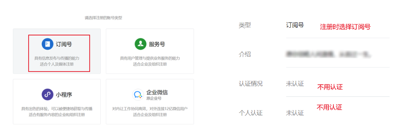

## 1.2 AI爆文变现方式
---
变现方式主要有：流量主，赞赏，接广告，软文带货

### 1.2.1 开通流量主和赞赏
1. 流量主：淘宝或拼多多搜索：“流量主”，大概50块500粉，不会影响账号流量

   100粉开通返佣商品，500粉才能开广告流量主，直接购买500粉。

   文中可以手动或自动插入广告，返佣商品。

2. 赞赏：群发原创文章3篇，才能开赞赏账户

   官方介绍在这：https://kf.qq.com/faq/170110yueMvA170110iIn2uI.html

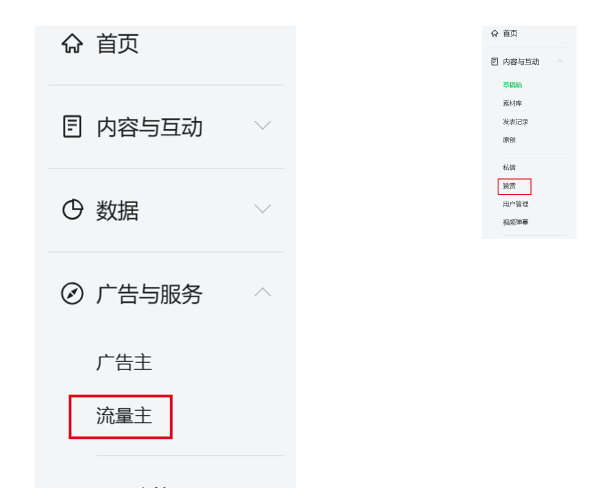

### 1.2.2 流量主如何提现？
流量主的财务管理中，绑定好银行卡，每月自动结算打款到你的银行卡中，绑定了邮箱会自动发账单到你的邮箱中。

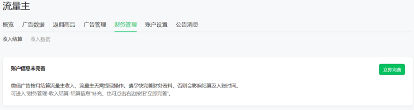

### 1.2.3 在哪里查看流量主收入？
- PC端：流量主
- 微信公众号：微信广告助手

## 1.3 如何一次群发多篇文章？
---
为了获取更多流量主收益，需要多发文章，每篇文章有3个广告，每天可以一次群发8篇原创文章，这样有24个广告位，收益达8倍。

那如何群发多篇文章呢？订阅号助手与电脑上分别如下操作：

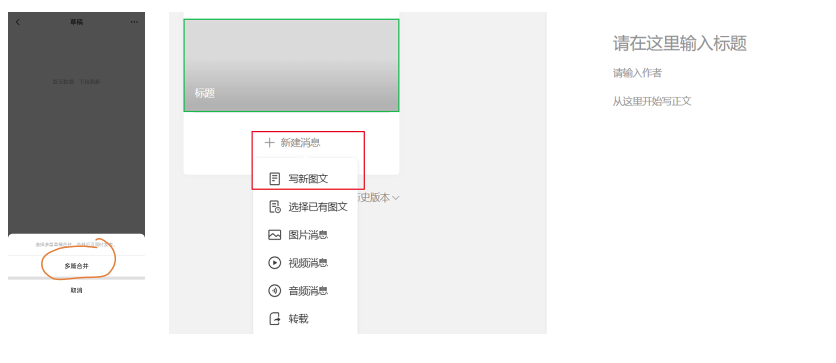

## 1.4 GPT准备
---
- GPT账号需要自己去准备，并解决网络问题，GPT 3.5与GPT 4.0都可以。
- 用Claude2或New Bing，文心一言也行，不过有些指令的效果不大一样，这里以GPT演示。


# 2. 如何找到爆文方向及合适选题
---
## 2.1 爆文的方向与分类
---
- 热点，情感，历史，法律，三农，养老金，穿搭，娱乐八卦，早安，鸡汤
- 新手不要写政治，历史类的建议写民国以前的，民国都不要写


## 2.2 爆文的热点选题
---
爆过的热点话题，短时间内还会爆，蹭热度罢了。

吴亦凡的话题，1个月，2个月，4个月前都是火爆的。


热点查询网站

1. 新榜热榜：https://www.newrank.cn/ranklist?period=weixin_day&from=301
2. 百度热榜：https://top.baidu.com/board?tab=homepage
3. 公众号10万+：https://www.wxkol.com/hot.html
4. 知乎热榜：https://www.zhihu.com/hot
5. 微博热榜：https://weibo.com/newlogin?tabtype=search
6. 头条系热榜：头条或抖音的热榜

在热点榜单上找到自己感兴趣或者符合自己定位的话题。

## 2.3 爆文的内容框架
---
### 2.3.1 标题与图片吸睛
标题和配图直接决定了文章的打开率，所以好的标题+配图非常重要。

文章配图：可以用AI绘画的图片，找几张放文章中，或者在AI绘画群中找别人不要的图片，不用自己画，节省时间，也不怕版权。


### 2.3.2 开头有悬念
标题和配图吸引读者打开文章，那开头首段就决定读者是不是愿意读下去，所以开头如何引人入胜，留下悬念和勾子非常关键。

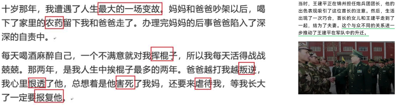

### 2.3.3 正文有逻辑，反转
文章的逻辑要通顺，要用大白话写文章，读者看的明白，情节要和开头有关联，有反转等，正文要解答读者的疑虑。

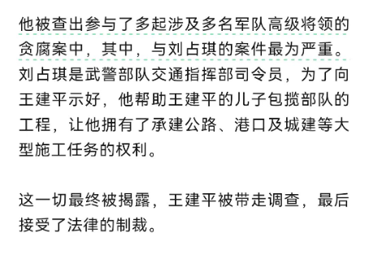

### 2.3.4 结尾有共鸣，和开头呼应
结尾要和开头呼应，引起读者共鸣，讨论，点赞评论转发。

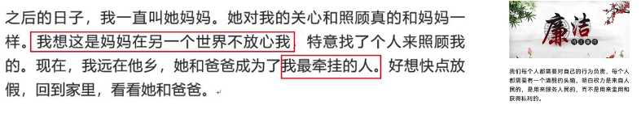


# 3. 如何快速用GPT写出爆文
---
> AI爆文最简单的方法：抄，超，钞。通过抄袭模仿，超越别人，最后产生收益获得钞票。

> 流程就是：从热点榜单或别人的爆文选题中抄，模仿，再逐步优化，产生爆文获得收益。

## 3.1 抄 → 模仿文章
---
### 3.1.1 查找低粉爆款的文章
要模仿别人的优质爆文，那怎么找呢？优先查找低粉爆款的文章，这里提供两个方法：

**方法一: 微信体系中找**

微信自带的”搜一搜”或”问一问”的热点，看一看精选，微信指数

1. 找几个爆文的公众号（低粉爆款），浏览文章列表，找到10天内5W-10W+的爆文，这个爆文就是你要用GPT改写的选题。

2. 如何找到更多热点文章：在每篇爆文的底部，有文章推荐，如果没有推荐，点赞就会出现“喜欢的内容列表”，点击5W-10W+的文章，重复以上过程，浏览他的文章列表，找10天内的爆文，这样文章越来越多，用GPT改写。

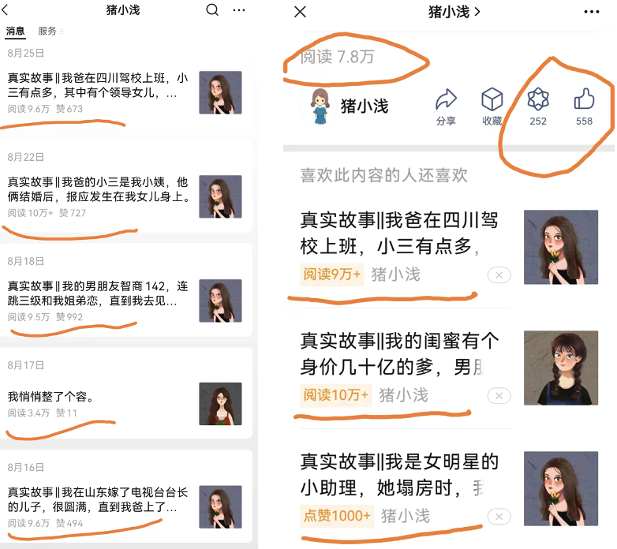

提示：GPT在这里是辅助写作，能快速帮助选题，写好框架，填充内容，以前需要2个小时写完的文章，现在可能只要10分钟，文章想要写的好，还需要人工润色，GPT写的文章用词比较正式，需要让他模仿口语。

**方法二: 低粉爆款查询网站**

这是收费网站，暂时可以不用，低粉爆款的文章可以在下面的微信体系中找到。

1. 极致了：https://www.dajiala.com
2. 次幂数据：https://www.cimidata.com
3. 西瓜数据：https://data.xiguaji.com

### 3.1.2 GPT模仿文章
这里提供一个最简单的步骤，一分钟内可以写完自己的故事文章:

1. 用上面的方法找到一篇热点文章，然后交给GPT总结文章的关键信息，GPT总结完之后，自己再适当检查修改一下，防止遗漏重要信息。

```
prompt:
请阅读这[[[[ ]]]]之间的内容，完整总结文章的信息，并给出关键信息列表，重点突出悬念和转折，文中人物的
个人特质和文中的有关数字都要总结到关键信息列表中
[[[[ 热点文章原文内容(这里如果提示超长，就用分批投喂) ]]]]
```
2. 把关键信息交给GPT，让它自动写新的文章，写的不满意，再告诉它如何优化。

```
prompt:
你是一个资深网络故事作家，帮我写一篇故事，要求1200字以上，要求语言生动，真诚，细腻，深情，有动作描写，
有对话，有紧张冲突激烈的情绪，语言是大白话，用第一人称描写，关键信息参考如下[[[[]]]]中的内容
[[[[ 关键信息列表 ]]]]
```

3. 经过上面的步骤，基本上能写出一篇文章，这时需要检查文章内容，并多次调教GPT写到满意为止。

### 3.1.3 GPT编写文章
步骤：给定一个选题，扩展情节，编写大纲，分段写正文，合并润色

1. 给定一个选题，prompt如下，复制到GPT中。

```
prompt:
请扮演一位情感故事作家，用150 字总结下面这篇文章，重点突出文章中的冲突、悬念和转折，
并模仿这篇文章的风格，命名为：风格一。
[[[[ 文章内容 ]]]]
```
2. 扩展选题

```
prompt:
[[[[ 第一步总结的内容 ]]]]
模仿一下上面这段话，写出 5 个相似的故事选题，让人觉得就是真实发生的事情，要让人非常感兴趣的，有强烈读下去欲望的句子，
开头要有伏笔和悬念，让人有阅读的欲望，文中要有反转曲折的情节，有紧张冲突激烈的情绪和对话，心理描写，动作和神态，要贴近生活，都是和普通人生活相关的事情。
```

3. 编写故事大纲

```
prompt:
[[[[ 挑选一个上面的选题 ]]]]
根据上面的内容，写一个 1200 字的短篇故事大纲，要求如:
1. 按照时间顺序讲述故事。
2. 比较接近现实，语言平实、生动，易于引起读者的共鸣。
3. 让人觉得就是真实发生的事情，要让人非常感兴趣的，有强烈读下去欲望的句，开头要有伏笔和悬念，让人有阅读的欲望，
  文中要有反转曲折的情节，有紧张冲突激烈的情绪和对话，心理描写，动作和神态，要贴近生活，都是和普通人生活相关的事情。
```

4. 分段写正文

```
prompt:
[[[[ 大纲每一段的内容 ]]]]
写出这部分故事，限300 字以内，要求:
1. 请参考风格一，采用第一人称口述的风格，语言平实
2. 语言平实、生动，易于引起读者的共鸣
3. 内容要多描写行为、动作、语言，不要有过多描写内心想法
4. 不要扩展其它内容
```

5. 合并润色
将以上分段写的文章合并起来，最后要手工删减，修改文案，处理好段落之间的衔接，让文章通顺。

## 3.2 超 → 优化文章
---
按照 *2.2* 爆文特点来优化。

需要优化的主要有标题，图片，首段，和反转，结尾。

### 3.2.1 优化标题
标题可以直接用你模仿的爆文的标题，不会查重

#### 3.2.1.1 GPT模仿爆文标题
让GPT学习5个爆文标题，总结特点，并模仿。

1. 学习爆文标题：

```
prompt:
以下[[[[]]]]中是5个网络爆文标题，你要学习总结出他们的特点。

[[[[

我靠养猪供妹妹考研读博，她结婚我最后知，去婚礼见着新郎我傻了

春节，婆婆用一桌菜换我30万拆迁款，老公愤怒掀桌：自私！

离婚在我家借住，老二叫嚣着让我交房租，家人直接怼的他闭嘴

儿子替城里媳妇做早餐，乡下婆婆看不惯，这样替受欺负的儿子出气

我调到外地工作，老公和妹妹竟然趁机偷情，我该不该曝光他们

]]]]
```

2. 写标题：

```
prompt:
用上面总结的爆文标题特点，帮我为下面[[[[]]]]中的文章写10个吸引人的标题，要让人有点击标题的欲望。

[[[[ 原文 ]]]]
```

GPT写完10个标题后，就可以从中挑选一两个，手工改改就能用。

#### 3.2.1.2 「易撰」爆文标题助手
易撰爆文标题助手通过特定算法自动生成新的标题，原创度很高，新手用它来辅助写热点话题的标题学习很不错，新手可以尝试一下。

## 3.3 小技巧：GPT分批投喂
---
GPT3.5 每次最多投喂2000个中文，超过2000个中文会提示超长，这时我们可以采用分批投喂。

具体命令可参照下面的描述，大家可以根据需要自行优化，如下：

```
prompt:
现在需要你整理一些内容，由于内容的字数太多，我需要分批发送给你，你要分批接收。一定要严格按照下面几点要求执行。
1、内容会用 [[[[]]]] 包含起来，以便让你识别。
2、每发送一批内容，你收到后只需要回复“已收到”，不要做任何处理！
3、内容全部发送完后我会明确告诉你，“发送结束”。
4、收到“发送结束”的指令后，你要完整总结文章的信息，并给出关键信息列表。
如果你听明白了，就告诉我开始发送。
```


# 4. 爆文写作中如何避坑
---
为了提高文章的推荐阅读量，进入流量池，在写完文章后需要修改敏感词，检测文章原创度等。

1. 检查敏感词：有敏感词会导致文章被封杀，有敏感词就用”同义词”替换或者换个写法，句易网 - 2023年最新广告法淘宝抖音违禁词敏感词在线查询检测工具

2. 易撰 查重，文章质量检查(每天免费查3次，够用)：易撰自媒体工具_让内容创作更高效

3. 原创检测：原创度检测工具,在线原创检测,相似度检测，(每天免费查5次，够用)，易撰中也有原创检测

4. 文中的人物不要用真名，不要带企业名称，不要带竞品名称（如公众号文章中不要频繁提淘宝，支付宝等）

5. 图片不要用版权图片，不要带水印，不要用名人照片，不要用不合规的图片等。

6. 打开【原创】、【文中广告】、【不要关闭平台推荐】，关闭【文章合集】，建议关闭【赞赏】，一般赞赏人数不多，会影响底部广告展示。

7. 不要曝光自己的公众号，会被同行模仿洗掉，甚至投诉，举报。

8. 爆文全平台同步

在公众号上写的爆文，如果可以一文多发，同步发在头条，公号，百度号，知乎等平台，就可以实现一鱼多吃，白捡流量，说不定没有在公众号爆发，在头条就爆发了，这个说不定。

发布时间：建议在早中晚，和睡前，就是你什么时候玩手机的时候，你就什么时候发， 这个时候人多，阅读率会高很多。

同步工具：
+ 蚁小二：https://www.yixiaoer.cn
+ 微小宝：https://www.wxb.com
+ 搜索chrome浏览器插件（微信公众号同步助手）或链接：https://chrome.google.com/webstore/detail/hchobocdmclopcbnibdnoafilagadion

挑选一个顺手的即可。


# 5. 如何让文章快速入池
---
AI爆文能否入池，依赖于算法推荐，没有100%的概率能入池，看运气，有的账号能一天入池，大部分账号在7-10天，也有一个月半年都没入池的，这是AI爆文的玄学，我们无法掌控，但是有些方法在客观上可加速入池，给参考如下：
1. 找对标模仿，在一个领域保持日更，未入池之前，每天一篇，入池后可以加量。
2. 虽然新号也能入池，但是有老号更好。
3. 标题最重要，让人想点击，你平常被吸引进去的标题就是好标题，再加上有诱惑力的标题上的小图片。

如何判断文章入池了：
1. 文章阅读量超过1000就是入池了，或者比往常阅读量多了几倍
2. 文章的阅读来源中，推荐量占比在80%以上

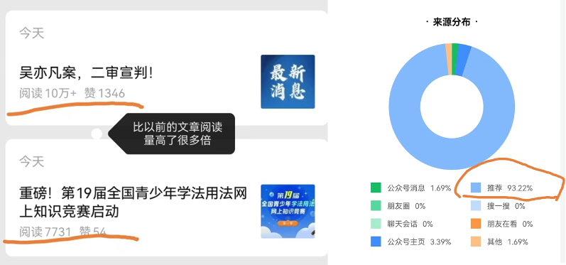


# 6. 如何提高单篇文章的广告收益
---
说到广告收益，广告收益的算法非常复杂，而且广告算法一直在持续迭代，但主要指标是：曝光量和广告曝光的停留时长和点击量。

最重要的是文章的阅读量，点赞，转发量，这个是最重要的指标，量大自然收益高。

但是还有一些小策略能提高广告收益，以下列举几个方法。

提醒：一定要通过正规的方法提高广告收益，不要用违规刷广告的方式，有可能会导致文章的广告被关闭，甚至封号。

1. 不要自己或组团点击广告，不要诱导点击广告

   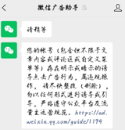

2. 一定要写好文章，要让读者看完，底部广告单价非常高

   可以在开头提醒一下读者，文章底部有惊喜，在文章底部发福利等，
   关闭【赞赏】和文章合集，以便底部广告能展现出来，
   或者在底部放一张有吸引力的图片，或者视频，让读者停留的时间稍微长一点，也许能增加广告的曝光时长。

3. 提高广告的自然点击率

   此方法不建议新人使用。

   在流量主中，可以屏蔽与自己公众号内容无关的广告主和行业，比如你的用户群体是老年人，那可以屏蔽掉一些学AI绘画，或游戏开发的广告，这样的广告老人基本上不会点击，
   如果是同城交友的美女图片，中老年男人可能会点击更多，从而收益更高。

   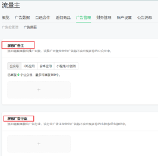

4. 文章字数要求

   文章字数要在1200字左右，能确保有2条文中广告，加上底部广告，这样每篇文章有3条广告，收益就比较高。

5. 其它变现方式（除流量主）

   AI爆文的变现方式，除流量主之外，还有这些变现方式：赞赏，接广告，软文带货

   


# 7. 常见问题
---
1. 公众号多久能入池？

   一般阅读量超过1000就是入池了。

   快的3-5天，慢的1个月，不确定时间，和你写的内容有关

2. 不勾上原创有没有影响？

   不是原创，也有推荐流量，但是广告的单价低。

3. 家人的公众号，我来运营，要扫码登录怎么办？

   公众号后台绑定你的微信为运营者，订阅号助手中就能选择你运营的公众号，可以快速切换账号。

4. 能不能公开账号，给同行看？

   尽量不要，现在我们的策略是模仿，别人看到你的账号会模仿你洗稿，这样你的流量就少了。

5. 一天发多少篇比较好？

   新号一天一篇，入池了再增加数量。

6. 需要写垂直领域吗？

   没有流量的时候随便写哪个领域，有流量了再垂直一个领域。

7. 文章字数要写多少？

   建议写1200-1500字，800字有一条广告，1200有两条广告，1500以上太长，读者不愿意看完，完读率不高，底部的广告无法展现。

8. 参考账号

   以下这些账号是大号，可参考，但是找对标文章，还得找低粉爆款的文章，不要找大号，大号权重高，运营人员的能力强，模仿不来，小号也容易被洗掉，这里不推荐小号了。

   + 情感：猪小浅、简说美篇、写故事的刘小念
   + 养老金：职言心语、小白玩职场
   + 军事：歆歆观察
   + 三农：老农看农村，三农观察
   + 早安：每日早安问候，早安祝福语问候
   + 鸡汤：木木在成长
   + 娱乐：娱乐爆姐
   + 历史：文史道
