# 0.Android 程序员还有未来吗？
---
今年（2021年）是我参加工作的第 8 年，也是做 Android 程序员的第 8 年。这些年我结识了很多做 Android 的朋友，有人做了两三年之后就转行了，也有人升职不再做一线开发，也有人转成了前端/后端开发。

参加工作的前两年，我也不知道能做多久 Android 开发。当年知乎的问题关注列表里，不少问题是：Android 程序员饱和了吗？Android 程序员还有未来吗？我现在可以肯定的说 2014 - 2015 年 Android 开发很有前景。但是对于 2021 年的 Android 程序员来说，未来还会好吗？

我想从下面两个角度来回答：

## 0.1 Android 还有未来吗？
---
在智能手机领域， Android 设备的占比已经接近 90%。可以说是统治了移动端操作系统。随着物联网和智能设备的发展，现在电视，手表甚至汽车，几乎所有生活中的智能化设备首选的操作系统都是 Android。

即使未来 Android 设备的增长放缓，但是在几十亿存量设备的市场里。我们也不用担心 Android 在未来 5 - 10 年的发展前景。更何况目前还看不到任何 Android 系统衰败的迹象，反而是在各领域高歌猛进。

## 0.2 Android 程序员还有未来吗？
---
几年前流行一个段子，说 Android 程序员只要在面试中说得出 Activity 生命周期就能通过。可见市场 Android 开发的缺口有多么大。到了现在，情况可以用另外一个段子解释：”面试造飞机，工作拧螺丝”。目前 Android 开发的面试内容和难度都远远超过了当年，Android 开发的工作也越来越难找，为什么会出现这样的情况？

实际上并不难理解，Android 已经发展了很多年，已经培养了大量的初级 Android 工程师。现在市场里缺乏的是中高级 Android 程序员，初级 Android 程序员早已饱和。面试问题变的越来越难，就是为了筛选出中高级程序员，或者有希望成为中高级程序员的人。
对于 Android 程序员个体来说，能进阶为中高级 Android 程序员才有未来。如果工作能力一直停滞不前，就会越来越难。可是如何进阶为中高级 Android 程序员呢？

我觉得答案是：长期持续提升自己，包括技术能力，认知能力与职场综合能力整体的提升。职业发展是逆水行舟，不进则退。只有持续的学习，才能让自己保持不掉队。只有持续的做到比大多数人好，才能越走越远。

为此，我写了这本 Android 开发的进阶手册，希望能把程序员进阶这事讲的更清楚一些。这本书从认知，知识，职场三个方面的结合来帮助你提升自身能力。

认知篇中会介绍很多解决问题的思路，还有一些能让你做到不断自我提升的方法，真正做到授之以渔。

知识篇中包含了 Android 领域里最核心的一部分内容，基本是任何一个 Android 程序员都必须掌握的。虽然市面上已经有很多纯粹的技术书籍，但是我的写法跟他们并不一样，我更倾向于通过自我实践的学习，而不是直接把知识点讲出来。希望可以带给你不一样的阅读体验。

职场篇是我自己多年职场的总结，从职场态度，沟通方法到需求评估，再到何时跳槽，以及如何准备面试，选择 Offer 等等，甚至还有如何理财的内容。这些是我个人的看法，希望能给你带来一些新的想法。或者在你不知道该如何做决策时，能给你一个参考。

这本书里我把 Android 开发的进阶分为了三个阶段，初级，中级和高级。这是为了让读者更容易找到开始阅读的章节，现实中这三个阶段并不会有明确的划分。在进行阅读之前，你可以先过一下整体的目录，如果你对某个阶段的内容早已了然于心，那么可以跳过这个阶段阅读。如果整本手册都没有感兴趣的话题，当然也就不必再看下去了。

最后，如果你觉得这本手册写的还不错，或者有什么想法与建议想跟我交流的话，欢迎关注我的公众号：SkyKai ，期待你的反馈！


# 1.初级工程师进阶
---

## 1.1 认知篇
---

### 1.1.1 遇到问题应该怎么办？
---
工程师成长的过程就是从遇到问题，到解决问题，最终带来能力提升。不同人面对问题时会有不同的应对方式，其中有两个特别极端的例子：

第一种是从不主动思考，凡事都求助别人的“伸手党”。不管是朝夕相处的同事和朋友，还是素未蒙面的网友，一定会把你问到崩溃。这类人不善于独立思考，经常提出让人啼笑皆非的问题，最终导致没人再愿意帮助他。

第二种是从不主动提出问题，遇到无法解决的问题也从不向别人请教的同学。可能是怕麻烦，也可能是性格比较内向。总把问题闷在心里，拖到底也无法解决问题。

优秀的工程师既要做到尽量独立解决问题，也要懂得如何提问。为了避免出现上面两种情况，我总结了两个要点：

#### 1.1.1.1 善用搜索引擎
---
**用谷歌还是百度？**

其实只要能找到想要的答案，用谷歌还是用百度都可以。对于比较常见的问题，比如：“如何显示圆形图片？”。这样的问题用百度一般可以快速解决。

英文好的同学可以常用谷歌，还有在搜索复杂问题或高质量文章的时候，建议用谷歌。

**使用关键词组合搜索**

使用搜索引擎，最好关键词进行组合进行搜索。比如：图片加载。在搜索的时候最好写：Android 图片加载，或者 Android load image。这样搜索引擎就会更容易理解你的想法。

如果搜不到想要的答案，可以换几种关键词组合来进行搜索。也可以增加或者减少组合里的关键词，尝试从搜索的结果里来找到你想要的答案。

**使用搜索工具**

我们经常会遇到有时效性的问题，比如跟最新发布的 Android 版本相关的问题。那么在进行搜索的时候，我们可以选择一个月内收录的内容，通常可以快速找到结果。

#### 1.1.1.2 学会提问
---
如果遇到搜索解决不了的问题，懂的如何提问也可以帮助你快速解决问题。不要提问太宽泛的问题，比如：“我的程序崩溃了怎么办？”。

另外还有一种同学，在问问题之前，会把所有的业务逻辑，实现细节说明的非常详细。但实际上这样会浪费大家不少时间。

所以在提问之前，请简明扼要的描述问题，以及你尝试了哪几种办法解决，这样别人在帮你判断问题的时候才会更有效率。


### 1.1.2 优秀工程师离不开 GitHub
---
GitHub 是全球最流行的开源社区与代码托管工具。优秀的项目都在 GiHub 上，它能帮你找到合适的开源项目快速实现需求，你也可以通过学习优秀开源项目来提升自己的能力。

#### 1.1.2.1 注册 GitHub 账号
---
首先一定要注册一个 GitHub 账号。

虽然在 GitHub 上用户不需要注册就可以搜索与下载开源项目。但是如果你有账号的话，你可以收藏（star）你喜欢的项目，也可以在使用开源项目中遇到问题后给项目负责人提问（issue），还可以发布或者参与到开源项目中去。

记得一定要遵守 GitHub 的社区公约，以及每个开源项目的提问规范与代码提交规范。另外你还可以关注（follow）很多优秀的工程师，看看他们日常在关注哪些项目，以及他们最新的动态。


#### 1.1.2.2 在 GitHub 搜索开源项目
---
GitHub 的搜索功能非常强大，可以帮你找到很多开箱即用的开源项目，还有很多优秀项目可供学习，通常我会搜索以下几种类型的内容：


搜索结果出来之后，还可以按照 star 数量，编程语言进行筛选。合理使用 GitHub 的搜索功能经常可以让你事半功倍。

#### 1.1.2.3 关注 GitHub Trending
---
GitHub 还有一个很重要的功能，就是项目趋势（Trending）。这是一个按照特定时间（比如：一周）内或者 star 数量最多的项目排行榜。这个榜单基本上代表了最近最流行的项目趋势，我一般每周都会去看看有什么有意思的新项目。

这个榜单的地址是：https://github.com/trending

搜索之后，还可以按照编程语言，时间来进行排序：


### 1.1.3 反编译不是高级技巧
---

#### 1.1.3.1 为什么要学习反编译
---
说起“反编译”，有同学会觉得很高深，以为是很高级的技巧。但是实际上并不是这样的，反编译工具使用起来实际上很简单。并且对于 Android 来说，混淆后的代码也并没有完全无法阅读，而且一些 Android 关键的组件（比如：Activity）通常未被混淆。

反编译有两个很重要的使用场景：

1. 在项目开发中，我们经常要确认某一个类是否打包到 apk 里面，或者需要确认代码混淆是否生效。这个时候利用反编译就可以很容易的验证。

2. 我们经常会遇到产品经理要求实现某某 APP 里的某项功能，如果不知道该怎么实现的话，可以把对应的 APP 进行反编译之后，找到对应的模块进行研究。通常可以很快找到实现思路。

实际上任何一个工程师都应该了解逆向技术，通过阅读反编译后的代码，能很好的锻炼工程师的代码理解能力。

#### 1.1.3.2 反编译工具
---
反编译 apk，现在只需要下载 jadx 就可以了。下载地址是：https://github.com/skylot/jadx/releases/tag/v1.2.0 （优秀的项目都在 GitHub 上，这句话不假）。

下载之后，把 zip 包解压，找到 /jadx-1.2.0/bin/jadx-gui 。双击打开即可，然后把你想要反编译的 apk 拖拽进去，接下来就可以在软件中查看 apk 中的代码了：


你还可以点击左上角：文件 -> 另存为 Gradle 项目，导出反编译代码后，使用 Android Studio 更有效率的阅读。

有些 apk 在反编译时软件会报错或者崩溃，这是因为 apk 可能进行了加壳。加壳是保护代码被反编译的一种技术手段，当然也有两种办法可以解决：


第一种，搜索一些脱壳工具或者方案，自己对 apk 进行脱壳，然后再进行反编译。不过这种方法比较耗时耗力。

第二种，这个方法就简单多了，直接到 GitHub 上搜索： XX 反编译。或者通过此 apk 的包名，或者关键类名进行搜索，也许就能搜索到别人上传的反编译代码。

### 1.1.4 学会调试
---

#### 1.1.4.1 基本调试技巧
---
调试（Debug）能帮我们看清程序运行中的状态，通常能帮我们快速定位问题，提升开发效率。这里介绍一下最基本的调试技巧：

这里我们用一个最简单的初始 demo，第一步先确定三个断点位置，第二步点击调试（Debug）图标，之后就等待程序自动运行到断点位置就可以了。

下图就是在运行到断点位置的截图。

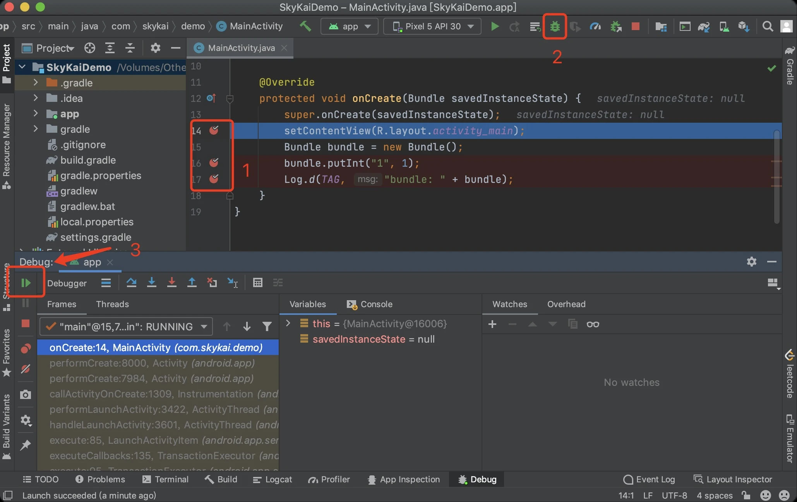

程序运行到第一个断点之后，如果想继续运行程序，则点击图中第三步的箭头即可。程序则会运行到下一个断点处：


运行到第二个断点的时候，可以看到红框里面板的标题是 Watches，点击 + 号之后，你可以输入想查看的变量，还可以输入代码实时运行。

这里我输入了一行代码，然后再点击运行，就可以在下图看到我们实时输入的数据已经被添加到 Bundle 里去了。

以上只是最基础的调试手段，还有一些跳入与跳出方法，单步调试，设置断点执行条件等操作这里就不再赘述了，大家可以通过搜索自行学习。

#### 1.1.4.2 系统源码调试
---
往往在调试的过程中，我们还需要对系统源码进行调试，但是往往方法跳进去之后，发现代码行号与堆栈对不上去。这个是因为各版本的 Android Sdk 代码不一致导致的。解决这个问题的办法就是，保证你项目 build.gradle 文件里配置的 compileSdk 与你运行程序手机的 Android Sdk 的版本一致即可。

在下图的截图里，我的 compileSdk 是 30 ，虚拟机也是 API 30，可以看到断点可以正确的触发，堆栈显示的代码行号也是正确的。


### 1.1.5 对自己的代码负责
---

#### 1.1.5.1 经常使用自己负责的产品
---
我曾经遇到过不少这样的工程师，代码写完之后就开始做自己的事情，比如刷刷算法题，或者看看技术文章提升自己。这些行为本身并没有什么错，只是如果你只负责写代码，而不去多使用自己负责的产品，对自己负责的产品也没有了解的话，那么各种问题一定会找上门来。

如果你不想总是被老板，产品拿着问题来找你的话，你一定要经常使用自己负责的产品。
这样你就有机会第一个发现问题，并且默默修复掉。被别人发现的 Bug 越少，别人会觉得你越靠谱。

而且你对产品越熟悉，越可以在评估新需求时考虑到更多风险点，从而在代码设计时也能避免更多 Bug 。一些工程师甚至会把自己负责的产品当做自己的孩子看待，产品中各种细节都了解的相当透彻。

优秀的工程师还会经常体验竞品，熟悉他们所用的技术，并且留意他们的新功能。没准不久之后产品经理就会要求上线类似的功能，而你早就已经想过该如何实现了。

#### 1.1.5.2 不要依赖测试同学
---
自测也同样重要，我曾遇到过有的工程师把代码写好之后，直接丢给测试同学，自己从来不自测，导致测试同学发现很多 bug，然后反复沟通，修改代码，回归测试。不仅浪费了时间，还搞的大家很不愉快。

测试同学很重要，但是绝不能依赖测试同学。交付给测试同学的代码，也一定要进行全面的自测。当测试同学测出 bug 的时候，也应该反思自己为何没有覆盖到这个问题，并且优化到下次的自测流程中去，这样才能写出质量更高的代码。

更激进的事情是，在我工作过的一些公司中，甚至没有测试这个岗位。所有的测试工作都由工程师与产品经理一起进行测试。虽然这样增加了工程师与产品经理的工作负担，但是实际上在某些比较专业的技术产品中，这样做可以省去大量与测试同学沟通的时间，反而优化了工作效率。

## 1.2 知识篇
---

### 1.2.1 Activity 与 Fragment
---

#### 1.2.1.1 最核心的 Android 组件
---
Activity 是 Android 中最核心的组件，通常一个 Activity 就对应一个可以交互的页面。当我们用 Android Studio 创建一个新的项目时，会自带 MainActivity 作为程序的入口。Activity 承载了很多重要的功能，包括：显示UI，处理交互，生命周期回调，状态保存等等。

日常开发中，如果对 Activity 的理解不深刻的话，很多闪退，卡顿，数据错乱等问题就会变的无从下手。而且在 Fragment 组件出现之后，Activity 配合 Fragment 的使用场景越来越多，使用起来也变得更复杂。

不过很多问题都是因为不理解 Activity 的生命周期，启动模式和运行状态导致的，掌握这些知识之后，问题自然而然就会变少了。

#### 1.2.1.2 Activity 生命周期
---
Activity 的生命周期基本已经被各种资料讲烂了，出现频率最高的就是下面这张图：


这张图来源自 [Android 官网](https://developer.android.com/guide/components/activities/activity-lifecycle) 的图，很清晰的展示了 Activity 的生命周期，很多书籍照搬了官网的内容。

不过我并不打算这样做，比起看图，我觉得通过自己的实践来学习 Activity 生命周期更有效：

首先，我们需要写一个仅有两个 Activity 的 Demo，第一个 Activity 里有一个按钮（Button），点击之后会跳转到另外一个 Activity。通过在两个 Activity 里打印生命周期的回调，我们就可以很清晰的理解某些场景下 Activity 的哪些生命周期会触发了。

注：A，B页面的启动模式均为默认的：standard。

一、应用第一次启动时

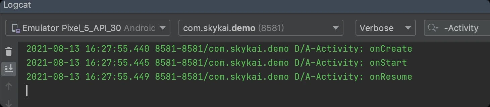

二、A 页面点击跳转 B 页面时


三、从 B 页面返回 A 页面时


四、A 页面展示时，点击 Home 建返回时


五、第四步之后，再点击图标进入 A 页面


从图中可以清晰的看到各阶段 Activity 的回调顺序，是不是比官网的图更加清晰？此外，你还可以在设置中打开 “不保留进程“ 再进行测试一下，看看是否回调会有变化？

推荐你一定要实践一下，通过自己实践的方式获取的知识，往往比被动输入理解的更为深刻。

#### 1.2.1.3 Activity 的启动模式
---
学习启动模式之前，我们先来聊一个概念：Activity 栈。在上一节的例子里，从 A 页面点击按钮跳转到 B 页面之后，这两个页面就构成了一个 Activity 栈，结构如下图所示：


不同启动模式的 Activity 会在栈中有不同表现，启动模式共有 4 种，分别是：standard，singleInstance，singleTask 与 singleTop。使用起来很简单，在 AndroidManifest.xml 对应的 Activity 标签里配置 launchMode 即可。

四种launchMode 对应行为如下：

+ **standard**：标准模式，也就是最普通的正常打开，即在栈顶打开新的 Activity 。

+ **singleInstance**：单实例模式，会在另一个单独的栈中打开 Activity。

+ **singleTask**：单栈模式，同一个栈中只允许存在一个对应的 Activity ，在打开页面的时候，如果栈中不存在此 Activity，则在栈顶打开。

> 如果已存在，则展示此 Activity，调用此页面的 onNewIntent() 方法，并销毁此 Activity 上方所有页面。

+ **singleTop**：栈顶复用模式，同一个栈的最顶部只允许存在一个页面实例，重复打开这个 Activity 时，不会创建新的 Activity，同时回调此 Activity 的 onNewIntent() 方法。

我们用一个 Demo 更直观的演示下启动模式的行为：A，B 页面配置为 standard，C 页面配置为 singleInstance，D 页面配置为 singleTask，E 页面配置为 singleTop。

为了方便演示，我在万能的 GitHub 上通过搜索 Activity Task，找到了一个可以实时展示应用 Activity 栈的开源项目：https://github.com/rome753/ActivityTaskView。

在此项目的基础上进行简单修改之后，得到满足我们使用的 Demo，测试后结果如下：

一、A -> B -> B -> A

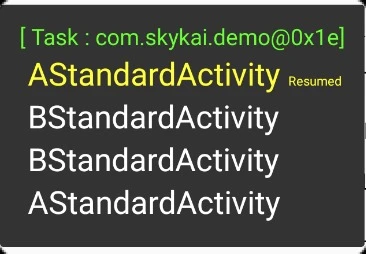

二、A -> B -> C -> A


三、A -> B -> D -> B -> A -> D

当只打开到 A -> B -> D -> B -> A 时：


这时候再打开 D，可以看到 D 上面的 Activity 全部被销毁：


四、A -> B -> E -> E -> B -> E


虽然在过程中启动了两次 E ，但实际上 E 作为 SingleTop 则不会被重复启动。

启动模式的应用场景：

熟悉启动模式之后，我们来聊一聊这几种启动模式在项目中的使用：

+ **singleTask**：最常见的就是 APP 的首页 Activity，通常从首页点击进入二，三级页面之后，如果需要实现返回首页的功能，则恰好满足 singleTask 的场景，回到首页的同时自动销毁二，三级页面。

+ **singleInstance**：对于某些第三方 sdk 来说这个启动模式比较好用，例如支付 sdk 的支付页面。

+ **singleTop**：使用 singleTop 的关键是不希望栈中同时存在连续的相同 Activity，实际项目中使用场景较少。而且使用时要格外注意 onNewIntent() 的处理。

#### 1.2.1.4 理解 Fragment
---
Google 最早设计 Fragment 的初衷是为了适配横屏平板，Fragment （片段）可以让竖屏应用与横屏平板使用相同的代码。虽然直到今年（2021）Android 平板还远未成熟，但是 Fragment 在 APP 中的使用已经非常广泛。

Fragment 必须嵌套在 Activity 或者其他 Fragment 中使用，拥有自己的生命周期，Fragment 栈管理是交给 Activity 做的，Fragment 的添加和移除完全有开发者自行控制，在日常开发中提供了很大的想象空间。

Fragment 的出现有好有坏，好处是让页面可以有比 Activity 更轻量的组织方式，从而带来很好的复用性，坏处是复杂的嵌套让一些问题变的难以排查。整体来说 Fragment 的好处远大于坏处。

目前 Fragment 最常用的使用方式是：每个业务页面通过 Activity + Fragment 的方式进行组织，UI 部分全部由 Fragment 处理，Activity 只充当容器，栈管理，生命周期回调等作用。

这样做的好处是 Fragment 可以自由的迁移到任何 Activity 去。例如有些 APP 首页是由几个 Tab 按钮对应几个 Fragment 构成的，如果某一天需要把一个二级页面的内容，放到首页的 Tab 里，这时候如果二级页面的内容是通过 Fragment 承载的，那么迁移起来就变得非常容易了。

### 1.2.2 Handler 消息机制
---

#### 1.2.2.1 无处不在的 Handler
---
我不打算像其他教程那样按部就班的来讲 Handler，在开始认识 Handler 之前，我们先回到 1.4.1 的调试 Demo 里，这次我们在 MainActivity 的 onCreate() 断点触发的时候，我们顺着堆栈往下找的话，就可以看到 Looper 与 Handler 出现了，见下图：


实际上在应用运行中，在任何时候打印主线程的堆栈，都可以看到 Looper 与 Handler，因为在应用最早的启动阶段，主线程的 Looper 就已经启动了无限循环来循环处理消息。Handler 在源码中的使用相当广泛。

Handler 有两个主要用途：

1. 跨线程发送消息。

2. 在未来某个时间执行 Message 或者 Runnable。

第一种用途有一个比较经典的用法，就是在子线程更新 UI。在 Android 的设计中，所有对 UI 的更新都需要在主线程操作，如果在子线程操作 UI 的话，就会遇到下面的报错：


也就是说只有创建 View 的线程才可以操作此 View ，View 都是在主线程进行创建，所以在其他线程更新 View 的时候程序会直接崩溃，这个时候就需要使用一个绑定了主线程的 Handler 进行更新了，代码如下：


同样去除红框内代码后，运行程序就会出现崩溃。

第二个用途同样使用广泛，比如实现倒计时，定时刷新与延迟执行等需求，用法比较简单，这里就不再举例了。

#### 1.2.2.2 理解消息机制原理
---
消息机制作为 Android 应用层最基础的之一，是每个 Android 工程师都需要掌握的核心知识，同时也是面试中的高频问题。想搞清楚 Handler 原理就避免不了阅读系统源码，我通常使用下面两种方式组合来阅读源码：

1. 通过代码入口不断进行追踪。

2. 通过断点调试确定程序执行的流程。

首先，我们需要写一个简单的 Demo，核心代码如下：


功能很简单，点击按钮之后触发 sendMessage() 方法中的 mainHandler 发送 Message，之后在 MainHandler 的 handleMessage() 方法里进行更新 TextView 的 UI，程序运行后，点击按钮，结果如下：


可以看到消息成功收到了，我们先来看看发送消息的 sendEmptyMessage() 方法里的实现：


几次方法跳转之后，会到 sendEmptyMessageDelayed() 方法，通过 Message.obtain() 获取到一个 Message 对象，把 what 赋值到 msg.what 上，然后再调用 sendMessageDelayed() 方法，之后调用到了 MessageQueue 的 enqueueMessage() 方法：


这个方法显示把 msg.target 设置成了当前的 Handler 对象，然后再调用 enqueueMessage() 方法把 Message 添加到消息队列（MessageQueue）里，我们转向 enqueueMessage() 方法中：


通过发送消息之后，通过断点调试定位到 enqueueMessage() 方法中最重要的就是上图红框中的代码，这里其实是把我们需要发送的 Message 放在前一个消息的 next 的位置，然后整个方法执行结束，sendEmptyMessage() 方法也运行完了。

整个流程就是把我们要发送的 Message 放入了 MessageQueue 的队列中就结束了，并没有看到消息是如何发送的。先不用着急，我们再来看看 handleMessage() 是怎么接收到消息的，首先在 handleMessage() 里加上断点，堆栈如下：


堆栈很短且似曾相识，红框里的那行堆栈跟 2.2.1 的截图一致。我们点进去看下这个 Looper 的 loop 方法：


可以看到这里就是拿到 msg.target 去处理消息，这里的 target 就是刚刚在 enqueueMessage() 方法里设置的 Handler，也就是我们的 MainHandler，但是这个 msg 是哪里来的呢？我们顺着代码往上看：


从红框里的代码可以看到，方法最开始从 Looper 里拿到了 MessageQueue 对象，然后执行了一个无限循环，循环的开头就是从 queue 里拿出了 msg 对象进行处理。最后调用 msg.target.dispatchMessage() 方法之后，我们就收到了消息。

那么还有一个问题就是 Looper 的 loop() 方法是何时调用的呢？回到 handleMessage() 的断点，我们可以看到 loop() 方法的调用方是：main:7656, ActivityThread (android.app) 。转到这个方法中我们可以看到：

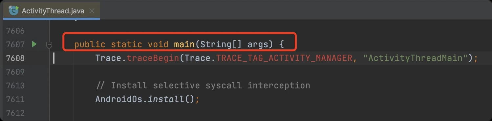

这是一个 main 函数，也就是 Java 程序的入口函数。实际上这里就是 Android 应用程序的入口，也就是说 Looper 在应用启动的时候就已经初始化完成，之后就开始一直循环处理消息，直到应用退出。

好了，到这里我们就基本了解了 Handler 消息机制，简单总结一下：Looper 通过不断的循环从 MessageQueue 队列里拿出需要处理的 Message 并交给对应的 Handler 处理。Handler 在整个流程中负责发送消息与处理消息。

最后再给大家留一个问题：以上我们对 Handler 的分析都是在应用的主线程，请问子线程可以创建 Handler 并发送与处理消息吗？大家可以动手尝试下看看，这个问题我会在 2.6.2 里结合线程再进行解答。

### 1.2.3 理解 View 体系
---
不论是 Android 平台还是 iOS 平台，每个业务开发最常接触的都是各种 View 组件，通过搭建不同的 View 组件来完成各种页面。假如我们站在用户角度来看的话，日常遇到的各种页面展示错乱，触摸事件冲突等问题，基本都是由于对 View 的使用不当导致的。所以深入理解 View 体系就变得非常重要了。

这一节我们就来重点讨论 View 的绘制流程与触摸事件的处理机制。

#### 1.2.3.1 View 的绘制流程
---
在研究 View 的绘制流程之前，我们先来回想下小时候是怎么玩积木游戏的：一般会先把大小类似的积木分门别类放好，然后再把积木各个部件组装在一起，最后再把零部件组装在一起，完整积木就拼接完成了。

如果我们按照搭积木过程来推测 View 的绘制流程的话，首先要把整个页面的各种 View 测量好，然后再确定好各个 View 在页面中的位置，最后再把整个页面绘制出来。实际上到底是不是这样呢？我们用一个 Demo 实际测试一下：

首先我们先实现一个空 View ，并且在几个回调方法里加上日志：


注意日志一定要添加到方法的第一行，然后我们再创建一个空 Activity，下面是这个 Activity 的布局文件：

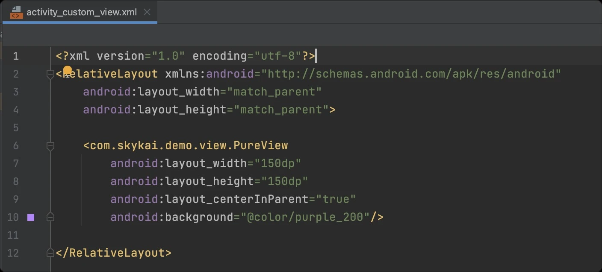

注意这里我们给 PureView 设置的宽高是 150dp，并且添加了一个紫色的背景，并且我们希望 PureView 可以居中显示。好了，我们现在来运行 APP，可以看到日志输出如下图：


看来跟我们的猜想差不多，一个 View 的绘制过程中，先经过几次测量（measure），然后在进行布局（layout）最后再进行绘制（draw）就完成了。运行结果的截图如下：


但是现在我们还是不明白这几个阶段具体做了什么事情，假如我现在把一部分流程省略会产生什么结果呢？我们先把 onMeasure() 里调用父类 onMeasure() 的代码注释掉：


再次运行程序，发现竟然崩溃了，堆栈如下：


这个异常的意思是说：这个 view 没有再测量的时候调用 setMeasuredDimension() 方法，导致获取不到 view 的宽度，所以直接崩溃了。那我们去看看刚刚注释掉的方法里是怎么调用的：


可以看到方法里直接调用了 setMeasuredDimension() 并且注释中也明确说明了，如果你覆盖了这个方法，则一定要调用 setMeasuredDimension() 否则就会出现异常。那现在清楚了，修改代码如下，再进行一次测试：


可以看到这次程序运行正常，不过 View 的大小明显变小了：


看来只要我们自定义传入 measureWidth 与 measureHeight 就可以决定最终 View 的大小，优先级要比在布局文件中配置的 layout_width 与 layout_height 优先级要高。这里我们只要知道 measure 是为了确定 view 的大小，并且是绘制流程中不可或缺的一步就可以了。

具体关于 measure 过程的源码实现，这里就不再赘述了，这部分的实现原理也非常有意思，建议大家自行通过搜索相关资料与结合实际测试来进行理解。接下来我们再看看布局过程 layout() 与 onLayout() 方法的作用。

我们先来看看 View 的 onLayout() 方法的实现：


这是一个空实现，通过注释我们可以看出来，这个方法实际上是给 ViewGroup 用来通知子 View 进行 layout 使用的。那我们再去看看 layout() 方法：


layout 方法比较复杂，不过最重点的就是红框里的这段话，其中最重要的就是 setFrame() 方法，实际上这个方法就是父布局用来告诉子 View 相对于父布局的 left，top，right，bottom的位置。我们可以修改一下调用 layout() 时的入参，比如把 bottom 的入参增加，如下图：


运行程序，结果如下：


可以看到 View 的高度明显增加了，进行完 layout 之后，接下来就会绘制（draw）的阶段，draw() 方法的实现就比较复杂了，里面包括绘制背景，绘制自身内容，绘制滚动条等等功能。

如果我们把 draw() 也按照下图注释掉的话，Android Studio 会直接提示：Overriding method should call super.draw。告诉你即使覆盖了 draw() 方法，也应该调用 super.draw()。


虽然不影响编译，但是运行程序之后 View 果然不见了。至此我们就大致了解了一遍 View 的绘制流程。

大家应该感觉到了，我没有去完整的解释源码的具体实现，并不是说理解源码不重要。是因为市面上关于 View 绘制流程源码的解读文章已经非常多，我觉得没有必要做太多重复劳动。

比起告诉读者 View 是如何绘制的，我更愿意教给读者研究源码的正确姿势应该是什么样的，希望你在看完这篇文章之后，可以自己动手对 View 做到更深入的了解。下一节我们来讲讲 View 体系中另外一个重要的机制。

#### 1.2.3.2 触摸事件处理机制
---
对于安卓或者苹果手机来说，当初最吸引人的地方应该就是触摸屏了。手指可以通过点击页面中的元素跟手机直接交互，再也不用通过键盘来操作，大幅提高了使用效率。

那么在 View 层面，系统是如何设计触摸事件的处理机制呢？同样，我们先通过一个 Demo 来测试一下，首先我们先写一个继承 RelativeLayout 的自定义 View，并在处理触摸事件（TouchEvent）的相关方法里添加日志：


然后，再实现一个自定义 View，同样添加日志：


可以看到 View 中不存在 onInterceptTouchEvent() 方法，接着我们实现一个将 PureView 放置在 PureViewGroup 中间的页面，布局文件如下：


代码运行之后，用手指触摸中间的小方格（PureView），并且移动手指，之后再抬起手指，可以看到控制台的输出为：


从图中可以看到当我们用手指触摸中间的 PureView 时，系统最先调用的是 PureViewGroup 的 dispatchTouchEvent() 方法，之后又调用了自身的 onInterceptTouchEvent() 方法。

然后紧接着调用了 PureView 的 dispatchTouchEvent()，接着又是 PureView 的 onTouchEvent() 方法，最后又回到了 PureViewGroup 的 onTouchEvent() 方法。这就是触摸事件的整体流程，但是很奇怪的是，为什么只有 ACTION_DOWN 事件触发回调呢？

了解触摸事件的同学应该知道，当我们手指接触屏幕，移动一段距离，再抬起手指时，系统触发的事件应该是：

ACTION_DOWN -> ACTION_MOVE -> ACTION_MOVE -> … -> ACTION_UP

后续的事件哪里去了呢？我们尝试修改下图中的一行代码：


我们把 PureViewGroup 的 onTouchEvent() 方法的返回值直接修改为 true，接着运行程序，还是按照第一次的操作来看，控制台输出如下：


这次完整很完整，可以看到一开始的调用顺序跟前一次还是保持一致的，直到调用到 PureViewGroup 的 onTouchEvent() 方法返回 true 之后，后续的事件会一直回调给 PureViewGroup，直到 ACTION_UP 触发，本次触摸流程结束。

看来事件处理的流程跟在 onTouchEvent() 方法里的返回值有关系，看上去只要在 onTouchEvent() 中返回 true，系统就会认定这个 View 作为后续触摸事件的处理对象，那如果把 PureView 的 onTouchEvent() 也返回 true 呢？结果如下：


可以看到事件最终会交给 PureView 的 onTouchEvent() 处理，不过在此之前还会经过 PureViewGroup 来询问是否拦截此事件。

有此可见在 Android 系统中，触摸事件会从父 View 一直向下传递，直到找到可以处理此事件的子 View，如果无任何子 View 处理，则重新交给父 View 的 onTouchEvent() 方法处理，如果仍然不处理的话，后续触摸事件就不再回调。

整个触摸事件处理机制的源码也并不复杂，我们这里就不再详细分析了。你可以通过在谷歌搜索：Android + 触摸事件处理机制。进行深入的学习。

那么搞懂触摸事件处理机制可以用来做什么呢？实际上可以做非常多的事情，不仅可以自己处理 View 嵌套时的滑动冲突，还可以实现很多有意思的交互。

这里给大家看一个我五年前写的一个仿 Instagram 的图片选择交互组件，地址为：https://github.com/Skykai521/InstagramPhotoPicker 。

具体的交互形式可以到项目主页查看，这里我们简单解释一下：


注意截图中手指触摸的位置，这个交互的关键在于，当手指从下面的列表往上滑动时，当手指滑动到上半部分的图片编辑区域时，则把上半部分跟随列表一起向上滑动。同时可以展示更多列表中的图片，当然往下滑动时也是同理。

这个功能巧妙的通过拦截指定事件和监听滑动距离实现了功能，主要的实现在 CoordinatorLinearLayout.java 与 CoordinatorRecyclerView.java 中，感兴趣的同学可以自行学习。

到这里我们已经讲完了 View 里最核心的内容，建议有兴趣的同学一定要通过自己的实践来多多学习，从最简单的 Demo 开始，反而可以获得最深刻的理解。

### 1.2.4 自定义 View
---

#### 1.2.4.1 如何实现自定义 View
---
上一节中我们已经自定义了一些简单的 View，实际项目开发中，自定义 View 无处不在，只要是继承 View 实现的类都可以叫做自定 View，比如进度条，错误页，loading 组件等等。

我们先来看一个很经典的需求场景，就是为各种图片添加小红点，样式如下图：


看到这个图，可以先思考下应该怎么做，是否可以做到红点绑定到任意 View 上？红点可以直接用 TextView 加背景实现，至于如何绑定到任何 View 上，我们可以看看下面这个项目是如何实现的。

这是一个非常小巧的开源项目：https://github.com/stefanjauker/BadgeView ，这是一个很多年前的项目，但是他的实现很巧妙。而且使用非常简单，核心代码只有一个类，也就是 BadgeView.java。初始化代码如下：


BadgeView 继承自 TextView，同样TextView 的特性，在 init() 方法里，首先设置了布局到右上角，然后设置了字体颜色，大小，之后还设置了背景色为红色圆角。使用 BadgeView 的代码如下：


我们把显示的数字设置为 10，并且把 text size 设置为 20，然后调用 setTargetView() 把 pureView 绑定到 badgeView 上，运行程序：


红点添加到 pureView 右上角了，其中最关键的方法应该是 setTargetView() 我们看看是怎么实现的：


首先判断是否已经被添加到别的布局里，如果被添加则 remove()，这是为了防止多次添加报错，接着看看 targetView 也就是 pureView 的父布局是不是 FrameLayout，如果是则直接添加。

因为 badgeView 的定位是使用 FrameLayout.LayoutParams 中的 gravity 定位，所以只能被添加到 FrameLayout 中，如果 targetView 的父布局不是 FrameLayout 的话，这里会新创建一个 FrameLayout，然后把 targetView 跟 badgeView 放到 FrameLayout 中。最后再把这个 FrameLayout 添加到原先 targetView 的父布局中。

这样一个简单的红点 View 就实现了。可以看到实现自定义 View 并不复杂，关键还是确定核心的实现方式。

#### 1.2.4.2 自定义 View 开源项目
---
对于其他常见的自定义 View，我从 Github 上找了这些项目，有兴趣的同学可以继续深入研究：

+ [各种样式的红点 View，支持拖拽和爆炸效果](https://github.com/bingoogolapple/BGABadgeView-Android)
+ [各种酷炫的 loading 动画](https://github.com/dinuscxj/LoadingDrawable)
+ [样式丰富的自定义进度条](https://github.com/woxingxiao/BubbleSeekBar)
+ [各种图表](https://github.com/PhilJay/MPAndroidChart)

第一个项目是功能更加丰富的红点 View，还支持类似 QQ 客户端红点拖拽和爆炸的功能。代码规范功能实现完善。

第二个项目实现了各种复杂的 loading 动画，用来学习自定义 View 中各种绘画的 API 相当不错，还有对贝塞尔曲线的各种使用方式。

第三个项目实现了样式丰富的可交互式的进度条 View。不仅可以学习 View 的绘制，还可以学习如何处理交互时间。

第四个项目是一个比较复杂的图表项目，如果项目中有图表实现的需求，可以考虑使用这个项目，另外这个项目的代码编写规范而且设计思路非常值得学习。

### 1.2.5 动画机制
---

#### 1.2.5.1 View 动画机制
---
对 View 做动画有很多种方式，这里我们讲两种开发中最常用的动画方式：逐帧动画与属性动画。

**1. 逐帧动画**

逐帧动画使用起来非常方便，而且用途广泛。比如：微信红包点击按钮打开时的旋转动画，还有很多页面加载的 loading 动画，都可以使用逐帧动画来实现。这里我们实现一个简单的 loading 动画：


上面为四张图片，命名为：load1.png，load2.png 以此类推，我们把这四张图片放到项目的图片文件夹中，然后在 drawable 文件夹内，创建 loading_animation.xml：


这个配置文件的意思是，动画由 load1 到 load4，每个图片的展示时间为 200 毫秒，之后我们添加一个 ImageView 到布局中，并且把 src 配置为上述文件：


最后在Activity 初始化的时候，用下面的代码调用即可：


逐帧动画使用简单，替换起来也比较方便。但是如果使用大量图片的话，不仅增加 apk 包大小，还会造成应用内存过大。

不过在 Android 5.0 以后，图片可以通过使用 替换，具体介绍可以在 Android 开发者官网查看：https://developer.android.com/guide/topics/graphics/vector-drawable-resources 。

**1.2 属性动画**

项目开发中，我们也经常遇到需要对 View 进行位移，缩放，旋转等操作。

在最早的 Android 系统版本里，可以通过一种补间动画（ Tweened animation ）来做，但是这种操作只会展示动画，而不会真实改变 View 的位置，所以如果动画跟交互结合的话，就无法使用补间动画了，为此在 Android 3.0 以后系统设计了属性动画。

属性动画是指可以对某一个属性进行变换，通过随着时间不断的改变这一属性的值，而实现动画。比如不断改变 View 的 x 轴坐标，那么就可以实现平移动画。

还回到之前我们的 PureView 中，来实现一个 PureView 坠落的动画，代码如下：


代码运行之后点击 pureView ，之后 pureView 就会展示一个弹性下落的动画。可以看到这段的核心为 ValueAnimator，首先通过 ValueAnimator.ofFloat() 创建出 ValueAnimator 对象，ofFloat 中的入参表示，数值开始和结束的值，假设开始为 100，结束为 500。

接着这是整个动画的时长为两秒，然后再设置一个监听回调，在动画执行的过程中，新的值会不断回调给 onAnimationUpdate()，然后我们再赋值给 pureView 的 Y 坐标。最后通过 valueAnimator.start() 就可以触发动画执行了。

这种方式会真正改变 View 的位置，在动画结束之后，再点击 pureView 依然可以触发 onClick 事件并继续执行动画。

不过对于这种动画的实现方式，还有一种方法更为简单，那就是使用 ObjectAnimator，代码如下：


此外属性动画还有很多使用场景，大家可以通过搜索：Android+属性动画，找到更多相关文章学习。

#### 1.2.5.2 动画开源项目解析
---
了解动画之后，我给大家介绍可以简单的实现属性动画的开源项目，不仅支持链式调用，还可以简单的实现多个动画的组合。

这个项目也是我多年前参与过的，项目名：ViewAnimator。地址：https://github.com/florent37/ViewAnimator 。打开项目链接，可以看到贡献者中有我的名字：


对于程序员来说，受益于开源社区的同时，如果有能力参与开源项目来回报社区是很有意义的一件事。关于如何参与开源项目，我会在后面的章节来讲。这里我们先来看看 ViewAnimator 这个项目如何使用：


上面的代码就可以实现，同时对 ImageView 与 textView 做位移动画，并且在位移动画结束之后，再对 ImageView 做一个时长一秒钟的缩放动画。

三个动画结合在一起也只需要一次调用，而且后续对动画参数的调整都非常容易。

把这个项目的代码下载到本地打开，我们可以看到一共就三个类：

AnimationBuilder.java，ViewAnimator.java 与 AnimationListener.java。

其中 ViewAnimator 充当调用入口的作用，并且内部有一个 List animationList 用来维护多个 View 的不同动画。每一个次设置新的动画，都会创建一个 AnimationBuilder，在这个 AnimationBuilder 可以设置各种相关动画的类型，参数等等。

之后在 start 的时候通过生成 Android 系统实现 AnimatorSet 对象来最终完成动画。项目整体其实就是对原生动画 API 的封装，难度并不大，但是却大大提高了动画的使用效率。

### 1.2.6 线程与进程
---

#### 1.2.6.1 理解线程
---
线程与进程是计算机系统中重要的概念，在日常的开发工作中，几乎每时每刻都在跟线程与进程打交道。如果对这两个概念的理解有偏差，常导致程序出现各种各样的问题。

我先通俗的解释一下进程与线程的关系：在使用手机的时候，一个 APP 就对应一个或多个进程，比如打开微信是 A 进程，那么打开支付宝就是 B 进程。这两个进程虽然都运行在同一个手机上，但是这两个进程互不干扰，A 进程的崩溃不会影响 B 进程。

那么线程则是，当你打开微信的时候，在进程 A 内部，主线程（main）在忙着渲染最近会话的 UI 页面，另外还有一个独立线程（io）在读取数据库中保存的消息，这时候发现消息中存在一张网络图片，那么会启动另外一个线程（net）去加载图片。这里 main，io，net 就是三个不同的线程。结构类似下图：


回到 Android 应用中，我们再到 Activity 的 onCreate() 中打一个断点，运行程序断点触发之后，调试面板的左上角展示的就是当前线程，点击下拉框就可以看到当前进程内的所有线程了：


可以看到 onCreate() 触发的线程为主线程 mian，除了主线程之外还能看到有 Binder 线程和 FinalizerDaemon 等线程。在 Android 应用里，四大组件的生命周期回调与 UI 操作都是运行在主线程中的。通常我们会把网络请求，文件读取等其他需要耗时的操作放到子线程中执行，防止阻塞 UI 操作。

那么回到 Handler 那节中最后留的一个问题：子线程可以创建 Handler 并发送与处理消息吗？我们来写一个 Demo 看看，首先实现一个子线程类，并且在线程启动的 run() 方法中，创建一个子线程的 Handler 并且发送一条消息。

具体代码如下图：


通过 View 的 click 事件来触发线程执行：

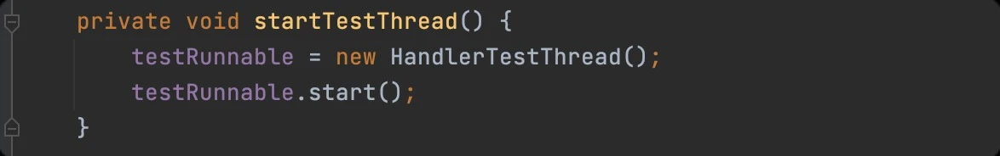

代码运行之后，发现程序崩溃了，推栈如下：

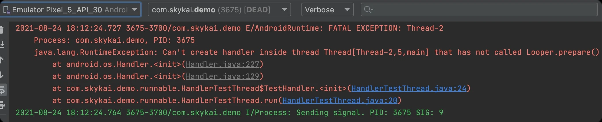

这个崩溃的意思是说，在子线程中创建 Handler 之前，需要调用 Looper.prepare()。那么我们在创建 Handler 之前，调用一下 Looper.prepare() 方法。然后再运行程序，触发线程执行之后程序果然不崩溃了。

但是 Handler 并没有收到消息，没有收到消息的原因，是因为并没有调用 Looper.loop() 方法，也就是说 looper 准备好了，但是还没有开始触发循环处理消息，修改代码如下：


程序运行之后，发现消息正常获取到了：


注意图中 3807 表示进程号，第一行日志的 3807-3807 表示当前是在主线程，再看下面的日志 3807-3832 可以看到消息确实是在子线程获取到的。

那 Looper.prepare() 方法里做了什么事呢？点击到方法中查看：


首先检查 sThreadLocal.get() 中是否已经有值，有值则直接抛出异常，否则就往 sThreadLocal 中 set 一个 Looper 对象。ThreadLocal 的初始化代码是：

static final ThreadLocal sThreadLocal = new ThreadLocal();

这是一个专门存放 Looper 对象的线程局部变量。所谓线程局部变量可以理解成绑定在特定线程内的变量，也就是说假如有 A，B两个线程，如果A，B两个线程同时调用：

sThreadLocal.set(new Looper());

那么每个线程在调用 sThreadLocal.get() 获取的一定是刚刚各自设置进去的 Looper 对象，这样就保证了每个线程在任何时候都只能获取到本线程绑定的对象。

所以如果在主线程中调用 Looper.myLooper() 与 Looper.getMainLooper() 为同一个对象，而在子线程中调用则会得到不同的对象。

#### 1.2.6.2 理解进程
---
理解线程之后，我们来了解一下什么是进程。首先我们再实现一个简单的多进程 Demo，并且在 Demo 里添加一个 Application 对象，并且在 Application 中打印一些日志：


首先在 Application 的 onCreate() 里打印出当前进程名，这里使用 ActivityManager 中记录的进程信息，可以完整的打印出进程名。然后在创建一个新的 LiteActivity，在其生命周期中添加上日志，之后在 AndroidManifest.xml 中将这个 Activity 注册到一个新的进程，这个进程名可以自定义：


这样就把 LiteActivity 配置到了 lite 进程中，接下来我们把应用启动到 MainActivity，然后点击按钮之后就跳转到 LiteActivity，程序正常运行 LiteActivity 被正常启动，然后我们看下控制台中输出的日志：


可以看到在 MainActivity 跳转到 LiteActivity 的时候，DemoApplication 又被重新启动了一次，并且进程名是 com.skykai.demo:lite 这说明在 lite 进程中也有一个 DemoApplication。而且从左边红框我们可以发现，进程号也变了。

主进程 com.skykai.demo 的进程号为：5070，而 com.skykai.demo:lite 进程的进程号为：5102，下拉进程列表，可以验证我们的结论：


现在我们的应用就有了两个进程，主进程与 lite 进程。其实实现多进程并不复杂，启动多进程可以通过四大组件的任何一个来进行启动。一般如果是没有界面的后来进程可以通过 Service 启动。

不同进程中的对象是完全独立的，在上面的例子里，MainActivity 跟 LiteActivity 同时获取 Application 对象的话，会获取到两个不同的对象。而且两个进程也无法直接通信，为此 Android 系统设计了多种跨进程通信的方法，我们会在后面的章节继续学习。

## 1.3 职场篇
---

### 1.3.1 职场修炼指南
---

#### 1.3.1.1 怎样才算积极主动？
---
做事积极主动，对工作有激情，这是我觉得对初级工程师最好的评价之一。假如刚参加工作一两年就激情不再，凡事等着被别人推动的话，基本在职场上也很难提升了。

这就是为什么有的人工作好几年才相当于一两年工作经验。怎样才算积极主动呢？我总结了以下几点：

一、让自己变得外向起来。这一点是说给性格内向的同学听的，这几年我发现性格外向，平时乐于表达，喜欢与同事交朋友的人，在职场的发展会更好。

其实也不难理解，外向的同学一般沟通能力不错，向上汇报能力就会比较强。认识的同事也多，很多事情推进起来也就比较容易。这一点内向的同学确实比较吃亏，不过只要在工作中有意识的多表达，多锻炼，一般能很快改善。

二、不要害怕犯错。我刚开始工作的时候，很害怕在工作上出差错，遇到 bug 总是心跳加速手心冒汗，然后心态就崩了，导致越做越错。后来遇到的问题越来越多，心态反而变得平稳了，处理问题也变得冷静起来。后来想想确实是遇到的问题越多，能力成长的也就越快。

三、保持兴趣，保持好奇心。这一点本来不想写的，总觉得有些鸡汤的味道。可是有时候想想如果缺了这点兴趣很可能就坚持不下来了。我认识不少工作了两三年就转行的程序员，其中不乏觉得程序员工作太无聊的人。所以保持一些兴趣，多体会代码带给你的成就感，会带来很不错的正反馈。

#### 1.3.1.2 适当面向老板编程
---
“面向老板编程”是一句职场玩笑话，意思是说任何需求都听老板的，老板说怎么做就怎么做，一切面向老板的需求。虽然听起来有些荒诞，但并不是完全没有道理的。

在国内的职场环境下，跟老板对着干一般不会有什么好结果的。尤其还在职场发展的初期，如果在一些想法上跟老板不一致，我的建议是先按照老板的要求来，事后看数据看结果。

如果决策没问题，大家皆大欢喜，你也会受到老板赏识。如果发现决策有问题，你也不会有责任，这个时候你提出解决办法，如果最终证明有效，功劳还有你的一份，岂不妙哉？

#### 1.3.1.3 多干点脏活累活
---
日常工作中有一些工作是可做可不做的，不做也不会影响你晋升，做了也不会让老板更看重你。不过在职场发展的初期，还是要多做些脏活累活，也许短期看不出来有什么好处，但是长期来看非常受益。

我举个自己的例子：2015年初的时候，我当时在一家创业团队工作，当年高端用户都在 iOS 平台，团队比较重视 iOS APP，而 Android APP 就备受冷落，当时连 Android APP 的上架，观察业务数据，处理用户反馈相关同事都不乐意做，合作起来效率很低。

我索性就自己全包了，从打包到上架，从观察业务数据到跟用户交流全都自己做了，持续做了一段时间也没觉得有什么成长。

直到后来我入职了一家中型公司，我才发现之前做的这些事情让我的工作能力完全提升了一个等级，我发现我对产品开发的整个流程都非常熟悉，跟各部门同事打起交道来也非常顺利。

多干些脏活累活，或许不会给你带来立竿见影的提升，但是在未来的某个时间点，当年干的这些脏活累活，会成为你成事的关键因素。

### 1.3.2 需求开发的完整流程
---
刚工作的时候我经常遇到下面这种情况：

产品经理提了两个需求，约定了一周开发完毕，虽然觉得时间比较紧，但赶一赶也是可以完成的。按计划开发了两天之后，产品经理又说要加一个紧急需求，优先级很高必须这周完成。

没办法只能开始加班赶需求，就快全部开发完成的时候，几个月之前上线的某个功能突然出现了重大问题，需要紧急修复，结果周末加班才搞定，最终搞得心力交瘁。

这样下去不是办法，仔细想想之所以出现这种情况，最大的问题就是评估需求的时候没有考虑受其他需求影响的时间。一方面没考虑会有新的需求插进来，另外一方面也没有持续关注已上线的需求，才导致出现问题。

后来我对每个需求都梳理了完整的开发流程，每次评估的时候都充分考虑整个流程的时间，慢慢的再也没有忙的焦头烂额了。

#### 1.3.2.1 需求评估
---
这个阶段最重要的是对需求的正确评估，包括可行性，实现方案，开发时间等等。在评估开发时间的时候一般要多预留一天的弹性时间，防止出现一些意外事件。

另外在需求评估阶段的结论，比如需求的具体要求，上线时间，不能只口头约定，一定要留有聊天记录或者邮件记录，防止后期扯皮。

#### 1.3.2.2 开发阶段
---
进入到开发阶段后，尽量保证早日完成开发，宁可前期忙一点也别指望拖到最后几天再搞。而且如果在开发过程中，发现了之前没考虑到的问题，比如原先定的方案技术上无法实现，这个时候要尽快通知需求负责人，尽快寻找解决办法，一定不要到需求上线的前一天才说需求无法实现。

#### 1.3.2.3 测试阶段
---
交给测试同学测试之前，一定要先完成自测，这点我们前面也讲过。另外在测试阶段，自己也可以多进行几遍代码 Review，看看代码还有没有值得优化的地方。

#### 1.3.2.4 需求上线
---
开发与测试完成之后，就是需求上线了。需求上线之前要保证在生产环境完整测试过，完善好需求上线后的灰度，回滚等方案。不要需求上线之后就不管了，万一出了问题，要有完善的应急方案。

#### 1.3.2.5 数据分析
---
需求上线之后要做业务数据分析，看看业务数据，用户表现是否符合预期。如果有不符合预期的地方，就要看看是否功能有问题，还是需求本身有问题了。实际上很多产品经理都缺乏对需求上线后的数据分析，经常是需求上线了好几个月才发现问题。

如果遇到这样的产品经理，我们工程师要主动承担起数据分析的责任。

### 1.3.3 什么时候跳槽？
---
工作中难免会产生各种情绪，有时候觉得自己不被重视，有时候觉得心太累，有时候觉得快乐消失了。

从而产生有离职的想法，仅仅因为不开心就离职的话，多少有些草率了，即使换一家公司，你也未必干的开心。

所以心情不好的时候，可以先尝试自我调节，有时候忍一忍，过两天很多事情就过去了。

当心情平静下来的之后，再理智分析是否到了要跳槽的时机，我总结了以下两点跳槽原因，你可以作为参考：

#### 1.3.3.1 职位与能力不匹配
---
当你的能力已经大幅度提升，能轻松完成目前工作，且很难在公司内部继续晋升的话。这个时候你就要考虑跳槽了，有的同学可能更追求稳定的工作，到达这个阶段之后，觉得很舒服就不再推动自己往上走。

这样可能会舒服几年，但是以后一旦要找工作的话，可能会面临工作经验与工作年限不匹配的情况。

刚工作的前几年，提升能力是最重要的，提升了能力之后，要尽快推动自己往中高级工程师进阶，去做更难做的事，去更大的公司，去啃更硬的骨头。

否则当你晚几年再“醒悟”的话，很可能当年的机会已经不在了。

#### 1.3.3.2 薪资待遇不符合期望
---
薪资待遇对于初级工程师来说不是最重要的，只要能在工作中持续提升自己，未来会获得成倍的薪资回报。

这句话没什么问题，不过你需要关注市场平均的工资待遇，可以多多跟身边的工程师了解，别让自己的薪水落后太多。

如果你在一家公司辛苦工作了两至三年都没怎么涨工资的话，你可能要考虑一下下一步该怎么办了。

#### 1.3.3.3 要避免频繁跳槽吗？
---
不需要刻意避免频繁跳槽，也不要觉得一家公司一定要呆满一年以上。每个人的职业生涯中都大概率会碰到完全不适合的公司，比如完全无法接受的公司文化，你不必委屈自己，果断止损，对你和公司都好。

举一个我自己的例子：我大学毕业于一所普通学校，所以我只能从小公司一步一步往上爬。

在这个过程里，我没有遵守一定要在一家公司呆多久的限制，我在刚工作的前两年就换了几家公司，有主动也有被动。

虽然频繁跳槽并没有给我找工作造成障碍，但前提条件一定是我的工作能力过关，满足用人单位的需求。

### 1.3.4 要努力进大厂吗？
---
如果有机会的话，尽量要去大厂看看，你不一定要在大厂里工作很多年，但至少要有在大厂工作的经历，最好是在大厂的核心部门工作。

因为有些业务，只能在大厂里才能接触的到。比如微信这种全民应用。

当然并不是所有人都要挤破头冲进大厂，有时候找到自己喜欢的工作氛围和节奏也很不错。这些年我待过不少公司，有创业团队也有大厂，不同公司的工作体验相差很大。

我把在这些公司的工作体验总结了一下，希望能对你有所帮助：

#### 1.3.4.1 初创公司工作体验
---
初创团队一般人数不多，我参与过最小的初创团队只有十个人不到。初创团队工作节奏会比较快。

不过工作氛围比较轻松，几乎没什么职级，毕竟一共也没几个人。而且工作的自由度会比较大，比如想在项目里引入新技术和框架，基本上自己就能决定。

不过初创团队有一个最大的风险，就是太容易失败。我当年参与的初创团队，后来无一例外全部失败了。

如果可以选择的话，在刚开始工作的前几年，还是尽量别去初创团队。

#### 1.3.4.2 中小厂工作体验
---
中小厂已经具有一定规模，业务也比较稳定了。福利待遇一般也不错，在这里你能从初级工程师成长为中级工程师。我第一次负责项目的整体架构就是在中小厂里，通常这种机会只有在这里会有。

中小厂有发展为大厂的机会，所以在这里能做很多事情。如果有幸可以随公司一起成长为大公司，那么对于你的职业经历也是很大的加分。

我呆过的中小厂里，公司氛围也都是非常轻松的，通常在一个版本发布之后，会有一些空闲时间，可以用来提升自己。

而且公司内部还经常举办一些技术分享会，人人都有分享的机会。

#### 1.3.4.3 大厂工作体验
---
到了大厂，分工就非常明确了。经常一个人只负责 APP 内非常小的一个功能，也就是我们常说的在大厂拧螺丝。

不过也并不是所有人都是这样，文章开头的时候我说过，如果可以进入大厂的核心部门最好。

因为在这里你能迎接最复杂业务带来的挑战，从而给自己带来很大的成就感。我曾经就以我的代码每天在上亿用户的手机上执行几百亿次而自豪。

在大厂工作的另一个好处就是薪资待遇会比较高，钱挣得多了，生活水平就会随之提升，为了维持生活质量，不少人会选择在大厂工作很多年。

### 1.3.5 如何准备面试？
---

#### 1.3.5.1 面试前
---
**1.1 搞清楚面试的职位**

投递职位之前，有些聪明的同学会故意避开竞争激烈的岗位。比如自己想搞算法，但是觉得算法竞争激烈，然后就投了一个客户端开发。

这种做法没有对错，不过既然你投了客户端开发的岗位，那么你至少搞清楚客户端开发是做什么的，用什么语言开发。

用几天时间了解一下相关技术，做一些小项目，至少自己对这个职位有个体感。不然面试的时候压根不知道以后要做什么，很难让面试觉得你有能力做好这份工作。

**1.2 简历书写**

简历是面试官在面试前了解你最直接的材料。把简历写好很重要，但是完全展开讲简历又是一篇完整的文章。我这里简要说两点重要的原则。

一、保证真实。通常应届生确实比较缺乏项目经验，但是如果你把同学的项目经历直接抄过来，那么面试中只要稍微问一下细节你就会露馅。真的一个项目经验都没有，把你自己做的小项目写上都行。

二、简历内容便于面试官提问。比如“负责XXX项目”就没有“在XX项目中通过YY技术提升N倍性能”要好。

因为后者面试官很容易会往你写的细节下面去延伸提问，如果你提前准备好了相关内容，就更容易回答好。

**1.3 对面试内容针对性的准备**

面试之前，你可以找同公司的学长、参加过同职位面试的同学去询问面试大致的内容，比如面试问题的范围，要不要考算法，以及尽可能的多了解了解公司。

比如算法很重要，那么面试前就一定努力去准备算法。只有面试前准备充分了，你面试的时候才会有更好的发挥。

#### 1.3.5.2 面试中
---
**2.1 不要迟到**

不要迟到，尤其现在不少是远程面试，最好提前10分钟就把各种设备调整好，早到一会儿也没啥坏处。

有一次我遇到一个同学，到点了才上线，然后语音一直有问题最后调了十几分钟才调好。
结果开始面试之后就非常紧张，调整了很久才进入状态。所以不要迟到，尽可能提前到。

**2.2 思维清晰，表达流畅**

放平心态，不要紧张，说话要简明扼要，表达流畅，不要磕磕绊绊的。面试前可以把自我介绍，项目介绍这些多演练几遍。

其实面试中很重要的一点就是考察你的沟通能力。如果逻辑思维太差，语言表达能力又不好，以后工作也会很吃力。好的表达能力不仅会给你的面试加分，以后对你工作上的帮助更大。

**2.3 诚实，不欺骗面试官**

这一点很重要，诚实是原则问题。

如果我在面试中遇到简历作假，更有甚者在面试题上作弊的话。我都是直接不通过的。还有一些同学可能怕影响面试结果，所以即使遇到自己不懂的问题也要强行回答，最后反而带来不好的影响。

遇到自己不懂的问题，我的建议是直接说自己不会。然后可以尝试对问题进行思考并且给出思路和猜想。即使最后没答对也比你胡乱回答要好。

**2.4 表现学习能力或特长**

新的工作，也面临要学习很多新的知识，很多同学其实很优秀，但是在面试中却表现不出来。学习能力可以通过成绩排名，大赛获奖记录来体现。

成绩不是特别突出的同学，可以写一些比如：短时间内做了XX事情，得到了什么结果。

对于已经参加工作的同学，可以写在 XX 时间内完成了 XX 项目，得到了 XX 结果。并且尽量让面试官可以记住你。这样在进行打分或者比较的时候，会更大概率给你更好的平价。

#### 1.3.5.3 面试后
---
**3.1 及时复盘**

面试结束后，要及时的进行复盘，把没答好的问题记录下来，逐一解决，把面试问题内化成自己的知识。

之后再回头 review 一下简历，看看是否有误导面试官的地方，对于面试中的问题，可以尝试看看是否有更好的回答方式。不断的复盘，自身能力与面试表现都会不断的提升。

**3.2 与面试官沟通**

这一点不太容易做到，如果面试官给你留了联系方式，可以问下对方对自己的评价，大部分的面试最后都会让你给面试官提问题，并不建议直接问这次面试会不会通过，你可以问问面试官觉得你还有哪些方面可以提升，以及学习哪些知识可以帮助日后的工作等等。

**3.3 不随意传播面试体验**

这一点可能会有人有异议了，网上有很多面经，甚至还有面试完之后吐槽公司或者面试官的帖子。但是对于个人来说，面试是一件很隐私的事情，不随意传播面试内容其实是保护自己。

假如在面试过程中遇到问题，可以先跟 HR 联系。如果只是一些态度或者言语上的问题，和朋友吐吐槽也就过去了。

### 1.3.6 如何选择 Offer
---

#### 1.3.6.1 搞清楚自己想要什么
---
选择 Offer 之前要先搞清楚自己想要什么，并且要制定好中长期目标。拿我自己的例子来说，我在 2014 年刚工作的第一年就给自己定下了三年目标：

一、月薪过万

二、参与一款百万用户的 App 开发。

三、在 Github 上开源一个 200+ Star 的项目。

这三个目标看上去跟选工作没关系，却已经圈定了我选择工作的要素：1.工资要求。2.公司规模的要求。3.团队能力与氛围的要求。当时有这样两个 offer：

A：物联网公司 Android 工程师，100人以上A轮，政府相关的项目，月薪3500，工作轻松不加班。

B：互联网公司 Android 工程师，10人左右天使轮，社交领域初创项目，月薪6800，工作辛苦，还需要换城市。

我果断入职了 B 公司，原因主要有两点：1.工资高，离月薪过万的目标更近。2.互联网 App 项目更容易获得百万用户。半年之后 B 公司项目失败，我又开始找工作，当时有两个比较合适的 Offer：

C：互联网公司 Android 工程师，20人左右天使轮，社交领域初创项目，月薪15000，独立开发。

D：互联网公司 Android 工程师，100人以上 B 轮，健康 App 项目，用户量超百万，月薪12000，5人左右 Android 团队。

我选择加入了 D 公司，因为月薪过万的目标已经达到，D 公司又能满足用户量超百万 App 条件。还可以跟团队里更多的 Android 工程师学习，这样对实现第三个目标也有很大的帮助。

去了 D 公司之后，我很快就完成了当年制定的目标。中期目标完成之后我给自己定了新的长期目标：参与全民 App 项目的开发。

这个条件在当时几乎只有 BAT 能满足，不过随着自身努力，一年半之后我也成功入职 BAT 其中的一家。这就是我前几年选择 Offer 做的经历，可见知道自己想要什么，其实不会有太多纠结。

#### 1.3.6.2 选择 Offer 的标准
---
说到这里，有同学会说：”你说的都对，但是我现在就要选 Offer，怎么办？”既然这样的话，我还有自己总结的几条标准给你，用来辅助你进行决策。

决策优先级：1 > 2 > 3 > 4（可按照自身偏好调整）：

1. 选择更大规模公司

如果你还没有在大公司工作过，我建议你一定去一次。你不一定要在大公司工作 5-10 年，但是你一定要在大公司工作过，熟悉他们的业务流程，工作方式，解决问题的方式。

经历过最复杂的业务其他的问题对你来说就是小打小闹了。

2. 选择核心业务

一家公司的核心业务往往是技术含量，重视程度最高的业务。而且公司大部分的资源都会往核心业务倾斜，很多事情核心业务推进起来阻力很小。

另外接触核心业务，还可以带给你行业内的不可替代性。对你以后的职业发展会有很大帮助。

3. 选择更好的领导

这一点可遇不可求，找到一位好领导等于给你的职业发展加杠杆，职业成长要靠领导提携。有的同学看不上所谓的“嫡系”，认为这是在“搞关系”。

我刚参加工作时也这样认为，可是当我发展到了更高的职业阶段，我才意识到“搞关系”的重要性。当领导更认可你的时候，你能得到的资源是远远超过别人的。

4. 选择更高工资

公司觉得你值多少钱，就会给你开多少工资，5 万月薪无疑比 2 万月薪好得多。

职业发展的前期，不必过分追求薪资待遇。但达到一定的职业阶段之后，也要考虑自己成家立业，买房生子的现实问题。钱多一点，没什么坏处。


# 2.中级工程师进阶
---
初级工程师只要又快又好的完成任务就可以，中级工程师阶段不仅要又快又好，还要能独当一面。独当一面是要能独立负责一个项目，或者一个独立业务。并在遇到问题时可以独立解决，成为最熟悉自己负责业务的那个人。

中级工程师开始要注重代码规范，学习更底层的知识，一般还要指导初级工程师。同时要懂得更多职场规则，并做好长远的职业规划。

## 2.1 认知篇
---

### 2.1.1 如何引入开源项目
---
这些年国内很流行敏捷开发，说白了就是快速迭代。有时候一个星期就要上线一个完整功能，比如添加一个二维码扫描功能，再来一个图片编辑器等等。

短时间内工程师自己实现的可能性几乎为 0。

这个时候一般就到 GitHub 找到适合的开源项目来使用。不过如果有时候对开源项目的评估不到位，再加上接入方式不对的话，反而会给项目来带各种问题。

为了帮你找到更合适的开源项目，我总结了评估与引入开源项目的一些原则：

#### 2.1.1.1 如何评估开源项目
---
**一、开源协议**

绝大部分开源项目都可以免费用于商业，其中也有一些例外，比如这个项目：https://github.com/asLody/VirtualApp 。在项目主页就声明了无法使用到商业项目内。

国内对于开源协议一般并不重视，为了避免不必要的麻烦还是建议引入合规的项目。

开源协议有很多种，可以在网上搜索：开源协议解读，学习各种开源协议的使用规范。

**二、代码质量**

不能只看开源项目是否满足项目需求，还要大致看一下项目的代码质量，首先要看项目整体架构是否合理，是否满足后续的需求定制。

也要看是否有大量测试代码，以及随意修改或者看不懂的变量与参数。总之要选择代码质量更好的开源项目。

**三、是否还在维护**

对于代码量较小的开源项目，比如我们之前讲的 ViewAnimator，这种功能比较稳定的项目不维护也还好。

如果是一个比较大的项目，比如前几年阿里开源的 weex，已经很久不维护，issue 列表里有大量未处理的 bug，这种项目基本上就不推荐再在项目中使用了。

**四、使用难度**

有些项目要考虑团队整体的接受度，比如：RxJava，这种学习曲线比较陡峭的项目，引入之前不能只考虑自己的想法，还要看看团队的整体水平是否适合这样的项目。

如果引入进来，别人无法维护这个项目相关的代码，会带来更多问题。

**五、安全性**

最后这点是很重要的一点，也是大部分人都考虑不到的地方。引入开源项目之前，一定要进行安全性评估，看看项目里是不是留有后门，或者一些所谓的彩蛋。防止给应用带来安全隐患。

#### 2.1.1.2 使用开源项目的正确姿势
---
找到合适的开源项目之后，不是立即引入到工程里就完事了，在开始使用之前，还有两点比较重要：

**一、熟悉内部实现**

引入开源项目之前，要先熟悉开源项目的整体框架，实现原理，并充分理解核心代码的实现逻辑。

这一点是防止引入工程之后，出了问题无法解决。而且有时候由于包大小或者其他原因，还需要对开源项目做一些裁剪或者修改。如果不理解内部实现，出了问题就会很麻烦。

**二、封装**

这一点很重要，使用开源项目之前，要给开源项目做一层封装。在工程内部的引用都是使用封装后的接口。

这样做的好处是，如果某一天需要替换开源项目，那么只需要封装层适配即可，不需要动项目其他地方的代码。而且封装之后能规范工程内其他模块代码的调用。

可谓是一举两得。

### 2.1.2 如何快速排查问题
---
如果把所有问题分为两类的话，一类就是可以本地复现，也就是在自己的测试机上就能复现的问题。

另一类就是自己无法复现的问题。处理这两种问题有以下几点常用的方法：

#### 2.1.2.1 排查本地能复现的问题
---
**一、调试解决**

本地能复现的问题比较容易解决，一般把可疑代码回滚测试即可。

或者在核心代码逻辑里多添加一些日志，看看代码执行的逻辑。还可以等过调试工具 Debug 看看程序运行的状态。

调试的方法很多，善用调试可以极大提高解决问题的效率。

**二、旧版本对比解决**

如果无法通过调试解决问题，可以对比一下旧版本是否有同样问题，如果旧版本不存在此类问题，基本上可以定位是由于新版本的改动导致的，再结合第一步调试解决。

**三、二分法**

如果前两个方式还是找不到问题，可以用这个笨办法。

就是先找到一个不出现次问题的旧版本，再通过二分法来找到到底是哪一次的代码提交导致的问题。

找到问题之后，实在无法解决至少可以先回滚。

#### 2.1.2.2 排查本地无法复现的问题
---
**一、日志分析**

日志功能是中大型项目必备的，用户量上去之后，程序在不同 Android 版本，不同型号的手机上运行状态各不相同。

有时候很多问题不具有普遍性。通常要把关键链路的日志保存下来，出现问题之后通过远程采集日志分析。目前比较流行的客户端日志框架是微信开源的 mars 项目中的 xlog，项目地址：https://github.com/Tencent/mars 。

**二、远程调试**

在功能上线的时候，如果有某些参数需要根据不同设备进行配置，一般需要预留远程配置开关。

远程配置也可以成为调试的一种手段。在用户遇到问题的时候，通过配置不同的运行参数来协助解决问题。

**三、联系用户**

有些极其难复现，并且很难排查的问题，可能就需要联系用户协助排查了。一般可以通过让用户主动获取系统 bug report 日志发送过来。

或者给用户单独打包特定的应用版本来进行配合调试。

当然，并不是所有的问题都能找到原因，也可能你找到的原因并不是问题真正的 root cause。

但是结合上面这些方法，足以面对绝大部分问题了。

### 2.1.3 怎样写出漂亮的代码
---

#### 2.1.3.1 推荐的代码规范
---
**一、命名规范**

Android 开发的命名一般使用驼峰命名法，比如：MainActivity，targetSdkVersion，textView 等等，不要在变量命中使用下划线命名。

layout 文件，资源文件一般使用 _ 命名，如 activity_main，fragment_xxx。注意一般把组件名放到最前面。

**二、单行代码长度**

单行代码一般不易过长，在 Android Studio 的编辑页面，右侧会有一根竖线，就是用来提示单行代码的最长长度的：


**三、使用空格**

空格的是用也很重要，一般在 {} () 之间需要添加空格，另外多个入参的变量之间也需要添加空格，具体示范可以参照下图：


此外还有更多关于代码规范的细节，可以参考 GitHub 上的这个项目：https://github.com/Blankj/AndroidStandardDevelop 。

#### 2.1.3.2 代码规范使用原则
---
**一、遵守已有的代码规范**

每个人都有自己的代码风格，但是更想提醒你的是，如果同一个项目是多人合作共同开发的话，最好保持一种风格。

如果项目中已有一种风格，即使不符合你自己的编码规范，你最好也要遵守，别成为破坏规则的那个人。如果实在觉得有不合理的地方，可以跟团队同事一起沟通，共同优化原先的代码规范。

**二、IDE 默认的风格就是最好的**

不少团队都制定了自己的项目规范，有些缩进是 2 个空格，有的是 4 个空格。这里没有哪一种更好，但是在开发之前要配置各种检查代码规范的文件，多少增加了一些开发成本。

对于 Android 开发来说，Android Studio 默认的代码规范已经很好。按照默认规范写代码，并且经常让 IDE 帮助格式化代码的话。

最终就能手写出最规范的代码了，按下格式化快捷键后的提示也是：


**三、简单的代码最漂亮**

有段时间我以自己能写出来各种复杂难懂的代码为荣，觉得这是技术好的表现。实际上回过头来看，真正漂亮的代码反而是那些结构清晰，逻辑简单，依赖关系明确的代码。代码

绝不是越复杂越好，真正好的代码一定是尽可能做到简单易懂，让后续维护的同学可以快速理解的代码。

很多领域流行一句话叫做大道至简，在编程领域其实也是同样的道理。

### 2.1.4 怎样写好注释
---
工程师都追求写出漂亮的代码，但是在学如何写好代码的同时，却很少有人关注写好代码注释的重要性，有的工程师从来都不写注释，认为 talk is cheap，也有的工程师写出的注释会让原本已经难以维护的代码，变的更加难以维护。

好的注释往往能起到画龙点睛的作用，提高我们维护代码的效率。对于如何写好注释，我总结了以下几点：

#### 2.1.4.1 不写无意义的注释
---
无意义的注释就像废话一样多余，明明代码已经很清楚的表达“从服务端请求数据”了，却又添加了一行跟代码表达的意义一模一样的注释。不仅没给我们带来任何更多的信息，而且还随着需求的不断变化，可能会演变出下面这个问题。


#### 2.1.4.2 不要修改了代码，却不修改注释
---


当需求改变时，我们修改了代码逻辑，却不随之修改代码注释。就像上面代码里写的，明显注释与代码表达的意义不一致。

这样的注释会让维护者迷惑，因为可能会真的认为代码里封装了从服务器请求数据的能力。但是检查了方法内的逻辑可能才发现事实并不是这样。

这样的注释，无形之中增加了我们的维护成本。

#### 2.1.4.3 不要写只有 TODO 或者 FIX 的注释
---
TODO 与 FIX 是很好用的代码注释标签，但是我维护过的不少代码里，有时只有一个孤零零的 TODO 作为注释，这会让我非常难受。

因为根本搞不清楚是哪里还要优化，通常只能祈祷写这个 TODO 的同学还未离职，可是很可能连他自己都忘了为什么写这个 TODO 的注释了。

所以你甚至可以不写注释，但千万别只写一个 TODO。

#### 2.1.4.4 慎重使用英文注释
---
曾经有段时间，我认为英文代码似乎只有配上英文注释才显得自然优雅。而且优秀的开源项目与系统源码也都是这样做的，因此我也开始只写英文注释。

直到有一天，我发现团队里的新手工程师在理解代码逻辑已经很困难的情况下，还要理解语法可能都不对的英文注释时，我开始觉得这种做法也许是有问题的。

如果我们是在做个人项目，开源项目或者团队中有国外开发者，那我们确实应该统一使用英文注释。

但是如果我们是在一家国内公司做商业项目，当我们无法确定团队里的每一个人都能准确的理解英文注释时，为了项目的开发效率与维护成本考虑，建议统一使用中文注释。

写好注释一点也不难，注意好前面几点，再克服一点点惰性，连不会写代码的人都能写好注释了。认真写注释，你的一行注释可能会给另一位工程师节省一下午的时间。

### 2.1.5 代码出 Bug 该怎么办？
---
**1、紧急止损**

第一件事一定是紧急止损。无论是用配置开关，后端兼容，HotFix，发版本等等手段，只有先止损，对用户/公司/你自身的影响才会最小。

有人遇到 Bug 之后就开始甩锅。遇到这种人不必跟他们扯皮，优先处理 Bug，记住止损是第一位的。

**2、确定影响面**

Bug 止损或者修复之后，要尽早确定影响面。影响面是评估一个 Bug 严重性最重要的指标，在评估影响面上要做到准确真实。

不要害怕由于影响面太大而瞒报数据，坦诚面对才能让你真正的成长。

**3、向上汇报**

及时汇报也是非常重要的，假如你害怕老板知道之后会影响你的绩效从而没汇报的话。

那你可以想象一下，如果你老板的老板知道了这个 Bug，再去询问你老板的时候，他却不知道，你觉得后果会是什么？永远不要让你的老板成为最后一个知道问题发生的人。

**4、及时复盘**

通常严重的 Bug 会组织复盘会，详细的分析前因后果，以及规划改进措施。

对于小 Bug，可以自己做一个复盘，最好是通过文字记录下来，避免下次再犯类似的问题。

**5、落实改进措施**

改进措施里通常会有一些长期的项目，比如监控系统的完善，告警系统的推进等等。

由于推动起来比较麻烦，不少措施到最后也没有落实，最终引发了更严重的 Bug。

如果你想做的比别人更好的话，踏踏实实的把改进措施一项一项的落实，多做一些脏活累活，你会比别人成长的快的多。

### 2.1.6 怎样才能少出 Bug ？
---
**1、自测，站在用户角度的测试**

自测一定是必须的，这是对自己代码负责任的表现。

不要过度指望测试同学可以帮你测出所有bug。

同时你需要切换到用户的角度进行测试，多想想假如你是一个普通用户你会怎么使用这个产品。

如果你只用你写代码时的思维去进行测试，那么你很难测试出线上真实发生的路径，从而导致 bug 的发生。

**2、从别人的 Bug 中学习经验**

不要在别人出 bug 时幸灾乐祸，别人出 bug 的时候，也是你学习的机会，你可以想象假如这段代码是你来写的话，你会犯同样的错误吗？以及你会怎么来设计代码保证不出 bug？是否可以从别人的 bug 中学习经验防止以后自己出现类似的问题？

**3、做好动态控制与灰度控制**

这一点往往是发现 bug 之后的救命稻草。在修改线上长久稳定运行代码的时候，尽可能的预留动态控制，同时进行灰度上线，防止上线之后立刻出现大规模的 bug。

**4、熟悉自己负责的产品**

理解产品细节，可以让你在写代码的时候结合更多的业务场景考虑，从而避免代码影响到其他业务。

另外由于你足够了解业务，你能更好的评估产品经理提出的需求是否合理。往往不合理的业务需求也是产生 bug 的导火索。

别低估自己理解产品的能力，你也许是最了解产品的那个人。

**5、谨慎对待紧急需求**

通常越是紧急的需求越容易出 bug，由于思考的时间太短，评估不充分，又缺乏测试，匆忙上线之后经常会出问题。面对这种紧急需求，越要谨慎评估。

即使是很小的修改，能配合动态配置的也尽量加一个配置，因为我已经遇到过不少次临时修改了一行代码导致线上出 bug 的问题，说多了都是泪。

### 2.1.7 业务开发与架构开发
---

#### 2.1.7.1 什么是业务开发？
---
在客户端开发中，业务开发指负责开发 UI 页面逻辑相关的同学。日常的工作是拿到产品经理的需求之后，跟后端同学确定好接口规范，然后按照设计师的要求实现页面逻辑。随着产品迭代，日复一日的做着相似的工作。

大部分 Android 开发是做业务开发入行的。时间久了，一部分同学逐渐厌倦了没有难度的业务开发，想做一些更有挑战性的事情。

于是开始寻找一些可以去大厂基础架构部门做架构开发的机会。

我的经历也是类似的，工作前三年一直在做业务开发，后来去了支付宝做 Web 容器架构。

这两年做架构的同时又负责一些业务。在日常工作方式上，业务开发与基础架构开发确实有一些区别，并不是所有人都适合做业务开发，也不是所有人都适合做架构开发。

这篇文章结合了我对这两个岗位的理解，希望帮你找到更适合你的岗位。

#### 2.1.7.2 什么是架构开发？
---
一般只有大厂才会拥有独立的基础架构部门，架构开发一般负责项目中的底层框架。

比如：网络库，热修复，Web 容器或者动态化技术等等。对于这些岗位来说，基本上不需要做 UI 页面了，跟设计师的沟通也会比较少。

还有一些模块连产品经理也没有，但是这并不是说就不需要沟通了。你服务的对象从用户变成了公司内的其他开发同事。

而且你很可能还要自己当产品经理，自己做测试等等工作。工作强度只会比业务开发更大。

底层架构一般支撑的业务会比较多，比如拿网络库来说，任何时候应用出了问题可能都要找你排查，24 小时 oncall 都是正常现象。

虽然看起来架构开发比较高大上，但是真等你真正做了架构，你会发现可能你更像一个客服，不是在回答别人问题的路上，就是在解决别人问题的路上。

那架构开发一点好处都没有了吗？当然不是，架构开发能带给你最大的收益就是：不可替代性。如果把架构做的深入之后，你能获得一些行业内最前沿或者最底层的经验，这些经验构成了你的不可替代性，也就是别人没那么容易做到的事情。

拥有了这些能力，无论是在公司内部发展，还是以后换工作都能给你带来很多益处。

#### 2.1.7.3 如何选择业务开发与架构开发？
---
那么如何选择业务开发与架构开发呢？我总结了以下几点：

**一、架构开发更适合大厂**

如果你想做架构的话，那么去大厂是你的最好选择。小厂一般不会有单纯的架构开发，就不讨论了。

对于一些中厂，虽然开始有了架构开发的岗位，但是建议你选择的时候一定要慎重。因为对于业务快速发展的公司，业务一直是第一位的，这样的公司里业务开发会更受重视。

如果公司发展不利裁员可能也会先裁架构部门。

**二、选择更适合自己性格的岗位**

如果你对钻研技术非常有兴趣，打算在某个技术领域深耕，你可能更适合做架构开发。

如果你对做出来复杂的页面交互更有兴趣，而且更喜欢跟人打交道，做业务开发也是一个很好的选择。

有些性格确实比较内向同学，不善于与人打交道，如果去做一些沟通较少的架构开发工作，可能会比较好。

**三、有机会都要尝试一下**

假如你现在做的是业务开发，也可以在业余时间做一些深入研究，比如优化一下网络请求效率，或者优化应用的占用内存等等。

如果有机会的话，可以尝试一下架构开发，真正实践之后往往能找到自己更喜欢的东西。
还有一部分同学刚毕业就进入了大厂的架构部门，如果工作久了，觉得离业务太远也可以转岗到业务部门去试下的。

有时候不需要太多的纠结，多尝试经历的多了，就自己更擅长做的什么了。

## 2.2 知识篇
---

### 2.2.1 进程间通信
---

#### 2.2.1.1 使用进程间通信
---
跨进程通信在系统源码中使用非常广泛，进程启动，Activity 展示等功能的实现都跟跨进程通信息息相关。

另一方面，在大型 APP 中一般都存在多进程架构，不同进程之间的通信也要用到相关技术，Android 系统提供了 AIDL 的方式进行跨进程通信：

第一步，首先创建 AIDL 文件，在 Android Studio 中右键 new AIDL File 即可，创建出来的 AIDL 文件会单独放在项目 aidl 文件夹中，然后在 AIDL 文件中定义一个跨进程通信的接口，这里我们定一个获取进程名的接口：

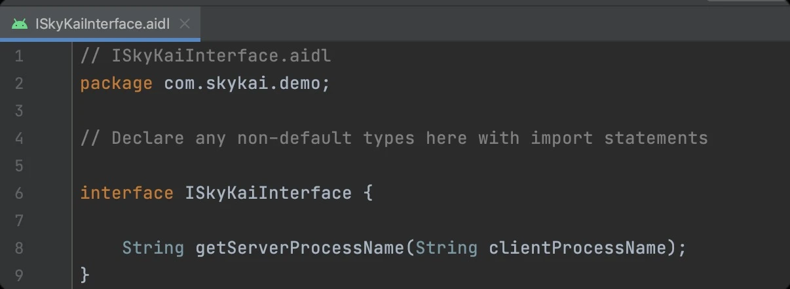

接口创建好之后，我们需要触发一次编译，这样才能在项目中引用到 ISkyKaiInterface 接口，生成的文件路径为 build/generated/aidl_source_output_dir/debug/out/com/skykai/demo/ISkyKaiInterface.java ，这里我们暂时不看这个文件。

第二步，我们创建一个 LiteService 并配置到 lite 进程中：


然后在 LiteService 中创建 SkyInterfaceImpl 并继承自 ISkyKaiInterface.Stub ，在方法内实现 getServerProcessName() 方法，这里就是 lite 进程中服务真正实现的地方。

然后在 Service 的 onBind() 方法中，创建 SkyInterfaceImpl() 并返回：


注意在方法中，我们把当前线程，入参与返回值都打印了出来。

接着回到 MainActivity 中，我们把 bindLiteService() 这个方法绑定到一个按钮的点击事件上，代码如下：

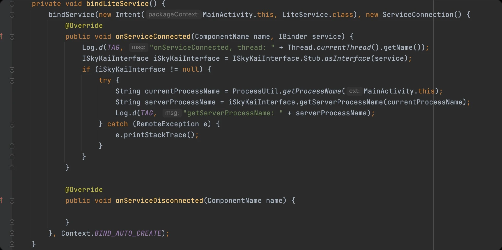

运行代码，点击按钮，可以看到运行日志如下：


成功完成跨进程通信，从日志中我们可以总结以下几点：

+ 跨进程调用要借助 Service 来进行实现，实际上 ContentProvider 也可以，具体可以查看这篇文章：https://juejin.cn/post/6844903681268121614 。

+ 在跨进程调用的过程中发起方（MainActivity）像是客户端，而服务提供方（LiteService）像是服务端。

+ SkyInterfaceImpl 类中的 getServerProcessName() 方法会在 Binder 线程中进行回调，而不是主线程。

跨进程通信看起来简单，但实际使用还会遇到各种各样的问题，比如：RemoteException，DeadObjectException 等异常，在项目中使用时需要对这些问题做好防护。

除了 AIDL 之外，还可以通过 Messenger 的方式进行跨进程通信，Messenger 也是在 AIDL 上的封装。

#### 2.2.1.2 进程间通信原理
---
Android IPC 原理的文章，我本来打算自己来写，但是写了一些之后还是觉得不如网上其他博主的文章。

更何况我当年也是读他的文章来学习 IPC 原理，所以这里就直接把他的文章链接放上： http://gityuan.com/2015/10/31/binder-prepare/ 。

他的 Binder 系列，一直从应用层写到 Binder 驱动底层。从 Framework 层，到 JNI 层，再到 Native 层最后再到 Kernel 层，整体逻辑非常清晰。

文章列表如下，如果上述链接已经失效的话，可以通过搜索下图中的关键字进行阅读：


文章一共有 10 篇，作为应用开发工程师，如果你在看文章的时候觉得难理解，其实是正常的。

对于 Binder 机制能了解整体的架构已经很不错，具体的细节不必要求自己在短时间内掌握，有时间时常复习理解即可。文章中描述 Binder 架构图如下：


可以看到在 Native 层有一套完整的 Binder 通信的 C/S 架构（图中蓝色），Bpinder 作为客户端，BBinder 作为服务端。

基于naive 层的 Binder 框架，Java 层也有一套对应的 Binder C/S架构，通过 JNI 技术，与 native 层的 Binder 对应，Java 层的 Binder 功能最终都是交给 native 的 Binder 来完成。

在这里感谢 Gityuan 给社区带来一整套完善的源码解析的文章，在他的个人网站上还有其他更多好文章，欢迎大家到他的网站学习：http://gityuan.com/

#### 2.2.1.3 进程间通信框架
---
了解 AIDL 是如何实现进程间通信，又学习了进程间通信的原理之后。

我们要再聊一聊进程间通信在实际项目中的落地。

可以看到 AIDL 本身使用并不麻烦，但是基本上都要跟 Service 配合，还要涉及到跟 Service 绑定，这样一来就增加了使用成本。

开源社区中已经有不少项目对 AIDL 进行了封装，可以更简单的进行进程间通信。在我的对比与使用之后，找到了两个比较好用的进程间通信框架：

**一、Andromeda**

Andromeda：https://github.com/iqiyi/Andromeda 。这个项目的优点是只要 A 进程的服务注册之后，B，C 进程都可以通过框架调用服务，并且无需 bindService() 操作。

不过为了降低AIDL 迁移成本，使用 Andromeda 进行跨进程通信的时候依然需要定义 AIDL 接口。

Andromeda 的使用方式跟传统 AIDL 类似，首先还是定义 AIDL接口：


然后完成接口的实现：


实现完成之后，需要在服务提供的进程中注册整个接口，一般可以放在对应进程启动的时候注册，注册代码如下：


这样就完成了远程服务的实现与注册，在其他进程进行使用的代码如下：


注意第一行的 this 可以是 Activity 或者 Fragment，Andromeda 会在 onDestroy 的时候自动释放连接，注意获取到 binder 对象之后，还需要调用 IBuyApple.Stub.asInterface(binder) 来获取服务实现的代理，这一点跟原生 AIDL 的方式一样。

另外远程服务其实既可在其他进程中调用，也可以在同进程中被调用，当在同一进程时，虽然调用方式一样，但其实会自动降级为进程内普通的接口调用，这个 binder 会自动处理。

以上就是 Andromeda 的使用方法，关于这个项目的原理解析，可以看看这篇文章：https://juejin.cn/post/6844904034227224589 。

**二、IPCInvoker**

IPCInvoker：https://github.com/AlbieLiang/IPCInvoker 。

这是另外一个可以方便的实现进程间通信的框架。这个项目不需要实现 AIDL 接口，甚至只需要一行代码就可以实现跨进程调用：


可以看到使用非常方便，IPCInvoker 底层也是通过 AIDL 实现的，只是把接口封装得更加容易使用。

不过这项目在社区中的知名度不是很高，如果想应用于实际项目中的话，建议把整个项目的原理掌握之后再使用。

### 2.2.2 热修复技术
---
一般来说代码打包出 apk 安装到用户手机上之后，运行的代码就没办法修改了。

由于国内各大厂的业务开发周期很快，用户量又大，如果客户端代码有 bug 的话，每次都重新发布新版本显然不切实际。

在这样的背景之下QQ空间，微信，美团，阿里等大公司都自研了热修复技术并开源。其中微信开源的 Tinker 与美团开源的 Robust 比较具有代表性。

关于这两个热修复框架，我的前同事 w4lle（个人主页：https://github.com/w4lle ）写了一系列的源码解析的文章，其中 Robust 原理分析还被此项目的开发团队在 wiki 中引用。

这一章节的文章大部分都引用自他的博客：http://w4lle.com/2016/12/16/tinker/index.html 。对于想深入研究热修复的同学可以到博客地址学习，感谢 w4lle 把热修复技术写的如此通俗易懂。

#### 2.2.2.1 了解 Tinker
---
Tinker：https://github.com/Tencent/tinker 是微信开源的热修复项目，它接入方便，使用简单是社区中非常流行的热修复框架。Tinker 的主要原理可以用项目描述中的这张图来完整解释：


Tinker 完成 patch 的整体流程是，从线上代码的提交 tag 开出来一个 patch 分支，之后直接在这个分支里修复 bug。

然后使用 Tinker 提供的工具通过 diff 的方式可以打出来一个 patch dex 压缩包。patch dex 压缩包通过网络传输到用户手机上之后，Tinker 检查到 patch dex 压缩包之后，再把手机上的 dex 文件跟 patch dex 一起合成出新的 dex 文件，之后再把这个 dex 替换成下次启动执行的 dex，这样补丁就安装成功了。

Tinker 的接入需要替换应用的 Application 实现，这样做主要是为了 Tinker 热修复的成功率，如果反射替换Application的问题，那么这个过程是不可逆的。

Tinker为了兼容性问题考虑，采用了工程代理的方式，保证了 Tinker 的稳定性。

对于 Tinker 的原理解析可以通过阅读这篇文章来了解：http://w4lle.com/2016/12/16/tinker/ 。

虽然文章写于几年之前，但是 Tinker 的核心逻辑并未改变，具体的逻辑可以对照最新的 Tinker 代码进行比较。

对于项目中使用 Tinker 的话，一般还需要进行二次开发，比如给 Tinker 加入埋点监控，监控 patch 链路的成功率，还需要开发 patch 打包后台与 patch 更新接口。

#### 2.2.2.2 了解 Robust
---
Robust：https://github.com/Meituan-Dianping/Robust 是美团开源的热修复框架，Robust 借鉴了 Android InstantRun 的实现原理，通过在 apk 打包的过程中，在每个方法前插入一段类型为 ChangeQuickRedirect 的静态变量，然后在这个方法之前判断静态变量是否为空，如果不为空则走 patch 的逻辑。插装之后的代码逻辑如下：


修复的过程就是通过反射将 ChangeQuickRedirect 变量设置为运行新逻辑的对象，然后调用其内部的方法进行修复，整体的流程大致如下图所示：


Robust 有不少优点，比如无需替换 ClassLoader 稳定性会更好，另外补丁可以即时生效无需像 Tinker 那样重启之后才可以生效，而且对应用性能影响也比较小。

不过在使用时也会有一些限制，比如无法修复构造方法，不支持修复资源和 so 等问题。

更多关于 Robust 解读的文章，可以继续从下面的文章中了解：
https://tech.meituan.com/2016/09/14/android-robust.html
http://w4lle.com/2017/03/31/robust-0/

#### 2.2.2.3 如何选择热修复框架
---
了解了 Tinker 与 Robust 之后，两者都是很优秀的方案，但也同时都有一定问题。为此阿里云提供了移动热修复解决方案：Mobile Hotfix 。

此方案不仅支持多种修复方式，还提供了完善的补丁版本管理，发布方式，数据统计，补丁回滚等功能。但是这是一个付费服务，对于条件的团队可以考虑是否接入。

关于这几个热修复框架的对比，引用一张阿里云热修复官方的图片：https://help.aliyun.com/document_detail/51416.html


其中 AndFix 与 QQ空间的方案不推荐再使用。对于剩下的三种方案，我个人认为有条件的可以用阿里云热修复，其次更推荐 Tinker ，另外如果对应用启动性能有极致追求的话则建议选择 Robust。

### 2.2.3 常用设计模式
---

#### 2.2.3.1 单例模式
---
**单例模式是最常用的设计模式**，可以说没有之一。

单例模式的作用是让某个对象在同一个进程内有且只有一个示例，而且使用者无法直接创建出多个实例。可以运用于某个独立模块的入口对象，比如图片加载器，日志模块入口等等，使用非常广泛，最简单的单例写法如下：


首先将单例对象通过 static 变量创建出来，之后将构造函数的修饰符设置为 private，这样外部就无法直接 new 对象出来。

然后再通过一个 static 方法给外部返回 instance 对象。

这种写法比较简单，也没有线程安全的问题，不过会在类加载的时候就把对象创建出来，会浪费应用内存，因此我一般实现单例会用下面这种方式：


上面这种方式是单例模式最推荐的写法，也有人叫这种单例的写法为：懒汉式双重校验锁。这种写法即保证了线程安全，又保证了只在第一次调用 getInstance() 时才创建对象，推荐使用，此外还有多种单例的写法，这里就不再一一举例，有兴趣的同学可以去网上搜索学习。

#### 2.2.3.2 建造者模式
---
建造者（Builder）模式也是一个非常常用的模式，我们在 2.5.2 节中介绍的开源项目 ViewAnimator 就应用了建造者模式，建造者模式最大的特点就是通过创建 Builder 类，并在 Builder 类的方法中设置不同属性从而形成链式调用，调用形式如下图：


具体的实现如下：


建造者模式应用广泛，对于一些设置选项比较多的功能，比如网络请求的时候设置各种参数，通常可以使用这个模式。

在实际项目使用中，并不一定要按照上图的模式来使用，可以按照自己的需求进行修改。

除了我们之前说的 ValueAnimator 之外，网络请求框架 Retrofit 或者图片加载框架 Glide 都使用了建造者模式。

#### 2.2.3.3 代理模式
---
代理模式就是在进行真正的操作之前，通过一个代理类来进行操作的出发，对于外部调用方不会跟真正的实现类打交道，只要跟代理类打交道即可。

代理模式的好处在于实现跟调用分离，这样即使把实现完整替换之后，外部调用者也无需修改代码接入。

一般在项目中引入第三方库时通常会包装一层代理。对于代理模式的实现，我们在上一节的进程间通信中其实就接触过，我们只要找到 AIDL 生成的类就可以看到：


这个 Proxy 代理类实际就是 Binder 的代理，在进行远程调用的时候，实际上是通过 Proxy 代理类的包装之后进行调用的。

#### 2.2.3.4 责任链模式
---
在一个事件或者请求发出之后，对于处理者有多个的情况下，可以使用责任链模式。

比如一个网络请求发送的过程中，需要处理缓存，处理错误重试，处理建立连接，读取数据等等。

这种方式就适合使用责任链模式来做，实际上 OkHttp 内部最经典的设计之一就是网络请求处理的责任链：


可以看到在网络请求之前设置了很多拦截器，最后在请求的时候，逐一调用拦截器：


上述代码的链接为：https://github.com/square/okhttp/blob/master/okhttp/src/main/kotlin/okhttp3/internal/connection/RealCall.kt 。

现在 OkHttp 已经使用 kotlin 重写了，如果觉得比较难理解的话，还可以看这篇文章中的责任链实现：https://www.runoob.com/design-pattern/chain-of-responsibility-pattern.html 。

#### 2.2.3.5 设计模式不可生搬硬套
---
除了上面提到的设计模式，另外还有 10 几种设计模式。

我在 Github 上找到了一个讲解设计模式的项目，可以帮助你理解设计模式：https://github.com/youlookwhat/DesignPattern 。

但是这里我还要给你一个建议，那就是千万别生搬硬套设计模式。

记得前几年我在一家公司工作的时候，那时候我刚刚接触设计模式，为了能在项目中练手，我在做开发的时候一直想套用设计模式，不管遇到什么需求，我都一律找一个设计模式套用上去，最终导致了很严重的后果。

由于滥用设计模式，整个项目代码变的非常复杂，有时候几行代码能完成的事情，套用了某个设计模式之后就变成了上百行。本身逻辑非常清晰的功能，在套用了设计模式之后，代码变的难以维护。

最后实在没办法，只能把设计模式涉及到的相关代码全部删掉了。

这件事情之后，我开始谨慎使用设计模式，只有某个功能非常适用某个设计模式的时候，才会考虑使用设计模式。

实际上对于任何技术或者框架都是这样的，用的好会是锦上添花，用的不好还会起到反作用。

### 2.2.4 常用架构模式
---

#### 2.2.4.1 了解 MVC
---
**MVC 是一种经典的架构模式，MVC 分别代表：Model（模型），View（视图）与 Controller（控制器）**。

其中 Model 是用来存放应用的各种模型数据，比如购物APP中的商品模型，商品列表，购物车模型等等，而 View 是用来渲染用户界面，Controller 则用来处理业务逻辑，比如把某个商品添加到购物车。一般情况下三者的关系如下图所示：


我们通常认为 Android 应用最早的开发模式就是基于 MVC 架构的，View 就是指各种 Button，ImageView，RecycleView 等组件构成的页面，Controller 指的就是 Activity，Fragment，Service 等组件，而 Model 就是各种数据 Model。

为了更好的描述 MVC 我从 GitHub 上找到了一个分别用 MVC，MVP 与 MVVM 实现的 Android 小游戏，地址是：https://github.com/ericmaxwell2003/ticTacToe 。这是一个井字棋游戏，实现很简单，运行效果如下：


把代码 clone 到本地之后，我们把分支切换到 mvc 即可，也可以在网页上选择 mvc 分支之后，把代码下载到本地引入：


可以看到，代码的包名已经把 MVC 分好类了：


其中 model 包中的 Board 是棋盘的模型，Cell 表示棋盘中的小格子里面存放着 Player 的信息，而 Player 是一个枚举类，里面有 X 和 O 两种类型，用来表示棋子。

在 MVC 的模式中，棋盘点击之后，触发的 onClick 事件会交给 Activity 直接处理，并通知对应的格子应该显示 X 还是 O，并且判断是否已经出现胜者。

可以看到这些业务逻辑都是放在 Controller 中处理的。

其实在 Android 应用中使用 MVC 不必刻意注意什么，只要按照正常的逻辑开发通常就会被认为是 MVC 的模式。

但是对于业务逻辑复杂的应用，Activity 作为 Controller 会变得越来越臃肿，而且 Activity 还通常负责一些 View 相关的逻辑，比如菜单栏的处理，页面样式的配置等等。

在这样的背景下 MVP 应运而生了。

#### 2.2.4.2 了解 MVP
---
MVP 分别代表：Model（模型），View（视图）与 Presenter（逻辑处理），MVP 把 MVC 中的 Controller 升级为了 Presenter，相对于编码中的改变就是把 Activity 归类成 View，并且把 Activity 中的控制逻辑全部抽离到 Presenter 中，三者之间的关系如下图所示：


对应到代码中可以看到，多了一个 Presenter 层：


这个 TicTacToePresenter 会在 Activity 初始化的时候创建，并且跟 Activity 建立依赖，通过 Activity 回调的点击事件都会中转给 Presenter 处理，而且对于 Activity 还会被抽象成 View 接口，Presenter 会依赖这个 View 接口，从而把相应的 View 操作的指令发送给 Activity。


可以看到红框标注的代码逻辑与上述描述一致，MVP 确实把职责变的更加清晰了，不过也多出来了不少模板代码。对于实现较简单的页面，MVP 会显得代码很臃肿。

而且真实的项目中复杂的业务逻辑其实并不多，所以现在 MVP 已经不太推荐使用了。

那么 Google 更推荐使用哪一种方式呢？其实就是接下来要讲的 MVVM。

#### 2.2.4.3 了解 MVVM
---
MVVM 代表：Model（模型），View（视图）与 ViewModel（视图模型）。

ViewModel 依然是用来代替 MVC 中的 Controller 或者 MVP 中的 Presenter。MVVM 中有一个很重要的概念叫做数据绑定（Data-Binding），也就是通过 ViewModel 与 View 的绑定，在数据变化的时候自动通知 View 刷新，而且 View 的交互还可以直接改变 ViewModel。

这样会减少大量的代码编写，提升开发效率，他们三者关系如下图所示：


对应到代码中可以看到结构如下：


ViewModel 通过跟 Activity 绑定之后，click 时间会自动分发到 ViewModel 中，也不在需要 Activity 中转了：


目前看起来，MVVM 的架构模式中，代码量算是比较少并且职责最清晰的架构，但是 MVVM 有一定的学习成本，而且前几年迭代也比较快，像这个项目已经是比较早期的 MVVM 形态，目前最新的实践已经跟 Demo 中的代码有一些区别了，不过并不影响我们去理解 MVVM 这种模式。

#### 2.2.4.4 如何选择 MVC/MVP/MVVM？
---
前面我们用了一个简单的 Demo 来演示了什么是 MVC，MVP 与 MVVM，那么在真实的项目开发中，我们应该使用哪种架构模式呢？

我总结了以下几点原则：

1. 没有哪一种架构更好，只有更适合业务的架构。对于大部分项目直接用 MVC 开发就够了。不要为了追求架构模式而选择 MVP 或者 MVVM。

2. 择某一种架构之前，要考虑团队其他成员的熟练度。不要选择大部分同事都不懂的架构。

3. Google 官方目前更倾向于 MVVM 的架构模式，Google 把这种开发模式叫做 Jetpack，官网地址：https://developer.android.google.cn/jetpack 。

Jetpack 是结合多种库的开发套件，结合 Data Binding，Lifecycle，LiveData ViewModel 等技术构建应用的一种方式，需要一定的学习成本，建议团队整体学习后再在项目中使用。

### 2.2.5 如何优化应用启动性能
---

#### 2.2.5.1 分析应用启动性能
---
如果你有过从0到1开发一款 APP 的经历，那么你一定经历过 APP 从最初的简单流畅到后来的复杂卡顿，从最初应用基本可以秒开，到后面 3 - 5秒才进入首页，甚至在一些配置不高的手机上经常黑屏。到了这个时候就要开始注重应用的启动性能了。

Android 应用的启动分为冷启动和热启动，冷启动是指应用从完全不存活到应用展示到前台，而热启动指应用在后台存活的情况下再次被唤起展示到前台。两者最大的区别就是冷启动多了应用进程创建，以及应用启动相关的初始化操作。这些通常是造成启动性能问题的原因。

之所以启动变慢，是因为启动过程中做的事情太多了。任何工程师都知道一个刚创建的空白项目，那么在任何手机上都能秒开。但是由于业务不断的发展，应用启动所做的操作太多了。

例如：初始化网络环境，到服务端请求各项配置信息，初始化数据库，初始化各种 sdk ，初始化热修复框架等非常多操作，最终导致应用启动越来越慢。

解决应用启动性能的方法就是找到那些导致启动耗时的操作，找出哪些是不用做的，哪些是可以延后，哪些是可以优化的。

为了能找到这些耗时的操作，我一般会使用 Android Studio 支持的使用 CPU 性能剖析器检查 CUP 活动。官网的介绍链接：https://developer.android.com/studio/profile/cpu-profiler?hl=zh-cn 。

这个工具不仅能分析应用启动的性能，运行时的性能也可以一起分析。

这里我们仅分析应用启动阶段性能，首先，我们要使用 Debug 类的 API，在应用中打上记录起始与结束的标记。我们首先在 Application 中的 attachBaseContext() 方法中添加如下代码：


这段代码的意思是开始记录方法的调用，并且将方法调用记录的文件保存着指定目录，接着我们到 MainActivity 中添加结束标记：


我们在 Activity 的 onResume() 方法中使用 Idle Handler 来结束追踪，这样做的目的是为了能更全面的记录应用在空闲之前的所有操作，接着我们运行程序，程序运行成功之后，按照下图的路径就可以找到对应的 trace 文件了：


双击即可打开，ProFiler 面板如下图所示：


我们首先在左侧区域中滑动选择主（mian）线程的运行时间段，选择之后，点击 Flame Chart，之后就可以在下发看到这个时间段内所有的方法调用以及耗时，可以看到红框处是 MainActivity onCreate 方法的运行情况。

这里显示 onCreate 执行的时间为 1.2s，这是因为性能记录过程会对程序运行的性能有损耗，所以方法执行的耗时会比实际要久，不过主要起到对比的作用即可。

另外左边的面板中还可以看到其他线程的执行情况，对于大型项目是非常方便的，可以直观的看出应用启动过程中的线程运行情况，通过大量的线程同时并发运行也是影响启动性能的原因之一。

拿到应用启动阶段的运行情况之后，接下来就是分析应用启动有哪些任务可以进行优化。

因为我的示例 Demo 比较简单，我从网上找到一篇非常不错的冷启动优化，可以参考这位博主的做法，链接如下：https://blog.csdn.net/weixin_30848953/article/details/117556344 。

#### 2.2.5.2 应用启动框架
---
优化应用启动性能最直接的方式就是找到启动阶段的耗时任务，把一些可以延迟优化的任务延迟优化，并且对启动阶段做一定的管控，防止优化之后过了一段时间启动阶段又被修改的很复杂。

这样就需要有一个启动框架用来管控所有启动任务，包括启动阶段各个任务的启动优先级，任务运行耗时记录，任务延迟运行以及任务管控等功能。

为了完成以上功能，阿里之前开源了一个启动框架 alpha ：https://github.com/alibaba/alpha 。

alpha 的介绍中写到：Alpha 是一个基于 PERT 图构建的 Android 异步启动框架，它简单，高效，功能完善。

在应用启动的时候，我们通常会有很多工作需要做，为了提高启动速度，我们会尽可能让这些工作并发进行。

但这些工作之间可能存在前后依赖的关系，所以我们又需要想办法保证他们执行顺序的正确性。

Alpha 就是为此而设计的，使用者只需定义好自己的 Task，并描述它依赖的Task，将它添加到 Project 中。框架会自动并发有序地执行这些 Task，并将执行的结果抛出来。

alpha 的使用也并不复杂，只需要把各种启动任务放到对应的 Task 中，并且描述好 Task 之间的依赖关系之后，调用 AlphaManager.getInstance(mContext).start(); 方法即可进行初始化。

主要代码如下图所示：


虽然 alpha 项目后续并没有持续维护，我们也无从得知这个项目在阿里内部的发展情况。但是社区中通过对 alpha 的优化，演化出来了更多优秀的项目，其中一个比较优秀的项目是 Anchors：https://github.com/YummyLau/Anchors 。

Anchors 是一个基于图结构，支持同异步依赖任务初始化 Android 启动框架。其锚点提供 “勾住” 依赖的功能，能灵活解决初始化过程中复杂的同步问题。

参考 alpha 并改进其部分细节，更贴合 Android 启动的场景，同时支持优化依赖初始化流程，自动选择较优的路径进行初始化。

这个项目更贴合了实际项目中的需求，作者在这篇文章中完整的讲述了 Anchors 的设计理念：https://juejin.cn/post/6854573214380032007 。

如果你看到这里开始想在项目中接入 Anchors，请先复习一下我们在 4.1 节中讨论的如何引入开源项目的原则，并且在完全搞懂 Anchors 的原理之后，再结合实际项目进行引入。

实际上大多数项目并不需要引入启动框架，只要能合理的管控启动阶段的任务，把大部分不需要在启动阶段初始化的任务移除，启动性能就会变的更好。

#### 2.2.5.3 UI-First 原则
---
你也许从来没听说过 UI-First 原则，因为这是我在这里第一次提出的，UI-First 是指 UI 优先。

其实无论是优化应用冷启动还是应用运行时的性能，无论你使用哪种优化技术，它最终的目标就是让应用启动的更快，交互更流畅，解决这个问题的关键就是 UI 优先。

只有用户更快的看到页面渲染，更流畅的完成交互这才是性能优化的终极目标，所以所有的优化都要把 UI 渲染，UI 交互放到第一位。

举个例子：很多应用在启动的过程中都一个启动页也就是 Splash Activity。而应用的主页要从 Splash Activity 再跳转过去，这样就导致用于真正看到首页的时间变久了。

所以最好的方法就是把 Splash 页面跟应用主页结合在一起，二者共用同一个 Activity，从而减少一次页面跳转的耗时。

除了让用户真正能更快的看到页面渲染，你还可以通过一些技巧让用户觉得应用启动很快。

由于人在看到页面之后，到真正的操作中间一般还有几百毫秒甚至一秒的反应时间。

所以我们可以先利用跟页面布局一致，但是无法点击的图片渲染给用户，然后再等待数据更新之后把图片替换成真实 View。

实际上支付宝在某些版本就是利用这样的原理优化首页启动耗时的，另外你还可以动态的更新图片，比如将前一次首页的 View 生成一张图片，再下次启动的时候先使用这张图片布局，然后再用真实的 VIew 替换。

### 2.2.6 经典开源项目解析
---
在我职业成长的过程中，通过不断学习开源项目让我的编程能力有了飞速的提升。学习开源项目，使用开源项目，参与开源项目也让我的能力不断提升。

即使在这本小册子中，我也引用了很多开源项目一起学习。

我一直认为不断的了解与学习优秀的开源项目，是每一个工程师成长的必经之路，在我的 GitHub star 列表中有将近 2k 个项目，虽然我不可能全部看完，但是我至少学习过 200 个以上的项目。

这样的经历可以让我几乎用几分钟就能确定一个项目的好坏，判断出是否适合在项目中使用，极大的提升了工作效率。在这里我用两个经典项目的源码解析来向你介绍如何学习开源项目：

#### 2.2.6.1 EventBus 事件总线框架
---
**一、简介**

本文分析 EventBus 项目版本地址：https://github.com/greenrobot/EventBus/tree/513f466fee9eec849d4c6a900b7fc1bf6bdc8fba 。

想必每个 Android 开发者都对 EventBus 有过了解，EventBus 是一个 Android 事件发布/订阅框架，通过解耦发布者和订阅者简化 Android 事件传递。

EventBus 使用简单，并将事件发布和订阅充分解耦，使代码更简洁。一直以来很受开发者的欢迎，EventBus 的安装量已经超过一亿次。足以看出 EventBus 有多么的优秀。

**二、使用方法**

第一步，注册订阅者

首先我们需要将我们希望订阅事件的类，通过 EventBus 类注册，注册代码如下：

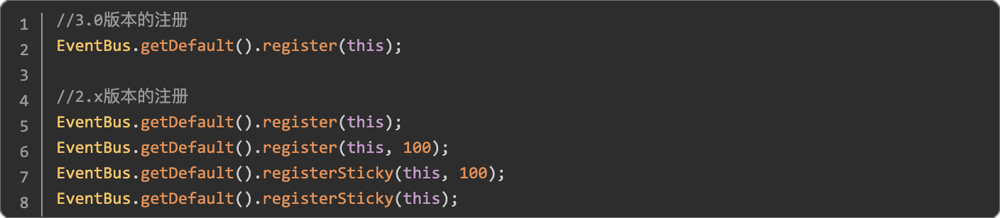

可以看到 2.x 版本中有四种注册方法，区分了普通注册和粘性事件注册，并且在注册时可以选择接收事件的优先级，由于 3.0 版本将粘性事件以及订阅事件的优先级换了一种更好的实现方式，所以3.0版本中的注册就变得简单，只有一个 register() 方法即可。

第二步，编写响应时间订阅方法

代码如下：


在 2.x 版本中只有通过 onEvent 开头的方法会被注册，而且响应事件方法触发的线程通过onEventMainThread 或 onEventBackgroundThread 这些方法名区分。

而在3.0版本中，通过@Subscribe 注解来确定运行的线程 threadMode，是否接受粘性事件 sticky 以及事件优先级priority，而且方法名不在需要 onEvent 开头。

第三步，发送事件。

我们可以通过 EventBus 的 post() 方法来发送事件，发送之后就会执行注册过这个事件对应类的方法。或者通过 postSticky() 来发送一个粘性事件，代码如下：


**三、源码分析**

这一节我们通过 EventBus 的使用流程来分析它的调用流程，通过我们熟悉的使用方法来深入到 EventBus 的实现内部并理解它的实现原理。

1、创建 EventBus

通常我们都是通过 EventBus.getDefault() 获取到EventBus对象之后，再在进行 register() 或者post() 操作，所以我们先看看 getDefault() 方法的实现：


这里就是设计模式里我们常用的单例模式了，目的是为了保证 getDefault() 得到的都是同一个实例。如果不存在实例，则调用 EventBus 的构造方法：


可以看出是通过初始化了一个 EventBusBuilder() 对象来分别初始化 EventBus 的一些配置，这里就是我们之前说的建造者模式的应用。

注释里我标注了大部分比较重要的对象，这里没必要记住，如果后面对某个对象不了解可以再回来看看。

2、注册过程源码分析

*1、register() 方法实现*

EventBus 3.0 中注册只提供一个 register() 方法，我们先来看看 register() 方法做了什么：


可以看到 register() 方法很简洁，代码里的注释也很清楚。

我们可以看出通过subscriberMethodFinder.findSubscriberMethods(subscriberClass) 方法就能返回一个SubscriberMethod 的对象，而 SubscriberMethod 里包含了所有接下来执行 subscribe() 的信息。

我们再去看看 findSubscriberMethods() 是怎么实现的，然后我们再去关注subscribe() 。

*2、SubscriberMethodFinder 的实现*

一句话来描述 SubscriberMethodFinder 类就是用来查找和缓存订阅者响应函数的信息的类。所以我们首先要知道怎么能获得订阅者响应函数的相关信息。

在3.0版本中 EventBus 提供了一个 EventBusAnnotationProcessor 注解处理器来在编译期通过读取 @Subscribe() 注解并解析，处理其中所包含的信息，然后生成 java 类来保存所有订阅者关于订阅的信息。

这样就比在运行时使用反射来获得这些订阅者的信息速度要快。

我们可以参考 EventBus 项目里的 EventBusPerformance 这个例子，编译后我们可以在 build 文件夹里找到这个MyEventBusIndex 类，当然类名是可以自定义的。我们大致看一下生成的MyEventBusIndex类是什么样的：


可以看出是使用一个静态 HashMap 即：SUBSCRIBER_INDEX 来保存订阅类的信息，其中包括了订阅类的 class 对象，是否需要检查父类，以及订阅方法的信息 SubscriberMethodInfo 的数组，SubscriberMethodInfo 中又保存了订阅方法的方法名，订阅的事件类型，触发线程，是否接收 sticky 事件以及优先级 priority。

这其中就保存了 register() 的所有需要的信息。

如果再配置 EventBus 的时候通过 EventBusBuilder 配置：

eventBus = EventBus.builder().addIndex(new MyEventBusIndex()).build();

来将编译生成的MyEventBusIndex 配置进去，这样就能在 SubscriberMethodFinder 类中直接查找出订阅类的信息，就不需要再利用注解判断了。

当然这种方法是作为 EventBus 的可选配置，SubscriberMethodFinder 同样提供了通过注解来获得订阅类信息的方法，下面我们就来看findSubscriberMethods() 到底是如何实现的：


注释很详细我们就不在多说，由于篇幅原因我们就不再分析 findUsingInfo() 方法，其无非就是通过查找我们上面所说的 MyEventBusIndex 类中的信息，来转换成 List从而获得订阅类的相关订阅函数的各种信息。

有兴趣的可以自己研究看看，下面我们就来看findUsingReflection() 方法是如何实现的：


这里通过 FindState 类来做订阅方法的校验和保存，并通过 FIND_STATE_POOL 静态数组来保存 FindState 对象，可以使 FindState 复用避免重复创建过多的对象。

最终是通过findUsingReflectionInSingleClass() 来具体获得相关订阅方法的信息的：


这里走完我们订阅类的所有 SubscriberMethod 都已经被保存了，最后再通过getMethodsAndRelease() 返回 List 至此所有关于如何获得订阅类的订阅方法信息，即：SubscriberMethod 对象就已经完全分析完了，下面我们来看 subscribe() 是如何实现的：

*3、subscribe() 方法的实现*

这里我们回到 3.2.1 的 subscribe(subscriber, subscriberMethod); 中去，通过这个方法我们就完成了注册，下面看一下 subscribe() 的实现：


以上就是所有注册过程，现在再来看这张图就会特别清晰 EventBus 的 register() 过程了：


3、事件分发过程源码分析

我们知道可以通过 EventBus.getDefault().post(“str”); 来发送一个事件，所以我们就从这行代码开始分析，首先看看 post() 方法是如何实现的：


首先是通过 currentPostingThreadState.get() 方法来得到当前线程 PostingThreadState 的对象，为什么是说当前线程我们来看看 currentPostingThreadState 的实现：


currentPostingThreadState 的实现是一个包含了 PostingThreadState 的 ThreadLocal 对象，ThreadLocal 是一个线程内部的数据存储类，通过它可以在指定的线程中存储数据，
而这段数据是不会与其他线程共享的。

其内部原理是通过生成一个它包裹的泛型对象的数组，在不同的线程会有不同的数组索引值，通过这样就可以做到每个线程通过 get() 方法获取的时候，取到的只能是自己线程所对应的数据。

所以这里取到的就是每个线程的PostingThreadState 状态。

接下来我们来看 postSingleEvent() 方法：


跟着上面的代码的注释，我们可以很清楚的发现是在 postSingleEventForEventType() 方法里去进行事件的分发，代码如下:


总结上面的代码就是，首先从 subscriptionsByEventType 里获得所有订阅了这个事件的Subscription 列表，然后再通过 postToSubscription() 方法来分发事件，再postToSubscription() 通过不同的 threadMode 在不同的线程里 invoke() 订阅者的方法，ThreadMode 共有四类：

1. PostThread：默认的 ThreadMode，表示在执行 Post 操作的线程直接调用订阅者的事件响应方法，不论该线程是否为主线程（UI 线程）。当该线程为主线程时，响应方法中不能有耗时操作，否则有卡主线程的风险。

适用场景：对于是否在主线程执行无要求，但若 Post 线程为主线程，不能耗时的操作；

2. MainThread：在主线程中执行响应方法。如果发布线程就是主线程，则直接调用订阅者的事件响应方法，否则通过主线程的 Handler 发送消息在主线程中处理——调用订阅者的事件响应函数。显然，MainThread 类的方法也不能有耗时操作，以避免卡主线程。

适用场景：必须在主线程执行的操作；

B3. ackgroundThread：在后台线程中执行响应方法。如果发布线程不是主线程，则直接调用订阅者的事件响应函数，否则启动唯一的后台线程去处理。由于后台线程是唯一的，当事件超过一个的时候，它们会被放在队列中依次执行，因此该类响应方法虽然没有PostThread 类和 MainThread 类方法对性能敏感，但最好不要有重度耗时的操作或太频繁的轻度耗时操作，以造成其他操作等待。

适用场景：操作轻微耗时且不会过于频繁，即一般的耗时操作都可以放在这里；

4. Async：不论发布线程是否为主线程，都使用一个空闲线程来处理。和 BackgroundThread不同的是，Async 类的所有线程是相互独立的，因此不会出现卡线程的问题。

适用场景：长耗时操作，例如网络访问。

我们再来看看 ```invokeSubscriber(subscription, event);``` 的实现：


实际上就是通过反射调用了订阅者的订阅函数并把 event 对象作为参数传入。至此 post() 流程就结束了，整体流程图如下：


4、解除注册源码分析

看完了上面的分析，再看解除注册就很容易了，解除注册只要调用 unregister() 方法。实现如下：


然后接着看 unsubscribeByEventType() 方法的实现：

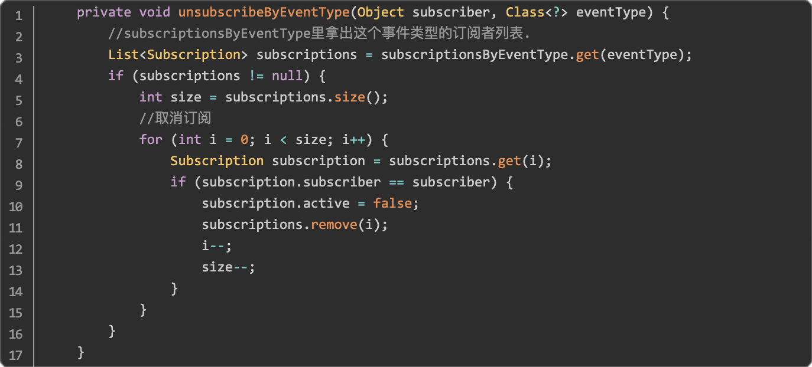

最终分别从 typesBySubscriber 和 subscriptions 里分别移除订阅者以及相关信息即可。

#### 2.2.6.2 OkHttp 网络请求框架
---
如果让我推荐一个最值得学习的 Android 开源项目，我一定会推荐 OkHttp。

因为 OkHttp 不仅是最重要的网络请求框架，而且 OkHttp 的代码规范，设计经典，是非常值得学习的开源项目。

最早的 Android 版本有另一套网络请求框架，但是由于 OkHttp 项目太优秀，最终 Android 源码都使用了 OkHttp 作为系统的网络请求框架。

对于 OkHttp 的学习，我在几年前看过源码，同时看过不少源码分析的文章。让我印象最深刻的一篇就是完整的把 OkHttp 的请求流程画出来，让人对整个框架的理解有种醍醐灌顶的感觉，不过在我写这篇文章的时候，我用 Google 搜索了很久都没有找到当年的那篇文章。

我想既然找不到文章，那是否可以找到那张经典的流程图呢？

我尝试又搜索了很多篇 OkHttp 源码解析的文章，终于在一篇文章中找到了这张图，更幸运的是在这张图的右下角，有一个模糊的水印，上面写着：@Piasy。

我瞬间就记起来了，紧接着立马搜索：OkHttp + Piasy。终于让我找到了那篇文章，他的标题是：拆轮子系列：拆 OkHttp 。文章的链接是：https://blog.piasy.com/2016/07/11/Understand-OkHttp/index.html 。

那张经典的流程图如下：


感谢 @Piasy 画出如此清晰的流程图，对于 OkHttp 的请求流程，大致分为三个步骤：创建请求，发送请求与处理结果。这些流程在 Piasy 的文章中也都进行了分析。我在这里就不再重复劳动了，欢迎大家点击文章链接前去学习。

此外在 Piasy 的博客中还有其他好几个系列的拆轮子系列，感兴趣的同学可以自行学习。

## 2.3 职场篇
---

### 2.3.1 职场沟通技巧
---
工程师的日常工作中，除了写代码之外占用最多时间的应该是就是各种沟通了。跟产品经理沟通需求细节，跟设计同学沟通 UI 细节，跟测试同学沟通业务逻辑，还要向老板汇报工作，有时候还要跟用户沟通解决问题。

如果沟通出现问题，导致最终产品实现跟预期不一致，这时候又要开始各种扯皮，浪费了大量时间不说，最后项目失败还会影响职业发展。结合自身经验，我总结了以下几点基本的沟通技巧：

**1、换位思考**

工作中经常会觉得产品经理提出的需求不合理，设计师对 UI 实现的要求太苛刻，领导总是看不到自己的努力。

如果你也经常这样感觉的话，不要总是觉得是别人的问题，首先要考虑是不是自己的问题，是不是自己没考虑清楚，是不是自己的要求确实太低，是不是没有及时跟领导沟通。

另外一点就是要多换位思考，想想如果你是产品经理你会怎么要求开发，如果你是设计师你会不会希望产品达到自己的要求，如果你是老板你最看重的是哪些方面的成绩。

把这些问题想清楚之后，就不会再纠结了。

**2、共同目标**

跟同事沟通的过程中难免遇到意见不一致的时候，比如产品同学的目标是推动 XX 个需求，而开发同学的目标可能是保持线上代码运行的稳定性，Bug 数量保持在 N 个以内，这时候一些风险大的需求开发同学就不太愿意接了。

这种情况下要多想想整个团队的共同目标，比如共同目标是把 DAU 做到 XX，转化率做到 XX。

那大家只要在这个共同目标之下，即使有新的需求也应该尽力完成。别总想着每个人自己的小利益，多想想共同目标，很多事情就容易推进了。

**3、争吵不解决问题**

职场中发生争吵是常事，争吵的时候内心很爽。吵完了之后发现跟同事之间的关系变了，事情最后也没有解决。无论是在职场还是在生活中，争吵被无数次的验证没法真正的解决问题，反而会增加很多烦恼。

所以学会管理情绪非常重要，尤其是在职场中，其实吵架是没有任何意义的。除了带来更多问题之外，不会带给你任何好处。而且在职场中对某个人的评价传播的会非常快，你会发现你跟 A 同事吵了之后，B，C 同事对你的态度好像都变了。

**4、别吝啬赞美之词**

人在潜意识里是不愿意承认别人比自己强的，这种意识有好有坏。

在现在的职场环境里，夸赞别人，尤其是当面夸赞别人，其实是一种很好的沟通方式。如果同事的方案很好，或者项目做的很成功，别吝啬你的赞美之词。

夸赞别人的同时，会让他感受到你认可他，重视他。不自觉的就拉近了你们之间的距离，以后合作起来也会更好。当然并不是一味的谬赞，赞赏别人也要有合理的出发点。

### 2.3.2 做好一个需求的要点
---
客户端开发中有一个很大的特点，就是经常 iOS 与 Android 会分别开发同一个需求。

虽然开发语言不一样，两个平台也有一些差距，对于大部分需求，差别并没有太大。

这样就会有个问题出现，往往同一个需求分别给 iOS 同学和 Android 同学一起做，不同的人就会出现不同的结果。

比如 A 工程师总比 B 工程师做得快，或者 A 工程师总是比 B 工程师更善于理解需求，或者两者中间总有一个代码里会出现各种各样的 Bug。

之所以会出现这个问题，一方面是由于能力原因，另外一个方面可能是做得差的那个人，并没有掌握怎样做好一个需求。

**1、敢于提出自己的观点**

有些工程师把自己的角色定位为需求实现方，觉得工程师只要负责实现需求就行，制定需求跟自己没关系，也没有参与的权利。

这是一个常见的错误认知。如果一个工程师一直只愿意做实现的话，最终的结果就是需求越来越多，如果实现的好成绩是别人的，实现的差自己还要背锅。

正确的方式是要把自己认为是需求制定者，全程参与整个需求的生命周期，毕竟工程师是需求的真正实现者。觉得需求不理解的地方要敢于提出问题，对于觉得不合理的需求也要敢于提出自己的观点。

即使最后未被采纳，但也可以帮助更好的理解需求。如果不认可需求，又不愿意提出观点，到时候出现了问题反而还要背锅。

**2、及时向上汇报**

需求变更，需求有争议或者需求实现方案无法敲定，这个时候最好快速去找老板沟通，让老板帮忙解决问题。

不能自己默默就把需求做了，如果到时候老板问起来跟他当初的预期不一致，很可能需求要返工，而且影响你在老板心中的形象。

向上汇报不仅仅是每周，或者每月定时的汇报。

你应该时常把最新的进展跟老板汇报，不是说事无巨细的汇报，要汇报那些最重要的东西。

比如某需求最后敲定的方案，以及某个需求可能要延期上线，或者某个需求线上数据不理想。

汇报的时候带上你自己的思考，以及下一步的安排，有问题也要敢于抛出去。很可能你觉得很难解决的问题，你的老板可以帮你轻松解决。

**3、需求要有文字留档**

为了防止需求开发过程中，或者上线后由于跟最初的预期不一致导致扯皮。

一定要在需求开始开发之前，把需求细节尽可能的跟产品同学完全确定，并且留下文字留档。

这一点非常重要，经常扯皮的发生就是由于只是口头通知了需求。有可能是产品记错了，也有可能是工程师理解错了，总之出现这种情况是非常难受的。

**4、敢于拒绝不合理需求**

敢于拒绝不合理需求，这里的重点是不合理，而不是什么需求想拒就拒。

如何判断需求是不是合理是挺难的一件事，不过有些场景下的需求是显然不合理的，这个时候要敢于拒绝。

比如第二天就要线上发布了，结果晚上突然插进来新的需求，即使匆忙完成开发也没办法完成测试，像这种需求显然就是不合理需求。

如果评估风险较大要首先提出拒绝，然后上升到老板那里解决，如果一定要做，那就要把风险完整的抛出。

不要到时候出了问题反而又要背锅。

### 2.3.3 做好长期规划
---
最近几年有一个词非常流行，就是：长期主义。似乎每个人都愿意把自己称为长期主义者。但是又有多少人真正给自己定过长期目标，并且坚持实现目标的呢？

我曾经问过不少朋友有没有制定过 5 年后的职业目标，或者有没有想过 5 年之后你会从事什么工作？

一部分朋友的回答都是没有考虑那么远，另外一部分说压根没有考虑过。

跟他们比起来，我可能算是特例了，我从工作的第一年就开始制定目标，如果目标达成之后还会制定新的目标。

我真正的感受到了制定长期规划的好处，我建议你可以制定一个长期 5 年的目标，再制定一个 1- 2 年的阶段性目标。

阶段性目标完成之后，再考虑是否调整 5 年的远期目标，以及在此基础上更新新的长期目标。

**1、制定 5 年远期目标**

虽说是远期目标，也不能太不切实际，要是可执行的目标。

比如：5 年之后年薪百万就比 5 年之后财务自由靠谱的多。远期目标可以很简单，可以比较宽泛。

比如我当年的目标就是：参与全民 APP 的开发，换个说法就是进入 BAT 工作。

好的远期目标是可以通过任务分解来逐年达成的，比如进入 BAT 工作，我可以先从小团队到一个中大型公司，然后再进入 BAT。年薪百万也可以分解成两年达到年薪50万，五年达到年薪百万。

**2、制定 1-2 年中期目标**

制定好远期目标之后，可以分解成一个中期目标，中期目标要结合你现在的处境来定，可以包括多个方面，比如薪资水平，职级或者成为项目 owner，也可以是参加多少个开源项目等等。

中期目标一般 1 年左右最好，目标也最好不要超过 3 个。

我知道很多人每年都会制定年度计划，但是里面包含了太多的目标，往往最好只能把上一年订的目标改成下一年的目标，实际上没完成任何目标。

别设定太多目标，把目标聚焦起来，这样反而更容易达成。

**3、阶段性复盘与目标调整**

定好目标之后，在努力的过程中，可以几个月进行一次复盘和调整。看目标是不是设计的太容易或者太难，没人能总是达成目标，也没人会永远达不成目标。

目标提前达成就再设定新的目标就行，如果觉得没希望达成，适当的下调目标也很正常。

另外目标达成之后，记得要给自己一些奖励，体验成功的喜悦。

### 2.3.4 要不要拒绝 996 ？
---
写这篇文章时，手机刚收到新闻推送：人社部最高法明确 996 违法。

996 （早上9点上班，晚上9点下班，每周工作6天）最早是 58 同城在 2016 年提出的，近几年越来越多的互联网公司开始效仿，内卷越来越严重。

好在最近已经开始慢慢变好，几家互联网大厂已经声明取消周末加班。

我希望 996 可以消失，虽然目前来看要走的路还有很远，所以我还是决定写一篇关于 996 的文章，如果在你阅读这篇文章的时候 996 已经消失，把文中的“996“全部替换成“加班”也是一样的。

**1、要不要拒绝 996？**

回答这个问题之前，先交代一下我的情况，在我从业的 8 年多时间里，有接近一半的时间是 以类似 996 度过的。

在大多数时间，为了能达到给自己定的目标，其实我没有选择的余地，如果想往上走就要接受 996。

所以在回答要不要拒绝 996 之前，请你先考虑在下面的两种情况下，你是否愿意 996 ？

+ 提升工作能力。

想象这样一个场景，两位三年工作经验的工程师同去面试，其中一个展现出了至少有五年工作经验的能力，另一个只是普通三年经验的工程师，那么谁面试通过的可能性更大呢？显然是工作能力更强的那位。

如果你想在职业的前几年快速提升技能的话，最好的方法就是付出比别人更多的精力来工作，简单来说就是加班，有意义的加班。

这种情况下的加班会在未来给你带来更多潜在的收益，更容易升职，更容易在面试中胜出。

+ 想赚更多钱。

实行 996 的公司一般工资更高， 这些公司一般业务发展较快，运气好的话还能从期权里分享到公司成长带来的收益。

如果你不怕吃苦又想赚钱，想尽快在大城市里立足，通过 996 来获得更高的工资也是一种选择。

你可以仔细想想，如果这两点都不会让你接受 996 的话，你要坚决拒绝 996。如果你可以接受 996 的话，那你最好要问问你自己，你能坚持多久 996？

**2、要坚持多久 996？**

选择了 996 之后，会面临两个比较大的问题，第一个是长时间工作导致身体健康出现问题，如果你发现身体素质明显变差了，或者头疼胸闷，以及遇到任何之前未曾感到的不适。

这个时候一定要注意了，尽早去医院检查，并且考虑是否要减少工作时间。一定不要为了工作把身体健康丢掉。

第二点是长时间工作导致本来属于生活休闲的时间被占用，长期持续会引发心理问题。

如果再遇到一些工作或者生活上的挫折，容易自暴自弃，觉得生活没有意义，从而引发一系列的问题。如果你开始有这个问题，可能就要开始考虑是否放弃 996 了。


# 3.高级工程师进阶
---
高级工程师阶段，无论是编程能力还是业务能力，你都具有了一些不可替代性。你通常负责新技术的预研，重要需求推进以及新项目的技术选型。高级工程师会让老板和同事觉得：非你不可。你更多的时间是在解决别人解决不了的事情，尝试业界还未尝试过的方案以及帮助其他工程师成长。

到了这个阶段编程语言已经不重要了，一切选择都为了业务更好的发展。同时也要考虑更多代码之外的事情了。

## 3.1 认知篇
---

### 3.1.1 高级工程师的特点
---
工作了 3-5 年之后，一部分能力强又运气好的同学可以成为高级工程师。也许每个人的发展路径都不同，但这些高级工程师都具有某些相同的特点：

**1、不被某一种编程语言束缚**

Android 虽然主要使用 Java，但是涉及到 Gradle 插件的开发要用 groovy。

音视频相关的底层开发又要懂 C++，如果做 Web 容器需要跟前端同学对接，还要懂 JavaScript，懂前端。

有时候写写脚本还需要懂点 python。所以说到这个阶段，如果还只停留在某一种编程语言的话，往后的路就会越来越难走。

对于 Android 工程师来说 Java 可能已经先入为主，平时可以自己选择的话，肯定优先选择 Java，这是很符合人性的。

但是要明白的是既然你可以学会 Java，你就能学会其他任何一种编程语言。

语言是一种工具，做不同的事情会有特定好用的工具。优秀的工程师平时都会主动关注其他语言的发展和应用，假如真的在工作中会用到，也已经早已上手了。

**2、站在更高维度思考**

高级工程师不会只站在代码实现的层面来思考问题，不会因为代码实现比较困难就否定业务需求。

优秀的工程师会站在业务层面思考需求，甚至站在产品架构的层面来思考问题。

比如遇到新需求的时候，由于对业务的熟悉，可能就会考虑到这个需求是否会跟其他业务有冲突。

或者评估需求是否打破了业务规则，这些想法经常会避免很多线上问题的发生。

学会站在更高维度的思考，凡事想的深入一些，并把想法映射到代码实现里。你会发现项目越做越轻松，新的需求对代码的改动也会越来越小，开发效率也就越来越高了。

**3、站在别人的角度思考问题**

多站在别人的角度思考问题，不要总把自己的想法看的太重。也不要认为自己总是对的，别着急否定别人，也别太固执己见。

同一个需求可能会有很多种方案的解法，你自己坚持的那种不一定就是最好的。

尝试站在别人的角度来思考为什么别人会跟自己提出不同的方案？是不是自己的方案更符合自身的利益？是否为了共同目标先让步？平时多想想类似的问题，以后的沟通可能会更顺利。

**4、技术是为了服务业务**

高级工程师不会炫技，也不会学出复杂难以维护的代码。懂得技术是用来服务业务的，先将业务再讲技术。

不要觉得用了某一个框架无法实现业务要求的功能，就说业务需求不合理。多想想是不是因为自己提前没考虑到未来业务的发展方向，所以选择了错误的框架？

没有业务支撑的技术其实没有任何意义。

记得几年前我在一家公司花了很大的精力，对新项目设计了全新的架构，所有框架都是当时最新的，但是我没有考虑团队的整体能力，大家光理解项目架构都花了好几天，开发起来效率也不是很高。

最后项目没有成功，全新架构也没有用处了，新项目还是沿用就项目的架构，就是因为开发效率高。

实际证明能快速完成业务开发的代码就是好代码，概念先进又漂亮的代码也许是无用的代码。

### 3.1.2 参与开源项目
---
学历跟工作经历是评价一个求职者重要的两个因素，如果这个人是工程师的话，那么还有一项很重要，就是是否参与过开源项目。

拿我自己来说的话，我在面试求职者之前如果他写了 GitHub 首页的地址，我一定会提前去看看，如果项目很不错会在面试里获得挺多加分。

**1、为什么要参与开源项目？**

第一、提升编程能力。

经常会有朋友问我，大厂的项目代码是不是都写的很好？

其实不是这样，大厂的代码因为业务的特性，开发时间的限制，代码质量其实远远不如优秀的开源项目。

如果你参与过优秀的开源项目，那么你的编程能力已经超过绝大部分在大厂工作的工程师了。

开源项目的开发流程，跟正常的业务流程相似。

如果你参加的开源项目多了，你就会发现日常的开发中的难度还没有你参与的开源项目难度高，很多公司的开发流程还没有开源项目的流程规范。

第二、提升社区影响力，认识更多优秀的工程师。

良好的社区影响力可以给你带来很多工作机会，演讲机会等等。

另外你还能认识更多优秀的工程师，进入优秀的工程师圈子之后，在大家日常交流的过程中，你就能很容易的了解业界最前沿的技术趋势。

第三、为开源社区做贡献。

正是因为有每一位热衷于分享的工程师无私的为社区做贡献，我们才能高效的完成日常工作，给自己带来更多休闲娱乐的时间。

有能力的工程师应该反哺开源社区，让更多人从你开源的项目中受益，从而让开源社区不断的发展下去。

**2、参与开源项目的注意事项**

第一、尊重社区文化。

如果你想参与一个项目，或者给某个项目提一个 issue，那么首先你应该在项目的 README.md 或者 wiki 中找到 issue 提交的规范，并且尽量使用英文提问。跟他人沟通的时候要保持友善，开源社区中没有人是有任何义务帮助你的，即使别人没有帮你解决问题，也应该表示感谢。

第二、贡献符合规范的代码。

给项目提交 Pull Request 的时候，也要注意代码规范要跟项目保持一致，并且按照要求的格式提交。

**3、做自己的开源项目**

第一、不要重复制造轮子。

这点基本上是工程师之间的共识，比如某个项目已经非常好用，就直接使用就好了，没必要按照自己的想法再造一个功能一模一样的项目。

除非你觉得现在这个项目无法满足你的需求，或者你发现了在某些场景下这个项目的问题。

这种情况下首先考虑是可以在目前的项目基础上修复之后，再提交 Pull Request 到这个项目里。

第二、标注参考项目。

如果你的项目是参考其他开源项目或者某篇技术文章，那么最好在 README.md 里标注好参考项目，一方面感谢提供灵感来源的同学，另一方面这样的做法可以让社区中的信息都串联起来。

这一点很重要，如果你参考别人的项目，但是却没有在任何地方标注，如果被人发现了，很容易被人觉得这是抄袭。

第三、适当的推广。

项目写好了，也需要配合一些推广，可以在 QQ 群或者 微信群里推广。也可以把项目写出一篇介绍文章，在各大网站发布。还可以投稿到各大微信公众号里，如果你的项目很不错，很容易获得一些推广机会。

### 3.1.3 如何判断技术发展趋势
---
高级工程师还要拥有一项核心能力，那就是判断技术发展的趋势，引领公司的业务发展。

举个例子：公司要选择一种跨平台开发框架，并且可能主导未来 80% 以上的业务落地，在 React Native，Flutter，Web 前端三者中选择一个方向，你会怎么选？

当然这里只是引出这个问题，具体的选择我会在后面的文章中分析。在这个问题中，如果你看清了未来 1-3 年技术发展的趋势，就能很好的做出决策。

**1、站在业务基础上思考**

前面我们说技术是服务于业务的，反过来业务也会推进技术的发展。

所以业务的发展趋势会带领技术的发展。比如最初一个客户端 APP 一般也就几个客户端开发，所以大家共用一个仓库一起开发的问题也不大。

但是随着业务发展越来越大，可能会同时有几十个客户端开发一起开发同一个 APP，这样再共用一个仓库就不现实了，所以组件化，模块化架构就应运而生了。

脱离业务发展的技术无法落地，自然也就无法流行。能更好的服务业务的发展，业务与技术相互强化，相互成就这样演化出来的技术架构才是最好的。

所以在判断未来技术趋势的时候，多想想业务发展的趋势是什么，技术怎么发展才能更好的服务业务，趋势就自然而然的出现了。

**2、关注社区技术发展**

关注自身业务的同时，还要关注社区技术整体的发展，我一般通过下面两种方式长期跟踪：

一、GitHub Trending 长期榜单。

我一般会每隔几周就去到 https://github.com/trending 上面去看看最近有什么流行的项目，遇到比较好的项目会先 star，然后找时间研究。通常长期霸占排行榜的项目就是目前最流行的项目。

二、各大厂技术公众号。

这几年各大厂都陆续开通了微信技术公众号，经常会在公众号里更新最新的技术分享，很多文章只有思路并没有对应的开源项目，不过对于判断技术发展趋势也足够了。

我主要关注了以下这些公众号：

腾讯：WeMobileDev（微信移动客户端开发团队官号），腾讯技术

阿里：阿里技术，闲鱼技术，U4内核技术，Alibaba F2E

美团：美团技术团队

字节跳动：字节跳动技术团队

快手：快手大前端技术

三、国内外主流社区。

国内主要有 infoq，CSDN，掘金等。国外我一般会在 Twitter 或者 GitHub 上关注一些技术大牛，偶尔会去看看他们的动态。

一般国外比较火的技术文章，国内社区会比较快的翻译过来。

## 3.2 知识篇
---

### 3.2.1 了解跨平台开发
---

#### 3.2.1.1 跨平台开发技术
---
在 PC 时代，Web 技术一直是最成熟的跨平台方案。

在 W3C 标准之下，相同的前端代码可以运行在不同平台的不同浏览器内核中，并完成相同的功能。

但是到了移动互联网时代，由于最初的手机性能较差，导致手机自带的浏览器的性能有限，而且针对移动互联网的前端技术发展也处在早期阶段，当时在手机上使用浏览器会出现明显的性能缺陷。

为了解决这个问题，Facebook 提出了 React Native 的方案。

#### 3.2.1.2 React Native
---
React Native（[官网](https://reactnative.dev/) ，[中文官网](https://reactnative.cn/) ）在官网最显眼的位置，写着 React Native 的口号：Learn once, write anywhere （一次学习，随处编写）。

虽然这个口号有些夸张的成分，但是 React Native 的出现，还是引领了跨平台方案演化之路，React Native 的核心设计理念就是用 React 来创建 Android 和 iOS 的原生应用。

React 是一种很流行的前端开发框架，它颠覆了传统前端的开发体验，通过声明式与组件化的构建方式来开发前端页面，是目前最流行的前端开发框架之一。所以前端开发同学可以很容易上手 React Native。

为了能让 React 书写的代码可以执行，React Native 内置了一个 JS 执行引擎 JavaScriptCore ，JS 执行之后再通过与 Android 建立的 Bridge 来调用原生代码，最终用原生的组件绘制出 UI 组件。React Native 的技术架构图如下：（引用自：https://juejin.cn/post/6916452544956858382 ）。


最上层的 JavaScript ( UI ) 就是用 React 编写的业务代码，下面的一行是围绕 React 生态的技术栈与组件层。

再下面的 JavaScript VM 就是我们刚刚说的 JS 执行引擎，yoga 是一个支持 Flex 的布局引擎。

黄色部分的 Android Bridge 就是用来建立 JS 引擎与 Android 原生的桥接代码，通过桥接代码，可以把 JS 引擎内要执行的指令传递到原生环境中，最终调用原生的 API 来执行最终的页面绘制，或者交互操作。

React Native 的**优点**很明显：

1. 使用 React 技术栈可以让前端开发快速上手 React Native ，学习成本很小。

2. 一套代码同时运行在 Android 与 iOS 平台上，并且接近前端开发的开发体验，提高了开发效率。

3. 使用原生组件进行绘制，绘制性能明显好于 Web 浏览器。

另一方面 React Native 的**缺点**也比较多：

一、由于所有跟原生组件的交互都需要通过 Bridge 进行，大量频繁的 Bridge 调用依然会使应用出现明显的性能问题，比如执行动画和列表的快速滑动。

二、JS 引擎性能与平台差异的问题，记得 2019 年以前 React Native 在 Android 上使用的是一个很低版本的 JavaScriptCore ，而在 iOS 平台则使用系统自带的 JavaScriptCore。

两个平台版本不一致，从而导致一些问题。不过 React Native 团队后来推出了自研的 Hermes ，最近刚刚同时支持 Android 与 iOS 平台。

三、使用原生组件绘制无法保证平台表现一致性，由于 React Native 会把组件的渲染托管给 Android 或者 iOS 原生，这样做的一个问题就是在两个平台中，我们仍然需要做很多关于平台间的适配，最终无法达到提升整个项目开发效率的目标。

更多关于 React Native 的优缺点，Airbnb 团队曾经写过一系列关于 React Native 的文章，Airbnb 团队曾经是 React Native 的忠实用户，但是随着业务的发展最终他们不得不放弃对 React Native 的使用。

具体的原因可以点击链接查看原文：https://medium.com/airbnb-engineering/sunsetting-react-native-1868ba28e30a 。

如果英文不太好的同学，也可以看这篇中文总结的文章： https://zhuanlan.zhihu.com/p/38288285 。

总结一下， React Native 曾经是很火热的跨平台开发框架，至今仍有很多团队使用 React Native 开发应用，但是它的一些问题让人不得不考虑是否有更好的方案来替代 React Naive，正是在这种背景下 Flutter 出现了。

#### 3.2.1.3 Flutter
---
Flutter（[官网](https://flutter.dev/) ，[中文官网](https://flutterchina.club/) ）的出现，一度被认为是跨平台技术的终极解决方案。

其官网的介绍是这样的：Flutter is Google’s UI toolkit for building beautiful, natively compiled applications for mobile, web, desktop, and embedded devices from a single codebase。

显然 Google 对于 Flutter 的野心不仅仅在于构建 Android 或者 iOS 平台应用，Google 对于 Flutter 的期望是用同一套代码在全平台开发应用，甚至包括下一代操作系统。

Flutter 的设计是为了开发完整应用，并不是仅仅内嵌于原生应用中。Flutter 使用 Dart 语言进行开发，有一定的学习成本。Flutter 框架的整体设计图如下：（引用自官网：https://flutterchina.club/technical-overview/ ）。


从架构图中可以看到，Dart Framework 层承载了最多的功能，包括 Material UI 组件，Widgets 组件，动画，手势与基础框架都是在 Dart 中完成的。

然后下层的 C++ Engine 层负责了渲染，Dart 虚拟机的管理，系统事件，平台通信等功能。最下方的平台相关的逻辑其实只有很少的一些，比如原生插件，以及 Reander Surface 初始化等操作。

Flutter 通过完全接管渲染解决了平台不一致的问题，解决了 React Native 无法解决的问题。

而且 Flutter 的渲染性能几乎可以达到与原生的性能一致，这点让 Flutter 变的非常有吸引力。

跟多关于 Flutter 的原理与实践可以参考这篇美团技术团队的文章：https://tech.meituan.com/2018/08/09/waimai-flutter-practice.html 。

另外闲鱼，字节跳动团队对 Flutter 均有实践，可以搜索进行学习。关于 Flutter 的优缺点，我们再下一篇文章中详细分析。

#### 3.2.1.4 Web 前端技术
---
Web 前端技术一直以来都是跨平台技术中不可或缺的组成，很多团队一边诟病 Web 页面运行在客户端的性能问题，一边又不得不开发大量的 Web 页面。其中最主要的原因就是 Web 开发的效率很高，其天然具有动态化能力。这两点也是 React Native 与 Flutter 无法比拟的。

Web 前端技术的发展至少有几十年了。从最早的 HTML + CSS + JavaScript 开发模式，再到后来 JQuery 的出现，再到这几年 Vue 与 React 大行其道，前端技术一直以惊人的速度发展，前端开发行业也不断壮大。

对于不了解 Web 技术的同学，可以先从 w3school 的在线教程了解前端开发：https://www.w3school.com.cn/ 。

浏览器是负责解析 HTML + CSS + JavaScript 三者并渲染出页面的引擎，目前最流行的浏览器引擎是苹果开发的 webkit 内核，还有谷歌在 webkit 内核的基础上进行开发的 chromium 内核，两者在 W3C 与 ECMAScript 的标准下基本对齐了大部分功能，所以 Web 前端技术拥有天然的跨平台能力。

关于浏览器内核的渲染原理，可以参考 UC 内核团队翻译的一篇：一颗像素的故事。这篇文章整理自 Chromium 工程师 Steve Kobes 一篇名为 Life of a Pixel 的 PPT。

它介绍了浏览器内核如何将 Web 页面内容转换为像素点，也就是浏览器的渲染流程。这是一篇很经典的文章。

有兴趣的同学可以点击链接查看：https://mp.weixin.qq.com/s/QoFrdmxdRJG5ETQp5Ua3-A 。

### 3.2.2 Flutter 是跨平台的未来吗？
---
随着 React Native 逐渐没落， Flutter 的发展有种势不可挡的感觉。

有人说 Flutter 就是跨平台的未来，也有人说 Flutter 成也 Dart 败也 Dart，即使是同样的判断条件也有人得出不同的结论。

在这里我把 Flutter 目前的优缺点罗列出来，最后再给出我个人的看法，希望你可以独立判断出 Flutter 是不是适合你的项目。

#### 3.2.2.1 Flutter 的优点
---
**一、多端一致性强**

由于 Flutter 接管了渲染流程，不是像 React Native 那样使用 Android 或者 iOS 的原生控件，所以能保证不同平台可以绘制出体验完全一致的控件，解决了两端不一致性的问题。极大的提升开发效率。

**二、性能媲美原生**

Flutter 的架构设计合理，Dart VM 配合 skia 渲染引擎，再加上演化自 Chromium 内核的一系列优化，让 Flutter 的运行性能基本达到与原生一致。

**三、开发效率比原生更高**

多端一套代码，完善的开发工具支持，热构建等功能。让 Flutter 在大部分情况下的开发效率远远大于分别开发 Android ，iOS 客户端，节省人力的同时还提升了开发效率。

#### 3.2.2.2 Flutter 的缺点
---
Flutter 的优点非常突出，足以称为目前最优秀的跨平台开发框架。但是 Flutter 对于目前国内的产品形态来说，它的缺点也非常明显：

**一、学习成本高**

Flutter 即不使用 JavaScript 也不使用 Java 或者 Swift 语言开发，而使用并不是很流行的 Dart 语言开发，这意味着无论是客户端工程师还是前端工程师都需要重新开始学习一门新语言，无形之中就增加了学习的时间成本。

**二、不适合跟原生代码共存**

Flutter 的设计初衷就是为了同时兼容多个平台，它的设计是为了让开发者完全使用 Flutter 独立开发应用。

但是目前国内的使用场景中显然只能把 Flutter 内嵌到原生应用中，将某些页面使用 Flutter 替代，这样就需要在 Flutter 的基础上进行二次开发才可以迁移到现有应用中，增加了开发成本。

好在国内有不少团队开源了迁移 Flutter 的工具，其中比较知名的是闲鱼团队的 flutter_boost ，地址：https://github.com/alibaba/flutter_boost 。

**三、某些情况下的性能问题**

虽然大部分业务的页面使用 Flutter 开发可以达到原生一致的性能，但是在某些极端情况下，Flutter 又会出现一些性能问题。

比如一些复杂的动画，可以看到这篇文章中对 Flutter 的性能测试：https://www.infoq.cn/article/uyiitcu0eatdul25ecxg 。

另外在一些复杂的使用场景中也可能会出现性能问题，而且通常很难解决，只有想办法兼容。

**四、包体积过大，动态化，热修复等功能支持不完善**

由于 Flutter 自带渲染引擎，导致包体积会增大很多，一般的团队很难有能力和精力对 Flutter 进行裁剪。

而且 Flutter 对动态化，热修复等功能的支持也很不完善，基本上都需要二次开发。

#### 3.2.2.3 我对 Flutter 的看法
---
结合 Flutter 的优缺点，以及平时跟各大厂 Flutter 业务团队成员的沟通看下来。

我对 Flutter 在项目中使用的前景并不乐观，虽然 Flutter 的优点非常诱人，但是大量跟商业产品结合的问题，以及各种让你意想不到的问题会极大的阻碍 Flutter 在团队内部的推进。

与其花费很大精力来学习 Flutter 并且对 Flutter 框架做二次开发来满足业务使用的话。最终还不如使用原生开发或者前端页面结合 Web 容器。

所以对于 Flutter 来说，有能力有条件的团队用来进行业务探索是很不错的，但是对于业务迭代迅速，开发资源并不充足的团队来说，老老实实的进行客户端页面的开发，或者使用 Web 前端技术进行跨平台业务的开发可能会更好。

### 3.2.3 最优跨平台方案是什么？
---
前两节我们对比了各种跨平台方案，那么在当下（2021年）真正成熟的跨平台方案是什么呢？我们先来看看小公司跟大公司都是怎么做的，最后再给出我认为最优的跨平台方案。

#### 3.2.3.1 小公司的选择
---
对于小公司来说，几乎没有专门评估各种跨平台方案或者自研跨平台方案的时间。

小公司最重要的目标就是如何让代码更快更好的服务业务，并且长期支撑业务的发展。

在这个前提下， Web 前端技术 > 客户端原生开发 > Flutter/ React Native 等跨平台方案。

最好最适合小公司的方案就是 Web 前端了。

在目前的环境下，小公司也许都不需要单独进行客户端 APP 的开发，大部分情况下公司的业务是运行在浏览器中，或者以微信小程序的形态运行。

这里我们简单解释一下微信小程序，微信小程序是微信自研的一种技术，可以让第三方业务以小程序的形态在微信中运行。

小程序的原理跟 Web 前端类似，但是微信对开发语言进行了定制，使用微信独有的 DSL 进行开发。并且对性能，安全等方面均有优化，在体验上也基本可以达到原生体验。

更多信息可以了解微信小程序开发文档：https://developers.weixin.qq.com/miniprogram/dev/framework/ 。

对于需要微信小程序，也需要前端页面，甚至需要客户端 APP 的团队来说，如果有一种工具可以同时跨这几个平台就好了。

在这个背景下百度团队开发了 taro 框架，https://github.com/NervJS/taro 。

taro 是开放式跨端解决方案，并且免费开源。而且支持 React/Vuew 等多种前端框架开发微信小程序/支付宝小程序，以及普通的 H5 页面，甚至还支持编译成 React Native 应用。

目前 GitHub star 数已经接近 3W，非常推荐小团队使用 taro 来开发产品。

#### 3.2.3.2 大公司的选择
---
对于有钱有人还有时间的大公司来说，选择就比较多了。

不仅有能力引入 React Native ，Flutter 等框架，还可以对这开源框架进行二次开发。

还有不少大公司还完全自研了跨平台开发框架可是折腾到现在，最核心的业务还是离不开 Web 前端。

举几个例子看看：

**一、微信公众号文章页面**

微信 APP 中除了最核心的聊天页面，朋友圈页面之外，需要频繁访问的页面也许就是公众号的文章页面了。

公众号的文章详情页面不仅需要满足各种样式，各种交互的富文本显示功能。

还一定要有跨平台能力，因为页面需要在 Android ，iOS 客户端，还有 PC 浏览器中展示。但是在微信公众号页面技术演进了这么多年之后，依然采用的是 Web 前端技术，足以看出在如此核心的业务上，最适合的技术能力还是 Web 前端技术。

我通过研究微信公众号页面发现，微信公众号页面通过客户端进行了多项优化，包括文章数据的预拉取，WebView 预创建，页面预渲染等技术，基本可以把体验做到接近原生应用。

**二、春晚活动，各种大促活动页面**

最近几年峰值流量最大的业务场景可能就是春晚活动了。

支付宝，淘宝，抖音，快手，百度都陆续跟春晚进行了合作。但是在活动业务的技术选型中，这么多家大厂毫无例外的都大量采用了 H5 页面。

其实也不难理解，Web 前端技术在开发效率，技术成熟度，动态性，兼容性上远超了目前所有跨平台方案。带来的问题仅仅是一些性能问题，而且如果优化的很好，用户几乎体验不出来差别。

所以从这些最前沿的技术方案来看，Web 前端技术仍然是最好的方案。

**三、微信小程序与支付宝小程序**

2017 年微信发布了小程序的第一个版本，作为微信未来最重要的业务场景，小程序的设计依然是紧密结合 Web 前端技术，并且配合客户端能力，原生组件同层渲染等技术，带来更接近原生的体验。

与此同时，支付宝客户端内的大部分业务，也都是通过 Web 容器承载的，包括蚂蚁森林，花呗，余额宝等国民级业务，基本都是用了 Web 前端技术进行开发，同时结合浏览器内核，客户端的各项优化大幅提升了运行在 Web 容器中 H5 页面的性能。

在 Web 前端业务大行其道的同时，各大厂也广泛探索了 Flutter，自研跨平台引擎等各种方案，但是依然很难撼动 Web 前端技术在业务中的地位。目前来看 Web 前端技术在跨平台技术的选型中，仍然是最优选择。

#### 3.2.3.3 最优跨平台方案
---
通过上面的分析，我认为目前最优的跨平台方案是：Web 前端 + Web 容器。

其中 Web 前端还是传统的前端页面的开发方案，对技术方案与架构没有任何限制，对于任何前端优化也都是友好的。

对于小团队来说，只做好前端优化基本上也就够了。

如果有自己的客户端，那么通过客户端手段打造一个满足业务需求的 Web 容器，也是很有必要的。

不过什么是 Web 容器？

简单来说就是在客户端中承载 H5 页面的组件，你可以简单的认为就是 WebView，但是会对 WebView 组件做非常多的优化。

具体的优化点我简单列举如下：

**一、替换系统浏览器内核**

由于 Android 自带的 WebView 版本碎片化很严重，而且内核版本各不相同经常出现兼容性问题，所以一般要替换成统一的内核。

目前国内有两个比较成熟的内核方案，一个是 UC 浏览器团队开发的 UC 内核，官网：https://dev.ucweb.com/ 。另外一个是 QQ 浏览器团队的 X5 内核，官网：https://x5.tencent.com/ 。

两个内核都是基于 Chromium 内核开发的，并且针对移动端业务做了很多性能优化，稳定优化。基本可以解决系统内核版本不一致，以及兼容性导致的闪退问题。

不过接入的时候需要注意了解好接入方案，并且做好线上数据监控与回滚等策略。

**二、通过 JSAPI 提供原生功能**

客户端 Web 容器还有一个好处就是通过跟前端页面的通信，来做到一些客户端代码能做到的事情，比如弹出一个原生 UI 样式的对话框，以及使用原生通道发送请求。

我们把这一整套功能成为 JSAPI，完整的 JSAPI 功能能大幅提高 H5 页面在客户端中的体验。

**三、资源离线包功能**

访问 H5 页面的时候，最让人头疼的一件事情就是，在弱网环境下，页面经常长时间白屏，加载速度非常慢。

这是由于短时间内发起了大量请求，比如页面，以及页面中各种资源的请求，再加上网络环境很差，就导致白屏很久。

客户端 Web 容器可以很好的解决这个问题，通过离线包功能，可以在用户访问页面之前，就将前端页面资源打包下发到客户端本地。

这样就无需在访问 H5 页面的时候发起对主页和资源的请求，只需要进行业务请求即可，可以极大的提升页面加载速度。

**四、WebView 预加载**

无论是 iOS 还是 Android，本地 WebView 初始化都要不少时间，所以在内存与时机允许的情况下，可以预先初始化好 WebView。

这里分两种预加载：

首次预加载：在一个进程内首次初始化 WebView 与第二次初始化不同，首次会比第二次慢很多。

原因预计是 WebView 首次初始化后，即使 WebView 已经释放，但一些多 WebView 共用的全局服务或资源对象仍没有释放，第二次初始化时不需要再生成这些对象从而变快。

我们可以在 APP 启动时预先初始化一个 WebView 然后释放，这样等用户真正走到 H5 模块去加载 WebView 时就变快了。

WebView 池：可以用两个或多个 WebView 重复使用，而不是每次打开 H5 都新建 WebView。

不过这种方式要解决页面跳转时清空上一个页面，另外若一个 H5 页面上 JS 出现内存泄漏，就影响到其他页面，在 APP 运行期间都无法释放了。

可以参考美团点评的这篇文章：https://tech.meituan.com/2017/06/09/webviewperf.html 。

WebView 预加载这段引用自 Bang 的博客，原文在此：http://blog.cnbang.net/tech/3477/ 。

原文不仅提到了 WebView 预加载技术，还分析了其他很多种针对于 H5 页面的优化，大家可以点击查看。

### 3.2.4 大型项目架构解析
---
高级工程师需要具备构建大型项目架构的能力，可以通过学习优秀的业务架构来提升自身的架构能力。

不过真正在商业项目中搭建架构的时候，一定要尊重技术服务于业务的原则，并且清楚只有在业务发展的过程中演进出来的架构才是最优架构。

凭空想象或者照搬过来的项目架构只能是无本之木。

我找到了几篇国内顶级团队分享的关于架构演进的文章，希望能对你有所帮助：

**1. 微信架构解析**

微信早已是第一国民应用，微信客户端几乎覆盖了国内所有智能手机，从 2016 年开始，微信分享了好几篇关于微信架构演进的文章。

我找到了以下四篇，为了方便学习，我按照时间顺序整理如下：

2014 年，微信 Android 客户端架构演进之路：https://mp.weixin.qq.com/s/epFbkJUO3GWWUmWbK019PQ 。

这是微信团队在 2014 深圳架构师峰会上的分享，是我找到最早微信团队介绍关于微信客户端架构演进流程的文章。

2017-06-30，微信 Android 模块化架构重构实践：https://mp.weixin.qq.com/s/6Q818XA5FaHd7jJMFBG60w 。

2019-07-01，基于小程序技术栈的微信客户端跨平台实践：https://mp.weixin.qq.com/s/V-H3pF9ytfXRhZG0PGIKsw 。

2021-05-25，企业微信 Android 大型工程 App Bundle 模块化实践：https://mp.weixin.qq.com/s/imiss3WZThjUN79A5IlObg 。

**2. 支付宝架构解析**

支付宝的架构演进也同样值得学习，支付宝由于其业务的复杂性，还需要在客户端中支持很多第三方业务，最终演化出来了支付宝容器化架构。

另外在支付宝架构基础上演化的 mPaaS 架构现在也已经运用在很多大型 APP 上，比如：12306客户端。

相关文章同样按照发布时间的顺序整理如下：

2018-10-30，支付宝客户端架构解析：Android 容器化框架初探：https://mp.weixin.qq.com/s/xRI1AC02gaMHjuMkeO5xTw 。

2019-07-06，支付宝超级 APP 的弹性动态架构实践：https://mp.weixin.qq.com/s/JUgr6pFvSCWgajiS9DgGeA 。

2020-07-16，mPaaS 小程序架构深度解析：https://mp.weixin.qq.com/s/hw5vTVwUnH7tN3zzQygv6Q 。

**3. 美团架构解析**

美团技术团队在官方博客中也分享了多篇关于美团外卖客户端架构演进的文章，文章质量非常高，业务指导性也很强。

同样总结如下：

2018-03-16，美团外卖 Android 平台化架构演进实践：https://tech.meituan.com/2018/03/16/meituan-food-delivery-android-architecture-evolution.html 。

2018-09-27，美团外卖 Android 平台化复用实践：https://tech.meituan.com/2018/09/27/waimai-android-multi-app-reuse.html 。

2018-12-20，Android 组件化方案：https://tech.meituan.com/2018/12/20/modular-event.html 。

### 3.2.5 构建移动开发平台
---
高级工程师还要学会如何构建移动开发平台，并且根据公司规模的不同，在服务业务的原则之下，选择当下最优的方案。

我把这些年在不同规模的团队中所做的实践总结下来，争取讲清楚小型，中型，大型项目中要怎样构建完善的移动开发平台。

#### 3.2.5.1 构建小型项目
---
我把只需要 1 - 2 个开发负责的项目称为小型项目，小型项目的构建一般比较随意，基本上很少有自动化的工具，也缺乏流程的管控，不过对于小项目来说也要使用一些最基本的工具：

一、使用远程 Git 代码版本管理工具

这一点可以说是最基本的要求，之前听说过一些小团队把代码就放在电脑硬盘里，后来电脑坏掉导致代码直接丢失了，所有努力付之东流。在进行商业项目开发的时候，一定要把代码托管到远程 Git 代码版本管理工具，常用的有 Github 的免费私密仓库，或者国内的 Gitee 平台。

二、接入第三方统计 SDK

小型项目开发过程中，一般没有精力去自己开发各种运营系统，比如埋点系统，日志系统，崩溃上报系统。

这时候一般要借用第三方 SDK，国内比较知名的有：友盟，腾讯 Bugly 等产品，接入这些 SDK 能极大的提升开发运营效率，不过为了防止一些关键的商业数据被泄漏，也要在接入之前要评估接入风险。

三、建立代码规范

有不少工程师会在自己负责一个项目的时候，各种随心所欲的编写代码，随意的复制粘贴别人的代码进来，也不注重代码规范。

等后面项目发展的不错，万一有其他的工程师一起来开发， 就导致工程越来越混乱。

其实如果可以的话，在项目创建的初期，就应该把代码规范，注释规范，提交规范等规则都建立起来，搞这些东西其实花不了多久，反而很体现一个工程师的职业能力。

#### 3.2.5.2 构建中型项目
---
10 位开发同时负责的项目一般就能称之为中型项目了，在这种项目中，由于工程师已经比较多，小型项目的开发模式已经不太适合，这个时候需要引入更多工具与流程来提升开发效率：

一、规范开发 WorkFlow

人多了就不能随意搞了，开发阶段要规范好完善的开发流程，比如规定 master 分支一直保持最新的稳定版本，使用 develop_xx （xx 代表版本号）来进行每个独立版本的开发，不仅分支要命名规范。

在代码 merge 之前也要进行 code review，规范开发流程的同时还能提升代码质量，从而减少线上 Bug 的出现。

二、初步搭建开发平台

随着工程越来越大，引用的各种开源库，基础组件越来越多，项目也面临分库的场景。在分库之后，各种子仓库之间要互相引用，这时候总不能把自家的私有代码发布到公共 maven 中，这个时候就要搭建公司内部的 maven 仓库了。

而且 APP 打包的签名也需要管控，另外发布 release 版本的时候也需要通过打包机进行发布，而不是从某个开发的电脑中直接打出线上包，这个时候就需要自建持续集成工具了，当然也已经有开源的持续集成工具：Jenkins。

如果业务发展的很好，也许需求也变得越来越多，这个时候管理起来难免变的比较麻烦，引入一个需求看板工具就变的比较重要了。需求看板的产品有很多，我之前使用过 Teambition 觉得还不错，当然你要结合你们自身的业务进行选择。

#### 3.2.5.3 大型项目开发平台
---
大型项目会有几十人甚至上百人同时进行开发，在需求，开发，测试，发布，灰度，运营全阶段把控，通常会开发相当多的系统协作，但是很多系统缺乏专业的产品经理参与设计，即使是很多大厂，这些开发平台做的也相当难用。

如果你有机会参与开发平台的建设的话，建议你最好经常使用你自己负责的产品，尽可能的用做产品的态度来做这些系统。

通常大型项目一般都有以下几种开发平台：

一、可视化持续集成平台

在大型项目中，一次版本迭代所有的业务加起来可能会有上百个需求，如果还用传统的开发方式一般很难管理。所以大厂都会开发自己的可视化持续集成平台。

在这个平台中，可以包含需求关联，分支拉取，打包测试，代码提交以及发布正式包等等功能。平台化的好处是明确开发流程，并且让整个开发阶段都变得透明可控。

另外还能保证代码有迹可循，历史版本，代码提交时间，提交人等信息可以快速查询。基本上一个大型项目都开发一个功能完善持续集成平台。

二、崩溃告警平台

项目大了数据变的敏感起来，所以就要去除第三方的各种 SDK，包括运营埋点，崩溃采集这些功能都要重新开发一个完整的平台。

虽然存在重复造轮子的嫌疑，但是为了保护业务数据，提升自身的开发效率，这些平台的搭建也是必不可少的。

三、A/B Test ，动态配置平台

由于用户数量很大，动态化配置对于大型项目一定是必不可少的，一般可以用于功能的灰度，回滚等操作。A/B Test 功能可以帮助产品经理对比不同方案的好坏，动态配置可以在出现某些紧急线上问题的时候进行秒级快速回滚，快速修复线上问题。

四、日志采集系统，数据分析系统

最后，一般还会有很多跟业务相关的平台搭建，其中日志采集系统可以帮助程序员排查用户遇到的问题，数据分析系统通过采集性能，页面访问数据等各种数据进行可视化之后，协助我们分析产品数据。

对于大型项目的开发平台，国内也有一些商业化的解决方案，其中有蚂蚁金服的 mPaaS：https://tech.antfin.com/products/MPAAS ，字节跳动的火山引擎：https://www.volcengine.com/ 等商业化开发平台。

当然使用这些方案肯定要通过公司层面决策，不过作为工程师，我们也能从他们官网里的各种开发文档、Demo 里学到不少东西，从而帮助我们搭建自己公司的开发平台。

## 3.3 职场篇
---

### 3.3.1 如何成为项目核心
---
高级工程师一般都已经成为开发核心，还有一些人成为了项目 owner。本文说的项目核心，指的是整条业务线下的项目核心，包括产品，设计，运营整条业务链中的核心。

有人问这样有必要吗？我就是一个工程师而已，把代码写好就可以了，为什么要有把控整个项目的能力？其实你只要想的远一些就明白，如果要为长远职业发展做规划的话，你很可能不会让自己写一辈子代码。

你可能想晋升为 leader，也可能想转岗到产品经理，还有可能创业等等。

一位可以把控全局的工程师，会是晋升的最佳人选。

工程师的晋升不是仅仅有技术能力，还要有沟通能力，资源协调能力以及领导力等等。

在技术能力的增长带不来业务提升的时候，要学会跳出工程师的能力圈，站在不同的维度，不同岗位来尝试是否可以带领业务做得更好。最终形成自己的不可替代性。

**1. 技术能力是硬实力**

工程师最硬核的能力是技术能力，如果你写的代码经常出 Bug ，你怎么让别人信任你？

如果线上出了问题，你迟迟找不到解决办法，老板会怎么看你？

再比如你经常在需求评估阶段没办法准确评估开发时间，导致需求经常延期上线，怎么在同事之间建立信任？

其实解决上面这些问题的办法很简单，就是拥有过硬的技术能力。

在这一点上其实没有什么捷径，平时多把问题研究的深一点，找到问题根源。

多在业务上思考，每个需求每次都设计几种技术方案，事后多复盘当初方案的选择是否正确，有没有什么可以改进的地方。时间长了，技术能力就自然而然的提升了。

**2. 做最懂业务的那个人**

光是技术好了还不行，你还要懂业务。

什么叫懂业务？如果你能在产品经理提出需求之后，在代码实现中，可以考虑到产品经理后续还可能提的需求，并且预先预留好接口，那么你就开始懂业务了。

更厉害的是，能在产品经理之前就提出来更好的需求方案，你就已经对业务很熟练了。

那么这种能力要怎么锻炼呢？

其实也并不难，多站在产品经理的角度思考，多跟产品经理交流。

在接到需求的时候要搞清楚这个需求要解决的问题是什么，预期收益是什么？跟之前的需求有什么衔接或者矛盾的地方。

而且在需求上线之后，主动思考数据是否达到预期，还没有可以优化的地方。

最好还要学习一些产品设计的基础原则，比如什么是用户体验，交互设计的原则。

人的天性都是不愿意学习，不愿意走出舒适圈，如果你想在职场中发展更好的话，就是要走这些看起来跟你没关系的路，就要是多做一些不愿意做的事。

**3. 培养自身不可替代性**

什么是不可替代性？当老板跟你说：这个项目没你不行的时候。这就是你的不可替代性。

工程师的不可替代性不单指技术能力，实际上对于技术能力，只有很少的一部分人可以拥有不可替代性，也就是拥有那最深入的一些技术，但这些技术绝大部分公司也用不到。

真正的不可替代性在于你能不能带领整个团队把事情做成，或者又快又好的完成。

能不能比竞争对手更快，用户体验比竞争对手做得更好？这就是你的不可替代性。

你设计的架构是否更稳定，业务开发是否更快？如果别人需要两周上线，你只需要一周上线，这就是你的不可替代性。

不可替代性不一定是总是做到那些别人做不到的事情，而是总是能比别人更快更好的成事。

拥有这些能力的工程师，基本上就是工程师中最好的了。

### 3.3.2 工资要存起来，理财还是买房？
---
如果时间回到十年前，给你一笔钱让你选择是存到银行，买房还是买股票，你会怎么选？

可能大部分人会选择买房，一部分人会选择买股票，应该没人会选择存银行。

那么如果站在现在看未来的十年，你会怎么选择呢？

**1. 要尽早买房吗？**

房子最重要的属性有两点：居住属性与金融属性。

人人晚上都要回到房子里休息，白天在房子里生活或者工作，房子的居住属性不必过多解释。再说金融属性，相信大部分人应该听过这句话：实在不行了，就卖房。这句话就凸显了房子的金融属性。

房子是绝大部分人最核心的资产，也是最后的底牌。

统计表明中国家庭资产里，其中房产的占比超过 70%，可见房产仍然是支撑绝大多数家庭的财富基石。

配置房产几乎是所有人都要做的金融决策。说起房子的金融属性，有一个核心问题就是：房价还会上涨吗？要解答这个问题，我们要先看看过去5年国内主要城市的房价变化：


图中以2015年1月的指数为 100。

重点看红色区域内的数据，可以看到国内主要城市在过去五年二手房价格都是上涨的。即使不少城市近年来限购政策不断加码，也并没有改变房价缓慢上涨的趋势。

如果大家留意房产调控政策的话，其实一直都是“防止房价过快上涨”，而不是“防止房价上涨”。

相信大部分同学都清楚买房的重要性，可是有很多人觉得：大城市的房子虽好，但我买不起啊！

我最早也是这样想的，不过当把买房放到人生规划里的时候。我才发现一线城市并不是所有的房子都是500万以上，即使在上海，即使在2021年，即使是在繁华的闹市区。也依然有大量200 - 300万的房子。

如果按照 35% 的首付，首付就是70 - 105万，如果是两个人一起奋斗。分到每个人就是 35 - 53万。再加上家人的帮助，买房真的没有你想的那么难。

**2. 在哪里买房更好？**

决定买哪里的房子之前，你要想好将来要在哪个城市定居。

因为国内主要城市都有不同程度的限购，所以早点想清楚并且早作打算是很有必要的。如果你问我，大城市与老家县城的房子怎么选？

假如你目前在一线城市奋斗，但是不确定自己是否会留在一线城市。小凯建议你可以先把目标放在一线城市，如果几年之后发现压力太大，积累了足够的资本就回二线城市。

如果回二线城市的压力也很大，最后再选择老家县城。

选好城市之后，依然要考虑的问题还是房子的居住舒适性与增值潜力。

通常在有限的购房预算之下，你需要找到一个最佳的平衡点。如果你一定要大一点，新一点的房子，那么你可能就要住的离市中心远一些。如果你想在未来得到较高的投资回报，可能要买在核心地段但是小一点的房子。

如果你想买到增值潜力更好的房子，我总结了以下几点建议供参考：

+ 城市选择：一线城市 > 二线城市 > 其他城市

+ 城市核心区 > 城市远郊 > 周边城市

+ 优先地铁，医院，学区等配套完善的区域

在大城市买房，一定要量力而为。买不起100平的房子，就买50平的房子。买不起50平的房子，还可以买30平的房子。

千万别瞧不起那些市中心的老破小。

下面是小凯随便在链家上找到上海中环内普陀区一小区的成交价截图：


这是同一个小区面积差不多的户型，很小只有20多平米。

在 2015 年应该没人会认为上海中环内的一套 95 万的房子贵吧？

算首付的话只需要付 30 多万，而且 2015 年当时房价已经上涨过一波。但是呢？时间到了 2021 年，这套房子也已经价值 200 多万。

**3. 如何学习金融？**

买了房子之后，你最好还要学习一些金融知识，这里不是让你去炒股或者买股票。

在做这些事情之前，你需要先完整的学习一遍金融知识，找到适合你自己的投资方式。学习了金融知识，了解了自己的人性，在开始投资也不晚。

大多数人在进行投资之前，是没有系统的学习过金融知识的，所以会不断在金融市场踩雷。

最后认为整个股市就是骗局，发誓从此再也不碰股票。实际上如果你系统的学习过金融知识，找到最适合你的投资方法，长期坚持下去，大概率是会做到不错的收益。

系统的学习金融，我推荐香帅老师的北大金融课。

这是一门面向普通人的金融通识课，你不必担心你听不懂金融术语，也不用担心课里有太多数学计算。

这门课会重塑你的金融世界观，带你从北大教授的视角，重新理解金融与财富。

通过对各种资产底层逻辑的理解，会让你少踩很多坑。比如香帅老师 2018 年初就已经提示 P2P 的暴雷风险，以及肯定大城市核心区房产的长期投资价值。

香帅老师在得到的课应该是 199 元，如果觉得贵的同学，可以购买《香帅金融学讲义》这本书，也是从得到的课程中精编而成。

一本书肯定不能让你精通金融学，但是可以帮你打开一个新的世界，会让你发现更多新大陆，新领域。

### 3.3.3 程序员的 35 岁魔咒
---
每隔一段时间就能听到大龄程序员被迫离职或转行的新闻，”程序员吃的是青春饭，35 岁以后就会失业。“ 这句话像是程序员职业的魔咒。

程序员工作强度大，脑力消耗高，35 岁以后的程序员会被年轻的程序员替代， 从此就从职场消失了。

还有人觉得程序员要在 35 岁之前完成转岗，转管理，产品经理甚至送外卖。总之 35 岁之后就不能再写代码了，事实是这样的吗？

**1. 程序员 35 岁就会失业吗？**

其实程序员不仅 35 岁会失业，实际上 30 岁也会失业，25 岁也可能会失业，总之程序员是否失业跟年龄关系不大。

大龄程序员（超过 30 岁）确实会在求职上比较劣势，但也主要是一些初级职位，高端职位并不受影响。

原因是 35 岁的程序员至少在职场打拼 10 年了，如果这个时候还在做基层的职位，还在跟 20 岁出头的应届毕业生竞争，那只能说明这 10 年的成长很有限。作为企业当然更愿意用更年轻，薪资要求也更少，时间也更多的年轻人。

所以程序员不是到 35 岁就会失业，而是随着年龄的增长，职业能力也要有对应的增长。不然就会面临被淘汰的命运。

**2. 那些 35 岁的程序员过得怎么样？**

在我参加工作的这 8 年多时间，结识了很多年龄比我大的同事，有不少现在已经超过了 35 岁，其中大部分仍然在职场活跃，主要是以下几种状态：

一、带团队。

能力强的程序员，跟着公司的发展成为了团队 leader，一般成为 leader 之后代码就写的少了，之前写代码的时间都变成了开会，面试，沟通，思考业务，慢慢的也就不写代码了。

这种转型算是比较成功的，互联网行业发展很快，有能力在这个领域晋升的人基本上都获得了丰厚的回报，能一步步往上走的人，算是职场中最成功的那一部分了。

二、依然是一线程序员。

国内的大厂里有不少 30 岁以上的程序员仍然坐着一线开发的工作，这部分同学没能晋升成功，而且行业内普遍的潜规则是如果一个人在 35 岁之前没有晋升到一定职级的话，后续就很难再晋升了。

好在只要公司业务发展的足够好，一般也不会被开除。

三、转行到了国企，传统行业。

还有人觉得互联网行业内卷太严重，年纪大了没办法再拼命了，所以转去了对年龄相对友好的传统行业，薪资水平虽然降了一些，但是也基本达到了工作和生活的平衡。

四、创业。

还有很少一部分人安耐不住内心的躁动选择创业，创业虽是九死一生的事情，过程也相当艰苦，但是创业成功那种巨大的成就感以及巨额财务回报，仍然不断的诱惑着这些人。

不过现实是残酷的，我身边很多参与创业的朋友，大多没过几年就因为创业失败不得不再重新找工作了。

**3. 如何迎接 35 岁的挑战？**

一、别浪费太多年少时光。

前段时间网上有一个票选十大人生遗憾之事，选项里有悔恨结婚，没有努力考上好大学，错过最佳买房时机等等。

但是得票率最高的是：浪费太多年少时光跟精力。

现在娱乐活动太丰富了，打打手游刷刷短视频一天就过去了，不知不觉几年就过去了。

人也不再年轻，然后开始后悔年轻的时候浪费太多时间。如果看到这篇文章的你还是 20 多岁的年纪，建议你认真的想想这个问题，回想过去一年你浪费了多少时间？是否以后你也会成为后悔的那个人？要记得青春只有一次，错过了就不会再有了。

二、保持学习，保持年轻。

当年刚从大学毕业的时候，我以为这辈子再也不用学习了。可是随着工作的深入，我越来越认同终身学习的理念。

一个人如果停止了学习，认知也不再提升，可是时代一直在快速的变化，跟不上的结果只能是被淘汰。

另外还要保持年轻的心态，尽可能保持健康的身体，这一点其实我做的也不好，一个强健的身体会让人更有活力，也能保持持续做事的状态，我们一起共勉。

三、积累财富，积累人脉。

在面对不确定的世界中，有两样东西很有用，一种是财富，另一种是人脉，两者都是可以给人带来安全感的好东西。越早认识到这点越有好处，钱多了就不必为大部分的生活琐事烦恼，人脉多了就会有比别人更多的机会。

这所以写这篇文章，是想打破大部分人对于高龄程序员的错误认知。其实被行业淘汰的程序员绝不仅仅是因为年龄，而是能力没有跟年龄一起增长的人。

大部分人担心的不应该是到了 35 岁怎么办，而是当下不能持续成长怎么办。
