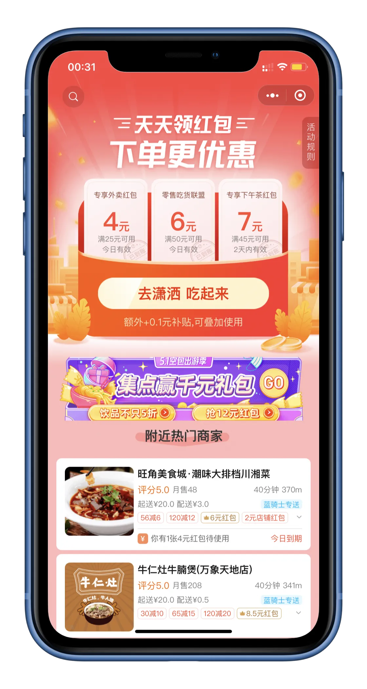
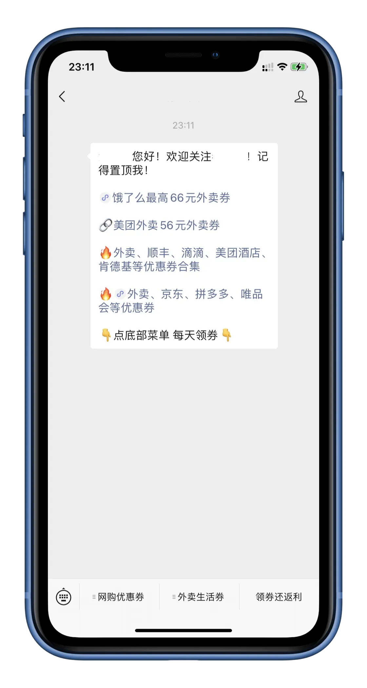
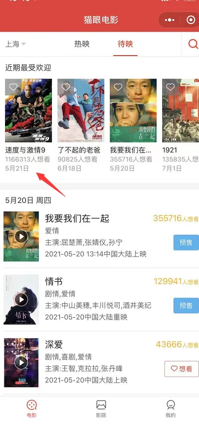
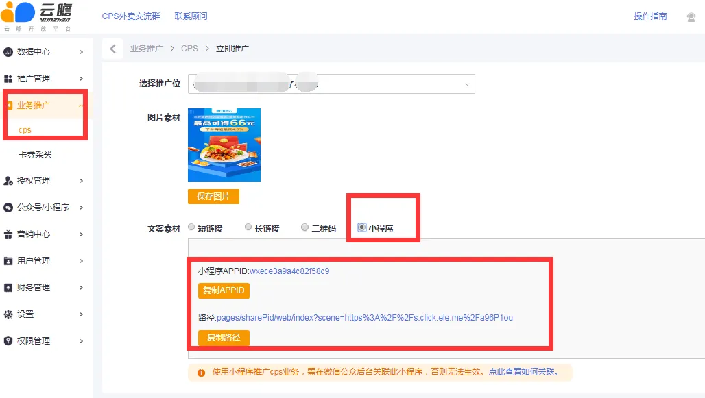
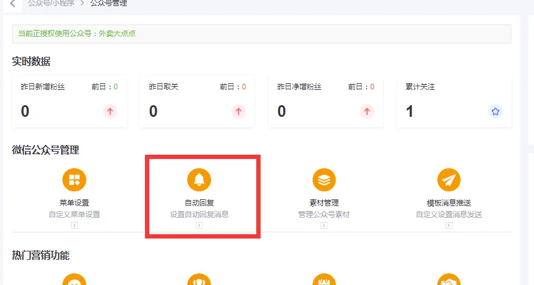
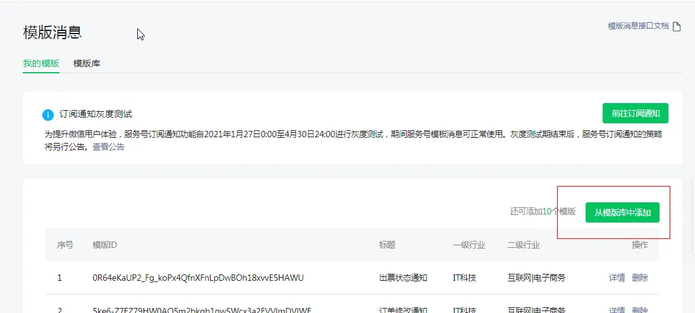
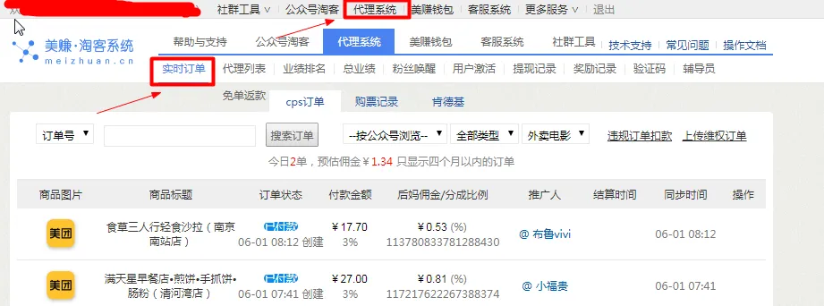
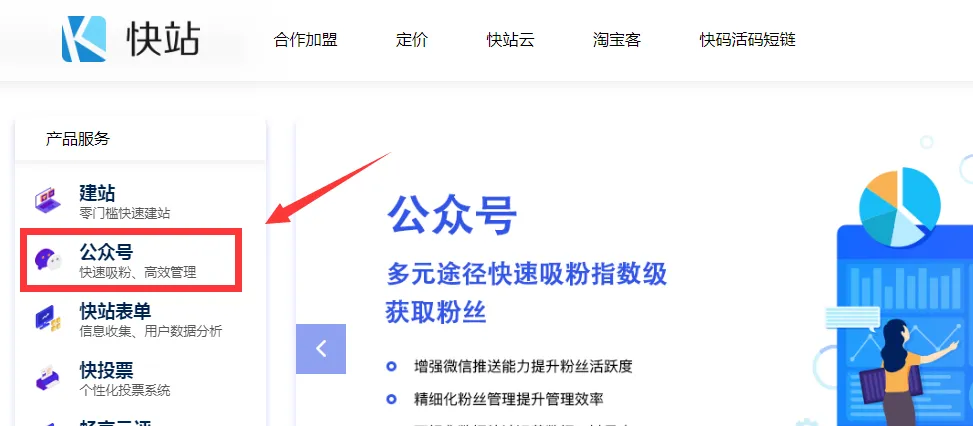

# 1. 什么是外卖CPS
---
> 人与人之间的差距，很多时候不取决于想法，而是强大的执行力。

要理解什么是 “外卖CPS”，可以先把 “外卖CPS” 可以拆分成 “外卖” + “CPS”。

什么是 “外卖”，这个就不用再做解释了吧。

## 1.1 什么是 “CPS”？
---
“CPS” 全称：Cost Per Sales，即按销售付费。

“CPS” 实际上就是一种广告，以实际销售产品数量来计算广告费用，是最直接的效果营销广告。。

说人话就是推荐顾客下单，给推手相应的回扣，其中最重要的就是要标记顾客与推手的关系。

### 1.1.1 使用暗号
---
最原始的办法就是用暗号，顾客在买东西的时候跟店家说一下暗号，那么店家就知道这个顾客是推手推荐的，等交易完成之后，店家需要根据交易金额，并按一定的比例给推手返佣。

使用暗号的方式存在一些弊端。
1. 如何让顾客主动说暗号，这个可以让店家给顾客一些优惠解决。
2. 顾客需要将暗号转述给店家，这个过程容易将暗号弄错。
3. 店家需要手动统计推手和顾客，同样容易出错。
4. 推手不能实时了解推荐效果，不能及时调整策略；也无法验证数据的真实性，只能相信店家提供的数据。

### 1.1.2 使用链接
---
“CPS” 这种方式能够帮助一些中小型店家，以较低的成本对产品进行推广。目前各大电商平台也有对应的平台来帮助店家、推手进行推广。

例如：淘宝 -> 淘宝联盟、京东 -> 京粉、拼多多 -> 多多进宝。

推手只需在平台中获取自己的推广链接给顾客发送优惠券，只要顾客点了链接领了优惠券，那么顾客和推手的关系就能确定了。剩下的就是顾客下单，完成交易即可。

通过链接的方式能够解决使用暗号的全部弊端，而且还能省去店家和推手之间的沟通，使得推广更高效。

下图为淘宝联盟的首页。

## 1.2 外卖CPS
---
“CPS” 已经发展了挺长时间了，但主要都是在电商领域，最近一两年才开始有 “外卖CPS”。

“外卖CPS” 就是 “电商CPS” 的套路搬到外卖上，将购物优惠券变成外卖优惠券。

外卖优惠券主要就是下面这类外卖红包，只要顾客领了推手的红包并完成外卖订单，那么推手就有订单金额 6% 左右的佣金。

这类红包的来源可以从淘宝联盟首页的 “吃喝玩乐” 里获取。

“吃喝玩乐” 这个版块就是做 “外卖CPS” 的。该版块就是用于生成外卖优惠券链接给推手进行推广。

推手可以在收益页面看到推广订单，方便及时做出调整。

# 2. 外卖 CPS 前景
---
上篇文章介绍了 “什么是外卖CPS”，相信大家对 CPS 也有了一定的了解。

那 CPS 的佣金是谁提供的？前景又如何？我想大家对这两个问题还是会存在一些疑问，所以这篇文章就来解答这几个问题。

## 2.1 CPS 的佣金是谁提供的？
---
想知道这个问题的答案，首先需要知道在一笔交易中存在多少个角色，以及每个角色在这笔交易中的利益关系。

传统的交易只有买、卖双方；如今的电子交易还会有平台方为买卖双方提供服务；CPS 交易还会有推手这个角色。

**CPS 交易，各角色的利益关系**
+ 买方：领取优惠券，购物更便宜；
+ 卖方：商品能获取更多曝光，促成更多交易；
+ 平台：获得更多活跃用户；
+ 推手：获得佣金。

可以看出一笔 CPS 交易，各方都有受益点。资金受益方主要是买方和推手，而平台和卖方的主要受益点还是在流量上。

所以不难看出，佣金的提供方要么是平台、要么是卖方、要么就是平台和卖方一起提供。

我们做外卖 CPS 所赚的佣金实际上是外卖平台的广告费，随着外卖 CPS 越来越火，相信平台也会拉着商家一起平摊佣金。

## 2.2 外卖 CPS 前景如何？
---
在看这份手册之前，应该有很多球友都了解了这个项目了。有些迟迟不为所动的球友可能会担心这个项目没有持续性，担心没做多久就没有这个活动了。

其实这个担心是多余的，从上文的利益关系中可以看到交易的各方都是受益方，只要调整好优惠券的金额及佣金比例，这个模式就会形成一个正循环，一直持续下去。

在这里也借用黄海大佬的一句话回应这个问题。

> 外卖淘客其实就是生活服务类 CPS 市场的刚刚开始，将来还会有越来越多的业务会切入到这样一个大的版块里面来。整个市场规模也从几个亿，增长到了几十个亿，甚至上百亿。

## 2.3 外卖 CPS 搭建逻辑
---
在开始之前，我先来帮大家梳理一下外卖 CPS 的搭建的逻辑和赚钱逻辑，让你对外卖 CPS 有一个比较全面的认识。

**第一步**：我们需要注册分佣渠道，生成自己的返佣链接（即是外卖红包），当你获得返佣链接之后，任何人通过你的链接领取外卖红包去下单，你都可以获得返佣。

**第二步**：搭建外卖红包的载体，常见的有社群、公众号、小程序，这样才能让更多人可以领取到你的外卖红包，让你的外卖红包获得过多的曝光。在搭建过程中，可以使用很多的辅助工具，来简化你的运营流程。

**第三步**：通过各种渠道引流，引流至你的红包载体（即是社群、公众号、小程序），从而让更多人点击你的外卖红包链接，赚更多的钱。

**需要注意的是**，美团联盟、美团分销都需要公司的资质才能注册下来，而且走账也比较麻烦，如果你是单兵作战的话，建议使用第三方的后台工具，例如：云瞻、满天星，其内部已经注册好分佣渠道的资质，我们只需要引用其中的链接就行了。

关于分佣渠道的获取，我们会着重在《外卖 CPS 常用工具》的云瞻/微信公众号管理 的小节进行详细讲解。

# 3. 外卖 CPS 分类
---
外卖 CPS 的分类取决于 CPS 红包的领取方式，目前微信小程序和链接是使用最多的领取方式。所以市面上绝大部分的做法都是基于微信，可以分为 **社群、公众号 和 小程序**。

## 3.1 社群
---
在外卖 CPS 开始之前，美团和饿了么在点单后会给用户一个手气红包，一般都要到第四个、第五个有最大的红包。

慢慢的就有人做外卖红包助力群、分享群这类微信群，目前豆瓣上还有很多这样的帖子。

我加了几个微信群，发现一般只有两种情况：
1. 一群做外卖 CPS 的人每天不停的在群里发小程序，这种消息太多，效果并不好；
2. 只有群主发外卖 CPS 的小程序，不允许其他人发 CPS 小程序或链接。

社群能够直接有效地与群成员进行互动，比如打卡活动、偶尔发一下红包，所以还是更推荐自己建群，自己管理。有能力的话还可以用一些工具每天定时在群里发小程序，提醒群成员领取外卖红包。

## 3.2 公众号
---
公众号做外卖 CPS 是现在比较多的做法。

公众号可以发小程序、网页链接，我们只需配置好关注自动回复、菜单、关键词回复即可。现在还有一些平台，能帮助我们快速配置好。

对于新人来说，用公众号搭建是比较快的方式。

## 3.3 小程序
---
用小程序领外卖券，用户体验是这几个方式最好的一种。但是小程序上线需要审核，而且不能放太多领券的入口，否则容易违规。

有能力开发的球友可以自行开发，这里建议多留一些可配置的选项，这样可以避免多次审核。没有开发能力的球友可以购买第三方平台的系统。

以上为市面上比较常见的方式，当然还可以用 H5，iOS 快捷指令等等。

总的来说，不管是社群、公众号还是小程序，最主要的渠道都在微信上。因为现在竞争比较大，同行之间会互相举报，所以还是建议球友尽可能把以上的方式都一起做，这样可以想办法与用户多次绑定，避免某一个渠道被封而流失用户，同时也注意避免一些违规的操作。

# 4. 公众号搭建
---
目前外卖 CPS 的主要阵地还是在**公众号**上，相比社群的方式，公众号的运营成本要低很多，不用一日三餐都发群消息。

主要还是引导用户去公众号中领取红包，实现返利。

而订阅号和服务号两者之中，**服务号更适合用来做外卖 CPS**，因为服务号接口更友好，有唤醒功能等。虽然服务号的发文条数少，但是这并不影响用户领取外卖红包，我们所需要做的就是让用户形成领红包的习惯。

然后，注册服务号需要企业资质或者是个体工商户，如果你本身有公司，或者亲朋好友有开公司，那么借用一下资质就行了。

如果没有，有 2 种办法。
+ 闲鱼/淘宝，直接买一个认证的服务号，价格在 4、500 左右。
+ 申请个体工商户，自己开通。

下面，我们重点说下个体工商户的注册。

## 4.1 个体工商户注册
---
这里我们着重讲个体工商户的办理，在营业执照下来后，大概还需要 5-10 天左右同步工商认证信息，才能认证成功。

### 4.1.1 营业执照办理
---
公众号认证，微信商户号，微信支付都需要用营业执照。营业执照主要有个体工商户以及公司。如果大家只是针对外卖cps这个项目需要认证公众号的话，只需要个体工商户就够用了。

> （该图只用来说明营业执照长什么样，无其他用意）

**营业执照有三种办理方式**：

方式一：去当地工商局办理，需要自己提供办公场地，具体还需要什么自己多跑几趟就明白了，现在办理相关政务事项也比以前方便了很多。

方式二：直接某宝办理，费用 100-300 元左右。而办理营业执照所需提供的信息也很简单，某宝店铺的客服也会直接跟你说清楚。

还有一点需要注意的是，个体工商户在每年的 6 月前要在网上有一次年审，这个不同省份可能会有所不同，最好问下店家，把后顾之忧先了解下。

选择不同的工商户办理地址，费用是不一样的，你可以就近为原则选择办证地点。需要注意的是，你在不使用这个个体工商户的时候，需要去注销，因此，在注册的时候，需要问清楚，注销是否方便，这一点很重要！

方式三：阿里云 云上公司/个体工商户注册，注册地址为：https://www.aliyun.com/acts/domain/company-reg ，费用只需要 9.9，但是注销个体工商户需要 2000，目前不太建议使用这种方式注册。

方式四：电子营业执照(以深圳为例)
1. 查询当地的市场监督局网站，找到在线申请入口，例深圳市场监督管理局 http://amr.sz.gov.cn/
2. 选择对应的个体工商户注册流程，按流程填写申请即可，可能每个地方稍有差异，不过大致相同：

填写好之后，提交等待审核，一般审核很快会通过：

点击查看，可以从支付宝或者政府服务程序获取电子营业执照，有了电子营业执照就可以认证公号完成公号搭建了。

> 说明：大部分新人是按照方式二入场的，如果你现在时间比较充裕喜欢折腾的话，可以尝试下方式一或者方式三

## 4.2 公众号注册及认证
---
新手入门时候，只需注册并认证公众号(服务号)，并开通商户号，以及微信支付功能。

其中微信支付功能主要用途是公众号发文章时候可以带外链直接跳转，如果只是想快速上手的话，注册好服务号，并认证企业或者个体工商户就行了。

### 4.2.1 公众号注册
---
1、打开网址：https://mp.weixin.qq.com/

2、选择服务号按照步骤注册即可（如图）

3、具体详细的注册教程可以看这里：https://kf.qq.com/faq/120911VrYVrA150918fMZ77R.html?scene_id=kf3386

**注意**：
1. 公众号注册名称尽量不要使用，优惠券，红包，返利等名字，需要商标授权，另外也容易被查封。
2. 一定要选服务号，服务号更容易触及用户，提高转化率。

### 4.2.2 公众号认证
---
1、登录公众平台注册公众号 https://mp.weixin.qq.com。

2、怎么认证：缴费 300 元，下载微信认证申请公函，打印出来手动签名拍照上传即可认证通过（不需要加盖公章或其他）。

3、提交认证申请后，会有电话来访，一般半天内就会有电话，注意接听，如果有问题会告诉你需要整改的地方。

### 4.2.3 微信商户号
---
微信商户号的作用是使我们服务号可以插入超链接，自定义小程序路径，是我们做服务号的外卖 CPS 必须拥有的，开通微信支付功能才可以在文章中直接插入外部超链接。

**需要准备好：身份证，营业执照**

1. 打开网址：https://pay.weixin.qq.com/
2. 这个申请过程因为已经拥有了服务号而显得特别简单，信息基本都是同步的
3. 如果想要具体的申请教程可以看这里：https://jingyan.baidu.com/article/15622f24d389b3fdfcbea5d1.html

**注意**：
1. 注册公众号的话，企业可以注册 50 个，个体户只能申请 2 个公号，而且其中一个要认证，是不能提升上限的，公司是理论上可以突破到最多 50 个，但现在可能到 10 几个时候就卡你了，拒绝让你申请更多。
2. 用个体户注册服务号（一定是服务号）；
3. 服务号可以认证，也可以不认证，不认证的话无法加入外链；
4. 公众号注册名称尽量不要使用，优惠券，红包，返利等名字，需要商标授权，另外也容易被查封。

## 4.3 公众号名字与头像
---
起名字真是一个头大的事情，目前外卖关键词的名字很多都被抢注了，而且有些关键字是违规的，那有什么好用的工具可以快速查公众号名字是否被注册、是否违规吗？

答案当然是有的，小程序：服务商平台

通过工具查询之后，我们可以更加方便地起名字，接着我们再来看看公众号头像。

我们可以直接复用别人的公众号头像，或者自己懂 PS 的话，简单修改一下。实在不行的话，可以在淘宝上叫人设计一个头像。

**参考头像**：

## 4.4 域名申请（可选）
---
域名前期不需要用到，所以是可选的，想要快速搭建可以跳过域名申请。这个一般用于活动域名防封等一系列操作和后期自定义可扩展等，如果使用小程序也会用到域名。

### 4.4.1 域名申请平台
---
+ 腾讯云域名注册：https://dnspod.cloud.tencent.com/
+ 阿里云域名注册：https://wanwang.aliyun.com/

我们以腾讯云为示例，操作如下：

点击购买之后，会跳转页面，新人需要填一些身份信息相关的资料，如实填写就行。

最后使用微信付款购买即可。在购买之后，我们需要完成备案才能使用。

### 4.4.2 什么是备案
---
根据国务院令第292号《互联网信息服务管理办法》和《非经营性互联网信息服务备案管理办法》规定，国家对经营性互联网信息服务实行许可制度，对非经营性互联网信息服务实行备案制度。未获取许可或者未履行备案手续的，不得从事互联网信息服务，否则属于违法行为。

因此，所有对中国大陆境内提供服务的网站都必须先进行 ICP 备案，备案成功并获取通信管理局下发的 ICP 备案号后才能开通访问。腾讯云 ICP 代备案管理系统为您提供申请备案、修改注销备案信息、认领备案等服务。

引用自腾讯云官网：https://cloud.tencent.com/document/product/243/18907

### 4.4.3 如何备案？
---
我们继续以腾讯云为例，使用微信扫描小程序二维码，它会一步步指引你备案域名，比以前方便多了。备案网址：https://cloud.tencent.com/product/ba

## 4.5 菜单搭建
---

### 4.5.1 菜单栏常见形式
---
菜单栏搭建直接模仿同行即可，微信搜“外卖”，多关注几个对比下，这边列出几种。

### 4.5.2 菜单栏搭建
---
可以直接在公众号后台编辑，也可以用第三方平台授权编辑，一般情况下，我比较推荐使用第三方的工具管理菜单。

新手入门的话，建议从云瞻平台（http://pub.yunzhanxinxi.com/login） 入手。主要有以下几个原因：

1. 免费
2. 常用的 CPS 直接从平台获取，省去自己注册多个返利平台
3. 基本公众号操作：比如关注自动回复，菜单搭建，客服消息群发，关键词回复等等都可以满足用户需求
4. 平台还会开发类似打卡之类的增强用户属性的功能，实用性强

目前关于外卖 CPS 的常用工具，可以看第八部分：外卖 CPS 常见工具，包括云瞻平台的使用方法，且包括使用云瞻平台快速搭建菜单的方法。

# 5. 渠道投放
---

## 5.1 抖音广告投放
---
抖音拥有大量的用户，通过投放广告能帮助我们快速获得用户。

官方投放渠道：[巨量引擎](https://www.oceanengine.com/) 。另外还有一些第三方代理商，因为代理商的经营模式各不相同，本文就不展开代理商的部分。

### 5.1.1 抖音广告投放步骤
---
在抖音投放广告需要 开户 -> 充值  -> 投放广告 这三个步骤。

**开户**

开户资质: 抖音广告需要对投放的产品、是否有营业执照等资质、落地页等材料进行开户审核。

官方开户需要收取 1000 元手续费，并且后期不会给予任何投放建议。代理商除了提供开户服务，也可能会提供更多增值服务。

具体开户操作可以查看 [注册开户指引](https://school.oceanengine.com/help?article_id=6444387516710649869) 。

开户常见问题可查看 [开户常见问题Q&A](https://school.oceanengine.com/help?article_id=6576883091833356296) 。

**充值**

广告产生的费用需要从账户中扣除，因此需要对账户进行预充值，官方渠道首充 10000 元起。

充值流程可参考 [账户充值流程](https://school.oceanengine.com/help?category_id=6444714714059505678) 。

**投放广告**

抖音广告有独立的广告后台，我们可以自主投放。

### 5.1.2 广告分类
---
**开屏广告**

开屏广告在抖音 APP 启动时展示。可以分为静态图、动态图和视频三种形式。

静态广告适合突出核心信息；动态广告有更好的用户体验，可以更立体对产品进行推广。

据了解，开屏广告的收费在 100 万起步。

**信息流广告**

信息流广告是在抖音 APP 推荐页面出现的广告，即用户日常刷得最多的页面。

信息流广告经常出现在用户切换视频的时候。一条成功的信息流广告，可以让大部分用户觉得察觉不到这是一条广告，可以让用户不知不觉地看完广告内容，并让用户记住关键信息、建立信任等。

### 5.1.3 计费模式
---
目前抖音广告投放有四种扣费模式。

1. 按曝光扣费(cpm)：15-20 元左右 1000 次精准曝光；
2. 按点击扣费(cpc)：1 元左右一次点击；
3. 按效果扣费(cpa)：按用户提交的表单数量扣费 一个表单几十到几百不等；
4. 智能曝光(ocpm)：按曝光计费，以转化为目的，从曝光中寻找已经转化的客户进行大数据分析，智能人像建模，投放目标会随着人像建模的完善越来越精准。

外卖 CPS 在抖音的投放，基本上都是信息流。

投放广告需要不断调整优化的过程。同样的费用，不同的人做投放，产生的结果各不相同。广告文案、引导点击、引导关注等，只有把细节优化好，才能降低单粉成本。

另外需要注意计算回本周期，因为外卖CPS存在很多不确定的因素，例如微信封号、佣金降低等。

若投放广告的过程中遇到问题，可以查看官方[帮助中心](https://school.oceanengine.com/help) 。

## 5.2 知乎知+投放
---

### 5.2.1 知+是什么？
---
知+ 就是知乎的付费投放工具。因为在知乎，你只要放外链就会违规，但是如果你设置的是知+，那么你就会被网开一面。

如图中所示，只要点击进去就可以直达微信公众号

点击公众号名片关注即可。

### 5.2.2 怎么注册？
---
网址是：https://xg.zhihu.com/

知乎官方不会直接和个人对接，注册后会有代理进行对接。

代理对接有两种情况：一种是知识帮开户充值的，另一种是即开户充值又帮策划素材的

收费情况不同，返点情况也不同，看自己需求而定。

### 5.2.3 超丝滑引导关注怎么做？
---
1. 进入知+后台，网址是：https://xg.zhihu.com/
2. 选择工具中心
3. 选择营销插件

4. 新建插件

5. 设置卡片，卡片描述

**注意**：
+ 类型一定是微信卡片
+ 关注类型一定是小程序扫码关注
+ 插件样式一定是卡片样式
+ 公众号文章链接中的文章，一定要插入公众号名片，方便点击关注

插件描述决定了用户端看见的引导字样，可以参考下图设置

6. 完成卡片设置后预览看看

7. 点击工具中心，点击知乎绑定账号

8. 新建授权

9. 输入自己的知乎主页链接

到这里知+后台就已经设置完成了。

10. 进入自己的知乎账号，点击消息中的授权

11. 这时候开始编辑文案，可以是写文章也可以是写回答

注意编辑器中的钱包标志

12. 选择我的插件，找到设置好的卡片，编辑好文案后点击发布即可

到这里，知乎的操作就设置完成了。

13. 此时再次回到知+后台，点击「知+」，点击新建订单

14. 设置好订单投放细节，提交审核

15. 审核通过后就可以在自己发布的文章或者回答中看见插入的卡片了

### 5.2.4 知+投放小建议
---
知+ 的投放操作就是这 15 个步骤,但是投放要想出效果，仅仅是知道操作是远远不够的，还需要不断打磨文案，优化标题等等，不然就是烧钱不见效果白打工。

还需要算好投产比，不可盲目烧钱。不断调整投放细节：比如时间，地域等优化转化效率。

## 5.3 B 站广告投放
---

### 5.3.1 广告类型
---
在 B站营销官网 https://e.bilibili.com/product.html 可以看到，广告按照营销效果分成了 3 类：
1. 品牌营销
2. 效果营销
3. 内容营销

简单介绍一下这几个类型的区别。

+ 品牌营销

主要用于品牌推广，让大众对了解、认识该品牌。

+ 效果营销

可以让用户完成指定的任务，比如表单收集、应用下载等等。

+ 内容营销

内容营销则是将广告植入视频内容中，比如节目中的赞助商、UP主商单等等。

对于外卖 CPS 来说，什么类型的广告比较合适呢？

最常见的就是信息流广告，信息流广告属于效果营销，接下来就重点讲一下这一类。

### 5.3.2 效果营销 - 信息流广告
---

如上图所示，信息流广告封面和普通视频一样。如果不仔细观察是比较难分辨的。

如何提高点击率？封面、标题是关键，只有这两个部分足够吸引人，才能使用户点击进入详情页。

接下来看下详情页的部分。

详情页（落地页）最重要的内容就是引导用户关注公众号，一般是视频 + 图文的形式。

视频内容一般都是领券点外卖、晒订单以及关注公众号的步骤。

图文内容则是关注公众号的步骤，配合复制公众号按钮，进一步引导用户关注。

综上，可以发现一个公式

> 粉丝数 = 曝光量 * 点击率 * 关注转化率

+ 如何提高曝光量？

这就涉及到 B 站信息流广告的展现机制，同一位置的多个广告依据 CPC (每次点击的成本) 和 CTR (点击率) 计算展现排名，展现排名 = CPC 出价 * 预估 CTR，展现排名越高，曝光量也就越多。

+ 如何提高点击率？

提高点击率则需要优化图一的封面就标题，点击率又会反过来作用在曝光量上，所以广告封面及标题非常重要。

+ 如何提高关注转化率？

这一步是我们做投放的目的所在，吸引B站用户成为公众号粉丝。只有操作的步骤足够少，用户完成操作的概率才会更大，转化率才能提高。

### 5.3.3 创建广告流程
---
首先需要在  B站音效官网 https://e.bilibili.com/ 进行注册，注册成功后登录 必选广告后台 https://cm.bilibili.com/ad/

#### 5.3.3.1 新建推广计划
---
点击【推广管理】->【新建计划】

日预算最低是 100 起，为了避免限流，建议在 500 以上。

#### 5.3.3.2 新建推广单元
---

填写单元名称，选择广告位置。

1、定向设置

区分人群投放，提高点击率、转化率。

例如我们投放外卖粉，人群年龄可以选择 18-30；地域可以选择国内一二线城市。

2、设置推广时段

3、设置预算和出价

#### 5.3.3.3 新建创意
---
上传素材，填写创意标题、描述

填写落地页链接和创意标签

投放基础教程可以参考 https://www.bilibili.com/video/BV1Gy4y187sM?p=2

## 5.4 公众号投放
---
公众号投放怎么投？

### 5.4.1 核心思路
---
1. who

who 的意思就是谁，即你的用户画像是谁？

大家想一下，谁会有外卖需求？是不是广大打工人白领最多？

(也还有其他画像，想清楚画像对投放非常重要)下面没有特殊说明，都以白领群体举例。

那么白领就是你的潜在用户群体，因此开始投放前你就一定要明确，你希望通过你的软文广告吸引过来的人的类型就应该是白领职场新人为主，而不是盲目的广撒网。

2. what

what 的意思就是找谁投？找什么类型的号投？

新手投放，最忌讳的就是一来就投大号。

虽然在预算充足的情况下，通过提高曝光度可以提高一定的转化率，可是现实情况是普通人根本没有足够资金投放！

因此普通人投放按以下三步走：

+ 投小不投大，优先选择符合用户群体的情况小几万粉丝的小号。
+ 优先选择公众号的群体是和自己的目标画像一致或者重合度高的。比如办公白领喜欢关注的职场技能提升类账号
+ 次选公众号的群体是和自己的目标画像有交叉的。比如什么老板日记，企业管理这类的账号

3. where

where 的意思就是投放账号的位置该投在哪？头条还是次条？

根据公众号用户的打开习惯，头条的打开率是最稳定的。但是不仅仅是头条这一个位置，我们更需要争取的号主的社群与朋友圈的转发。小号主一般都会建立自己的微信群，有许多公众号的粉丝沉淀在自己的私域。

而小号主一般对于广告的渴望比大号主大得多，往往都会同意助推。

4. when

when 的意思就是投放的时间点，早中晚亦或是按照号主的固定发文时间？

+ 第一优先原则：按照号主的发文时间来定推文时间

因为号主的粉丝已经对号主的发文时间养成了习惯，打开率互动率都会比较强

+ 第二优先原则：号主没有固定时间，那就按照早上 10 点，下午 4 点的时间来推文。

因为此时一般都是准备到饭点了，有利于及时转化。

### 5.4.2 如何选号
---
选号过程中不能只考虑“头条多少钱，次条多少钱，是不是有名气”，这些都容易陷于局限，还需要按照以下几个方面去筛选。

1. 计价

小号计价姑且按照 1 元一个去计算，1 千左右阅读的头条往往是 700元以下，计价当然是越低越好。
   
2. 粉丝画像
   
投放之前找号主要一份粉丝的画像截图，包括年龄，地域，男女比例等结合自身的需要看是否符合调性。
   
3. 粉丝粘性
   
主要判断指标为头条阅读率，点赞量，评论数（评论的字数，评论点赞量），更高阶一点的还可以看原创篇数，广告投放篇数等。
   
4. 历史投放数据
   
主要是看账号往期是否投放过外卖 CPS 的推文。因为外卖 CPS 不同其他推广产品，各家外卖 CPS 账号大同小异，所以如果历史推文有外卖 CPS 相关的，建议不要投了。
   
5. 避免掉坑
   
其实粉丝数多不一定阅读数就多，阅读数多，评论点赞数不一定多，评论点赞数多也不一定是真的，即使阅读等全部真实也难免碰到水号，转化效果差，最重要的是需要结合画像、点赞、评论，社群等活跃指标来综合判断账号的优劣。

关于如何避免刷量的可以开通一个西瓜数据会员账号利用数据平台判断是否存在刷量行为。阅读数据突然升高的往往是刷量号。

### 5.4.3 推文怎么写
---
1. 参考同行

同行就是最好的老师，参考同行文章模仿其文章结构和封面标题

直接搜索 “外卖漏洞”即可看见同行文章。

2. 适当结合热点

比如特斯拉的请喝奶茶事件就是一个非常好的切入点

### 5.4.4 如何最大化利用流量
---
物理学中的热，在传播过程中热效率都会损耗，如何提高热效率，降低损耗是无数人研究的对象。

那么大家要知道，无论是谁，无论是多么完美的推文，也无论是投放在哪个大号。用户的每一步操作都必然不会100%传递到下一个环节。

那么我们还能做什么呢？

传递环境中设置二级助推

举个例子：设置一个抽奖助手，抽奖条件可以设置为转发推文关注公众号

然后，在我们的外卖公众号中设置关注自动回复，回复该抽奖助手二维码和对应参与抽奖方法即可。

# 6. 常用引流方式
---
> 在正确的鱼塘提供正确口味的饲料加正确的鱼钩——这就是引流

首先第一个大家要明白流量有公域流量（公域流量又分垂直流量和泛流量和商务流量）和私域流量。其次大家要明白，定外卖的人群画像。

比如定外卖的人群：一是大学生，二是上班族。还有什么呢？

依据人群的属性又可以划分为：大一学生，大二学生，大三学生，大四学生

大一学生渴望快速了解学校会在哪？在新生群?

大四学生要做毕设，要找工作，他们又会在哪？

大家可以开动一下脑筋。

## 6.1 公域流量之泛流量引流
---

### 6.1.1 抖音快手截流
---
抖音现在有许多做投放的，普通人哪有钱烧？

抖音快手搜索外卖优惠券，外卖红包，外卖漏洞等关键词，在他们的评论区疯狂留言，内容就是：我刚在“**”公众号，领了30的红包。我在“**”公众号领取到了优惠券。真的一分钱就吃到了肯德基

### 6.1.2 B 站
---
1. 开设专栏写大学生省钱文章软文，加热门视频评论区留言等;

2. 开设自习室直播（白噪音动态风景图即可），吸引流量然后通过评论区标题名字等进行导流

此方法可以利用无人直播使用在其他平台;

### 6.1.3 知乎、头条、小红书软文
---
主要内容参考搜索“怎么省钱，如何省钱..”等问答或者笔记，进行拼凑杂糅，留下自己的钩子

难点：小红书等平台账号留微信号被封的问题

解决方法：利用大小号互相关注，置顶评论，小红书瞬间动态中留图片式微信号，多利用小表情代替微信公众号等字眼。

### 6.1.4 微博抢热评
---
明星或者其他小V 发了微博就去抢评论（需要事先准备好吸赞评论）。预先在自己微博发布好相关的微博，别人看见人评都会习惯性点头像进去浏览，有曝光就有流量。

微博点赞数可以自己花钱购买。

### 6.1.5 QQ群
---
白领金领依旧是打工人，打工人需要提升技能，需要圈子！

QQ群搜“ppt”“word”“ps”“产品运营”等关键字加入行业群，加进去先潜伏，当夜黑风高的时候，在把准备好的话术发到群里面。

被踢是必然的了，没关系，引流一个是一个。

### 6.1.6 小众聚集引流
---
手机 QQ 的动态里面有个小功能-自习室

这里面都是大学生，考研党的流量。

### 6.1.7 热点引流
---
参考前段时间的 65 页 PPT，女海王，利用抖音的热点引流+微信搜一搜的自然流量+微博话题，汇聚流量到公众号。

sop 流程设计参考：以微信搜一搜流量为例子

准备一个账号一次性推 7/ 8篇相关推文，推文不用原创，就是纯复制其他人的。

中间插入外卖优惠券公众号，提示回复关键字获取相关文档。

### 6.1.8 预热点引流法
---
打开任意电影 APP，查看即将上映电影，提前参考热点引流方法进行布局。

关键词：**电影抢先版，**电影枪版，**电影提前看，**电影在线看，**电影下载

此方法和热点引流一样，因为诱导分享有一定的封号风险，自行斟酌使用。

### 6.1.9 资源引流
---
利用大多数普通人爱好学习各类学习资源癖好，整理办公学习技能合集。领取路径最终和热点引流一样汇聚到公众号。

sop流程：
1. 所有资源都以加密压缩包的形式，免费分享
2. 获取密码均需要关注公众号回复特定关键词

### 6.1.10 泛娱乐引流
---
利用公众号的关键字自动回复，设置套路话术或者表情包。通过录屏发抖音等短视频平台。

### 6.1.11 58同城的部落
---
直接看图

在不同的城市的爆料模块里面发帖

同样的方法在微头条也同样适用

### 6.1.12 借鸡生蛋法
---
关注多个外卖公众号，加他们留的微信，卧底其微信群，私加其好友，打广告挖墙脚

关键点：提供差异性服务提高通过率。比如可以提供代找PPT模板代找资源等

## 6.2 公域流量之垂直流量引流
---

### 6.2.1 电商引流-淘宝
---
参考同行，上架外卖优惠红包，客服设置自动回复，自己安排家人同事拍几单美化评论区，增强信任感.

注意不要设置上图的 0.01 这种价格，设置1块钱领会员等（容易被删除链接，金额稍微大一点）。

自动发货可以直接设置为咨询后自动回复，也可以使用软件阿奇索发货。

难点：淘宝设置如何自动回复二维码链接？

1. 上传到1688图册，可以直接使用

1688需使用营业执照开通店铺，路径为卖家中心-店铺管理-管理相册

2. 使用草料二维码对公众号二维码进行修改，主要针对二维码的码点进行修改

步骤为：
+ 第一步：下载淘宝同行的二维码备用。
+ 第二步：下载自己的公众号二维码
+ 第三步：打开草料，先进行一次解码，再生成二维码，最后美化码点和式样。
+ 第四步：利用小程序“换码助手”把下载号的同行二维码更换成自己美化后的二维码
（注意修改相关公众号文字）
  
### 6.2.2 电商引流-闲鱼
---
参考同行，上架外卖优惠红包，客服设置自动回复，自己安排家人同事拍几单美化评论区，增强信任感。

闲鱼这里有几个小技巧：一是一定要多上商品，二是付款购买的商品要点重新上架（可以继承原来的曝光），三是多个商品一天内分开时间段搽亮

### 6.2.3 电商引流-拼多多
---
去别人上架的外卖红包券，一般是一分钱一个，每天买10个，评论区依次评论我在“****”领取到了优惠券。真的一分钱就吃到了肯德基！疯狂截流~

也可以利用拼多多免押金发虚拟物品的套路，自己开一个拼多多店进行售卖外卖优惠券和会员，设置好相关前提，比如是连续领红包下单五天送一个月外卖会员等或比如优惠券免费送等。

难点：拼多多免押金发虚拟物品的套路

首先 1000 元的保证金是要缴纳的，这个所有类目都需要缴纳

注册拼多多之类省略，拼多多免押金发虚拟物品的关键点是发布商品的类目。

一定要发布在“生活兴趣培训（线下）”这个类目之下。

路径为：教育培训-生活兴趣培训-生活兴趣培训（线下）

## 6.3 公域流量之商务流量引流 
---

### 6.3.1 招聘网站
---
准备两个账号，一个发帖找工作，一个发帖招聘，两个账号都尽量吸引到同一个微信。

发帖找工作为主要加人账号，添加各HR微信，通过朋友圈+群发进行推广引流。

招聘账号的主要是加兼职者微信或者在招聘平台内回复话术。

核心思路就是以招兼职为名，先让求职者关注公众号，回复关键字等，看提前设置好的兼职工资，要求等。

你我本社畜，相煎何太急，从人道主义角度这一条不建议用。

### 6.3.2 各商家店铺老板
---
在大众点评，义务购，高德地图上搜索商贸批发商家，主动添加商家的微信。通过朋友圈+群发进行推广引流。

## 6.4 私域流量裂变引流
---

### 6.4.1 拉微信群做社群
---
拉身边的人或者把公众号的粉丝导入私人微信，组建社群，定时发送外卖优惠券红包，其他时间禁言。

> 导入私人微信的粉丝价值可以成倍放大，这个要持续不断慢慢的的做。（很重要）

建议：微信群的构建以粉丝人群画像作为关键词拉群

比如上班白领属性的为一个群，这样方便后期有针对性的提供价值，提高粉丝黏性。

### 6.4.2 抽奖引流
---
利用公众号：抽奖助手，设置好奖品（1688购买或者虚拟物品）进行推广裂变

难点：种子流量的获取，礼品的选择是否有吸引力等

可以利用朋友圈，微信群等启动第一波种子流量。

礼品的选择一定要是那种看起来比较贵，实际没有那么贵的礼品。

比如人参，拼多多的价格不超过5块包邮。

## 6.5 线下引流
---

### 6.5.1 找商家合作
---
先提前定制一批带优惠券公众号的塑料袋，免费提供给他们用，让他们允许你在店铺内张贴优惠券海报。

### 6.5.2 骑手或者外卖站长合作
---
先提前定制一批带优惠券公众号的小红包卡片，搭建 sop 流程借助活码和骑手或者站长沟通好合作细节：有系统定位关注用户来源让他们放心和你合作，还可以日结等。

### 6.5.3 牛皮癣法
---
贴广告发广告

这个不用说吧？。。

注意点：
1. 贴广告优先去CBD肯德基剧本杀等综合性商务楼的厕所贴。
2. 发广告优先去商贸批发CBD等商铺办公区发

> 拓展：线下引流可以极大的提高地域属性的精准度，有利于未来的本地生活综合服务布局

# 7. 地推
---
目前外卖 CPS 线上流量竞争激烈，优质的流量成本基本都非常高，除非资金大的“资本”玩家，个人玩家很难承担流量投放成本。但是，线下相对来说竞争还没那么大，而且特定的场景下的流量质量还是非常不错的。

那么地推从哪里入手呢，给大家两个角度。

**从外卖行业的角色来分析**：外卖商家、外卖员、顾客；

**从人群流量的聚集来分析**：快递点、超市、小区门口等等。

关注以上这几个点，其实就能够抓住地推的方向和目标。

## 7.1 线下商家合作
---
指的就是餐饮商家，现在餐饮商家基本都开通了外卖服务，线下商家是外卖 CPS 地推的最重要的一个渠道。 

### 7.1.1 如何找到商家？
---
亲戚朋友：首先，联系亲戚或朋友有没有做餐饮店铺的，有的话直接去聊一聊，这种情况沟通好的话基本都可以达成合作。

好友推荐：还可以让亲戚朋友给你推荐，依托人际关系去牵线比你自己去寻找效率高很多，而且可以拉上朋友帮你沟通协调，成功率也会提高不少。

线下探店：线下去本地餐饮区域一家一家店铺里去谈合作，带着诚意去，和店长老板去喝茶聊一聊，是否能够达成合作就依靠开出的条件和沟通能力了。

### 7.1.2 如何谈合作？
---
目前餐饮商家基本上都有做好评返现这一块，有的是自己做，有的可能外包给别人做。可以去把这一块接过来，通过承接好评返现的服务，将流量引入自己的公众号或者微信里。

（其实好评返现这一块很多公司一直都在做这种业务，其实是一个“蓝海”，提供服务，赚到了佣金，同时获取了流量。）

每个商家在好评返现都会有一定的投入，有的商家还在外包别人做好评返现，就算是商家自己做，那也是需要投入返现这部分资金的。

所以，可以通过免费做好评返现服务，或者付费给商家承接外卖返现业务等等，具体的合作方式依赖个人的沟通能力或实际情况。

### 7.1.3 一些谈合作的小方法
---
1. 从商家视角出发，你能帮商家承担多少的成本【比如做好评、纸巾、包装袋等等】，通过这些来沟通协调达成合作关系；

2. 简单告诉他你在做的是什么？例如公众号吸粉（想做个本地餐饮生活号，需要粉丝），让商家搭销其他顾虑；

3. 你要做到的承诺——“画饼”。比如做好评，你可以帮助商家把好评做到多少等等，你画的饼越大，合作的机会越大，至于要投入多大的成本和花费，这就需要根据自己的实际情况去把握。

### 7.1.4 本地商家的优点和建议
---
上面说了，商家这一块是外卖 CPS 线下地推的重要一环，为什么这么说呢？

1. 精准流量：比其他一些线上平台流量更精准，都是点外卖群体；

2. 成本相对固定，加粉才能返现，可以引流公众号，再引流微信号，双重引流，算下来其实成本并不高，性价比很高；

3. 本地高质量粉丝：外卖群体基本就是本地的年轻消费群体，潜在价值巨大。例如后续公众号打造成当地生活资讯号，也可以接本地商务推广等；

4. 做区域本地号：其实做好本地一个市县、区甚至是街道社区级别的服务号，联系到本地的精准流量，吸引力会更高，价值也很更大。比如一些分享区域交通、防疫等生活资讯的公众号，关注度打开率都很高。

## 7.2 外卖骑手合作
---
外卖骑手是外卖行业重要的一个媒介，链接商家和客户，如果能够让外卖骑手帮你做推广，那么肯定是非常有效的。一般 10:00 - 13:00 和 17:00 - 20:00 都是外卖小哥比较忙的时间段，尽量错开这个时间段去找外卖小哥，不然你找他，他也因为急着送单，不怎么搭理你。

### 7.2.1 如何寻找到外卖骑手
---
这种地推最核心就是外卖骑手，所以找到靠谱的、有能力的骑手就是重中之重。

还是同样的，在亲戚朋友里有寻找没有做外卖骑手的，找他们聊一聊，了解每天的单量和覆盖区域情况，了解本地外卖服务市场基本情况。

这其实很关键，你必须对当地外卖市场有一定的了解，外卖骑手就是一个可靠的信息源。

为什么联系商家和骑手都优先建议去找亲戚和朋友？因为基于这层关系，会更愿意花时间去和你沟通，也基本会无保留的分享相关信息，这很重要。

那如果你身边没有外卖相关从业人员，并且想大量招外卖骑手做推广呢？

很简单。举个例子，点两杯奶茶，等外卖骑手上门。

问下骑手一天能赚多少？300？微信红包直接给他，今天不用干活了，一人一杯，边喝边聊。当然了，这样确实可以快速拉近你们的关系。如果你不想花钱，也有其他办法。一般外卖小哥在送完餐之后，都会聚在一个地方聊聊天，问一下各个兄弟的情况，你可以谎称自己也想想成为外卖小哥，问问怎么入行，有没有什么外卖小哥群之类的，顺便再了解一下外卖送餐的行业内幕。

基本上，外卖和快递相关小哥都有各自的群及圈子，假如你跟一个外卖小哥 A 达成了合作，公众号增粉一个他可以获得一块钱，这个时候，你想快速拓展外卖小哥的人数，可以叫 A 帮你去拓展，只要是 A 拓展的外卖小哥带来了增粉，A 就可以获得每个粉丝 0.5 的提成。当然，这些价格都是你定的，如此操作，就不愁外卖小哥了。

### 7.2.2 如何谈合作？
---
所有的合作，都立足于金钱，这是最有效的。在某种程度上，“钱真的是万能的”，在和外卖骑手等合作中，钱就意味着尊重和理解。

如一个外卖员每天 50 单，每单 5 元，根据他的投入与收入，如果可以做到他推广一个粉奖励 2 元，那么实际上很有吸引力了。

外卖骑手需要做的是：
1. 投放我们的外卖CPS宣传卡片
2. 并告知客户，通过公众号领红包点外卖有优惠

具体的要求，可以根据实际情况来优化，就是提高转化。

外卖骑手投放卡片及关注数据，需要我们每天去关注统计，分析优化，想办法提高各级转化。比如，如果可以做到关注即可送一听饮料，那么转化肯定会提高很多。

## 7.3 快递点、小超市合作
---
快递点、小超市是目前人流相当集中的一个地点，很多电信业务都和快递点合作，推广各种手机套餐业务。快递点也是上班族相对集中的地点，同样是地推“必争之地”。

### 7.3.1 如何寻找到快递点、小超市
---
周边经常去的快递点、小超市，很熟悉更容易沟通合作；并且向他们了解本地快递点、小超市分布情况；

各大地图 APP上去搜索当地快递点、小超市，然后实地去探店寻求合作。

### 7.3.2 如何谈合作
---
+ 租广告位

从快递点、小超市付费购买广告位，在店铺明显位置放置自己的广告海报，每月小百块应该就可以，商家肯定很乐意。

当然这种转化效果肯定不会很好，需要更进一步激发商家的能动性。

比如，推广一个粉丝佣金 1-2 元；如果商家每天人流几百个，那么其实收益也不少。或者每推广一个粉丝送 1 瓶水，而你承担这部分成本。

玩法都是很灵活的。比如，夏季地推，小冰糕就比其他的礼品更有吸引力 。只要能够激发商家和顾客的兴趣，就是好的推广的方法。

+ 赠送小礼品

在快递点、小超市场景下，针对孩子赠送小礼品，是一个非常有吸引力的方法，扫码关注或加好友，可以免费领取小礼品，并且也可同步给商家返佣金，这种活动对于商家也是同样有吸引力的。

小礼品从1688 等进货渠道批发，实际成本也不会太高，商家佣金适当就可以。

其实，有很多人用这种方式做公众号吸粉，然后通过转让带粉公众号的方式来变现。

## 7.4 社区微信群等
---
注意我们在做外卖 CPS，公众号只是一个工具，不要被它局限了，觉得必须要推广公众号才能做 CPS？其实并不是。

### 7.4.1 本地微信群
---
微信群、QQ 群、朋友圈等也是一种工具，比如你是 400 人的微信群群主，那么这些人也是你的“粉丝流量”，通过群工具实现推广外卖 CPS 也是一种方式，甚至可以每天在群里去分享 CPS 链接。

从这个角度来想，又有了无限的可能性：

比如：小区闲置物品互换是一个需求，那么你就可以创建小区闲置互换群。这种微信群需要你去花费精力维护群秩序，但是实际价值更高，因为作为群主你可以掌握“话语权”。

只能做本小区的群吗？并不是，你可以做本地区所有小区的群，注意提前和小区物业打好招呼，可以在小区公告处或者明显的地方放置你的广告。

当然，也完全可以摆脱本地群的限制，做某某兴趣群、某种爱好群等等，所有的名称是你的引流招牌，或者说是你微信群的运营主题，实际上作为群主你可以做很多事，可以发散想开去。

### 7.4.2 引流微信号
---
建议做地推每个外卖CPS公众号都搭配至少一个微信号承接粉丝，这个很有价值。

联系前面商家合作主题下提到的，“一次推广，双重引流”，引导关注公众号并且添加微信号。

建议做双面推广卡片，页面内容要简介明了。一面公众号，一面微信号，关注公众号也自动回复添加微信才可以领红包。如果添加客户量大就用活码，多个微信号承接流量。

为什么要引流到微信号？
1. 微信号更加灵活，可以打造个人IP，朋友圈推广增强与用户的关系；
2. 微信上有潜力去做更多变现方法，实现长期收益，并且收益更大化；
3. 如果地推阶段没有引流到微信，那么后续想要公众号转化那就比较难了。

> 其实，微信好友的价值要远远大于公众号关注的价值，这一点很重要！！！

也就是说，如果同样付出，你只是推广了公众号，那么扣除后续转化流失，再加上公众号运营方面影响，价值会逐步降低。

但是，如果你添加到了微信，那么在你朋友圈不过度营销的情况下，流量流失不会很大。

最简单的同步变现方法就是，微信朋友圈也推广外卖CPS，用户刷朋友圈看到直接会领取，很便捷，转化流程比公众号更便捷，而且收益并不比公众号渠道少。

只是说这种受到量级应该有限制，不能直接承接大量流量，但是地推方式完全适用于这种模式，同步引流微信。

实际上，只要你可以把客户引流到微信上，那么潜在的价值是大于你地推投入的花费的。

## 7.5 地推物料分享
---
地推物料整理自网络。 

链接:https://pan.baidu.com/s/1u2BQZEc7eoFpWjodIzmb1A  密码:vsge

## 7.6 其他及拓展
---
线下流量点在哪里？就在我们身边，周围人群聚集地，只要能够发现，并且能够提供一定的服务或者福利，那么就可以吸引到特定的人群。

一些平时人们需要花钱才能买到的东西，你可以免费去推广；热点的商品也可以作为赠品去推广等等，“诱之以利”能够勾动目标人群的兴趣就是好推广方法。

如果你愿意花心思，可以发现很多渠道，很多可拓展的方法，去做外卖 CPS，但是又不局限在外卖C PS，你可以发现如何寻找流量、吸引流量、运营流量并进行流量变现。

以上，共勉。

# 8. 外卖 CPS 常用工具
---

## 8.1 淘宝联盟
---
说明：饿了么被阿里收购后，饿了么的推广佣金是在淘宝联盟中来提现，因此第三方平台想要获取饿了么外卖的数据就需要淘宝联盟的授权。

第一步：登陆账号（可以直接用淘宝账号登陆）

官方网址：https://pub.alimama.com/

第二步：饿了么链接获取

+ 登陆淘宝联盟app->吃喝玩乐

淘宝联盟->吃喝玩乐，里面有两个活动，分别是两个不同的饿了么推广链接。

根据图片说明，可以获取了一个饿了么小程序的 APPID：wxece3a9a4c82f58c9，还有一个小程序路径，可以先记下来，我们后面需要用到。

## 8.2 云瞻
---
云瞻开放平台是目前外卖 CPS 中免费且功能相对比较全面的后台工具，对于新人来说，不建议一开始就花费大量财力去购买工具，可以先用免费的工具尝试一下，看是否可以可以跑通项目，赚到钱。

### 8.2.1 注册账号
---
1、官方网址：http://www.yunzhanxinxi.com/

2、填写手机号注册账号；

### 8.2.2 建立渠道 ID 与推广位
---
> 注：建立渠道和推广可以为你统计每个推广渠道下面的具体数据和收益，直观的让你看见每天的成交转化和粉丝转化；

1、点击推广管理-渠道管理-新建渠道；

（例：渠道类型，微信公众号；渠道名称，填写公众号名称；方便自己区分）

2、选择对应渠道名称建立推广位，同时也可直接点击-推广位管理-新建推广位；

（例：推广位名称，公众号名称＋美团联盟/分销    公众号名称+饿了么外卖/生鲜）

### 8.2.3 授权公众号/小程序
---
1、一键授权微信公众号/以及授权操作步骤；

2、授权微信公众号，扫码授权；

3、由公众号管理员迚行扫码授权，并在手机上选择需要授权的公众号。

4、扫码授权进入后，即可查看已授权的微信公众号；

### 8.2.4 饿了么淘宝联盟授权
---
> 注：授权淘宝联盟账户，是因为饿了么是淘宝联盟旗下的业务。
> 
> 当推广饿了么 CPS 业务时，先要进行淘宝联盟授权，主要是为了跟踪饿了么的订单数据以及你推广的佣金。

1、授权淘宝账号的方法：打开系统后台，找到授权管理，点击淘宝授权。

2、授权成功后，淘宝联盟的有效期为30天，记得及时更新授权。另外，需要编辑授权信息。

3、授权编辑

授权编辑里面要填写的 appkey，appsecret 这两个字段的获取，在淘宝联盟里面有详细说明。可以翻到常用工具

**获取appkey步骤**

+ 进入淘宝联盟，点击【推广管理】，进入如下页面

+ 推广管理->媒体备案管理->他方平台->社交平台

+ 填写需要备案信息

+ 点击【媒体备案管理】，找到对应的推广位，查看APPKEY详细数据

+ 查看推广位应用管理下的（App Key数据和App Secret数据）

+ 回到【推广位管理】页面，点击渠道管理，获取渠道链接

+ 进入取链页面，复制链接

**获取pid步骤**

+ 进入淘宝联盟，找到【推广管理】，选择【媒体备案管理】，找到对应的媒体，点击【推广位】，查看推广位的数据。

+ 选择对应的媒体，点击【推广位】，查看推广位的数据

+ 选择要推广的推广位，设置设置渠道专属推广位。首先回到【推广管理】，选择【渠道管理】，点击【渠道专属推广位】，点击【设置推广位】。

+ 设置推广位

**新增PID**

这个是点击右下角的“+”号。

这里的PID要填写的内容，在常用工具，淘宝联盟里面有详细说明怎么获取PID.

### 8.2.5 微信公众号管理
---
由于微信公众号已经授权给云瞻，所以可以在云瞻的后台来调用微信公众号的一些接口。

1、菜单栏设置

我们最后要模仿的公众号界面如下：

我们在云瞻的后台，展开公众号/小程序这个栏目，选择自己要操作的公众号，在操作栏点击进入公众号管理。

**饿了么链接获取**

饿了么总共有 3 个推广链接，其中一个是饿了么赏金红包，另两个通过云瞻获取的。

+ 第一个小程序链接获取

第一个小程序链接获取是在饿了么的公众号“饿了么外卖服务”，

这样通过前面的步骤，点击发红包，赚赏金的广告页面，然后点击面对面扫码，在弹出的页面选择复制链接，这里复制出来的链接就是小程序的页面地址，我这里复制出来的地址为：

ele-recommend-price/pages/guest/index?inviterId=xxxxx

说明：这个地址前面没有http，这个地址准确说是小程序的一个路径。

下面详细说明怎么将地址添加到云瞻后台。

选择插入小程序链接，

饿了么小程序的APPID是 wxece3a9a4c82f58c9，这个是唯一的。

显示文字内容: 菜单->文本内容，比如“饿了么赏金红包A”，这个可以自己命名；

小程序页面地址：这个地址每个人都不同，这个就是前面复制出来的小程序路径

ele-recommend-price/pages/guest/index?inviterId=xxxxx 这种格式的。

说明：由于前面第四步淘宝联盟已经授权云瞻平台，那么就可以在云瞻平台里面获取到淘宝联盟的两个推广链接。

+ 第二个小程序链接获取(直从云瞻后台取链接)

业务推广->CPS->饿了么大额满减券，选择立即推广

对应的云瞻后台公众号菜单需要添加的内容如下：

+ 第三个小程序链接获取(直从云瞻后台取链接)

业务推广->CPS->饿了么外卖(小程序)，选择立即推广

对应的云瞻后台公众号菜单需要添加的内容如下：

最后保存并发布，到目前为止，菜单栏的第一栏已经基本做完。

常见问题小提示：按照教程配置好后，点击菜单栏，没有任何变化？？？

解决方法：微信公众号后台，小程序管理，添加小程序：饿了么外卖服务

**美团链接获取**

最开始的时候，美团外卖有3个链接可以获得外卖优惠券，分别是美团联盟、美团分销、外卖美天赚，前段时间，美团联盟、美团分销、外卖美天赚，三个链接合并了。

其中美团联盟、美团分销都需要公司资质，我们采用云瞻平台的好处是，云瞻帮我们处理好税务发票相关的流程。

这里的美团联盟、美团分销都可以在云瞻平台后台直接取链接。

对应的云瞻后台公众号菜单需要添加的内容如下：

**更多好券**

万物皆可 CPS，为了扩大收益，常见的外卖 CPS 公众号还可以对接电影票、肯德基优惠，这个也可以在云瞻后台直接获取链接。操作步骤相似，这里就不再展开描述了。

到目前为止，公众号的菜单栏基本上配置完毕。

2、自动回复

自动回复主要有以下场景：首次关注的欢迎语、关键词自动回复、非关键词回复

我们这里以添加欢迎语为例：发现与前面配置菜单栏基本上是一样的。

云瞻平台还有其他的功能，比如渠道码、高级自动回复、客服消息群发等，这些功能自己有需要的时候再去探索，前期我们只需关注基本功能让项目正常运转起来即可。

温馨小提示：选用合适的(ejmo表情)，增强视觉效果。

## 8.3 美赚
---

### 8.3.1 注册账号
---
官网地址：www.meizhuan.cn

优点：可以分销，有自己的小程序，价格列表如下：

购买后会有专门的客服来对接，目前口碑较好。

### 8.3.2 工作人员远程搭建
---
准备工作：需要提前开通微信开放平台认证、微信公众号认证

微信开放平台认证：https://open.weixin.qq.com

基础搭建，有专门人员售后钉钉群帮忙远程操作。

### 8.3.3 基础功能配置
---
登陆地址：https://www.qingting123.com

1、关注后的自动回复设置：

2、模板消息设置：

先在微信公众号后台-模板消息-模板库中搜索：预定就餐提醒，复制模板 ID

现在回到美赚系统，公众号淘客-模板消息，编辑模板消息。

在最下方找到预定就餐提醒的框，把前面复制出来的模板 ID 填写在里面。

> 注意：模板消息属于双刃剑，可以用来触发用户，但是用户感受到被骚扰的话，可能就会被投诉，严重者甚至会被封号。

3、自定义菜单：

公众号淘客->自定义菜单

新建模板，选择自己需要的内容，点点鼠标就可以配置好，当然也可以自定义跳转小程序，

外卖小程序路径：
1. 首页：pages/main/home/index
2. 饿了么：pages/main/ele/index
3. 美团：pages/main/meituan/index
4. 电影票：pages/main/movie/index
5. 个人中心：pages/main/mine/index
6. 提现进入钱包：pages/mine/cash/index.html?tabIndex=1
7. 美团会员卡：packageD/meituan/vip/index
   
外卖小程序的 APPID：
   + 如果是绑定自己小程序的话，可以在自己微信小程序后台登陆查看，点击自己小程序头像,点击账号详情，拉到页面最下方即可看到。

4、分成设置

为了增加用户粘性，或者是差异化，未来的外卖cps模式，可能跟淘客的模式最终趋于一致，那就是领券，外加返利。

分成设置

5、查看订单

代理系统->实时订单

## 8.4 满天星
---
5 月 15 日起对外售价 1999 元，价格贵，配置简单，共用一套小程序，小程序界面好看，交互性强。搭建速度快。满天星系统隶属于返利网。

### 8.4.1 付费并提交手机号
---
官方网址：http://www.mtx.net.cn/#/index，拉到页面最下方，找到售前客服微信

注意：满天星对外直接付费的话是 1999，加微信后，回复暗号：「帅张推荐」，立减 500，价格 1499。

提交手机号后等待工作人员对接，有专门的售后钉钉群。

准备工作：需要提前开通微信开放平台认证、微信公众号认证

### 8.4.2 登陆网站
---
登陆网址：http://saas.mtx.net.cn/#/login

### 8.4.3 基础功能配置
---
基础功能比如公众号的菜单栏，欢迎语等后台有操作手册都有比较详细的说明，这里不再细说。

## 8.5 芝麻小客服
---
特点：免费，外卖 CPS 这类的公众号每天自动推送，是用了“客服消息群发”这个功能，目前免费版的芝麻小客服可以支持一个认证公众号，每天 300 条客服消息推送；这对于初期搭建公众号，跑通外卖 CPS 已经足够了。

官方网址：https://xiaokefu.com.cn/

### 8.5.1 扫码注册
---
页面右上角登陆/注册

### 8.5.2 一键接入
---

也可以点击链接进入：https://xiaokefu.com.cn/app/selectionEntrance

公众号授权给芝麻客服后，需要配置的主要是：客服消息群发。

### 8.5.3 客服消息群发配置
---
选择群发消息->客服消息群发

编辑群发内容就可以了，主要有网址跟小程序链接

## 8.6 搜狐快站
---
特点：免费，没有小程序，功能与芝麻小客服类似，但是当用户体量较大时候，芝麻小客服的用户群发就需要付费功能，而快站这边是免费的。此外，快站还有渠道码功能，同样也是免费的。

### 8.6.1 注册账号
---
https://www.kuaizhan.com/

### 8.6.2 基础功能配置
---

自定义菜单：

自动回复：

群发功能：

更多功能，自己再慢慢研究。

## 8.7 剪映
---
如果你要做视频广告的投放，那么你就肯定需要要用到视频剪辑工具，但是很多人都没有视频剪辑的经验，我们这边推荐一个可以快速上手的视频剪辑工具 -- 剪映，目前有电脑版和手机版，我们这边就介绍一下手机版。

### 8.7.1 导入视频
---
导入视频的时候，可以选择多个导入，因为有些画面不可能一次就拍摄完成，我们可以选取每个视频中最优的片段拼接起来。

### 8.7.2 剪辑视频
---
分割功能：剪辑 -> 分割

拼接视频就涉及到裁剪，分割功能可以将不合适的功能裁剪掉，把没用的部分删除。

背景音乐：音频 -> 音乐

背景音乐也是视频中很重要的一环，好的背景音乐可以给视频添加活力。

字幕：文字 -> 识别字幕

歌词：文字 -> 识别歌词

后期录音：音频 -> 录音

如果你的视频拍好了，但是对视频的音频不满意，也可以通过后期录音来补充音频效果。

### 8.7.3 导出视频
---
一般选择 1080p 30帧就可以了，也是比较适合短视频平台的。

# 9. 球友实战分享
---
+ [手把手教你如何搭建外卖CPS](https://t.zsxq.com/UFEmyfI)

+ [普通人0成本打造持续赚钱的外卖CPS公众号，收益可观实测有效](https://t.zsxq.com/AM7IEIM)

+ [外卖CPS 踩坑经验总结](https://t.zsxq.com/MZn2b6I)

+ [玩了 10 天外卖 CPS 的亲身踩坑经历](https://t.zsxq.com/ub2R7QR)

+ [复盘一个“可能”月入过万的小项目 - 外卖 cps](https://t.zsxq.com/Urzneyn)

以上就是本项目手册所有的内容了。

看到这里，相信你已经对「外卖 CPS」这个项目有一个全面的了解了，知道提前需要准备什么，知道怎么开始，下一步就是行动了。
