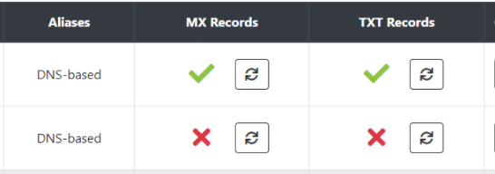

# 1.什么是TikTok
---

## 1.1 TikTok是什么？
---
TikTok 是目前全球用户增量第一的 App

TikTok也是国内抖音的海外版，产品底层算法以及产品功能几乎一样，

TikTok在未来一定会成为用户量最大的短视频APP，并能够出海复制国内抖音各种玩法

我本人从2020年6月学习tiktok，只做能正规能赚钱的赛道，在短视频免费流量带货这块赚的比较多，其次是去年红利小半年的Fund基金，来自TikTok的收入完全能超过我之前上班的工资。

在文章开头我首先想跟大家说的是，没有一个项目是好做的，如果熬不住头两个月的0收入或者负收入，那么我不建议你靠tiktok做副业，因为里面涉及的知识点太多，但仅仅是杂，并不难。

另外我们都知道字节系的产品迭代速度非常的快，而项目的红利机会就藏在迭代的某几个版本，如果没有长期驻扎的打算，很难赚到大钱，所以坚持一定是做TikTok，甚至所有短视频平台的基础素质。

## 1.2 笔者介绍
---
R，做过广告，做过金融，懂运营、产品、流量以及一点点技术的互联网人

去年6月入坑短视频TK，做过生财训练营助教，讲师，分享过很多tk小知识，也认识了很多朋友

个人运气、行业红利的加成下，跨行学习TK一个月后跑通了独立站爆单带货模式

在tiktok带货路上深度研究一年多，对tiktok产品理解、风控、流量上拿捏的比较准（大概是tiktok里最懂抖音，抖音里最懂tiktok的）

擅长tiktok爆品挖掘，短视频单品打爆，9月份普品单周gmv如上，单人纯免费流量单月GMV3万+刀以上

# 2.为什么做TikTok
---

## 2.1 留给互联网人最后的机会
---
互联网人想必都知道，在增量市场上暗藏大量的机会，但同时在一个新的增量市场上跑通0-1并不是一件易事。

TikTok跟抖音在产品算法和功能上几乎一样，但是用户确实来自全球不同国家。

所以不管是字节也好还是入局其中的玩家也好，大部分的精力和成本都花费在了培养用户习惯上，字节教会了用户如何拍视频如何创作，入局的玩家教会了用户如何购物。

当然跑通之后的回报绝对不低，毕竟人均消费摆在那，当国内还在9.9内卷的时候早有人把同款产品出海翻10倍卖给老外。

## 2.2 国人是否有机会入局海外抖音并赚到钱呢？
---
从数据上来说，60%的人是一定赚不到钱而且很快会被劝退的，另外30%的人能够偶尔赚一点，但不稳定，剩下7%的人至少能够养活自己或者小团队，只有3%的人能够赚大钱。

因此这里我也给大家避坑，我不宣传焦虑，站在中立的角度来说，如果你对国外文化，对短视频感兴趣，那么你很适合做，而且很大概率能做的很好。

如果你只是抱着赚钱心态来做，连海外文化，短视频底层都不去了解的话，我会劝退你。

目前这个时间节点，并没有到人人都能捡钱的阶段，没有all in tiktok打算的，每天可以花2-3小时尝试在tiktok上变现，选准一个赛道，不断迭代优化，比如做带货、私域聊单，都是比较轻松的项目，只要有播放就能引流。

Ok，在Tiktok上，各式各样的变现玩法很多，每种变现玩法随着版本一直在优化迭代，下面会从TikTok基础使用到避坑到变现一一道来。

# 3.TikTok入门基础操作指南
---

## 3.1 认知篇
---

### 3.1.1 TikTok锁区以及0播风控
---
TikTok作为海外抖音自然会对国内玩家进行封锁（**最近解锁了国内浏览限制，账号运营限制依旧存在**），因此如何越过系统风控就是第一道门槛，目前外加上市场上绝大部分主流IP进入了TikTok系统黑名单，限流0播放成为了新手第一道难关，99%的0播都是源于节点问题。

TikTok的风控原理主要是限制非本土、有恶意营销的用户，比如批量注册账号，通过软件协议爆私信加粉，批量搬运、上传垃圾内容等

⽤户在下载的时候，系统主要是根据⼿机的运营商（⼿机卡）、⽹络 IP来判定是否属于⼤陆⽤户，如果判定是的话，打开 App 时看不到内容， 或者有内容，但是发出的作品都是 0 播放。

并且TikTok自身的ip黑名单库也在一直更新，一般会直接拉黑整个D端的ip端，导致同一ISP的ip节点上传视频0播放。所以如果你发现所有流程都没问题，最后发视频没播放，不用怀疑，就是节点ip的问题。

此外海外真机也不是100%能破0的，因为TikTok狠起来连老外也封杀。

所以，下载和使⽤的过程中，需要拔卡/对应国家原生⼿机卡+挂节点来破0。

附上最新0播风控原理

节点IP方面，TIKTOK把节点分为三个层次：

1. 白名单节点，只要视频过查重，就能破0，播放正常

2. 灰名单节点，前面视频播放正常后面0播；只有通过本机摄像头拍摄上传的视频能破0（自拍，合拍，特效），upload入口上传的视频0播

3. 黑名单，无法破0，有的甚至无法注册

去年可能随便挑一个ip都能破0，但是今年不是了，批量注册账号扰乱了市场，于是大批的ip段被标记黑灰名单，导致比较大众的机房节点非常容易0播，比如谷歌云，亚马逊云，阿里云，搬瓦工，vultr，dmit等等

我也没法在此推荐某一个机房服务商，因为用的人多了自然都黑了，大家可以深度挖掘下国外本土的机房卖家，去实际的测一测，我个人评估下来还是有很多机房ip是干净的，只是没那么好找罢了。

此外锁区也意味着tiktok是按照本土化的内容运营模式来做的产品，因此我们在国内就可以通过定位选区去选择目标国家用户定向精准营销。

比如我想做意大利用户，那么只要通过切换意大利的IP，就可以注册意大利的账号，如此以来我们发视频就能优先推荐意大利的用户，就能获取本土的流量。

**如果有投放能力，又不想做账号的，可以直接选择投放ads的赛道直接跳过0播问题。**

### 3.1.2 语言问题
---
TikTok产品是全球级别的，语言能不能看懂，能不能听懂并不重要。

只要能看得懂视频内容就够了，平时使用翻译软件就能解决大部分问题，会外语只是锦上添花，但是只有在做直播带货的时候，本土化的口语会变得非常重要。

相比图文形式的媒体，短视频内容平台更容易出海。

### 3.1.3 独立站
---
如果想做TikTok带货，那么你一定要了解独立站，独立站是国外最常用的流量承接平台，独立站就是一个H5版的淘宝。

推荐使用与TikTok合作的shopify进行建站，网上有大量的教程，从建站，到优化模板、加载速度，到插件，都有完整的教程，详细图文教程可以看下这个网站 https://www.waimaob2c.com/

B站上的视频教程 https://www.bilibili.com/video/BV1Db411x7CJ?from=search&seid=10317717051629817460&spm_id_from=333.337.0.0

从2020年7月起，短视频+独立站带货的玩法成为TikTok上带货的主流，一天卖个几千刀甚至上万刀也不是稀罕事，每单利润基本都能控制在60%以上。

今年TikTok在英国和印尼开通了小店，打通了直播的电商闭环，在电商化方向上迈出一大步。

但是，相比抖音直播，TikTok的直播带货环境仍处于早期，与短视频带货相比逊色很多，用户直播购物习惯仍需市场教育，大部分人都处于观望状态，实际入场的玩家也是坚持了数个月后才跑通盈利。

### 3.1.4 Tikads付费流量投放
---
付费投放是目前国内短视频平台中最成熟的玩法。

但是如果你想做海外投放，一定要了解国内外文化的差异、物流方式差异以及对素材审美的差异。

依靠搬运国内广告素材去投放，99%必死无疑。

除了前端，后端强大的供应链也非常的重要，适合国外用户并且物流能够发出去的那才叫做爆品。

最后，做投放，现金流决定了玩法的上限。

### 3.1.5 跨境物流
---
国内有成熟的跨境物流公司，如云途，燕文等，直接对接物流经理就能解决，也可以走速卖通一件代发，最好速卖通的卖家是认识的，否则有些店铺是没人管的，下单几个月都不发货。

物流这块不用担心太多，国内有成熟的跨境物流公司支持自发货，在联系上物流公司后，建议多向他们提问学习，因为跨境物流有太多太多的坑。如果有海外仓的资源那更是能剩下一大笔物流费用。

后期字节也会打通电商闭环，届时走官方的中转仓就行，价格低又快。

### 3.1.6 选品
---
做跨境电商，一定要注意选品是否符合国外当地的法律、物流政策，部分仿品、侵权品都存在风险，同时物流也可能没法发出去，需要找一些特殊的物流渠道，所以一定一定要先找好物流公司确定能否发货以及物流费用。

如果是做二类的卖家，目前tiktok是一个比较友好的平台，绝大部分二类品都可以在平台上获取免费流量，不存在限流下架一说；部分二类品可以通过一定方式跑付费投放tikads。

去年就已有二类玩家入场，跑出非常高的roi

### 3.1.7 独立站支付通道
---
我们最常用的就是通过shopify建站，站内可以设置线上支付或者现金支付。

大家都知道国外线上支付的习惯和普及率远不及中国，欧美主流是通过paypal和信用卡支付，中东、东南亚常用现金支付COD，所以在设计支付环境需要注意匹配本土购物习惯。

如果售卖的是正常标品，那么可以同时加上paypal和信用卡两种方式，欧美信用卡使用比例更高，能有效提高转化率

但是支付这块会有很多的坑，要自建独立站的话需要准备香港公司以及配套资料，一套下来也要3000块成本了，这钱不能省，因为决定了你之后独立站里的钱能否顺利提出。

### 3.1.8 算法
---
Tiktok的算法和抖音早期短视频版本的算法更相似，所以要做好免费流量一定要理解算法的底层逻辑。

想要视频爆播放，系统最看重的是高权重的完播率、平均观看时长，其次是互动行为，诸如点赞评论分享关注等。

一般10秒的视频完播进入50%以上，系统就会给你推入高流量池，最高千万、上亿播放量。

TikTok目前还没进入付费流量的版本，平台仍然渴望高质量的内容来满足平台用户，高质量内容依旧稀缺。

所以做带货的可以通过优质爆款素材给我们带来百万千万的播放量，而老外在TikTok购物的习惯也逐渐被平台教育出来了，大家都知道该去哪里找购买链接。

下面简单介绍下目前主流的引流路径：

**短视频 - 进入主页 - 点击主页留的链接 - 独立站落地页 - 填写支付信息 - 支付**

如果是客单价不高的商品，简单粗暴的产品直接通过独立站承接就可以了

**短视频 - 进入主页 - whatsapp链接 - 加好友 - 私域聊单**

如果是高客单价，功能复杂、款式种类多的品，通过私域加好友聊单转化会更高，也能有更好的复购表现

接着说免费流量带货选品这块，欧美用户的消费能力非常强，欧美用户对价格并不敏感，只要定价符合他们的心理预期就愿意支付买单，这给我们提供了很好的产品溢价环境。

目前Tiktok上容易出单的类目有：美妆个护、新奇特类产品、日用家居、饰品、玩具，服装等

这些产品有一些共通的特点，功能简单易懂、有需求、体积小、拿货成本低、定价容易接受，而且大部分产品在国内都有成熟的供应链不用担心不好拿货。

### 3.1.9 域名批量邮箱无限注册tiktok账号
---
如果大家有一年以上的域名，推荐大家用 https://forwardemail.net/en/register 这个平台生成无限邮箱来0成本注册tiktok账号。

另外这里补充下为什么要一年以上的老域名，由于TikTok风控的更新，如果你的域名注册时间较短，后续封号可能会连域名下所有账户一起封禁，所以如果账号比较重要，那么及时换绑gmail邮箱！

**下面开始教程，如何解析域名实现批量生成无限邮箱**

首先清楚域名下解析的dns，然后删除所有mx相关的解析，接着如下图填写。

mx1.forwardemail.net

mx2.forwardemail.net

user@foxmail.com"">forward-email=user@foxmail.com （填写你的转发邮箱，实测163不行，qq可以）

namecheap 视频教程：https://www.youtube.com/watch?v=no62GCzMn7E

然后在首页选择add new domain

输入上面你设置好的域名下一步

分别验证mx txt，如果提示有问题就等1-24小时，不行的话再找下域名平台的客服

如果双绿勾，那么验证完就是ok了

你不需要创建子账号，所有给你域名发送的邮件都会转发到你上面设置的邮箱里，最好是实用非国内的邮箱作为接收邮箱，因为偶尔会被屏蔽。

### 3.1.10 查重
---
tiktok目前没有与国内抖音打通数据库

因此国内抖音上的视频是可以搬运到tiktok上的，但是tiktok上的搬运工非常的多，导致大家可能会搬到同一个视频素材，最终导致后发的人视频被查重0播放

一般我们通过视频数据分析查看Foryou播放的占比来确定视频是否被查重，当然新号发的视频没播放那肯定是查重了。

简单的去重手法有：放大缩小，旋转，镜像，画中画加图层、视频，多片段混剪等，以上是我认为强有效的方法，其余的手法去重能力比较弱。

当然我还是建议有原创能力的走原创路线，因为这样才长久。

### 3.1.11 黑科技之绿幕去重
---
如何免查重原封不动搬运视频的套路，适合任何视频破0播放。

这个套路是在抖音里流传的，主要用于起新号，流程就是找热门视频-去水印-加特效-传视频-发布。 无需二次剪辑，原视频直接发就行，而且还有播放量。

原理是利用抖音以及tk里的一个特效小功能，这个特效原本是为了让用户真人出境吐槽原视频用的，但是为了防止被系统查重，因此使用这个特效的视频不会算到查重库里，任何别人发过的视频你都可以通过这个特效来搬运。

就是这个特效的使用方式，点击拍摄视频进入图一，右下角通过特效进入。

找到图二的这个特效下载打开。图三选择你要搬运的视频，进入图四直接点击拍摄录制完毕之后就可以加字幕音乐发布了。

通过特效发布的视频左下角会有一个greenscreen的标识，用来区分原视频，不过用户是不会在意这个东西的，所以如果你碰到了很好的视频源又吃不准有没有人搬过，可以尝试这个办法去搬运，100%破查重。

你可能会问这个特效拍出来的视频能不能爆，你可以通过greenscreen这个标签去看下视频的播放量，是可以爆的，就算真人不出境，视频一样也有高播放。

### 3.1.12 适合新手的账号类目选择
---
1. 搞笑号，涨粉很容易，非常大众的类目，基本没变现能力，但是能开基金的话，赚基金还是非常香，有精力的可以开ytb，ins导流私域

2. 宠物号，涨粉转化高，但是竞争激烈，视频很容易搬重，尽量去搬最新的或者冷门的视频，有能力就混剪。赚基金较强、接广告、卖号变现，带货能力差

3. 美女街拍，涨粉转化高，老色皮全球都是，但是最近需要注意尺度，tt对美女视频审核较严格，容易删视频，严重的可能封账号，带货能力弱，赚基金表现较强

4. 健身号，涨粉容易，主要就是做健身、瑜伽教学，也可以发一些健身器材的好物视频，后期可以倒流ytb、带货，赚基金和带货（实物、虚拟教程）表现都一般

5. 型男号，主要发亚洲型男，肌肉男，吸引女性lsp，竞争少，但是男性搬这类视频可能要被掰弯，适合涨粉赚基金，带货能力弱，可以尝试引流私域转化

6. 滑板、轮滑号，适合涨粉赚基金能力强，带货差，容易接音乐广告

7. 特效号，手机特效，c4d特效，涨粉快，视频源更新快，适合涨粉赚基金

8. 魔术、变脸、杂技表演类型的号，涨粉快，容易吸引人眼球，适合涨粉赚基金

9. 好物号，包括车品、美妆、家居、穿搭、鞋、表等等，涨粉慢，变现能力强，不怕没视频搬，未来想做带货必须尝试的类目，越垂直，变现能力越强。

10. 画画号，手绘、板绘、油彩画、油漆画等等，涨粉快，适合基金，可以开直播卖画画工具

11. 动画号、二次元号，国内小动画，动漫剪辑等，海外二次元群体也是很庞大的，涨粉快适合基金

12. 风景旅拍号，涨粉快适合基金

13. 美食号，烧饭教程，户外美食，调酒，猫狗做饭等，涨粉快，注意不要有宰杀食材的画面，会被删，涨粉快适合基金，有能力可以原创

14. 赶海号，潜水、挖沙子捕鱼等，有神秘感，涨粉快适合基金

15. 黄金珠宝翡翠号，涨粉慢，变现能力强，不推荐新人做

16. 亲子号，多胞胎的号更有特色，晒家里萌娃的日常，老外喜欢小孩，视频涨粉和粘度会很高，涨粉快适合基金，后期可以做母婴产品变现

17. 功夫武术类，适合基金

18. 音乐号，古筝、二胡或者现代dj等等，比较小众，追热点能力强的起号会很快。

19. 户外号，蹦极、走悬崖桥，玻璃栈道、跳伞、滑雪、过山车等刺激运动，涨粉快，适合基金。

20. 减压号，多米诺骨牌，平衡术，数控切割，乒乓球等，涨粉快，素材多，涨粉快适合基金

21. 手工号，手办、木雕、冰雕、折纸等，涨粉快，适合基金

22. 剧情号，基本都是百万粉以上大v的，有一定剪辑能力后可以尝试，需要自己加英文字幕

23. 二次元真人号，汉服美少女，cosplay美少女，起号较难，适合基金，卖衣服

24. 游戏号，比较小众，竞争小，适合基金，游戏cpa

25. 明星号，冒充某明星的，依靠明星IP涨粉，适合基金

26. 体育号，适合基金，可以引流卖体育周边

27. 猎奇类，剪甲沟炎，挤痘痘，外星人等，很容易爆播放，但是视频容易被系统删，适合基金、带货

28. 养生号，推拿，按摩，正骨，采耳，催眠，偏减压，适合基金.

### 3.1.13 网感是短视频的核心技能
---
对大部分人而言，网感不是天生具备的，而是通过刷大量的短视频，以导演的视角去评估视频创意、拍摄意图，最终在心理能形成一个打分机制，如此一来，一眼就能看出优质视频和劣质视频的区别。

如何快速培养网感？每天关注30-50个人，刷100-200个视频，进行多轮视频筛选，第一轮点赞筛选50个优质视频，第二轮开始继续筛选留下20个优质视频，第三轮再次筛选留下5-10个优质视频，每天重复这样训练，很快就能培养出基础的网感。

### 3.1.14 音乐版权
---
tiktok是重视音乐版权的平台，所以在发布视频的时候如果视频自带的音乐被识别出没有版权会直接静音隐藏不再推送，所以在发布视频后要留意下系统的通知，如果侵权则直接使用自带的热门音乐发布。

### 3.1.15 TikTok App功能入口导图
---

### 3.1.16 TikTok是否需要养号
---
对于新手而言，很多培训的老师会叫你去养号，其实目的是为了让你多刷视频，熟悉平台功能和内容，也好为之后选择方向赛道。

实际上并不存在养号一说，我从来不养号，流量照样能爆，养号养的是用户的标签而非账号标签，而我们发视频做的是账号标签，做不了用户标签，因此养号就是一个伪需求。

### 3.1.17 TikTok一个手机能否登多个账号
---
在国内用科学上网的运营者建议一机一号，一机多号经过多次验证会有概率出现0播的情况。

如果肉身在外那就不用管一机一号的限制了，一机多号也能过得很好

### 3.1.18 发布视频的标题需要加多少标签
---
标题的话题标签对播放的影响不是很大，一般可以用一个热门大标签+一个垂直小标签即可

### 3.1.19 发布视频的时间和频率
---
发布视频的时间建议在目标国家的早中晚时段发布，因为这些时间段的用户最活跃，我们更能获得优质的流量，比如做美国的账号，我们就是在中国时间晚上和早上去发布视频。

发布视频的频率建议新号一次在3-5个，新号一次发太多会导致流量骤降，因此每一轮可以发3-5个，间隔2-3小时发下一轮。

### 3.1.20 老视频重发会查重？
---
已经发过的老视频重发是不会查重的，因为视频本身就是自己账号的，所以抖音也有“再发一遍就会火”的传说

### 3.1.21 TikTok社区规则
---
自行查阅哪些内容会涉及违规封号

https://www.tiktok.com/community-guidelines?lang=en

### 3.1.22 TikTok小店相关官方资料集合
---
官方资料：

https://bytedance.feishu.cn/docs/doccnbrENUNyXQgmym8yOKT2dfb

## 3.2 基础实操篇
---

### 3.2.1 如何安装使用tiktok
---
**一、 TikTok下载安装步骤**

拔卡（插国外卡）、刷机模拟手机环境 → 下载梯⼦（shadowrocket、V2 ray），购买节点，设置节点全局 → 检测模拟度（whoer.net）→ 安装TikTok → 注册登录 → 去水印搬运视频/拍摄原创视频 → 上传发布

**二、⼿机建议只推荐两个牌子：**

苹果7以上（个人推荐）、安卓pixel2 以上 ，其他都不推荐

**三、注册新号之前都建议刷机从头开始搭建环境配置，熟练之后5分钟就能搞定**

**四、iPhone 激活后的基本设置**

英⽂版：

1. 点击「Settings」-「Privacy」，滑动⻚⾯到底部，点击「Advertising」，勾选「Limt Ad Tracking」开关，变成绿⾊。

2. 点击「Settings」-「Privacy」，点击「Location Service」，关闭「Location Service」 开关，变成灰⾊。

3. 点击「Settings」-「General」-「Date & Time」界⾯：

    + 关闭「Set Automatically」；

    + 点击 「Time Zone」，⼿动输⼊⼀个美国地区，⽐如说「Los Angeles」，意思是把这部⼿ 机的时区设置为美国洛杉矶本地的时间；

4. 点击「Settings」-「General」-「Language & Region」界⾯，iPhone Language 设置 为「English」，Region 设置为「United States」。

**五、打开 App Store ，登录美区 Apple ID**

没有美区Apple ID 的可以去注册一个，视频教程https://www.bilibili.com/video/BV1u64y1d7as 只有外区的苹果账号才能下载到tiktok

**六、谷歌手机pixel刷机操作**

1. 拔卡 - 还原刷机 - 选择不连接wifi - 选择对应国家语言 - 关闭定位 - 完成激活

2. 推荐电脑下载好需要用的apk包（tiktok、科学上网工具等）通过usb线拖入手机后安装

3. 使用v2ray有时候会显示无法连接，此时检查时间是否同步，v2ray如果发现时间不同步就会无法连接

**七、科学上⽹**

关于科学上网，一定要打开全局模式，其次尽量保证IP稳定，不然账号容易出限流问题。

**八、⼿机 IP 代理环境检测**

1. https://ipinfo.io/ 检测 ip 归属地以及 ip 类型

2. https://bgp.he.net 查看当前 IP 是否为原⽣ IP；

3. 打开 https://whoer.net/ 查看环境模拟度，一般 80% 以上都没什么问题，主要看 ip 和 dns 是否一致

注意以上平台只是检测你环境是否搭建成功，并不代表在tiktok那边能破0，最终以发视频破0为准。

**九、怎么分辨原⽣ IP ？**

如果做 tiktok 基金项目，原生ip是开通基金的必要条件，非原生ip都会被风控拒开基金，如果不做基金那么不用管它。

我们只需要确认 IP 的 Whois 信息中的地区/国家与机房的位置是否⼀致。

步骤：

1. 打开 https://bgp.he.net，顶部搜索框中输⼊你的 IP 后，点击“Search”；

2. 出现搜索结果后，点击“Whois”标签，查看其”country”信息，看它是否跟你的机房位置信息是否⼀致； ⼀致的话，说明是原⽣ IP，否则，就是⾮原⽣ IP，也就是⼴播 IP。

举例：如果你的机房说自己IP是美国，我们查下Whois显示的国家 （country）是否为美国，不⼀致的话就不是原⽣IP，即⼴播 IP。

**⼗、注册 TikTok**

1. 打开 https://whoer.net/，看⼿机的伪装程度达到80%以上。一般只看ip和dns是否在同一国家，其他基本没多大影响，黑名单list的节点尽量不去用。

2. 注册账号：
    + ⽤⾕歌 Gmail等国外邮箱 或者 域名无限邮箱注册，

    + 不需要绑定⼿机号也能正常使用

    + 注册时的生日必须选择18岁以上，否则会被上儿童锁

3. 注册成功 ：
    + 注册完之后，邮箱会收到一个验证邮件，此时我们不需要去打开它，因为不去激活也是能正常使用的，免得用国内ip访问验证链接导致触发风控。

    + 点击主页右上⻆三个⼩点，选择Creator tools，选择Analytics，开通数据功能； 如果想要0粉挂链接，那么打开Manage My account，选择switch to business account，转为商业账号即可0粉挂链接带货

    + 打开私信功能，privacy - message - 选择 all 即可打开陌生人私信功能，粉丝可以直接发私信给你。

    + 上传⾃⼰的头像，包装账号id，bio介绍，挂链接等。

4. 注意事项：
    + 如果你是新手，可以每天刷一会上面的视频内容，看看有什么是自己感兴趣的或者要做的，

    + 注册完之后尽快发视频测试节点能否破0

    + 破0之后开始正常运营，排除查重可能，没破0就按之前流程刷机换节点重新注册新号
    
### 3.2.2 如何搬运视频
---
+ 视频搬运平台：抖音、快手、b站、youtube等视频媒体平台

+ 去水印工具：网页版（https://hhm.feeprint.com/?from=old_domain）、微信搜索去水印有非常多的去水印工具

+ 新手直接找到想要搬运的视频，进行去水印以及剪辑后即可传给做tiktok的手机上进行上传发布

+ 苹果传苹果 推荐AirDrop

+ 苹果传安卓 推荐苹果先QQ传给电脑，电脑usb传给安卓

+ 安卓传安卓 airdrod 网盘

+ 通用视频传输方式：各类网盘

### 3.2.3 如何剪辑视频
---
+ 电脑剪辑软件：电脑版剪映、PR

+ 手机剪辑软件：手机版剪映、Capcut

新人推荐实用手机版剪映，APP创作者学院内自带新手教学，花个几天时间就能完全掌握基础剪辑技巧

平时多刷抖音和tiktok，学习下别人的视频创作逻辑，拆解下优秀作品的剪辑方式，并多尝试模仿剪辑，熟练之后就能应付大部分的内容创作需求了。

一般搬运选择近期4-12小时内发布的视频内容

如果发布时间比较长，我们一般去重手法推荐用镜像、放大缩小、变速、多素材混剪就够了，其他的方式又花时间效果又不好。

# 4.TikTok相关的主流变现玩法
---

## 4.1 短视频免费流量带货
---
目前短视频带货主要以独立站带货为主，我目前在tiktok变现也是依靠短视频+独立站进行带货变现，这里吐槽下2021年下半年洗掉了一大批心浮气躁的老玩家，反而我们这些稳扎稳打的收获颇丰，因此我非常相信tiktok能创造2倍抖音电商的gmv目标。

除了独立站外，有小店权限的卖家也可以走短视频+购物车带货，但是购物车是只有本国用户才能看到的，因此我认为比较鸡肋，总体来说独立站更适合老外。

在英国，tiktok的电商闭环小店仍很难取得老外的信任，导致转化很差

免费流量带货重在选品，其次需要评估国内是否有足够多是素材来源，否则选了品没视频素材，自然扩大不了规模。

为了不断扩大矩阵账号规模，从简单的直接搬运拓展到素材混剪，并且在跑出对应的转化后，我们也会考虑低成本的轻原创拉长带货周期。

一般我们选择美区做带货，美国用户量大，消费水平高，转化自然也高。

而且一个邮箱就能够注册账号，新注册的TikTok账号甚至不需要认证就可以挂链接带货。

账号几乎0成本，这就使我们可以在低成本下批量运营账号（仅考虑手机设备成本）

一般2个人以上就可以组成一个小团队干这个模式了，总结就是低成本、容易复制，难点在于选品和爆视频播放上。

## 4.2 TikTok Ads
---
TikTok Ads 在去年已经有了，由于早期大家都懂玩法，投放消耗不出去，几乎没什么人玩。

后与shopify合作打通数据，Tikads + 独立站的方式，使投放消耗和转化大幅提高，另外从产品本身来说也是因为用户标签经过了一定周期的沉淀，变得更加的精准

Tikads 部分后台截图如下，其实跟千川后台差不了多少

相比国内投手，做过海外FB，Google的投手操作TikAds会更容易上手

主要因为海外平台的投手对于选品以及素材已经有自己的投放框架、选品标准了，不需要花更多的时间去研究不同国家文化间的差异

而对于国内投手来说，学习了解不同国家差异化文化的过程会比较痛苦，有的敏感产品甚至物流都不能发出去。

所以建议国内投手在没有人带的情况下不要过于激进，把每个环节细节都搞清楚，避免踩坑。

在素材方面，由于投放审核规则的要求，清晰度不够的短视频或者内容过差的短视频会被拒审，所以在创意素材准备这块我们可以通过国外的视频平台或者通过海外广告数据平台去找。

广告素材这块有一个大忌，切勿直接拿国内的素材来投，90%都是无效的，有老外真人出境的素材效果更好。

目前TikAds比较适合中小玩家，由于平台还不成熟，每日消耗金额也有限，预算足够的大玩家根本消耗不了多少，所以在大玩家入场前，中小玩家有很大的机会。

如果不了解TikTok平台的可以通过皮皮广告（www.pipiads.com/）这个数据平台免费查看历史投放的素材

由于广告审核团队不在国内，所以每个审核人员的标准是不同的，也就导致会有一些本身过不了审核的敏感品成功过审投放，这个在上面的数据平台中也能够查到。

当然平台对素材内容的审核一定会越来越严，合规投放才是王道

介绍下目前Tikads开户的要求：

1. 目前开户只需要营业执照、推广落地页链接即可开户，资料齐全最快当天下户

2. 开户、充值均无手续费

3. 首充500美金起（充值后可激活账户）

投放限制：

+ 欧美白名单国家（需要额外开通）：美国、英国、德国、法国、意大利、西班牙

+ 欧美非白名单推荐投放国家：澳大利亚、新西兰、加拿大、爱尔兰、丹麦、挪威、瑞典、瑞士、荷兰、巴西（葡萄牙语）、墨西哥（西班牙语）

## 4.3 创作者基金
---
2020年7月23日，TikTok官方宣布在美国投入2亿美金用于创作者激励。

2020年7月29日，官方称美国该基金在未来三年将增至10亿美金。

2020年9月，欧洲区（英法德意西）开通创作者基金，预计未来三年投入3亿美金。

关于基金的用途，官方原话如下，“用于梦想用自己的声音和创造力来点燃励志事业的人”。

可以开通创作者基金的国家有美国、英国、法国、意大利、西班牙、德国，

账号粉丝需要年满18岁、粉丝量大于1万，近期播放量大于1万，并且近期没有违规才能开通基金

创作者基金作为2020年下半年的热门赛道，在2021年中已经越来越难做了

总结几个点：

1. 纯搬运播放量不稳定，概率越来越低

2. 开通基金对原生ip要求比较高，大部分ip都无法开通

3. 开通后很容易出现流量下滑的现象

4. 基金里的美元提现rmb的老方式已经被封锁

5. 封号常态化，基金里的钱有2个月账期，如果之间被封号，钱就没了。

如果对tiktok的风控和流量已经很熟悉了，那么还是可以尝试的，毕竟现在做基金的人已经很少了。

我们需要准备：

1. 原生ip，上面有讲过如何判断，但是tiktok会更严格，所以只能增加通过概率，如果有在国外的朋友可以代开，这个方式非常稳。

2. 万粉账号，刷上去的没用，需要自然涨粉，因为对播放量也会有要求

3. 尽量不要搬运敏感视频，因为违规一次30天内就无法开通基金

4. 认证资料的时候，护照＞身份证，基金并不要求一证一号，一证多号也是没问题的，资料验证后部分是直接开通；部分会弹技术性错误，这时我们需要等个1-5天看结果；如果出现location问题，那么就代表节点有问题，无法开通，这个账号只能等下个月换ip再试试了。

5. 运营过程中保证ip稳定，避免因为环境导致封号

6. 找好paypal美元兑rmb渠道，以免无法提现，之前常用的万里汇等平台已经无法使用，大部分是直接跟有美元需求的人进行换汇。

基金目前的整体收益大约是一百万播放10美元，那么建议我们在运营基金账户的时候，一天可以多发视频，至少5-10个视频上去，把播放量提上来；当然视频内容的质量一定要保证，否则1万个垃圾视频也不如一个优质视频来的流量大。

目前最新的基金爆播放玩法可以参考下面的账号

**冒充网红**

案例账号：@__.khaby.lame.__?"target="_blank">https://www.tiktok.com/@.khaby.lame.?

https://www.tiktok.com/@khabycommunity?is_copy_url=1&is_from_webapp=v1

**多素材混剪**

https://www.tiktok.com/@animalsalert?is_copy_url=1&is_from_webapp=v1

## 4.4 虚拟产品变现
---
抖音上的虚拟产品玩法都可以复刻到tiktok上去玩

**老照片修复：**

案例账号 https://www.tiktok.com/@repairoldphoto66?is_copy_url=1&is_from_webapp=v1

一般通过独立站或者whatsapp或者邮件进行转化，利润是比较高，但是由于素材都是来自抖音的，没有老外的脸，因此视频的播放量并不会太高，如果有能力解决本土化的视频素材，那么爆单指日可待。

**健身计划：**

案例账号 @wiilliamli?"target="_blank"">https://www.tiktok.com/@wiilliamli?

博主每天更新健身小技巧，引流到自己的独立站卖自己的健身计划，无需发货，直接发到邮箱就能赚钱

**休闲小游戏CPA：**

案例账号：@daily.hc?"target="_blank"">https://www.tiktok.com/@daily.hc?

和抖音游戏小程序一样，主要靠基金+cpa推广收益，这类账号也特别好做，不过cpa的收益并没有基金高，但是好在有双份收益，是比较香的

接游戏cpa offer的平台 https://theplug.co/

其他还有很多小众的虚拟产品变现玩法就不多列举

## 4.5 私域引流
---
在国外Line、whatsapp、ins 是对标微信的引流平台，根据自己业务需求选择对应的工具，比如想通过聊单转化而且目标人群是东南亚人那么line会更适合，如果是欧美人群那么whatsapp会更合适。

**引流whatsapp私域聊单带货**

下图是一个卖奢侈品FP包的账号，选择的是whatsapp进行私域引流聊单成交

有传言他们有单天卖大几万美元的成绩，不过要模仿他们做的话需要强大的供应链以及风险防范意识。

案例账号：@luxurybag9988?is_copy_url=1&is_from_webapp=v1"target="_blank"">https://www.tiktok.com/@luxurybag9988?is_copy_url=1&is_from_webapp=v1

**TikTok引流ins，孵化品牌**

如果想打造自己的品牌，那么引流ins是一个不错的选择。

下图是一个个人品牌站，主要卖自己设计的衣服，在bio和关注按钮边上都加上了ins的引导用来沉淀tiktok的流量。

用户也可以直接在下方链接里进行订购

如果想要做品牌或者选择了有长复购的产品，那么ins绝对是最好的流量沉淀平台。因为tiktok的推荐算法是去中心化的，大部分用户很难二次刷到你的账号，但是在ins中心化的平台上做好粉丝运营，能够更好的挖掘老粉价值。

## 4.6 直播打赏
---
这个应该是大家最熟悉的了，和抖音上的娱乐直播几乎一模一样，只不过语言变成了英语而已，策划好直播内容，把在线人气做上去之后，就有可能收获来自老外的打赏。

由于欧美gdp比国内高，而且国外本身就有小费文化。所以老外如果觉得你的内容非常有意思，基本都会很大方的给主播打赏一打笔钱，欧美直播的整体的打赏习惯比国内好很多。

## 4.7 直播带货
---
直播是今年TikTok重点发展板块，在直播广场全面开放的早期甚至是只要开播说说话，1小时就能有上万场观，但是目前直播流量标签非常的泛，也就意味着国内抖音带货的逻辑无法直接套用。

前面也讲过英国和印尼已经开通了小店，打通电商闭环，官方在不断推进直播带货，这对抖音直播圈内的人来说是一个很大的机会，但同时口语能力强的主播又变成了稀缺资源。 由于缺少主播资源，大部分国人直播都是操着一嘴地道的中式英语在讲解产品，非常的变扭。

TikTok直播目前仍处于免费流量红利期，加上官方会做一些活动给直播间送一些免费流量，加速TikTok Live直播带货生态的发展，上图可以看到直播带货在国外也是一样可以跑通的，虽然目前的日GMV以及转化率没法跟国内比拼，但是论产品客单价，产品利润，GMV天花板，我更看好TikTok。

我认为未来能够规模化盘下tiktok直播带货的团队，一定有机会创造超越国内抖音带货天花板GMV的成绩。

## 4.8 TikTok相关服务
---
对于新手而言，入门tiktok需要掌握非常多的技术向的资源，比如科学上网工具、优质破0服务器ip、国外废卡、去水印软件、手机资源、投放后台对接资源、第三方数据监控平台、闭环小店对接资源等

部分tiktok老玩家看到了这块的需求，随即成为了tiktok相关的服务商，帮有需求的tiktok玩家和新入局的老板提供节点、手机卡、手机、黑科技软件等资源

刚开始没什么大客户可能没什么利润，但是做服务商的是不会亏的，只要卖出去就有得赚，这个生意就是没有任何门槛的，只需要有一定的资源就能做。

# 5.TikTok变现需要注意的点
---
国内玩家出海做短视频一定要记住，国内电商与跨境电商是完全不同的，而且没有一个国家的电商环境是完全一样的。

## 5.1 电商带货选品
---
如果你想在tiktok上做带货，那么一定得尊重本土的消费习惯、文化风俗以及法律

比如中国7月是大夏天，但是在国外不同国家的季节时期是不同的。

又比如国外重视版权专利，如果产品爆单被抓侵权，后果很严重

所以了解爆品的最快方式就是找到国外的同行，看看平台电商上什么卖的好，看下谷歌关键词搜索趋势，看下社媒平台上出现了什么网红产品。 拆解产品，并举一反三，就能找到可以做的爆品。

如果做免费流量，选品一定要评估品的视频表现上限，如果视频内容达不到爆款标准，免费流量也很难获取，付费投放也会消耗很慢。

## 5.2 电商带货的支付收款渠道及物流
---
做跨境电商无法避免的就是支付和物流问题

一般大部分欧美国家都是有线上支付的习惯，但是没有微信支付宝这样方便统一的工具，只有paypal、信用卡、applypay，googlepay等杂七杂八的支付方式，一些小语种国家更是有本土专用的支付工具，因此一般我们选择paypal和信用卡接受付款，也只做这两种支付方式覆盖率高的国家。

在物流收货地这块也有很大的坑在其中，部分小国以及岛屿的邮费会翻几倍，一般我们都是选择放弃接受这些地方的订单，所以在开搞前要跟物流公司确定好，把这些国家都屏蔽掉。

中东、东南亚国家仍处于早期电商阶段，用户没有线上支付的习惯，手里只有现金，在国外这也叫做现金支付COD，相当于国内货到付款。

这对于卖家的能力要求就变的更高了，签收率不到就是亏，因为拒签的货一般都是不要求退回国内的，两次物流的费用大于产品价值，因此拒签一件货等于亏了几个产品的钱是很常见的事情。

一般有本地仓，有经验的玩家才适合去搞COD模式，很不推荐大家上来就去搞走COD的国家。

## 5.3 用户消费能力与购买决策差异
---
如果你是想用独立站做流量承接，那么必须重视不同国家用户的消费水平、语言和消费习惯。

根据想做的目标国家，优化购买链路，比如主图、评论区假评、买家秀、详情页场景使用GIF等，因为独立站是自己的网站，所以并没有平台电商的规则限制，文案想怎么来就怎么来。

不同国家的人均GDP是最直观的参考，优先选择欧美大国准没错，以美国为例，在国内一件10+RMB的产品，在美国人眼里的估值是20美元。

这就是被国外市场教育下来的产品定价心理估值体系，掌握好心理估值就是赚更多钱的第一步，千万不要学国内打价格战，毕竟老外能接受高价产品，何必走低价砸自己的脚呢？

不同类目下的产品定价倍数也是不同的，3C电子产品一般客单价较高，翻不了几倍卖，但是个护美妆类目国内有成熟的供应链，产品成本非常低，翻个10-20倍卖都有老外买单。

因为短视频平台的带货逻辑就是冲动消费，个护化妆品的视频表现非常容易激起购物冲动，老外很少有能冷静下来的，而且老外对白牌并不抵触，反而很喜欢高质量的白牌产品，所以TikTok短视频种草的天花板可能高于抖音。

或许会有一些做过短视频带货的同学对退货率有担忧，其实国外买家很少退货，有的人甚至2个月没收到都忘记自己买过这个产品，又来买了次。

老外碰上坑爹的产品，其实很多人就是心里骂一声就完事了，不会去跟卖家计较退货（毕竟有钱不差这钱）。小部分比较直的老外会主动要求退货，应对退货的话术也很多，基本上能做到不亏本。

欧美用户通过独立站支付的链路还是非常长的，但是有这么几个主要因素支撑他完成付款：

1. 产品本身卖点触发强需求，解决用户强痛点

2. 人带货形式下的种草安利，垂直领域IP，信任度足够

3. 产品稀缺性，供应链强大，只有我这有别人没有

4. 价格相对便宜，对比亚马逊平台上同款产品，价格有优势，物流有优势

5. 独立站落地页包装符合老外审美，站内各项条款都有明确介绍，购买链路清晰无障碍

以上任何一点都能大幅提高带货链路的转化，另外由于目前自然流量的红利依旧存在，只要选品没问题，一切问题都能靠爆播放量去解决出单量。

## 5.4 内容本土化
---
2021年6月起，tiktok内容部门把内容本土化作为了新的平台指标，因此在此之后本土化的内容创作变的非常重要，而搬运的时代将逐渐退出版本。

我在刷了一年多TikTok后，我可以很肯定的说老外的内容创作能力绝对比国内创作者水平要高

如果大家平时有刷抖音的习惯的话，其实能看到很多热门视频源头是从TikTok上传过来的，所以欧美的视频创作内容质量上限也更高，很值得我们学习。

上面说的这些也能很好解释为什么现在从国内搬国外的效果越来越差了，老外内容创作水平进步的非常快，一年前可能就少部分网红老外能玩明白TikTok，但是今年官方邀请了大量其他平台上的创作者入住TikTok，这给整个视频内容端提供了非常多的创意视频，新热点层出不穷。

**因此，如何将抖音的整套内容营销体系做好海外本土化，会是未来一个非常重要关键的点。（算法上真正的对手不是国人，而是老外）**

## 5.5 创作者基金还能不能做？
---
创作者基金的红利期是去年下半年，可以开通的国家有美国、英国、法国、意大利、西班牙、德国。

今年随着tiktok内容门槛的提高以及审核变严，开通基金的概率大幅下降（ip风控影响），此外基金提现提到paypal确实很容易，但是要兑换成rmb非常困难，目前诸如万里汇这样的兑换外币平台也已经风控tiktok基金提现，导致基金的钱提不出来，需要找其他个人兑换。

就2021年下半年，个人是不建议选择基金这条赛道去做的，成功率太低。

## 5.6 避免产品侵权、肖像侵权
---
在国外侵权是很严重的事情，不管是肖像权还是产品专利权，只要被律师函警告，赔钱是少不了的，所以一定要注意版权！注意版权！

这一块如果是做亚马逊的应该深有体会，不过在tiktok独立站上，这块其实并没有那么严格，只要版权主或者肖像权本人找上你，基本是不会有什么事情的（仅限免费流量），如果做投放，这些东西一定得特别敏感，因为很多做投放的都有被因为侵权而高的，大部分都是花钱消灾，没有其他办法，很多时候钱还没赚到，罚钱已经罚了几千美元了。

# 6.第六部分：2021年下半年TikTok推荐变现玩法实操以及案例
---

## 6.1 短视频带货
---
为什么先说短视频带货，因为在TikTok上做号跑免费流量是成本最低的玩法，而且tiktok带货跑通0到1赚到第一笔美金并不难，小白只要经过1-2个月的学习基本都可以做到

如果选择做免费流量带货，一个人就能开搞了，找一个独立站分销合作，对方负责上品发货，你拿佣金，非常适合个人副业。

当碰上爆单可能一天就能卖出1万以上美元的货，跑免费流量带货日入过万的新人我也已经见过好几人了

同样，单打独斗的方式也注定有不稳定性存在，免费流量的波动可能会让人怀疑人生，加上Tik Tok风控不断进化，做号思维如果一直停留在老版本，那将必死无疑。

但是如果作为一个团队项目来做，那么每个团队成员都应该理解TikTok算法的底层逻辑，否则非常容易产生矛盾甩锅，分工不明的情况。

目前大部分免费流量带货稳定盈利的团队，选品一块主要集中在黑灰一块，这块真的非常暴利，但是视频内容迭代也很快，跟不上脚步就Go Die。

划重点！TikTok目前对于带货这块在内容审核上并不严格，因此免费流量带货是一个有很大机会的赛道。

既然知道了选品没有平台限制，那么找一个强力的供应链合作，在TikTok带货这块会有很意想不到的收获。

当然供应链端跟不上或者团队执行力不够，也非常容易出现无法放大，利润包不住成本的情况，这跟抖音也非常的相似。

**实操：**

1. 选品 确定你需要跑的某一个单品或者某一类目品 前期最好有0-1测试成功的案例

2. 批量起号 3-5个账号以上

3. 包装账号 头像、id、bio、挂上链接

4. 搬运、原创产出带货视频内容分发在多个账号上，进行引流

5. 维护评论区，做好引导坐等出单

6. 正常的数据指标，播放量到进站量1%、进站量到购买0.2%-1%

**案例1：矩阵号+短视频搬运+独立站带货卖莆田鞋**

视频内容选择搬运旧鞋修复相关的素材实现爆播放引流

**案例2：矩阵号+短视频原创+独立站卖解压玩具**

批量起号创作原创内容，引流独立站带货+打造自己的品牌

**案例3：矩阵号+短视频原创/混剪+独立站卖单品玩具**

前期通过杂货铺测品定位单个产品后，批量产出内容分发矩阵号上，暴力引流打爆单品

**案例4：老外做的矩阵号+原创+独立站卖单品玩具**

真实老外在tiktok上操盘运营矩阵账号带货，本土化的内容风格值得我们学习。

**要想通过短视频带货实现稳定收入，那么 选品能力+供应链实力+素材生产能力+账号运营能力 就是免费流量带货的4大核心。**

短视频平台内容为王绝不是吹的，内容即核心，其他的手段都没有优质内容更有效。

短视频带货是最优先推荐新人去做的事情，因为做好短视频带货才能理解平台，理解内容，并能够帮助你长期在tiktok赛道上生存下去

## 6.2 TiktokAds投放
---
选择Ads投放的赛道，就相当于放弃0成本免费流量带货，确实走付费的方式会相比做号来说更轻松些，不需要去解决0播放的问题，不需要去纳闷低播放的问题，付费买量确实是最稳的方式。

但是tiktok的ads平台算法依旧没有那么的成熟，大部分的广告计划可能都跑不动，所以需要一定时间去适应平台算法。

如何去适应呢？其实目前TikTok ads投放的最大难度还是在素材上，国内的视频素材在国外投的效果很差，本土化属性较强的视频素材相对更容易把日消耗和ROI做起来。

所以找外国人寄拍变成了跨境小白的第一道槛，如果没有低成本的寄拍资源，那么我们素材的上限只有搬运混剪，想要打造爆款素材概率非常低。

另外既然做投放，我们也要考虑汇损的问题，充值、提钱、独立站费用都是百分比来的，这块隐性的成本也要考虑到综合投放成本里，有时候后台看上去跑正了，实际上只是刚打平白忙活。

做投放我们更应该关注国外的文化、老外的审美口味，这有助于我们去选对的品，做对的内容去投放。

投放也并非稳定，因为一年中有淡季旺季，淡季做投放的赢率就比较低，下半年旺季做投放的赢率就比较高，比如下半年的万圣节、圣诞节、黑五，都是大投手长期准备布局的时间节点，在特殊的节日里分一羹会比平时更加容易。

本篇没有案例，因为投放追求的是时效性，在对的时间投对的品、对的素材，才能实现正投产，所有抄袭过去产品、素材的投放都注定失败，与其抄别人不如多刷tiktok，寻找下一个新爆品。

实操流程：（注意广告后台需要科学上网才能打开）

1. 对接ads广告投放代理开户，0手续费，投放前充值就行

2. 设置独立站pixel，充值金额准备投放

3. 选品，创建广告素材，设置投放计划

4. 建立多条不同计划测试开投

5. 复盘分析数据，优化投放策略

总结下，如果你之前没有海外平台投放经验却想做的，我建议小金额测试，多学习多总结。

付费的赛道更适合有经验的人和团队。

## 6.3 虚拟产品游戏cpa变现
---
1. 账号定位包装：头像、id、简介包装为小游戏种草推荐者

2. 注册游戏cpa offer的平台 https://theplug.co/ 可能需要国外手机号、国外邮箱才能注册成功，这个平台里有什么不懂的直接问客服就行，回复很积极。

3. 添加想要跑的游戏到推广链接列表中即可，休闲小游戏转化最好

4. 新号转成商业账号挂上推荐链接

5. 下载你需要推广的游戏，录屏原创试玩，成片剪辑后直接发布即可；如果国内有同款游戏也可以进行搬运

6. 有趣的游戏内容会更容易爆，所以尽量多测几款游戏，看看哪款游戏更受大众喜欢

游戏cpa有两份收入，一个来自offer，另一个来自基金，如果能开通基金，单号撸个500美元还是比较容易的。

为什么推荐虚拟产品变现做游戏cpa呢，因为这个项目门槛比较低而且不会因为基金开通不了而无法实现变现，如果能开通基金，那就是双份的快乐。

## 6.4 私域引流
---
私域引流在tiktok上也是一个比较冷门的变现路径，主要是因为后端的转化我们没法看到，所以很多细节是我们无法模仿的，除非你假装是一个c端用户去套话术。

私域引流的思路一般是先选自己想要在私域沉淀的用户人群，接着去选一系列的品，最后通过搬运视频或者原创视频去引流目前精准人群到私域中进行聊单成交。

私域转化对于英语的要求也比较高，很多老外就连打字的时候都喜欢用口语化的英文，所以对英语不擅长的人来说，非常的困难。

一般私域聊单最终会走paypal转账支付，或者通过自己的独立站去承接订单

整体的思维导图参考下图

## 6.5 直播带货
---

### 6.5.1 开通直播的必要条件
---

### 6.5.2 tiktok直播与抖音直播的区别
---

### 6.5.3 直播间风控
---

目前直播带货这块由于主播资源的稀缺，导致项目的成本大头都是主播和设备，几乎是播一场亏一场。

所以对于新人而言，如果自身的英语口语比较好的，可以自己试着作一名带货主播去开播带货，如果能跑通0-1并且能放大，再去扩大团队找主播。

### 6.5.4 不同类型的带货直播间案例参考
---

#### 6.5.4.1 无人直播+独立站
---
最近我们经常能刷到在线千人的打火机直播间，很多人觉得这样的直播间非常厉害，其实这也是走了一些取巧的路子，实现了千人在线的直播间

先看下最近开播的矩阵号

4个账号，2个几乎没人看，1个90人在线，一个千人在线

前两个账号播的是相同的内容

后两个账号播的是另外个相同的内容

由此可以看出这个团队并不是真人直播，而是获取了推流码后进行的无人直播

所以要复制这样的直播间你需要有获取推流码的能力，其次要准备好循环的素材，其他需要准备的后面继续道来

上面图片包含的信息量非常的大，很多人认为账号粉丝越多，直播间观看人数越多，其实这是完全错误的，直播间的流量主要来自直播广场，系统不给推流你就没有流量

上图400k粉丝，5人在线，2000粉丝，千人在线 鲜明的对比

另外400k粉丝的账号是辛苦做起来的，而2000粉丝的账号是直接刷粉开播的，所以粉丝根本没用，下图两个账号也是一样

打火机直播间为什么能火？

其实这样子的直播间本身就自带爆款，货品陈列形式的直播间展示，能给直播间带来高停留高互动，无人直播能够批量化复制测试账号，这里也吐槽下这个团队丢号丢的不果断，有的账号限流很久了还在继续测试。

接着，为什么要多账号测试，因为只有一个直播间并不一定能进千人在线的流量池，多号一起直播就能够增加热门的概率。

如果说你在没看到本文前想去复制的话，大部分人肯定首选真人直播的方式，其实你已经被降维打击了，别人无人直播不需要精力，多账号直接碾压单账户，你根本没有活下来的出路。

继续说如何复制起同样的直播间

1. 准备好测试过短视频直播间能破0的稳定节点

2. 新号直接买到1000粉

3. 准备好推流码（需要技术提取），准备好循环素材，开播

4. 多账号一起开播，单个素材不要用在太多账号上，以免封号

其实整个打火机的直播就是这么简单，要说转化的话，应该不怎么好，毕竟直播间要做转化承接靠的是主播话术，纯无人直播的转化是很差的。

#### 6.5.4.2 单人真人口播+英国小店
---
一个人就能够做的直播间

+ 人：主播抠像+口播+同步的动作能够吸引用户停留，增加用户信任度。在大面积无人直播的环境下，这样的直播间算得上一股清流。

+ 货：国产美甲贴

+ 场：通过obs捕捉两个摄像头画面，一个是俯拍的美甲1-25货品陈列展示，在直播间上方以循环滚动的形式将产品最好的一面向用户展示。俯拍背景用珍珠围了个圈，里面用数字给每个产品贴上标识，观众喜欢哪个就直接在评论区扣数字，降低用户了解产品的门槛。

因为走的是推流的方式，直接多个账号同步测试，目前只有5这个直播间人气做起来，说明整个直播至少是及格的，但是想要突破目前的流量池，主播需要更多的热情，话术这块有很大的提升空间，不能单纯的讲解产品。

**如何复制并超越**

1. 市场上是否有更爆的品？直播间里大部分的美甲颜色相似，识别度高的产品比较少，大部分人是喜欢6和9的美甲，那么是否能在这几款继续挖下相关的款式？

2. 如果测出爆款，那么就应该把这个爆款放在C位去打爆

3. 背景白板是否可以用其他替代，补光灯的反光明显是可以优化的点

4. 主播的话术基本是围绕产品介绍，在话术这块应该想下如何憋人气，如何憋单，如何引发购买冲动

5. 直播间缺少活动，用户都是来扣数字想看产品，结合活动去带货的效果会更好

#### 6.5.4.3 团队化真人直播+英国小店
---

上图目前女包类目头部直播间，整体的话术优化迭代的非常快，几乎每场都不一样，另外供应链实力也非常强，上的新品也很多。

主要的核心还是女主播，流量本土化的口语、受老外喜欢的打扮，让她的直播间具有强带货属性，并且在小店闭环内的出单数据也非常不错。

如果是想要团队入局tiktok直播带货的，一定要去研究他的直播间。

### 6.5.5 直播打赏
---

直播打赏是远比直播带货更轻松的变现路径，只要有一技之长就可以在tiktok开播收礼物，如果内容正好符合老外的口味，在线上千人绝对是一件很简单的事情。

直播对国人来说最困难的其实是口播，非本土化的口音在老外听起来会很变扭，特别是一些词汇和语法的运用上确实是会给直播间扣分，因此我们可以弱化口播这一块，去靠其他内容弥补这块的不足。

比如去户外赶海，走ASMR主播路线，做一些新奇特的直播内容等，强化内容本身，弱化口播，来把直播间人气做起来。

# 7.TikTok值不值得我们去做
---

## 7.1 相信字节、相信TikTok能复制抖音的成功
---
我们先来看看字节在TikTok电商化的人才投入，不少国内业务板块的人员已被调去国际业务板块，还有大量国际业务岗位在急招，可见人才储备远跟不上发展速度。

换一种角度来想，字节做那么大的投入在TikTok上不还是为了让用户能够跟抖音电商一样让参与者都赚到钱？

况且，生态并非一日建成，而是需要时间的积累，2020年TikTok免费流量短视频带货成就了一批人，创作者基金也成就了一批人，接下来的直播带货，小店电商闭环，付费流量何时爆发呢？只能说时间越长，酒越香。

另外我目前也是靠tiktok流量带货赚钱养活自己，更打算扩张复制，养活一个团队。而且身边靠tiktok爆单的人也有不少，我更相信目前的数据远不是tiktok电商的天花板，还有非常多的增长空间等着我们的挖掘优化，我也一直激励自己，要在2022年稳定日出万刀。

## 7.2 有流量增量的地方就有金矿
---
TikTok在去年因特朗普反复横跳导致的爆发式增长连字节都没料到，这也导致内容板块依旧缺少标准化的人工审核，大量理应不该出现的视频内容都有可能在TikTok上刷到，这就是野蛮时期隐藏的机会，不管是免费流量也好，付费投放也好，在选品的空间上都变的更加自由。

其次随着TikTok各个年龄层次的用户渗透，有消费能力的用户变得越来越多，在TikTok上购物成为了一种新的潮流，同样的产品在国内最多卖19.9RMB，而在国外可以买19.9美元甚至更高，价格内卷不再是我们需要担心的，专注内容创作，优化购买链路是爆单的核心。

## 7.3 TikTok目前处于什么阶段？现在是否值得入场？
---
全球疫情大环境下，刷短视频成为了国外新的消遣方式，TikTokTop10国家的用户增长都超过了30%。

抖音和TikTok相比，其实不用说太多大家也能对比出哪个平台的流量天花板更高。

抖音已经进入用户存量阶段，拉新难度变的非常的难。

而TikTok的下载量，月活每天都在刷新纪录，潜在用户更是无法估量，全球有多少人口，TikTok现在有多少用户，这个简单的算术题，大家懂的都懂。

横向对比抖音，TikTok才刚走到免费流量的前中期，但是依照目前版本升级的方向来看，字节似乎想让TikTok尽快和抖音电商同步走，一方面不停寻找国内商家入驻填充商品品类，另一方面官方通过补贴商家流量，补贴运费、补贴税费等来加速培养用户购物习惯。

不止是国人在通过Tik Tok做电商变现，一些老外也已经学会通过TikTok来引流做生意，论流量价值，TikTok不输任何大平台。

目前看来，TikTok电商闭环之路虽然漫长，但是字节的落地执行力绝对是世界超一流，一定要相信字节速度。

就拿最近来说，字节把小店的物流服务做了一次升级优化，给国内卖家提高了更好的服务。

入驻英国小店的卖家，走官方物流渠道发货的话，商品最快4-7天就能从中国送到英国，这个用户体验对独立站玩家以及部分跨境平台电商来就是降维打击。

华东华南两个分拨中心有效解决国内卖家出货难题，用户下单后收到货的周期绝对能满足所有老外，也大大降低了因物流时间过长导致的退货订单，降低了商家风险。

总结来说2021年下半年，是入场布局TikTok的好时机，选择一个适合自己的赛道发力，成功的概率最高。
