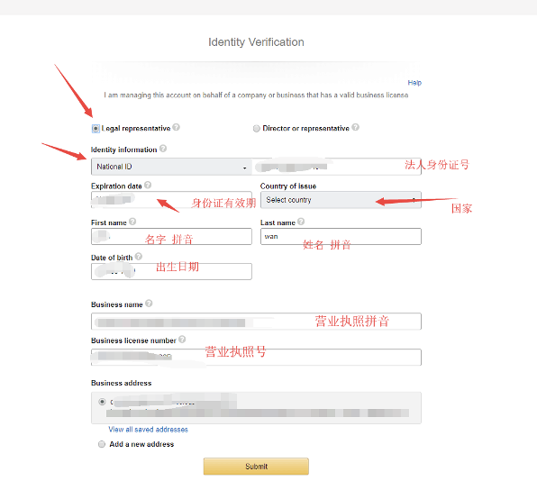
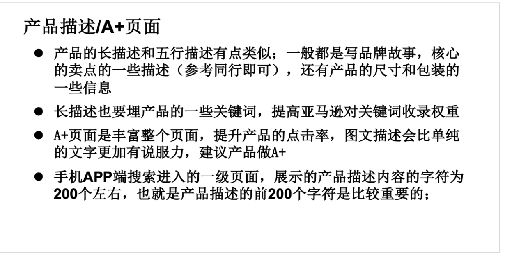
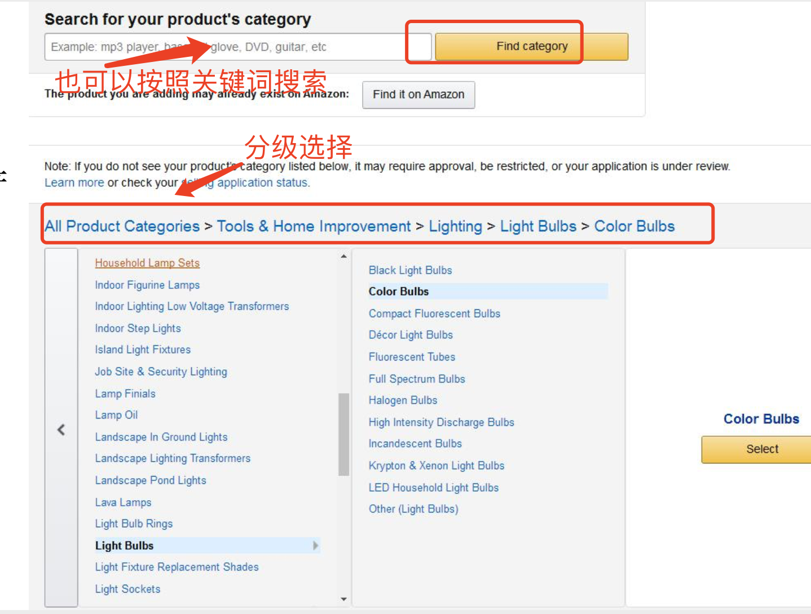

# 1.为什么选择亚马逊
---
首先，现在跨境电商的平台有很多，像亚马逊，ebay， 速卖通等，东南亚平台的虾皮，lazada， 还有我们熟知的独立站 shopify 等等。

这些都是我们刚进入跨境电商会了解到的平台，那么这个时候我们就会有个疑问，应该选择什么样的平台去做呢？

这里我简单说一下我的观点，大家可以参考下：

小团队可以独立操作，换言之就是一个人也可以做，简单操作可以找到资料从 0 到 1，还有最后一点就是这个平台有利润，现在进入我们还可以赚到钱。

那么我认为亚马逊平台是具备这几个特点的。

亚马逊上的流量会好一点，是全球排名第一的电商网站，每年的营业额高达 1000 亿美元，前期一个人就可以做到打包发货，后期的运营。

平台上某些产品的利润会相对于高一点，而且现在关于亚马逊的资料很多，更好的去查找相关的资料。

那么基于上面的考虑，我的想法是亚马逊会相对于好一点。

# 2.亚马逊前期准备
---

## 2.1 账号关联问题
---
为什么会单独提到关联问题呢？

因为这是关系到账号安全的一个重要的一环，而且今年也有卖家因为关联问题被关店铺的，所以大家要注意一下账号的关联。

关联的问题是我们做亚马逊第一个要注意的问题，也就是我们准备的这些资料要干净。

也就是说我们的营业执照，法人，还有外币信用卡，网络还有注册邮箱，手机号这些等。

这些要是没有，之前没有注册过亚马逊的，如果你的资料有注册过亚马逊账号，那么就不能再用啦，网络也是一样的，如果这条网络登陆过亚马逊的账号，那么是不能在登陆其他的账号的。

如果不小心登陆了，就会有关联的风险，那么就会被封账号。

还有注意一点，如果以后我们有多个账号，如果想要去做同样的产品，那么这些产品的文案，五行描述，还有少描述这些尽量不要一样的，这样也会有关联的风险，要稍微做些改动。

如果搞不清楚的话，简单的来说，就是我们前期准备的注册资料还有网络这些要是没有注册过亚马逊账号的就可以。

## 2.2 站点选择
---
亚马逊现在有 15 个站点，中国，美国，加拿大，墨西哥，巴西，英国，德国，法国，意大利，西班牙，荷兰，日本，印度，澳大利亚，中东站点。

那么，大的站点就是基本上是**美国、英国和日本**，其他的都算是小站点。我们一般去开账号的话也会先选择这几个大的站点先去做，然后跑通了之后再去开通其他的站点这样。

现在全球开店可以做到一套资料开所有的站点，然后收一次月租这样。

那么下面我们了解一下这几个站点之间的区别：

### 2.2.1 美国站点
---
首先，美国站点，月租 39.99 美元，开通之后美国站之后是有默认开通了加拿大，墨西哥和巴西站点的。

这是最好注册的站点，也是很多创业小白首选的站点，美国的市场最大，产品种类很多，小白很容易上手，语言是英文也容易操作一点。

（不懂英文的可以借助翻译，谷歌浏览器可以安装插件，把英文界面翻译成中文，基本上不用担心看不懂的问题）

相对于欧洲和日本，美国站的账号比较容易注册下来（竞争大的原因）。

### 2.2.2 欧洲站
---
其次，欧洲站，月租 25 欧。欧洲站里面有 8 个小的站点（英国，德国，西班牙，意大利，法国，波兰，瑞典，荷兰）注册下来，欧洲站上面 8 个小站点是自动开通的也就等于拥有了 8 个小站点。

每个站点语言不通，英国英语，德国德语，法国法语，西班牙是西班牙语。

所以如果不懂小语种的话，在翻译上面确实会费一点时间，销量的话，其中英国和德国占据销量的大头。

但是欧洲站的起点会比美国站高，首先是资料方面的审核要严格，需要过 KYC 审核，需要提交营业执照资料和法人身份信息。

如果有其他股东股份超过 25%，也要提交信息。

主要是开具 180 天之内的一些账单（手机缴费，水电煤气，银行卡账单，物业账单选一种）文件上面的姓名和地址必须与卖家后台的姓名和地址一致。稍有不同，审核可能就会有不通过。

欧洲后面也会涉及到缴税的问题也就是 VAT，这个费用美国站是没有的。目前有些类目欧洲的产品利润会比美国高。如果你要是预算充足，资料齐全可以考虑先从欧洲入手。

在物流方面，走欧洲站的产品，比如说是英国需要注册英代，有的产品还是需要 CE 认证，德国是需要包装法，这些都是我们需要提前去准备的。

所以欧洲在前期资料的准备方面会麻烦一点，但是你说我想竞争不需要那么大，那么欧洲站还是一个不错的选择的。

### 2.2.3 日本站
---
最后说下日本站，日本站也是很多卖家喜欢的一个站点。

买家整体容量没有美国站大，但是产品的利润高，其次离我们距离近，物流费用会相对于便宜点到货时间快。

日语也没有什么太大的障碍，账号比欧洲站好注册下来。但是日本对产品的质量要求还是严格一点的，海关查的比较严，现在物流税金也高。

如果懂点日语，做日本站也是不错的一个选择。

## 2.3 账号的种类
---

### 2.3.1 SC 账号和 VC 账号
---
简单来说，亚马逊分我们自己发货的账号（SC）和给亚马逊供货的账号（VC）。

这里我们说的是自己注册卖货的账号，VC我们就不说了，他是作为亚马逊的供货商，权限也会更高。（工厂卖家注册，需要一些资质审核，也可以去找第三方服务商进行注册）

注册分两种：
+ 一种是自己注册的（找到亚马逊页面，自己申请账号）
+ 另外一种是通过招商经理的链接去注册账号（招商经理注册可以推荐）。

**那么这两种渠道有什么区别呢？**

自己注册的就相当于没有妈的孩子，基本上自给自足，但是有招商经理呢，他会有一年的扶持账号的时间，期间有问题可以问他，也有专属的卖家群可以帮助解答一些问题，招商经理下的链接二审概率小一点。

建议大家用招商经理的链接去注册账号。

### 2.3.2 美国账号国内账号
---
那么我们亚马逊的账号还分本土账号和我们国内注册的账号，两种有什么区别呢？

我们国内的注册的账号在国内用国内的资料去注册，本土账号是用美国的资料去注册账号。

那么美国账号也是分企业和个人账号的。

听说两种权重是不一样的（具体的我还没有去验证），权限在某些方面也不一样。

美国账号权重高一点，比较不容易发生问题，可以卖杀虫剂一些特殊产品。那么是需要注册美国公司去注册账号的。

**注册账号准备资料**

注册账号的步骤（可能会有更新，但是选项基本是一样的）。

**我们这里以招商经理的链接为主，注册步骤是一样的**

> 招商经理会有链接去注册
>
> 备注：不是招商经理注册的账号，点击下面注册

最后，等待亚马逊的审核。如果需要二审或者是其他的资料，相应的去提交就可以了。

# 3.亚马逊 A9 算法
---
那么了解一个平台，你要了解这个平台的规则和算法，那么亚马逊的算法叫 A9 算法。

亚马逊平台有一个特点，他不像我们国内的平台，所有的销量、转化率、流量等一些数据都是透明的，亚马逊的数据是不是公开的，所以我们用软件去抓取到的数据是基本算法的一些参考数据。

但是，大家也不用很焦虑啦，我们通过估算，还有分析也是可以得到一定的数据的。那么了解了这一点之后，我们就了解一下亚马逊的算法。

亚马逊没有公开这个算法，那么我们根据经验分析，亚马逊 A9 是亚马逊搜索引擎的名称。

找出来了几点的要素是影响算法的，那么大家从这几点可以去更好的理解。

那么主要影响算法几个因素有：**销量，转化率，排名**。

这几个要素是主要影响我们的产品在亚马逊上面的权重。

我们的产品销量越好，排名就越好，排名上去了，亚马逊就会分配给你更多的流量，然后就这样是一个循环。

所以为什么我们在看亚马逊的时候，都会说要把产品推到一个什么样的排名，然后会用一切能用到的方法去刺激自己的销量，因为到了这个排名之后，你的权重有了，平台也会分配给你更多的流量，然后去到下一个层级。

# 4.如何在亚马逊上选品？
---

## 4.1 亚马逊3种模式
---

### 4.1.1 跟卖
---
这个顾名思义就是别人卖什么，我去跟着他一起去卖，这个在平台上面是允许的。

举个例子，我今天看到亚马逊上有一个卖家卖水杯，他卖的很多，然后我在下面跟着他一起卖，那么可能他一天能出 50 单，你可能可以出 10 单。

一天赚个一百多块，那么如果我要是可以跟卖跟卖一百款产品，这个利润就很可观。

大家想这样挺好的啊，这不是很简单嘛。

但是现在跟卖的成本会比之前高很多了，如果是小白卖家那么不建议从这种方式去开始，因为你能沉淀下来的东西并不懂。

如果换位思考一下的话，你辛辛苦苦打造起来一款产品，正等着收获胜利的喜悦的时候，被别人窃取了你的劳动果实，那么就是这个感受。

也就是你跟卖的那个卖家，他会用尽方法把你搞死。（在亚马逊的其他的一些小站点，还是有些卖家去做跟卖的，也是早期做亚马逊的一种盈利的方式）

**详细步骤如何去操作跟卖？**

我们首先登陆自己的账号后台，然后找到添加产品的选项。

选择一下销售此商品就可以卖了。上面是操作的详细步骤。

### 4.1.2 铺货
---
铺货顾名思义就是你需要去上很多个链接，这种模式也是有卖家在做的，一般会前期会手动铺，规模化的化用软件去操作。

铺货我们每天就要选品，大概一天要选个几十到几百款然后去上上架到亚马逊的平台上面这样。

然后我们出单了之后，可以在采购然后用自发货的方式把产品发到买家的手里。你可以把这个模式简单的理解为无货源的模式。

前期测试的阶段你不是不需要去压货的，但是后期量大了也是要压的。

那么这种方式的利弊的在哪里呢？

+ 优点：是我刚刚说的小白卖家的话，你可以前期弄了账号下来就开始去选品了，不需要去压货。上手快一点。
  
+ 缺点：需要每天大量的选品和上产品，会很费时间。

还有就是账号的安全问题，自发货的发货时效在平台是有限制的，处理的不好可能就会导致封号。那么这种方式也是有卖家在做的，之前认识的大卖一年也有的能做到千万的销售额，但是需要团队去做后面的维护的。

### 4.1.3 精品
---
精品这个是亚马逊卖家现在会选择比较多的一种模式，精品的意思是我不用上很多款产品，把很多工作放在前期去调研产品上面，那么我就去做几款产品，把他们都推到榜单的前几名，这样的利润也很可观也是现在普遍做亚马逊的卖家会选择的一种方式。

我们一般现在就是采用的第三种模式，每个店铺的产品不是很多，但是都是偏蓝海的产品，这样竞争不是很大，做一下产品的差异化在结合运营方法，产品是可以推到前面去的。那么说一下我们是怎么操作的。

**首先，选品：**

这个也是亚马逊最重要的一环，前期如果选了一款好的产品可以说是事半功倍，除了运营的大神除外。

选品方面我们没有选择很大的类目，我们一般选择的是亚马逊榜单的三到四级类目去进行选品。

（参考蓝海选品里面有提到什么是三四级类目）

为什么会定位到三四级类目呢？

因为我们做的美国站，一些红海类目上面，认为没有实力和大卖家去PK，所以就选择了相对蓝海的类目。

那么产品的毛利润有 30% 左右，单量预计一天是 30-50 单这样的产品，这样会避开竞争大的一些产品。

**确定好产品了之后，去 1688 上面找工厂的资源，基本上就是前期做调研可以的产品，采样，谈价格，看看款式上面的调整这些**。

那么从我们采样到确定产品也就是大概十几天的时间。

物流的运输方面产品小而轻的走空运，产品重体积大的走海运。

**然后产品在上架的过程中可以做文案的优化，图片的美化和产品的运营等准备工作。等产品入仓了之后就开始做推广的工作**。

## 4.2 红海和蓝海产品
---

### 4.2.1 红海产品：竞争大的产品
---
那么这种产品其实在平台上面很好去找，每个类目都有产品是排在前 100 的，这种产品的销量一般都是单量很大的，如果你有实力还有资源，想切入这类型的产品也是可以的。

那么现在亚马逊这种红海产品的现状是，竞争激烈，压钱多，需要很大的资本还有运营能力才可以的。

所以建议小卖家或者刚接触亚马逊的卖家这类产品就不要去考虑了，那么如果你是工厂或者是资金雄厚有运营能力的卖家还是可以去尝试的。

### 4.2.2 蓝海产品：竞争不激烈的产品
---
那么蓝海产品如何在平台上面选呢？

在亚马逊方面呢好的产品是成功的一半，也是很多卖家会说的 7 分选品，3 分运营。

如果你是刚做亚马逊的在资金上面还有供应链上面是没有什么优势的，想赚到第一桶金就需要弯道超车，找一些蓝海产品，这样做才有机会在平台上面去分一杯羹。

那么蓝海产品，简单的说，是需要我们在亚马逊平台上面去切入更加细分的类目，然后做产品的升级，靠我们的优势去占有市场。

**那么我们首先如何切入这个市场呢？（美国站为例吧）**

我们的目标是找到小类目的订单30-50左右，利润高，产品的竞争不是很激烈的这类产品

目标记住了，我们首先选择小的类目。找到亚马逊的BSR榜单https://www.amazon.com/gp/bestsellers

这里给大家介绍一个亚马逊的导航网站建议收藏，上面应有尽有：https://www.amz123.com/

这里就是亚马逊的类目，为什么要选择这个呢，因为你只有了解这个类目下面卖的产品还有大家的情况大可以知己知彼呀。

选择一个自己感兴趣的类目，然后每天抽出时间去浏览这个类目下面的各种产品（看不懂英文的话，浏览器可以自动翻译），找到你所感兴趣的小类目和产品。然后进行下一步的调研。

细心的朋友可以发现了右边带图的这个版面，这个是亚马逊的榜单

红色框框里面的部分，就是我们经常说到的 BSR 卖的最好的 top 榜单，new release 新品榜单，move 上升趋势最多的，wish：心愿单：gift: 礼品。

这几个榜单也是前期我们选品的时候需要关注的，新品榜单你会看到现在有一些卖家长在推的还处于上升期的一个新品，这对于我们来说或许是一个机会。

那么 3C 电子类目就不建议大家去做了，类似手机壳，线，充电宝，大卖家很多，黑科技也多，小卖家很难生存。

服装类目有资源的考虑，没资源的不碰，退货率高。一些大牌的产品，类似迪士尼啊，乐高，耐克这类要有大的品牌授权才可以，要不很容易封号。

**举个🌰怎么去看一下蓝海类目？**

首页，你了解了自己选择的类目之后，然后点进来，他还会有细分的小类目，也就是我们所说的二级，三级类目。

建议大家去更小的类目二、三、四里面去找产品。

**为什么这样做呢？**

是因为如果你翻看了亚马逊的 BSR 榜单之后，会发现很多产品一直都是在那个位置上的，基本上不会怎么变动还有就是他们的评价很多，上万甚至是上千，这样你去选择做这个产品后期运营推广的压力就会很大。

那么前期是不建议的，所以我们从更小的三四级类目去着手，你会发现里面的产品有一定的量，还可以保持一定的利润去做后面的运营还有推广。

有些朋友会说我也是新手不知道要做什么类目呢？那么建议大家从工业类目，家居，手工艺品，宠物，花园这几个类目去着手先了解。

那么我们看一下下面的这款产品：

那么我们看这样一款产品，这是一款 3D 钻头，首先我们用插件来看一下这个类目整体的一个销量，费用还有一个上架的情况。我用到的这个插件是数魔 seller motor，这个是付费的版本。

那么我们接下来先看这几组数据看一下，这款产品是否可以考虑切入。

1、BSR 一天的订单是 100 左右到第五名是有 30 单左右，那么这样的类目在美国站其实不算红海类目了。下面放一张蓝牙耳机的图给大家做一下对比。

大家可以对比一下大类目和小类目的区别，anker 第五每天有 800 单，我们刚刚看到的那个小类目 BSR 才 100 单。

所以我们也是根据经验来判定这个是一个蓝海的小类目了。

2、我们看一下大家的 FBA 费用情况（FBA 费用是做我们发货到亚马逊仓库，亚马逊帮我们打包，包装的一个费用，如果大家想做自发货的话这个费用是没有，这块我们在后面运营在详细说，先了解这个概念）

FBA 费用基本是小件产品的收费尺寸，说明这个产品体积小，重要轻。

3、我们看一下近一年的销售趋势，是整体在缓步上升的，那么看产品的趋势，大家也可以用 google trends。

这个是谷歌的一个软件，可以看到这款产品 5 年的一个走势图，我们可以看下图就知道这款产品是否有淡旺季，是整体处于上升还是在下降的一个趋势，还有些关键词在每个州的一个分布情况。

4、我们看产品的上架天数这个是代表这个产品从上架到亚马逊到现在，售卖的时间天数。

那么我们可以从这个图中看到，前五十有几个新的卖家，而且最近的推广效果还不错，那么说明这款产品是有潜力的。我们可以在观察一段时间看看他们的销售情况，考虑是否去做这款产品。插件的话我们也可以借用 keepa 去分析产品的售卖天数，价格走向这些。

5、我们找到这款产品的关键词然后去亚马逊平台搜索一下卖家数量。

关键词也就是这款产品在平台产品的名称，比如我们说的充电宝，那么充电宝就是这款产品的关键词。每款产品在亚马逊上都会有 2-3 个核心的关键词，这个我们需要知道的，后面对于我们做广告投放还有关键词设置都有帮助的。

（不会找的关键词的小伙伴我们后面在详细说）

那么我们这款产品的关键词 3D nozzles 在亚马逊的前台进行搜索，看一下产品的情况

首先，大家在搜索之前，要记得切换一下美国的邮编，因为我们中国的 IP，浏览器默认的是中国的邮编，这样搜索结果会有偏差或者是不全。

我们看一下搜索的结果数还有产品在亚马逊前台的分布的情况，标注 sponsored 的是亚马逊的广告位，代表这个卖家有做站内广告，然后我们看下其他位置卖家的一个评论，价格还有产品的一个情况，综合去分析一下这款产品能否去做。

我们看一下评论，有两家评论过千的，我们的评论是跟淘宝一样的代表的是买家买了这款产品对这个产品的评价，那么评论越多，我们也就知道这款产品的订单也就相对于来说会高一点（亚马逊通常的回评比例是 100:1）。

这款产品是有几家评论过千的，是不是就证明这款产品其实是有一定的销量和市场的？这样才会有这样的评论基础。

还有一些卖家的评论的是几百的，属于中间的市场，最后也有些卖家是刚上的这款产品，可以排到首页的位置，是不是证明这款产品的是可以推起来的呢？那么我们中高低都分析了，这款产品是值得我们去进入下一步调研的。

6、那么我们下面我们也可以看一下关键词的容量，也就是站在买家的角度，看一下搜索量是多少，借助的软件（卖家精灵，免费版本可以试用，上面的导航网站都可以找到）

那么我们看一下上图，大词的月搜索量是 6 千多，证明还是有一定的需求还有客户群里的，那么月购买量是跟我们之前抓取到的销量是差不多的，最后我们看一下 PPC 竞价，这个是亚马逊站内广告的一个竞价，我们的广告是按照单次点击去付费的，也就是买家点一次多少钱去结算费用，也就是我们说的 PPC。

那么我们看上图 PPC 竞价其实的范围不高，证明的他的竞争不是特别激烈。我们接下来看一下对比图，蓝牙耳机的。

这样大家就知道蓝牙耳机的量有多大，多烧钱了吧。

7、了解完了大概的市场体系和容量，接下来我们要知道产品的利润了吧，卖一款产品出去我到底可以赚多少钱呢？

首先我们要知道在亚马逊平台卖东西的一个收费标准。

那么我们每卖出去一个产品平台是要抽佣金和之前我们提到的分拣包装费的，然后我们还要去除我们产品的成本+头程（头程也就是我们把产品从国内运送到亚马逊仓库这个中间运输所产生的物流费用），这些都去除了，最后是我们得到的毛利。

我们的佣金和分拣包装费我们统称FBA费用，这个费用怎么算出来的呢？
https://sellercentral.amazon.com/hz/fba/profitabilitycalculator/index?lang=en_US

我们借助上面的这个小工具。首先科普一下亚马逊佣金一般是15%，有些类目是8%的（例如个人护理类目）分拣包装费呢是按照我们产品的体积重量大小去算的。

那么算利润的时候，要对标你要做的同款类似的卖家，不要对错了哦。

下面我们看一下上面这个产品的利润。

这个就是我们的公式算出来的产品利润率，那么成本大家可以去1688上面去找同款，头程我这里是按照空运的价格去算的，那么海运的话会更低，毛利基本上要到30%这样去做后面的推广，空间才会更大一点。那么大家也可以知道公式的原理，也可以用excel表格去算，这样更方便快捷还有记录产品的变化。

最后，我们还要考虑的一点是这款产品是否有专利会侵权，小心使得万年船。

这个可以通过我们去问1688的产品供应商，还可以找代理去查或者我们自己去查也是可以的。如果大家没有做大牌子的产品一般不太会涉及到，亚马逊上面我遇到的是产品的关键词被注册成商标侵权，还有外观专利还有一些产品的的知识产权和设计上面的专利。这里就不展开说了。

# 5.选品后的运营
---

## 5.1 上架产品
---
上架产品这里我们这里前期需要准备的是UPC（购买即可），我们这里就不多说了，

Listing（产品的文案）：包括产品的图片，标题，五点描述，长描述，A+页面

### 5.1.1 图片
---
图片建议自己去拍摄（省成本的话 PS 也可以）可以借鉴同行，不要完全照抄，亚马逊图片也是存在侵权风险的。

### 5.1.2 标题
---

### 5.1.3 五点描述
---

### 5.1.4 长描述/A+页面
---

### 5.1.5 关键词
---

文案怎么写可以参照上面的要求，具体的怎么去上架我们就不说了。说了这么多，你会想这么多东西，权重分布是怎样的呢？

总结：标题 > 五行 > 长描述 > A+页面（关键词是镶嵌在这些文案当中的，不可分离，做文案之前先找关于产品的关键词）

## 5.2 那么如何在亚马逊上架我们的产品呢？
---
这个是我们后台的操作面板，我们后台这里是可以切换语言的，所以大家不用怕看不懂英文，我们可以切换中文使用界面。

1、管理库存，选择添加新产品

2、然后点进来选择产品的类目，我们产品的类目选择，大家要是不知道如何去选择，可以找到同类的竞争对手，看他们放在哪个类目我们可以选择同样的类目。有的时候一个产品可以放在多个类目。

3、选择好类目点进来填写产品的必要信息就可以了

More details 里面的内容基本是包括的产品的各种属性，知道的填写一下就好了，不知道的可以不填写，产品的后台信息，我们点击进来有红色感叹还有红框这些是产品的必填项，没有标的就是选填项。

这个就是我们上传产品的步骤，然后我们要注意一下，亚马逊上面有些产品的类目是不需要审核的，有些产品的类目是需要审核的，所以碰到需要审核的类目还有产品需要我们过了审核才可以在亚马逊上去销售这类型的产品。

那么我们看一下需要申请的产品和类目。

然后需要的资料，我们点进去相应的类目，就可以看到亚马逊要求上传的一些资料，一般是需要产品的一些安全的认证还有相应的发票和包装拍照等等，不同的类目也会有不同的要求。（在亚马逊上销售成人用品类目也是需要审核的，还有就是成人用品亚马逊不让打广告。）

**上架完产品了之后，如果产品没有什么问题，我们就需要转 FBA，打印商品的条码，然后进行 FBA 发货**。

然后到这里我们就完成了自发货转化为亚马逊配送，下面我们要进行FBA发货。

## 5.3 FBA 发货流程
---
FBA 发货流程是基本上面我们的产品转换为亚马逊配送的产品之后，然后我们需要打印商品的标签（标签建议使用铜板纸的，这样的在运输途中，不容易损坏），标签贴好了之后，我们就可以安排发货，然后填写后台的这个 FBA 流程，打印最后的箱子标签。

那么我们第一批的发货数量，如果是新手的话可以发货 50-200，按照这个数量去选择都是可以的。

因为我们前期选品，现在发货过去也需要测款去验证市场是否OK，那么我们前期发货过去的数量是够我们去做测试的。（不要想着我们发货过去第一批货就要赚钱哦，因为还有后期的运营成本呢）

物流方式的选择上面，产品如果轻小的话，建议第一批走空运，这样反应的速度够快，方便我们下一批货的安排。

那么如果你选择的大件货，比如像家具这种的或者产品重量超过1KG了。那么建议大家走海运，虽然慢一点，但是可以节省一点物流成本。

那么基本上我们发货的时候要注意的就是这些了，还有货代，货代的话就是我们发货的一个承运人，就是你把货交给他，然后他们帮我们运到亚马逊的仓库，现在做亚马逊的货代很多，这个很好找，大家不用担心这方面了。

还要注意一点，我们发货的时候，单箱的重量不要超过 22KG，箱子的最长边不要超过 60cm.

**下面我们看一下FBA具体的后台操作：**

1、选择我们要发货的产品，然后点击下面的发补货

2、然后创建新的发货计划，发货地址我们自己填写（如果想分到美西的仓库地址，可以用地址生成器生成一个美西的地址，因为亚马逊发货的时候，美西，美中，美东收费不一样，美西最便宜）

3、填写发货数量

4、然后选择发货方：卖家打印标签

5、然后我们就可以看到我们的发货亚马逊分配的仓库地址，发货的那个标题是可以改的，一般可以修改成发货的数量，时间这样方便后面查找，然后我们点下面的黄色按钮。

6、然后选择小包裹快递，承运人那里选择如果不知道点开有个其他的选择。

7、然后选择我们的箱子的数量，按照实际情况填写就好了，⚠️这里要我们的填写的重量和尺寸都是外箱的不是产品的。

8、到我们的最后一步，打印外箱标签，我们的货件就创建完成了（外箱标签尺寸100*100）

那么我们的FBA发货流程创建好了，就可以联系货代去发货了。然后等货到了之后，产品上架之后，就可以开始我们的推广了。

# 6.如何推广亚马逊产品
---
推广产品的我们分为站内和站外（站内指的就是亚马逊平台内的，站外是亚马逊的站外的，比如说 Facebook，google 广告，还有站外 SEO 等）。

那么如果是产品可以的话，我们做好站内的推广就够了的，站外是对我们的推广起到一个锦上添花的作用。

那我们产品上架需要做什么呢？

一般产品上架第一个月是最重要的，因为产品刚上架第一个月是产品的新品期，那么第一个月的时候亚马逊会对我们的新品有一个流量的扶持，所以有的时候我们推新品比推老品简单的问题就是在这里。

那么过了这一个月的话，老品的话就没有那么好推上去了。还有就是产品尽量不要断货，不要断货，产品断货之后我们前期推广做的工作都要重新做啦。这两点是我们推广产品需要注意的两点。

产品上架了之后我们一般要关注几个指标：转化率，排名，流量，review 的变化这样。

因为转化率越高，亚马逊分配给你的流量就越多，然后我们的排名就越靠前，销量也就越大。

review（产品的评论）这个也是影响我们产品转化率的一个重要的因素。

首先，我们先要检查一下我们之前的文案里面的标题，五行描述，长描述还有关键词这些是否和产品是相关的。

然后，产品上架之后的第一件事情就是要想办法激活我们的销量（之前提到过产品刚上架的时候有亚马逊的新品期，那么抓住新品期也是我们成功的第一步）有了销量之后，转化率好，亚马逊才会给你分配更多的流量。

这样就是一个良性循环的过程。

那么怎么样去激活我们的销量呢还有新品期我们需要做些什么呢？这里我们可以参考这样一个表格：

那么这几点大家在新品期都有操作的话，产品可以的话，应该是可以出到十几单左右的，后面要增加效果的话，我们可以通过广告还有站内的秒杀或者站外折扣的一些方式去刺激产品的销量。

# 7.亚马逊的站内广告
---
亚马逊的站内广告是我们推广产品一定会用到的一个工具，因为我们的产品前期如果不打广告的话，在平台上面的是很难有流量的，没有流量也就意味着没人看你的产品，没有订单，所以这个时候，我们要用到亚马逊的站内广告。

那么我们首先要了解一下关于站内广告的一些词汇解释：

+ CPC：（按点击付费）是我们统称站内广告的叫法，因为亚马逊的广告是按照点击付费的，也就是你给到的关键词，点击一次多少钱，这样去进行扣费的。

+ CTR：点击率 = Click(点击)/ Impression (曝光)

+ CR：转换率= Order（订单）/Click（点击）

+ Acos: 广告投入产出比= Spend （花费）/ sales (销售额) * 100%

CPC实际扣费的公式如下：
*（下一名的出价下一名的质量得分）/自己的质量得分+0.01 *
A、B、C的实际扣费将是：
（27）/10+0.01=$1.41，
（3*4）/7+0.01=$1.72，

C 的实际扣费也同样会参考比 C 低的一个广告的情况而产生。

这些都是我们做广告之前需要了解的基础概念，然后我们了解如何在平台上面做广告？

## 7.1 为什么要做广告？
---
我们做广告的目的，是为了我们的产品赢取更多的流量和曝光，让买家看到我们的产品从而提升产品的销量和排名。

还记得我们之前提到的产品新品期，通常来看我们要在第一个的时间之内把产品推到一个理想的排名内，那么要用到最直接的方法就是站内的广告（亚马逊现在的广告没有国内的直通车那么烧钱，可以控制在合理的预算内）

现在如果单纯的靠自然流量，产品其实是很难推起来的了。如果我们的广告可以赢得足够的销量，那么站外还有促销这些都是锦上添花的方式了。

我们做广告之前，也要给产品设置一个预算，不要无止境的去投入。

比如前期你的产品单价比较低，那么可以尝试一天给 20-50 刀的广告预算，然后分配到多个广告组，如果单价贵一点，那么广告的预算可以增加一些去做投放，我们做广告的目的是为了产品的曝光还有转化，是为了赚钱的，不是烧钱的（大家一定要记得这一点）

## 7.2 做广告的一些条件
---
1. 产品要有购物车
2. 最好是FBA发货（转化率会高一些）
3. 产品最好是有评论（广告转化率会好一点）
4. listing 优化到位

## 7.3 亚马逊广告的类型
---
1. 自动广告：不需要我们自己设置关键词，亚马逊会按照我们文案里面的关键词进行抓取，然后进行一个广告的投放。
   + 自动广告的目的：帮助我们检测文案里面的关键词是否准确，获取更多的曝光，获取更多的相关关键词
    
2. 手动广告：通过我们设置的关键词，然后按照我们给的关键词进行投放
   + 手动广告的目的：测试关键词，提升关键词的排名，提升产品的转换率
    
3. 展示型广告：展示型广告的位置更加多一点，可以打到购物车的下面或者是手机端的位置上，或者是按照我们的类目还有产品的受众，制作产品的视频去投放广告
   + 展示型广告目的：获取更多的广告位置，提升产品的流量和转化
    
**新品期广告策略**：（产品最好有评论在做广告，这样转化率会高一点，前期实在没有评论，也可以直接开）
+ 自动广告开三组（可以按照高中低的竞价出）：赢取更多的曝光和订单
+ 手动广告：核心大词找2-3个开精确匹配：提升关键词的排名，快速去到首页
+ 长尾词找到几十个开广泛匹配：提升长尾词的权重和xiaol
+ 找到相关联的产品开广告：抢竞争对手的流量
+ 产品的类目和受众广告可以看情况去做

做完这些下来你会发现我们能开到 7-8 个广告组，如果产品没有问题的情况下，第二天是肯定会出单了。

然后我们在等广告报告，去分析现有的广告组，还有去调整现在的广告组，因为我们的广告不是开好了就不管了，是不断要去按照我们的目标去调整的。

前期我们的出单主要是依靠广告，后期我们的出单主要是依然自然流量，减少广告的比列，这样才能做到一个更好的投入产出比。上面的策略也不是一成不变的，大家可以根据产品的实际情况还有预算去进行调整。

**下面我们在看一下手动广告的几种匹配类型：**

+ Broad（广泛匹配）：包括关键词本身，相关词，同义词，拼写错误，变体等；

+ Phrase（词组匹配）：带前缀或后缀，变体，拼写错误，单复数，词干 (如backpacking代替backpack)， 缩写词；

+ Exact（精确匹配）：包括拼写错误，单复数，但不包括带有前后缀的词；

所以我们可以看到广泛匹配可以覆盖到尽可能多的词，词组匹配就稍微精确一点，精准匹配就是更准确的。

商品投放：商品投放是我们的产品可以投放在别人的产品下面的一种广告方式，我们筛选产品的时候，可以去找评价比我们产品低的，产品价格没有优势的或者是产品页面做的差的这类产品。

## 7.4 做广告会遇到的几种情况
---
+ 高曝光，无点击：检查图片或者是文案是否OK，产品价格是否是偏高，产品有无评价，QA，广告的竞价是否过低这几个方面的因素

+ 低曝光，无点击：检查产品是否有问题，产品的竞价是否出得太低

+ 低转化，asos高：检查产品的关键词关联性高不高，打广告的同类型产品的评论如何，是否有竞争力，同类型产品的价格，图片如何这几个方面考虑

广告数据是有延迟性的，一般我们是7天下载一次广告的报名进行分析，然后找出有转化的关键词，还有没有出单关键词进行下一步的分析。

## 7.5 广告的基本操作流程
---
1. 点击进入广告界面

   

2. 创建广告活动

   

3. 选择商品推广广告

   

   

   

   

   

   

   

最后设置完成，点击启动广告，那么我们就成功设置了广告组，那么大家如果设置的是自动广告的话，就不会有下面选择关键词的页面，输入关键词的页面是我们设置的手动广告才会有的界面。

# 8.亚马逊常用工具
---
**我们有一个网址大全：amz123.com**

这个网址可以保存好，里面基本上可以涵盖基本上我们可以用到的一些工具

那么这些工具也是提高我们工作效率的工具，如果觉得没有必要也是可以不用的。我提到的工具也是我曾经做过的，觉得还可以的

+ 选品： JS，seller motor， 卖家精灵

+ 关键词：merchant words， js， 卖家精灵，sif， sonar

+ 收款工具：连连支付，World First， Pingpong， 网易支付

+ 综合ERP：易仓，马帮，船长

然后利润计算器还有一些小的工具，大家都可以去上面的网址可以找到的。

最后，祝大家都能在亚马逊平台上面大卖，感谢张哥，菜花的邀请编写这次的亚马逊项目手册，也是我第一次去整理这些东西，其中写的不好的，不是很到位的地方，还请大家多多包涵，也欢迎大家多给我提意见，多多交流，共同成长。
