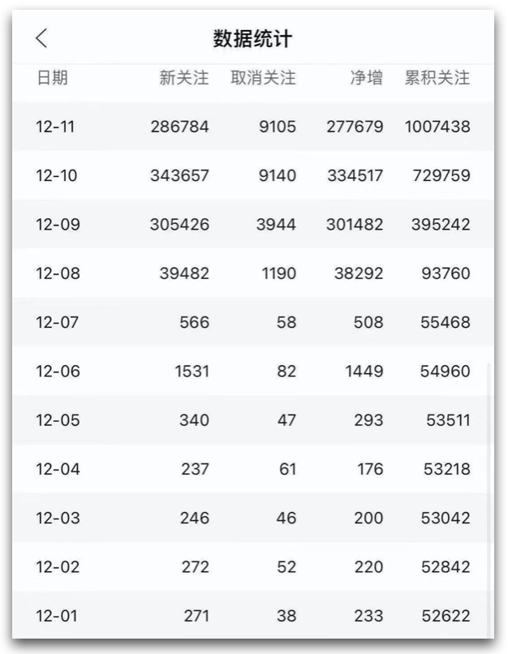
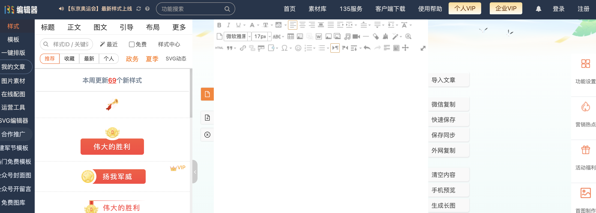
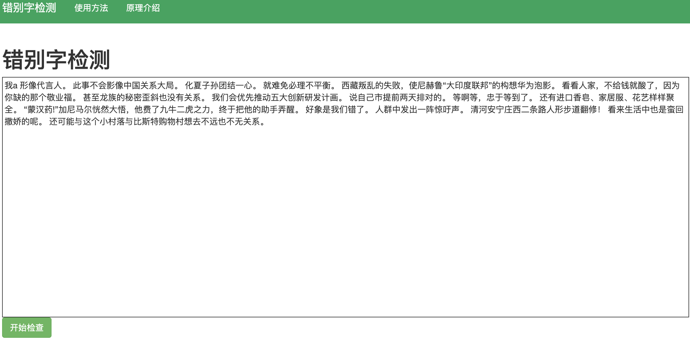
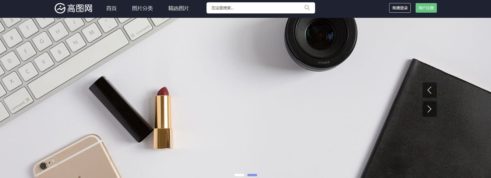

# 1.微信公众号简介
---
微信公众平台于 2012 年 08 月 23 日正式上线，最初叫做“官号平台”和“媒体平台”，创造更好的用户体验，形成一个不一样的生态循环。

2018 年 6 月 27 日，微信官方宣布，微信公众平台上线开放转载功能，文章可以直接被转载，不需要人工确认。

2018 年 11 月 16 日，微信公众平台发布公告称，即日起，公众号注册将做调整：个人主体注册公众号数量上限由 2 个调整为 1 个；企业类主体注册公众号数量上限由 5 个调整为 2 个。

2018 年 12 月 29 日，微信公众平台运营功能再次升级，修改已发送文章的错别字上限由 5 个上调至 10 个，同时支持增、删和替换，但标题和摘要依然无法修改，修改机会依然有且仅有一次。

2020 年 6 月 29 日，微信公众号增加两项新功能，在文章底部新增了“分享”和“赞”。其中，用户点击“分享”可“分享到朋友圈”或“发送给朋友”。这两项新功能已陆续全量开放。

另外，公众号+视频号，将是以后的标配，二者不仅可以互相绑定、互相导流，而且能够在视频号开播的时候，公众号界面显示正在直播，搭配使用可以极大地增加账号粉丝粘性。

2020 年微信 500 强群体共推送 112.1 万篇图文，相较于 2019 年推文数暴涨 13.8 万篇，收获超过 385.2 亿次阅读，4.4 亿次在看。

平均一个 500 强账号全年推送 638 次（1.7 次/天），2242.5 篇（6.1 篇/天），单篇图文收获 3.4 万次阅读及 390.6 次在看。

基于微信公众平台前端显示数据规则，10w+ 统一以 10 万计算。

单篇文章的阅读数持续下降，爆款文章呈井喷式增长

新榜统计过去 5 年的活跃样本（即有监测发文的公众号，含时事政务）的阅读数，发现单篇文章的平均阅读数持续走低，5 年内降幅达 69.9%（由 2016 年的单篇 3719 个阅读降至 1120）。

进一步统计单篇文章的在看数，发现近 5 年走势较为平稳（18 年及以前的在看数实际为点赞数），2020 年平均单篇在看数为 10，同比增长 11%，目前来看，6 月 29 日回归的“点赞”功能并未对“在看”产生明显的影响。

虽然阅读数逐年下降，但优质内容依旧有发光发亮的机会。2020 年产出的阅读及在看数双 10 万+的爆款作品同比增长 732%，为 283 篇（除去因账号违规、侵权抄袭、作者删除等原因无法正常显示的 10 万+赞文章），其中发布时间在 1-3 月份的爆款文章数占比达 6 成。

微信公众号官网上有这么一句话：再小的个体，也有自己的品牌。

常人做公众号目的无非两个，一是赚钱，二是记录生活，建议把赚钱当作目标，因为只有钱最有可能驱动你去日更。

目前来看，公众号是生命周期较长的平台，而且 12 亿 + 的月活以及基于微信生态的传播也为公众号提供了足够大的流量池和持续变现的可能。

# 2.微信公众号注册与认证
---

## 2.1 微信公众号的分类
---
**微信公众号分为订阅号和服务号**

### 2.1.1 订阅号
---
任何组织和个人都可以申请，每天群发一条信息，认证后有自定义菜单。没有高级接口，不能用开发模式。

**不可主动添加微信好友，认证需 300 元/年**。

### 2.1.2 服务号
---
只面向企业或组织机构申请注册，申请后自带自定义菜单。认证后可以有高级接口，每周群发一条信息。

**不可主动添加微信好友，认证均需 300 元/年**。

## 2.2 公众号常用的功能
---
+ **菜单栏**：根据平台现有的资源，搭建引导型菜单栏，搭建成功后推送给用户试用。通过公众平台分析用户画像，调整菜单栏的方位、名称，使用户能迅速在平台上找到自己需要的资源，对平台产生信任感持续关注。

+ **页面模板**：是微信公众号独有的可以将相同类型的文章整理到一个模块中。我们通过导入控件实现该功能，并将推送的信息进行分类，存放到不同的模板之中，为用户获取信息提供便利。

+ **自动回复**：通过编辑整理微信公众号已有的资源，设置关键字，将资源和关键词关联起来，用户在公众号后台回复关键字，公众号会自动回复关键字对应的资源，可以大幅度提高平台的活性。

+ **赞赏**：运营者在公众平台推送3篇原创文章以上，开启赞赏功能。原创文章选择赞赏账户即可开启赞赏，用户通过“喜欢作者”向原创作者赞赏，赞赏费将会在7个工作日内发送到设置的赞赏账户。

+ **原创管理**：微信公众号推送过原创文章，通过添加插件即可开启该功能。通过后台设置转载信息，短期授权或长期授权给其他微信公众号。

+ **投票**：运营者在微信公众号发起关于编程问题、个人意见等投票，进行收集粉丝意见。通过微信公众号后台的投票详情分析得到自己需要的信息，从而及时调整平台的发展方向。

+ **素材管理**：运营者登录微信公众号之后，点击素材管理即可进入文章管理界面。写好的文章可以保存在里面，并可以随时进行修改订正。

## 2.3 微信公众号申请
---
1、打开[公众号官网](https://mp.weixin.qq.com/)，右上角点击立即注册

2、选择帐号类型

公众号分为「订阅号」和「服务号」。

服务号需要企业营业执照，每月只能发 4 次文章；订阅号是个人就能注册，而且每天能发一次文章。

一般来说，个人都是会选择订阅号进行注册

3、填写基本信息

填写邮箱，登录您的邮箱，查看激活邮件，填写邮箱验证码激活。

4、信息登记

选择个人类型之后，填写身份证信息。

5、公众号信息

填写帐号信息，包括公众号名称、功能介绍，选择运营地区。

6、注册成功

## 2.4 微信认证
---
微信认证是微信公众平台为了确保公众帐号信息的真实性、安全性，目前提供给微信公众号进行微信认证的服务。

1. 微信认证后，获得更丰富的高级接口，向用户提供更有价值的个性化服务。
2. 微信认证后，用户将在微信中看到微信认证特有的标识。

### 2.4.1 企业认证
---
公众号认证分为企业认证和个人认证，企业认证需要以企业身份注册订阅号，注册成功后，在下图处进行认证申请，认证需要花费 300 元。

企业认证之后，可以在菜单栏放置第三方链接。

### 2.4.2 个人认证
---
为了确保公众帐号信息的真实性、安全性，微信公众平台增加“个人认证”方式，个人认证成功后，关于公众号页会展示认证信息、以及个人认证特有的标识。一个自然年内认证次数上限为 2 次。

**个人认证在哪里申请？**

目前该功能还在灰度测试中，收到邀请通知的个人公众号可以登录微信公众平台官网->设置->公众号设置->帐号详情->个人认证->申请认证。

### 2.4.3 认证需要的资料
---
微信认证选择微信公众帐号认证类型时，请您根据“组织机构代码证”显示的机构类型进行选择，并提供对应的资质

各个类型以及所需的业务资料，如下图所示：

认证类型|组织机构类型|业务资料|资质文件
:---|:---|:---|:---
**个体工商户**|个体户|对公账户：对公账户或法人私人银行卡|
公章：无公章可使用法人签字代替|《企业营业执照》||
若办理过三证合一的企业无法提供组织机构代码证，请上传最新的《营业执照》|||
**企业类型**|个人独资企业|对公账户：企业是必须要对公账户的，若无对公账户请先办理对公账户；|
公章：一定要使用企业公章|||
营业执照注册号、组织机构代码|《营业执照》、《组织机构代码证》||
若办理过三证合一的企业无法提供组织机构代码证，请上传最新的《营业执照》|||
​|企业法人||
​|企业非法人||
​|非公司制企业法人||
​|全民所有制||
​|企业分支机构||
​|农民专业合作社||
​|合伙企业||
​|其他企业||
**媒体类型**|事业单位媒体|事业单位如无对公账户，可以使用证书上法人的对私银行卡号及姓名，也可以填写结算中心或财政账户支付验证（如国库集中收付结算中心等）|《事业单位法人证书》、《组织机构代码证》和以下对应的资质
网络媒体上传：《互联网新闻信息服务许可证》或《信息网络传播视听节目许可证》|||
广播电视上传：《广播电视播出机构许可证》或《广播电视频道许可证》|||
报纸上传：《中华人民共和国报纸出版许可证》|||
期刊上传：《中华人民共和国期刊出版许可证》|||
​|其他媒体|对公账户|《组织机构代码证》和以下对应的资质
网络媒体上传：《互联网新闻信息服务许可证》或《信息网络传播视听节目许可证》|||
广播电视上传：《广播电视播出机构许可证》或《广播电视频道许可证》|||
报纸上传：《中华人民共和国报纸出版许可证》|||
期刊上传：《中华人民共和国期刊出版许可证》|||
**其他组织**|免费类型（基金会、农村村民委员会、城市居民委员会、政府机构驻华代表处、）|免费类型，若无对公账号，可以在“开户银行”、“银行账号”栏填写“无”|村委会、居委会请上传《基层群众性自治组织特别法人统一社会信用代码证书》
基金会请上传：《基金会法人登记证书》|||
外地常设机构请上传其驻在地政府主管部门的批文|||
外国驻华机构请上传国家有关主管部门的批文或证明|||
​|社会团体（社会团体法人、社会团体分支、代表机构、群众团体、群团机关，其他社会团体）|对公账户或法人私人银行卡|《组织机构代码证》、《社会团体登记证证书》
​|民办非企业|​|《组织机构代码证》；《民办非企业登记证书》
非事业单位的培训教育机构，需要提交其自身所有权的《办学许可证》|||
非事业单位的医疗机构包括美容，需要提交其自身所有权的《医疗机构执业许可证》等|||
若办理过三证合一的企业无法提供组织机构代码证，请上传最新的证件|||
​|其他组织 （宗教活动场所、自定义区、其他未列明的组织机构）|​|《组织机构代码证》、相关登记证书、批文或证明等
若宗教团体无《组织机构代码证》，请提供宗教事务管理部门的批文或证明|||
**事业单位**|事业单位法人|事业单位如无对公账户，可以使用证书上法人的对私银行卡号及姓名，也可以填写结算中心或财政账户支付验证（如国库集中收付结算中心等）|《事业单位法人证书》、《组织机构代码证》
若办理过三证合一的单位无法提供组织机构代码证，请上传三证合一的《事业单位法人证书》|||
​|事业单位分支||
​|派出机构||
​|其他事业单位||
​|部队医院||《军队单位对外有偿服务许可证》 或者《有偿收费许可证》或者《中国人民解放军部队卫生机构对外非营利性医疗服务许可证》+对公账户，按事业单位认证类型提交认证，机构类型显示“部队医院”
**政府类型**|国家权力机关法人|若政府类型若没有对公账号，可以在“开户银行”、“银行账号”栏填写“无”|《组织机构代码证》
**温馨提示：**|||
政府类帐号必须是独立主体才可认证，例如：下属部门作为主体申请，需具备自身主体证件；若不具备自身主体证件，则需提供上级机构主体证件|||
​|国家行政机关法人||
​|政协组织||
​|民主党派||
​|人民解放军||
​|武警部队||
​|其他机关（法院机关，机关非法人等）||

# 3.公众号的账号设置
---
开始写公众号之前，第一步就是要确定公众号的**名字、头像、简介**。

**关注后自动回复的内容**，以及各种的菜单栏最好也设置好。

这些看似简单，实际上却是蕴含着公众号的整体运营思路。除了让人印象深刻之外，还需要与自身的目标相一致，需要起到传播的作用。

但是太多人不注意这一点了，很多公众号的名字起的很随意，简介也无法体现出公众号的定位，菜单栏一直是空的。

在现在这个快速发展的大前提下，所有人的精力都是有限的，对于新用户来说，看到公众号的第一眼就是名字、头像和简介。

为了吸引用户关注，你需要在最短的时间内告诉用户：你这个号是干什么的，这样才能有机会让用户关注你。

这一章，我们就来说下，公众号的名称、头像、简介等，应该怎么设置。

## 3.1 公众号名称
---
公众号的名字很重要，其实只要涉及到名字，都非常重要。不管是人名、公司名，还是网名、公众号名。

相信 99% 的人在注册公众号的时候，都会想自己的公众号要叫什么名字，甚至有很多人没写公众号的原因就是想不出好的名字。

一个好的名字容易吸引人们的注意，可以快速锁定目标用户，还会让公众号自动涨粉。

既然名字这么重要，那么怎么才能起一个比好好一点的名字呢？

我简单说几个起名的原则和方法

### 3.1.1 不要用生僻字，不要用谐音
---
生僻字不容易理解，不好记，不容易被更多人知道。

谐音字这个可能有人会有疑问，我知道有一些人的公众号就是用的谐音，而且还觉得自己很有才华。

但是这种确实不容易被传播，因为用了谐音的名字，读者在第一次输入时总会输错，会增加传播的难度。

公众号名字最核心的诉求是「容易识别」、「容易传播」，生僻字、谐音，完美的避开了这两点。

### 3.1.2 不要用贬义词
---
贬义词容易给读者一些不好的联想，虽然这类名字会更容易被记住，但是，读者可能会对这个号有负面的联想。

### 3.1.3 不要太长，尽量控制在 3~5 个字
---
根据新榜、西瓜数据的调查，大部分的公众号的名字都在 3~5 个字，其中以 4 个字的居多。

大家看一遍自己关注的公众号列表，相信也能发现这个情况。

**名字太短、太长都不容易传播**。

下面说几个起名字常见的方法。

**方法 1：个人 IP 型**

这是现在比较常见的一种命名方式，就是以人名或者网名来命名公众号。

很多知名的个人公众号或者自媒体都是这个方式命名的。

比如：「stormzhang」、「caoz的梦呓」、「刘润」、「苏群」等。

但是，这样的方式也有一定的缺陷。

这种方式比较适合有一定知名度，而本身有一定名气的人。

因为作者的名字，本身就是一个招牌，直接利用人名来命名，能直接吸引更多人气。

但如果你本身没有名气，或者名气不大，建议最好不要使用个人 IP 这种方式命名公众号。

**方法 2：定位型**

这个方式就是把公众号的内容定位，直接放在名称上。让即使完全不了解你的读者，也能够马上知道你能提供那些价值。

比如：「帅张读书会」、「人人都是产品经理」、「丁香医生」等。

用「定位型」取名，不仅能有效降低用户顾虑，而且关注的用户也更为精准。

这是比较适合大部分人的一种取名方式，明确自己要提供的内容，不但方便读者，也能够时刻提醒自己公众号需要提供哪方面的内容。

**方法 3：严肃正经型**

这类命名方式在测评、总结分析类、展示某领域的某类信息时，比较常见。

这类大多包含「报告、周刊、专刊、日志、榜单、指南、实录、xx说、xx精选」等词语。

**方法 4：特定领域类**

这种类型就是比较细分、垂直的命名方式。

以 IT 为例，很多技术类公众号就是这种命名方式，经常会在名字内包含特定的关键字。

比如：「Java」、「Android」、「算法」、「Python」等。

这些都是比较常见的，而且这种命名方式很容易让人联想到其关联的行业，从而能更好地定位目标人群。

目标人群在搜索时，也能更方便的检索到。

好了，公众号的命名方式有很多，非常多，相信每个人都有自己的想法，在这里，我就先说以上这几种。

最后提醒一下，虽然公众号的名字很重要，但是好名字只是能吸引更多的人来看，留住用户的，还是你的内容。

所以，不要一直纠结在名字上。

很多人就是想起一个「完美」的名字，然后一直想不出来，公众号也一直没写。

如果你实在想不出好的名字，可以按照「个人 IP 型」，先用自己的名字，先把公众号注册了，然后开始写。

名字可以慢慢想，订阅号一年有 2 次改名的机会呢。

## 3.2 公众号头像
---
公众号头像也是很重要的，但是很多人重视名字，却不重视头像。

下面我就说一下，好的公众号头像应该具备的四个标准。

### 3.2.1 头像要清晰、清楚
---
这是最最基本的一个条件，头像上呈现的所有元素都要能够看的清楚。

不要出现模糊不清，这样会减弱用户的打开率，更不会关注你的公众号了。

### 3.2.2 头像要简单
---
一个好的公众号头像是要让用户记住你，变成你的一个标志，比如 KFC、麦当劳的头像，大家一看就知道了。

要想大家能够记住，头像就要简单，比如可以放简单的 logo、slogan、字母、汉字、数字等。

但一定要有取舍，不能什么都放。

什么都放，那么用户什么都记不住，越简单，用户越容易记住。

### 3.2.3 头像最好色彩鲜明
---
除了简单、清晰之外，公众号的头像，最好拥有 2 种颜色，尽量不要超过 3 种。

两种颜色能够突出主要的内容，三种及以上就显得很混乱。

这几个都是不错的头像。

颜色最好要够纯够亮够饱满，尽量少用暗色，尽量不要模糊不清。

### 3.2.4 头像要展现定位
---
公众号的名字和头像是互相补充的作用，头像可以看做是名称的精简版。

因此头像最好也能展现出定位，让用户看到头像就能看懂你大概是做什么的。

### 3.2.5 如何快速做一个还不错的头像
---
推荐一个还不错的软件 — 「canvas」，各大应用商店都能下载。

里面有很多还不错的模板，不仅限于「公众号 logo」，其他的像「微信朋友圈」、「公众号文章封面」、「海报」等，都能设计。

选择 logo，就可以出现很多不同的样式，然后找到自己喜欢的样式，就可以针对性的修改成自己的定制 logo。

以上，就是公众号头像的一些标准，以及如何快速做一个自己的定制头像。

赶紧实践起来吧。

## 3.3 公众号简介
---
公众号的简介也非常重要，那我们就来说一说，一个优秀的公众号简介，应该具备什么样的要素。

### 3.3.1 简短
---
简介是要让用户快速掌握核心的内容，了解你公众号的定位，或者是你这个人的定位，你能提供什么价值。

所以，重要的核心内容一定要放在第一位来写，最好控制在 50 个字以内。

比如，stormzhang 的简介，标明了自己的个人定位。

罗辑思维标明了自己能提供的价值。

### 3.3.2 易懂
---
这个很简单，就是一眼就能让你读懂公众号的内容，看到基本能记住。

千万不要自作聪明的写一写专业的名字，以及行内的惯用缩写之类，读者可能看不懂。

### 3.3.3 陈述价值
---
通过简介的内容，要能陈述出公众号能提供的价值，能够让用户通过简介的内容，感觉公众号对自己有用，才能引发用户的关注。

比如，十点读书的简介，「深夜十点，陪你读书，美好的生活」。

了解了简介的 3 个要素，那么怎么才能写一个不错的简介呢？

### 3.3.4 直接了当
---
「直接了当」就是把公众号提供的内容，完整的写出来，不需要过多的文字修饰。

比如，六神磊磊的公众号介绍：「众所周知，我的主业是读金庸。」

### 3.3.5 突出社区感
---
「突出社区感」主要是将通过公众号内容，对人群进行划分，形成一类人的社区。

比如，人人都是产品经理的简介，就是在打造产品经理这类人的社群。

### 3.3.6 利用数字
---
相对于纯文字的公众号简介，数字更容易突出，也更容易让人印象深刻。并且数据会给人增强真实感，更容易让人信任。

比如，十点读书，就是利用了「晚上十点」这个数字。

### 3.3.7 幽默型
---
「幽默型」就是抛弃了上面说的这些公众号的介绍，不再介绍公众号的内容，而是换成了另一种非常规的操作。

用幽默、好玩的风格来写公众号的介绍，这样也是为了吸引用户关注。

比如半佛的公众号。

就先说这几种，简介和上面说的「公众号名字」一样，网上也有很多方法，但是要记住，方法再好也是辅助，最重要的还是内容。

> 别太纠结了，简介一个月可以改 5 次。

## 3.4 公众号菜单与关注后回复
---
这两个相对来说，重要性差一些，也可以一起说了。

### 3.4.1 关注后回复
---
关注后回复的主要作用是「进一步给读者说明公众号提供的价值」，或者是「进一步给读者介绍号主的个人经历」。

关注后回复，这个又长又短，主要是看你想说什么。有的简单一笔带过，有的很长，有的还会引导加微信等。

### 3.4.2 公众号菜单栏
---
公众号菜单栏也比较简单，**一般都是 3 栏，一栏是合作相关，大部分一栏是历史文章，另一栏，有的是资源获取，有的是相关社群**。

一般刚创建的新号，或者是刚开始写，2 栏就够了，一个历史文章，或者精选文章，一个联系我或者合作相关，就能满足了。

好了，到现在，我们已经说了公众号的「名字」、「头像」、「简介」、「关注后回复」、「菜单栏」，这些设置的一些原则和方法。

方法虽然很多，但重要的还是要实践，按照上面的方法，花几个小时，也许就能把你的公众号设置成你想要的样子。赶紧行动吧。

## 3.5 定位
---
当然，除了设置之外，很多人还在纠结自己的定位。

不清楚自己到底擅长写什么，是写个人成长、职场、互联网，还是追热点、写娱乐类？

说实话，没有一个统一的方法，能够让你找到你到底擅长写什么。

我的建议是，如果你真的没搞清楚你想写什么，那就先从你想写的开始，先写起来。

因为前期的粉丝量不多，多次尝试之后，**总能找到自己比较顺手的一个领域，总会找到自己比较喜欢的一个领域，那么就在这个方向上深耕，一直写下去**。

可能有人会疑问，**为什么不什么赚钱写什么呢？比如金融呀、财经呀、保险呀**。

这些当然你可以写。

但这些领域，第一，写的人很多；第二，需要一定的专业知识；第三，还要看你自己能不能胜任。

这些你也可以都去尝试一下。

读万卷书行万里路，实践才能出真知，很多东西只有自己去尝试，才能得出结论。

# 4.微信公众号的文章创作
---
公众号的文章创作一般包含这么几部分：

1. [话题怎么选？](#jump2)
2. [文章怎么写？](#jump3)
3. [以什么形式发布？](#jump1)

除了最后一个问题的答案比较简单外，前两个问题，不同的定位，不同的人，写出来的东西都不一样。没有一个明确的答案。

不过，我也简单说一下吧。

先从最简单的开始说。

## 4.1 以什么形式发布
---
公众号一共有 5 种可以创作的类型，分别是「文字」、「图文」、「图片」、「视频」、「音频」。

下面，我简单介绍一下这几种的类型。

### 4.1.1 图文
---
这是最常见的类型。

一般常用的就是「图文」创作，我们看到的 99% 的公众号文章都是这个类型的。

文章类型分为：原创与转载。原创文章需要大于 300 字，才可以申请。

内容包括：标题、作者、正文、原文链接。

文章写好之后可以马上发布，也可以定时发布；也可以选择指定的「国家」、「性别」、「标签」下的用户进行群发。

文章编写好之后点击保存后，即可在「图文素材」中看到刚刚编写的文章。

保存过的文章如果需要修改则点击右边编辑即可，如果想要删除素材库文章同样在右边找到删除即可。

发布过的文章进入微信公众号主界面，点击首页，在文章右边可以进行修改和删除，或者通过订阅号助手 app 进行删除或者修改。

### 4.1.2 图片与文字
---
这两个比较简单，就一起说了。

图片消息很简单，可以选择本地的图片，或者是已经在素材库的图片。

**图片消息和图文消息的展示一样，需要点击进去，才可以看到完整的图片**。

文字消息可以插入「超链接（仅限公众号文字的链接）」、「小程序」、「表情」。

文字消息直接展示在信息流中，并不需要进一步点击才能展示。

### 4.1.3 视频
---
视频上传和图片类似，也是有 2 种方式：**素材库视频**和**网络视频**。

1、素材库视频：

素材库的视频需要把本地视频保存的视频，传到素材库中。然后在文章中选择便可发布。

> 不过，一些有争议的视频，尽量不要直接上传到素材库，否则，一旦多次审核不通过，容易被封「视频功能」。

建议统一上传到「腾讯视频」，然后通过「链接」的方式插入视频。这种方式，即便是视频违规也不会影响到公众号的功能。

2、网络视频：

+ 复制「腾讯视频」的视频连接，就可以直接插入。

+ 复制其他公众号文章中的视频，可以选择其他公众号内的视频。

> 第 2 种方式会在视频的上方显示来源。

### 4.1.4 音频
---
音频也是有 2 种方式：**素材库**和**音乐**。

主要说一下，本地音频上传素材库这个方式。

音频有一些必填项，标题、分类。此外格式仅支持 mp3、wma、wav、amr、m4a，而且文件大小不超过 200M，音频时长不超过 2 小时。

**文章在开头插入音频的时候，最好设置一个话题，不然的的话，顶部会有一个大概一行字左右的空白**。

加上标签后，视觉上好看一些。

## 4.2 话题怎么选
---
这个问题比较大，很难有一个通用的回答，主要看**公众号的内容定位**。

比如：

如果你是垂直的技术号，那么可以多关注一下最新的技术，最近比较火的技术，一些非常实用的技术分享，也可以多关注一下技术论坛、网站等；

如果你是热点类，那么多关注下「微博热搜」、「知乎热榜」等，**热点类不止看发布时间，也是需要看内容的**。

要写什么话题，是需要根据你的公众号定位去选择的。

**对于新手来说，前期蹭热点是必要的，热点代表流量大，比较适合前期的积累粉丝与阅读量**。

推荐几个查询热点的网站。

### 4.2.1 热点网站查询
---
+ **壹伴热点中心**：

    https://yiban.io/dashboard/hot_news_center#mainTitle=%E5%BE%AE%E5%8D%9A%E7%83%AD%E6%90%9C&platform=weibo_hot&type=normal

    包含：微博热榜，知乎热榜，百度热榜

+ **今日热榜**：https://tophub.today/

    比较全面，包含知乎、微博、百度、微信、B 站等。

+ **知微事见**：https://ef.zhiweidata.com/

  主要可以看当前热点事件的热度分析。

以上这 3 个，基本上就足够找到可写的话题了。

如果你实在不知道写什么话题，那么多看一下和你公众号定位相同的那些大号，他们在写什么。

### 4.2.2 如何找与自己相关的大号呢
---
可以在 **「新榜」** 查询。

在刚开始做的时候，就是要多写、多看，多看别人是怎么写的，写的什么，文笔等。

## 4.3 文章怎么写
---
对大部分人来讲，写作所面临的第一个问题就是不知道写什么。

这个问题比较棘手，也比较难讲。

简单来说，一篇文章从开始到完成需要 **6 个步骤：找素材、定标题、列框架、写内容、修改、发布**。

这中间的每一步都可以展开详细说很多，市面上也有很多教写作的训练营，也有一些教写作的书。

我没办法用一个章节的篇幅来讲述文章怎么写，这个话题太大，也没法一步步的教，每个人都有每个人的写法。

比如标题，网上有很多「好标题的 X 中写法」、「起好标题的 X 种技巧」等，这些技巧其实我也不会，也不太想学，更不太想写。

在这里，我就说一下，文章应该怎么开始写。

### 4.3.1 找到你喜欢的话题，开始写
---
这个阶段，写的好不好并不重要，是为了培养你写作的习惯。

很多人总想完美，最好第一篇文章就是 10w+。第一篇文章总觉得还不太会，就一直憋着不发，很可能拖了 1 年了还没发。

写作是一门手艺，重要的是多写多练。

虽然说要找到自己公众号的定位，最好垂直去写，但如果真的不知道自己喜欢什么，不知道写什么，那就写你感兴趣的，写你喜欢写的。

不管是热点事件，还是自己的生活，先写起来再说。

写的过程中，要把事情讲清楚，描述要准确。

比如写热点，前因后果，来龙去脉，要讲清楚，说明白。

这阶段，只要能把事情说明白，那就算合格了。

### 4.3.2 突出文章的主题
---
写东西最重要的，就是要突出主题。

只把事情讲清楚还不够，还要把不必要的信息给去掉。

就像拍照一样，要有一个重点，而且拍照的重点最好就在镜头中央。

写文章也是一样的。

文章要表达什么样的主题，在修改文章的时候，要把与主题无关的信息全都去掉。

文字表达与口头表达最大的区别就是，文字没有机会辩解，落笔成文，你写的什么，读者就看到什么。

你可以用这个标准，看一遍自己之前写的文章，看看表达的主题是否清楚，是否有太多没必要的信息，以至于别人看了后，根本看不懂你在说什么，或者是，虽然能看懂，但觉得不必要的废话太多了。

### 4.3.3 文章要有故事性
---
这里的故事性不是说「讲故事」，而是要有一定的框架，一定的逻辑性。

拿一个热点事件来说，并不是细节堆的越多越好，细节之间也要遵循逻辑，或者一个线索，把内容给串起来才好。

所以，细节的选择就比较讲究了，细节要能支持主题，要能够链接起来。和这个无关的，就不要选了。

### 4.3.4 让读者产生共鸣
---
写文章是有目的的，有的是提升人设；有的是表达观点。

所以，为了达到这个目的，**素材的选择就异常重要**。

比如，你想加薪，正在写加薪申请，有些人的写法就是「卖惨」，一直说自己多努力，跟着公司 2 年了，没有功劳也有苦劳，这种写法通常没有多大作用。

其实应该多写一些自己的贡献，让上级、同事看了后，觉得不给你加薪，公司就没有公平了，你的目的就达到了。

写作也是，一件事情的素材有很多很多，怎么选择适合你表达的主题的，怎么选择支持你主题的，这是一个很重要的能力。

当然，这里不是说让你「断章取义」，夸大事实，做营销号。

### 4.3.5 形成自己的风格
---
如果你已经具备了前 4 个能力，那么你已经是一个优秀的写作者了。

但如果想让人记住，想成为一个 IP，你还需要自己的风格。

就拿公众号来说，很多大号都有自己的风格，比如「小声比比」，表情包特别多；「半佛仙人」，讲故事的能力很强，而且能用幽默、反讽、有趣的文字，写出硬核的文章，就像《喋血独角兽》系列。

怎么才能拥有自己的风格呢？

答案很简单，那就是模仿。

做起来也很难，你不仅需要研究一个公众号的风格，而是要研究 N 个公众号的风格是什么，去对比，去分析，去实践。

这样长期地写下来，你才能形成自己独有的风格。

## 4.4 训练写作能力的一个方法
---
这部分是我之前看「半佛仙人」文章中提到的一个方法，一共 2 步，这是我看过**最简单最无脑，也是最有用的提升写作能力的方法**，非常有用。

1、打开知乎或者公众号，随便选你感兴趣的话题，开始写。

知乎的话是 2 个答案，单个回答字数要在 600 字往上。

公众号的话是 1200 字的文章。

知乎要冲着热榜问题来，蹭热榜流量，也锻炼自己驾驭各种题材。

公众号要尽可能蹭热点事件，然后多加群，多吃冷启动流量。

2、第二天看前一天写的东西，开始优化，优化完，再写新的，重复这个步骤。

就这 2 个步骤，剩下的就是坚持。

如果你坚持不了 1 个月，那就说明你没有天赋。

如果你能坚持 1 个月，但是半年下来，还做不到 3000 粉，那也说明你没天赋，但可以继续坚持试试。

如果坚持 1 年下来，还没有 10000 粉，那也说明你没天赋，但运气这东西说不好，要不要坚持随你。

如果最终坚持不下来，三天打鱼两天晒网，那就是没有天赋。

如果坚持下来了，但是一点起色都没有，那就是没有运气，写作只能当成爱好，别指望赚钱。

全文链接：https://mp.weixin.qq.com/s/a4I5bAtlji1wo1BsKsTcRg

# 5.公众号的常见引流方式
---

## 5.1 公众号名称 SEO
---
微信作为一个十几亿用户规模的产品，每天都会有很多用户通过微信去搜索自己想要了解的事情。

所以，很多人就会用「关键字截流」的方式，用 SEO 提升自己在微信搜索中的排名。

比如，我在微信里搜索关键词「程序员」，在搜索结果页第一个推荐的就是跟程序员最相关的公众号，而且还显示 18 位好友关注，大多数人肯定都会好奇点进去看看。

如果你的公众号名字拥有 **「行业相关的关键词」** 或者 **「热门搜索词」**，那么可以适当的用一下 SEO 的方式。

这可以一定程度上帮助我们的公众号进行曝光，还有提升文章的阅读量，只有让更多人看到我们的公众号和文章，才能源源不断的吸引更多的粉丝。

> 但也不要过度依赖这种方式，在公众号已经饱和的今天，还是要靠内容来吸引。

## 5.2 社群朋友圈转发
---
在前期我们没有太多的资源的情况下，尽量多尝试一些免费的引流方法，既能帮助我们节省资金也能锻炼我们的各项能力。

比如多进群，多加好友，然后在同行交流群和朋友圈里分享自己的文章，引导别人关注我们的公众号。

这个方法的核心问题是如何进群，如何加更多好友，这里分享几个常用的方法。

1. 多关注一些自己所在领域的头部公众号和大 V，然后混进他们的粉丝群中；
2. 豆瓣、贴吧、知乎等平台搜索交流群、粉丝群等关键词，然后扫码进群或者让别人拉你进群；
3. 微信里搜索关键词「进群」，然后选择文章，按发布时间排序。最新发布的文章里很多群聊二维码都是可以加入的；

混进微信群中，我们公众号里发布文章之后就可以往这些群里转发了，只要文章有一定的质量，总会吸引一部分人关注。

强调一点，分享文章的时候一定要编辑一段引导文案。比如：大家好，这是我今天刚写的一篇文章，分享了一些关于什么的思考，欢迎大家一起交流。

然后根据群聊的质量，可以配一个小红包，这样大多数群主就不会踢你了，也不会引起其他群成员甚至让群成员讨厌。

## 5.3 给大号投稿涨粉
---
做公众号最核心的竞争力是优质内容，优质内容在哪里都是稀缺的，即使是我们眼中百万粉丝的**大号他们也缺乏优质内容，他们也有内容生产的压力，每天也会为选题而头疼**。

如果你觉得你写了一篇质量不错的文章，就可以鼓起勇气去勾搭同领域的大号，询问他们是否需要转载。
不论你是双开白名单还是单开，只要大号转载之后，都会给你带来一定数量的粉丝增长。

而且，当一个大号转载了你的文章，就会让更多人看到你的文章，然后形成连锁反应，有更多的账号找你转载。

当然，前期你可能一个大号的人都不认识，连投稿的渠道都没有。

放心，现在的大号都有转载群，可以联系公众号小编加入转载群，然后私聊群里的其他编辑进入他们的转载群，不断的积累扩大自己的人脉圈。

记住广撒网，当你的人脉广了，再去询问他们是否有人需要转载，总会遇到愿意转载的人。

## 5.4 多平台内容分发
---
这一点跟向大号投稿有点类似，只不过向别人投稿是被动的，而内容分发我们自己是掌握主动权的。

知乎、B 站、豆瓣、头条号、企鹅号、百家号、大鱼号、新浪微博、网易号、趣头条、一点号、搜狐号、简书、百度贴吧等自媒体平台都是我们的内容分发阵地。

同一篇文字你在公众号上的阅读量通常情况下是不会超过粉丝数量的，但是这些自媒体平台基本都是基于算法推荐内容，如果你的内容被算法推荐后，阅读量可以轻松过 10W+ 的。

目前很多平台都允许作者在个人主页和文章结尾添加微信号和公众号二维码进行引流，可以帮助我们的公众号带来很多粉丝增长。

## 5.5 免费资料包引流
---
用户都是非常懒的，虽然很多东西都可以通过百度或者谷歌等搜索引擎都能搜索到，但是大多数情况下他们都不会去行动。

利用资料包合集去做引流是一种常见又有效的方法，即使这个资料包并不一定对他们有用，但是**人都有一种据为己有的心理，看到一样东西就会想着据为己有**。

现在可以看看你的微信收藏夹和各种收藏夹，是不是收藏了很多没有看的东西，但是不收藏就感觉是一种损失。

根据自己的公众号定位，搜索一些常见的资料包，然后包装出一种最新干货、最全资料的感觉。

比如上图是新媒体运营的资料包合集，它包含了**文案写作、公众号排版、社群运营、短视频运营、活动策划、用户增长**等方面，基本涵盖了新媒体运营工作中所需要用到的所有技能。

所以，这时候设置一个小任务，转发海报到朋友圈，并关注公众号就能免费领取。

不过，送资料这种方式，已经快被用烂了，现在的效果可能不太好。

## 5.6 裂变活动涨粉
---
裂变营销是一种增长黑客的玩法，我们经常会在朋友圈里看到一些刷屏海报，比如网易的性格测试、免费送书的活动等等。

裂变活动的核心是找到关键用户，由他们帮我们将活动传播出去，低成本甚至 0 成本带来更多的新用户。

当我们的公众号已经有一定的粉丝数量并且完成了认证，比如 2 万人，可以策划一些免费送书的活动来涨粉。（目前是夏天也可以策划免费送小风扇的活动）

首先，我们看下一本书和一个小风扇的成本，拼多多上基本都是几块钱，你要是批量买还会更加便宜。

如果我们设置用户邀请 8 个好友助力完成任务就能免费包邮领取一本书，按照平均下来 6 元的成本，其实单个粉丝的获客成本不超过 1 元。

活动中还会有很多邀请好友助力的，但是没有完成任务的人，只要活动成本控制合理，怎么搞我们都是赚的，这也是为什么免费送书的活动经常能看到。

常用的裂变工具都有哪些呢？

这些是常用的公众号裂变工具，感兴趣的同学可以自己网上搜索下，基本都有 7 天试用期。

## 5.7 QQ群引流
---
刚做公众号的时候我也很困惑呀，我既不是大 V，又没钱推广，我怎么才能引流啊，天天很愁，突然有天晚上，我想到了一个点子，「QQ 群」。

第二天白天，我就开始加 QQ 群，弄了好几个小号，开始疯狂的加编程有关的群，我大概加了 2、300 个群吧，然后搜集对应编程领域的资料，写成文章以「关键词回复」的模式发，发了几次立马被踢了，通过不断琢磨，我发现半夜 2 点发效果最好，群主和管理员基本上都休息了，而且早上刚起来，很容易有人点开看。

这里提一句，如果没有小号的可以去买几个，最好是「一个太阳」以上的，级别太低，群主大概率不会通过。

## 5.8 知乎引流
---
知乎简介是可以放公众号名字的，这是其他任何平台不能比的，比如可以写：公众号「stormzhang」。

知乎的流量现在还是很大的，而且也是互联网上第一大内容平台，虽然这几年的质量有所下降，但还是绝大部分人的第一选择。

不过，现在知乎对「引流」的限制很大。

如果你的号没有多少的粉丝，那么不只是回答/文章中不能出现「公众号」的字样，个人介绍中也不能出现。

所以，如果想在知乎引流，还是需要高质量的内容，在拥有 1、2k 粉丝后，可以在简介上加上「公众号：xxx」。

## 5.9 抖音引流
---
不知道大家还记不记得之前出过一个超火爆的公众号 - 「Manchun」。

通过从抖音引流的方式，最高一天 100 万粉丝，。

抖音的流量巨大，从抖音引流也是一个好的方式。抖音虽然流量高，但引流也有难度。

抖音的引流只能通过「短视频」的方式引流。

可以在抖音上发与「公众号内容」相关的短视频，争取做出爆款，然后引流到公众号。

要么就是持续不断的发布，哪怕流量小，一直发也会有效果。

公众号可以简介中加以介绍，『抖音不可以直接写公众号这三个字』，所以可以用其他的来代替。

比如公号：stormzhang。

然后可以加一些，关注公众号可以获取的内容。

比如：提供 xxxx，回复「xxx」，可以获取 xxxx 资料。

## 5.10 小红书引流
---
都说小红书是美妆的天下，可是只要平台足够大，人群多了之后，编程领域也是可以引流的。

直接说下我踩坑的点：

1. 笔记文字最好是超过 600 字，换行后加个表情或者点，小红书换行如果不加符号会挤在一起。
   
2. 刚开始不要想着引流，先把号做起来，可以通过评论区引导粉丝私信你，你在引导他去公众号获取相关资料。

> 目前小红书比较严格，私信也不允许出现 vx，公众号。只能通过设置邮箱，然后邮箱自动回复的形式。

## 5.11 CSDN、掘金、简书等引流
---
这些平台主要适用于技术号，比如 Python、Java、后端等等。

这些平台，文中可以插入公众号文章的超链接，简介也可以放类似知乎，如果你是博客专家，可以直接在首页放置二维码，如果你不是博客专家可以通过冲会员的形式放置二维码。

具体如下：

1、开通文章原力计划
   
当下 CSDN 有这么一个活动，开通原力计划后，官方有流量扶持，而且开通条件非常低。

+ 账号类型【个人】
+ 参与内容为投稿者原创、不得洗稿抄袭
+ 字数超过 2000 字【含代码及图片】
  
2、充会员，在 CSDN 有两种方式可以直接在主页放置两个二维码，直接引流给公众号。
   **一种是开通博客专家，一种是冲会员**。

博客专家开通要 20 万阅读，这个对普通人来说有点难，我运营了大半年了，现在也就 17 万阅读，所以建议直接开个会员。

3、想办法加上 CSDN 运营小编，多和运营沟通，真的，大多数小编不懂技术，只要你文章写的够长，内容差不多，在官方活动的大力支持下，很容易爆。

4、设置关注自动回复，引导关注你的粉丝去公众号获取相应的资源。

5、每周一次的群发功能一定要利用起来，如果你粉丝足够多，利用好这点，引流效果吓人。

6、目前 CSDN 也在转型视频，如果你本身有技术视频存货，可以申请开通视频内测，官方扶持流量非常大，我发了几条视频，播放都是好几千。

7、CSDN 文章中间是可以插入超链接的，而且公众号的链接也可以，学会合理插入超链接。

CSDN 的粉丝有多精准，相信不用我说，就是技术人才会看的博客，不像知乎，什么类型的都有，如果你是公众号号主，不清楚怎么引流，可以去 CSDN 试试，尤其是视频，抢占先机，早就是优势。

## 5.12 互推导流
---
当你觉得曝光度不够，增粉速度慢，其他的号主也可能存在相同的问题；就算是你已经成为了大牛，同样也需要更多的曝光，互推就是增加曝光度、增粉的一种比较快捷的方式；

比如，张哥的号就在不同的时间，推荐过其他人账号：

不过，互推是有一定用户前提下的一种吸粉方式，不太适合0起步的新手；并且互推存在以下的**前提条件**：

+ **体量差不多**：差不多的用户数量；如果你 100 万用户，对方就 1 万，我想你肯定不愿意和对方互推了；

+ **朋友**：体量不同时，如果朋友愿意不计报酬并主动帮助你推广，那是极好的；所以，不管做什么，首先考虑的是利他，可能收获意想不到的回报。

**那在哪里去找相同体量的号主呢？**

### 5.12.1 微信、QQ
---
比如，加以下的这种互推微信群；群内每天都会有人组织各种类型的互推。

加入之后，可以根据自己当前账号的情况，选择性加入互推局

至于怎么找到这些群，方式也很多；朋友推荐、主动链接、贴吧搜索等；

以下是直接在 QQ 搜索”公众号互推“得到的搜索结果：

> 这里需要特别提醒以下，这种群里面人员结构比较复杂，一定要保证个人的财产安全。

### 5.12.2 主动连接其他号主
---
大部分公众号，都会在菜单栏里面放上号主个人的微信二维码，同样你也可以主动去加对方；找到同体量同属性的约单推，一般都会比较乐意的。

至于如何判断对方的体量，也很简单，看文章的阅读量，如果和自己的号的阅读量差不多，就可以约起来了。

## 5.13 视频号引流
---
1、简介引流

视频号如果和公众号绑定后，主页简介是可以直接跳转公众号的。

2、短视频引流

发布短视频对文章进行引流，如果前期不知道怎么做，可以直接把文章内容转成视频的样式。

比如刘润老师的视频号，就是把文章的内容转成了视频的形式。

3、直播引流

视频号如果和公众号绑定后可以在直播的时候显示公众号，直播的过程中，引导用户关注

# 6.公众号的变现方式
---

## 6.1 流量主广告
---
流量主是微信公众平台为公众号运营者提供的官方变现方式，如果你的粉丝数量超过 500 ，即可免费开通流量主广告，可以在文章中间、文章底部、视频中插入广告。

如果你的粉丝数量比较多，账号的创作领域偏向于金融理财等方向，每天的流量主收益也是非常可观的。

## 6.2 赞赏功能
---
公众号里发表原创声明的文章，可以为文章附上赞赏入口。用户阅读完文章后，可通过该入口自愿向作者赠予赏金，赞赏的款项将在七天后结算进入你的微信零钱包。

## 6.3 付费阅读
---
如果你的公众号满足近 3 个月内无严重违规记录、已发表至少 3 篇原创文章这 2 点，就可以申请开通使用付费阅读功能。

开通付费功能后，文章分为“普通图文”和“付费图文”两种类型，默认为“普通图文”，可在编辑图文时切换为“付费图文”。

付费图文必须为原创文章，文章设置为“付费图文”时，默认一同声明原创，若原创声明失败，文章则不能以付费图文形式群发。

付费图文暂不支持转载和插入广告，用户未付费前可免费阅读前言和试读部分，留言只可查看；付费后可阅读全文、写留言。

## 6.4 商业广告投放
---
**这是最常见的变现方式**。

如果你是垂直领域的账号，基本上阅读量稳定在 1000 或者 2000以 上就会有投放的人主动找你投广告了。

广告模式收费主要看你的平均阅读量，单个阅读量 1 元左右，比如平均阅读量3000，广告费大概 3000 左右。

如果是甲方给你文案让你发的硬广，这种收费就便宜一点，但是一般粉丝会比较难接受硬广，推送一次就会掉粉不少。

如果你的粉丝不多，但是单篇文章阅读量已经超过100，也可以去：

+ **新榜有赚**：https://a.newrank.cn/trade/?source=80
+ **微小宝**：https://t.wxb.com/ver2 等平台接一些按照阅读量收费的硬广。

尽量接软广，根据自己的风格写一篇软文，可以减少粉丝对广告的抵触情绪，优秀的软文有些粉丝看完后甚至还会再看一遍。

另外接广告的时候要留心注意事项，遵守规则，“黑五类”、违禁品、假冒品的广告不要接，这类广告可能降低粉丝体验甚至损害粉丝利益，带来的风险大于收益。

## 6.5 知识付费变现
---
赞美很廉价，要多重视交易。

如果不想用爱发电，需要通过公众号赚钱，那就要清楚商业化是非常正常而且必须要走的一条路。

在公众号已经有了一定的粉丝基础的时候，我们可以考虑建立自己的付费社群，给这部分愿意付费的忠实粉丝提供更多优质的服务。

### 6.5.1 付费社群
---
公众号的缺点是单向传播，粉丝跟博主之间无法即时互动，甚至我们发了一篇文章只有 10% 的人能看到。
如果我们想要跟粉丝之间高效的互动链接，提升用户粘性，就需要创建粉丝群，通过群聊解决这个问题。
张哥说过一句话：赞美很廉价，要多重视交易。

我们需要通过付费筛选掉白嫖的人，这种白嫖粉丝是低质量的用户，服务他们就是浪费我们的个人精力，需要将精力放在那些愿意付费的忠实粉丝身上。

比如，我们创建一个付费会员群，付费会员可以享受：职场问答、技术答疑、资源对接、人脉链接等服务，帮助付费会员解决工作、生活上的一些问题。

目前的社群工具最基础的是微信群，能够实现高效互动，其次知识星球也是一个不错的选择，可以用于沉淀优质内容和资料。

### 6.5.2 在线课程
---
如果你是某个领域的专家，可以选择自己擅长的方向开发一门在线课程，帮助这个行业的从业者提升个人能力，解决工作中的问题。

卖课其实是复利非常高的一种方式，录制完一节课卖给 10 个人和卖给 1000 个人的成本是差不多的，但是收益却差距很大。

而且现在开发课程的门槛是比较低的，像我们公司开发课程都有完整的SOP，只需要讲师根据我们的需求，给到信息即可。

做在线课程最核心的是交付，让用户真的学到能落地的实操干货，否则一节课可能就会让你丧失好不容易积累的个人口碑。

## 6.6 自营电商变现
---
不论什么平台，影响用户付费下单的因素只有 2 个，一个是需求另一个是信任，创造和发现一个新的需求有点难。

但是提升用户对我们的信任度这件事做起来并不算特别难，我们虽然不能像大品牌一样通过砸钱烧广告影响用户心智，但是我们可以利用内容和服务提高用户对我们的信任度。

因此，在公众号里卖货，做好物推荐其实是非常不错的。

当然你也不用担心没有工具，2020 年 8 月微信小商店上线，微信小商店的存在让人人都能轻松拥有一个小程序商店。

作为公众号博主，可以利用微信小商店在公众号里免费开店，自己售卖家乡的特产和自己的产品。

对于没有货源的卖家，也可以直接在微信小商店官方的“商品市场”中选择第三方平台的商品进行带货，微信已经帮我们把路铺好了。

## 6.7 分销产品变现
---
相信你一定在公众号中看到过理财课、保险、小说推荐的内容，这些有不少都是分销广告。当用户通过你的渠道购买了课程或者充值了小说，那么你就会收到相应比例的佣金。

主要介绍以下 3 种分销模式。

### 6.7.1 课程分销
---
前面我们说了可以通过知识付费变现，但是粉丝迟早都会疲劳的，不可能一直推我们自己的课程。
可以穿插一些其他人的课程，比如运营课程、技术课程、保险、理财课都会有分销的产品，需要知识类公众号博主帮助分销。

### 6.7.2 小说分销
---
有些同学做的账号可能是一个营销号，或者是小说号，这类公众号的变现需求肯定要利润高、变现快。

可以跟掌中云、掌文等小说分销平台合作，由他们提供小说资源，你这边负责搞流量就行了。

一般情况下分销的佣金比例至少是 3：7，如果你的流量很大，可以谈到 1：9，你拿 9 个点的佣金。

建议新手不要想着自己搭建小说分销平台、域名是个比较大的成本，当你设置了诱导关注，或者被用户投诉的比较多很容易就封了。

漫画分销跟小说分销是一样的，这里就不多说了。

## 6.8 卖公众号变现
---
公众号买卖是一直都存在的，只要是走正常迁移流程的官方都是允许的，也是合法的。

但是**对于直接卖利用个人身份信息、个体户营业执照、公司营业执照注册的账号是不允许的，这种是违法的**。
接下来我们说下公众号买卖的行情，由于 2018 年以后新注册的公众号都没有留言功能，所以**目前 2018 年以前注册的公众号是比较值钱的**。

只要你有留言功能，即使没有粉丝一般情况下也能售卖 1000-2000 元，不算迁移的费用，迁移费用是买家出的。

目前公众号交易价格都是参考粉丝数量，平台在交易之前一般都会让你截图公众号的用户增长曲线、男女粉丝比例、粉丝地域占比、是否有违规记录等等。

通过这些数据查看是否有刷粉丝、女性占比，用来判断账号的价值。

一般情况下长期不更新但是不掉粉的肯定刷的粉丝，买号、卖号这个市场的水比较深，建议不要轻易尝试。

买卖公众号有很多平台，这里我截图的来源是A5网站：https://www.a5.net/

如果你是利用公司主体注册的账号，然后通过关键词截流、裂变涨粉的可以去卖，如果是个人主体注册的老号，我是不建议卖的。

# 7.公众号的辅助工具
---

## 7.1 图文排版
---
**壹伴**：https://yiban.io/

壹伴小插件是一款非常好用高效排版、修图、找素材的编辑器，使用它不需要跳转其他网页，在公众号编辑器里就能一键修改字体、调整文字格式、编辑图片。

而且有了这款插件，在其他网页上我看到非常好的图片素材，还能一键抓取，特别好用。

**秀米**：https://xiumi.us/#/

秀米也是微信公众号作者使用频率很高的一款公众号排版工具，对于新手也比较友好，整体风格比较小清新、比较可爱，而且秀米提供了非常多精美的模版供你参考。

**135 编辑器**：https://www.135editor.com/

与秀米类似，也是许多人在用的一个编辑器。

**md2all**：http://md.aclickall.com/

一个比较简洁的 markdown 语法的编辑器。

## 7.2 内容检测
---
内容检测包含 2 个部分：**错别字检测，违规内容检测**。

**错别字检测**：http://www.biezi.com/

**句易网**：http://www.ju1.cn/

可以进行违规、敏感字词的检测。

## 7.3 无版权素材
---
**Pixabay**：www.pixabay.com

Pixabay 可以说是全球最大的免费、无版权限制的图片、视频、音乐网站，包含230多万个素材内容，支持中英文搜素，素材质量非常高。

**pexels**：https://www.pexels.com/

pexels 也是平常用的非常多的免费的、无版权限制的素材网站，这个网站的素材可以说是覆盖了各个方面，比如优雅的背景照片、专业的摄影师作品、各类肖像、壁纸等等。

**unsplash**：www.unsplash.com

这个网站上的图片素材每天都会更新，素材质量也非常高，感觉每张图片滤镜使用的都不错，甚至都可以单独的拿来做电脑、手机的壁纸。

**高图网**： http://www.gaoimg.com/

这是一个国内的无版权图片素材网站，个人及商业用途都无需授权；其包含了20多个分类的图片素材，质量都很不错。

## 7.4 设计
---
**创客贴、稿定设计**：https://www.chuangkit.com/designtools/designindex 、https://www.gaoding.com/introduction

很多人不知道别人高大上、引人注目的封面图是怎么来的，其实很简单，推荐这两个网站：创客贴、稿定设计，有了这俩网站，基本上可以说是搞定了公众号的配图问题。

这两个网站都有海量的素材，公众号首图、logo、海报、名片、营销设计等等种类的图片他们都有丰富的模板可以供我们使用、参考。

有了这俩网站，分分钟让你也变成设计大师。

**可画**：https://www.canva.cn/

可以进行公众号 logo、封面，以及简单的电商等页面的设计。

之前在【第三章】说公众号 logo 时也推荐过。

## 7.5 其他工具
---
**截图工具**：Snipaste： https://zh.snipaste.com/

写文章，图文并茂会让你的表达更加的生动，那么截图肯定就必不可少了；微信、QQ虽然能满足基本的截图需要，但是有些场景，需要多张截图配合说明的时候，微信、QQ并不能很好的支持，所以专业的事情交给专业的工具来办。

