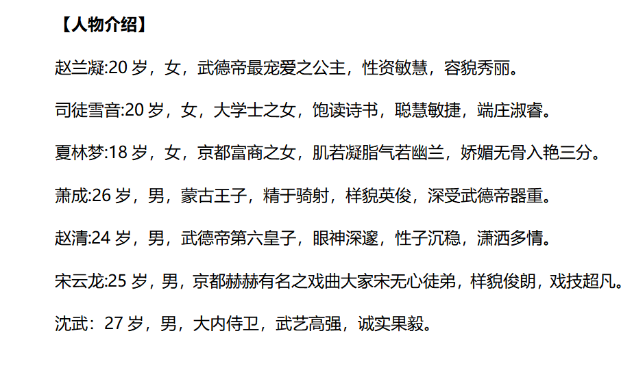
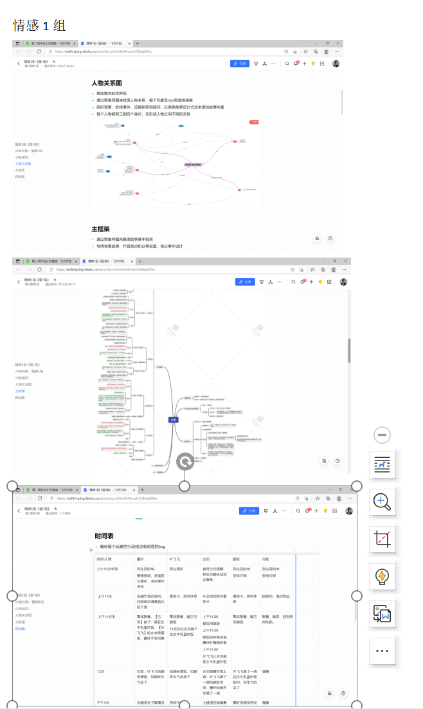

# 0.前言
---
大家好，我是剧本杀作者以及春藤夏院文化传媒 CEO 夏小妖。

近来，不少朋友咨询关于剧本杀的行业现状以及创作方式，在此一篇《剧本杀行业解析以及创作方法论》送上，我会从创作、展会、店家、行业等多维度把我的一些经验分享给大家，希望会有一些帮助。

以下是我为大家准备的【剧本杀行业解析以及创作方法论目录】

> [第一幕：游戏开始--剧本杀行业全貌一览](#jump1)
> 
> [第二幕：揭开剧本杀商业链--神秘面纱](#jump2)
> 
> [第三幕：确认过眼神--切入自己擅长面](#jump3)
> 
> [第四幕：造物之旅--快速构建剧本故事体系](#jump4)
> 
> [第五幕：体量--撑起整个故事的骨架](#jump5)
> 
> [第六幕：诡计之主--核诡](#jump6)
> 
> [第七幕：证据链的闭环--线索的完美](#jump7)
> 
> [第八幕：写作之前--必备小助手](#jump8)
> 
> [第九幕：上帝之手--组织者手册](#jump9)
> 
> [第十幕：填写创作表|立项书--你投稿的敲门砖](#jump10)
> 
> [第十一幕：第一批学员整体作业--框架展示](#jump11)
> 
> [第十二幕：剧本杀行业的核心资源](#jump12)
>
> [第十三幕：开店指南--想开店前你应该知道的数据](#jump13)
> 
> [第十四幕：剧本杀蛋糕--剧本杀这波红利还能火多久](#jump14)
> 
> [第十五幕：第一批学员扶持之路感悟](#jump15)
> 
> [附加幕：书籍与视频推荐](#jump)

# 1.游戏开始--剧本杀行业全貌一览
---
> 数据说话：看懂国内剧本杀行业现状

## 1.1 剧本杀是什么？
---
简单来说，可以将剧本杀理解为一种“解谜” + “追凶”游戏，脱胎于狼人杀和阿瓦隆，可以分为线上和线下两种形式，自《明星大侦探》等综艺节目爆火之后便逐渐在年轻人群体风靡流行起来。

线下剧本杀介绍：“是玩家到实景场馆，体验推理性质的游戏。剧本杀的游戏规则是，玩家先选择人物，阅读人物对应剧本，搜集线索后找出游戏里隐藏的真凶。”

线上剧本杀 APP 则主要以“我是谜”、“百变大侦探”、“剧本杀 APP”、“玩吧 APP”等为主要工具，吸引了不少关注及流量。

详细定义：“剧本杀是一类真人角色扮演游戏。游戏全程以剧本为核心，由 DM（游戏主持人）引导。通常会有一名玩家在其他玩家不知道的情况下扮演凶手，玩家通过多轮搜证、讨论、推理，最终票选出凶手，并破解凶手的作案动机和作案手法，最后由 DM 公布真相。”

所以，剧本杀是一种游戏，我们称之为剧本游戏。

## 1.2 线下娱乐剧本杀之前身--狼人杀
---
伴随着《明星大侦探》等推理综艺走红，近年以密室逃脱、剧本杀为代表的新兴线下娱乐方式逐渐取代 KTV、传统桌游等成为最热门的线下游戏之一。

根据艾瑞咨询，2019 年中国剧本杀市场规模超过百亿元，同比增长 68%，2020 年受疫情影响反而迎来新机遇，市场规模以 7% 的增幅增至 117.4 亿元。目前剧本杀已经形成了一条完整的产业链，剧本创作者、发行方、门店商家、垂直平台等主体的参与将推动行业规模持续扩张。

剧本杀起源于英国的一类真人角色扮演游戏，原型为“谋杀之谜”（Mistery of Murder），一般来说，一场剧本杀的游戏时间在 2-6 小时（也有 8、9 个小时甚至更长时长的剧本），参与人数在 5-10 人不等。

**剧本杀游戏流程**

## 1.3 剧本游戏的定义
---
剧本是——经过精心设计的，有一定文学价值的文化商品，是解决多人娱乐的社交类游戏。

首先我们不把剧本杀的剧本理解为影视剧本，要理解为一个多人参与的游戏。而作为游戏，趣味性就成了非常关键的一个因素。

其次，无论作者创作，还是店家呈现给玩家体验，它作为一种商品，更应该考虑到市场需求。

再次，剧本是一种文学商品，为了受众群体，在题材，难易度，我们都应该为玩家更好的打造。

之前有过一些作品，文学性非常高，导致玩家读不进去，宕机，不可取；也有一些文笔立意很差，最终大跌口碑，也不可取。看完我们这些课程后，大家一定会有更全面的认知。

## 1.4 剧本游戏的关系人以及需求
---
**1. 作者**：

自我需求，就是我们每一个作者的需求，无论为名为利，为赚钱，还是发自内心喜欢，每个人都有自己的考量。

**2. 发行**：

（同上）

**3. 店家**：

盈利，很多年轻老板 95 后，有不少是看到其他店盈利很厉害，也有一些属于个人爱好。既然为了盈利，就有了他的核心需求。

+ 核心需求：可持续盈利
+ 关键词：翻台率、DM

**4. 玩家**：

+ 得到心灵的救赎与启迪
+ 获得他人的认可
+ 亲情友情爱情
+ 社交
+ 体验故事
+ 享受推理
+ 喜欢演戏

而这些需求，并不是看一场电影可以满足。所以剧本杀有了大量市场。

**5. 有关部门**：

传播正能量

**6. 剧本杀术语关键字**：

本格、变革（格）、DM、NPC、OB、菠萝头、天花板、跳车等。

# 2.揭开剧本杀商业链的神秘面纱
---

## 2.1 作者--收入量级在什么水平
---
我们先要分析：

—— 市场上销量最好的本子能卖多少？

孤城 12000 本，你好 7000 本，而这些数据，还在随着新店开业持续上涨。

—— 作者的分成比例大概是多少

从目前市场行情来看，一些发行对于作者还是有些苛刻。而在我们自己的工作室会优先推出各位的优质作品。

**实体剧本收入**

**作者收入以及状态**

1. 线下

+ 剧本分成：

作者与发行按比例分成，较多为刨去成本后五五分成，例如，《你好》作者从该剧本中分润超 150 万。

+ 剧本买断：

发行买断剧本的情况相比之下较少，单个剧本买断价格在 10000 元到 30000 元左右不等

+ 全职工资：

作者坐班创作剧本，收入按工资+提成结算

**可从业人群**

1. 上班族的副业：

上班拿死工资并不是一种很好的状态，大部分人都开始寻找合适的副业，剧本杀就是其中不错的选择，《你好》的作者在本子卖爆后就辞职了。

2. 剧本杀爱好者：

剧本杀几乎 90% 的作者都是由剧本杀玩家转来的，只有爱玩剧本杀的人，才能知道什么样的剧本是受欢迎的。

3. 剧本杀店家：

单个剧本店的业务过于单一，开店的同时开启剧本杀创作业务，在增加收入的同时，能更好利用店里的资源，例如测试资源和发行资源。

4. 网络小说作者：

网文作者有天生的优势，文笔好，知道年轻人喜欢看什么，只需要学习剧本杀故事结构和案件的写作即可很快上手剧本杀的创作。

5. 在校大学生：

在校学生拥有大段的时间，拥有大量贴合剧本杀群体的想法和脑洞，只要稍加学习，自然而然可以成为剧本杀作者，赚取自己的第一桶金。

6. 宝妈的副业：

对于在家带娃的妈妈们，写剧本是个不错的选择，在家里有大段的时间可以安心创作。目前宝妈在剧本杀作者中也占据了不小的比例。

## 2.2 以渠道来区分
---
1. 店家本（B 端本）
2. 玩家本（C 端本）
3. APP 本（C 端本）

## 2.3 发行为何能赚走那么多钱？
---
发行的工作：监制、美术、生产、仓储、发货、营销、售后等。

## 2.4 平台
---
普通盒装本、最大的销售渠道、黑探有品、买本本等小程序，平台会抽取发行公司服务费。

## 2.5 店家
---
以不同类型剧本，赚取玩家体验费

# 3.确认过眼神，切入自己擅长面
---

## 3.1 从剧本游戏的维度上
---
> 环境：实景、桌面

从剧本店环境来看，目前最常规的就是桌面体验，每个店家还有很多不同主题的包间，容纳每一个玩家；

其次是实景，投入较大，适用主题比较局限，玩家体验好，费用高，是比较新的呈现形式；

另外随着 VR 的应用度更广，也出现了比较新型的 VR 实景剧本店，除了玩家的桌子，三面墙会以大屏幕的形式呈现场景，背景音乐，剧情等。

## 3.2 从剧本的内容上
---
从内容上划分，在构建一个剧本杀剧本中，应该具备的内容是：**世界观、故事、手法**。

+ 世界观 - 是指我们为这个剧本设定的世界观。

+ 故事 - 是这场剧本中每个玩家需要扮演的人物，以及他的生平故事，爱恨情仇，性格，动机，大事件。

+ 手法 - 指凶案手法，杀人手法。因为近年来市场上太多三刀两毒的手法，导致众多玩家很排斥。而我们更要用心去构建一个核诡，一个凶案，一个密室，或者一场看似完美的犯罪。

## 3.3 从机制上
---
机制：类别，桌游，团建，仪式及流程——演绎、阅读、搜证、推凶、念白、其他（这些环节都叫做机制）

## 3.4 从发行方式
---
独家 1，城市限定 3，盒装不限制

## 3.5 剧本结构
---
+ B 端剧本：文本（剧本）+ 主持人手册 + 线索 + 其他（道具，音频，信件等）
  
+ C 端剧本：文本（剧本）+ 玩家手册 + 线索 + 其他

## 3.6 剧本设计流程及作用
---
+ 读本：一幕到底和分幕。
+ 搜证：一般三轮，增加进程感。
+ 小剧场：破冰引导沉浸，增加代入感。
+ 复盘：答疑解惑，故事还原，推凶逻辑。
+ 结局：读信，演绎，文字，视频，音频。
+ BGM：为你的剧本挑选一个合适的 BGM。

## 3.7 剧本类型
---
1. 硬核本：本格！新本格！

重在整体故事的核诡设定，以及整篇的叙诡，适合于喜爱侦探小说，悬疑小说的朋友，男性作者居多。

2. 情感本：你给我哭！

重在故事的创作，人物的塑造，带玩家进行一场爱恨情仇，或者爱而不得的剧情，适用于女性作者。

3. 恐怖本：描述性写法？记叙性写法？

通过线下店，实景的设置，以及音乐，道具，配合故事的恐怖情节，达到刺激玩家感官。

4. 机制本：剧本已经不重要了，就是在玩一个有剧情的桌游！

把有意思的桌游合理设计在剧情中，让玩家争夺物品，打斗，提升体验。

5. 阵营本：为达目标不择手段！

适用于二战，谍战，国共交战，以及武林帮派之间的相互拉阵营，满足玩家对于游戏的目标感。

6. 还原本：一觉醒来，啥都不记得！

重在还原故事，人物关系，情感。通常还原作为附属元素较多，单独的还原本很容易让玩家宕机，新手注意避雷。

7. 欢乐本：互撕，互怼，嘴炮大战！

大多数用于同学、同事聚会，或者好友相约，整个体验仿佛进入一部喜剧电影，让人笑声不断。

> 如果后期作者还能创造出更新的玩法也未尝不可。

# 4.造物之旅--快速构建剧本故事体系
---
> 剧本故事体系三要素：人、事、物

## 4.1 事：首先为你的剧本定好基调，整个剧本的故事，也称之为事件
---

### 4.1.1 主事件的构造
---
在剧本初期一定要有主事件构思，如果只是构思人物，很可能在创作后期出现主线不清晰的弊端。主事件是链接剧本立意的灵魂。

举例：《西游记》主线事件-全书主要描写了孙悟空出世及大闹天宫后，遇见了唐僧、猪八戒、沙僧和白龙马，一起西行取经，经历了九九八十一难，最终五圣成真的故事。

立意：这个故事表现要实现一个美好的理想，定会遭遇到许多的困难，而且必须战胜这些困难。

### 4.1.2 支线事件的构造
---
支线事件是为了人物之间互动关联，以及增加体量，耐盘度，趣味性，多重身份的秘密。

《西游记》支线事件：三打白骨精、六耳猕猴、牛魔王、女儿国等。

### 4.1.3 基本事件法模板--每个事件都有三方
---
+ 发起方：主谋，执行者，参与者
+ 目标方：死者，利益受损者
+ 波及方：受到事件后续影响范围波及到的人

## 4.2 人：为你的故事打造性格特色鲜明且受读者喜欢的角色
---

### 4.2.1 人物画像基础模板
---
+ 人物性格：性格特色是否鲜明？
+ 个人背景：成长背景是否符合角色？
+ 成长环境：成长环境带来怎么样的三观以及人物习惯、作风？
+ 个人事件：符合自己身份的事件可以提前安排
+ 与他人事件：与在场玩家、NPC 可以安排一些亲情线、爱情线、友情线、师徒线、兄弟情等。
+ 目标：此人物出场从开始到最后，作者想表达什么？

举例：《西游记》

+ 孙悟空生性聪明、活泼、忠诚、嫉恶如仇，代表了古代中国人善良、正义、不阿的情怀和追求。
+ 唐僧勤敏好学，悟性极高，慈悲心肠，一心向佛，为人诚实善良，也有怯懦的一面。
+ 八戒性格憨厚，力气大，但又好吃懒做，爱占小便宜，贪图女色。
+ 沙和尚（沙僧）为人忠厚老实、任劳任怨。

### 4.2.2 丰满角色小技巧
---
人物抛物线之第一阶段：

1. 大背景，平静的生活：家庭关系，基本状况
2. 关系证明：你和 XX 有什么关系，有什么物件可以证明
3. 人物个性特点：优缺点
4. 奇怪的事：第一阶段不幸之事的铺垫，后续阶段所探寻的真相
5. 生活被打破：亲情，爱情，友情，财富

人物抛物线之第二阶段

1. 建立新关系，他人进入，被动建立
2. 关系证明：你和 XX 有什么关系，有什么物件可以证明
3. 新的短暂平衡的生活
4. 生活再次被打破
5. 寻找第一幕的疑问

人物抛物线之第三阶段

1. 再次建立新关系，自己找寻，主动建立
2. 关系证明：你和 XX 有什么关系，有什么物件可以证明
3. 信物嫁接：因为机缘巧合，关系证明被交换了
4. 重新建立平衡（表面建立）
5. 给其他人造成麻烦
6. 发现需要杀害死者才能真正平衡（动机）

### 4.2.3 如何控制玩家--提高人物在剧本中的可玩性
---
1. 大背景，平静的生活
2. 秘密：3 个核心秘密
3. 疑问：3 个核心疑问
4. 和其他人的关系，如何遇见，具体和他一起做了哪些事，他奇怪的行为（线索的一部分）
5. 你所知的信息：江湖传言，别人的信息

### 4.2.4 疑问和秘密是一对孪生兄弟
---
> 学会在角色中将已知变为未知，那么玩家永远不会掉线，永远需要隐藏和探索。

1. 秘密的类型：

+ 自身秘密：表面 XX 背后 XX
+ 关系秘密：和人 -> 特殊关系 和组织 -> 特殊关系
+ 技能秘密：身怀技能 拥有物品，特殊功效
+ 事迹秘密：你做过了什么事（主导，参与） 你要做什么事（做的准备）
+ 状态秘密：你的情绪，为何高兴，为何痛苦
+ 信息秘密：遇到了 XX（组织） 获知了 XX 信息、拿到 XX 物品

2. 疑问的类型：

+ 自身疑问：我是谁 我从哪里来
+ 关系疑问：XX 和 XX 是什么关系
+ 人物疑问：TA 为什么知道这个信息，怎么知道的
+ 行为疑问：TA 为什么要去干这件事情
+ 身份疑问：这个人从那里来，身世如何，来这儿干嘛
+ 行踪疑问：他不见了，莫名其妙失踪了，去哪里了，干什么去了
+ 地点疑问：地点设定奇怪
+ 物品疑问：你偶然获得，不知道它是干嘛的
+ 事件疑问：
    1. 组织事件：组织行为不符合逻辑
    2. 单点事件：时间，地点，发生了奇怪的事情
+ 其他疑问：
+ 人设疑问：此人笑里藏刀定有诈
+ 信息疑问：此信息和认知不符

## 4.3 物：用于人和事之间的载体，包括服化道、信物、书籍等
---
因不同创作者的需求不同，故不展开。

# 5.体量--撑起整个故事的骨架
---
> 故事设定好之后，需要通过串联故事来丰满体量

**1、通过组织法 – 你身处什么样的组织**

+ 组织目的：为每个组织设置集团宗旨
+ 组织架构：为每个组织设置组织架构
+ 人物关系：边构建组织，边设置关系

**2、通过事件法 – 通过事件作为切入点**

通过背景事件
+ 你的组织概况
+ 你的家庭概况
+ 你的身世

通过参与事情
+ 主导做过哪些不好的事情
+ 你协助参与过哪些事情
+ 你要做哪些事情，做了哪些准备

信息事件
+ 组织事件
+ 他人事件
+ 关系事件

**3、世界观法——如何构建一个宏大的世界观？**

系列本前提：世界观的延续

**4. 反转——屡试不爽的新手神器**

人物+故事的“化学反应”=情理之中，意料之外

# 6.诡计之主--核诡
---
> 本格推理 3 板斧：核心诡计+杀人手法+密室设定

**1、案件四要素**

+ 时间：不在场证明
+ 地点：是否进过案发现场
+ 手法：诡计，凶器
+ 动机：背景故事
+ 核心诡计 ：密室 不在场证明
+ 三刀两毒：每个人都动手了
+ 多个死者：不止一个人杀人了

**2、关于杀人手法**

+ 杀人手法（立即死亡）
+ 杀人手法（延时死亡）
    > 优点：通常让人无法推断作案时间，以制造不在场证明
    > 
    > 缺点：一旦破解，指向性就会非常明显

**3、动机的类型**

+ 杀人取物 ：杀了才能拿到：死者身上的宝物
    > 杀了才会出现：遗产，晋升机会，赏金
+ 报复：伤害感情、伤害肉体、伤害钱财
+ 防止事情发生：死者耍做些不好的事情
+ 灭口：知道秘密

# 7.证据链的闭环--线索的完美
---
> 让你的剧本线索“自己生长”，与玩家共舞：让证据进化为“证据链” ！

## 7.1 线索的作用
---
1、引导玩家还原故事
   
2、揭露人物秘密（有损事件）

实锤线索，让玩家将自己的秘密说出来

例如：隼的身上有一包白色粉末——外面写着：雁落沙——雁落沙是一种毒药…..

3、引导人物信息（无损事件）
   
有些人物生平和故事（可能并非秘密），让他讲出来，需要线索来引导

例如：家仆口供：武夫人曾经生过一个儿子，但后面失踪了（武夫人生子）

4、引导设定
   
世界观设定，没有人知道，需要交代

传闻：朝廷恢复王萧二姓

5、触发剧情，引导疑问

又发现一具尸体

## 7.2 线索的类型
---
1、案发线索

+ 尸体线索——尸体面部黑青，嘴角有血
+ 现场线索——房间有打斗痕迹，地上多种脚印

2、人物线索——小明的左手有些血迹

3、传闻

+ 仆人说
+ 江湖传闻
+ 新闻

## 7.3 评定线索的好坏
---
1. 是否有足够的推理性（设置因果链）
2. 包含不止一个信息（信息轰炸）
3. 表面指A，实际指B（多种可能性）
4. 和其他的线索进行串联

## 7.4 线索设置方法
---
1. 三段论法
2. 排除法
3. 去结构法
4. 前因后果法

# 8.写作之前--必备小助手
---
在动笔写正文之前，你需要做好以下准备，方能减少后期修改成本：（XMIND 思维导图）

**1、事件年表 ：所有玩家以及 NPC 年龄、经历无 bug**

**2、案发时间表 ：案发当日逻辑梳理，确认有无漏洞**

**3、画地图：大脑中构造出地图，方便你给人物安排行为逻辑线**

**4、人物关系图：直观检验人物联动情况**

**5、大事件框架（主框架）**

**6、人物生平框架（主框架）：人物一系列跃然纸上**

**7、玩家作案动机框架（主框架）**

# 9.上帝之手--组织者手册
---
**组织者手册揭秘：组织者即上帝**

优化线索，穿针引线，编写组织者手册！

拿 C 端本简单列举：

1、故事背景

2、人物介绍

3、组织流程-基本可概括为：

1. 阅读背景，甄别性格，挑选角色，代入情境
2. 勘察现场，洞察动机，圆桌推理，梳理线索
3. 阶段推进，剧情讨论，明辨蛛丝，还原凶案
4. 投票环节，找出真凶，公布真相，触发结局

4、复盘（真相）

5、锁凶逻辑

6、结局

以上三条因涉及剧透暂不举例。

# 10.填写创作表
---
> 写给大家：正常对于我们老作者来说，立项其实是第一步。

1. 创作动机：本部分阐述本剧本的创作起点（什么原因决定写这个剧本）、立意或者想达到的剧本目的、本剧本特色和市场优点。
2. 世界观：简单阐述本剧本时代背景、简单故事（不多于 300 字）、人物小传（每个人不多于 100 字）
3. 游戏点：玩家是如何玩这个剧本的（可盘点 玩法机制 小剧场）
4. 如何分幕
5. 特别的机制和玩法
6. 设置反转点
7. 亮点，作品特色

# 11.首批学员作业鉴赏
---
本次 57 名学员分为 9 组，所有人全部完成剧本。（当然剧本还需要细细打磨）

除此之外，恭喜学员还额外创作了10部微剧本，三天之内变现。

# 12.剧本杀行业的核心资源
---

## 12.1 上游：剧本杀作者是关键资源，但人群极度分散且水平良莠不齐
---
剧本杀作者来源主要分为玩家进阶、网文转行、影视编剧，前者是剧本杀的忠实玩家，后两者本身就具备文字功底，加上后期对剧本杀的了解从而转行成剧本杀作者。

目前剧本杀作者创作端，大多数人以兼职为主，少部分头部作者以此为生，另外还有剧本杀创作团队采用共同创作的模式。

根据剧本分发平台“黑探有品”数据，截至 2020 年末全国剧本创作者为 4000-5000 人，人群分布较为分散。

除了原创的剧本杀，也有越来越多 IP 改编成剧本，IP 拥有方将 IP 授权给剧本杀作者或者发行方进行改编创作，并收取一定的授权费用，比如游戏 IP《王者荣耀》、影视 IP《琅琊榜》、网文 IP《鬼吹灯》、电影 IP《唐人街探案》等，这些 IP 授权的剧本大多以限量本的形式出现。

知名 IP 自带流量，有利于扩大剧本杀影响力，是破圈的重要途径。

剧本杀游戏类似电影，属于一次性消费，因此需要上游源源不断的进行内容供给，优质的创作者是产业链稀缺资源，原因在于：

**1、单个创作者的产出有限**。

一个剧本的创作周期根据剧本本身的质量来决定，一般来说盒装本创作周期约 1 个月+测试修改 1 个月，独家本创作周期约 2-3 个月+测试修改 1-2 个月，大部分作者一年只能创作 2-3 部剧本，有些作者甚至一年只能完成一部作品。

**2、创作者水平良莠不齐**。

近两年剧本杀的风靡虽然吸引众多剧本杀作者涌入赛道，但多数的新人作者低估了商业剧本的严格程度，剧本创作本质上是“娱乐内容”的创作，文笔只是基础，还需要好故事、逻辑严谨的人物行为，加上互动性很好的游戏机制才可能使得自己创作的剧本在众多作品中脱颖而出。

## 12.2 中游：剧本杀发行方是产业重要纽带
---
剧本发行方是连接上下游的关键，一方面承担了对剧本的初步筛选职能，另一方面负责剧本的印刷包装及相关道具制作，并向下游进行发售。整体上剧本杀的发行工作内容十分繁杂， 包括剧本初步筛选、剧本测试、与作者修改、包装销售、宣传、售后等众多环节。

剧本发行方多以工作室的形式为主，较为分散。

剧本发行方与作者的合作模式大约分为三种，即**买断、保底加分成、纯分成**。

买断的价格在数千到一两万元不等，分成模式常见于盒装本的创作发售中，即发行方向线下门店每售出一个普通盒装本，剧本杀作者将获得一定的分成，分成比例大概在 2：8 到 4：6 范围内浮动， 一般来说发行方占大头。

剧本的发售渠道上，也分为三种，即剧本杀线下展会、线上销售平台（如“黑探有品”）、朋友圈推广，其中线下展会是主流渠道，为发行方与店面商家提供了线下面对面交易的场所。

展会的主办方一般是全国知名或规模较大的发行工作室，将剧本作为一种展品，展示并销售。

根据剧本杀展会小程序，2020 年全国共举办了 18 场线下剧本杀展会，而截至 2021 年 5 月20 日已举办了 22 场线下展会，预计 2021 年全年举办约 50 多场。

随着行业发展，剧本杀展会从过去一年每个月举办约 1-2 次，到现今的平均一个月举办约 4-5 次，线下展会举办频率的提高也侧面体现了行业正处在高速的发展中。

# 13.开店指南
---
> 例如：160 平方米的桌面剧本杀门店

我们以在一、二、三线城市开设一家 150 平方米的普通桌面剧本杀门店搭建测算模型，可设 4 个推理房间（1 个城限本房间 + 3 个盒装本房间），单个房间约 30 平方米，再加前台吧台 + 等候区约 40 平方米。

**1、收入端**

+ 客流期：一场剧本杀耗时约 3-4 小时，假设一个房间一天最多可开设 3 场（上午、下午、晚上）；

+ 工作日接待场次：假设每天接待 2 场客人，城限本、盒装本各接待 1 场，一年约有 250 天工作日；

+ 周末及节假日接待场次：为客流高峰期，假设一线城市门店每天接待 8 场客人，其中 2 场城限本、6 场盒装本；二、三线城市门店每天接待 6 场客人，其中 2 场城限本、4 场盒装本；一年约有 115 天周末及节假日；

+ 人次及单价：假设每场 6 人，参考美团上的商家定价，假设一、二、三城市的盒装本客单价约为 100/90/60 元，城限本客单价约为 150/120/90 元。

**2、成本与费用端**

+ 装修成本：包括硬装与软装，假设在一、二线城市的前期一次性投入约 6/5/4 万元，分 3 年摊销；

+ 租金水电：剧本杀门店位臵一般在住宅小区、临街商铺、写字楼，参考《2021 年 3 月全国大中城市租金均价报告》，一、二、三线城市月租金分别为 88.2 元/平方米、33.7 元/平方米、26.30 元/平方米；一、二、三线城市门店的水电费用每月约 3000/2500/1500 元；

+ 内容成本：主要为采购剧本内容，假设门店 4 个房间每月各换新一次剧本，每年需要 12 本城限本、36 本盒装本。

> 根据黑探有品，其中盒装本平均价格约 500 元/本，城限本价格约 2000-4000 元/本，假设一线城市门店采购高质量的城限本，平均价格为 3000 元，二线城市门店采购较高质量的城限本 2500 元/本，二线城市门店采购一般质量的城限本 2000 元/本；

+ 人员成本：主要为店员工资，假设门店配备 2 名全职 DM 与 2 名兼职 DM，一、二、三线城市全职 DM 月工资为 8000/5500/4000 元，兼职 DM 月工资为 3000/2500/1500 元；

+ 营销成本：主要为美团服务费，以及在小红书、公众号、微博等社交媒体上的营销推广费用，假设约占销售额的 15%；

+ 其他成本：包括日常消耗品采购、服装道具的采购，假设一、二、三线城市每月5000/4000/3000 元。

综上所述：考虑到整个上中下游资源，关键是地理位置等，有无优势再决定。

# 14.剧本杀蛋糕--剧本杀这波红利还能火多久？
---

## 14.1 行业内现在对剧本杀的态度呈两极分化
---
1. 剧本杀正在挤压电影市场，同样在 2020 年疫情形势下，中国电影市场总规模 204 亿，而剧本杀的规模就达到了 117 亿，剧本杀发展不过 3 年，就成为仅次于看电影和运动的中国人第三大偏好的娱乐方式。

2. 国际上有剧本杀发展的对标物，其实世界上很多国家都流行一种叫做 LARP 实景角色扮演游戏，可以对标美剧的西部世界或者真人版权力的游戏，剧本杀目前在国内刚起步，处于第一版，后期很有可能进阶到 2.0，3.0，未来会怎样，谁也不敢想象。就像十几年前的网购市场一般。

3. VR 技术发展，给剧本杀带来新变革，现在业内已经有 VR 剧本出现，一旦剧本进一步成熟，《西部世界》和《头号玩家》的真人实现不是梦，在这种情况下，男生可以成为康熙，女生可以成为甄嬛，未来实景技术成熟，你是愿意在屏幕看明星演戏，还是愿意享受自己表演？

有传媒研究员给出了未来两千亿体量的想象空间，剧本杀现在所处的阶段像极了 2012 年的中国电影，当时电影的市场规模不过 200 亿，剧本杀被看作是年轻人体验二次人生的一种方式，社交缺乏，剧本杀让你获得归属感，

所以，我认为：剧本杀变现，远不止内容创作！

## 14.2 继续在这个行业捞金，有以下几种姿势
---
1. 站在最上游，创作普通剧本杀剧本；

2. 站在中游，成为发行方；

3. 团队根据企业承接定制款剧本杀作品，以及同名影视剧IP作品（目前正有出版方在与我方接触）

4. 合作各个城市景点，为专属景点根据历史背景、传奇人物缩影打造特色大型剧本杀剧本。

> 通过店家合理分配玩家，玩家凭票进入景区领取自己专属角色。
> + 于店家而言，做到全新化剧本服务；
> + 于玩家而言，除去玩剧本杀，在景点本就除去做任务还可以与情侣、好友游玩；
> + 对景点而言，增进客流量，增加宣传力度，打造不一样的网红打卡地。（目前某古城景点正在接触我方）

5. 根据企业、个人等自身创业故事背景，打造个人剧本，同时将剧本拍摄为微电影以及 MV 片段，用于宣传企业或者打造个人 IP，提升自己价值。

6. 国际剧本杀反向输出业务：近期一年计划初步打通港澳台地区，希望内地作者朋友的作品可销售到国外。目前国内剧本杀行业明显发达于其他国家，而谋杀之谜却是从欧洲传进来。在这方面，我们还有大量空间可以操作。

# 15.扶持学员一路感悟
---
这一个月中，我喜怒哀乐的情绪表达地淋漓尽致，除此之外更多的是感动、开心和焦虑。

这一个月中，我带着大家从起初对剧本杀懵懂，到经历打破自己认知，艰难练习作业，到最终完成了剧本杀剧本的创作。这一路上，感谢团队和学员的执行力和信任。

很多同学说我们认真负责，在我看来，他们对自己也一样认真负责，如果他们没有加班码字到凌晨，我们也不会在凌晨的时候有交流，尤其是看着他们讨论，很多时候我都静静看着不说话。因为有些东西我可以教会大家，有些东西需要大家去实践，去试错。

从刚开始的小作业，我觉得成绩不理想，我经常焦虑，我不知道他们所有人是不是到最后都能写出合格作品，我只有尽力把他们往前推。

在一周小作业之后，我从首日的满意度 20% 增加到 70%，到今天为止，每位学员都做到了，所有人都提交了较为完成的初稿。

其实，我在群里也发过脾气，也凶过一些同学。比如半个月了，有些人依旧没实际用心去体验一下剧本杀，导致对整个流程和认知一知半解，或者还是一问三不知的态度，我当然生气。因为你不花心思去读懂行业，大罗神仙也帮不了你。有些功夫，是需要我们自己下的。

还有，那便是因为说过三次的问题，有些同学依旧不改。大家的时间很宝贵，我的课程一定上给大家输出百度上没有的知识，至于网上可以查到的，我认为大家应该自行解决。这真的是修行靠个人的一个行业。只要花心思，用心去做，写剧本杀作品真的没有你想象的那么难。

想对所有人说的话：

**1. 关于剧本变现问题**：

大家练手可以从微剧本、C 端本练起，C 端合作方式一般都是买断，变现速度较快。

**2. 关于未来想转行专门从事全职作者的问题**：

未来这个行业的路会更广阔，我们工作室@春藤夏院也会签约一部分优秀作者，在签约期内为作者提供良好的服务，包括商业剧本定向，框架把控，测试剧本，监制，发行等一系列帮助。

**3. 关于接下来从合作多项私人定制剧本，比如景区定制本、IP 定制本等**：

作者需求量并未因为作者日益增加而减少，目前依旧是产出速度迭代慢。工作室后续会把重心之一放在景区，企业私人定制项目上，届时，需要更多优秀作者携手同行。

# 附加幕.书籍与视频推荐
---
**书籍**

+ 故事：https://book.douban.com/subject/25976544/
+ 剧本：https://book.douban.com/subject/27026458/
+ 救猫咪：https://book.douban.com/subject/6012933/
+ 千面英雄：https://book.douban.com/subject/26707803/

**视频**

+ 查理的编剧课：https://www.bilibili.com/video/BV1eE411F73t
+ 「讲故事的艺术」尼尔·盖曼大师课：https://www.bilibili.com/video/BV1jE411J7hk
+ 艾伦·索金 编剧课：https://www.bilibili.com/video/BV1sf4y127SK
