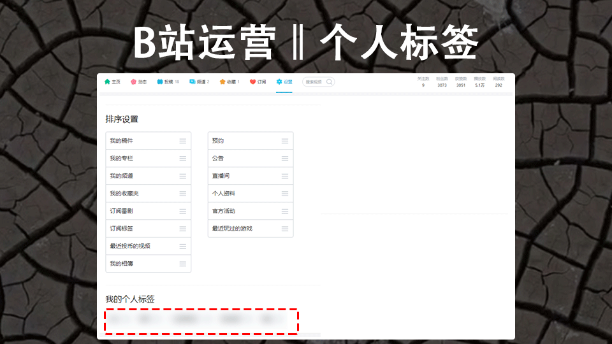
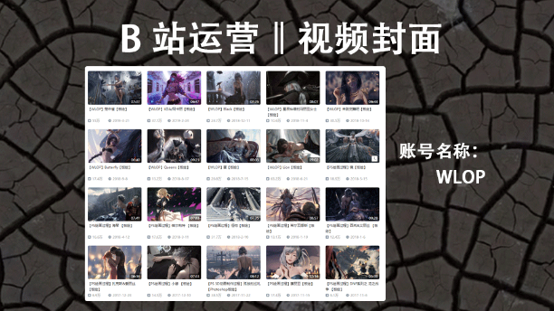
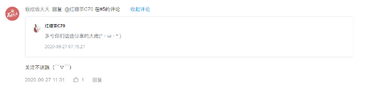
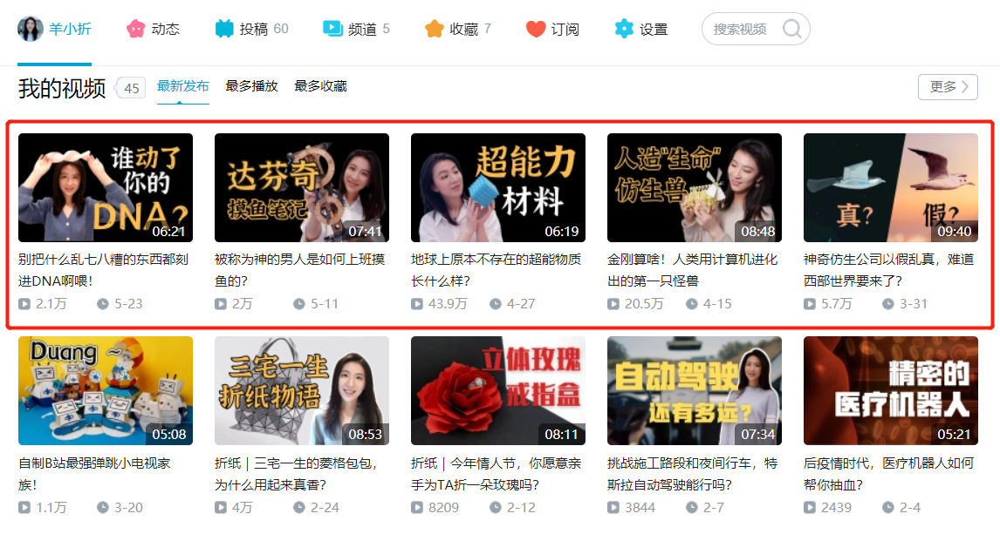
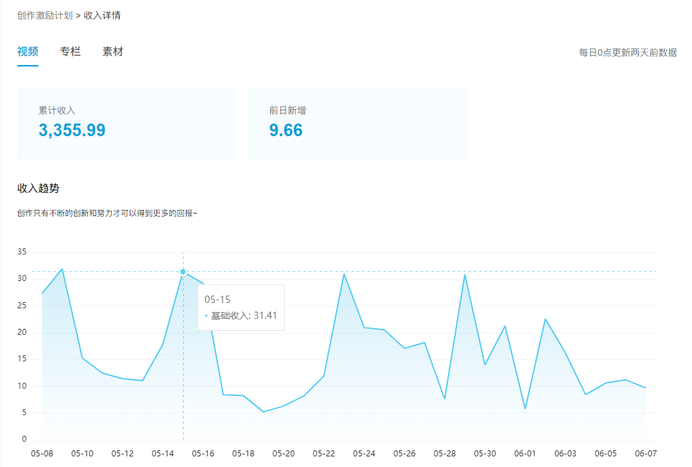

# 0. 目录
---
**[一、为什么现阶段 B 站仍然值得个人和企业入场？](#jump1)**
1. 对于个人来讲
2. 对于企业来讲

**[二、B 站运营的优势在哪里？](#jump2)**
1. 个人品牌建设地
2. 最佳中视频渠道
3. 互联网原生居民
4. 用户的普遍三高
5. 超高的用户粘性

**[三、B 站运营的核心是什么？](#jump3)**
1. 核心：内容为王
2. 有价值的内容娱乐化

**[四、B 站该怎么运营？](#jump4)**
1. 账号的定位
2. 基本信息的完善
3. 视频三要素
4. 视频的发布事项
5. 如何制作视频内容
6. B 站涨粉小技巧
7. 引流技巧
8. 总结

**[五、播放 40w 涨粉 2w 爆款视频的诞生案例](#jump5)**
1. 封面是爆款视频初始流量的关键
2. 做更加贴近大众的内容

**[六、做精品视频内容初期需要哪些准备](#jump6)**
1. 思维：写脚本而非文案
2. 内容：大纲制作重要次序
3. 理论：HKRR

**[七、做不出爆款视频时，该如何通过数据来迭代视频质量？](#jump7)**
1. 通过留存率迭代开头与高潮
2. 通过涨粉率确定视频的质量

**[八、B 站怎么变现？](#jump8)**
1. 粉丝充电
2. 品牌推广合作
3. B 站的创作激励
4. 引流到微信变现
5. 悬赏计划
6. 课程收入

**[九、对内容、平台及影响力建设的思考](#jump9)**
1. 辰之对内容、平台及影响力建设的思考
2. 阿峰的 B 站运营感悟

# 1. 为什么现阶段 B 站仍然值得个人和企业入场？
---
在正式进入主题前，想先给不了解 B 站的朋友分享一下为啥 B 站值得去关注。

2020 年初至今，B 站的市值翻了五倍有余，2020 年《后浪 1.0》不断破圈，引起了很多人的关注，很多人说看不明白。

凭借着用爱发电，净利润仍是赤字， B 站凭什么还能保持运营数据高速增长，取得月活突破 2 亿，用户日均视频播放量达到创纪录的 13 亿的成绩？

很多媒体人、运营人或创业者在分析这些看不明白的事时，都不约而同地提到了一点，B 站真正抓住了年轻人的需求。

而「得年轻人得天下」，几乎成为了所有企业的战略发展共识。

## 1.1 对于个人来讲
---
特别是会写文章，常年深耕在图文领域的作者，应该发现以公众号为代表的图文领域，越来越难以获得流量。

很多新媒体创作者都在诉苦，现在的公众号真的是越来越难做了，甚至新媒体圈普遍存在“图文时代过去了”的言论。

我个人认为，好的图文内容肯定依然具备着长期价值，但毋庸置疑的是视频赛道相对会更容易吸引用户注意力，更容易获取流量增长。

特别是短视频，一个十几秒的短视频就能获得千万播放的案例屡见不鲜，一夜吸粉百万好像也不是什么难事。

但以抖音为代表的短视频赛道，同质化非常严重，流行的雷同翻拍，极易引起用户的审美疲劳。很多人可以靠着一条视频迅速蹿红，但接下来的点击量却惨不忍睹，这对于个人 IP 的打造和长期影响力的建设非常不利。

短视频从过短的表达形式上就决定了，它不可能展示出更多的信息，也不可能完整表达一个观点。它只能靠着搞怪、夸张，甚至是一惊一乍来迅速吸引观众的眼球。

所以，抖音上能火起来的短视频内容形式不多，这也是很多人在短视频火起来后，开始直播做电商，或引流公众号变现等其他商业模式的原因。

相比短视频，中长视频就能表达出更多的信息量和更完整的观点，通过这种表达形式吸引来的粉丝就具备着，更稳定不易流失、忠诚度更高等特点。

这就意味着越早做中长视频，未来更好变现，并且根据网络效应，随着用户数量增加，产出投入比会越来越高。

这也是为什么，何同学 5G 视频爆火破圈后，你能在微博上看到他与苹果 CEO 库克谈笑风生。王冰冰B 站一期视频播放量千万，一夜时间涨粉百万，央视成功找到播放密码。罗翔本是大学教授刑法老师，却成功破圈到以年轻人为主的 B 站，获粉千万。

所以，真正把内容做好，建立长期的影响力，做高质量的干货才是一位创作者应该去长期思考的事情。

## 1.2 对于企业来说
---
去年 7 月腾讯大战老干妈的瓜让大家吃得不亦乐乎，眼看南山必胜客要败倒在国民女神的辣酱下，没想到鹅厂在 B 站来了波神级公关，成功把自己塑造成“傻白甜”形象，挽回了一点口碑。

虽然网友们还是不买账，编出了“逗鹅冤”等新词加大力度嘲笑鹅厂，许多大厂也跟着蹭热度凑热闹。

但腾讯的这次公关，却无意验证了 B 站已经可以成为一个品牌做公众沟通的阵地这件事，同时 B 站也成为了最高受益者。

同样去年上半年，受疫情影响，许多学生党不得不使用阿里旗下的钉钉软件在线学习，因此也出现了大量对钉钉恶意的一星评价。

但钉钉却在 B 站喊出了五星好评一次付清的口号，用求饶的方式，缓和了自己与用户之间的关系。随后钉钉不仅拉回了软件评分，也创下连续 30 天霸榜 Apple store 第一的成绩。

回顾这两家大厂的两次事件，我们会发现它们有一个共同点：事件都是在微博上兴起的，但是事情的高潮和转折部分却是在 B 站。

如果一个案例还能说是个例，那两个顶级大厂在面对负面危机时，共同选择在 B 站用自嘲和娱乐化的方式来扭转局面，就足以说明一个问题，B 站有能力让更多人看到各个品牌的魅力，而如今的话语权会更多地掌握在更年轻的用户身上。

反过来这也给用户传递了一个信号，原来 B 站也能发展社会热点，原来 B 站也有这么多好笑的舆情讨论，显然 B 站已经慢慢具备着强大的舆情能力。

在品牌方看来，全民讨论的公关热点和品牌互动很明显从微博慢慢转移到了 B 站，它不仅具备着巨大的商业价值，也俨然将成为品牌公关的高地。

所以，不论是个人还是企业，哪怕不去做 B 站，也要多去了解这个年轻人的聚集地。

# 2. B站运营的优势在哪里？
---

## 2.1 个人品牌建设地
---
在过去年的 2020 年，众多 UP 成功在 B 站打响自己的个人品牌。

比如我们熟知的：罗翔老师，半佛老师，冲浪普拉斯大佬，牛顿顿顿大佬，阿扶老师，统一的奸商之路，等等等。

要记住这些众多 UP 都是在 2020 年脱颖而出新晋升的 UP。他们用了一年的时间，成功的打响个人品牌，拿下来这样的成就。圈友就有提到一句话：你的个人品牌价值千万。

这些人虽然仅用了一年。但是他们有着足够的积累，厚积而薄发。在这个“薄发”过程中他们影响力的增加，这也代表作收入的增加，这是成正比的。

> 罗翔老师：B站的贝壳收入25W

## 2.2 最佳中视频渠道
---
资讯：爱奇艺，优酷，腾讯，在前不久就联合起来抵制B站。同时大力鼓励平台用户进行内容创作。

**毒眸**：https://mp.weixin.qq.com/s/fYmlSUySSCndMGMmp_0sDg

资讯：头条系，抖音为主，快手等众多短视频渠道，开始大力发展长视频。比如现在你打开抖音搜索中视频计划。

**新榜**：https://mp.weixin.qq.com/s/y9uo0uCEUhCDyq7UsGMM0g

资讯：知乎，微信，微博等渠道的视频依旧是慢跑趋势。知识，社交，娱乐三大不同属性的平台也开始加入视频红利。

**Tech星球**：https://mp.weixin.qq.com/s/cGdl2VR9SlFXeuZTFunrrg

资讯：B站在这么多视频以中视频发展独占头筹，比如去年知识区的突飞猛进，以及B站的成功上市，年会等操作。

**36氪**：https://mp.weixin.qq.com/s/RcY06x002Fr7rgvXclR6OA

以上的这些资讯是我在互联网冲浪看见的，这些都在告诉我们：各大平台开始抢滩中视频的发展，因为平台增长受阻。想要平台获得第二曲线增长，那么以中视频为主的第二曲线增长，这是他们主要的方向之一。与此同时，B 站也在 2020 年涌入了大规模的知识区 UP，红利在向我们招手。

## 2.3 互联网原生居民
---
B 站的用户人群主要以 90 后和 00 后为主，这个年度区间出生的人群，被称呼为 Z 时代，包括我自己，我们一出生就接触到了高度互联网时代，即时通讯，智能手机，平板电脑等科技产品，各种眼花缭乱的 APP。作为深度的互联网体验者，这群人数量庞大。

与此同时，国家的三胎政策开放，与之对应的还有 5G 的发展，这些都可以很好的为 B 站提供庞大的用户基数以及便利的条件。

## 2.4 用户的普遍三高
---
B站的用户人群“三高”

1、收入高：B站主要的用户群体为Z时代，而这群Z时代的用户群体可月均支配收入高达3501，

2、学历高：学历高于其他平台的百分之10，有高度认知的青年都在集结在B站，抱团取暖

3、消费高：在用户的地域分布上面，均分布在一线二线城市，大多为沿海城市，其个人消费水平高。

## 2.5 超高的用户粘性
---

除开短视频中的快手，B 站的用户粘性超高当仁不让，独有的社区文化，泛娱乐的内容，ACG 内容话题焦点，优质 UP 的内容输出，以弹幕打造出的精神纽带，这些一步一步加深着这个用户人群的认同感。

与之对应是粉丝的消费抉择。用爱发电，支持恰饭行为，以及内容付费倾向，也在同步回馈给 UP 主。这样的用户群里，链接 1000 个核心粉丝变的不是那么难。

# 3. B站运营的核心是什么？
---

## 3.1 核心：内容为王
---
2018年的我开始了长视频的制作。在内容上它不同于短视频，三十秒就结束了一切，中视频的制作需要具备比较强大的知识储备。不管是知识方面还是其他方面，这点可以在罗老师和半佛老师身上看到。

在没来到b站之前，他们有着丰富的知识体系和还有着对事物的洞察，即使不来B站他们也依然会发出耀眼的光芒。正因为这些量的积累，才有了质的变化。他们能一举突破百万粉丝的原因就在于此。

同时，没有实质性让用户觉得有料，有价值，有趣的内容，那么这样的内容直接会慢慢的出局。在内容上的不足，会直接决定这个账号是否能够获得更大的收益。

我操盘的一些账号，内容主理人他们有着五年以上的授课经验，十多年的绘画经验，这不仅仅是绘画技术层面的经验，更多的是洞察用户的需求，到巧妙引导用户的心理。他们知晓沟通和销售的艺术。能懂技术，但是不知道怎么来组织语言来传播的人，这样人群挺多的。

## 3.2 有价值的内容娱乐化
---
以前我接触过很多合作对象，比如一些美院的毕业生，他们作为绘画上面的顶尖选手，有着足够的绘画经验，但是他却不知道如何来传播，不知道怎么和用户进行有效的互动，也不知道用什么样的比喻来凝结课堂的氛围等。

如果有做过老师圈友可以很好的理解。作为知识的传播者，最大目的并非增进知识，而是增进行动。更多是和我们的内容能够建立对他人的兴趣之上，和他们成为“一伙人”。因为我们看的是视频，其意义千万不要与看书划上等号。

总结一下：B 站是以内容为核心，有价值的内容娱乐化才是内容最佳的选择方式。需要具备比较强的专业能力和知识储备，同时需要懂用户。

# 4. B站该怎么运营？
---
十万的账号，三十五万的账号都是需要时间堆积起来的，为了能让大家看到一些可以被操作的空间，和一些引流效果，我用这个账号来举个例子：

这个账号到今天还有5454

引流效果如图

月度涨粉6000

涨粉过程

与粉丝的对话过程

一个月就可以做到6000粉丝的小号，你也可以，相信自己。

说了这么多。我也要开始了真正的主题，**B站怎么运营**？

## 4.1 账号定位
---
B站在2020年有一个很响亮的口号：万物皆可B站。找到合适的赛道，进行深耕，是可以挣到钱的。每个人都有自己的特点和长处，任何一个长处和特点都可以挣钱。

如何找到个人定位？

+ 找到自己擅长的
+ 在擅长的里面找到自己喜欢的
+ 在喜欢的里面找到能坚持的
+ 在能坚持的里找到能变现的

通过这样的方式来找到自己的定位，找到一条合适的赛道，先去做，做到五十分，然后快速的来迭代自己的内容，不要想太多。随之公众注意力的增加，你会有钱的。

找到自己的赛道，持续的发展。相比之下，我就比较幸运，没有很多可以思考的定位。

## 4.2 基本信息的完善
---
1、手机端包装

在B站运营账号时，需要针对账号信息做一个基础完善，这是手机版本的看到的账户信息情况。

**【昵称】**

昵称作为一个人物IP的重要核心指标之一，长期发展的必要元素。

第一种就是个性化名字
+ 所长林超
+ 老番茄
+ 冲浪普拉斯
+ 三十六贱笑

第二种就是行业化名字
+ 科技狐
+ 罗翔说刑法

可以在名字上面卡一些关键字来获取用户注意。比如科技，职场，画画等等都可以用到，同时建议取一个不容易撞衫而且能够具备传播的名字。

记住：好的名字价值百万，在传播的过程中，一个好的名字可以增加传播力度。

**【头像】**

头像在B站绘画区分为四类：真人头像，个人IP手绘，表情包，字符图形logo。

**【简介】**

简介上面的构成

**通用：人物背书+价值提供+VX引导**

人物背书主要以成就为主，比如我是谁。我能提供什么然后引导关注为主，同时需要引导微信

举个例子

*一个梦想当导演的旅行Up主。不定时更新旅行短片、干货分享、情侣日常。合作请私信联系并备注来意（粉丝群：11111111）*

如果需要导流到其他平台打造多平台势能结构，可以试这种

**科技狐，让科技简单点。微信公众号：科技狐；合作微信：11111111。**

如果需要引流营销一些，比如我的

**加到Vx:1111111，资料和交流可以给到姥爷们，对哦下面的板绘基础套餐以及送达，请注意查收，不要忘记三连/狗头**

如果沙雕一点

**看见这句就点个关注吧。各平台同名。商务合作请私信。小号: 交流Q群111111111**

总结：多去看看别人是怎么写，有梗而且不失引导的作用。

**【头图】**

我还是以我所在的领域为例子，你们可以类比，同时也可以常考

1. 网页端

2. 手机端

以上为B站账号的头图，对于引导用户关注，头图就是一个利器。这个头图是需要**开个B站大会员**才能进行使用的，如果账号需要持续进行运营，开个年费会员有必要。

头图内容可以为**搞笑段子来吸引注意力**

比如

+ 我的暗示还不够明显吗？
+ 你又偷偷来看我的视频？
+ 你是不是又来白嫖了？

同时也可以为个人品牌标语
+ 设置一张头图在头图里面注明引流信息
+ 尺寸大小：2048x320

2、网页端包装

**【公告栏】**
+ 公告栏字数：150字以内，相当于简介的延续
+ 可以延续用：人物背书+价值提供+VX引导
+ 引导可多平台互通导流，提升个人影响力

**【个人代表作】**
+ 个人代表作分为：粉丝可见/新访客可见
+ 这里需要说明一下：新访客需要看到什么？粉丝需要看到什么？做好分类，那么就可以很好的利用这个代表作
+ 粉丝可见：粉丝可见内容只有一个内容选择，内容可为最近发布的内容，同时最近有潜力的内容。引导粉丝进行点击，提升固有单篇内容的增长。
+ 新访客可见：新访客可见内容为三个内容选择，那么这三个内容我大多设置为自己播放最佳的三条内容，加强个人账号在用户心中的影响力。偶尔更具内容调整为潜力内容

**【个人标签】**

个人标签是在电脑端的设置页面可找到该功能，手机端是看不到的。该标签是个人对自己的定位描述，有五个可以描述的词汇。

主要用户系统给我们原创视频制作者的定位

比如一般有画师，插画，原画师，人体绘制，等关键词来卡系统的词汇库，使得系统对我们内容进行有效定位，将视频来推荐合适的用户人群。

**【隐私设置】**

每个账号都有一些内容是不需要提供给用户看到的。比如**关注列表，收藏列表，个人订阅，最近投币内容**不宜公开，会为他人的视频或账号进行导流，同时如果没有屏蔽，会导致我们的所有账号被竞品对象所了解和分析，以及对用户群体的信任度降低。

同时，需要打开的就是：
+ 订阅番剧，玩过的游戏，个人资料，投稿中展示直播回放

目的：
1. 拉近与用户之间的距离，让其粉丝看到更多相同属性
2. 帮助平台做内容宣传，宣传B站业务是为了互相成就，比如游戏，番剧都是平台的业务的一部分。

## 4.3 视频三要素
---

可以看一下我之前做的封面和写下的标题，然后思考一下。

1、首页封面

**封面大小**：
+ 1196*747

**封面特征**：
+ 样式统一：封面格调统一
+ 文字数量：字体大小需要能在手机端能够清楚的显示，一般为4到8个字
+ 传递信息：图片和文字对视频内容进行一定的诠释
+ 引导好奇：封面文案需要提高好奇，以吸引为主，提高用户对你视频的关注
+ 引起思考：其次也可以加入一些有深度思考的问题
+ 色彩突出：B站的封面大部分色彩都很突出

**封面误区**：
+ 频繁更换封面样式：跟风追逐其他up的封面追逐播放效果。
+ B站的封面就是字大：字大只是一个特征，不是所有人都适合这个特征。
+ 注重封面不注重内容：视频播放一般般，封面却花里胡哨。
+ 封面底部不要添加文字：5/1处不要加字首页显示会被挡住
+ 四周不要加全纯色边框：影响视觉体验，上下边框就好
+ 封面的画面色彩不突出：不能被有效的识别

**重点**：每个人都有透过封面的特征来展示属于自己的视频内容。而正是这种特征，才占领了用户心智，从而得到了传播。是这样的过程。

**封面制作**：
+ 制作工具：PS
+ 重点：固定样式模板一直执行下去

举个例子：封面上面配上视频内容截图，或者配人物夸张的表情、加上突出一点的色彩以及对文字的形容。

比如:

用持续的输出和持续的封面来影响，来聚焦用户。打造个人品牌IP形象。

**色彩搭配**：
+ 在B站的很多UP主的视频封面都是色彩鲜明，他们以**对比鲜艳的色彩为主，聚焦用户注意力**，成为站内比较统一的一种模式

这里有一些常用色彩搭配，统一品牌色调，很有必要

你需要考虑一下色彩搭配很有必要，我举个例子：同样是四个字，那么那个更突出一点？

黑白对比强烈，黄白弱化了我们的视觉体验。这就是色彩搭配的作用，在固定的小区域面展现面积里面帮助，我们更好的在用户推荐栏里面获得用户注意力，获取流量。

**色彩搭配建议**：
+ 举个例子，你看到这里数据，推出，看看你的手机app都是什么样子的色彩搭配即可
红白，蓝白，黄黑，橙白、、、
+ 截个图，吸个色，那么你就会色彩搭配了，而且还是用的百万设计师的设计理念。用这样的色彩搭配可以更好的突出色彩，在用户列表中，这样的形式更为突出，比如罗老师的视频封面。

百分之80的用户是通过手机来进行视频浏览，在固定的B站推荐栏窗口，色彩搭配是一门值得思考的学问。不是什么色彩都能在用户推荐栏里面脱颖而出的，但是能脱颖而出的都是上层佳作。

截个图，举个例子：

**制作技巧**：
+ 尽可能的缩小去看自己的封面，看在一定的范围内，自己能不能有效的辨识清楚

2、视频标题

**标题的作用**：
+ 介绍视频内容
+ 引导用户点赞关注
+ 引起评论转发
+ 传递价值观和态度
+ 便于用户搜索可见

推荐标题：
+ 在B站官方的推荐下，我们一般会得到官方给到的合适模板，这样的模板是存在一定的好处的。

比如我以我所在的领域，绘画为例子；

常见的绘画种类有哪些呢？比如
+ 【板绘】
+ 【手绘】
+ 【画画】
+ 【厚涂】

这些都是热门的绘画种类，视频投进去了，会获得比较高的浏览量，同时也方便于用户搜索和浏览，这些种类是是来源于分区门户中，细分赛道上面的类目区分，同时这也是分区顶流区域

前面写完之后绘画种类后，后面需要接上对内容的大致描述。记住这些标题是我们在搜索内容的时候才出现的，有些人的账号以自己名字为例，那也可以，但是我不会这样做，因为我知道，没有人会在B站搜索我的名字。

**取标题技巧**：

取标题是需要技巧的，如何有效的传递内容，将内容有效传递和包含趣味性，能聚焦用户的眼球呢？这里有一些取标题的技巧，可以看一下，尝试的写了，才有优化的空间

同时又一个很重要的点就是--**B站的SEO原则**

**关键词（长尾流量）**：围绕用户的关键词堆积长尾词汇。了解用户的搜索习惯，收集关键词来堆砌在标题里面可以很好的利用好搜索引擎提升流量。

比如常见的有教程，示范，方法，讲解等，举个例子，比如我在百度上面搜索人体动态示范

你会发现我们的词汇比较固定化，只有固定搜索，才可能被看见，但是做好优化后，这样的内容堆砌在互联网上面会提供一定的长尾流量，同时B站视频的权重在百度上也是比较重要的一个赛道。我们都是凡人，但是随着量的积累，我们会有质的突破。

**用户场景**：在不知道固定绘画知识的时候，用户会在百度里面输入关键词汇，在搜索栏查找相关内容进行学习，而我们本来就是绘画区域以知识讲解为主的硬核型UP，一些关键词的的堆砌会使得我们账号被大量的用户搜索到。

**作用**：如果我们的关键字堆砌的足够，使用不同的内容堆砌很多细分领域。那么持续的内容输出会在互联网上堆砌行业壁垒，当用户进行持续的平台铺光可以在后期实现很好的业务增长。

3、视频简介

**简介引导**：

视频简介的简介是对内容的具体描述，同时简介里面做出有效引导，是很有必要的
+ 引导互动：….不懂得同学可以留言评论哦
+ 引导三连：….希望大伙能来个三连支持一下
+ 引导问题：….你是不是觉得有点不对劲？

透过用户在评论区的留言可以很好的提升我们的评论数量，提高视频热度。同时在算法里面可与看到视频的评论是可以很好的提高视频权重的，这意味着评论的引导可以使我们账号获得更多的推荐，从而实现引流效果。

**简介模板**：
其实我也不会写我不会写剪辑模板，但是我通过观察优秀的同行，然后对其内容进行分析，得出了一些优秀模板举个例子：

通过观察优秀的绘画区UP，看到了各种各样的视频简介

**账号：WLOP**

当月创作的4k/8k高清壁纸，PSD源文件，高清原速作画视频赞助后可获得：https://azz.net/wlop

过往的作品可以在https://wlop.huotan.com/ 单张购买。

除上述网站，其它任何壁纸网站上我的作品均为盗版，切勿购买。

感谢所有赞助者的支持

总结：以引导赞助为主，同时引导作品购买。内容为固定模板，复制粘贴即可，建议不可取。我们本身非知名画师。受众少。

**账号：画师萌**

关注我萌的微信公众号【画师萌】，会同步更新绘画教程内容哒~

BGM：皇家萌卫 作者大大：灵空GTech B站主页→https://space.bilibili.com/2838886

总结：以引导关注微信公众号为主，同时同步教程在公众号上，来搭建私域流量。账号主题机构为绘伴。思考：没有有效的利用钩子，未做好引导性工作。

**账号：沙包_Chilli**

零基础？想画画？有瓶颈？喜欢画小姐姐？想画本子？

都没问题，这个系列视频帮助你从入门走到入土，看完你一定会有收获的。

本期我们补充透视最后一块碎片，曲面透视，请确保之前的两期透视你能理解了之后再观看本期视频会有助于理解内容。

总结：该UP是一个小有名气的绘画UP,简介内容多为个人简介内容主要为：视频内容的扩展和延伸，同时在这个过程中会引导用户去观看其他视频，提高视频内容热度

> 重点来了

**账号：抖抖村**

喜欢画画的村民们有没有这样的循环：看了一些绘画干货，总结了一些大佬画风、画法，然后自己一动手……画出来个寂寞……抖叽~

每个人都该懂点绘画设计常识，欢迎加入我们有爱的大村子。各平台搜索：抖抖村

目前还有空位的抖村群：11111111111

总结：以群号为主的内容为引导动作，该账号简介内容主要分为两段，前面为视频内容介绍，后面为私域引导，后面的引导内容是固定引导内容，同时该方法和动作是目前来说最佳的简介模板。

4、视频发布事项

+ 视频分区

**【生活-绘画】**

绘画是在生活区中的小分支。记得找到自己需要投的固定分区。

+ 转载/自制

**【自制】**

我们的视频都是自制的，所以投自制，后续会有激励计划等，都是可以参与的。

+ 视频标签

**标签的选择**

在我们选择视频上传完毕之后，选择好分区写上标题了，视频标签栏这里会提示我们可以为视频打上10个标签。

首先标签的会由不怎么智能的B站后台系统提供20个推荐标签。而这个标签基于你视频的名字以及内容，系统会做一个大致的区分。然后选择发布视频的时候，基本上很多人都会选择这么几个标签，选择发布。

**标签的作用**

每一个视频的标签都会影响一定的播放，每一个标签后面都对应着一定数量的人群，打错了，那么内容的有效分发就会少了一些，换个角度去理解，就是一些人接收不到你的视频内容。只有在正确的分区和频道上，那么每一个标签你需要精准把握，你才能获取更多的播放，记得你要打10个。

**标签的意义**

如果不懂标签是什么？我这里可以用个人认知来跟你科普一下，什么是标签？如果频道是省份，那么频道下面的分区就是市区，而标签就是街道，我们发布的视频就是居民，记住标签是街道

那么怎么打标签呢？

**标签打法**

明确到了固定分区之后，那么接下来的标签就比较简单
+ 3到6个大标签
+ 2到5个中标签
+ 1到4个小标签

根据视频内容不同我一般选择的分区标签为

+ 3个大标签+5个中标签+2个小标签
+ 4个大标签+4个中标签+2个小标签（最佳）
+ 5个大标签+3个中标签+2个小标签
+ 6个大标签+2个中标签+2个小标签

1. **大标签是什么**？是分区顶流频道，标签订阅人数是远超其他标签。

2. **中标签是什么**？是我观察同类视频和根据视频标签统计每个标签的订阅人数得出来的一个排序，选择内容适合的标签打上。

3. **小标签是什么**？小标签为其他标签，更具内容可以随便挑选，但是最好是注意一下，同时也可以埋下一点点梗。

我以绘画区的标签统计为例子：绘画区标签数据统计-5月20日止

当你把常用的标签用一个文档统计出来后，做到一个基本的标签积累，以后上传视频的时候，把这个文档看一看，那么你就很清楚自己需要打什么标签了。同时打标签的时候可以进行A/B测试，选择出合适的标签内容，可以有利于视频脱颖而出。

**标签误区**

标签虽好，可不要贪多。适合你的内容，才需要被打上。切勿张冠李戴。

+ B 站活动

填写完标签之后下面就会有活动可以参与。

B站的活动要不要参与，怎么参与?

其实每个活动都是对B站内容的建设，符合主题的内容都会给到一定的浏览同时也会有现金激励，如果主题符合就可以选择参与，同时很多活动都是B站热门的活动，有一定的产于意义。

+ 设置选项

1. 自制声明：自制
2. 视频水印：右上方
3. 商业推广：不含商业推广（插片小广告）

4. 充电计划：开启充电计划，其余选项不动即可。

+ 粉丝动态

粉丝动态其实是你在发布视频的时候，会进入个人动态里面，这时候可以附带一段话进行传播，浏览UP主动态，就会看见与之对应的视频动态内容，可以按照简介区内容进行复制。同时记得打上标签，或许会增加浏览量。

+ 发布时间

通过观察作品的发布视频稿件的发布数据和视频播放的数据来分析：

2021年5月19日绘画去视频播放增长数据情况

视频发布：主要集中在11点以后到24点，其中主要的真正区间在12点以和24点

2021年5月19日绘画去视频发布时间数据情况

视频播放量增长：在12点和18后为大波幅的增长

2021年5月10-16日周度视频增长播放增长情况

周度视频稿件：周五后会迎来一波比较大的增长，同时周三的播放是比较差的

> 总结:
>
> 该视频发布规律符合我们正常的作息时间规律，同时也符合一般视频渠道的情况。
>
> 视频稿件发布为：周五11点（最佳）
> 
> 动态稿件发布为：周二以及周四

5、如何制作视频内容

+ 内容选题

内容作为B站的核心，什么样的内容能被大家所喜欢呢？

> **有情**
> 
> **有料**
> 
> **有趣**

内容能覆盖受众人群，其次能有很大的情感共鸣以及存在着一定价值的视频内容，就可以很好的被用户接受。

一个好的视频从一个好的选题开始，那么如何找选题呢，我们可以去各种平台上找，最直接的就是B站，可以找我们的竞品账号，我的同行一些优秀的视频去改编，修改成差不多的内容，因为这是经过市场验证的，是受到大家认可的内容。

其次，抖音、知乎、微博、快手、小红书、头条等这些其他平台上找到相应的内容，互联网上最不缺就是知识，但缺的是整合知识的能力和优秀内容。只要你能够把知识整合起来，能够用自己的方式去搭建，去传播即可。

选题还可以从同行的评论中挖掘，因为很多用户都需要这个内容。

在我们运营了一段时间，有了一定粉丝基础的时候，记得多挖掘粉丝们的需求，根据实际情况来综合制作。引导他们的需求，这是我一直都在进行的事情，因为作为用户的他们，我的大部分内容是建立于他们之上。他们喜欢的内容才是我需要做的内容，有时候不知道选择怎么做内容的适合，可以给到他们选择，在动态里面设置投票，让粉丝来决定。这个过程可以增加用户粘性和用户的参与感。

总结：很多选题我们需要辩证的去看，确实很多东西都可以做成视频，但是哪一种合适我们，哪一种可操作，哪一种效果最好，才是我们需要做的，同时在满足用户而不依赖用户。

+ 内容制作

**第一套内容制作模板**：

该内容模板以硬核教学为主！！！

**开头**：

用AE制作固定片头作为个人品牌展示

片头下载网站：https://www.newcger.com/aemoban/list_1.html?t2=35

如果不会制作，可以去淘宝。

**主题引导**：

用问句或者固定现象来引导和聚焦用户主题内容进行有效的引导和聚焦。

举个例子：
+ 李自然说
+ 冲浪普拉斯

**口号**：

自己的slgan，然后放出自己的私域引导tips（提示），比如本期内容可以关注微信公众号的获得**，导流到私域平台。

**内容**：

以一二三等观点有序的的进行排列，内容的具体展示是为了解决用户的问题，一点要围绕主题做有效的文案撰写，同时需要搭配内容，在观点结束前，进行内容转场。一定要注意内容引导，比如：

引导弹幕，引导评论，引导关注，引导三连，皆可

**内容总结**：

最后再次引导三连个关注，对下期内容制造用户预期，同时可以引导私域流量搭建，比如：将b站平台的用户，引导在公众号以及私人微信号

**总结**：

一、模板可以被迭代，内容剧情可以起伏有变化，打破用户预期和创造用户预期。同时每一次的视频都是一次新的机会。提高信息密度，减少用户认知难度，这是很容易被操作的。写好文案策划即可。不懂就多写。

二、在b站很多人大多IP都是真人出境，这样的过程可以很好的建立信任度。但是你觉得自己不能胜任出境，那么表情包+字幕+文案，或者视频剪辑+文案。可以参考冲浪普拉斯，半佛老师，之所以能吸引用户，“华丽的词藻”功不可没。能把一个故事写好，能把一段话传递给用户，“真的很难”。

三、视频制作之后自己换位思考一下，作为当代青年，以“阅片无数”的方式，以用户的角度，去看这个视频。

+ 内容是否传递出我的核心主题？
+ 画面是否清晰，声音是否清楚，有无噪音？
+ 内容转场，特效，字幕，音效处理，是否完整无误？
+ 文案是否能引导他们的的思考？
+ 是不是可以埋一点梗里面，埋在哪里最好？
+ 如何加一点有效互动？
+ BGM是否还可以换一个更好的？
+ 内容文案是否还有优化的空间，这样说用户能不能懂？
+ 视频传递出去，我想得到什么反馈，或者我需要什么反馈？
+ 给到用户，他们会看到什么？会思考什么？
…
  
吾日三省吾身，提高自己的视频制作能力和内容，指日可待。向内求，才有更多迭代的空间。

然后如果你真的要制作的话：

1. 绿幕视频：

链接：https://pan.baidu.com/s/1pfbrG4OZ6Y6UtMvNp74YgA
提取码：y03a
   
2. B站名场面：

链接：https://pan.baidu.com/s/1_MGoD8hNYy2uER4zvLO8dw
提取码：l3qf

我也没啥送的，希望能够帮到你一点。同时你需要更多素材，或者教程，都是可以在B站找。总所周知，B站是一个学习网站。

+ 人员安排
    - 账号运营负责人
    - 核心讲师
    - 剪辑小哥
    - 文案策划

6、B 站涨粉技巧

所有技巧都是基于内容的有效搭建上，记住**内容是涨粉的核心**，技巧其次

+ 提高三连

**内容制作**

首先要内容要过关，有深度，能引起共鸣，那么三连绝对不会少。

需要具备的因素：

认可观点，佩服技能，出乎意料、反转，有料有用，升华主题

以上为内容搭建上面技巧

**内容引导**

在视频里面做一个有效的引导，比如加上一键三连的tips动画，以及引导关注等文字或者语言。

引导关注以及三连，对于引导者来说：你不引导，可能没有关注和三连，而你引导了，那么说不定会有。

**简介引导**

在简介栏里面可以做一些有效的引导文案

内容制作良心，花费了一周的时间，才有你能看见的这几分钟，希望能给个三连支持一下

**评论引导**

在评论区以个人视角来对问题进行阐述比如：

本期视频可以很好的帮助一些学员的进行有效的线条联系，希望可以手动三连一下

**冷启动技巧**

互助点赞

*核心*：

融入到b站圈子，添加一些UP互助群，QQ和微信都存在，同时QQ上面的互助群比较多，在搜索栏里面搜索【B站互助】即可找到多数互助群。

> QQ群的互助

*三连数据*：

很多人的视频不能跳出基础播放的原因：三连数据太差，那么对应的可以邀请好友或者在互助群里面互助点一下三连，充分的利用B站的视频权重！

要求：点赞：20，投币：20，收藏：20

原因：这样的数据操作目标是尽可能的提升视频的权重，让视频能破开原来的300到500播放。

以前我刚刚开始的时候会这样做。但是我发现我从内容上面进行突破之后，我很少担心自己的视频没有播放，没有三连数据。

+ 提高评论

评论的增加可以提升我们的视频的权重，得到更多的曝光。

**置顶评论**

挑出评论区的一条典型疑惑，将其评论置顶，同时回复他人，这样的行为是是为了引导出更多人来评论，毕竟他的问题也会出现在其他人的身上。

**B 站神评**

B站作为段子手横生的地方，一些评论带梗是可以很好的提升视频热度，而这些带梗的评论是可以操作的。

**引导评论**

评论也需要引导：

这期节目就到此为止了，下期节目有四个选项，欢迎在评论区留言评论你想要看的视频内容

这些引导评论的行为会让我们的评论区多一些互动和交流，同时认真去回复一些评论，真诚待人，朴素一点，利他之心。

比如：

例1：我也想，感觉我菜了，需要姥爷们支持一下，先变成一个知名UP主/表情

例2：字幕是娱乐效果，干货都是真材实料

例3：店家已经收到 确认好评，加到VX:111111，即可领取福利素材哦

例4：先引导观看其他视频，然后解决他的问题，最后再引导私域

例5：关注不迷路/表情

这些引导评论都是可以提升评论的技巧，回复评论是为了得到更多的评论，提升视频权重，同时也是解决用户疑惑，拉近与粉丝之间的距离。一举多得的事情。

**冷启动技巧**
1. 回复关键评论置顶，用他人的小号来写出一个具有代表性的评论，留下自己的回复，1条到3条即可，作为内容引导或者思考
2. 用互助群的好友，来互助神评论，神评数量为2到5条，不宜太多，点到为止
3. 用小号留下评论，提高用户的注意力，做到提升热度。同样数量为5到10条即可
4. 让用户自己来评论，怎么操作？提一些封闭式问题，他就会回答的。
5. 回复粉丝评论，热心肠一点，利他之心，真诚待人
6. 引导宜太多，三选二，即可。

+ 提升转发

转发＜收藏＜点赞＜投币

转发，是一个心理成本很高的动作，需要完成转发这个动作，视频本身需要具备三种价值

1. 时间价值：可以很好的节省他们的时间
2. 认知价值：给他们带来新的认知
3. 情绪价值：能够调动用户的情绪

这只能在选题的里面有效的进行控制，如果选题出现问题，那么视频就不能很好的被传播。

+ 提升弹幕

B站作为弹幕网站，弹幕作为权重的必要环节，那么对应需要做的就是提升弹幕。

**互动引导**

在内容制作上面做一些有效的互动，比如，减低用户思考和选择，比如:

如果你们经常有这样去练习的话，可以在弹幕上面扣个“1”

视频不是单向传播，而是多项传播，可能你多说这样的一句话，会让你的弹幕上面多出200个“1”，那么你的视频权重可以很好的得到提高，得到更多的展现，但是你不说，那么就没有弹幕。互动引导一般视频会出现两次或者四次

**冷启动技巧**

手动刷弹幕：自己每天用小号刷弹幕，举个例子

以前我们有一个视频，最开始的播放就几百，通过自己不定期的刷弹幕，刷了四五百条后来视频播放涨到了10W，到现在涨到了20W播放

数量：10条

要求：不是为了刷弹幕而刷弹幕，而是为了引导他人进行刷弹幕

+ 提升完播率

**突显主题**

用户点开我们的视频，是想获得一些东西！

你直接开门见山的告诉用户本期视频的主题，能解决什么问题，让用户知道本期视频是做什么，如果本期视频对用户有帮助，那么用户才能接着看下去。-- 黄金三秒法则

**控制时长**

最佳时长：最佳时长3分钟，或者10到15分钟。

我在前面已经提到过了，而且也做到了时长划分，比如时长越长，那么完播率就越难以控制，将内容控制在有效时长，提升内容质量上，在不能保证内容的有效传达是，尽可能缩短有效内容，进行传播。

**情感共鸣**

对事物要搭配自己的看法，而不是照本宣科，比如：

我以前在画画的时候，每次在画室练习线条的时候，都弯曲困难，麻了，真的麻了，巨无聊，两个小时的练习啊，练完后，我的手还需要不停的转动，顾名思义：出境血液循环，不知道你们有没有这种感受，但是这样的练习多了之后，手臂逐渐形成肌肉记忆……

这种感觉很微妙，例如：懂得都懂，只有这样的体会，才会有这样的体悟，才会拍一下，这就是在说我一样的感觉。

+ 提升关注

**展现长期价值**

用一个合理的文案来突显自己的长期价值比如：

关注我，每天带你了解画画的新知识

而这个话语可出现在视频内容，简介评论区中，宣导个人价值，是否能匹配用户的需求，如果需要

**引导用户需求**

视频是为了满足用户需求，那么在视频中提到注重用户需求可以很好的被用户所关注，比如很多UP主，在视频里面都会说关注两个字，因为UP主提供视频的内容是被用户所接纳的，所认可的内容，才会有这样的效果，以内容为核心，以引导为主，如何引导，口播最有效果

+ 引流技巧

B站引流技巧—作为引流技巧，很多时候这些技巧太多，就会导致你的账号成为一个营销号，一旦成为营销号，那么势必会失去竞争力。

一般常见引流方式：

>头图引流
> 
>签名引流
> 
>公告引流
> 
>视频内容引流
> 
>视频简介引流
> 
>视频评论区引流
> 
>引导私信引流
> 
>1000粉丝自动回复引流

其他引流为：

>直播引流
> 
>专栏引流
> 
>动态引流

引流不局限于二维码，微信号，公众号，微博，等，随便你怎么打广告，都可以。但是引流的核心其实就是提供价值，提供用户需要的具体物品，以文件，图片，或者压缩包等具体物品来给到用户。这是执行引流的关键步骤。

+ 总结
1. 了解平台：B站以泛二次元内容、PUGC内容生产模式为主的综合视频社区。
2. 了解算法：三连，播放，弹幕，评论，转发等元素。
3. 账号包装：完善基本的账号信息，手机版和电脑版存在差异。
4. 三大要素：封面，标题，简介，以聚焦用户为主，垂直化搭建。
5. 视频制作：不要考虑太多，任何模板都可以有效的被开发，同时可长期被执行和迭代。
6. 涨粉技巧：内在引导，外在干涉。用户为核心，做好服务，满足用户需求。真诚和利他。
7. 引流技巧：提供用户需要的资料，那么引流就很容易。那么用户需要什么？挖掘需求即可。

# 5. 播放 40w 涨粉 2w 爆款视频的诞生案例
---
做中长类精品视频，可能需要花上一周、两周，甚至更长的时间去打磨一个作品，才能吸引到更有价值的粉丝，提高长期影响力，完成后续的商业变现。

所以仅凭我的三言两语，很难说清楚整个流程，只能今后慢慢分享，这里先分享一个知识区 UP「羊小折」的案例。

这个案例是没有通过任何的流量投放达到的效果。

## 5.1 封面是爆款视频初始流量的关键
---
在协助「羊小折」在 B 站创作之前，这个账号的平均播放量不到 1 万，粉丝量 15k。

如图，下面五个视频为优化前，上面五个视频为优化后。

可以看到，4 月之前的视频播放量都不算太好，但这并不是内容不够好，因为创作者本人是牛津的博士，分享的东西都很硬核，并且剪辑水平并不差。

那为什么从 3 月 31 日所发视频《神奇仿生公司以假乱真，难道西部世界要来了？》开始，几个视频的播放量突然拔高呢？

最直接的原因是封面，可以很直观地感受到，上面视频的封面明显更加清晰及统一，既美观又能立马抓住观众的眼球。

但很多中长视频创作者都不重视这一点，或者说并不理解这一点。

尽管图文和短视频的逻辑也是这样，市面上任何教做公众号的课程，里面也都必有一节课教你如何做封面。

但图文的封面一般都很随意，甚至封面内容与主题无关都无大碍。而短视频甚至一般连封面都没有，直接进入视频内容。

而以 B 站为主的中长视频则不一样，单就封面来说要求会更高。标题和封面的产出投入比要远远高于内容制作，这是初始自然流量的关键，尤其是推流的时候。

封面会直接影响点击率，点击率会决定编辑和算法给你推流的体量。

以我目前的观察，好的封面几乎都满足以下三点：
+ 风格统一
+ 字少核心
+ 简洁舒服

首先你要确立一种自己的风格，拿字体举例，颜色一定要跟背景区别开来，说白了不要让观众产生视觉疲劳，并且不要自以为做到了。

比如，单看优化前的视频封面，好似字少一眼就能看清楚核心信息，但再看看优化后的呢，是不是明显舒服了很多。

其次，字体尽量不要用衬线字体，而要用非衬线字体(非衬线体没有额外的装饰，笔画的粗细差不多，看起来比较醒目)。

例如下图，也是一个朋友的账号，蓝色框和红色框的封面，明显蓝色框的封面更加舒服。

但是很多创作者觉得衬线字体很独特、很酷、很有风格，坚持不换。

那么，这样做的后果大概率会流失一批观众，点击量减少自然播放量会很拉跨。

最后，当你确定了自己的风格后，就是去提炼你视频内容的关键字，要越少越好，一般 8 个字以内。

而关键字也要尽量贴合 B 站年轻人的梗，比如最近的“giegie”、“DNA 动了”等。

同理，标题也是如此。

你吭哧吭哧花一周做好一个视频，还不如花三天时间坐下来拆解你的内容，把封面+标题搞定。

甚至在写脚本之前，最好先想好你的封面与标题，因为这就是你视频内容的核心卖点。

这些步骤相当于用户调研，你只有深入感知观众喜欢什么关键词，喜欢什么样的标题，才能够取出自己的好标题，做出好内容。

上面说到，标题和封面的产出投入比要远远高于内容制作，这是初始自然流量的关键。

很多人觉得取标题难，其实没什么诀窍，就是死办法：

+ 打开你经常看的视频软件，去看热门/精选视频的标题
+ 记下 100 个播放量点赞量最高的标题，并写下你看到后的疑问与感受
+ 带着疑问和感受去看视频，看能不能得到答案
+ 如果得不到，回到步骤二
+ 尝试自己取标题封面，直到满意为止

这些步骤相当于用户调研，你只有深入感知观众喜欢什么关键词，喜欢什么样的标题，才能够取出自己的好标题。

以下是常见取标题的案例：

而视频的封面只需遵循一个原则：更直接的信息传递，不要隐晦的传递信息，用户没有那么多时间停留在封面上。

封面字越少越好，越关键越好，越清晰越好。

举例，半佛老师的封面就非常有效果：

千万不要舍不得删减副词、连词，让你的封面文案变得过于臃肿。

## 5.2 做更加贴近大众的内容
---
如果说制作封面是制作爆款视频的小技巧，可以马上学会，那么接下来如何确立观众喜爱的内容则是需要反复复盘迭代，不断了解观众的喜好。

根据我们的经验，选题需要满足三个点：
+ 内容要贴近普通人
+ 形式要有个人特点
+ 选题要可持续发展

1、内容要贴近普通人

很多做中长视频的创作者选题前一般都有个流程，去微博找话题，去知乎找观点，去抖音找爆款，回 B 站做视频。

在中国互联网里，微博上的热点一般都是最及时并且一定程度上代表了普通观众的喜好，这就相当于你顺着热点随便写点东西肯定会有受众去看，也就省去了没有选题自己瞎猜观众喜欢啥的环节。

当然一直追热点也并不是好事，很多公众号作者，在微博上找到话题后，接着会去知乎找有意思的观点，毕竟这里的用户“水平”更高，写出来的东西也更有差异化。

但你是要做视频的呀，所以去抖音找爆款其实是做自己视频前的一个 demo 调查，做抖音视频成本相对较低，先看看别人做成视频会不会成为爆款，说这句话会不会被骂，有没有啥金句可以直接拿来用，都可以省去很多创作的精力。

以下是部分早前我做商业号对抖音爆款的选题摘录，这种方法靠执行力就行。把你的选题方向，比如商业，搜索相关关键词后，记下粉丝量最多、播放量或点赞量最多的视频再一个个分析。

2、形式要有个人特点

前期很多创作可以去模仿别人，这能节省很多试错成本，但也不能一直去模仿，你的内容老跟别人的一样，很容易引起观众的审美疲劳，粉丝黏性就不高，没有个人特色的账号是做不成个人 IP 的。

因为羊小折是主要做科普视频，娱乐化的元素不多，那么同类型视频同样不能完全做到娱乐化。我们先是观察 B 站知识区大量热门视频。

将大量优秀视频的选题内容拆分后，理顺了思路，于是先是策划了一期《人造“生命”仿生兽》。

上线后的反响不错，已经算是个小爆款，得到了 20w+ 播放，9k+ 的点赞量。

大方向确定后，接下来最重要的就是迭代改进个人风格。

我们就确定了以自制简单模型，来一步步拆解机器人或精密设备的迭代，而不是单纯去讲理论，这样就能让大家更有代入感，也更轻松。

当然，这样做会增加制作成本，所以我们商讨过后决定，模型不用太精致，尽量缩短制作周期，主要想怎么配合讲故事更生动有趣。

于是，基于以上我们做出名为《超能力材料》的爆款视频。

这期视频的数据整体还不错，一天半到 10w 播放，涨粉 4.2k，和上期 8.7w 播放时涨粉才 1k 相比有很大进步。整体下来一周达到 40w+ 播放，涨粉 2w+，已经是非常不错的数据。

与上个小爆款相比，我们又进行了复盘：
+ 这期我们是讲自己研究的东西，所以自信心强，这样就容易增强个人 IP 印象。
+ 开头结尾设置了关注引导，内容做得好也要设置转化的的按钮。
+ 减少了许多观众不理解的内容，与早期视频相比，近两期视频播放一半时留存率都稳定在 35% 以上，得益于整体风格节奏控制得很好。

3、选题要可持续发展

很多创作者在没想清楚以上三点通常都会犯几个毛病，即选题散，小众，有时想到一个好玩的就做，但持续个几期就做不下去了。

所以，在想好打造视频 IP 前，应先找到一个长热点方向多做相关内容。

比如，羊小折本身是位研究机构运动学的博士。那么她的内容就可以从机器人、智能制造和精密医疗设备这三个方向上尝试。这些不止是她本人感兴趣，也是政策鼓励发展的领域。

根据她的风格可以迅速列出几个选题，并写下了内容爆点和注意事项。这些其实都不算是热点，但非常符合创作者本人的风格。

当你能做好以上三点，就能将自己的内容长期受欢迎地输出，等粉丝量上来后，那么无论是做 To B，还是 To C 都会容易许多。

比如，你可以直接接 B 端的定制广告，一般情况下粉丝量越多，你的商单价格也越高，大部分的 up 主商单报价是粉丝数的十分之一，但一般 MCN 可以将这个价格提高 2-10 倍不等。

你的内容质量越高，也越容易受广告主的喜爱，从而粉丝更多，又能提高你的议价能力，这就进入了复利循环。

再比如，你可以将自己的内容制作成课程，卖给 C 端用户，甚至是做社群，直接交付产品。

精品视频有个更加明显的特点，就是更加适合做影响力，因为精品所以内容质量高，占领用户的心智的能力就强，用户就更加愿意付费分享，从而提高你的影响力，不断复利。

# 6.做精品视频内容初期需要哪些准备
---

## 6.1 思维：写脚本而非文案
---
请把这个标题读三遍，这是我刚接触视频赛道犯的第一个也是最严重的错误。

也见过太多优秀的图文创作者无法转变这个思维，从而放弃了图文转视频这个方案去扩大自己的影响力。

(以下「视频」代指 5min 以上的中长类精品视频，非短视频。)

如果你刚刚开始做视频，或者打算做视频，你会发现做视频的「逻辑」跟写文章的逻辑完全不一样。

视频传达给观众是「多元化」的表达，而文章只是「单维」的表达，这相当于直接把难度提升了几个量级。

所以不管是服务个人创作者还是 B 端企业主，开头我都会不断反复强调去写「脚本」，而不是文案。

那什么是视频脚本呢？我非影视专业，以下仅以普通人的视角去阐述。

其实简单搜索一下就能得到，视频脚本包括了「镜号、景别、运镜、时长、画面、音效、配音、道具、台词」等等。

是不是前面几个词汇就看不懂了，没关系，本来我也不懂，也不需要懂。

普通人不需要拍电影拍广告，只要能拍出一个 UGC 精品视频就足够了。

所以，我们写脚本，最基本要「同时」考虑到这几点，「创意、BGM、文案、配音、画面」。

文案绝非是最重要的，而在我看来，BGM 的作用都要大过于文案。

这也是很多优秀图文作者无法理解自己的满分文案放到视频当中，怎么就达不到「传播」效果的原因之一。

因为视频是具备「节奏感」的，一个 10min 的视频，无论是快进还是慢放，它都自带节奏。

而这个节奏就是创作者去给到的，观众则很难用自己的节奏来看你的视频。

文章则不一样，观众如果觉得你开头写得不咋样，但也能随时翻看到你文章中间段的精彩内容。

这个节奏是读者自己能随时控制的，「一千读者，一千哈姆雷特」，相比之下读者可以随心所欲发挥自己的想象力。

所以，一个好的合适的 BGM，能给你的视频加很多分。

一般情况下，在视频表达能力还不强的情况下，一个视频尽量有一个主旋律 BGM，最多不要超过两个。

因为这是双刃剑，不合适的 BGM 反而是扣分项。

另外，就是单单把文案拎出来，两者之间也有很大的区别。

我见过很多优秀的图文创作者，直接把文案扒过来做视频，结果效果非常差。

除非你已经成名，个人特色或属性非常明显。

比如半佛老师，观众已经对他的内容抱有强烈期待，愿意付出「信任」成本去观看。

否则，冷启动阶段会非常困难。

比如，现在分享的这篇文章如果完全不改直接做成视频，还没到前言部分，对于视频来说 1min 已经过去了，观众也基本流失掉了。

因为观众会觉得，你是谁？凭什么我要看你的内容？废话那么多，不可以直接讲最重要的吗？不看走了。

这也是文章与视频之间受众的区别，读者相对观众会更有耐心。

文章开头写不好读者可能会往下划划大致看看，视频开头做不好观众会直接退出。

只要视频开头观众看不下去，那么之后的内容哪怕再精彩，也没法传达到观众，那就是无用功。

所以，视频开头的前 10s，乃至前 30s 都非常重要，每个字都需要仔细斟酌，开头的第一句话，就要抓住人的注意力，对你的视频有期待。

虽然图文也有这个说法，甚至小学老师就告诉你开头结尾是最重要的，写好开头等于成功了一半。

但因为「节奏感」的存在，让视频的开头拥有不止于文案「单维」的表达，来吸引到观众。

比如，开头剪一个很炫酷的快闪画面，再配个动感的 BGM，不需要任何文案配音，同样能触达到观众的「爽点」。

你看，这部分就不是光靠写文案能够表达出来的吧。

所以，要写脚本而非文案。

## 6.2 内容：大纲制作重要次序
---
任何内容的大纲都大致可以分为四个部分：
+ 开端
+ 发展
+ 高潮
+ 结尾

上面说到，一个视频「开端」的重要性几乎占到了整个视频的一半，这是提高「完播率」的关键。

我们写文章很多时候是总-分-总的思路，视频也可以但非必须。

你不需要让观众知道内容大纲，并且一定不要以讲课教学的思维去做视频。

因为视频自诞生起，骨子里就是娱乐化的内容表达载体。

当然，视频可以方便老师教学。

因为互联网的存在，理论上讲，老师的「产出投入比」趋近于正无穷。

但这个场景更多局限于课堂之上，出来就不行了。

所谓「免费」的东西大家都不会去珍惜，没有人会去看免费的教学视频。

哪怕你讲的东西再硬核再对人有价值，付出了那么多汗水都不会抵过一个土味视频的传播率。

你唯一需要做的事，是足够「有趣」，建立起观众的「视听期待」，俗称「好奇心」，才能继续下一步观看的动作。

罗翔老师就是最典型的案例。

好似老师是讲刑法的，但类似「法外狂徒张三」这种梗和深入浅出的案例讲解，让他的视频变得非常有趣。

从而受到大家喜爱，涨粉率超高。

你可以去讲故事，可以用夸张、对比、反讽的手法去修饰你的开端。

但一定不要让你的开端显得很枯燥，要给观众信心，愿意对你的视频抱有期待继续看下去。

接下来更加重要的是「高潮」部分，这里跳过了「发展」。

倒不是发展不重要，发展要「迅速」，同样要不平庸不枯燥。

只是如果你的开端和高潮做得特别好，前者因为「沉没成本」可以支撑起观众看完你的发展部分，后者是「核心卖点」，相当于餐厅主菜能给到观众惊喜感和满足感。

所以发展部分最好节省时间，把更多的精力放在前后两个更重要的内容制作上。

高潮一定要非常有「质量」，想想看主菜一般都是硬菜，猪牛羊肉海鲜松茸。

但是也一定不要割裂，强行去高潮。

前菜馒头包子，就不适合在主菜上牛排。

这会头轻脚重，观众会觉得畸形。

而你的开端和发展所有表达的点，都是为了高潮来服务的。

这部分的作用就是你视频点赞率、分享率、赞赏率、涨粉率的关键，是你的铁粉建立的关键。

产品角度讲就是触达到用户的「痛点」，让用户产生「付费」行为，甚至是为「二次转化」打下基础。

让观众产生，我们不是单讲故事，我们还有升华，我们还有附加价值，让观众意犹未尽。

至于最后的「结尾」部分，到不一定是必须的。

我们很多人特别喜欢做加法，而舍不得做减法，恨不得把自己知道的内容全部输出。

做内容并非越多越好，如何做出好内容跟「如何做出观众喜爱的内容」是不一样的概念。

如何做出好内容更是主观的判断，作者本人或者专业人士可能认为是好内容，但观众不一定喜欢。

就像学术论文不能直接让普通大众收益，但因为学术论文支持着科研理论，从而可以造桥造机械生产药物，这才是普通大众需要的。

所以，创作者不止要思考如何做出好内容，更应该花更多时间思考如何做出观众喜爱的内容，一定要站在用户需求的角度做内容。

因为，内容就是产品。

如果你的高潮部分非常炸裂，那就直接结束不要打破观众的思绪。

非要遵循总分总的结构，结尾强行总结反而会打乱你的视频表达节奏。

所以，结尾只要遵循一个原则，让观众记住，惊喜、惊讶、反思、回味。

如果高潮就能做到，那结尾就没太大必要加。

这也印证了第一部分的核心，你做的是视频，而不是写论文。

## 6.3 理论：HKRR
---
HKR 是视频创作圈公认的理论之一，这里我后面又加了个 R，即：
+ Happiness：有趣
+ Knowledge：知识
+ Resonance：共鸣
+ Rhythm：节奏

首先，我发现 Happiness 就有很多人存在误解。

它不是指搞笑，它是有趣化。

最近一位做财经内容的朋友问我，“我的视频怎么做有趣，都是非常硬核的东西，你让我加个表情包，讲个笑话，很多时候就不严肃，被我的投资人看到了，很影响形象的。”

有趣不一定要去讲笑话，不一定要通过显性的表达去达到有趣的目的。

比如，五年前你对别人讲「法外狂徒张三」，是没有人会会心一笑的。

这本身就不是为了逗趣而刻意创造的笑话，而是观众投票诞生的产物。

在我的理解里，Happiness 分为四个阶段：
+ 文案有趣
+ 技巧有趣
+ 风格有趣
+ 认知有趣

文案有趣，可以是你在视频里讲一个笑话，或者比喻得很恰当观众很喜欢，或者加上特别配你故事的电影情节、表情包等等。

技巧有趣，可以是你的剪辑技巧高超，或者文案里具备大量的技巧表达，或者画面丰富多彩等等。

风格有趣，就是你本人拥有特色属性，独属风格，有自己的梗，观众看到这个词就立马能想到你。比如“老婆”居然先想到半佛，而不是新垣结衣、佟丽娅、冰冰等。

认知有趣，相当于你去拜访很多的大佬一样，他们很少会通过讲笑话去展示自己的幽默，但每一句话都可能会点醒你，给你灵感光芒，这也是有趣。

其次，Knowledge 也是误解的重灾区。

Knowledge 直译过来是知识，我更愿意把它翻译为「认知」，但很多人在实操中把它理解为「信息」。

视频当中只是传播信息是远远不够的，那为啥不用作者更易输出和受众更易理解的文章形式来传递信息呢？

所以，Knowledge 更多在于你要去表达你的观点，你的经验，你的认知。比如，「李自然说」的视频就完全符合这点，既硬核又有趣。

再者，Resonance 共鸣。

我也将其分为了三个阶段：
+ 个人共鸣
+ 群体共鸣
+ 国家共鸣

B 站平均年龄在 22 岁以下，你去讲同学学校里的事，去讲动漫游戏都有可能很受欢迎，这就是群体共鸣。

如果你的文案能力特别强，某个主题高潮部分去讲爱国、讲印度新冠、讲懂王睡王的那点事，也很容易引起 B 站观众的共鸣，《观察者网》就是抓住了类似的流量密码，迅速在年轻人之间爆火。

最后，Rhythm 节奏。

在第一部分提到过，主要就是将你的 BGM、文案、配音等配合好有序地放入视频当中。

哪种 BGM 更配你的视频风格，哪里配音停顿一下留给观众一点反应时间，哪里画面节奏突然加快调动起观众的情绪，这都是节奏。

总的来说，一个易于传播观众喜爱的好视频，H 和 R 一定是重头戏。

而如第二部分所述，K 的比例反而需要下降，因为硬核知识确实很难有趣化，要求会非常高。

一旦观众觉得枯燥，便无法看到视频的核心卖点，即你真正想表达的地方。

还有最后一个 R，需要全程充满节奏感，有点看天赋和长期大量的积累。

所以，想做好视频内容并非懂理论就行，一定要动手实践亲自感悟。

内容创作，要用一颗多愁善感的心，输出你的喜怒哀乐。

# 7. 做不出爆款视频时，该如何通过数据来迭代视频质量？
---

## 7.1 通过留存率迭代开头与高潮
---
不管是图文还是视频，都是内容的表达形式，而内容就是产品。

所以每个视频发出来的数据都能成为接下来迭代的依据，而 B 站视频最先要看的数据是前 30s 的留存率，这个指标直接影响到了后面的播放量、点赞投币收藏量、完播率等等。

先看优化前的几个视频的前 30s 的留存率，还是拿「羊小折」的视频，「立体玫瑰戒指盒」举例。

可以看到，前 30s 的留存率只有 22.58%，再来看看优化后的第一个视频：

前 30s 的留存率高达 66.07%，这也导致了后者的播放量足足比前者高出了 25 倍。

这说明视频的前 30s 内容质量需要非常高，这里的质量高并不一定是要非常硬核或者剪辑水平高超，而是需要足够「有趣」，建立起观众对你后续内容的「视听期待」，俗称「好奇心」，才能引导观众继续观看下去。

这里有的朋友就要问了，难道做内容的不都是要这样吗？比如写文章，同样要在开头引起读者好奇心，才能让读者进一步看接下来的内容。

当然没错，大多数文章的结构一般为「总-分-总」，最开头的「总」确实要让读者 get 到整篇文章要表达什么。

只是在我的观察中发现，文章这种内容表达形式，只要你写得够长够多，大部分读者就会下意识觉得你写了很多干货，没准有一句话一个观点对自己有用。

那么读者就是未看全貌，只看了前两行，不一定觉得你写得好，但一定会觉得你写得很辛苦，然后产生点赞转发打赏的行为。

视频却不太一样，观察短视频和长视频，只要开头看不下去，用户就会直接退出。

所以，文章和视频的开头虽然都很重要，但却是实实在在的两条赛道。我见过太多优秀图文作者，卡在视频化的这条路上动弹不得。

因为视频这个载体出现，本质就是为了娱乐的。就是那些讲知识的教学视频，如果开头不做得吸引人，在除学校网课外的市场上将不会有任何竞争力。

那么开头该怎么优化呢？

文章只能通过文字来传递信息，但视频不一样，视频可以通过画面、配音(文案)、BGM、音效等等不同的组合来把信息传递给观众。

所以通过视频，创作者能做出来的有意思的内容就多了。

而我们目前的做法，是在写好脚本后，把整体最有意思的部分做个混剪放在开头，确保建立观众继续往下看的信心。

同理，高潮也是如此。

## 7.2 通过涨粉率确定视频的质量
---
涨粉率其实就是用户转化率，也是内容未来变现的关键指标。

那么，B 站一般转化率多少算及格呢？不同推送方式会不会对转化率有较大影响？

首先，流量可以买(关于这部分写在冷启动章节)，但转粉主要还是看内容质量。

一般情况下，新账号的涨粉率都很高，B 站用户有早关注成为老粉丝的文化，所以只要视频质量够高，多高的涨粉率都不奇怪。

如果你已经有了几万的粉丝，那么一般情况下，2-3% 的涨粉率属于正常水平，如果你超过 8% 那么已经是很优秀的水平。但随着粉丝数越来越多，转粉率会降低，因为老粉会反复看你视频。

而目前，知识区的平均涨粉率大概在 3%，生活区平均涨粉率 1%，但头部账号在涨粉的关键时期甚至可以达到 20% 以上的转粉率，马太效应明显。

如果你的留存率不高，先去优化开头，如果你的涨粉率不高，那说明观众对你的内容并不买账，却不一定是你的内容本身有问题。

因为如何做出好内容跟如何做出观众喜欢的内容又是不一样的概念。如何做出好内容更是主观的一个看法，你或者专业人士可能认为是好内容，但观众不一定喜欢。

创作者不止要思考如何做出好内容，更应该花更多时间思考如何做出观众喜欢的内容，一定要站在用户需求的角度做内容。

那在知道了观众对内容并不买账的前提下，如何通过更加细致的数据去迭代自己的内容呢？

主要可以通过播放量、点赞量(投币量）去判断：

1. 高播高赞

说明你的视频很火，封面标题取得好，内容方向把控也很厉害，观众不止喜爱也很认可。那就把自己的模式拆解透，全力去做下一期。

2. 高播低赞

点赞 <10% 播放，硬币 <5% 播放。

高播放说明话题选对了，封面标题可能也做得不错，但内容角度，没有达到观众预期。很可能观众是被你“骗”进来的，这样不利于打造个人 IP，需要在内容上做调整，狠下功夫。

3. 低播高赞

点赞 >10% 播放，硬币 >5% 播放。

与第二种可能相反，说明视频的内容解读符合点进来的用户。但对于大部分观众，封标选题，没有吸引力。需要先换封标、再看流失曲线，重新抓回观众的注意力。这里还要特别关注流失节点前的 30s 的内容，如果流失率达到 40% 以上，那说明视频开端有大问题，可以考虑在剪辑手法上先弥补、比如替换素材、真人和素材的之间的切换、数据模型、BGM 等等，或者用投票功能吸引观众。

4. 低播低赞

先换封标，看情况，是否能再被系统算法抓到。如果还是不行，看同类型选题，站内是否高，也有很大概率你讲的话题本身，在当前环境下的用户不感冒，可以等对应有热点的时候，删稿修改重新传。

# 8. B站怎么变现？
---

## 8.1 充电打赏
---
有了自己的一部分忠实粉丝后，有的粉丝会消费B币，给我们充电打赏。这是来自他人对我们视频内容的认可。

## 8.2 品牌推广合作
---
积累到一定的粉丝数量后，就会有广告商来找到我们，对接一个广告的投放，有三种形式：**直接发布广告商的广告视频、定制广告内容、软植入广告**，这里我建议大家选择软植入的广告形式对自己有利些，粉丝的接受度会更好，带货的效果也会更佳。很多UP都有在进行变现，平台为了更好的生态对此也有对应的花火平台来帮助博主进行变现。比如最近的华农兄弟带货三华李。

## 8.3 B站的创作激励
---
我们的粉丝数量达到1000或视频播放量达到1w后就可以在作者后台申请开通激励计划了，1w播放量的单价一般在15-60元之间。

## 8.4 引流到微信变现
---
和抖音、小红书不同的是，B站比较开放，我们可以在个人的简介里面留下个人信息，也可以在视频里贴个人二维码，让粉丝成为我们的私域流量。引流在**公众号或者微信号里面搭建属于自己的私域流量**，那么可以很好的实现变现。而我一直都在做的就是这个路径。

## 8.5 悬赏计划
---
这个和抖音带货一样，在我们的视频下面悬挂广告商的广告，有两种变现模式，一种按曝光度，曝光度越大收益就越高，另外一种是你的销量越高，佣金也就越高。

## 8.6 课程收入
---
目前B站为了更好的丰富自己平台的内容，不少知识区博主都有开设课程，只是目前这个还没有完善，也才刚刚搭建不久。如图，课程情况：

要知道99块钱的课程随着量的积累，是可以有很大的势能和利益带给我们的，虽然我们很多课程不及罗老师的课程这么优秀，但是售出5k到1W份很好实现的。目前课程这块是个很大的风口，能出课程的人还比较少，而且B站作为学习网站的呼声也越来越高了。

# 9. 对内容、平台及影响力建设的思考
---
本文作为为辰之和阿峰共同编写，分两段感悟如下：

## 9.1 辰之对内容、平台及影响力建设的思考
---
本人看 B 站其实只有半年有余，研究案例不多，很多事件都是道听途说，比如知道在年轻人之间爆火的「巫师财经」和 B 站的恩怨在一年以前，但真正去看巫师的视频却还不满三个月。

第一次看巫师的视频就惊为天人，除了满分文案、叙述有趣、节奏感强，我更在意的是，为什么有人做知识类内容能如此自信，「以我为准」这句话要是出现在我的文案里，是要挨批评的。

后来也想清楚了，这正是巫师能迅速爆火的原因，老是被各种读者挂在口边的满分文案并不是主要原因，而是其超巨的个人魅力，一开始就立的精英人设，及懂得如何经营粉丝等能力。

没错，我说的是「粉丝经营」，做内容的居然还要经营粉丝，这不就跟做 idol 一样？所以做出受欢迎的视频不过是其中一部分策略罢了。

于是，你可以发现目前所有的视频平台去签约 UP，都是为了把他们打造成「明星偶像」。为什么抖音这么火了，还要有西瓜出现，其中一个原因是抖音只能培养出网红，而网红的生命周期太短了。对于网红，单纯靠内容变现简直是天方夜谭，所以你能看到，赚钱的都去直播带货做课程卖人设去了。

如果能把更多 UGC 的生命线拉长，那么对于平台方肯定是乐于看到的。而 B 站的特殊性就在这里，特别是泛知识区，在培养有个性化特色的 UP 不遗余力。据我所知，不止是 B 站，西瓜视频、腾讯课堂等，也在争抢符合这个条件的优秀创作者。

巫师离开 B 站是个人选择，旁人无可厚非，作为粉丝只希望还能看到高质量的作品。但客观来讲，西瓜的高质量 PUGV 是远远不如 B 站的，而氛围能很大程度上带动一个人的创作能力。

后来，我将巫师的所有视频看完后，慢慢就没有了新鲜感，不止是「资本+话题」这个套路被各路博主摸得一清二楚，甭管最初讲的是啥话题，最后只要来骂骂资本、讲讲爱国、关心下社畜，就能得到高播放量，最近半年靠这个套路火起来的 UP 数不胜数。巫师在西瓜的更新频率更是下降严重，一旦没有了平台的加成扶持播放量也一路下滑。

所谓掌握了更多优质创作者，一个内容平台才能更好地活下去。豆瓣里的文艺青年越走越多，愿意在知乎上写优质长文的人越来越少，而目前为止在我的视角里，只有 B 站一家有资格说，我聚集了越来越多的优质视频创作者。

在与很多业内人士聊天时，也基本有一个共识，未来国内几乎没有能与 B 站竞争的平台，好似 B 站本身也并不把西瓜等中长视频平台当作竞争对手，因为西瓜的骨子里还是抖音，陈睿也在公开采访说，B 站想做的是中国的迪士尼。

最后，感谢你能耐心看完。写得不好请多担待。不知道这样的内容信息量是否足够，是写得较晦涩，还是写得浅薄了，请在评论区指正或者私信，感激不尽。

另外，本文更多是从内容作者的角度去思考未来的创作路线，以质胜量，跟做短视频的逻辑会有些不同。

还有一些重要的话，所谓内容创作其实都没有统一的方法论之说，或许我们可以通过经验、数据去迭代，也可以教给别人少踩点坑。

以前大家逛贴吧虎扑，后来大家逛知乎微博，现在大家看抖快 B 站，新的观众不断冒出，内容的载体形式不断变化，观众的喜好也在变化。

内容创作的方法可以去模仿，但真正好的内容创作却是无论如何也模仿不来的，只有根据观众的喜好不断试错与迭代。

真正好的内容输出，不是拿笔去写，而是用你的情绪、想象、感触去创作。每个人的经历都不相同，都有自己独特的创作能力。

希望大家看完对精品内容制作及对 B 站运营有了全方位的了解，对本文有所探讨可加微信：gzccc1996。

最后祝，有所收获！

## 9.2 阿峰的 B 站运营感悟
---
个人背景：
+ 17年在线下买净水器，积累了一些销售经验。比如面对形形色色的人群，如何处理。18年踏入线上教育，因为创业型公司，售前，售后，图文设计，视频制作，文案策划，账号运营不同属性的职能都做过，自己很多技能在这个过程中被实实在在的捶练了一下。早晨五点的夜市我多次看见过，但因为喜欢，我不觉得累。自己也喜欢画画，同时也是多年的B站忠实用户。

市场营销：
+ 记录在上面的很多技巧都会偏向引流营销。以前不断的尝试，后来少了很多，后来根据不同的账号属性来匹配不同的运营方法。有的会偏向营销一点点。有的账号几乎没有营销，只有干货。

IP打造：
+ 很多公司都不怎么敢玩这样的IP，因为他们知道，事后的损失很大，我也经历过，所以最佳的模式就是让利合作。利益会引导事物走向。同时水能载舟，亦能覆舟。

迭代突破：
+ 做出一条视频即可，我以前也很菜的，看，这是我第一次做视频的时候，内容制作我看了都觉得很尴尬。但是用时间去打造和堆积，这都是可以来进行的。我以前也很菜的。用MVP思维来迭代自己的视频制作，每次迭代一点点。

祝语：未来，还有无限可能，不懂就学，能用就行，不要想太多，先做。

在B站，祝愿你能成功挣钱，如果遇到什么不懂的欢迎交流。微信：1364436062，交个朋友。同时，你可以记住我的名字：朋友叫我阿锋，你也可以这样称呼我。
