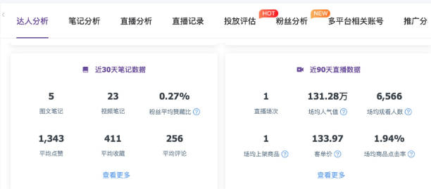
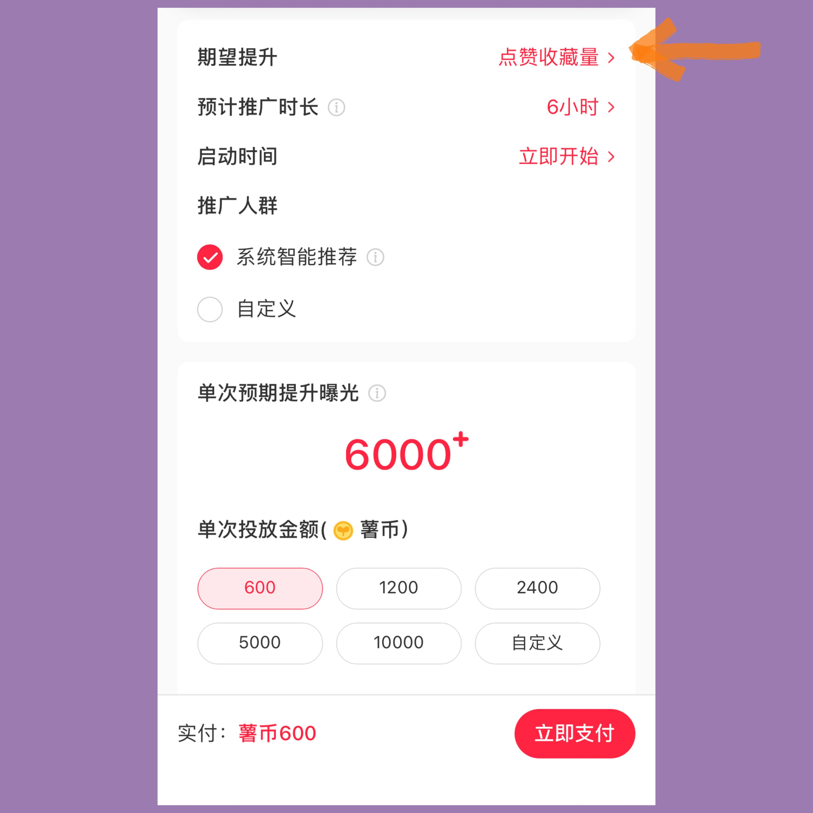

# 1.如何找到自己喜欢的和擅长的方向？
---
找到**喜欢的、擅长的和可变现的**，三个范围的交集

## 1.1 如何找到喜欢并且擅长的方向？
---
**优势表单法**

这是我觉得最有用的一个找方向的工具，只需列一张清单，让你找到自己的优势和方向。

具体就是：

1. 列出 3-5 个的你的兴趣爱好和特长或者经常做的事
2. 按照你投入的时间、金钱、状态、愿意跟人交流和分享的程度进行打分，
3. 每个评判维度加起来是 100 分，我们要按照愿意花在不同兴趣上的比例去打分，
4. 最后把每个兴趣的分数加起来，按照高低排序，你就知道最适合你的方向是什么了。

举个例子：比如有的人喜欢看小说，还喜欢画画或者写作，那就可以把这些方向列出来

+ 时间：然后想想一个月里你的时间里分别有多少比例分配在这些爱好上，比如你花一大半的时间看小说，那小说占的分数至少 50 分，剩下的 50 分也按照具体占用的时间比例去分配；
+ 金钱：再说金钱，比如你为了看小说愿意花多少钱买会员啊、买小说啊之类的，这些钱占总共这些所有兴趣的花销比例就是它的分数；
+ 状态：状态就是你在进行这些爱好的进入心流状态的概率；
+ 交流：交流指的是你日常生活中跟人聊天的时候会更经常提到的概率，如果你在跟人聊天的时候总是提到这个话题，那它的分数就会更高
+ 分享：最后一个是分享，就是如果你有公开去分享的机会，你愿意选择这个兴趣作为主题的概率

这几个维度都打完分之后，把每个兴趣的总分算出来，就可以大概框选出来几个适合你自己的方向，这个表格只是客观的告诉你第一名是你投入最多的，你可以在前三个里面去选择更方便变现的方向。

## 1.2 如何衡量可变现的程度？
---
问问看自己：**在这个方向我能解决谁的什么问题？**
要解决细分领域的部分人群在某一个具体场景之下的具体问题。

### 1.2.1 只有你的定位是市场需要的，你才能赚到钱
---
都说现在的自媒体是个红海，但是很多的方向仍然有巨大的市场需求，也就代表着还有很大的变现空间等待去挖掘。
每一个细分领域都有机会，选择热门市场的细分领域容易成功，选择解决问题类的细分领域更容易变现。

比如理财这个问题，可以分成基金，理财产品，股票还有可转债；也可以按人群划分，比如职场，学生理财，家庭理财，退休后理财等

你要做的定位是要给一个具象的人解决具象的问题，哪怕你只定位了一个人，那也能帮助到你更快的找到方向，这时候，你就去问问自己几个问题：

+ 你最想帮助谁？
+ 你能帮助谁？
+ 他愿不愿意掏钱给你？
+ 你有什么资源可以协助你更好变现

### 1.2.2 我解决的问题，客户愿不愿意掏钱（验证需求）
---
1. 到淘宝搜索看看类似的产品/服务，销量怎么样？

2. 到各大自媒体平台看看，有没有做相同客户群和需求的产品/服务的自媒体，做得还不错的，多不多？

3. 和这些有相同需求的细分人群交流沟通。

4. 查看百度指数、微信指数、百度关键词规划师等，到百度上搜索看有没有投放广告的。

### 1.2.3 最小化试错，做出最小产品集投放到市场去看下反馈
---
比如要做课程，先做个 1.0 版本的课程，可以参考好几个优秀同行的教程，用自己的话仿写、改写梳理梳理，就是一个不错的教程了。

写好初版之后，就可以准备开卖了，卖了以后才知该如何改进，然后不断迭代，通过用户的一次次反馈去优化。

如果实在找不到方向，可以试试看在各个平台搜索各种博主，把你看到的你认为的 IP 方向都记录下来，分类整理，给自己更多可选项，然后从中筛选出符合前面我们说的你喜欢，你擅长（能做好）及可变现的，然后找出几个这个方向优秀的IP进行拆解分析，然后模仿他。

# 2.运营前要做什么准备
---

## 2.1 寻找对标
---
确定了方向，在小红书上搜索与你的方向相关的内容，去找各个长尾词，找到一个有一定竞争性，但不是最竞争最激烈的方向，去看他的热门笔记和相关账号，找到跟自己想要走的方向吻合的作为对标账号。

### 2.1.1 如何找到对标账号？
---
关于如何找到自己的对标账号，需要根据自己的账号定位去找，找你所在领域的大号，去分析个几十个，找到共同点。

**找到大号的方式：**
1. 搜索，让系统了解你的偏好，就会推送对应内容给你
2. 利用官方账号的推荐和关注
3. 注意大号的活跃粉丝的关注列表
4. 通过一些数据平台，比如千瓜／新榜
5. 还有创作中心跟电脑版的创作中心的热榜推荐

### 2.1.2 如何进行对标账号分析？
---
+ 大的方向上，从账号的定位，账号特色，取名，主页的设计，内容的定位，栏目设计，内容架构，是否签约mcn，赞粉比等等
+ 小的方向，爆款笔记的分析，关键词的选择，题目的模式设计，标题和封面，内容结构，脚本节奏，粉丝的互动方式，引流方式，商业合作等。
+ 还可以看整体的分类数据，这些可以在千瓜数据上去看

### 2.1.3 如何进行对标账号的查看分析？
---
具体是千瓜数据-行业流量大盘，可以看到整个平台整个品类下的内容数据，这里只有一些常见的分类，像理财这种分类就没有

还可以在千瓜数据上去输入相应你要对标的账号，可以看到你需要的一些数据，包括具体到细化的一些笔记的分析，很方便做参考，但是再深入的运营层面的就需要自己手动去做分析总结。

还有一个比较简单的工具，就是通过群量 https://www.qunliang.com.cn/

打开群量-结案报告-竞品分析-输入相应关键词，等待出报告就可以了，但是需要时间比较长，有时候还出不来，所以比较建议用前一个方法。

## 2.2 打造IP外显
---

### 2.2.1 取名
---
如果做垂直领域最好带有你要做的领域的主要关键词+你的小昵称，比如 xx 撩财经，这里给个取名公式吧：好名字=你的内容方向+简单好记的中文昵称。

### 2.2.2 简介
---
体现你的内容价值，比如理财干货，带小白避开理财路上那些坑。还可以加上你的更新频率还有你的身份背书，比如财经杂志记者，开发了《xxx》钱课，帮助超 xx 万用户摆脱理财误区之类的，或者写过什么书

### 2.2.3 首图
---
体现你的个性和内容偏向，主要就是告诉用户关注你能得到什么，能过上什么样的生活之类的。

这些外显的设计出发点只有一个，就是方便你的用户，从你的用户角度出发。

让用户很清楚的知道你能提供什么价值，关注你能解决什么样的问题，还要方便用户找到他需要的内容。所以也要做好栏目划分（根据用户需求划分），可以在置顶笔记做你的栏目说明和如何查找内容的说明，给每篇笔记做编号，在笔记封面说明栏目，按照栏目建立收藏夹，把对应的笔记放在相应的收藏夹里，方便用户调阅。

这里还要说一下置顶笔记的用法：
1. 做成笔记栏目，方便用户检索
2. 把你的爆款笔记置顶，这样不是因为你的爆款笔记进来的用户，如果看到爆款笔记，可能会转关注，可以提高个人页转粉率
3. 当你有商业合作的时候，可以把相应的笔记置顶作为你的商业推广附加价值

## 2.3 找到适合自己的表现形式
---

### 2.3.1 用擅长的逻辑迁移复用
---
根据对标的高互动笔记结合自身的优劣势找到合适的笔记模版形式

这里的复用逻辑就是：用你擅长的理论，概念，思维模式来进入一个全新的平台去迁移复用。我这里就是用文案策划的思维和ppt呈现技能和逻辑迁移到了自媒体上。

### 2.3.2 如何细化定位，加入个人特色，特点，做出差异化
---
小红书整个平台其实大部分是女性，本身平台也是美妆时尚领域发家的，所以这个平台这些品类的竞争已经进入红海阶段。

想要在这些领域做，就需要避免直接跟这些已经成型的大号竞争，去找到红海中的蓝海，有几个方式可以选择：

1、做其中的细分领域：

比如做美妆的很多了，你就专注做其中一个品类，比如口红，抖音的颜九，最早就是靠口红评测在一众美妆博主中杀出一条血路的。

或者你可以做专门的人群，比如杨天真做大码女装，就是利用这个逻辑。

而像理财尤其是基金的内容，在小红书已经泛滥了，如果你专门做个 etf 的账号，可能可以有一定机会。

总而言之，就是要在红海中寻找细分领域，取名时甚至可以加上你做的细分领域的关键词，前期做的时候内容一定要够垂直，笔记方便系统打标，也给用户直接呈现你的价值。越是精准的内容和定位，越能获得精准的粉丝。

2、加入个人的标签

比如加个专属的 slogan 或者口头禅，或者用特别的角度切入，都可能形成你自己的特色。

+ 口头禅：比如，你看很多快手的美食博主，在说水的时候都爱说成“生命源泉”，说鸡蛋总爱说成“公鸡蛋”之类的，虽然容易泛滥，但确实早期是能加深用户印象的。
+ 专属的 slogan：我自己是加了个 slogan，关注我，让钱为你工作。这样能让用户感知到你的价值。打造自己的形象和价值。
+ 特别的角度切入，比如有的理财博主，她本身是个追星女孩，就会用一些追星的形式来类比炒股，或者我很喜欢用谈恋爱来类比投资，这样用户也会对此有所感知。

### 2.3.3 视频比图文更容易打造个人 IP
---
尤其是固化的形象，对于用户来说，更容易有印象，典型的一个就是鹤老师说经济，他每个视频的形象都是一样的，这容易让用户产生认知。

但对于美妆时尚之类的账号，就需要一点特色，比如小红书有个做到很大的穿搭账号，叫胡楚靓，她的特点就很明确：自称女明猩，神经质的视频，加上粉丝说她脸方，叫她电视机，这些都是记忆点，也是这些记忆点，让她从众多穿搭账号中脱颖而出，做到百万级账号。

这里要注意，这些个人特色一开始可以做多个方式的尝试，但一旦标签固化以后，就需要维持好人设，所有的逻辑都要自洽，不要变来变去，一方面方便用户记住你，另一方面也方便平台给你推送精准用户。

# 3.内容创作的流程
---

## 3.1 打造内容框架
---
+ 梳理自己的知识体系
+ 梳理自己的价值
+ 划分栏目
+ 根据粉丝的需求完善内容框架与切入点
+ 根据节点，月份节日等做对应的热点选题，加入框架中

## 3.2 打造第一个爆款
---

### 3.2.1 在做爆款之前首先要了解平台的流量规则
---
小红书有三大流量推荐逻辑：**社交裂变推荐逻辑、个性化推荐逻辑、搜索关键词推荐逻辑**，这三大推荐逻辑又可以细分成 17 个流量入口，那这些如何帮助我们打造爆款呢？

今天我们就主要说说，其中跟打造爆款笔记最密切的是两个入口：

#### 3.2.1.1 首页个性化推荐逻辑可获得，发布流量+持续流量审核
---
+ 审核打标
+ 推送给对应人群（基础流量池，可能是 200 人）
+ 种子用户人群（这两百人）投票（转发，评论，点赞，收藏，弹幕）帮助系统打分
+ 打的分到第一层分数门槛后进入新流量池（可能是 2000）
+ 新流量池的用户继续打分，达标后继续扩大推荐的流量池，也就是把你推给更多的人
+ 以此类推，每次分数达到就会把你推给更多的人，直到新用户给你打的分不达标为止，才会停止推荐

这其实是一个强者恒强，爆款恒爆的玩法，所以用心打造爆款是运营账号的重中之重。

#### 3.2.1.2 爆款笔记的搜索获取，可获得持续的精准流量
---
搜索逻辑的大概流程是：

发布笔记 ➡️ 系统审核打标 ➡️ 词条收录 ➡️ 首页推荐，用户和搜索看到的用户一起打分，加上系统算法的打分和账号权重打分（这里面 mcn 的价值很大） ➡️ 得出排名 ➡️ 排名越靠前，就会被越多用户看到，也就会被越多用户打分，也就可以提高排名。

另外，笔记在个性化推荐没有获得特别好的流量时，可以通过搜索入口，做排名关键词的强化，还是有机会被精准人群搜索到。

所以，好的内容，再经过关键词强化，随着时间推移，也有几率成为一篇爆文。

其实是一个好产品 + 精准用户触达 + 爆款恒爆的玩法，但是跟首页推荐逻辑不同的是，爆款是没有时效性的。

只要你的排名很靠前，不管多久以前的笔记都能被用户搜索看到，用户就可以持续因为这个爆文而点开你的主页，而且他们还是精准的用户，那就可以持续不断的为你引流，而且只要你的内容水平持续稳定，转化成粉丝的概率都是不低的。

也就是说一个爆文可以无限引流，可见爆款有多重要。

### 3.2.2 爆款笔记的几个特征
---
小红书截止目前，仍然是一个以 **分享“经验”，搜索“经验”** 为主的平台，想快速做好账号，那么就要顺应平台的这个特征。

用户使用小红书，最主要的目的还是减少决策时间和成本，也就是说：你的笔记是需要能够帮助用户快速做决策，加快他的行动效率，这样才能快速抓住用户。

根据上面的逻辑，我们总结了三个爆款笔记的特征：

1. 能够集中打到用户的痛点
2. 好的内容和封面可以让用户很明确使用场景
3. 爆款笔记往往能把内容与特性的人群特点所结合起来

也就是：

1. 与用户有关，让用户自己代入
2. 使用场景一定要明确，告诉用户看完这篇文章能学会什么？能得到什么结果？能给自己带来什么好处？
3. 每一篇内容都要做到：我是来帮你解决什么问题的

> 小亮点：设计矛盾点，打破用户的什么认知？

### 3.2.3 所以到底要如何打造爆款笔记呢？
---
找到热搜关键词，找一个热度中等竞争不能太激烈的且热度较高的，形成第一个选题，找到热门霸榜笔记，分析同行业 50 篇爆文，分析共同点，列出爆点，综合总结就可以得出爆款的模版，然后根据你的知识储备产出笔记，再用爆款笔记特征对照一下。

#### 3.2.3.1 找到选题
---
**a. 找到行业热搜词，作为主关键词**

先输入搜索一些行业常见的问题，比如如何理财、投资怎么做等等。

这里的“理财，投资”我们称为行业词，可以理解为流量很大、很泛的词。

“如何理财、家庭理财，投资怎么做”我们称为长尾关键词，搜索这类词的人通常目的都比较明确，是我们的精准粉丝。

**b. 选择我们要做的关键词**

+ 在小红书站内搜索：
  
    比如说我是做理财的，搜索输入理财，系统会根据主关键词列出理财下面的长尾关键词，这其中本金收录的笔记越多说明热度越高，同时也代表着竞争越大，。

    建议选择一个笔记 1 万左右的去做，如果没有话，可以尝试多维度组合，比如说：家庭理财。

+ 站外搜索：

    可以去微博热搜、抖音热门、豆瓣还有各大门户新闻上找。

    比如说之前王思聪和孙一宁的聊天记录，就有网感强的，整理其中的金句、聊天表情包，女方黑历史之类的，蹭热点很容易就变成爆文，但需要注意不能啥热点都蹭。

    角度切入点也要注意，要注重内容质量，还是要以用户为先，坚持给用户带来价值。

#### 3.2.3.2 打磨测试内容表现形式和模版
---
**好看的封面**

如果你的阅读量总不高，大概率是封面不够吸引人，在小红书，封面的重要性举足轻重，一个好的封面图片，甚至可以提高点击率。

**如何做出能提高点击率的封面？**

+ 找同行爆文笔记封面，把自己当成用户找到自己愿意点赞的点，记下来，重复100次
+ 根据前面统计的答案做两组图，做AB测试，用两个号同时段发出看用户反馈，哪组好用哪个

**内容框架设计：**

引起兴趣—挖掘痛点—展示价值—解决问题——促动成交

**内容选择**

内容一定要让用户有收藏的欲望，尤其是攻略类，教程类笔记就能做到这个，很多点赞是因为好看或者有趣，但收藏却是因为实用性比较强，所以一定要提高笔记的实用性。

**文末引导**

用户有时候对于互动或者关注的动作没有明确的意识，你需要去提醒它，在文末体现你的价值，或者引导他做出下一步行动。

例如: 赶紧@你那些小伙伴来围观，这部分就属于下达指令，做了这一步最后的效果，互动量可以有一定程度的提高

**评论运营**

其实我们只要站在用户的角度去想，我们刷抖音小红书的时候，是不是都会去点点评论区，看看别人说了什么，是怎么看的。

像 B 站的弹幕功能，就是通过评论实现实时互动，提高内容的趣味性，所以弹幕其实可以说是用户对内容的二次创作。

基于上述的原因，评论区的维护就变的很关键，一开始设计内容的时候就留下一些 bug 或者一些小彩蛋，然后在评论做首评或者神评论，是最完美的状态。

如果做不到能在评论区通过有意思有意义的评论去引导用户评论互动也是一个很重要的运营手段。

#### 3.2.3.3 流量冷启动
---
当引导粉丝在评论区多互动，不要回复私信。另外还有三个方法：**搜索互动提高精准用户触发，矩阵账号互动，共享粉丝和矩阵直播，共享粉丝**。

**搜索互动提高精准用户触发**

因为小红书的算法是三重叠加的算法，我们左右不了系统给我们推给哪些用户，那些用户又会如何为你的内容打分，但我们可以人为的制造搜索的精准用户对你的评价。

大概的逻辑就是找到你的笔记收录关键词，搜索后找到你的笔记，然后找多个小号尤其是对应内容偏好标签的号，进行阅读和完播，然后进行互动，且互动需要真实有效，可以无需全部互动动作都做，用多账号去做，这样就可以很好的给你的笔记做冷启动。

**矩阵账号互动，共享粉丝**

找同类或目标粉丝受众相同的博主互赞，共享粉丝，彼此加成

**矩阵直播，共享粉丝**

可以考虑跟其他博主做联动，内容可以更丰富，粉丝还可以共享，但这个是个苦力活

## 3.3 根据第一个爆款总结爆款制造 sop 或模版
---
用选定的模式去给多选题试错，根据第一个爆款笔记形成形成爆款输出的 sop 或模板

前面说了我分析了爆款笔记套路之后，选择用手账形式作出了第一个爆款，在此之前我尝试过用文字作为主要内容输出过一些笔记，流量一般，但当我转向用手账图片来作为主要的产出方式之后，第一条就爆了，而且成为几乎我迄今为止流量最好的一条笔记。

这个模式做的第一条笔记爆了以后，这个模式被我做成了相对应的模版，得以继续沿用，而这个模版之后也被很多理财博主“借鉴”甚至“搬运”。

## 3.4 固定更新频率和栏目更新时间
---
制作你的内容排期表，根据排期表去更新内容，关注

## 3.5 做数据分析，迭代内容输出 sop
---

### 3.5.1 关注单篇笔记的流量
---
看下不同的选题和栏目的互动量如何，根据这些结论调整框架和内容输出 sop

### 3.5.2 关注粉丝增长数据，了解如何提高吸粉率
---

+ **发现页笔记**：带来的粉丝代表的是你的单篇内容被推荐后的吸粉程度
+ **个人笔记页**：指的是你的整个内容选题和风格调性及提供的价值带来的粉丝
+ **搜索笔记**：指的是你的占领搜索词的笔记带来的粉丝，也大概率就是你的爆款内容带来的粉丝
+ **搜索账号**：指的是你的引流带来的粉丝，一般指的是你自己的引流动作或者其他平台带来的粉丝以及你的粉丝二次推荐带来的粉丝
+ **其他来源**：一般就是分享出去的内容带来的粉丝

做上面的数据可以得知，你的内容（尤其是爆款内容）和你的整个调性定位对于吸粉起着重要的作用，也就知道你的账号该如何去调整。

## 3.6 梳理用户问题和回复模版，提高互动效率
---

### 3.6.1 将互动方向进行分类
---
+ 解答问题：做出问题库及回答，链接相关的笔记
+ 情感互动：心理按摩

### 3.6.2 提高回复效率
---
梳理回复模版，给问题做分类，然后梳理回复模版，做好模版之后遇到问题找到合适的模版即可

### 3.6.3 避免互动误区
---
不要模棱两可的回答，准确回答，开放式互动，增加互动率，加强信任度

### 3.6.4 利用用户画像决定内容和形式
---
挖掘粉丝需求，梳理粉丝画像，分类共性的粉丝，提供不同的解决方案

## 3.7 根据做出来的模版持续运营，并持续迭代
---
根据做出来的模版持续运营，并持续迭代

# 4.小红书的变现方式
---

## 4.1 小红书变现有哪些方式
---
目前小红书的变现方式主要有：

+ 接品牌方广告（就是俗称的恰饭）
+ 直播带货
+ 引流到私域卖货或者卖课程。

如果自己手中有产品或知识产品，引流到私域进行售卖也是很好的变现方式；如果自己手中没有产品或知识产品，就比较适合接广告。

### 4.1.1 卖货
---
如果自己手中有实物产品，比如水晶手饰、珍珠、螃蟹、家具定制等，可以把粉丝引流到私域进行变现，我有一个朋友是卖水晶的首饰，虽然粉丝才五六百，但变现每个月引流到微信卖水晶，利润大约有三四千、四五千。

### 4.1.2 卖知识产品/训练营
---
目前训练营挺火的，而且可以通过引流到私域一批批招收学员，只需要不断完善训练营课程就可以。在最初可能难一点，但是越做越顺手，收益也是这几个变现方式里面最大的。

视频分享方式就是教别人如何运营，如何做小红书，以及每个月能收入多少钱。现在不是有句话说，最挣钱的方式是教别人赚钱，这句话一点都不假，到目前来看，确实是这个样子。

### 4.1.3 直播带货
---
这个和抖音直播带货差不多，就是赚取坑位费和所卖出货物的佣金。

### 4.1.4 接品牌方广告变现/恰饭
---
我们普通人最容易变现的方式就是做博主，然后接品牌方广告拿推广费，小红书就是一个种草平台，所以非常适合接广告恰饭。

刚开始起步的博主，粉丝量少，一般是无费置换，即商家免费送你产品，你免费帮他发布笔记做推广（广告）。到后期粉丝量上去了商家不仅送你产品，还要给你钱。我身边博主朋友最高单篇报备笔记价格是 3 万，是我的报价的四五倍，谁能想到她现实工资才六七千呢。

在小红书平台的恰饭分为**正规恰饭饭**和**软恰饭**。

**正规恰饭**就是报备笔记，意思就是说向平台报备下这个就是自己的广告笔记，报备笔记平台会抽取 10% 的服务费，比如说你的报备笔记是每篇一万，平台抽取服务费后实际到手为 9000。合作笔记可以一眼看出来，就是下图中的箭头指得标识。

**软恰饭**指的是不向平台报备，私下与品牌方合作，目前，这种方式有风险，一不小心就会收到违规提示。

但仍然有很多人进行软恰饭，只要注意方法就行，方法就是每篇笔记里不要只出现一个产品，最好出现 3-6 个产品，一般差不多四个产品就可以了。

并且在笔记中，每个产品的篇幅最好保持相同时间，不要出入太明显，不然也会被认定为广告而被判为违规。违规提示见下图：

现在平台管理越来越严格，可以这么说，小红说为了良好的用户体验，是可以狠心拿到砍自己的人，所以如果私下恰饭，现阶段建议选择合集方式。

在前段时间，视频里只说一个产品是没有问题的，但是现在（9 月份），可能也是临近双 11 了，平台对软广告的管理明显有加强，所以我们就按照趋势走，走软广告务必用合集形式。

> 温馨小提示：
>
> 变现方式多种多样，只要适合我们的就是最好的，不要觉得人家卖课程一个月赚了几十万上百万就拒绝恰饭的变现方式。找一个适合自己的方式，然后不断研究与深耕，然后再慢慢扩大化，一步一个脚印慢慢来，先不说月入十几万几十万，月入过万是不难的。

## 4.2 如何培养自己的变现能力
---

### 4.2.1 大量收集合作商务需求
---
加每个商业合作的联系方式，去充分了解市场，要知道哪些人会为你买单，你有哪些方式可以变现。多跟甲方聊，用自己做的视角代入他的项目， 带着主人翁的精神去代入整个项目做个商业模式，从自身角度给建议给新的思路。

### 4.2.2 多维度变现测验，打造 sop
---
梳理你对接的商务需求，按照一定方式分类，然后每个分类选择一家最靠谱的进行合作，做变现模式可行性和可持续性测验，并且根据合作流程形成对应分类的商务合作 sop，针对每种变现方式梳理合作模式。

比如每种合作类型应该沟通的要点，自己执行的时候需要检查的要点之类的。

### 4.2.3 选择最适合自己的模式和节奏持续变现
---
找到变现方式，用低价引流产品打造口碑和引流，用高客单价变现

可以用猪肉引流来的用户在水果上为你付费，大概就是说你的课程也许是免费的，但是课程用到的工具或者资料可以成为一个收费模式。

# 5.小红书引流的技巧
---
流量的第二波在于培养甚至引导用户的习惯，找到还未被覆盖的细分话题，做系列内容，并且做成合集用于引流，大干货搭配小工具，高频工具引流+低频大干货引流。

## 5.1 如何引流？
---
因为在小红书的表达是比较难具有完整性的，所以对于大部分用户需要的干货，可以考虑图表化，手册化去做成可以发给用户的材料，方便用户去使用和阅读，在材料上附上你的 ID 和个人微信或者课程购买信息等，可以有引流的效果。

而且本身这些资料就带有自传播性，所以当你分享给第一部分的种子用户之后，就会形成自传播，能给你很好的导流。

另外，可以在你的笔记内容中去留下关于这个干货的获取钩子，尤其是干货内容中带的工具，很容易吸引用户
在客户的获取路径上，也要做好设计，主要的设计方向要结合你的目的，主要考虑三点：

1. 你希望导流的用户落在哪里？
2. 尽量减少自己的工作量，用工具自动发送

> 所以在获取路径上尽量给到用户流程，我目前用的最简单的方法是关注公众号-回复关键词可以获取，进群可以加我的私域流量。

3. 用获取流程筛选有效用户

> 如果你的后续变现模式需要用户有足够的配合度，那你可以把获取流程变得更复杂一些。
>
> 比如让他转发朋友圈截图之类的，这样做的好处是可以筛选客户，但一定程度上牺牲了传播性。或者你可以把门槛降得很低，流程简单不对用户做筛选这样就可以做到大量的种子用户覆盖。

在变现的产品中带上你的 ID 和微信号等，比如我做的课程，就会植入很多需要在我的账号或者私域流量才能获取的工具和干货，这也是一个传播性。

## 5.2 如何做引流产品？
---
去用心打造免费的产品，当下也许用户是没有付费，但他很有可能会成为你的付费用户，在这之前你还收获了一大堆的免费流量，这种免费产品主要分为两种：

### 5.2.1 做人设，做标签的内容
---
可以考虑做一个电子书，比如 xx 使用指南之类的，这也是一个传播性强的产品，但这个的重点在于体现的专业性和价值，这样的方式主要在于用户先了解了你的核心价值才关注到你的，那么这个的粉丝粘性是不同的。

### 5.2.2 高频的做工具类的导流
---
小而实用，对于我们自己而言制作效率也会更高，比如我会用很多的资产梳理表格，计划表格等来吸引用户主动联系我

引流节奏上，可以用高频的小工具搭配低频的人设产品结合使用。

## 5.3 利用粉丝群引流
---
小红书目前开放了建粉丝群的功能，由于是新出的功能，规则限制还不是很严格，可以用粉丝群发布二维码等方式进行引流。

# 6.小红书运营常用一些工具
---

## 6.1 视频内容产出与发布 sop
---

## 6.2 数据分析工具帮助你运营+变现
---
千瓜数据 http://www.qian-gua.com/

### 6.2.1 找到你想对标的博主，查看他的相关数据
---
你可以看到他的推广情况（这可以帮助你更好的定位变现方式），是否签约 mcn，隶属于哪个 mcn，这个可以帮助你了解他的流量来源和运营团队等实力；

还有他的内容垂直度和主要的内容标签，这可以帮助你更好的选题和设计内容栏目。还可以查看他的笔记数据，比如点赞最高的，收藏最多的，分享最多的，这些都能方便你进行爆款分析和复用。

### 6.2.2 可以查看 mcn 排名
---
这个可以帮助你去看有哪些可以签约的 mcn，甚至是可以帮助找到商业合作机会。

### 6.2.3 达人排行榜
---
这可以帮你精准找到对标账号，其中有一个涨粉榜，你可以找到最近涨粉较快的博主，去看看她近期做了什么内容，做了哪些运营动作，精准有效去复用。

### 6.2.4 数据大盘
---
这个可以帮助你把握整个平台的动向，你这个分类的内容动向，尤其是行业流量大盘，可以帮你定位粉丝的精准画像，甚至通过高频出现的评论关键词找到合适的笔记关键词，帮助你找到爆文选题等。

这些上述的都是一些免费的功能，付费之后这个工具会更强大，但免费的研究透了也就够用了。

## 6.3 小红书平台薯条使用方法
---
小红书博主可以给自己的笔记购买薯条增加曝光，本质上就是花钱买流量。

10 块钱可以买 100 薯币也就是约 1000 的曝光。也不要想着只要买薯条就可以增加曝光，如果笔记被平台判成软广告，连薯条都买不了，钱都花不出去。

> 薯条的本质是锦上添花，而不是雪中送炭。

如果自己的笔记质量差就算花钱也买不来流量，但如果笔记基本互动（点赞、收藏、评论）比较好，这个时候可以加用薯条加把火。

比如发布笔记后点赞收藏都超过了 50，就可以买 50 块钱薯币试试，或者达到了自己平时的互动量也可以小额（￥50-100）试试水。

我自己之前比较少用薯条，现在也在逐步让薯条为自己增加曝光。

在购买时尽量不要使用苹果手机购买，因为有 30% 的手续费，可以使用安卓手机进行充值。

再结合身边其他朋友的薯条操作，我去问了下效果还不错，单粉价格平均下来差不多在 0.2-3 元之间，差别还是在于笔记质量不同，因为同时也咨询了笔记质量不太可的博主，反馈说投薯条没一点儿用。

在时间上，薯条的投放适合新发布笔记，比如在笔记发布的三天或一周内投放。

而且同一篇笔记，如果用薯条试水之后，效果不错，可以再次投薯条，可能还会触发平台推荐机制，这样曝光量就更好了。

需要注意的是，在购买薯条时，“期望提升”那里建议选择“点赞收藏量”，因为平台的推荐机制是主要靠点赞收藏量来触发的。

## 6.4 做小红书用到的设备
---
如果做图文博主，一部手机就可以搞定，如果做视频博主可能需要扩充一点。

我之前是图文博主，但现在各个平台都在扶持视频，因此我慢慢转成了视频博主，转型后发现：视频博主变现是真厉害啊，我也有机会突破月六位数了，这种感觉真好。

设备方面，我的原则就是用最少的投入获得满意的的效果，不白白砸钱。因为发现不少人前期购买了不少器材，最后都浪费掉，不仅仅浪费钱，也很浪费社会资源，感觉挺可惜的。

在我去年月收入超过 5 万的时候，我也跟风入了相机，其实之前用手机用的挺好的，买回来发现还没手机好用，就落灰了，现在也在想办法怎么发挥它的价值。

接下来开始介绍设备（下文有设备全家福可以参考）~

1. 手机：我用的是苹果 12，256g，用起来比较顺手，画质也比较满意，但还是比不上相机的高清；我另外一个朋友用的是约 ￥4000 的华为，也很顺畅好用。我曾经用过入手价为 3099 的安卓机，才用了半年像素就不行了，不管图文还是视频都不行，白茫茫的很昏。咱们可以不买相机，但还是建议买个 3900+ 的手机，用的时间会长一点，个人实践下来觉得做博主比普通人要费手机，而且内存也要尽量大一些，作为视频博主，128g 是不够用的。
  
2. 提词器 APP：视频博主必备，这个软件需要买一个会员大约 20 块钱，挺便宜的。以前拍视频都是把写好的稿子提前背一背，效率比较低，自从有了提词器软件，妈妈再也不用担心我一天拍不了 5 个视频了。网上也有卖专门的提词器大设备，几百块钱比较贵而且比较占地方没必要。
  
3. 三脚架：在拼多多买的 70 多块钱非常实用而且好收纳。还买了一个用来夹平板的桌面支架。拍摄时候的情景就是手机前置摄像头对着我拍，然后我的眼睛看着平板念稿子。

4. 收音设备：拍视频一定要注意收音，有些视频一听就是没收音，会出现很多细小杂音，给人很不专业印象。我用的是博雅麦克风，大约六七十块钱。我的这个麦克风没办法自己固定，所以都是用两块钱的发夹来固定。真好用真香，认真践行开源与节流，拒绝被消费主义洗脑。
  
5. 拍摄软件：很多人都推荐轻轻颜相机，说是既自然又好看，但和我不太符合，我还是喜欢 B612 相机，可以把我的脸缩小哈哈，所以看哪个更适合自己啦。
  
6. 剪辑软件：剪映 APP，真的牛，这个软件既简单又功能强大，基本上可以满足视频博主的大部分需求了。因为它太好用了，导致我现在都还没有学 PR 剪辑。

# 7.对小红书的一些建议
---

## 7.1 小红书运营中的一些细节
---

### 7.1.1 薯条小tips
---
选择爆文去做薯条投放性价比会比较高，并且投放后要及时做数据分析进行复盘，通过这些分析，你可以找到自己要修正的方向，也可以更好的做调整。

**看播放量**

如果播放量可以达到 10%，算是很高的转化率了，如果播放率很低，大概率是笔记的封面和标题不吸引人，或者内容的打标跟用户不符，要考虑切换关键词和文案。

还有就是本身笔记没有什么点赞互动的时候，刷到点开的概率也会变低。

**看互动量**

点赞，收藏和评论，如果互动效果不好，说明内容没有体现出人设，一定要加一些个性化的元素，让用户觉得是在跟人互动。

**看涨粉情况**

这里有一个数据是主页浏览，如果你的主页浏览量大，但关注数少，那大概率就是你的账号不够垂直，主页设计也没有统一性，没有体现出内容价值。

### 7.1.2 完成创作中心的任务
---
完成创作中心的任务可以获得流量扶持奖励，把流量都用在爆款的宣传上，性价比更高。

## 7.2 对小红书运营的一些建议
---
1. 不要为了变现而藏拙，错过了最大流量红利期
2. 不要太注重日更，重要的是内容质量而非频次
3. 不要乱接广告，请保护好自己的 IP，任何商业合作是否成交都要优先考虑粉丝利益
4. 不要因为平台规则而打击到创作情绪导致错过流量红利期
5. 不要太注重数据，不要刷数据
6. 如果你需要打造 IP，不要太早的为了变现而做私域流量，先把粉丝量做起来，一旦私域流量或者说是群建起来了，你的笔记互动量就会骤降。或者说是在粉丝的运营模式上尽量选择单点互动的深耕模式，或者可以设定一定的门槛进入群，比如在你的渠道上开过户，这一步主要是为了筛选付费或者配合度高的用户
7. 如果不是为了私域变现，而是为了打造IP接到大牌广告，不要回私信，直接让用户在评论区互动，这一点一开始就要讲明
8. 不确定账号能不能做下去的时候，不要实名认证，毕竟一个身份证只能认证一个账号，取消认证很麻烦，
9. 小红书一个账号切换多个手机不是一定会限流，但是一个手机多个账号，并且发布的内容（疑似广告或者明确是违规），这种所有账号通通限流。
10. 不要大量删帖！！！会影响账号权重

## 7.3 一些激励
---
在这个时代挣钱很难，也很容易。我们在职场工作多少年才能达到月薪三四万啊？但是在自媒体三四万就是一个比较常见的水平。别的博主我也没有亲身了解过咱先不说，就说我身边的：

+ 第1个小 A，小红书博主 4 万多粉丝，视频护肤博主，目前平均月收入 6 万左右，主业是普通员工，月薪五六千。

+ 第2个小 B，小红书粉丝 7 万多，图文护肤博主，目前平均月收入 6 万多，主业是一名普通职员，月薪四五千，现已辞职以专心做副业。

+ 第3个小 C，小红书粉丝 8 万多，图文护肤博主目前平均月收入 4 万多，是一名大四学生。

+ 第4个小 D，小红书粉丝 8 万多，图文母婴博主，目前平均月收入 3 万多，主业是一名护士。

+ 第5个小 E，小红书粉丝 26 万多，图文护肤博主目前平均月收入 9+ 万，去年 10 月我算了下她当月收入有 20 多万，主业是一名护士。

很多人都说自媒体的红利消失了，其实并没有，只不过没有前两年野蛮生长了，现在他依然是我们普通人的最好选择，也是我们普通人强有力的一个杠杆，希望我们都能好好抓住它利用它。

上面这些都是有主业，然后又做了副业的人，长相身材都是正常水平，都是靠实力吃饭，并没有靠颜值。所以一旦下定决心就好好去做。

读万卷书不如行万里路，一切都要落实到行动上。不管上了多贵的课，不管学了多厉害的套路，不管有多厉害的领头人带路人，最关键的还是自己要动脑子去琢磨，去执行。

祝愿我们越来越好❤️
