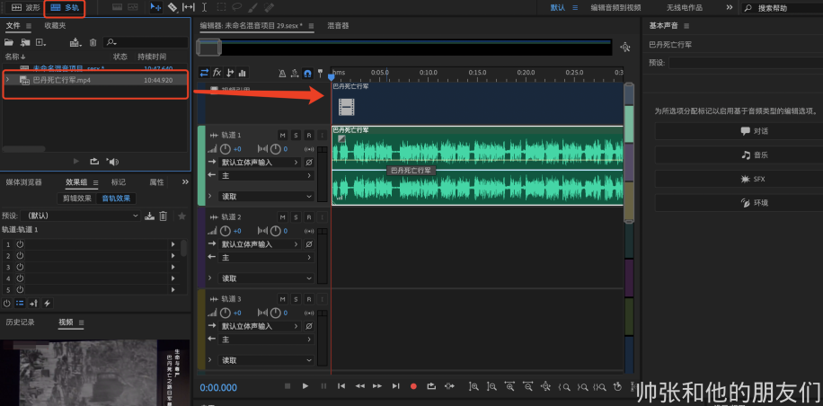
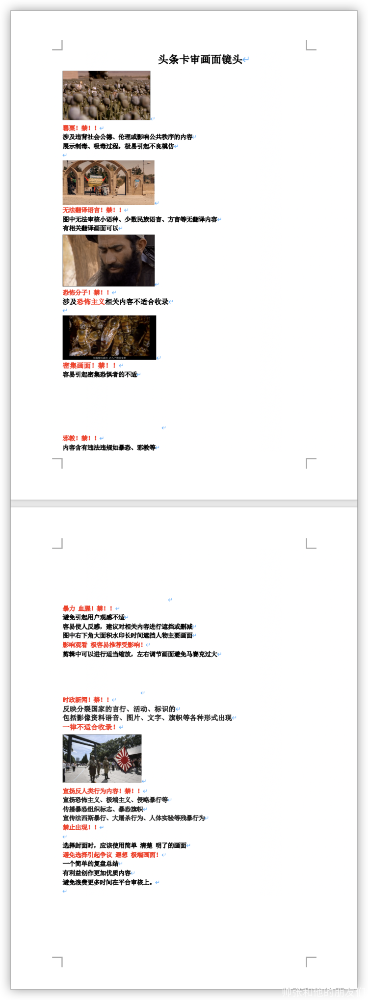
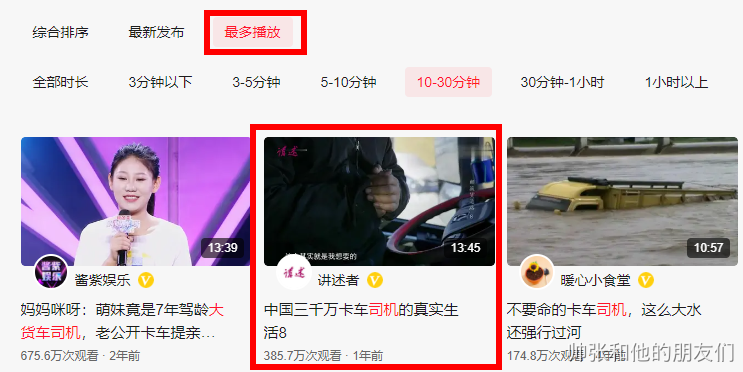

# 1. 什么是影评自媒体
---
简单的说，就是影视解说。

通常一部电影的时长都在 2 个小时左右，很多喜欢看电影的人并没有时间完整的看完一部电影，或者片荒的人会先看一遍解说再去看一部完整的电影，所以我们需要把整部电影浓缩成 10 分钟左右，让别人快速看完，看懂，看爽一部电影，于是就有了电影解说这个领域。

同时，影评不局限于电影，还可以是电视剧和纪录片

我们的收益来源就是视频播放。

影视解说作为自媒体最常见的内容之一，大部分平台还是很欢迎这类内容的，只是每个平台对内容的需求不一样，所以每个题材的播放量在每个平台上不一样，但是有播放量就会有收益。

如果有一定的粉丝粘度，播放量稳定也可以接商单，这种变现方式在 B 站上做纪录片的同学们比较常见。

> 侵权问题
>
> 影视剪辑侵权问题是近期的焦点，目前各平台禁止发布的内容是：简单的把影视作品中的精彩片段剪辑出来，拼凑到一起形成的视频。
>
> 而影视评论、解说，不仅是剪辑影片中的片段，还加入了创作者自己对于影片的描述，评论、理解和分析，平台是允许的。

# 2. 视频发布平台
---

## 2.1 选择平台
---
目前自媒体平台很多，但是推荐前期先做着一些流量大的平台，有正向反馈后在继续考虑拓展平台，推荐几个前期值得去运营的平台

### 2.1.1 西瓜视频
---
也可以理解为头条系，现在在西瓜视频后台发布内容后，除了西瓜视频，平台还会自动同步到头条系的今日头条和抖音等两个大流量的平台

头条系平台是对新手最友好的平台之一，除了算法强大，不用依赖粉丝数量也能有很不错的流量和收益

**收入方面**：今日头条给创作者的的视频单价是国内最高的一个平台，所以，即使播放量对比其他平台来说不是很高，但收益相差不会很大。

### 2.1.2 腾讯内容开放平台
---
也可以理解为腾讯系，以前也叫企鹅号，和头条系一样，腾讯看点也会自动把内容分发到旗下的 APP，微信看一看，腾讯视频，QQ，腾讯看点，腾讯新闻等，如果是电竞，体育相关的内容还会同步到腾讯体育。

依托腾讯系的庞大流量，这个平台依旧是新手的首选之一，内容的推荐算法和头条的有一定的差别，但是爆款的播放量上限会比头条高很多，出百万千万播放量的视频相对来说容易一些。

**收入方面**：虽然现在单价不是很高，但平台的流量大一些，也能做出不错的收益。

### 2.1.3 YouTube
---
油管这个平台的用户量就不用多说了吧，基本上好内容都能获得不错的播放量，而且这个平台相对开放很多，在选题和内容尺度上比国内的平台好了不止一个级别，虽然获利的门槛相对较高，但是可以在选题上面来弥补这个缺点，可以快速起号获得获利权限

**收入方面**：是所有自媒体平台单价最高的一个平台，而且播放量也不错，总体来说也是一个很值得运营的一个平台

### 2.1.4 BiliBili
---
这个平台对于影评自媒体来说相对比较特殊，一般的内容在 B 站不会火，能火的内容对于新手来说有一定的难度。

当然，专业的影评人或者特别能整活的人来说除外，所以影评这个领域个人并不建议太过在意 B 站这个平台。

**收入方面**：B 站的平台激励（补贴）并不高，但是 B 站的商业变现相对来说比以上平台好很多，不巧的是影评这领域在 B 站上的商业变现并不是很理想。

### 2.1.5 其他平台
---
做影评，像大鱼号（内容会同步到 UC 浏览器、优酷），百家号（内容会同步到百度 APP，爱奇艺）等平台，不用专门去做符合平台的内容，把做好的内容顺便同步过去就行。

**收入方面**：整体收益比以上平台低很多，但是每个平台一个月多几百块也是钱。

### 2.1.6 总结
---
其实，每个平台都是可以做的，因为自己产出的内容是可以同步分发的，但是新手必须得先选一个平台来入局，每个平台的用户画像和属性不一样，所以对内容的需求不一样。

在头条上火的内容在其他平台不一定火，在腾讯内容开放平台上火的内容在其他平台不一定火…

所以，先选一个自己想做的平台作为主攻的平台，熟悉所有的平台后自己选题和写文案会有一个中间值，即使在其他平台上没有百万播放量，也能有几万播放量。

根据我自己的理解，把所有平台对内容质量的要求做了一个排行，也可以理解为难易程度：

> 腾讯 < 头条 < B 站 < YouTube

大家可以根据自己的创作能力选择一个主攻的平台即可。

## 2.2 注册账号
---

### 2.2.1 今日头条
---
直接在头条的后台注册账号可能会提示平台在维护，这时候我们需要在手机上面注册，具体步骤如下：
1. 手机上准备今日头条 APP；
2. 手机上面注册一个账号（个人使用的正常账号就 OK，不用注册创作者，如果你已经拥有头条号，可以跳过这两个步骤，直接进行第三步）
3. 关注公众号 今日头条
4. 进入公众号，点击撩
5. 点击创作
6. 收到链接点击连击进入后台
7. 不要点注册，直接点击登录
8. 填写信息等待审核通过即可
> 注：测试过有些手机号不能注册，可能是手机号码的问题，所以建议用时间长一点的手机号码注册，也可以用抖音号直接登录，目前，抖音号也支持直接在 PC 端注册新的头条号
>
> 有老账号以前没有发过作品，没有搬运过内容的账号可以使用（账号可以注销后在注册，但需要等一周时间，不建议这方法，直接换手机号即可）

9. 注册头条账号后需要身份校验（实名），一个身份证只能绑定一个账号。

在头条号的创作权益中开通”视频创作收益“和”视频原创“，这样才能保证我们发布视频有收益。

### 2.2.2 其他平台
---
其他平台的账号都能正常注册，直接到官网，按照提示填写信息即可完成注册

## 2.3 收益分析
---
视频的收益取决于有效播放量和视频千次播放单价。有效播放量会随着总播放量增长，而决定单价的是视频质量和原创度。

所以，我们要做的就是 2 点：**保证单价，提高播放量**。

单价每天、每个视频都会有变化。开始时，我的单价一般在 1~2 元之间。后面播放量破百万之后，单价降到 0.7 左右。这可能也与我后面改成AI配音有关。

如果采用人工配音，单价会越来越高。船友里面有单价 3~4 元的，如果能保证单价在这个区间，出一个爆款视频上百万的播放量，收益直接就是 2000 左右，还是很可观的。

## 2.4 发布视频的规格
---
平台打对于发布视频的规格有严格的要求，对于不符合规格的视频，平台是不会推荐的。

平台建议的视频规格是：

+ 宽高比为 16:9、18:9、21:9 的横版视频；目前最常用的视频格式是 16：9
+ 分辨率 ≥1920x1080，高清晰度视频容易获得更多的推荐。目前最常用的分辨率是 1920x1080，也就是我们常说的 1080p

为了提高收益，我们要做的就是尽量发布高质量的原创视频，做到以下两点：

+ 我们发布的视频长度应该在 8 分钟以上，视频太短会被平台判定为信息量不足，质量不高。
+ 发布原创视频，视频剪辑加上配音解说，最好是人工配音，AI 配音的单价不高。

# 3. 软件与工具
---
工欲善其事，必先利其器。

正式开始前我们需要准备好下面这些工具：

+ PR，视频剪辑工具；
+ AU，音频剪辑工具；
+ PS，封面制作工具；
+ AE，字幕工具；
+ Arctime Pro，字幕工具，https://arctime.org/，win10 最新版需要在兼容环境下运行，和 AE 二选一即可，推荐使用 Arctime Pro 效率更高；
+ idm：视频下载工具，http://www.internetdownloadmanager.com/；
+ ndm：视频下载工具，支持 Mac，http://www.neatdownloadmanager.com；
+ you-get：视频下载工具，需要 python 环境，https://github.com/soimort/you-get；
+ ffmpeg：格式转换工具，支持 mac，http://www.ffmpeg.org/；
+ 格式工厂：格式转换工具，http://www.pcgeshi.com/；
+ 网易见外：视频、音频转写，https://jianwai.youdao.com/，
+ 牛片网：音频转写，https://www.6pian.cn/。

另外，最好有梯子。一是方便在 YouTube 找片源；二是如果使用微软 AI 配音，也要用到。

这些都是常用工具，教学文章、视频在网上很多，不需要很精通，会用就行。

我们提供了 RP、AU、AE、PS 下载地址和视频教程（只针对影评领域，所以教程可能会相对粗糙，同时偏向工具的运用，思路方面还得大家多多实践）

+ win版：https://pan.baidu.com/s/1y-PapclKpdJuXRh2rlCX-w，密码: h71b；
+ mac版：https://pan.baidu.com/s/17fqmYnLnDMePTDyWKb6VeA，密码: a7a2（安装时需要断开网络）；
+ 视频教程：https://pan.baidu.com/s/1KNV1y-Cao–Y_Ctx6WLquQ，提取码：6jge 。

# 4. 制作视频
---
做好上述准备后，就可以开始我们自媒体赚钱之旅了，一个视频的制作过程中包含如下图所示的部分：

视频从制作到发布到平台的流程如下：

1. 选择一个合适的题材（详细内容看如何制作爆款-选题技巧），下载原片；
2. 根据影片内容，撰写解说文案；
3. 录制配音；
4. 按照配音剪辑视频；
5. 后期制作：处理水印，加字幕、背景音乐；
6. 写标题，做封面；
7. 发布到平台。

视频发布后，就可以通过播放赚取收益了。

在视频制作方面，初期为了快速上手，掌握视频的制作方法，建议大家从模仿爆款视频开始。从文案、标题到封面都模仿爆款。注意，是模仿，不是抄袭，更不是直接搬运。

等到我们自己制作出几个爆款视频，积累了一些经验之后，就可以尝试自己选题，并在视频中加入自己的风格。

## 4.1 文案
---

### 4.1.1 撰写文案的方法
---
文案方面可以模仿爆款视频，这里不是鼓吹大家去抄袭，而是因为爆款视频的文案结构都很好，我们可以先获取它。

比如，爆款的剧情是怎么推进的，解说和电影原片有哪些区别等等。得到这些框架之后，我们要做的就是根据框架去填写内容。

如果想省时也可以直接在它的基础上做一些修改即可，但是不能照搬照抄。一般的做法是看一遍原片，然后根据爆款的文案修改。

这种方法简单理解就是洗稿，我个人不推荐也没有偏见，因为单纯站在内容创作者的角度去看，洗稿是一种不礼貌的手段，但是从一个生意人的角度来看，这种是能快速走量放大的方法，所以可以自己选择。

爆款视频的文案可以使用“网易见外”这个工具提取出来，把视频中的声音转成文字，比完全自己写要节省时间，而且工具是免费的。

补充一个提取视频音频高效的方法：

第一步打开 AU 软件：

第二步，导入视频文件：

直接拖入到这个窗口

第三步，建一个多轨：

第四步，把文件拖入到多轨：

第五步，导出文件（格式选 MP3 或者其他你想要的格式）：

也可以使用如录音啦这类工具，直接提取，工具原理就是图文识别，可以不用下载视频，直接提取字幕。

### 4.1.2 撰写文案的技巧
---
关于写文案，我推荐三种方法，第一种适用于时间比较长的纪录片，做老电影或者科幻电影也可以使用这个方法，第三种适用于高度原创，也可以用于做ip类型的账号，难以程度也会有所差别，可以根据自己的能力和定位选择，具体步骤如下：

**方法一**：

适用于时间比较长的纪录片/老电影/科幻片/电视剧等等

+ 下载这个题材的 2 个爆款视频；
+ 使用格式转换工具转成音频；
+ 用网易见外分别把音频提取出文字，得到这 2 个视频的文案；
+ 融合这 2 个文案，开头和结尾部分自己写一下，中间部分相互穿插这个 2 个爆款的文案，稍做修改。

这种方法可以不用看原片，节省时间。写出来的文案结构与爆款文案基本相同，内容文字也都是参照的爆款不会出现太大偏差。

**方法二**：

适用于时间比较的短的纪录片，或者是在一部较长时间的纪录片中截取一部分，长度最好不超过 20 分钟，具体步骤如下：

+ 看一遍原片；
+ 下载原片，转成音频
+ 用网易见外把音频转成文字；
+ 开头和结尾自己写一下，中间部分 80% 照搬旁白，适当加一些自己写的内容。

这种方法完全跟着原片本身的节奏，文案流畅，写作时间短，后续剪辑也方便。

**方法三**：

适用于高度原创。

+ 找到对标视频（比如你主做头条，看到一个作者这个视频火了，你就把这个视频当做你的对标视频）
+ 观看一遍需要创作的原电影
+ 提取对标视频的文案（方法参考撰写文案的技巧）
+ 归纳总结视频的文案框架

这里分享一个中长视频通用的文案框架分析案例，可以用于影评，也可以用于自己想做的领域，结果不重要，主要看我的分析角度和思维。

分析内容：链接：https://www.youtube.com/watch?v=v3kfH0a_dDY&t=366s

分析结果：

优质的影评文案除了解说电影的剧情外，还会穿插着很多自己的见解或者吐槽，可以是对角色演技表现的评价，对剧情的节奏的吐槽，甚至对导演和剪辑师的吐槽/评价；

但是，都有一个逻辑清晰的文案框架和合理的剧情推进，所以，我们用心是能总结出来的。

### 4.1.3 根据框架创作内容
---
有了清晰的框架就有了创作文案的节奏，我们根据自己对电影内容的理解去创作即可

**1、开头**：

比如对标账号的开头是以导演的经典作品来引出正文的，那么我们可以跟着这个角度去写，每个人对每个导演以及经典作品的喜爱、认知都不一样，所以我们只是单纯的借鉴了文案的结构，并非是在洗稿。

**2、剧情：**

在剧情方面，比如对标账号在写到某一段角色高光的剧情会延伸到对角色的评价，那么我们也可以对角色进行评价。

有部分人会三观跟着五官走，颜值即是正义，有部分人会偏爱一个角色，觉得换位思考一下也觉得角色的一些做法没有那么过份，有些人会很偏激的批评角色在做的一些事情等等都可以加进去，所以也不存在洗稿，但是不能太在意别人的文字，只需要了解叙事节奏即可，不然容易被带偏，降低文案的原创度。

**3、结尾：**

我个人的建议是结尾直接去做一些主题的升华，具体的根据影评和自己的认知去写即可。

### 4.1.4 总结
---
1、文案写完之后一定要朗读几遍，不能只是看，推荐大声朗读，不要小声念。

因为我们在配音的时候是要读出文案的，所以很多地方都要口语化一些，写的时候不容易发现，读出来的时候才会发现问题。写完之后多读几遍，读通顺了后面录音也快。

2、每一种方法都有优缺点。我觉得吧，一个新手不应该有精神洁癖，在进入一个新领域的时候，我们追求的不是高大上，不是内容多么的优质，更应该考虑是快速入局了解整个行业，快速的得到一个正向的反馈，慢慢的优化提升自我。

所以前两种方法是被平台允许的，我们可以尝试一下，在账号慢慢变得有影响力的情况下去加强自己内容的优质度，或者重新开个新号，开局就奔着高质量的 IP 账号去做内容。

如果达到这个程度，个人推荐一个 B 站的 up 主：木鱼水心（我并不认识他，单纯的觉得他的影评内容做的不错～所以没有任何目的，只是提供一个学习的对象）

3、如果是自己写原创文案不要太在意别人是怎么写的，我们借鉴的思路

## 4.2 配音的方法
---
对于很多人来说，配音是一个难题。因为我们大部分人都没有受到过播音、朗读方面的培训，在这方面功底都不太好，甚至比较差。配音对于环境也有一些要求，比如噪音、房间混响的问题。好在我们也可以使用 AI 配音。

我们鼓励大家自己配音，因为视频的收益和配音也是相关的，人工配音的视频收益会相对高很多。根据以往的经验，人工配音的视频千次播放单价至少在 3~4 元，而用AI配音后单价不会超过 1 元。

目前看来头条对 AI 配音的视频单价也有所调整，有些 AI 配音的单价也可以达到人工配音的水平。

### 4.2.1 人工配音
---
自己配音会让视频更有特色，会增加粉丝的粘性。特别是如果想做一个 IP 账号，一定要自己配音。

并不一定需要声音条件特别好，或者普通话非常标准，有特色更重要。

比如「牛叔说电影」这个账号（https://www.ixigua.com/home/54469609175/），特色就是用东北话解说。

关于配音的环境和设备，有几点说明：

1. 相对于录音设备，环境更加重要。房间要尽量安静，不会录入很多杂音。房间不要太空旷，这样会产生房间混响，后期很难处理。
2. 一部手机，就可以比较好的完成录音的工作。录音的时候把手机放在脸的侧面，既可以有效的收录声音，又可以防止喷麦，方便后期处理。
3. 如果对声音又一定的要求，在相对安静的环境里，可以选择电容麦克风。如果环境略嘈杂，可以选择动圈麦克风。

给大家推荐一个 B 站 UP 主，https://space.bilibili.com/315487964/，讲解了一些录音的知识。包括：手机怎么更改好的录音，如何选择麦克风。大家如果有需要，可以自行观看。

### 4.2.2 AI 配音
---
对于一个好的视频来说，声音也是重要的一部分，可以增加视频的完播率。如果对自己配音没有信心，也可以使用 AI 配音。

关于 AI 配音，在对比了多家 AI 后，我们觉得有 2 个比较好的，微软 AI 和魔音工坊。95% 的情况下都很流畅，听不出来是AI配音。

**1、微软AI**

微软 AI 需要使用 Azure 云服务，免费 1 年，有流量限制，但对于个人来说足够用了。

注册 Azure 云需要一张 visa 信用卡，注册时会扣 1 美元，为了测试信用卡是否真实可用。另外，注册时最好搭个梯子，否则注册页面大概率打不开。具体的使用方法参照：https://www.bilibili.com/video/BV15a4y1W7re?t=282

在配音使用方面，男声推荐用云扬，女声推荐用晓晓。说话风格选一下，不要使用“默认”，实测云扬使用“叙述”效果非常好。

微软 AI 还可以对 AI 配音做很多调整，包括读音、音调、语速等，大家可以根据需要自行调整。

**2、魔音工坊**

魔音工坊（https://voice-maker.mobvoi.com/）效果与微软 AI 不相上下，但是收费。此外，相对微软 AI 来说，魔音工坊有更多的音色选择，目前很多影视解说都用魔音工坊来配音。

### 4.2.3 总结
---
人工配音与AI配音各有利弊。人工配音收益高，但可能会影响播放量。AI配音收益低，但是声音好听，不用再做后的音频处理，也可以节省时间。具体采用那种方式，大家根据自己的需求自行取舍吧。

## 4.3 视频剪辑及后期处理
---
剪辑使用的工具是 PR，不推荐使用剪映，剪映在功能上差很多，非常影响剪辑的效率。

对于 PR 的使用，不要非常精通。我们在第二部分的软件与工具中提供的 PR 的视频教程，大家花几个小时的时间学习一下就可以上手。

在 PR 中导入已经处理好的配音，然后按照配音，在原片上找到对应的画面，剪辑下来放到与配音解说对应的位置即可。

一般可以每 1~2 句解说，找一个与之对应的画面。可以有少部分画面与解说不对应的情况，否则会影响观感。

### 4.3.1 黄金 30 秒
---
视频的前 30 秒非常重要，决定了观众是否愿意继续看下去。因此，开头要适当夸张些，抛出一些问题，并设置有悬念，吸引观众继续往下看。文案开头先写好，在开头配合混剪一些视频中的关键镜头。

下面是一些常用的视频开头模板，大家可以作为参考。

**设置悬念类**

1. 这是某国 20 年来最大尺度的一部剧，极度烧脑，却让 99% 的人看的心潮澎湃。

2. 是什么样的人，被网友称之为最牛 p 的老太太，都 70 岁了还去贩毒

3. 这到底是一部什么样的片子，他一个人就拿了 4 个顶级奖项，第一季 8.7 分，11 万人给出 5 星好评，一共也就 6 集却斩获 26 项国际大奖，看过的人都说，他是近年来最好看的 XXX 剧，故事发生在····

4. 这是优势依赖电影院唯一一部全程开灯放完的电影，期间无数人尖叫到昏厥，他被认为是勇敢者的专属，因为 99% 的人都不敢看到最后，他就是大名鼎鼎的···

5. 这到底是一部什么样的电影，被 55 个国家抵制，不惜删减整整 47 分钟的剧情

6. 他是 XXX 国家的，史上最···的 XXX 电影

7. 这是一部让所有人看到

8. 他被称为世界上，至今无人敢看第二遍，很难想象他是由真实事件改编的

9. 有这样一部电影，你绝对不想看第二遍，并不是因为剧情烂俗，而是他的结局你根本承受不起，甚至很多观众情绪崩溃提前离场，更让很多同行不想解说这部电影，他就是大名鼎鼎的···

10. 他被称为史上最牛悬疑片，这样一部电影仅适合部分年龄段观看，究竟有什么样的魅力，竟然获得 xxx 高分，很多人说这部电影到处都是看点，他就是 xxx

11. 这是一部在豆瓣上被 70 万人打出 9.3 分的高分电影，究竟是一部什么样的电影能取到如此成就，故事发生在···

12. 这是史上最震撼的灾难片，每一秒都不舍得快进，他叫

13. 今天给大家带来一部基于真实事件改编的故事片，这是一部连环悬疑剧，如果不看到最后，绝对想不到结局竟然是这样反转，故事发生在···

**情景式、假设类**

14. 他叫···你以为他是···的吗？不，他原来是···

15. 你知道···吗？原来···然后开始叙述

16. 如果给你····你会怎么样？

17. 如果你是····你会怎么样？

**自由发挥类**

> 正常电影的主题都可以用几句话来概括，提前把主题大纲放在开头

18. 这不是电影这是真实故事，2 女 1 男被困在···喊破喉咙也没有用，故事就从这里开始···

19. 他力大无穷，双眼放光，这不是拯救人类的超人吗？然而不是，今天给大家推荐的这部电影叫···

20. 如果你被老公家暴，他不爱你了，你怎么办，接下来这部电影就教你怎么办，女主是一个···

### 4.3.2 原片水印处理
---
原片可能本身带有水印和字幕，可以用 logo 和马赛克遮挡住。推荐两个在线 logo 设计网站：

+ http://yeelogo.com
+ http://www.uugai.com/logoa/hw-logo.php

这里要注意，logo 和马赛克总数不能操过 3 个，否则会被平台判定为影响观看，会被限流。

### 4.3.3 字幕
---
推荐使用 arctime 制作字幕，比 AE 要快一些。剪好的视频先导出音频文件，然后导入到 arctime 中，结合文案制作字幕。

字幕制作完成后导出，然后就可以导入 pr 了。导入 pr 后如果出现乱码，可以先使用 Notepad 之类的文本编辑器打开字幕文件，保存编码为 utf-8，即可解决问题。

### 4.3.4 背景音乐
---
推荐网站：https://www.aigei.com/music/，按照需要的类型下载背景音乐即可，可以使用 idm、ndm 下载，无需注册。

背景音乐的音量可以调的小一点，不要太大影响解说配音。

## 4.4 注意事项
---
视频有一些特别要注意的地方，避免踩雷：

+ 视频中不要有恐怖主义或反动的信息，如恐怖/反动组织的旗帜、恐怖人物信息；
+ 不要出现未证实和无法鉴别真伪的信息，可以在片头加入声明，以防有人提出质疑；
+ 避免不适合收录的视频，如邪教相关的；
+ 画面问题，如水印、打码、人物头像截断等问题。
+ 尽量不要出现其它电视台的标识，或者国外新闻媒体的标识。

上述问题一定要注意，否则视频会被限流，甚至屏蔽。可以参考平台规则的详细说明：https://doc.toutiao.com/detail/313/67/0?enter_from=left_navigation

如果不够直观，我也总结了一部分我们做纪录片的账号所遇到的坑：

### 4.4.1 某一画面涉及恐怖主义相关内容
---

这个视频是折腾了好长时间的，最后还是受到了影响，不然至少也是 10w+。

8 点发的视频，改了 8 遍左右，9 点发布十一点多才审核通过，这里面的画面主要还是 kb 分子的旗帜，或者某个知名分子的人像，这里可能也是运气，很多视频能过，我们就不能过，所以大家在做相关题材剪辑的时候注意一下，不要出现这些画面，损失还是很大。

### 4.4.2 疑似含有未经科学证实或无法辨别真伪的信息推荐影响
---

这个视频是二审的时候被判未证实内容的，大概四千多播放量，就没推荐没播放了，这样的视频也是可惜，这个视频在企鹅号现在播放量 700w 左右

避免这个问题的方法就是去找像小涵哥来了这类科普号，直接用他们的片头声明，内容含未证实的自己猜测的内容，等等的，大家去抄一个模板就行。

当然了，不用刻意加，出问题了才去加，修改成功是没有影响的，这个号本来也是不怎么打理的测试号，当时没有去修改，有点小后悔～

### 4.4.3 不适合收录
---

关于邪教啥的，如果出现不适合收录就直接放弃，申诉通过了也没有流量，大家找纪录片的时候也要注意，讲邪教的就不要做了

### 4.4.4 画面问题推荐受影响
---

一样很可惜，三个视频都挺好的，都是二审跪了，不然也是爆款，这是剪辑同学的问题，团队刚来的新人，可能有些坑会踩很正常。

这里和大家说一下，咱们自己剪辑的时候就尽量做好细节，直播的时候也还会详说，遇到有水印的，就不要去打很多马赛克，实在要打就遮一下水印，其他地方要么缩放要么就直接裁剪，黑色的区域用来放字幕也是没问题的。

我也让剪辑的同学总结了一些常见的画面和对应的情况，大家尽量避免，当然了，大部分题材是没有问题的，也不用太过担心，因为我们要测试内容所以挑的纪录片可能和正常的不太一样。

而且，违规也是可以申诉的，如果内容没问题都能通过。

# 5. 发布视频
---
> 本篇的内容主要针对今日头条平台。

因为头条的后台功能比较完善，在封面方面，可以在后台做简单的编辑，比如文字的添加，和一些支持一键美化图片的滤镜，做好一个封面后可以保存下来用在其他平台，不用在 PS 里做繁琐的后期。

同时，头条的标题也挺符合其他主流平台的要求，但其他平台的标题在头条不一定好，所以把头条照顾好了，其他平台只需要同步就行，同时，大部分平台的后台界面和注意事项都大同小异，为了不浪费大家宝贵的时间，就不一一举例了。

视频剪辑完成后，可以通过头条后台和西瓜后台发布。

头条后台发布会多一个添加标签的步骤，有可能会帮助系统对视频进行分类，更精准的推送给观众。

最近头条推出了「中视频计划」（关于「中视频计划」的详情，请移步第八部分），只有在西瓜后台发布的视频才可以参加中视频计划，所以建议大家使用西瓜后台发布视频。

## 5.1 发布选项
---

### 5.1.1 选择原创
---
只有原创视频才可以通过播放获取收益，所以创作类型一定要选“原创”。

### 5.1.2 添加引导
---
发布的时候可以添加关注引导，在指定的时间，画面上会出现引导关注的按钮。建议要添加上，可以增加粉丝量。

这个选项只有在头条后台发布时才会出现。

## 5.2 标题与封面
---
发布视频时还需要添加标题和封面。

标题和封面非常重要，直接关系到视频的点击率，点击率高的视频会获得更多的推荐，最终提高播放量。
所以，标题和封面一定要做的吸引观众，让观众看到后有点进去看视频的欲望。

写标题和制作封面时，如果好的想法比较多，当时可以多做几个，留着备用。具体什么时候用，后面会讲。

### 5.2.1 标题的技巧
---
在头条发布视频，标题限制 30 个字，建议 30 个一定要写满，不要只写几个字，写的越多，越有可能吸引观众。

一个好的标题是爆款视频的必要条件。如何写一个好标题呢？

最基本的方法是**模仿爆款**。如果没有爆款可以模仿，也可以自己写。

**模仿爆款**

如果有爆款视频可以参考，可以直接模仿爆款。

上面的图中，后面两个视频完全模仿第一个爆款的视频，第二个视频的前两句完全照抄爆款的。一般能成为爆款，标题都不差，只需要简单修改一下就行了。

**自己写**

如果没有爆款标题可以模仿，那么可以用三句话完成，前两句描述事件的紧急或者难度，最后一句制造悬念或者卖惨，结尾再加上影片类型。

这是我们两个爆款的视频标题，没有模仿，都是按照这个方法写出来的（封面上的错别字请忽略）。

另外，标题中不要带有影片名，不要让系统知道这是哪部影片的解说。否则，如果这个影片的相关视频过多，会影响推荐。

### 5.2.2 封面的技巧
---
封面也是建议模仿爆款，因为爆款的封面肯定也是吸引人的。

封面图片建议使用人物图，最好是选用可以表现人物状况的单人图片，如货车司机就选在驾驶室内开车的图片，病人就选在病床上的图片，不建议使用多人在同一画面的图片，人物太多会显得凌乱，没有重点。

举个例子，我们在封面上的文字采用 2 段文字的方式：

+ 文字一：中间，封面的核心文字，突出视频的重点内容。
+ 文字二：左下，作为辅助标题，可以写一些转折、问题，吸引观众。

封面中的文字，要突出一些重点，比如突出数字。

文字也可以用多种颜色，一是可以突出一些重点内容，二是可以让封面更美观一些。

**不要用过多的字体和颜色**，会看起来有些凌乱，建议不要超过 3 种。字体不要太小，让观众可以看清内容。

爆款视频的封面很多，找一个模仿就可以，做一个模板固定下来，后面做封面的时间能节省不少。

## 5.3 视频发布的时间
---
视频发布后大约 2 小时后，平台开始提升展现量，此后如果点击量低，平台可能就不会进一步给展现量了。所以我们最好是在观看高峰期的前 2 个小时发布，尽可能提升点击量。

根据我们自己的视频播放情况来看，一般周末和节假日和晚上是播放高峰，最好的发布时间是晚上 4 点 ~ 6 点，比如周五下午 5 点就是个很好的发布时间。

# 6. 发布后的运营
---
视频发布后不是就不用管了，除了与收益直接相关的播放量之外，我们还要重点关注一下点击率和完播率这2个数据数据，另外要留意系统消息，对于观众的评论也要尽量回复。

本篇内容主要是针对今日头条，因为头条对创作者和粉丝互动的活动和扶持相对较多，所以运营方面的细节较多，其他平台只需要关注完播率，点击率即可，因为两者都能直接影响我们视频的推荐量，间接影响了播放量和收益。

## 6.1 关注数据
---
视频发布后的前 2 个小时，数据一般不会有太大的变化，播放量也不会太高。在 2 小时以后可以关注一下流量数据。

### 6.1.1 点击率
---
先看点击率，如果 4 个小时以后点击率还是非常低，说明标题和封面可能做的不够吸引人，这时候可以把之前做的备用标题和封面拿出来替换一下。

有时候，即使点击率不高，平台也会持续给流量。因为一开始平台也不清楚这个喜欢这个视频的用户是哪类人，会尝试推给不同的用户。

下面是我们的一个播放量 300 万+ 的视频播放量曲线，可以看到发布的前两天播放量都是都很低，当时点击率不到2%。但是从第三天开始，播放量暴涨，点击率也上升到 50% 以上。

所以，有时候也需要耐心等待一下。

如果点击率超过 90% 的同类作品，那一定就是爆款了，标题和封面不需要再做调整了。

### 6.1.2 完播率
---
完播率表示用户观看时长与视频时长的比例。比如一个 10 分钟的视频，所有用户观看时长的平均值是 5 分钟，那么这个视频的完播率就是 50%。

完播率反应了视频内容的质量，越高表示质量越好，也许会影响到视频的单价。根据我们的经验，如果完播率在 40% 以上，说明视频的质量是可以的。

如果完播率不高，说明这个视频的质量还不够好，可以考虑如何在以后的视频中改进。

## 6.2 系统信息
---
视频发布后，多关注一下系统信息。成为爆款的视频，会经过二次审核。审核如果有问题，会通过系统信息发送。另外，视频被限流或违规等信息都会发送。所以要关注系统信息，出现问题及时处理，以免错过成为爆款的机会。

以我们的一个爆款视频为例。视频中有 4 处打码的地方，上传后，审核通过，可以正常播放。

在播放量接近 10 万的时候，进入二次审核。因为打码超过了 3 个，所以被系统限流了。

系统发送了信息，我们收到后立刻去掉了一个马赛克，重新上传。如果当时没有看到消息，错过了修改的时间，那这个视频很可能就凉了。

## 6.3 与观众互动
---
平台鼓励创作者与观众互动，对于高互动量会给予流量支持。

互动包括：回复、点赞观众的评论。所以，建议每条观众的评论都回复一下，点个赞，发个表情就好。

上面截图显示，由于积极与观众互动，平台额外提供了 50 多万的展现量，当时 2 个视频的点击率都是接近 50%，相当于多了 20 万+ 的播放量。

# 7. 如何制作爆款
---
为了提高视频的播放量，我们要选择合适题材。并且做这个题材的人不能太多，因为做的人多竞争激烈，也会影响我们个体的播放量。

老师推荐我们做老电影、科幻电影、纪录片：

+ 老电影的内容还不饱和，受众群体年纪偏大，粉丝粘度和互动性高；而且老电影普遍反映当时的社会问题或人性，具有话题性，更容易获得流量；
+ 科幻电影内容偏饱和，对文案要求高，但更容易积累粉丝；
+ 纪录片涉及范围广，题材多，很多题材本身就是热点，自带流量；比如：飞机失事，灾难这些。

我选择了从纪录片开始，强烈建议新人都从纪录片开始，原因是：

+ 纪录片的解说文案好写，可以直接照搬旁白；
+ 纪录片一般长度在 40 分钟左右，比电影短很多，更容易剪辑；
+ 纪录片题材范围非常广，国内外都有很多优秀的记录片；对于新人来说不用花很多时间去寻找素材，更不用担心找不到素材。

## 7.1 选题的技巧
---
选题非常重要，可以说选对了题材，我们的视频就已经成功了一半。

很多做影评的新手，在账号没有一定的粉丝和权重的时候，就随心所欲，想做什么就做什么，做了几天发现没有播放量，收益惨淡，随后弃之，其实选题是有一定的技巧和方法可寻的，下面说一下选题的具体方法。

### 7.1.1 选题原则
---
选题要遵循下面的基本原则：

+ 题材从来没有出过爆款视频的不要做——不受欢迎；
+ 近期（ 1 个月内）爆款视频很多的不要做——竞争激烈（仅针对烂大街 ，人人都在做的影片，比如环太平洋，星际迷航，漫威系的各种等等）；
+ 以前（ 3 个月前）有过爆款，近期（ 1 个月内）没有爆款或爆款不多的，可以做——受欢迎，当前竞争小。

题材方面给几个大方向：

+ 二战纪录片；
+ 反应国内普通人生活的纪录片。

外加一点“卖惨”，纪录片可以做惨一点的，比较悲惨的故事可以引起共情，更吸观众。

综合上述 3 点，选题的时候就有了一套确定的方法。可以保证选出题材具有一定的热度，并且竞争不大。

**在西瓜视频上选题**

作为一个新人，刚开始不知道该做什么视频，可以直接在西瓜视频上选题。下面实例说明一下操作流程。

1、在西瓜视频搜索“纪录片”，看到“烁哥说电影”这个号，有一个播放量 300 万+ 的爆款视频。

2、进到这个号的主页，看看他之前都做过什么题材。发现 2020 年 9 月 6 日有一个爆款视频，播放量近 400 万，说明这个题材很受欢迎。

3、在西瓜上再搜索一下这个视频的标题，按最新发布排序。可以看到 1 个月内没有同题材的爆款视频，说明没什么竞争。那么这个题材就可以做。

这样就选出了一个有热度，且竞争不大的视频题材。

如果确定想做某方面的题材，也可先搜索一下这方面的视频，选择“最多播放”，在结果中找是否有爆款，选择之前出过爆款的题材，再搜索看看近期竞争情况如何。

比如，近期的“大货车司机服毒“事件热度很高，可以搜索一下大货车司机的相关题材，找出其中出过爆款，并且最近竞争不大的题材。我的第一个爆款视频就是这么选题的。

**通过百度、知乎、豆瓣选题**

如果想做的纪录片在西瓜上没有，也可以通过百度、知乎、豆瓣这些平台来选题。具体操作方法如下：

1、比如选题原则中提到“卖惨”这点，我们想做一个比较惨的纪录片，又不知道题材在哪里找，就可以先在百度搜索一下“惨 纪录片“，结果的第一条就是一部名为《人间世》的纪录片。

2、在豆瓣搜索“人间世”，看到评分很高，说明内容质量高。

再看一下介绍，是以医院为拍摄地点，聚焦医患双方的纪录片。又符合我们选题原则中“反应国内普通人生活的纪录片”这一点。

3、再返回西瓜视频，搜索一下“人间世”，发现相关的视频非常少，基本上都是一年前的了，并且一年前的这个视频有 200 万+ 的播放量。说明这个题材很受欢迎，几乎没有竞争。

这样通过百度和豆瓣选到了一个合适的题材，通过这个选题方法，我做的视频 2 天播放量就达到了 238 万。

## 7.2 我的选题历程
---
刚开始的时候，按照选题原则中的 3 点，我选择了空难类型纪录片《空中浩劫》和一部介绍国外监狱的纪录片，做了 4 个视频上传后，播放量都不高。这时在标题和封面上做的也不好。

第 5 个视频的时候，因为有朋友指出“国内普通人生活纪录片”这个方面，所以做了国内大货车司机的纪录片《颠簸货运路》。

标题和封面都参考爆款视频做了优化，视频上传当天播放量就达到 30 万+，目前总播放量 69 万。这坚定我选择国内普通人生活纪录片的决心。

第 6 个视频仍旧选择《颠簸货运路》中的一集，记录货车司机跑青藏线的旅程。视频发布后前两天播放量一般。

修改了标题和封面从第三天下午开始大爆，到当天晚上 12 点播放量为 130 万。

当时群里的朋友说，页面刷新每一下，播放量就涨 2 万。由于前几天货车司机自杀的事件影响很大，这个视频也刚好蹭了这个热点。目前这个视频的播放量已经有 300 万+。

第 7 个视频在坚持之前的选题方法上，加入“卖惨”这点。按照上面介绍的选题方法，选择了《人间世》这部纪录片，视频目前的播放量也达到 300 万+。

按照这种选题方法，我在 3 天内做出了 2 个播放量百万级的爆款视频。

选择一个好的题材，可以说离视频成为爆款就成功了一半。但是视频也不是一定就会爆，因为还受到内容、标题、封面这些因素的影响。不过坚持正确选题的方法，持续做下去，一定会出爆款视频。

## 7.3 寻找片源
---
选好题材后，就要找到合适片源。片源要符合下面两点：

+ 片源的清晰度最好是 720P 以上，清晰度太低剪辑出来的效果也不好，还会影响平台的推荐量。
+ 片源的水印要尽量少，因为视频上如果出现其它平台的标识会被限流。虽然可以使用 logo 或马赛克遮挡，但是遮挡过多的话，也会被平台限流。

通常可以通过电影下载网站，百度搜索等方法找片源。如果没有找到我们想要的片源，可以试试在 B 站和 YouTube 上搜索，这两个网站有不少 up 主上传了纪录片，国内外的都有，清晰度也很好。

B 站和 YouTube 上的视频下载工具推荐使用 idm、ndm，Mac 上只能使用 ndm、downie，具体的使用方法网上教程很多。

# 8. 更多小知识
---

## 8.1 中视频计划（只针对今日头条）
---

### 8.1.1 什么是中视频计划
---
目前头条推出了「中视频计划」，在西瓜上发布的视频可以同步到抖音。长度大于 1 分钟的视频，在抖音上播放也可以获取收益了。

在这个计划推出之前，抖音上的视频无论播放量是多少，都是没法通过播放直接获取收益的。

由于抖音上的用户量远大于西瓜，所以「中视频计划」带来的收益还是相当可观的。下图是我们其中一个视频在抖音和西瓜上的收益对比。

### 8.1.2 怎样参加中视频计划
---
头条对参加中视频计划的账号有 2 个要求：

+ 发布过 3 个以上的原创横板视频（西瓜视频后台发的才算，今日头条后台发的无效）。
+ 已发布的视频累计播放量大于 17000。

要求并不高，如果是老号基本都满足这个要求，新注册的账号发布 3 个视频后，基本也可以满足要求。

满足上述要求后，在「西瓜创作平台」点击申请参加「中视频计划」即可。

需要注意的是：新号在获得中视频计划资格之前，在西瓜视频上发的视频没有任何收益，通过之后，之前的也无法获得收益，之后发的视频才有收益，不过在今日头条后台发的视频不受任何影响

### 8.1.3 如何发布视频
---
目前，参加「中视频计划」计划的视频必须要在「西瓜视频」的后台发布，在头条后台发布视频是无法参加「中视频计划」的。

在「西瓜创作平台」发布视频的时候，选择同步到抖音，设置好视频在抖音的标题和封面，点击发布即可。

视频发布后，在抖音产生的播放数据都同步至西瓜视频后台。

### 8.1.4 抖音上受欢迎的视频
---
由于抖音上的用户群体和西瓜不同，因此抖音上受欢迎的内容和西瓜也不同。对比上面和下面你这两个视频的播放数据可以看出，抖音上的用户更喜欢一些猎奇的内容。

我们在选题的时候可以更加关注一些这方面的影片，以获取更高的播放量。

## 8.2 参加活动
---
每个平台都会经常推出一些活动，参加活动可以瓜分一定数额的奖金，甚至获得一定的权重和权限。

如果视频与活动要求的内容相关，那么在发布的时候选择参加相应的活动，可以获得一些额外的收入，虽然不多，但是聊胜于无。

## 8.3 在写文案的时候先把标题想好
---
也不一定是最终使用的标题，但是自己心里得有一个大概，这样在写文案的时候自己不会偏题，会增加内容成为爆款的概率。

## 8.4 黄金 30 秒（开头）的小技巧
---
如果你在没看过电影的前提下写文案，开头可能会不太好写，这时候可以先把开头部分放下，写好剧情的部分后，对整个故事会有深刻的了解，这时候写好结尾部分再来写开头会省很多力气，这种方法特别适用于纪录片领域。

## 8.5 累积信息库能让创作更轻松
---
如果大家经常会留意观察某些领域的作者你会发现，他们基本上成为了大部分创作者的信息源。

很多人跟着他们做某个题材，之前我们也提到过，看看别人做什么火了，我们可以跟着做，那么他们也是需要选题的，可以去挖掘他们的信息来源，然后找到它，让自己成为别人的选题参考者。

通常情况下，能做到这一步播放量都不会太差，因为对于平台来说，你的内容是稀缺的，对于观众者来说，你的内容是新鲜的

具体的小技巧其实在选题上面也多少透露了一些，在这个基础上，分享几个我个人常用的技巧给大家参考，不是绝对的，大家也可以根据自己行业和生活中累积的一些搜索技巧去挖掘

### 8.5.1 平台给的信息源
---
如果是纪录片领域，很多冷门的纪录片很难被大众发现，但是如果作者把视频发到头条，并且头条目前有这些片源（可以直接在西瓜视频上观看）那么在视频简介上方会出现纪录片的名字，如图：

我们可以点击进去看，这部纪录片叫天路，很多纪录片西瓜视频是收录的比较完整的，而且还是一个合集，一个系列有几十集甚至上百集，可以先去做他们现在没有做的。

也会遇到比较特殊的情况，比如因为某些原因平台并没有更新完整，比如这部天路就是，有100多集，就更新了5集，这时候我们就需要去拓展了。

首先看内容，这是国外专业团队拍摄的内容，那么在国外平台它一定会有资源，可以去百度搜一下关于天路这个纪录片，原来的国外名字叫什么，一般都能找到，只是展现在我们眼前的内容可能不一样，需要挖掘。

我在寻找这一系列的纪录片并不是通过西瓜视频，而是通过其他平台的信息才找到西瓜视频有这个资源以及做这系列的优质创作者，所以，我分享一下我的找资源过程，希望对大家有所启发。

首先，在西瓜视频上刷到这个系列播放量不错的视频，但是 5 集以后的内容西瓜视频并没有收录，按照正常的步骤是先提取文案，根据文案来搜资源，但是如果没有中文字幕的片子这种方法行不通（国内纪录片直接搜文案是能找到资源的），那么就通过图片来搜。

于是直接复制标题用 Google 搜图片，网上会有很多视频内容的截图，在通过图片找到了 YouTube 的视频，点进去看一下整个账号的视频并不是官方的，而是像搬运的，那么直接搜这个视频的英文标题，不花很多时间就能找到全集。

有趣的是，这个系列的纪录片不管是在国内平台还是在 YouTube，基本上所有的视频都有不错的播放量，说是爆款也不为过，而且，大部分是没有人做的，如果我们先去做了，那么流量可能就会倾向我们，这是一个优势、

这个系列有 100 多集，国内有中文字幕的不超过 10 集，如果包含机翻（目前机翻的水平相信不用我过多解释了吧，对于大部分创作者来说，这部分内容他们是没有能力去创作的）最多 30 集，还有这么多个题材嗷嗷待哺，火一半也能让你累积起不俗的播放量、权重和粉丝了。

当然，这只是个人的一点点小经历，百万个系列记录片的一个系列而已，更多的还等待大家去挖掘，总之，培养挖掘信息来源的习惯对短视频创作者来说是锦上添花的

### 8.5.2 平台作者给的信息
---
这种方法推荐运用于 B 站，因为 B 站的创作环境相比其他平台来说好了很多个级别，大部分 up 主会注明参考资料和视频的来源。

比如纪录片领域做的不错的“秋天早上好”利用他给出的信息能快速的找到信息源，一样，做他还没做的题材即可，如果没有也没有关系，第一点搜图片的方法在纪录片领域算得上万能的方法了。

## 8.6 选题尽量选国外的
---
其实，上面选题的本质就是要么是蓝海，要么是红海中的蓝海，而目前的自媒体环境来说，电影方面，基本上国内各大视频平台能看的电影都被人做过了，而且做的人还不少，卷的不能在卷了。

所以我们要想办法去寻找国内平台少的，甚至是没有的，这是这个领域很重要的一个壁垒，比如那些很少见到中文字幕的，或者是直接没有中文字幕的，这类片子做起来门槛高。

当然，这个不是很难，很多纪录片是有中文字幕的，只是散落在互联网的各个角落，只要有心都能找到，实在找不到那就找个英语好的朋友帮忙翻译一下，实在没有，那么看着机翻和视频镜头自己编，反正都是创作，你编成啥样那也是自己的内容，不要离谱，不要违反平台规定不要把不良的内容掺杂进去就可以了。

## 8.7 写文案的时候就可以考虑BGM
---
视频 BGM 方面，要说很重要吧，也还好，要说不重要吧，它也有一个锦上添花的感觉，所以如果在时间和耐心足够的前提下，还是尽量的去优化一下。

然而，边写文案变考虑 BGM 的风格，能为后期剪辑视频的时候省下很多的时间，不过需要注意的是，YouTube 上面很重视版权，视频剪辑后没有多大问题，但是 BGM 尽量找没有版权的，YouTube 的创作者中心有个音乐库，里面很多都是不错的，而且没有版权，可以商用。

## 8.8 视频审核不通过可以申诉
---
辛苦做的视频过不了审，平台给了一堆看不懂的理由可以去后台找客服申诉，态度好一点，然后让他们告诉你具体哪方面不符合平台要求，客服会把很详细的违规内容发给你，改好之后在修改那个地方重新上传，（注：不是新发一个视频）大概率能通过。

如果还过不了直接放弃，在怎么折腾都难过审，即使过了播放量也不会太高，这个方法在 B 站和头条比较好用，其他平台过不了就不挣扎了

## 8.9 第一个爆款（10w 以上）很重要
---
这并不是鸡汤，特别对于头条来说，出了一个爆款，后面视频的播放量都会不错，在出爆款之前多低的播放量都是正常的，我们不用纠结于是不是自己的账号有问题，尽快的选一些不错的题材做出第一个爆款。

## 8.10 平台不会轻易针对某一个创作者
---
很多朋友会问我，为什么他的号没有推荐没有播放量，明明自己的内容没有多大问题的，是不是账号被限流了这些问题。

不管任何一个平台都不会轻易的去针对某一个创作者，特别是新手，而且，现在人工干预的现象除了 B 站外，其他平台很少见，除非你是大V会给你权重，不然号都一样。

做不出播放量来，要么标题有问题，要么内容还差点意思，这个多跟着爆款学习，很快就能找到感觉，所以前期大家也不要灰心哈。

## 8.11 多尝试领域
---
虽然是影评的手册，但是都属于短视频领域，如果坚持做了 10 个视频还没什么效果，试着换一下领域，具体哪个领域，多刷一下头条，自己选那些播放量高的领域。

## 8.12 加码纪录片领域（个人理解）
---
不管国内的平台还是 YouTube，目前纪录片领域相对是蓝海，特别是 YouTube 这块内容目前还是一个蓝海，很稀缺，个人的观察，最近一两个月去 YouTube 上做记录片的同学们，都能快速的起号，播放量和收益都很不错。

## 8.13 账号权重
---
B 站的粉丝量和播放量，我总结为影响力，是国内所有平台最高的一个。

如果选择先在 B 站发展的同学，在粉丝量到一千以上，就可以拿着这个账号去和其他平台的运营人员沟通，索要一定的权重，减少前期的运营压力。

## 8.14 选题和寻找片源
---
这部分之前可能写过很多，这个手册是我和我一个最优秀的同学共同编写的，他目前的收益也很不错，包括中视频方面的内容和收益的截图都是他自己账号的，可能比较适合一个新手，写的也很详细.

但之前在直播的时候，我个人也写过一个逐字稿，部分内容可能有重合，也有一点看一下的价值，所以考虑后我还是决定把它放在这里，有兴趣的朋友可以当做一个拓展内容看一下

### 8.14.1 内容的方向
---
根据最近几个月的数据来看，给大家的建议的是纪录片、老电影、科幻三个大的板块，给大家分析一下每个领域的特色，大家可以根据自己的喜好来选择

+ 纪录片：

这是一个很特殊的领域，很多平时我们不能做的话题在这个领域都能做，因为纪录片本身的题材就是很热的话题，比如总统的飞机失事，美国在日本投的原子弹，中国。

很多话题自带流量，相对来说容易获得高播放量，此外，它素材本身的文案严谨且优质，所以我们在创作的过程中就能省下很多时间，稍微加以修改就行

+ 老电影：

这个领域的好处就是内容还算不上饱和，而且受众群体偏中老年，粉丝粘度和互动等等的数据都不错。

而且，老电影很多话题不是情情爱爱，很多反映当时社会现状和人性的题材也自带流量，也有利于前期获得高播放量。

+ 科幻：

这个领域虽然做的人多，内容偏饱和，但是题材也有很多是很好的话题，还是可以去做。

要说缺点就是对比以上两个板块来说标题可能要多花时间去想，对文案的要求要高一些，但是累积粉丝还是比较快的。

确定了方向后，我们接下来要找一部合适的电影，这里三个板块可能会略有不同，但是思路不变。

先找到内容，在通过内容找到对标账号，最后分析账号的内容后判断值不值得做，确定创作选题，也就是决定做哪一部电影，然后在创作发布。

因为纪录片相对特殊，我就先说一下纪录片：

**1、纪录片方向**

寻找内容的重用方法大概有四种

1. 善用平台搜索框
2. 善用平台分类功能
3. 善用平台相关推荐功能
4. 善用平台内容分发机制

大家后面可以根据自己的经验拓展，不过这四种也够用了。

+ 善于利用平台搜索框

我们发的视频都是会同步到西瓜视频的，所以，我们需要在西瓜视频上找。

手机端和 PC 端都可以，我给大家演示一下手机端，方法是一样的，PC 端，比较直观，手机端有明显的标注，比如播放量较高，各有各的的好处，这里我以手机端为例。

注：我们找到这些视频后顺便就关注一下作者

方法一，先打开西瓜视频 APP，直接在搜索窗口搜关键词“纪录片”，我们得到这个结果

往下滑找到播放量高的视频，比如下面这个万物有光的账号平台提示播放量较高

点击视频进去关注作者，就能找到一个对标账号。

方法二，善用平台分类功能，比如我们选一个二战的。

同样可以看到系统给推荐了播放量高的视频，这里就不做过多演示了，大家以此类推～

顺便拓展一下 PC 端的分类窗口运用。

再给大家拓展一个PC端分类的运用。

我们打开西瓜视频官网，点击更多分类（图中蓝色标记）然后找到纪录片领域（图中红色标注）

然后我们会看到动物类，历史类等等的分类，我们可以一个一个的去了解一下，都是可以做的。

找到之后，我们随便选一个，比如我这次选的是军事类的，就可以看到这个分类有很多纪录片，我们可以随便点击一个。

以枪支的演进为例，我们点击进去之后，有7集，分别有不同的标题

方法三，善用平台相关推荐内容

我们点进一个播放量最高的视频，然后往下滑会看到一个相关视频推荐，也能看到很多播放量不错的视频。

这一步值得注意的是，相关推荐有可能是做历史的个人 IP 号，和纪录片无关，这个有些作者会在标题中说明是纪录片，或者标题和封面加书名号，这个辨识度很高。

善用平台内容分发机制，把找到的视频放在一边给他播放完成，系统会给你推荐其他优秀的视频，点进去关注一下作者。

这个步骤可能刚开始你不太用得到，但是后面经常留意大号的内容形式能快速判断现在平台欢迎什么样的内容

找到这些高播放量的视频和作者之后，我们就可以开始分析账号和内容，这里分析什么呢？

分析的主要目的是：

+ 挖掘账号的信息源
+ 挖掘同一系列的其他纪录片
+ 挖掘全平台的优质纪录片

从而拓展我们的片源库。

因为我们刚看到视频的时候可能不知道他的纪录片叫什么名字，哪里找的，而且很多纪录片是一个系列的，我们的先找到这个系列的其他纪录片当做一个片源库，也要去全平台拓展找到优秀的片源。

+ 如何挖掘账号信息源？

相信很多小伙伴都知道用搜索引擎，没错，我们先用平台的搜一遍，在百度搜狗搜一遍，这里先说一点下，我们不一定能找到作者借鉴的原文在哪里，当然很多时候我们也不需要，但是一定能找到纪录片出自哪里。

就用刚刚搜索到的影中纪实来举例吧～

我们点击进去，觉得冲绳岛战役这个视频播放量还不错，目前我们看到的核心信息有标题和封面，发布时间以及参考播放量。

然后复制标题在西瓜视频搜索一下。

只可以得到下图这个结果。

显然，这个结果并不是信息源，但是也给了我们很多信息，比如有多少作者在用相似的标题，播放量怎么样。

从图中我们可以得到很多信息。

第一，相似标题，相同题材的视频总共只有两个，影中纪实和天涯影馆，战影末了的是电影，并不是纪录片

但是为什么播放量会有这么大的差距呢？

抛开文案的信息密度和配音的质量，我们可以发现，影中纪实的发布时间和战影末了的发布时间相差了 5 个月，但是标题最亮眼的地方来自战影末了，这里我们可以先留意一下，讲标题的时候在细讲。

那么，天涯影馆这个号这影中纪实这个播放量差距为什么这么大呢？

标题和文案我们暂时不提，最明显的就是视频长度，11 分钟和 7 分钟的视频信息密度是不一样的，平台喜欢优质内容。

现在还没有找不到片源，我们可以继续搜得到的信息，从封面上的信息我们可以得知，记录片叫冲绳岛战役，那么我们继续搜一遍。

得到了信息源，图中蓝色框的内容是纪录片本身（纪录片的时长一般都是 40 - 60 分钟，这是一个常识）红色框的内容是作者发的内容。

挖掘同系列纪录片，可能有些纪录片没有系列，一般国内的纪录片都没有，但是能找到整个栏目我们的目的就达到了，我们可以直接从百度开始。

百度搜索结果：

我们先从视频平台开始，主要留意的地方就是爱奇艺，B 站和腾讯视频。

好看视频明显是一个搬运号，我们可以忽略它，先看爱奇艺。

点击进去很明显也是一个搬运号，信息还是不够我们用，那么我们可以提取有用的信息继续去搜索，比如，档案，二战。

档案和二战都是不错的关键词，我们现在爱奇艺搜索档案，就能找到官方找好，因为是 BTV 的官方节目，所以辨识度很高。

点击列表选集，比较直观。

现在我们找到了一个丰富的信息源，接下来继续去拓展。

我们去豆瓣搜一下看看。

虽然没有我们想要的结果，但是平台推荐的也是很优秀的纪录片，每一部都点进去看一下相关推荐，觉得话题不错那么就可以整理在自己的素材库里。

挖掘全平台的优质纪录片我们就可以在有搜索框的地方找，这里以 B 站为例。

可以直接从百度的搜索结果点击进入，也可以自己去站上搜。

找到片源还能看到相关推荐里面有很多值得一做的纪录片，随便点一个看相关推荐又有值得做的纪录片，所以，拓展起来，我们是不缺优秀片子和自带流量的话题。

这里还有很多平台，我就不一一举例了，大家可以自己去拓展一下。

纪录片的寻找方法讲完了，下面我讲讲老电影和科幻奇幻，这里提一下，所有的方法都可以相互使用，并不是某一个领域的专属哈

**2、老电影方向**

这个就比较简单了，直接去有搜索框的地方搜老电影，比如百度

输入关键词系统就推荐了老电影大全经典，老电影推荐等等，我们点进去就能快速找到我们需要的信息。

挨个点击，都能收获惊喜，不一一演示，我们就演示一下搜索结果的文章

点进去，它除了有推荐的电影还有评论，可以复制电影名百度或者豆瓣大概了解一下剧情看看值不值得做，话题能不能引起争议。

还有知乎，豆瓣等等平台，搜索逻辑和纪录片一样，我就不给大家演示了。

最后说一点就是抖音，刷到老电影就点赞，能收集题材还能养号，毕竟后面我们也要同步做抖音的嘛，值得注意的就是，电影的名字，我们去搜索引擎过一遍之后，总能找到意想不到的惊喜，比如相似的电影，会有一篇文章也在推荐其他的电影，而且都是比较值得一做的题材。

**3、科幻方向**

这里基本和老电影一样，当然，只补充几点上面没有说过或者遗漏的平台，大家融会贯通一下。

+ 豆瓣

有科幻和奇幻都可以选择，然后尽量以猎奇类的题材为主。

+ 迅雷

翻PPT，迅雷精选页面有信息流，我们随便点击一篇文章会跳转网页，里面有很多详细的分类，我们点进去找就行。

### 8.14.2 如何判断值不值得做呢？
---
理论上来说，每一个题材都是可以做的，核心还是标题和文案上面，但是新手建议分析，寻找有优势的题材去做。

优势判断的标准就是话题不错有热点，竞争作者少，优质的竞争内容少；

当然，老电影是个例外，可能是受众人群年龄偏老，相同标题或者题材他们也非常愿意多看几遍

我们以纪录片为例，科幻奇幻类的一样的思路，老电影也可以适当的参考，但不用这么细，觉得话题不错就做。

比如我们之前提到的“枪支的演进 火药的产生”前面是纪录片的大标题，后面是小标题，我们就可以把“火药的产生”这个关键词复制一下，就在西瓜视频里搜索，可以看到哪些号在做这个内容，稀缺度怎么样，播放量这些数据怎么样（这里就不演示了哈）。

如果播放量不高但是内容又没有多少，那么就可以分析一下，它的内容长度如何（短短两三分钟的视频因为视频的内容不够丰富，会影响播放量），它的标题是否能吸引你点击，等等因素，看看是否符合话题不错有热点，竞争作者少，优质的竞争内容少。

再比如我们上面分析的冲绳岛战役。

我截图不全，下面还有播放量不错的视频，我们可以看到最近一个月有大爆款，以前也有爆款，这个话题是 OK 的，反之，如果最近爆款很多，我们得掂量一下自己的文案水平和标题水平。

如果没有爆款，去搜文章，文章视频都没有爆款就放弃。

当然了，如果搜索结果总文章和标题都只有一两个做的很差的话是不用犹豫的，干就完了（稀缺）。

老电影和奇幻类可能直接搜电影名字找不到参考的视频，如果出现这种情况咱们可以去豆瓣上快速浏览影评，在自己判断一下这个话题发出去观众喜欢喜欢看。

当然，这里有个难点，文案和标题，文案我们可以找个号像素级的模仿，但是标题，我们发现影中纪实的标题不错，但是它已经抄出了一个爆款，我们不能跟着抄，要自己想，或者去挖掘其他优秀的标题，这里先提一下，下面细讲。

OK，内容选择技巧我们大概讲完了，下面简单的讲一下标题，标题这块，其实对于我们创作内容之前来说，还是比较重要的，据我的经验来说，提前想一个好的标题再去写文案创作视频能很大的提高我们出爆款的概率。

最简单的就是模仿，因为一部电影做的人很多，我们可以去找同一部片子播放量高的标题来做分析，比如纪录片的冲绳岛战役，刚刚我们分析片源的时候也提到过，他开头的第一句话是参考别人的 ，而这第一句话往往是最难的。

我们去西瓜视频和百度搜一遍，当然了，也可以利用工具去爬取这个页面的标题，在去做分析，总之，能达到这个目的就好。

西瓜视频，任何平台我们都可以换着关键词来尝试搜索，比如冲绳岛战役纪录片，冲绳岛战役，冲绳岛等等。

把播放量最高的三个标题记录下来（一定要选择播放量最高的）写一个最初的标题，可以是这样的《太平洋最惨烈的战役，10 万日军打 50 万美军，双方死伤超 30 万》PS：只是举例，细心的朋友应该发现这已经被人用过了，那么我们换个关键词搜了看看。

影中纪实这个号用过了，但是他自己做了优化，只采用了一段很不错的标题，这就是我们应该学习的地方。

我们再换一个百度平台搜了看看。

百度的搜索结果，我们可以两个平台融合在一起，比如《太平洋最惨烈的战役，10 万日军打 50 万美军，美军却碰了一鼻子灰》PS：只是举例。

还有其他平台也可以搜，这么多搜索窗口，总能找到找到比较不错的标题用来参考，我就不一个个的演示了，大家可以下去实操一下。

### 8.14.3 需要注意的是
---
头条的标题限 30 个字。

如果有两个好标题可以考虑放封面里

标题不一定要吸引别人，大道至简也有奇效

一般多准备个标题，内容好播放量不行一天后可以更换标题试试

### 8.14.4 进阶的写法
---
还是分析大号，把视频看一遍，分析这个标题作者是怎么想出来的，特别是奇幻和老电影，你分析多了会发现，很多爆款标题是放大一个特别有争议的点，这些点豆瓣上的影评或多好少能找到一些重要的信息。

## 8.15 关于纪录片
---
如果把整个手册看完的朋友不难发现，虽然是影评的手册，但是全篇基本上都在讲纪录片，这是因为纪录片现在起号相对简单一些，而且内容相对来说算得上是稀缺。

对比起电影来说，纪录片本身在剧情和看点方面，不比电影差，而且纪录片还有一个优势是，每一部纪录片里面有很多优质的知识和内容，所以纪录片也可以当做影评来做，也可以当做一个知识号来做。

如果目前你觉得做知识类的视频有些难，那么可以先通过做纪录片来累积自己的知识，所以我个人是偏向记录片的。

## 8.16 关于影评
---
单纯从平台收益来说，我是不太看好影评，准确来说是电影类的影评，部分电视剧除外。

除非，你走木鱼水心那个方向，定位和他一样，不然，想要稳定住播放量个人觉得很难，实在不想做纪录片，就选择老电影，或者一些老的电视剧，比如台湾的蓝色水玲珑，有兴趣也可以去搜一下这部剧，流量巨大。
