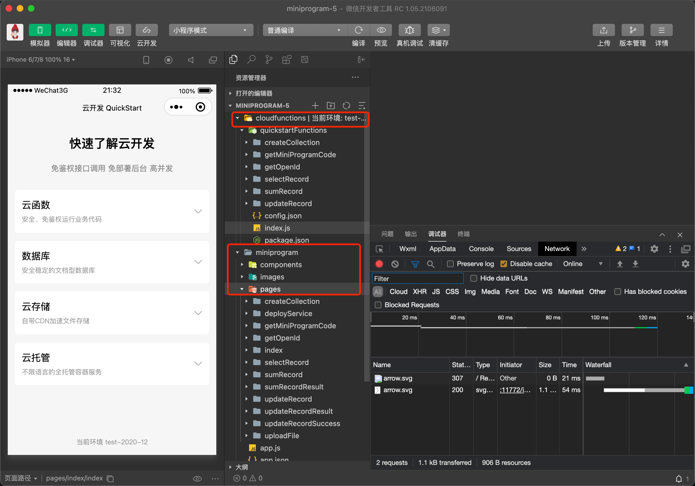
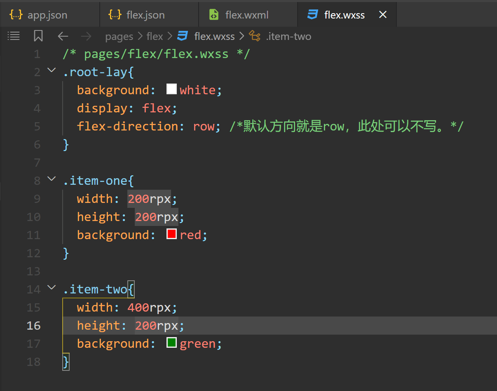
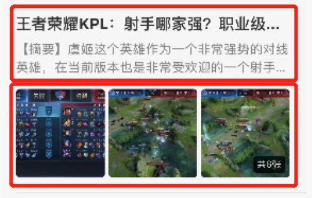
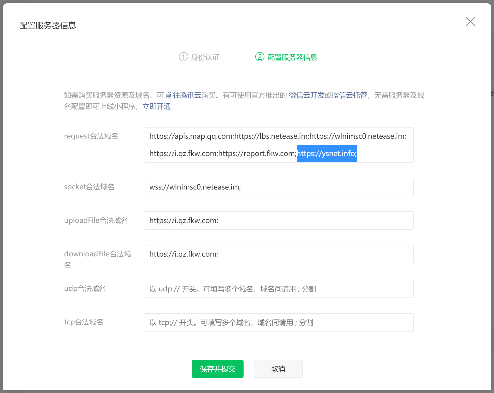
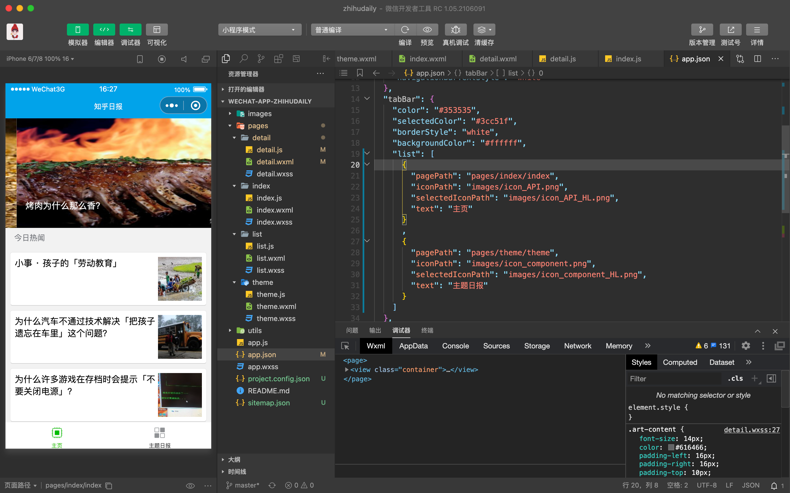
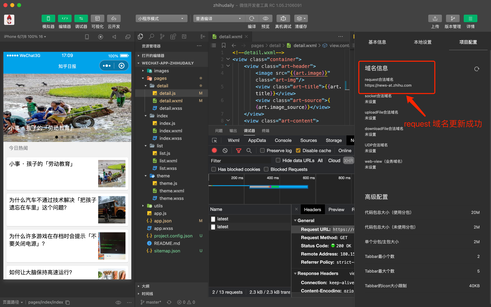

# 1.小程序入门介绍
---
微信小程序：一个不需要下载安装的应用，集成于微信环境。登录/注册地址：https://mp.weixin.qq.com（和公众号地址一样）

常见小程序类型：**普通小程序、微信小商店、商家小程序**。

微信小程序大致分为三大主体：

1. **个人主体**：每个人可以注册5个小程序，无需认证，永久免费。
   
2. **个体户主体**：个体户主体可以注册5个小程序，每个月可注册一个，每个小程序单独认证需要300元。
   
3. **企业主体**：企业主体可以注册50个小程序，每个月可注册5个，每个小程序单独认证需要300元

个体户/企业主体可以先认证一个公众号，然后从公众号复用资质注册小程序，是免300元认证费的。

具体操作：登陆公众号-小程序管理-添加-快速注册并认证小程序


小程序和公众号不一样，没有年审的概念，一次认证永久使用。

小程序是需要写代码的，不是说你注册完就能用

在开发小程序的时候，首先要定位一下我们的主体是否支持上线，别到时候开发完了，审核不通过。

> 指引：登录小程序后台-设置-服务类目-详情，去查看主体可用的类目。

比如说：个人类型的主体基本上只能做一些工具类型，不可以播放视频、不能做商城等等。

如果不会开发、或者不想学开发可以参考以下做法：

1. 开源网站去看看人家写好的源码，问作者能否自己上线使用，或者让作者帮你上线。
    + 优点：不用自己开发，看上后联系作者就能用。
    + 缺点：你想要某个功能不一定帮你做，碰到比较坑的作者，会各种套路你，让你交钱。

2. 去一些靠谱SAAS平台购买一些系统，例如：有赞、微盟、微擎等。
    + 优点：安全稳定，你提需求他们就会给你做。
    + 缺点：价格高。

3. 去一些网购平台买一些源码。
    + 优点：你不需要懂任何操作，他们会帮你全套上线。
    + 缺点：不能新增你想要的功能，源码大多数加密，基本上是以割韭菜为目的。

总结：有条件的自己开发或者找朋友一起开发，即便你不会开发，但是你最起码得看得懂基本代码。

> 小程序官方变现：当你的小程序被1000人访问后，在第二天开通流量主，然后在小程序里加入广告代码，再有用户访问你的小程序，点击你的广告，你就会有收益。


# 2.小程序从注册到发布
---
微信大力推小程序，小程序凭借着无需下载，随意删除，随意添加，使用方便，天然的便利性，越来越火。我们也紧跟时代潮流，开发小程序。

**本篇文章主要介绍微信小程序从注册到开发到发布的整个流程**

## 2.1 注册小程序
---
微信公众平台地址，右上方选择【立即注册】

https://mp.weixin.qq.com/

点击小程序，接下来填写信息


注册完成，需要邮箱激活，激活后还需要填写一些基本信息，我这里就不一一展示了，都完成后我们需要用到的是AppID(小程序ID)，在开发->开发设置中可以找到。进行下一步，开发。


**小程序取名注意事项：**

小程序的名字不要盲目去取名，如果你的小程序只是企业内部使用，无所谓名字，听领导建议即可。

但是，如果你想做小程序赚点￥，那么你得考虑好名字。一个好的小程序名字，可以给你带来很多自然流量，也就是用户搜关键字即可搜到你的小程序。

有了这个思路，那么我们该考虑的问题就是用户会搜什么关键字？此处极力推荐一个官方小程序：**微信指数**。

微信指数越高，也就代表关键词用户搜索的人数越多，这时我们就有了清晰的思路给你的小程序起名字了。


## 2.2 开发小程序
---
下载微信开发者工具，地址是：

https://developers.weixin.qq.com/miniprogram/dev/devtools/download.html

根据自己系统下载对应版本，安装就不过多说了。

点击 + 号，开始新建项目


项目名称、目录这个根据自己意向填写，AppID就是上面说要记住的，我们直接复制过来，这里简单说下后端服务这个选项，小程序云开发是新出的功能。

**开发者可以使用云开发开发微信小程序、小游戏，无需搭建服务器，即可使用云端能力**。

云开发为开发者提供完整的原生云端支持和微信服务支持，弱化后端和运维概念，无需搭建服务器，使用平台提供的 API 进行核心业务开发，即可实现快速上线和迭代，同时这一能力，同开发者已经使用的云服务相互兼容，并不互斥。


+ cloudfunctions目录是云函数目录
+ miniprogram目录是前端代码

小程序开发官方文档：https://developers.weixin.qq.com/miniprogram/dev/framework/

开发过程中可以选择模拟器、手机预览及真机调试


开发就写到这里，接下来测试及发布

## 2.3 测试及发布小程序
---
项目已经开发完成，编辑器右上角有个「上传」按钮


打开微信公众平台并登录，https://mp.weixin.qq.com/

点击版本管理，可以看到线上版本、审核版本、和开发版本。

点击上传按钮后，版本会出现在开发版本、这个版本可以设为体验版本，或者提交审核、审核通过后就可以直接发布线上。


微信小程序从注册、开发到发布流程到此结束，如果有不懂的地方或者写的不详细的，可在下方留言，针对问题会详细解答。


# 3.小程序代码结构介绍
---
在小程序开发中与网页开发虽然具有相似性，但仍然是有一些区别的，例如绑定事件的方式，处理事件等。

**pages** 下面创建的每个文件代表的就是一个页面，也是一个模块，各个模块页面之间相互独立，具有独立的结构，样式与逻辑。

它与一些现今的流行框架(Vue，React，Angular)一样，都是数据驱动视图的，也是组件化开发方式。

您将在本文中学习到
+ 小程序项目录结构
+ 关于JSON文件
+ 关于WXML文件
+ 关于WXSS文件
+ 关于JS文件

## 3.1 小程序的目录结构
---
对于开发一个新的应用，上来不是一顿的写代码，如果一开始，弄明白下面几件事情，对于后续的编写代码以及拓展应用都会从容得多。

+ 小程序的代码文件组织结构，以及每个文件代表的含义
+ 确定页面组件之间的边界
+ 数据的编写与设计

利用微信开发者工具初始化了一个小程序云开发的模板，基于这个初始化项目的目录进行二次开发



该初始化项目对应的目录结构如下所示:

```asciidoc
├─project.config.json // 工具配置文件,在工具上做的任何配置都会写入到这个文件
├─README.md     // 说明文档
├─miniprogram   // 小程序前台代码,前台开发的代码都是在这个目录进行开发
| ├─app.js    // 入口文件,是App的启动脚本,可以处理一些App启动过程中页面加载之前要处理的事情,可设置全局变量对象,可相当于Redux中store的作用
| ├─app.json    // 全局配置文件,配置包括window,页面,tab菜单栏等
| ├─app.wxss   // 项目公共样式,它会被注入到小程序的每个页面,全局起作用
| ├─sitemap.json // 页面收录设置,类似于网页的seo
| ├─style
| | └guide.wxss
| ├─pages    // 所有的页面组件都会在这个文件夹下,每个文件夹就是一个页面
| | ├─userConsole
| | | ├─userConsole.js
| | | ├─userConsole.json
| | | ├─userConsole.wxml
| | | └userConsole.wxss
| | ├─storageConsole
| | | ├─storageConsole.js
| | | ├─storageConsole.json
| | | ├─storageConsole.wxml
| | | └storageConsole.wxss
| | ├─openapi
| | | ├─openapi.js
| | | ├─openapi.json
| | | ├─openapi.wxml
| | | ├─openapi.wxss
| | | ├─serverapi
| | | | ├─serverapi.js
| | | | ├─serverapi.json
| | | | ├─serverapi.wxml
| | | | └serverapi.wxss
| | | ├─cloudid
| | | | ├─cloudid.js
| | | | ├─cloudid.json
| | | | ├─cloudid.wxml
| | | | └cloudid.wxss
| | | ├─callback
| | | | ├─callback.js
| | | | ├─callback.json
| | | | ├─callback.wxml
| | | | └callback.wxss
| | ├─index
| | | ├─index.js
| | | ├─index.json
| | | ├─index.wxml
| | | ├─index.wxss
| | | └user-unlogin.png
| | ├─im
| | | ├─im.js
| | | ├─im.json
| | | ├─im.wxml
| | | ├─im.wxss
| | | ├─room
| | | | ├─index.js
| | | | ├─room.js
| | | | ├─room.json
| | | | ├─room.wxml
| | | | └room.wxss
| | ├─deployFunctions
| | | ├─deployFunctions.js
| | | ├─deployFunctions.json
| | | ├─deployFunctions.wxml
| | | └deployFunctions.wxss
| | ├─databaseGuide
| | | ├─databaseGuide.js
| | | ├─databaseGuide.json
| | | ├─databaseGuide.wxml
| | | └databaseGuide.wxss
| | ├─chooseLib
| | | ├─chooseLib.js
| | | ├─chooseLib.json
| | | ├─chooseLib.wxml
| | | └chooseLib.wxss
| | ├─addFunction
| | | ├─addFunction.js
| | | ├─addFunction.json
| | | ├─addFunction.wxml
| | | └addFunction.wxss
| ├─images
| | ├─code-cloud-callback-config.png
| | ├─code-db-inc-dec.png
| | ├─code-db-onAdd.png
| | ├─code-db-onQuery.png
| | ├─code-db-onRemove.png
| | ├─code-func-sum.png
| | ├─console-entrance.png
| | └create-collection.png
| ├─components
| | ├─chatroom
| | | ├─chatroom.js
| | | ├─chatroom.json
| | | ├─chatroom.wxml
| | | ├─chatroom.wxss
| | | ├─dots.gif
| | | └photo.png
├─cloudfunctions // 云函数,相当于于我们的后台代码
| ├─openapi
| | ├─config.json
| | ├─index.js
| | └package.json
| ├─login
| | ├─config.json
| | ├─index.js
| | └package.json
| ├─echo
| | ├─config.json
| | ├─index.js
| | └package.json
| ├─callback
| | ├─config.json
| | ├─index.js
| | └package.json
```

minprogram文件夹是小程序的前台代码，在pages文件夹下的每个文件夹，都分别对应着不同的页面，一个页面由三部分组成，界面、配置和逻辑，分别由配置代码json文件、模板代码 wxml文件、样式代码 wxss文件以及逻辑代码 JavaScript文件组成。

小程序与网页开发对应的就是html，css，js，你可以把wxss前面的 wx 视作为 css ，而 wxml 的 wx 视作为 html ，它的作用与网页开发中的文件一样，wxml 承载着内容结构，而 wxss 负责样式，js 对应负责页面的交互逻辑。

但是需要注意的是，一个页面的文件必须需要放置在同一个目录下，同时描述页面的四个文件必须具有相同的路径与文件名，否则是会报错的，其中WXML文件和JS文件是必须存在的，JSON和WXSS文件是可选的。

> 注意: 每新增一个页面模块，都需要在小程序代码根目录app.json中的pages字段声明，否则这个新增的页面不会被注册到小程序环境中。

在小程序开发中，都是以组件化开发的方式进行的，将原先的 div，p，span，img 等标签元素封装成了具有特定语义的组件，view 就相当于 div ，ul ，li 等块级元素，text 就相当于 span 行内元素，而 image 对应的就是img图片。

## 3.2 关于JSON文件需要知道
---
小程序的页面中的json文件是当前页面的配置文件，可以用于配置小程序窗口表现、设置多tab等。

JSON文件都是被包裹在一个大括号中 {}，通过key-value的方式来表达数据，其实它是用代码的方式对当前页面的一个描述，但是以下几点是需要知道的：

+ JSON的Key必须包裹在一个双引号中，不能是单引号。
+ 数据值的格式可以是，数字，字符串，Bool值(true或者false)，数组.对象，null，不能是undeifned，否则就会报错。
+ JSON里面也不能写注释，否则是会报错的。

## 3.3 关于WXML文件需要知道
---
WXML 全称是 WeiXin Markup Language，是小程序框架设计的一套标签语言，结合小程序的基础组件、事件系统，可以快速构建出页面的结构。

这里推荐几个比较实用的**微信小程序UI组件库**(仅供参考)：

+ WeUI组件库(微信官方设计团队和小程序团队推出的) https://developers.weixin.qq.com/miniprogram/dev/extended/weui/
+ Vant Weapp(有赞团队出品)[vant webapp](https://youzan.github.io/vant-weapp/#/intro](https://youzan.github.io/vant-weapp/#/intro)
+ lin-ui(七月大佬出品) http://doc.mini.7yue.pro/
+ ThorUI，也是一个开源的UI组件库，但是个人觉得文档不是特别全，但是研究里面的一些模板组件的封装实现，还是不错的 http://www.donarui.com/ … 这种小程序的UI组件库有很多，大家可以多去github上或者技术社区里多搜搜的，就会有意外的惊喜的

至于选择什么样的开源的组件库，视自己的项目而定，如果是个人小程序，完全可以选用一些第三方的UI组件库，快速搭建页面的，也可以自己手撸一个的，但是自己还是要会封装组件的。

一个完整的WXML语句由一段开始标签和一段结束标签组成，在标签中可以是内容，也可以是其他的 WXML 语句

这一点上同 HTML 是一致，但有所不同的是，WXML 要求标签必须是严格闭合的，没有闭合将会导致编译错误。

## 3.4 关于WXSS文件需要知道的
---
+ 每个页面下都有相对应的 wxss 文件，优先级大于 app.wxss，你可以把定义在组件内的样式视作为内联样式，并且它只会对当前页面起作用，而外部的 app.wxss 视作为类 class，公共全局的样式，它对 pages 目录下面的所有页面都是起作用的
+ 选择器支持 after，before 伪类，但是不支持 first-child，last-child，nth-child 这类伪类
+ wxss是不支持大括号嵌套({{}})的，也就是说 key-frames，css animation 不可用，但是 transition 是可以用的
+ wxss 不能使用本地资源，在给 wxml 元素添加背景图片时，background-image 属性，无法使用本地图片(相对路径或者绝对路径)的方式引用图片，但可以使用网络图片(携带http协议的)，base64 格式图片，Image组件却是支持的
+ wxss 的样式不支持级联，比如 .class1 p 这种形式的
+ 不支持引入字体

**引入样式的方式**

+ 默认方式:默认的样式文件是[页面名].wxss，当前页面的样式都可以写在该文件里
+ 样式导入:使用 @import 语句可以导入外部样式
+ 内联样式:使用 style，class 属性控制组件的样式

**尺寸单位**

支持百分比，像素，rpx，rem，em 5种尺寸单位，如果是固定像素，页面元素尺寸不会变的话，那么用px的，在各个机型保持一致的话，比如:高度height属性值


小程序当中使用的像素单位，官方推荐使用rpx，一般以一个设备375px为基准的，也就是iphone6作为视觉稿的标准，对应的就是1px = 2rpx的。

## 3.5 关于JS文件需要知道的
---
小程序的js文件代表的是页面的逻辑，它负责页面的交互，一个应用仅仅只有界面展示是不够的，还需要和用户做交互:例如响应用户的点击、获取用户的位置等等。

在小程序里边，我们就通过编写 JS 脚本文件来处理用户的操作。

**数据绑定**

WXML 通过 {{变量名}} 来绑定 WXML 文件和对应的 JavaScript 文件中的 data 对象属性，它是利用双大括号，将视图view与页面的数据data绑定关联起来的

例如:
如下所示，在 wxml 模板中：

```xml
<!--pages/wxml/index.wxml--> 
<view>{{time}}</view>
```

在js中：

```js
// pages/wxml/index.js 
Page({   
/** 页面的初始数据 */   
    data: {     
        time: (new Date()).toLocaleDateString() 
        // 页面会展示出当前的时间，年/月/日   
    },
})
```

Page是小程序页面的实例对象，Page() 构造器用来注册一个小程序页面，接受一个Object参数，其中data属性是当前页面WXML模板中可以用来做数据绑定的初始数据，凡是需要渲染到页面上的，则在data中进行初始化。

**注意事项:**

+ 直接修改 Page实例的this.data 而不调用 this.setData 是无法改变页面的状态的，还会造成数据不一致，也就是修改页面的数据，只能通过this.setData()方法
+ 不要把data中的任意一项的value设为undefined，否则可能会有引起一些不可预料的bug
+ 与界面渲染无关的数据最好不要设置在data中，可以考虑设置在page对象的其他字段下

**代码风格**

+ 箭头函数（应当多用，替代let that = this)避免了在函数内增加冗余的代码
+ let const支持 ES6 定义变量的写法
+ 模板字符串(反引号)，替代(+)加号字符串的拼接，在路由跳转传递参数时，经常会遇到
+ 支持 promise，以及 async，await..

由于小程序支持 ES6 的写法，但是不同的平台的小程序的脚本执行环境也是有所区别的，小程序目前主要可以运行在**三大平台**上：

1. iOS平台，包括iOS12、iOS13、iOS14
2. Android平台
3. 小程序IDE

这种区别主要是体现三大平台实现的 ECMAScript 的标准有所不同，目前开发者大部分使用的是 ECMAScript 5 和 ECMAScript 6 的标准，但是在小程序中， iOS9和iOS10 所使用的运行环境并没有完全的兼容到。

**ECMAScript 6 标准**

一些 ECMAScript 6 中规定的语法和关键字是没有的或者同标准是有所不同的，如果发现有些代码在旧的手机操作系统上出现一些语法错误。

为了帮助开发者解决这类问题，小程序IDE提供语法转码工具帮助开发者，将 ECMAScript 6代码转为 ECMAScript 5代码，从而在所有的环境都能得到很好的执行。

开发者需要在项目设置中，勾选 ES6 转 ES5 开启此功能，就可以了：
菜单栏–>详情–>本地设置–>Es6转Es5(勾选)


## 3.6 实战操练
---

### 3.6.1 app.wxss
---
**设置全局背景色**

在 app.wxss 文件内，为 contain类添加 background-color: yellow; 属性。将背景设置为黄色。


编译后右侧首页就会呈现黄色。


**设置局部背景色**

在 index.wxss 中，增加一个 container类，添加 background-color: green; 属性，将 index 页面背景色设置为绿色。


在模拟器中，首页的背景色已经变为绿色。


当你点击头像，进入 logs 页面时，你会发现全局背景色仍然保持黄色。这就是前面提到的全局和局部的优先级关系。


### 3.6.2 app.json
---
**设置下拉刷新效果**

app.json 里存放着全局配置，想 page 内饰界面路径，window 是窗口设置。


例如，将下拉刷新属性设置为：”enablePullDownRefresh”: true, 下拉样式设置为深色 “backgroundTextStyle”:”dark”,（设为浅色的话，会因为背景底色是浅色的，导致动画效果不可见）

下拉后就会显示下拉刷新效果：


JSON文件仅能包含数据，不能包含像编程语言中那样的注释。所以调试区报了四个错误。

### 3.6.3 如何新建页面【重点】
---
1、方法一 **【推荐】** ：

在全局配置文件 app.json 的 pages 里，首行添加 “pages/test/test”, 。开发者工具会自动在目录位置生成文件，同时模拟器的首页变为名为 test 的页面（显示的内容就是 test.wxml 内代码，<–! –>内是注释，编译时忽略不显示。是HTML标签，用于生成页面结构，编译时也不会显示。详细的代码布局会在下节讲解）。


**代码解释：**


+ pages 是页面存放路径，推荐所有页面都放在 pages 文件下，方便组织。
+ 第一个 test 是页面文件夹，一个文件夹就代表一个单独的页面，底下会有四个文件。命名一般和页面起到的功能保持一致，
+ 第二个 test 是页面文件名，推荐和页面文件夹同名，在开发时通过文件名就知道自己在开发哪个页面。没有后缀是因为编译时，会自动按照 json->wxml->wxss->js 的顺序加载文件。故自己自建文件时，要注意四个页面文件保持同名。

2、方法二：

右键 pages 文件夹，点击新建Page。


填入页面名就好，开发者工具会自动生成并配置页面文件夹、四个页面文件和界面路径。


**“navigationBarTitleText”: “Weixin”** 负责导航栏标题，将内部 Weixin 修改为“猥琐发育”，看看效果。


**“navigationBarTextStyle”:”black”** 负责导航栏字体样式，将其修改为 white 看看效果。


不用将每个属性都牢记于心，官方文档都有介绍，忘记时访问 [页面配置 | 微信开放文档](https://developers.weixin.qq.com/miniprogram/dev/reference/configuration/page.html#%E9%85%8D%E7%BD%AE%E9%A1%B9) 就行。

最好将官网文档地址收藏，之后加深对一门语言或框架的了解，勤读官方文档是不可避免的。

## 3.7 结语
---
本小节主要讲述了小程序的初始代码结构，构建一个页面(组件)应该有哪几个文件，每个文件具体代表什么含义，以及编写WXML，WXSS，JS等的一些注意事项，以及实战操练的一个小案例。

对于编写样式，用官方或者第三方的一些UI组件库，快速的编写UI页面也是可以的，自己写样式也没问题，这个根据项目和公司的产品而定，如果已经有UI设计，那肯定是自己手写，按照UI提供的设计稿而来的。

至于自己个人的小程序用哪种方式都可以，更推荐使用主流的开源UI 组件库。


# 4.小程序 Flex 布局
---

## 4.1 前言
---
对于小白而言，首先要理解，为什么前端要有几种不同的文件。推荐阅读：[新手理解HTML、CSS、javascript之间的关系](https://www.cnblogs.com/feng9exe/p/6126236.html) 。简单一句话来说，**网页是分成三个层次的，即：结构层(HTML)、表示层(CSS)、行为层(Javascript)。**

微信小程序也属于前端，文件构成包括语法都一脉相承。只不过为了安全性，腾讯从底层对各个功能进行了封装，命名前加上 WX ，以示与 web前端的区分。

### 4.1.1 WXML
---
组件是微信小程序官方以 HTML 为基础封装的 WXML 标签，基本用法也和 HTML 标签一致。遇上不清楚功能的标签，直接去 [视图容器 | 微信开放文档](https://developers.weixin.qq.com/miniprogram/dev/component/) 搜索即可，不需要死记硬背。

微信客户端扫码，能快速体验各个原生组件的效果。


是最基础的标签，称为视图容器。就想钢筋混凝土，作为框架承载内部实现各个功能的组件。它是一个“双标签”，是开始标签， 是结束标签，区别就在加上个 / 。

有“双标签”就有“单标签”，link标签就是单标签，不需要结束标签。

各个标签相互平行或嵌套，共同构成 wxml 文件。点开index.wxml，看看结构，觉得结构太复杂看不懂，可以点击“>”，将内部嵌套的代码展开或收缩。收缩后，代码结构就很清晰简单。外部 container 作为容器，内部 userinfo 和 usermotto，用来展示用户信息和用户座右铭。


### 4.1.2 WXSS
---
WXSS 和 CSS 基本没差，由于小程序要运行在各种不同分辨率的设备上，为了简化适配过程。小程序直接定义“尺寸单位”，规定屏幕宽都为750rpx，实机运行时，再根据实际物理像素进行换算。换算过程推荐阅读：[WXSS | 微信开放文档](https://developers.weixin.qq.com/miniprogram/dev/framework/view/wxss.html) 。

语法推荐阅读：[语法-CSS（层叠样式表）| MDN](https://developer.mozilla.org/zh-CN/docs/Web/CSS/Syntax) 。

WXML标签是有属性的，可以将标签渲染成不同的视觉效果。为了方便，统一用WXSS存储渲染信息。

属性信息以“键值对”的形式存储，像我们在 index.wxss 文件里编写过的，为 background-color（背景颜色）属性赋值 green。

要是有多条属性怎么办，用“{}”包裹，称为声明块。这一块内的属性都会赋值给相同的 WXML 标签。

左大括号前面是选择器，可以根据选择规则，将属性赋给一群 WXML 标签。

整个CSS基础介绍推荐阅读：[03-CSS样式表和选择器](https://github.com/qianguyihao/Web/blob/master/02-CSS%E5%9F%BA%E7%A1%80/03-CSS%E6%A0%B7%E5%BC%8F%E8%A1%A8%E5%92%8C%E9%80%89%E6%8B%A9%E5%99%A8.md) 。这个库也是很有名的前端入门教程。


### 4.1.3 JS
---
JS文件没有变动，读读 JavaScript 入门教程就行，推荐阅读 [04-JavaScript基础](https://github.com/qianguyihao/Web/tree/master/04-JavaScript%E5%9F%BA%E7%A1%80) 。本节介绍的 flex布局主要涉及 WXML 和 WXSS，不涉及逻辑，JS 后面使用到再细讲。

## 4.2 flex布局
---
布局是前端很重要的内容。就像 word 文档里的排版，各个显示元素之间的“排版”都要由你来设计实现。

常见的基础布局有三种：**水平布局、垂直布局、混合布局**。

**水平布局：**


**垂直布局：**


**混合布局：**


混合布局，红框间元素为垂直布局，黄框间元素为水平布局，蓝框间元素又为垂直布局。

flex布局是一种布局实现方案，就如它的命名一样，布局非常灵活，可轻松适配不同的机型。

下面来看看在WXML文件里，怎么利用flex布局实现水平和垂直布局。

**水平布局：**

```asciidoc
.lay{
  display: flex;
  flex-direction: row; /*row：行，排列方式就是水平的*/
}
```

**垂直布局：**

```asciidoc
.lay{
  display: flex;
  flex-direction: column; /*column：列，排列方式就是垂直的*/
}
```

首先要为 display 属性设置为 flex。这样被 lay类 渲染过的容器，布局方式就是flex布局。之后用 flex-direction 定义布局方向，row 就是水平布局；column 就是垂直布局。

利用felx布局实现水平/垂直居中也十分方便，只要跟下面的代码一样，添加两行属性即可。不了解注释里面写的主轴、交叉轴，推荐阅读 [Flex布局教程：语法篇 - 阮一峰的网络日志](https://www.ruanyifeng.com/blog/2015/07/flex-grammar.html) 。没有什么难的，这就像以前学x轴y轴一样，了解下定义就行。

```asciidoc
.lay{
  display: flex;
  flex-direction: row/column; /*布局方向二选一，不要都填。*/
  justify-content: center; /*主轴居中*/
  align-items: center; /*交叉轴居中*/
}
```

## 4.3 实战
---

### 4.3.1 新建页面
---
依照 [2-3 小程序目录结构介绍](https://www.yuque.com/wangcaihua/pdh9dx/nuynbx) 的方法新建页面。
为 app.json 的 pages 参数添加 “pages/flex/flex”, 路径。（注意：将路径放倒第一位，这样编译后的首页就是flex布局页面）


### 4.3.2 修改页面导航栏标题
---
在 flex.json 文件内，将页面标题修改为 flex 布局。

```asciidoc
{
  "navigationBarTitleText": "flex布局",
  "usingComponents": {}
}
```

### 4.3.3 创建组件
---
布局是相对于组件而言的，内部有组件我们才能进行布局，先在 flex.wxml 里创建几个组件。

写下 view.root-lay>view.item-lay*3 ，按回车，开发者工具会迅速生成下图代码。


这里用到是Emmet插件，有兴趣可以阅读下：[Emmet-前端开发神器](https://segmentfault.com/a/1190000007812543) ，简化编写代码的过程。微信开发者工具就自带这个插件，无需另外安装。

当然你也可以自己打 view 标签，然后给它添加 class 属性。

### 4.3.4 添加属性
---
没有设置属性，view 视图容器是不可见。下面就要为其添加属性。

在 flex.wxss 文件内添加下面代码，看看效果。

```asciidoc
.root-lay{
  background: white;
  display: flex;
  flex-direction: row; /*默认方向就是row，此处可以不写。*/
}

.item-lay{
  background: red;
  width: 200rpx;
  height: 200rpx; /*设置宽高为200rpx*/
  margin-left: 20rpx; /*添加左边距，可以尝试删除看看没有边距的效果*/
}
```

三个子容器呈现水平布局排列，当然你也可以修改 flex-direction 的值，将其给为column（垂直布局）。别忘记添加上边距（margin-top: 20rpx），将三个元素分隔开。


### 4.3.5 混合布局
---
**外围框架搭建**

按照混合布局的图例，尝试仿制一个。

将之前 flex.wxml 里面码的代码全部删除，改为下面图片展示的。


flex.wxss 里面的代码也改为下面展示的。



基本的外围框架就搭好了，可以看到还原度还是挺高的。


item-tow里要继续容纳容器的，而且对齐方向是垂直的。还得给它添加两个属性：

```asciidoc
.item-two{
  width: 400rpx;
  height: 200rpx;
  background: green;
  display: flex;
  flex-direction: column;
}
```

**内部文字排版**

给item-two嵌套进两个文字容器

```asciidoc
<view class="root-lay">
  <view class="item-one"></view>
  <view class="item-two">
    <view class="text-one">标题</view>
    <view class="text-two">内容内容内容</view>
  </view>
</view>
```

给两个文本容器添加背景色

```asciidoc
.text-one{
  background: yellow;
}

.text-two{
  background: chocolate;
}
```

看到效果图如下，和图例有点差别，因为内部两文本是在左上角的。


给父容器 item-two 添加个 justify-content: center; 属性，让两个子容器在主轴方向上居中。

**添加图片**

将有item-one类的view标签改为image标签，添加 src 属性，该属性内放的就是图片链接。图片链接是随便百度的，省事可以直接 copy 底下的图片链接。

```asciidoc
<image class="item-one" src="https://tse1-mm.cn.bing.net/th/id/R-C.5ff99508f3c939a65ab3efa2f385cb59?rik=mz5JI8GvpUveAw&riu=http%3a%2f%2fimage.bbs.bamengame.com%2f14028858-823b-49fd-b285-b88e76c19fdf.jpg&ehk=JD7qPFZDjYZdbrElVggk6t9J4uYbiMsQkVIdYia%2fov8%3d&risl=&pid=ImgRaw&r=0"></image>
```

图片尺寸看起来很奇怪，这里就要改变它的缩放格式。

去官方文档看看，要怎么修改图片的缩放属性 [image | 微信开放文档](https://developers.weixin.qq.com/miniprogram/dev/component/image.html)


mode属性可以修改图片的裁剪、缩放模式。接着向下拉，看看mode属性支持哪些值。


scaleToFill是默认的缩放模式，看其他四种缩放模式的介绍可能有点迷糊，直接去开发者工具，一个个填进去看看效果的。拼命去阅读理解，不如直接上手。编程学习过程是实践性很强的，读一百字，不如自己上手实践印象深刻。

尝试下来，可以看到aspectFill缩放模式比较符合要求。

```asciidoc
<image class="item-one" src="https://tse1-mm.cn.bing.net/th/id/R-C.5ff99508f3c939a65ab3efa2f385cb59?rik=mz5JI8GvpUveAw&riu=http%3a%2f%2fimage.bbs.bamengame.com%2f14028858-823b-49fd-b285-b88e76c19fdf.jpg&ehk=JD7qPFZDjYZdbrElVggk6t9J4uYbiMsQkVIdYia%2fov8%3d&risl=&pid=ImgRaw&r=0" mode="aspectFill"></image>
```

**设置边距，分离元素**

基本结构比较像图例了，接下来就是不断完善细节。图例里面的元素之间都有留白。接下来添加元素间的边距，制造留白效果。

在flex.wxss里，为item-two类添加 margin-left: 24rpx; （左边距24rpx）， item-one类添加 margin-left: 16rpx;（左边距16rpx）。

为什么边距要设为16/24 rpx，推荐阅读：[微信小程序设计指南 | 微信开放文档](https://developers.weixin.qq.com/miniprogram/design/#%E5%88%97%E8%A1%A8) 。就像做PPT要符合模板的样式添加元素，小程序的制作中也推荐符合设计规范，这样你可以制作出更具美感的小程序。

**添加圆角**

给item-one类添加 border-radius: 8rpx; 。可以看到图片的四角变成了半径为8rpx的圆角。

觉得效果不明显，你还可以进一步增大圆角的半径。

**调整字体**

将之前设置的背景色全部去掉，给text-two添加：
+ color: grey;
+ font-size: 32rpx;

这样就呈现出了标题大，内容小的视觉效果。基本上和图例比较一致。

以这个demo粗略展示前端界面的调试过程，不用担心前端怎么这么多属性和值，哪个功能记不住之类的。勤去阅读文档，一步步慢慢调试。

下节将带你一步步慢慢实现王者荣耀小程序的界面。


## 4.4 完整代码
---
出问题的小伙伴可以对照下面完整代码纠错，看看是哪里编写错误了。

```xml
<!--pages/flex/flex.wxml-->
<view class="root-lay">
  <image class="item-one" src="https://tse1-mm.cn.bing.net/th/id/R-C.5ff99508f3c939a65ab3efa2f385cb59?rik=mz5JI8GvpUveAw&riu=http%3a%2f%2fimage.bbs.bamengame.com%2f14028858-823b-49fd-b285-b88e76c19fdf.jpg&ehk=JD7qPFZDjYZdbrElVggk6t9J4uYbiMsQkVIdYia%2fov8%3d&risl=&pid=ImgRaw&r=0" mode="aspectFill"></image>
  <view class="item-two">
    <view class="text-one">标题</view>
    <view class="text-two">内容内容内容</view>
  </view>
</view>
```

```asciidoc
/* pages/flex/flex.wxss */
.root-lay{
  background: white;
  display: flex;
  flex-direction: row; /*默认方向就是row，此处可以不写。*/
}

.item-one{
  width: 200rpx;
  height: 200rpx;
  /* background: red; */
  margin-left: 16rpx;
  border-radius: 8rpx;
}

.item-two{
  width: 400rpx;
  height: 200rpx;
  /* background: green; */
  display: flex;
  flex-direction: column;
  justify-content: center;
  margin-left: 24rpx;
}

.text-one{
  /* background: yellow; */
}

.text-two{
  /* background: chocolate; */
  color: grey;
  font-size: 32rpx;

}
```


# 5.小程序页面样式
---

## 5.1 需求
---
经过前面几节的小程序基础介绍，今天就结合所学，创建一个本地应用，实现如下图的列表界面。


👆该图来自于王者荣耀小程序的攻略区

## 5.2 分析
---

### 5.2.1 所需组件
---
拿到需求之后，首先要去分析它。分析要怎么实现它，需要用到哪些功能。

可以看出整个页面是由一条一条的消息条组成的，每个小单元又分为文本区和图片区。



text 和 image 这两个组件肯定要使用到了，可以先去官方文档看看组件介绍。

### 5.2.2 布局
---
红框元素间是垂直布局，黄框间元素是水平布局。


## 5.3 实操
---

### 5.3.1 新建页面+填充HTML
---
根据[2-3 小程序目录结构介绍](https://www.yuque.com/wangcaihua/pdh9dx/nuynbx) ，新建uipage页面。

在 uipage.json 里把标题修改为“王者荣耀”。

```asciidoc
{
  "usingComponents": {},
  "navigationBarTitleText": "王者荣耀"
}
```

在 uipage.wxml 里搭建大致元素结构。

```xml
<!--pages/uipage/uipage.wxml-->
<view class="root-lay">
  <text class="title"></text>
  <text class="content"></text>
</view>
```

文本是要自己填充的，填充点自己喜欢的文字。

```xml
<!--pages/uipage/uipage.wxml-->
<view class="root-lay">
  <text class="title">网易云音乐热评《可乐》 赵欲辰</text>
  <text class="content">愿你下一场爱情，是棋逢对手，是势均力敌，是长久牢固，是白首不相离。</text>
</view>
```

### 5.3.2 获取 & 设置字色
---
接下来就是设置文字的样式。怎么知道样图里文字的色号那，可以用 [在线PS](https://ps.gaoding.com/) ，吸管取色。
也可以利用微信客户端自带的截屏功能，Alt+A，鼠标所指位置就会显示出RGB参数。


在uipage.wxss中添加上。

```asciidoc
.title{
  color: rgb(53, 53, 53);
  font-size: 32rpx;
  font-weight: bold;  
}

.content{
  color: #888888; /
  font-size: 28rpx;
}
```

遇到多条属性，不太了解效果。可以使用 Crtl+？ ，将其中一条注释掉，看看缺失掉了什么效果，就知道他起什么作用了。

### 5.3.3 主体居中
---
两边是有边距的，接下来修改修改边距，同时给文本定下位。

在 root-lay 下层定义一个 item-lay，用来承装标题和内容，边距和布局在该元素属性内设置。

```xml
<!--pages/uipage/uipage.wxml-->
<view class="root-lay">
  <view class="item-lay">
    <text class="title">网易云音乐热评《可乐》 赵欲辰</text>
    <text class="content">愿你下一场爱情，是棋逢对手，是势均力敌，是长久牢固，是白首不相离。</text>
  </view>
</view>
```

设置宽度为 90 vw（Viewport Width），vw 是视图窗口宽度，小程序内可以简单理解为屏幕宽度，屏幕宽度是根据使用极性决定的，根据不同机型自动适配。90 vw 代表元素宽度是屏幕宽度的 90%。同理，也有 vh (Viewport Height)，就是屏幕高度。

```asciidoc
.item-lay{
  width: 90vw;
  display: flex;
  flex-direction: column;
}
```

在 root-lay 上添加居中属性

```asciidoc
.root-lay{
  display: flex;
  flex-direction: column;
  align-items: center;
}
```

### 5.3.4 增加间距
---
标题和内容中间是有间隔的。

给content加个顶部间距，将 title 和 content 分隔开。

```asciidoc
.content{
  color: #888888;
  font-size: 28rpx;
  margin-top: 16rpx;
}
```

正常情况，设计前端界面会有设计稿，上面有各个各个元素间的间距，自己做demo时没有，凭感觉分隔开即可。做到不紧凑、也不至于稀疏。

### 5.3.5 增加图片
---
再写个 view 装载底下水平布局的图片。

```xml
<!--pages/uipage/uipage.wxml-->
<view class="root-lay">
  <view class="item-lay">
    <text class="title">网易云音乐热评《可乐》 赵欲辰</text>
    <text class="content">愿你下一场爱情，是棋逢对手，是势均力敌，是长久牢固，是白首不相离。</text>

    <view class="img-lay">
      <image class="img"></image>
      <image class="img"></image>
      <image class="img"></image>
    </view>
  </view>
</view>
```

如果遇上编写代码格式有点乱。可以使用格式化代码，windows 快捷键：Ctrl + Shift + F。Mac 快捷键是：Shift + Option + F。

顶部功能栏->设置->快捷键设置->格式化代码，可以修改默认的快捷键。

本机实践时，快捷键可能有冲撞，导致效果不是很好。你也可以在代码界面右键点击“格式化文档”，也能快速格式化代码。


### 5.3.6 设置图片样式
---
元素没有宽高是不可见的。接下来给 img-lay 设置属性。

为了保持兼容性，使用25vw、25vw。这样三图片并排时，间隔空间“恰如其分”。

```asciidoc
.img{
  width: 25vw;
  height: 25vh;
  background: green;
  margin-right: 10rpx;
  margin-top: 18rpx;
  border-radius: 10rpx;
}
```

这里边框直接四角全部圆角，可以自己尝试下 border-top-left-radius 等各个属性单独设置单个角的属性。

### 5.3.7 插入图片
---
剩下就是插入图片了，直接去官方文档查查，要怎么插入图片


要用的就是src，支持本地和网络链接。这里只用网络的，之后再讲怎么用本地的。

插入图片链接：

```asciidoc
<image class="img" src="https://gimg2.baidu.com/image_search/src=http%3A%2F%2Fimg.yoyou.com%2Fuploadfile%2F2019%2F0415%2F20190415084929729.jpg&refer=http%3A%2F%2Fimg.yoyou.com&app=2002&size=f9999,10000&q=a80&n=0&g=0n&fmt=jpeg?sec=1636099172&t=c1ea85da8df710fe4e427b2a6d3a7c05"></image>
<image class="img" src="https://gimg2.baidu.com/image_search/src=http%3A%2F%2Fdingyue.nosdn.127.net%2FzYGwfmzwCPqNxnW7pa0ktptrh4HYPSF1l07A0M6QCiVi11553408067591compressflag.jpeg&refer=http%3A%2F%2Fdingyue.nosdn.127.net&app=2002&size=f9999,10000&q=a80&n=0&g=0n&fmt=jpeg?sec=1636099248&t=e8aa247d0cab4c270e568a9bcad1d9db"></image>
<image class="img" src="https://img1.baidu.com/it/u=4012893905,2032265396&fm=26&fmt=auto"></image>
```

链接都是网络找的网图，你会发现在比例变得失调，还记得 [之前学的](https://www.yuque.com/wangcaihua/pdh9dx/izgcvf#A7tz7) 利用mode属性调整图片的缩放方式吗。

```asciidoc
<image class="img" mode="aspectFill" src="https://gimg2.baidu.com/image_search/src=http%3A%2F%2Fimg.yoyou.com%2Fuploadfile%2F2019%2F0415%2F20190415084929729.jpg&refer=http%3A%2F%2Fimg.yoyou.com&app=2002&size=f9999,10000&q=a80&n=0&g=0n&fmt=jpeg?sec=1636099172&t=c1ea85da8df710fe4e427b2a6d3a7c05"></image>
<image class="img" mode="aspectFill" src="https://gimg2.baidu.com/image_search/src=http%3A%2F%2Fdingyue.nosdn.127.net%2FzYGwfmzwCPqNxnW7pa0ktptrh4HYPSF1l07A0M6QCiVi11553408067591compressflag.jpeg&refer=http%3A%2F%2Fdingyue.nosdn.127.net&app=2002&size=f9999,10000&q=a80&n=0&g=0n&fmt=jpeg?sec=1636099248&t=e8aa247d0cab4c270e568a9bcad1d9db"></image>
<image class="img" mode="aspectFill" src="https://img1.baidu.com/it/u=4012893905,2032265396&fm=26&fmt=auto"></image>
```

### 5.3.8 增加消息间距
---
图例消息可以铺满整个页面，但是你只有一条信息。

那就先把上面搭的结构重复四次看看效果。


不同条信息之间完全没有间隔，堆叠在一起，尝试加间距把不同信息分隔开

给title加个顶部边距：

```asciidoc
.title{
  color: rgb(53, 53, 53);
  font-size: 32rpx;
  font-weight: bold; 
  margin-top: 24rpx;  /*加个顶部边距*/
}
```

**编译后看看效果：**


不同条消息间是分隔开了，但是顶条的消息上面也出现的空白，这显然不是理想的解决方案。

那就在底部添加边距吧。在img类添加条 margin-bottom: 24rpx; ，顺便把设置的背景色去掉。

```asciidoc
.img{
  width: 25vw;
  height: 25vw;
  /* background: green; */
  margin-right: 10rpx;
  margin-top: 18rpx;
  border-radius: 10rpx;
  margin-bottom: 24rpx; 
}
```

顶头的消息没空白了，而且和下面拉开间距。


这还只是放置四条消息，如果我们有一百多条消息那，不可能提前把所有结构都在 HTML 内写好。

下节就来讲解 for 循环，利用 for 循环无限的生成列表。

## 5.4 完整代码
---
```xml
<!--pages/uipage/uipage.wxml-->
<view class="root-lay">
  <view class="item-lay">
    <text class="title">网易云音乐热评《可乐》 赵欲辰</text>
    <text class="content">愿你下一场爱情，是棋逢对手，是势均力敌，是长久牢固，是白首不相离。</text>

    <view class="img-lay">
      <image class="img" mode="aspectFill" src="https://gimg2.baidu.com/image_search/src=http%3A%2F%2Fimg.yoyou.com%2Fuploadfile%2F2019%2F0415%2F20190415084929729.jpg&refer=http%3A%2F%2Fimg.yoyou.com&app=2002&size=f9999,10000&q=a80&n=0&g=0n&fmt=jpeg?sec=1636099172&t=c1ea85da8df710fe4e427b2a6d3a7c05"></image>
      <image class="img" mode="aspectFill" src="https://gimg2.baidu.com/image_search/src=http%3A%2F%2Fdingyue.nosdn.127.net%2FzYGwfmzwCPqNxnW7pa0ktptrh4HYPSF1l07A0M6QCiVi11553408067591compressflag.jpeg&refer=http%3A%2F%2Fdingyue.nosdn.127.net&app=2002&size=f9999,10000&q=a80&n=0&g=0n&fmt=jpeg?sec=1636099248&t=e8aa247d0cab4c270e568a9bcad1d9db"></image>
      <image class="img" mode="aspectFill" src="https://img1.baidu.com/it/u=4012893905,2032265396&fm=26&fmt=auto"></image>
    </view>
  </view>
</view>

<view class="root-lay">
  <view class="item-lay">
    <text class="title">网易云音乐热评《可乐》 赵欲辰</text>
    <text class="content">愿你下一场爱情，是棋逢对手，是势均力敌，是长久牢固，是白首不相离。</text>

    <view class="img-lay">
      <image class="img" mode="aspectFill" src="https://gimg2.baidu.com/image_search/src=http%3A%2F%2Fimg.yoyou.com%2Fuploadfile%2F2019%2F0415%2F20190415084929729.jpg&refer=http%3A%2F%2Fimg.yoyou.com&app=2002&size=f9999,10000&q=a80&n=0&g=0n&fmt=jpeg?sec=1636099172&t=c1ea85da8df710fe4e427b2a6d3a7c05"></image>
      <image class="img" mode="aspectFill" src="https://gimg2.baidu.com/image_search/src=http%3A%2F%2Fdingyue.nosdn.127.net%2FzYGwfmzwCPqNxnW7pa0ktptrh4HYPSF1l07A0M6QCiVi11553408067591compressflag.jpeg&refer=http%3A%2F%2Fdingyue.nosdn.127.net&app=2002&size=f9999,10000&q=a80&n=0&g=0n&fmt=jpeg?sec=1636099248&t=e8aa247d0cab4c270e568a9bcad1d9db"></image>
      <image class="img" mode="aspectFill" src="https://img1.baidu.com/it/u=4012893905,2032265396&fm=26&fmt=auto"></image>
    </view>
  </view>
</view>

<view class="root-lay">
  <view class="item-lay">
    <text class="title">网易云音乐热评《可乐》 赵欲辰</text>
    <text class="content">愿你下一场爱情，是棋逢对手，是势均力敌，是长久牢固，是白首不相离。</text>

    <view class="img-lay">
      <image class="img" mode="aspectFill" src="https://gimg2.baidu.com/image_search/src=http%3A%2F%2Fimg.yoyou.com%2Fuploadfile%2F2019%2F0415%2F20190415084929729.jpg&refer=http%3A%2F%2Fimg.yoyou.com&app=2002&size=f9999,10000&q=a80&n=0&g=0n&fmt=jpeg?sec=1636099172&t=c1ea85da8df710fe4e427b2a6d3a7c05"></image>
      <image class="img" mode="aspectFill" src="https://gimg2.baidu.com/image_search/src=http%3A%2F%2Fdingyue.nosdn.127.net%2FzYGwfmzwCPqNxnW7pa0ktptrh4HYPSF1l07A0M6QCiVi11553408067591compressflag.jpeg&refer=http%3A%2F%2Fdingyue.nosdn.127.net&app=2002&size=f9999,10000&q=a80&n=0&g=0n&fmt=jpeg?sec=1636099248&t=e8aa247d0cab4c270e568a9bcad1d9db"></image>
      <image class="img" mode="aspectFill" src="https://img1.baidu.com/it/u=4012893905,2032265396&fm=26&fmt=auto"></image>
    </view>
  </view>
</view>

<view class="root-lay">
  <view class="item-lay">
    <text class="title">网易云音乐热评《可乐》 赵欲辰</text>
    <text class="content">愿你下一场爱情，是棋逢对手，是势均力敌，是长久牢固，是白首不相离。</text>

    <view class="img-lay">
      <image class="img" mode="aspectFill" src="https://gimg2.baidu.com/image_search/src=http%3A%2F%2Fimg.yoyou.com%2Fuploadfile%2F2019%2F0415%2F20190415084929729.jpg&refer=http%3A%2F%2Fimg.yoyou.com&app=2002&size=f9999,10000&q=a80&n=0&g=0n&fmt=jpeg?sec=1636099172&t=c1ea85da8df710fe4e427b2a6d3a7c05"></image>
      <image class="img" mode="aspectFill" src="https://gimg2.baidu.com/image_search/src=http%3A%2F%2Fdingyue.nosdn.127.net%2FzYGwfmzwCPqNxnW7pa0ktptrh4HYPSF1l07A0M6QCiVi11553408067591compressflag.jpeg&refer=http%3A%2F%2Fdingyue.nosdn.127.net&app=2002&size=f9999,10000&q=a80&n=0&g=0n&fmt=jpeg?sec=1636099248&t=e8aa247d0cab4c270e568a9bcad1d9db"></image>
      <image class="img" mode="aspectFill" src="https://img1.baidu.com/it/u=4012893905,2032265396&fm=26&fmt=auto"></image>
    </view>
  </view>
</view>
```

```asciidoc
/* pages/uipage/uipage.wxss */
.root-lay{
  display: flex;
  flex-direction: column;
  align-items: center;
}

.item-lay{
  width: 90vw;
  display: flex;
  flex-direction: column;
}

.title{
  color: rgb(53, 53, 53);
  font-size: 32rpx;
  font-weight: bold; 
}

.content{
  color: #888888;
  font-size: 28rpx;
  margin-top: 16rpx;
}

.img-lay{
  display: flex;
  flex-direction: row; /*可不写，默认就是row方向*/
}

.img{
  width: 25vw;
  height: 25vw;
  /* background: green; */
  margin-right: 10rpx;
  margin-top: 18rpx;
  border-radius: 10rpx;
  margin-bottom: 24rpx; 
}
```

```asciidoc
{
  "usingComponents": {},
  "navigationBarTitleText": "王者荣耀"
}
```


# 6.小程序数据绑定与渲染
---

## 6.1 数据绑定
---
for 循环渲染表格在小程序中，术语是[列表渲染](https://developers.weixin.qq.com/miniprogram/dev/reference/wxml/list.html) 。

要实现列表渲染，需要了解微信的[数据绑定](https://developers.weixin.qq.com/miniprogram/dev/reference/wxml/data.html) 。

下面到代码里，实践中讲解数据绑定是怎么回事。

### 6.1.1 新建页面
---
建一个 binddata 来练练怎么绑定数据。

数据的来源是js文件。

js文件里面有个 Page，Page 里面有很多方法。这些方法就是代表内部代码在生命周期什么时候起效。后面会详细讲解。

数据就定义在data里面。实现数据绑定后，JS里面的数据会渲染到HTML上。

### 6.1.2 常规渲染+数据绑定
---
常规渲染是这么渲染的：

```xml
<view>人要有梦想</view>
```

利用 js 文件里面的 data 进行渲染，就要使用数据绑定。现在 js 文件里定义一个字符串。

```asciidoc
data: {
    str:"人要有梦想"
  },
```

将 data 里面的 str 用两个花括号包起来，这样 str 的数据就绑定进来了，渲染时可以直接取值渲染上。

```xml
<view>{{str}}</view>
```


哪怕在str值改为“人要有梦想-正能量”，编译后，HTML的渲染结果永远和JS文件里存储的值保持一致。

### 6.1.3 绑定数组
---
下面来定义一个数组看看效果：

```asciidoc
data: {
    str:"人要有梦想",
    dataList:["网易音乐","酷狗音乐","腾讯音乐"]
  },
```

要怎么在HTML引用它。

做法和上面一样，直接用双花括号包裹数组名

```xml
<view>{{dataList}}</view>
```

会自动渲染成以逗号间隔的数组字符串。


如果你不想整个数组，只想取里面的某个值，就直接用索引值取里面的值。

```xml
<view>{{dataList[0]}}</view>
```


### 6.1.4 绑定对象
---
不单单可以绑定字符串、数组，你还可以绑定对象。

```asciidoc
data: {
    str:"人要有梦想",
    dataList:["网易音乐","酷狗音乐","腾讯音乐"],
    objBean:{
      name:"亚瑟",
      style:"战士"
    }
  },
```

新设一个objBean对象，增加name和style两个属性。

那么要怎么对对象进行数据绑定。先试试之前的绑定方式。

```xml
<view>{{objBean}}</view>
```


可以看到模拟器显示效果。显然直接填对象名是不行的。得在后面加“.”和属性名，获取对象的属性。

```xml
<view>{{objBean.name}}</view>
```


将name换成style，模拟器上的渲染值也会变为战士。

### 6.1.5 绑定对象数组
---
另外试试绑定对象数组：

```asciidoc
data: {
    str: "人要有梦想",
    dataList: ["网易音乐", "酷狗音乐", "腾讯音乐"],
    objBean: {
      name: "亚瑟",
      style: "战士"
    },
    objArr: [{
      name: "亚瑟1",
      style: "战士"
    }, {
      name: "亚瑟2",
      style: "战士"
    }, {
      name: "亚瑟3",
      style: "战士"
    }]
  },
```

直接看下绑定对象数组，会有什么效果：

```xml
<view>{{objArr}}</view>
```


要拿数组里面的对象属性怎么办，只要把数组内的每个对象和之前一样，当成数组每一项。

先利用索引值获取第几位对象。之后利用“.”，来访问具体的属性。

要不然会像上面直接绑定对象名一样，是无法获取值。

```xml
<view>{{objArr[0].name}}</view>
```


每个数组有这么多属性，不可能一个个在HTML里写结构。

高端操作就是利用 for 循环自动遍历数组里面的值。

介绍完基础知识，下节就让我们来学习列表循环。


# 7.小程序列表渲染
---
[列表渲染 | 微信开放文档](https://developers.weixin.qq.com/miniprogram/dev/reference/wxml/list.html)

## 7.1 创建新页+修改启动页面
---
创建个demolist新页，来进行wx:for功能的测试。

常规我们要看调试页都要将它放到首页。

下面来讲下另一种浏览方式：点击最上面的普通编译->添加编译模式


在蹦出的自定义编译条件框内，设置想测试的启动页面，模式名称任取。


确定后，可以看到，编译列表多出了一个模式，选为demolist后，哪怕该页面不在第一位，模拟器的启动页面也是该界面。


接下来在这个测试页面里写个列表。

## 7.2 列表循环
---
打开demo.wxml

写一个 网抑云 ，如果你的页面需要多个这种标签，不要傻hehe光标全选，Ctrl+C，Ctrl+V复制。

就算要这么复制，也不用光标全选，只要保持光标在这一行的尾部，然后按Ctrl+C，Ctrl+V即可。


下面来学习究极懒的写法。


像这样，直接就给你整出来50个网抑云标签。

当然这不是常规用法，一般都是在JS文件里定义一个数组。

### 7.2.1 数组循环
---

定义个数组：

```asciidoc
data: {
    dataList: ["Android开发","iOS开发","前端开发"],
  },
```

在HTML里面引用，引用方式就和数据绑定一样。

```xml
<view wx:for="{{dataList}}">网抑云</view>
```


可以看到只有三个标签，这是因为 for 循环循环次数和元素个数一致，元素有多少个，就循环几次。

这次循环我们没有用到里面的值，要用里面值很简单。

```xml
<view wx:for="{{dataList}}">
  {{index}}--------{{item}}
</view>
```

index 就是数组的索引，item 就是数组当前项。数组下标就是从索引值开始的，想要从 1 开始，可以将 index 的数据绑定写为 {{index+1}} 。

### 7.2.2 对象数组循环
---
换成对象数组也是一样。接下来换为对象数组试试的。
> 学习没动力就去看看要学的知识的岗位薪资有多少，起薪基本都在10K左右，看完动力满满。

```asciidoc
data: {
    dataList: [
      {
        name: "Android开发",
        money: "15K"
      },{
        name: "iOS开发",
        money: "15K"
      },{
        name: "前端开发",
        money: "10K"
      }
    ],
  },
```

相应的对象数据的绑定也要换：

```xml
<view wx:for="{{dataList}}">
  {{index+1}}--------{{item.name}}---{{item.money}}
</view>
```

### 7.2.3 消息体实现循环
---
实现刷不到尽头的页面就是这种原理。

接下来就回到uipage页面去实现这个功能。

定义一个空数组。

```asciidoc
data: {
    dataList: ["", "", ""]
  },
```

将item-lay作为列表根部进行渲染。

```xml
<view class="root-lay">
  <view class="item-lay" wx:for="{{dataList}}">
    <text class="title">网易云音乐热评《可乐》 赵欲辰</text>
    <text class="content">愿你下一场爱情，是棋逢对手，是势均力敌，是长久牢固，是白首不相离。</text>

    <view class="img-lay">
      <image class="img" mode="aspectFill" src="https://gimg2.baidu.com/image_search/src=http%3A%2F%2Fimg.yoyou.com%2Fuploadfile%2F2019%2F0415%2F20190415084929729.jpg&refer=http%3A%2F%2Fimg.yoyou.com&app=2002&size=f9999,10000&q=a80&n=0&g=0n&fmt=jpeg?sec=1636099172&t=c1ea85da8df710fe4e427b2a6d3a7c05"></image>
      <image class="img" mode="aspectFill" src="https://gimg2.baidu.com/image_search/src=http%3A%2F%2Fdingyue.nosdn.127.net%2FzYGwfmzwCPqNxnW7pa0ktptrh4HYPSF1l07A0M6QCiVi11553408067591compressflag.jpeg&refer=http%3A%2F%2Fdingyue.nosdn.127.net&app=2002&size=f9999,10000&q=a80&n=0&g=0n&fmt=jpeg?sec=1636099248&t=e8aa247d0cab4c270e568a9bcad1d9db"></image>
      <image class="img" mode="aspectFill" src="https://img1.baidu.com/it/u=4012893905,2032265396&fm=26&fmt=auto"></image>
    </view>
  </view>
</view>
```

可以看到列表内容依照dataList里面的元素个数，渲染了三次。


之后就不断完善，将HTML内的数据都转移到 JS 里面去。这里只将标题和内容移动进 JS。

```xml
<!--pages/uipage/uipage.wxml-->
<view class="root-lay">
  <view class="item-lay" wx:for="{{dataList}}">
    <text class="title">{{item.name}}</text>
    <text class="content">{{item.des}}</text>

    <view class="img-lay">
      <image class="img" mode="aspectFill" src="https://gimg2.baidu.com/image_search/src=http%3A%2F%2Fimg.yoyou.com%2Fuploadfile%2F2019%2F0415%2F20190415084929729.jpg&refer=http%3A%2F%2Fimg.yoyou.com&app=2002&size=f9999,10000&q=a80&n=0&g=0n&fmt=jpeg?sec=1636099172&t=c1ea85da8df710fe4e427b2a6d3a7c05"></image>
      <image class="img" mode="aspectFill" src="https://gimg2.baidu.com/image_search/src=http%3A%2F%2Fdingyue.nosdn.127.net%2FzYGwfmzwCPqNxnW7pa0ktptrh4HYPSF1l07A0M6QCiVi11553408067591compressflag.jpeg&refer=http%3A%2F%2Fdingyue.nosdn.127.net&app=2002&size=f9999,10000&q=a80&n=0&g=0n&fmt=jpeg?sec=1636099248&t=e8aa247d0cab4c270e568a9bcad1d9db"></image>
      <image class="img" mode="aspectFill" src="https://img1.baidu.com/it/u=4012893905,2032265396&fm=26&fmt=auto"></image>
    </view>
  </view>
</view>
```

```asciidoc
data: {
    dataList: [
      {
        name: "网易云音乐热评《可乐》 赵欲辰",
        des: "愿你下一场爱情，是棋逢对手，是势均力敌，是长久牢固，是白首不相离。"
      }
    ]
  },
```

因为 dataList 里只有一项，所以 for 循环出来也只有一条消息。

你可以复制粘贴多出来几项，进一步填充界面。


当然学习到后面不可能还是手动复制粘贴，那么将数据从 HTML 换到 JS 就没有意义。

这些数据都是后台通过网络连接不断传递给我们的，下节课就来介绍网络框架。

了解网络框架后就可以实现自动生成数据。


# 8.小程序网络请求
---
前后端分离，数据是由网络请求请求后台的，然后在经过前端处理成界面。

怎么把数据给前端，那就是通过接口，接口一般直接返回的数据是JSON 格式的，
[JSON在线解析及格式化验证 -JSON.cn](https://www.json.cn/) ，对JSON进行解析，序列化一下

要拿到接口数据，就要先有一个网络请求。

## 8.1 小程序网络请求
---
要注入到onLoad方法里，因为数据要在页面加载时拿到，再靠后等页面都生成一遍了，还要再渲染生成太费时间了。

wx.request ，里面的url就是接口请求地址url
https://ysnet.info/vip/Api/Comics/videos?page=1&pagesize=30

不包括?page=1&pagesize=30，因为这些是接口请求参数。

```asciidoc
onLoad: function (options) {
  wx.request({
    url: 'https://ysnet.info/vip/Api/Comics/videos?page=1&pagesize=30',
    data:{
      "page": 1,
      "pagesize": 30 //每页加载数据
    }
  })
},
```

这就是通常说的分页加载数据。每页都有30条数据

```asciidoc
onLoad: function (options) {
    wx.request({
      url: 'https://ysnet.info/vip/Api/Comics/videos?page=1&pagesize=30',
      data:{
        "page": 1,
        "pagesize": 30 //每页加载数据
      },
      success(res) {
        console.log(res)
      },
      fail(err) {
        console.log(err)
      }
    })
  },
```

再加上事件处理函数，这样在调用后你可以知道调用是成功还是失败。


点开调试器，选择Network->XHR。正常会有事件名称和响应，目前服务器没配置好，暂无响应。

## 8.2 公众号后台配置
---
小程序像正常访问后端要配置以域名

怎么配置可访问的域名那

打开[微信公众平台](https://mp.weixin.qq.com/) ，利用注册的微信号登录小程序后台。

进入开发管理->开发设置，下拉就能看到服务器域名。


在服务器域名里点击修改，就会蹦出身份验证框，叫你扫码登录。

扫码成功后，将服务器域名填上就行，注意只要填根域名，后面的具体目录文件不需要填写。就是https一直到第一个“/”之前的全部域名。同时注意域名要求是https，小程序现在不支持http协议的域名。



## 8.3 小程序开发工具配置
---
如果你申请的只是个测试号，没有完整的小程序后台，也可以试试 详情->本地设置->勾选：不校验合法域名。


> 但是要注意，小程序上线之后这个√是没有用的，还是需要去配置服务器信息

之后就是要创建个数组来容纳取到的数据。用在线JSON解析下。


整个回来的数据是个对象，其中data存放着我们要的数据。

```asciidoc
data: {
    dataList: [{
      name: "网易云音乐热评《可乐》 赵欲辰",
      des: "愿你下一场爱情，是棋逢对手，是势均力敌，是长久牢固，是白首不相离。"
    }],
    dataRes: []
  },
```

先多定义一个dataRes来存储数据。

怎么给data里面的数据赋值那，这就得用到方法了。直接给data里面的dataRes是不可信的，因为这种方式是静态的。只有用方法，这样才可以在每次数据变动时，动态的往dataRes里面赋值。

函数要写在success方法里面，因为成功时才有值可以赋。 this.setData方法赋值。且方法里面是花括号，所以要注意赋值符号是“：”，不是等于好，因为这是对象的一个属性赋值。

本质setData操作的是data这个对象，所以是给data里面的属性赋值。

```asciidoc
success(res) {
        console.log(res.data),
          this.setData({
            dataRes: res.data
          })
      },
```

试试绑定成不成功，直接在success里面写个console.log，将成功赋值的数据全部打印在控制台上。

```asciidoc
success(res) {
        console.log(res.data),
          this.setData({
            dataRes: res.data
          })
          console.log("data数据",this.data.dataRes)
      },
```

之后可能会遇到一个bug，是this指向的问题

将this显示赋值下，然后把下面的this都换成self

```asciidoc
onLoad: function (options) {
    var self = this;
    wx.request({
      url: 'https://ysnet.info/vip/Api/Comics/videos?page=1&pagesize=30',
      data: {
        "page": 1,
        "pagesize": 30 //每页加载数据
      },
      success(res) {
        console.log(res.data),
          self.setData({
            dataRes: res.data
          })
          console.log("data数据",self.data.dataRes)
      },
      fail(err) {
        console.log(err)
      }
    })
  },
```

因为在对象里面使用this时，this指向的就是success。success里面是没有setData方法的。它是定义在外层小程序上的，所以要在生命周期上，声明self指向外部的this，这样在引用是就可以直接使用setData。


根据控制台的结果，dataRes: res.data，要再加个data，即dataRes: res.data.data，将数据渲染到界面上。


# 9.小程序后台功能详解
---
首页常用功能就是数据查看，昨日数据详情，昨日打开次数占比top5渠道与昨日打开次数增长top5渠道，按由高到低排序，以及昨日访问次数数据与今日对比。


编辑数据详情统计昨日数据，最多8条，查看昨日数据来源TOP5，以及实时访问次数。

## 9.1 版本管理
---
版本管理分为三个版本，关系如下：

用微信开发工具上传代码后会出现在开发版本中，开发版本可选为体验版本，供开发者调试，调试没问题后，可点击提交审核，提交审核后会出现在审核版本内，状态为：审核中（加急审核中）。

审核成功与否都会出现在站内信中，如果审核失败，去根据失败原因去修改代码，再次上传代码，提交审核。

如果审核成功，则在审核版本中点击提交发布，管理员（开发者）扫码后，可出现在线上版本中。

大约等0-48小时，微信就会收录你的小程序，你在微信客户端下拉搜索你小程序名字，即可看到，如果想立即看到，则可在设置中下载你的小程序二维码，扫码可直接打开。

## 9.2 成员管理
---
> 添加成员时确保微信号可被搜索到。

### 9.2.1 管理员
---
又称超级管理员，是小程序的唯一最高权限管理者，有且仅有一个，变更管理员需要原管理+新管理员配合，企业主体可通过原始ID找回小程序，直接变更管理员，无需原管理员同意。

### 9.2.2 项目成员
---
即开发者，需要管理员确认添加，个人主体最多可添加15个，企业主体最多可添加90个，管理员可分配项目成员权限：运营者、开发者、数据分析者。


### 9.2.3 体验成员
---
即小程序体验者（版本管理设置开发版本为体验版），个人最多可添加15个体验者，企业最多可添加90个。

### 9.2.4 用户反馈
---
微信打开小程序，点击右上角三个点，下方选择反馈与投诉可进入反馈页面，用户提交功能异常、产品建议等都会出现在这里。（大部分用户是反馈bug问题，开发者要重视）

统计只统计线上版本数据

## 9.3 使用分析
---

### 9.3.1 行为分析
---
多指标对比用户行为数据分析

1. 访问深度分布
   + 小程序各个访问深度区间的打开次数，访问深度即用户每次打开小程序到主动关闭或超时退出过程中访问的去重页面数；

2. 使用频次分布
   + 小程序各个访问次数区间的打开人数，使用频次即所选时间段内用户打开小程序的总次数；

3. 不同访问时长打开次数分布
   + 小程序各个访问时长区间的打开次数，访问时长即用户每次打开小程序到主动关闭或超时退出过程中停留的时长；

4. 不同访问时长打开人数分布
   + 小程序各个访问时长区间的打开人数，访问时长即所选时段内用户每次打开小程序到主动关闭或超时退出过程中停留的时长之和。
   
### 9.3.2 来源分析
---
查看小程序所有用户来源，比如：搜索、公众号、微信会话、识别二维码等，还可以根据多指标对比分析用户场景来源。

### 9.3.3 留存分析
---
查看小程序一周后、一月后的留存。比如某个用户一周后是否还在使用你的小程序。

### 9.3.4 页面分析
---
这个功能会经常用到，我们要通过这个去分析用户在哪个页面停留时间较长，从而去优化这个页面，比如交互逻辑、广告展示等。

### 9.3.5 实时统计
---
查看用户实时访问总次数，以及每页面实时访问次数。

### 9.3.6 用户画像
---
分析用户性别占比、年龄分布、地域分布、以及手机设备。

[微信小程序用户画像文档](https://developers.weixin.qq.com/miniprogram/dev/OpenApiDoc/data-analysis/others/getUserPortrait.html)

## 9.4 更多功能
---

### 9.4.1 微信搜一搜
---


目前仅支持已认证半年以上的小程序开通，开通条件是针对用户服务类型的小程序，比如：OCR、去水印、查快递等。

接入文档：
https://wsad.weixin.qq.com/wsad/zh_CN/htmledition/service/html/index.html

### 9.4.2 微信支付
---


大部分是电商小程序在使用，企业和个体户均可开通。

1. 首先申请微信支付：https://pay.weixin.qq.com
2. 然后在微信支付后台，关联小程序APPID
3. 点击小程序微信支付，然后同意授权即可开通小程序支付
4. 开发调用支付接口做测试即可

微信支付开发文档（新版本V3哦）：
https://pay.weixin.qq.com/wiki/doc/apiv3/wxpay/pages/index.shtml

### 9.4.3 物流助手
---
同是电商小程序功能，没用过。如果有需求，大部分是开通即时配送，开通此功能需要单独发帖，参考贴：
https://developers.weixin.qq.com/community/develop/doc/0006c21c26026872bb2b1655c51800?highLine=%E5%BC%80%E9%80%9A%E5%8D%B3%E6%97%B6%E9%85%8D%E9%80%81

### 9.4.4 客服
---
每个小程序可添加100个客服，每个微信可做5个小程序的客服，添加客服时确保微信号可被搜索到。

小程序接入客服文档：
https://developers.weixin.qq.com/miniprogram/dev/framework/open-ability/customer-message/customer-message.html

### 9.4.5 订阅消息
---


1. 订阅消息开发文档：
https://developers.weixin.qq.com/miniprogram/dev/framework/open-ability/subscribe-message.html

2. 目前长期性订阅消息仅向政务民生、医疗、交通、金融、教育等线下公共服务开放，后期将逐步支持到其他线下公共服务业务。如满足条件，参考下贴申请开通：
https://developers.weixin.qq.com/community/develop/doc/000ec808fa86a044c91bf3b9d57800?highLine=%E9%95%BF%E6%9C%9F%E8%AE%A2%E9%98%85%E6%B6%88%E6%81%AF

### 9.4.6 页面内容接入
---


设置小程序页面是否被微信搜索收录，可被动等微信爬虫收录，也可主动推送页面收录。

### 9.4.7 小程序插件
---
开通此功能后，可开发插件供其他小程序使用，个人主体没有这个功能。比如我们常见的插件：小程序直播、腾讯视频、同声传译等等。

### 9.4.8 品牌小程序
---
个人无法开通。企业最好有自己品牌的商标，半年无违规记录，满足以下任一条件即可开通：
1. 绑定主体的公众号粉丝数大于1万。
2. 该小程序近30日平均日活大于100。

## 9.5 开发者工具
---
开发设置可查看小程序AppID，设置小程序APPsecret，小程序代码上传秘钥，服务器域名，消息推送，扫普通二维码打开小程序等。企业主体小程序还多一个业务域名的功能。

### 9.5.1 小程序评测
---
运营指标、性能指标、用户指标均达到优秀，可获得小程序内测功能资格，搜索权重增加，以及非加急审核2小时内审核完毕的奖励。

点击运营指标-查看详情，可查看小程序分值变化，满分100分


### 9.5.2 违规记录
---
查看小程序历史违规记录，可直接通过站内信去申诉。

广告主花钱投放广告，流量主代码接入广告主投放的广告赚钱

### 9.5.3 流量主
---
赚钱： 小程序满1000用户，即可开通流量主（非法刷量不给开通，如已开通，则可能免费封禁10年的风险）。

开通流量主后，在广告管理里可新建广告代码嵌入小程序内，用户浏览、点击均有收益。数据统计可查看昨日收益具体分析，每个广告位的曝光、点击、收益等。

财务管理可添加小程序主体财务信息，企业主体只能添加企业对公户，个体户主体可添加个体户对公/个体户法人银行卡，个人主体可添加个人银行卡。

温馨提示： 当绑定收益为个人银行卡时，流量主每月收益超过800元，会扣除20%+的个人所得税，建议使用第三方委托收款，也就是委托第三方企业（自己朋友的企业等）收款，小规模纳税企业只扣3%的税

### 9.5.4 广告主
---
花钱： 禁投广告行业看文档：
https://ad.weixin.qq.com/guide/72

### 9.5.5 基本设置
---
小程序名字、简称、头像、类目等基本设置，功能设置可关联主体公众号以及其他小程序，设置小程序是否允许被搜索等。账号信息可每月一次修改邮箱，密码可随时修改，如果不想要这个小程序，点击注销或迁移主体即可。

## 9.6 第三方设置
---
如果是经过第三方平台代注册的小程序，第三方信息会展示在这里。

常用的功能是插件管理，比如添加直播、腾讯视频插件等。

### 9.6.1 关注公众号
---
可添加公众号关注组件，需要同主体公众号关联本小程序方可开通，在小程序页面加入代码后，用户扫小程序二维码，即可看到关注公众号。


# 10.小程序开通流量主赚钱
---
小程序开通流量主的门槛不高，需要1000个独立 UV ,也就是说有1000个微信注册用户进入过你的小程序。

一般来说，通过自己朋友圈转发二维码，或者通过在微信大群分享你的小程序，差不多一周就可以达到门槛要求。最重要的是，个人是可以发布小程序的，千万不要以为只有企业可以发布小程序。

登录小程序 mp.weixin.qq.com，左边栏选择流量主-开通即可。当日满1000用户，次日可开通（好像是早晨8点以后）


小程序项目的核心，在于批量化操作，只做一两个赚钱是不容易的（千万不要以为自己是大神，自己开发一个小程序就觉得这个小程序无敌了），把自己的位置摆正，一步一步走，循序渐进。

小程序矩阵项目赚钱的方式，并不在于运营单个小程序赚取服务佣金，而在于批量运营多个小程序下，基于流量赚取的广告佣金。

小程序项目的盈利来源，主要来自于微信流量主的广告费。具体玩法，即建立多个小程序，形成流量矩阵，小程序与小程序之间互相导入流量（小程序A>小程序B>小程序C>小程序A），这样收益就能实现倍增。

小程序项目的优势：收益稳定、启动成本低、长期稳定。


小程序最大的问题，就在于留存，虽然打开即代表关注，但能否使关注用户二次打开，要看小程序是否满足用户需求，所以在小程序源码购买前，一定要先扫码体验，深入分析用户需求及产品体验。（小程序代码是不具备唯一性的，同一套代码可以不限主体，不限数量上线）

其次就是用户来源问题，一个好的名字会给你不断的创造惊喜，名字注册推荐工具“微信指数”小程序，可自行查看关键字的搜索指数，个人建议稳定在1000W以上的搜索量可以作为小程序名字关键字。


阿拉丁小程序平台(http://aldwx.com)，提供了排行榜，在这里可以看到各分类下，排行靠前的小程序，以此可以给我们一些选择模块时的参考。

这里切忌，不要选择电商类的小程序，因为这类小程序后面需要运营，会花费很多的时间精力，且价格较高，游戏类与工具类的小程序是我们可以优先选择的。


那么小程序初期如何推广，首先利用自身朋友圈与微信群的资源，多数小程序开发者在开发时已考虑过，小程序的分享裂变机制，基于小程序的特性，有一定用户数后，也很容易一传十，十传百。


# 11.小程序流量主广告优化
---
这篇文章主要讲一下小程序视频广告和模板广告的优化，优化的目的是为了广告样式和页面内容样式统一，减少干扰用户视线，提高广告点击率，增加小程序的收益。

首先我们看一下视频广告优化前后对比效果：


首先说下，这个页面样式优化成与广告样式近似并不违规，微信广告明确说明了接入合理场景，目的是使广告组件与小程序页面更加契合，下面看下模板广告的优化。
image.png
除了考虑页面样式外，还需要一个功能做考虑，**MP后台，统计-页面分析**


这里需要参考的是页面的次均停留时长，我们知道视频广告、模板上下叠加视频广告大部分都是15秒曝光，所以参考这个次均时长，我们可以给对应的页面放合适的广告。如页面次均时长在10s以内，建议放banner广告或者不放。

然后根据页面停留时间着重去优化广告，比如插屏、激励等。banner广告、视频广告等信息流类型广告，单页面只允许出现一个。

**解决方案**：
1. 可以用 ad 组件的 binderror 查看广告是否调取，然后 wx:if 判断，如果没调取到 banner、则展示视频广告，以此类推。

2. 直接wx:if判断页面元素，每隔多少元素，展示一次广告，例如：
wx:if=”{{index>0&&index%3===0}}”

这些都是提高广告曝光量、增加广告点击率的技巧，希望你能用得上，提高小程序的收益。


# 12.小程序推广矩阵私域流量
---
> 小程序免费推广渠道：

## 12.1 小程序名字获得自然流量
---
https://developers.weixin.qq.com/community/develop/article/doc/000a8e2cde07f864ff2aedf6f51813

## 12.2 公众号文章推广
---
文章引流，截取关键字，火爆主题，比如前些日子的：七夕孤寡青蛙、上海名媛群等等，配合小程相关内容去推广。

不会写文章推广的，多看看其他人怎么推广的，不要担心自己公众号没流量，公众号发文章是可以选择全国用户可见的，发完文章，自然会有用户搜索到。

## 12.3 小程序矩阵
---
所有小程序都可互相跳转，把用户留在自己的矩阵内。

## 12.4 贴吧论坛推广
---
各种论坛无脑张贴小广告，或者各种加群，然后群内无脑推广（本社区发帖请注意，无脑发二维码、小程序码会被删掉，严重会面临封号）

## 12.5 微信搜一搜
---
https://developers.weixin.qq.com/community/develop/article/doc/0002ece75b8dc89c8dba428c15bc13

此推广会增加大量自然用户，适合企业小程序，而且要求极高。

+ 硬性要求：公众号认证超过半年或者小程序认证超过半年。
+ 小程序内容要求：要有针对性服务，有明显服务意图，比如去水印、ORC传图识字、拍摄证件照等。
+ 开通渠道：公众号-微信搜一搜-服务搜索，小程序-微信搜一搜-服务搜索

## 12.6 私域流量
---
私域流量是运营的终点，亦是起点。

每个小程序尽量有联系客服按钮，引导用户添加微信好友，然后组建自己的粉丝群体，即使以后不在微信生态运营，做一些其他产品也需要有一个推广渠道。


# 13.知乎日报小程序手把手教学
---
二师兄录制的视频实战：[知乎日报微信小程序手把手教学哔哩哔哩bilibili](https://www.bilibili.com/video/BV17L4y1T7ck/?vd_source=a743533adf98283568c14faee017aa2b)

## 13.1 准备本地运行环境
---
电脑下载好**微信开发者工具**，下载地址：https://developers.weixin.qq.com/miniprogram/dev/devtools/download.html

## 13.2 下载小程序项目
---
github 下载链接：https://github.com/myronliu347/wechat-app-zhihudaily

考虑到小伙伴可能没有 git 环境，可以直接下载下方的压缩包，效果一样。
[wechat-app-zhihudaily.zip](https://www.yuque.com/attachments/yuque/0/2022/zip/1161668/1654421919490-2210afc7-2c38-4c32-8764-361a5ac2b68a.zip)

运行效果图如下：


## 13.3 本地运行
---
在微信开发者工具中导入项目。


效果如下所示：




## 13.4 进行简单的二次开发
---

### 13.4.1 改造一：主题日报是一个空白页面
---
**原因**：知乎日报该接口返回无数据，知乎日报 app 也没有这个选项，说明已被知乎日报废弃。

我们将这个「主题日报」这个 tab 栏进行移除，不再使用该 tab 栏，仿照知乎日报 app.


知乎日报截图


对 app.json 文件进行修改：


修改后之后的结果：


### 13.4.2 改造二：优化文章阅读页面
---
**问题**：点击进入某篇文件详情页面，内容的页面样式极度不好看，文字全部拥挤在一起，没有分段落，也没有换行，阅读体验非常糟糕。

**原因**：原作者对内容匹配借助正则表达式，做了复杂的处理，对文字内容处理很粗糙。


二师兄修改了 4 行代码，对内容样式进行处理


改造前后对比差异：


## 13.5 上线发布及注意事项
---

### 13.5.1 修改APPID并上传
---


小程序提交审核：


### 13.5.2 更新 request 合法域名
---
1、打开微信小程序管理后台，https://mp.weixin.qq.com/wxamp/devprofile/get_profile?token=1823750252&lang=zh_CN


2、开发 -> 开发管理 -> 服务器域名，点击修改


3、在 request 合法域名填写：https://news-at.zhihu.com ，点击保存并提交按钮。


4、在微信开发者工具中查看，request 合法域名已更新成功。



5、全局替换，使用 https 协议 ，http://news-at.zhihu.com -> https://news-at.zhihu.com


### 13.5.3 在手机端自动预览小程序
---


这是在二师兄手机上运行的效果：


## 13.6 总结
---
本篇内容介绍了如何在本地运行知乎日报小程序，介绍项目的框架结构、以及如何二次开发进行优化、在手机端自动预览体验小程序，上传小程序并提交官方审核，这是一个小程序开发上线的整个流程，希望对你理解微信小程序有所帮助。

此次知乎日报小程序实战内容就到这里，如果对小程序开发不是很熟悉，可以多看几遍视频。
如果有任何疑问，欢迎在留言区交流，也可以加二师兄微信讨论，iamluoxiang，请备注：**「小程序项目手册」**
