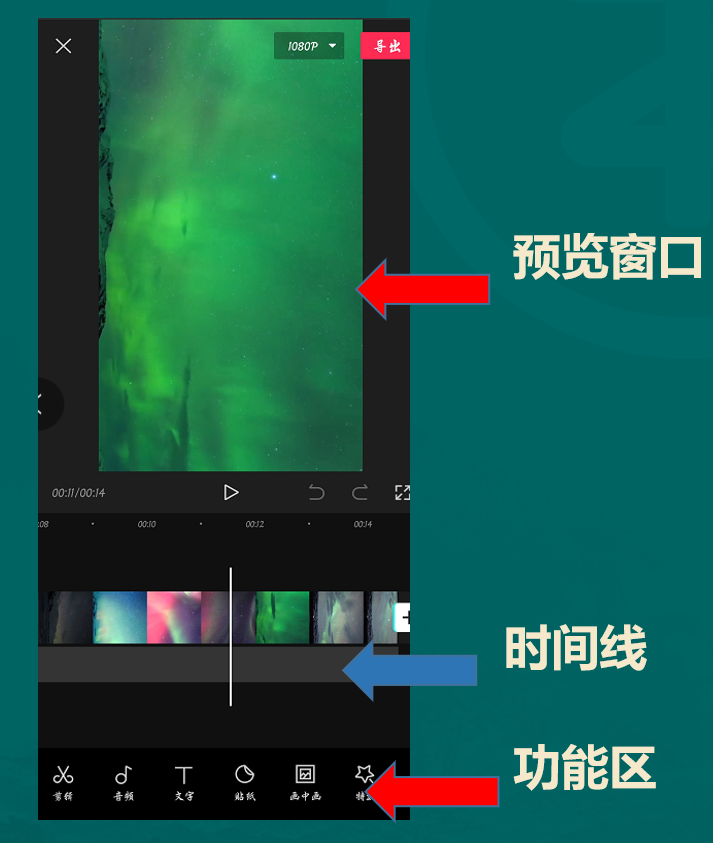

# 1. 什么是抖音小程序
---

## 1.1 抖音小程序介绍
---
抖音小程序是抖音旗下，供开发者开发各种各样便捷小程序的平台，和微信的小程序平台一样。

而我们所说的抖音小程序项目则是以娱乐趣味测评类测试小程序为核心。

我们拍摄、剪辑完和小程序相关的作品后，在抖音发布的时候可以带上这样一个测评小程序链接。

当用户刷到我这个视频时，可以点击这个小程序链接进入，如果选择测评，那么在他测试完并看一段广告后，就能得到测评结果，用户测试不需要花钱，需要花费的就是看广告的这个 30 秒时间。

而小程序项目的收益从哪来呢，就是用户看广告这个动作产生的广告费收益，广告主投放广告会支付广告费，通过小程序平台你就可以赚到这个广告费。

小程序测试流程如下面视频所示：

https://zv4hwuoc9y.feishu.cn/file/boxcn3xSOvqdlYx540r5ncsxtuh

## 1.2 抖音小程序的发展史
---
随着抖音的发展对小程序内容创作的要求也是越来越高了，为了有利于大家更好的理解小程序，这次我们来聊一聊抖音小程序的发展史。

这也可以避免大家踩坑，以史为鉴。

小程序这个东西，其实挺早就有了，18 年底张一鸣亲自负责小程序版块，但是也就只跑通了一个抖音小游戏，还是仅限于安卓手机才能看到的，因为局限于小游戏类目，小程序本身生态是没做起来的。

然后 19 年 10 月底，第一家小程序平台抖推猫出来了，当时小程序和现在主要不同在于两个方面，一个方面是小程序测试用户是需要付费的，另一方面是小程序有分销机制，就是你拉一个达人他做的好你可以跟着赚钱。

然后最开始的几款小程序更类似于微信工具类的，比如测面相测手相这种，但是转化一直不太好，因为抖音平台的粉丝更偏向于娱乐化。

### 1.2.1 抖音小程序的第一个转折点
---
所以第一个转折点来了，我们出了一款「测测你 2020 年真命天子」，这是更娱乐性更偏情感类的小程序，受众群体非常大，而且让一群没有变现能力的情感博主找到了一条变现路。

当时很多做网易云情感账号的，带小程序链接爆一条一万多收益，从这个时候开始小程序方向就转变了，从偏工具类到后面全出的各种领域的娱乐测试类，也是这个时候小程序开始进入大众的视野。

加上当时二级分销的模式，即使你不会做视频，你拉一个大号来做，你也能跟着有收益，所以小程序也是从这个时候开始，进入飞速发展期，也有很多其他开发者入局做小程序平台。

然后这个时候，我们算是把这个模式跑通了，和官方部门也开始有接触了，接下来小程序测评我们就都改成了1元测试，客单价更低了，因为发现在抖音用户付费意愿还是偏低的，那时候小程序最高收益也就单条三万多块钱，但是效果不明显，收益最多的还是三万来块钱。

### 1.2.2 抖音小程序的第二个节点
---
接下来就是第二个节点，到了 2020 年的 5 月 15 号，抖音改革，要求所有测评类小程序停止付费模式，因此倒了一波平台。

不过我们因为提前和官方有沟通，在五月初就开始测试了视频广告收益，所以当时无缝对接了抖音的广告激励计划，直接从付费转成 ECPM 形式，也就是赚抖音的广告收益，用户测评无需再付费了，也就是开篇说的这个模式。

只是没想到这才是小程序真正的开始，在这之前平台最高收益单条视频 3 万 9，但是 5 月 17、18、19 这三天平台就有一个人因为一条视频赚了 20 万，这是很激励人的，因为大变革很多人是不看好的，觉得小程序从此凉凉了，然后 5 月 22 号，一个高中生，靠一条视频，2 天赚了 57 万，后来陆续还有收益，这个高中生在我们平台，总共赚了 70 万。

就因为这个高中生案例，然后小程序又开始了爆炸式的增长。

同时也有不少大佬开始正眼看小程序了，毕竟之前一条赚一两万还是太少，和带货确实没法比，但是那段时间淘宝联盟 PID 被限制的问题加上账号不适宜的问题，所以 2020 年 6 月不少带货大佬开始入场尝试小程序。

### 1.2.3 抖音小程序的第三个节点
---
再之后就到了第三个节点了。

因为太暴利，很多带货大佬入场，用连怼方式发美女这种偏色情点的内容，暴利撸抖音流量，一个号一天赚几万，加上很多蹭网红流量的网红号，大量低质量的内容产出，开始影响抖音内容生态了，所以 7 月份抖音针对这些违规内容的账号开始了一波大封号~

从第三个节点开始起就意味着小程序暴力撸流量的玩法已经不好走了，不能走邪路子了

以上是小程序大概的发展历史。

所以咱们做的核心还是要以内容为王，提升内容创作质量，给抖音平台给用户带去真正有趣有价值的内容。

## 1.3 小程序的盈利模式
---
咱们接下来说说小程序的盈利模式，这是大家比较关心的一个话题。

先看看小程序怎么赚钱，能赚多少钱，接下来才有学习的动力。

动力图：

### 1.3.1 那么小程序是怎么盈利的？
---
我刚才说过了，小程序是通过用户点击你的作品挂载的小程序链接，测试后看完广告你才能获得收益，这就是小程序的核心盈利模式。

这里要注意的是，不是你作品有播放就有收益，不是点击链接就有收益，核心考核指标是广告完播率，就是用户看完广告才算一个有效测试。

这就涉及到转化率的问题，用户刷到你作品点进链接的转化率，以及点进链接看完广告的转化率，每一个环节不同都会导致同样播放量下赚的收益不同。

那么小程序一个广告完播能赚多少钱，一条视频又能赚多少钱呢？

首先大家要知道，ECPM 是千次完播价，而且单价每天是在变的，因为它是一个竞价广告，而且每个小程序的ECPM 每天也不同，所以你每个广告完播的收益是动态的，每天的收益也是不同的，另外创作者获得推广总佣金的 90%，平台得 10%。

所以你的收益计算公式如下：

当日收益 = 当日 ECPM * 广告完播量 ÷ 1000 * 0.9

比如今天智商的小程序 ECPM 是 200，用户单个广告完播的收益是 200 X 1 ÷ 1000 X 0.9 = 0.18 元

假设今天你发了一条视频有 1000 万播放，有 10 万个用户点进去看完广告测评，那么你的收益就是 18000 元。

比如这个图，3.95W = 100 X 广告完播量 ÷ 1000 X 0.9 广告完播量 = 43.89 万

可以得出广告完播量为：43.89 万

另外就是大家关心的收益提现问题，目前提现的话抖推猫平台规则是：

+ 提现周期：T+30
+ 提现金额：满 1 元即可提现
+ 打款时间：三个工作日内到账

# 2. 为什么做抖音小程序
---

## 2.1 小程序的核心优势
---

### 2.1.1 对于玩家来说，为什么选择小程序
---
**小程序的核心优势**

1. 门槛低—0 粉丝不用实名即可挂链接，新人注册抖音号就可以直接开始赚钱。
2. 用户广—男女老少高矮胖瘦都会测评，总能找到你擅长的目标人群。
3. 速度快—你无需买样品用户无需等收货，当天就可以测试结果
4. 背书强—抖推猫是首家也是实力最强的平台，有成熟的课程体系帮助快速入门。
5. 转化高—用户不需要付费免费即可测试，用户零成本抖音本身就是视频平台对视频广告不排斥。
6. 种类全—800 多款小程序随便选，总有一种适合你，而且会紧随热点实时更新热门小程序。
7. 收益高—单条作品收益没上限，心有多大舞台就有多大。
8. 可复制—掌握方法后可以多矩阵号放大操作，毕竟门槛低，核心成本也就手机和电话卡，比其他项目好复制很多。

### 2.1.2 对于平台来说，为什么支持小程序
---
1. 小程序可以帮助丰富抖音的内容生态

因为抖音一直是电商的天下，所有达人都跑去带货了，但抖音是一个多元化的内容生态平台，而且大部分用户喜欢看搞笑、娱乐、正能量、情感等泛领域的内容，但是这部分内容创作者变现很难，带不动货，但是小程序的出现给他们多了一条变现道路，所以是有利于丰富抖音的内容生态的。

2. 小程序可以帮助抖音赚钱跑广告量，拓展广告位的

抖音本身的业务就是基于贩卖流量的，而小程序的变现形式就是帮助广告主去跑广告量，这是在帮助平台盈利的。

此外抖音的推荐位不可能放置大量广告，这会影响用户刷抖音的体验，而小程序则是把广告内置，不影响用户正常刷抖音，大大拓展了抖音的广告位，拓展了抖音的业务空间。

## 2.2 抖音的流量优势
---

### 2.2.1 为什么选择做抖音小程序？
---
最核心的还是因为抖音有流量啊，而流量是一切生意的本质！

这里通过给大家分析抖音的流量特点，让大家可以对抖音的流量推送机制和标签算法有一个基础认知，
了解了流量从哪来怎么来，就算初步入门抖音了，可以少走很多弯路。

### 2.2.2 那么抖音流量有什么特点呢？
---

**1、抖音的流量大**

刚才我们说了抖音的日活达到了 6 个亿，也就是每天有 6 亿的人打开过抖音在刷抖音。

有人可能会说，微信的流量那不是更大，微信日活有 10 个亿呢。

性质不一样，微信是一个封闭的流量池，10 亿日活只是有 10 亿用户，而你发布一个朋友圈，也就只有你好友能看到，就算你有 5000 好友而且人人都看你朋友圈，那最多也只有 5000 个人看到；就算你是一个公众号的大 V ，你有 100 万粉丝，你发一篇文章，我就算他们每个人都看，那也只有 100 万人看到。

何况现在公众号打开率特别低，千分之一左右了，再发也还是只有这些粉丝能看到，非粉丝除了别人分享给他以外一般看不到。

但是抖音不一样，抖音是一个完全开放的流量池，你就算一个粉丝都没有，你发布一个作品，抖音会给你 500 以内基础播放量；如果你的内容优质受人喜欢，那么你一个作品可能会被几千万人看到。

像这个号，当时刚发第一条作品的时候，只有十几个粉丝，第二个作品就一百万了，意味着我一个新号有一百万人看到我，并且涨了三千多粉丝。

这都是由抖音的算法机制决定的，我马上会讲到抖音的这个算法机制，所以说， 拥有全网最多最开放流量的抖音平台，自然是你做副业的第一选择。

**2、抖音的流量便宜**

豆荚不知道有人投过没，简单说一下豆荚，豆荚其实指的是 DOU+。

DOU+ 是抖音官方推出的工具，简单将就是花钱换播放量，花钱投放，从而提升内容的曝光度。

投豆荚，100 块钱，给你 5000 个播放量。投的是同城或者限区域或者达人相似推荐对吧，也就是选精准点的流量，100 块钱 2500 个播放，什么概念，相当于你找一个人兼职发传单，一天 100 块，他给你发了 2500 个人，便宜不？

这是花钱的情况下，但其实抖音大部分的流量都是免费的！

是人人可以获得的巨大的免费流量，为什么这么说，这是由抖音的算法决定的。我在这里给大家说一下抖音的算法推荐机制大家就懂了：

抖音的算法推荐机制是赛马机制，只要你内容足够优质，有足够多用户喜欢，抖音就不会吝啬自己的流量。

人人都有机会，每个用户发布一条新作品的时候，抖音一般会给你们 200-500 的基础播放，也就是会有 200 到 500 个人刷到你们的视频，这 200 到 500 人呢，男女老少高矮胖瘦都有可能，他们刷到你的视频后会给抖音一个反馈数据，反馈他对你这个视频的观后感。

直接划走的当然是不感兴趣的啦，其余也就是点赞、评论、转发、完播、重播、关注、进主页等等指标。

主要核心的四个指标是**完播、评论、转发、点赞**，注意顺序，各项指标所占的权重不一样。

完播也就是能把你视频坚持看完的，抖音会根据他们反馈的数据综合考虑来确定你这个视频是否优质，然后判断是否给你进下一个流量池，记住是综合考虑，所以有些点赞高也没更多播放的，就知道为什么了吧，其他几项数据太低。

如果判定为内容优质就会再给你推 1000-3000 个人看，然后算法再进行分析判断，一直重复，到给你推 1-2 万，10 万、20-50 万、80-200 万、500-800 万、1000-3000 万，和三千万以上这些流量，所以说内容足够优质你的作品就可能被几千万人看到，即使你没有粉丝，而且还都是免费流量。

所以做抖音不需要在意自己有多少粉丝，不重要，这是他算法决定的，传统媒体想买 100 万曝光可能就要花 10 万块钱，一个曝光一毛钱，但是在抖音你不用花一毛钱，只要掌握方法和技巧，做出用户喜欢的好内容，就能免费得到百万千万级别的流量，而小程序可以让这些流量变成钱。

**3、抖音的流量精准**

你一个卖女装的 推给你男性用户 你一个减肥的，推给你全瘦子，那肯定不行，因为没有转化啊，再多的流量也没用。

那么为什么我说抖音流量精准呢？

还是从抖音的算法上来给你们讲，抖音能短短三年时间迅速崛起，离不开他的算法。这里仔细听，一定要理解透彻！

+ 第一个概念：用户标签

抖音呢会给每个用户打标签，怎么打呢，根据你刷视频的反馈，你给哪些视频点过赞，评论过，看完和转发过，抖音的算法都会记录。

当样本数量足够后，这个样本数量就是你刷了很多视频，你就刷十条视频，抖音给你的标签肯定不够精准，你刷 100 条 1000 条后，基本上抖音就能精准的给你贴上对应的标签了。

每个用户身上都有，当然不是一个人只有一个标签，你身上可能会有很多标签，比如宝妈、爱王者荣耀，喜欢李佳琪、爱吃零食，喜欢看电影，喜欢德云社等等等，非常细分的标签。

然后针对这些标签给你推荐同类型内容，所以说为什么人们喜欢刷抖音呢，因为抖音都把你们摸透了，就推你们喜欢看的，不喜欢看的你们都刷不到~

那么我为什么说抖音流量精准呢

+ 第二个概念：账号标签

账号标签和用户标签，用户标签是用户喜欢看什么，给你推什么。

账号标签是，你发的内容，哪些标签的用户喜欢看。

所以说，只要你账号定位准确，针对你的目标人群去做内容。

比如你的目标客户是宝妈，那么你去做母婴类的知识分享或者相关话题的内容，可能其他标签下的人群不喜欢看，但是宝妈人群喜欢看。

当你账号标签打上后，你的粉丝，你的基础播放大部分就都是带着这个标签的人群，你又做的这方面内容，那么用户反馈的数据肯定会更好，视频就可以进入下一级流量池获得更多精准流量，取得更高的转化。

做小程序项目也是一定要理解标签这个概念，因为小程序有很多领域，你做的太乱太杂会大大降低你爆单的概率以及转化率的。

# 3. 小程序基础操作入门指南
---

## 3.1 做抖音小程序前的准备工作
---

### 3.1.1 工具准备
---
1. 手机

自己目前在用的手机即可，如果想单独拿一部手机出来，建议不要使用非工作室做矩阵常用到的机型，有可能被抖音风控，比如苹果 6，红米 6/6a 等。

2. 手机卡，一机一卡一号，正常实名手机卡即可，不要用虚拟卡注册账号。

3. 网络无所谓，4G/5G/WIFI 都不会影响流量。

### 3.1.2 心态建设
---
**做小程序最核心需要的就是两个字：坚持**。

因为抖音很可能发很多条作品都不爆热门，只有几十几百播放量，但是小程序你坚持做只要爆一条，收益就非常可观，所以不要轻易放弃。

另外做短视频一定要多看视频！一定要多看视频！一定要多看视频！！！

每天关注三五个同行，至少刷半小时抖音去学习同行（表达很质朴，效果是真香）

这样可以感受平台内容的调性和喜好，可以知道现在热门的玩法，可以看到同行是怎么提高转化提高播放的，参考维度：主题&选题&文案&音乐&封面&评论

提前下载并熟悉剪辑工具：剪映

### 3.1.3 提前注册并熟悉抖推猫平台所有版块功能
---
小程序平台功能简介：

1. 首页包含新手必看、今日新品、商学院、爆单分析及所有小程序；

2. 思路包含各类小程序的玩法视频案例以及抖音热点话题；

3. 收益包含你每一个抖音号每天获得的收益详情；

4. 我的包含收益、提现、分享以及客服版块。

## 3.2 如何绑定自己的抖音号
---
操作视频：

https://zv4hwuoc9y.feishu.cn/file/boxcnS3yyZWYPnIaDg3IZXz8fRe

## 3.3 如何发布作品挂载小程序链接
---
操作视频：

https://zv4hwuoc9y.feishu.cn/file/boxcn6i9RlJauIT82ZWoqBDNTeh

# 4. 抖音小程序种类及内容形式概述
---

## 4.1 抖音小程序种类概述
---
了解了小程序是什么以及基础操作之后，你只是知道了怎么去挂小程序，但是你还不知道发什么内容挂什么小程序对吧。

所以接下来的版块就进入内容制作阶段了。

而内容制作的第一步，就是先带你了解小程序有哪些种类，有哪些领域，然后你来选择你所擅长和熟悉的领域，再去创作内容。

目前的话，平台把小程序总共分为25个版块，如下图所示：

平台目前总计超过 1400 款小程序，基本上是把所有泛流量领域全都覆盖了一遍，其中最主流的几个领域分别是：情感、游戏、心理、颜值、趣味和星座。

当然每一个领域都有机会，平台也会跟随热点出一些适合当下热点的小程序。

比如最近（2021.6月）的这两款小程序：

1.测一测异性的你长什么样（创作者单日最高收益4w+）

2.这辈子你会和谁结婚（创作者单日最高收益3w+）

而我们做小程序的话，第一步就是确定自己的定位，怎么去做呢？

你要想清楚你是做一个全领域测评账号，还是垂直某个领域的测评账号。

怎么去理解呢？

### 4.1.1 全领域测评账号
---
比如我给自己的身份是：测评小程序的测评师，我的账号名称可以是 小程序测评师，趣味测评君，吐槽测评老王，我就专门去把 1000 多种小程序测给你看，一天更新三五个，也能更新几年了。

测到有趣的小程序就推荐给大家测测，一般般的就让大家避坑，就和某些领域做测评的一样，这就是全领域的账号定位。

下方这个账号，虽然这个号叫心理测试，但其实他覆盖的是各种各样的小程序。

比如【你在别人心里是什么印象】【你此生会辜负多少人】【测试下你的情商有多少分】【有多少人会对你一见钟情】【测你与生俱来的特质是什么】【2021你会赚多少钱】。

各种各样的小程序，只要你感兴趣的，就可以做一个视频发上来。

相比于垂直领域测评账号的优劣分析：
+ 优势：
1. 门槛相对较低，只要找到一个有趣，或者你感兴趣的小程序就可以录制一个视频。
2. 热门潜力大，测试种类繁多，坚持深耕下去，总有一个作品会有爆的可能。
  
+ 劣势：
1. 粉丝不垂直，容易造成视频播放量差异大。
2. 小程序转化率相对较低，同样播放量的情况下，收益会低一些。

### 4.1.2 垂直领域测评账号
---
而垂直领域就很好理解了，我是讲心理学的，只讲心理学只带心理学类目下的小程序，我是做职场的、只讲职场知识，那么我就只带职场类的小程序链接。

垂直领域其实跟淘宝蓝海选品差不多，你选的领域越细分，竞争就会越小，受众就越精准。

比如下图这个账号做的是游戏类的，并且在游戏类中基本只做【叶罗丽】这个游戏：

相比于全领域测评账号的优劣分析：

+ 优势：
1. 粉丝垂直、精准，播放量相对比较稳定。
2. 小程序转化率比较高，同样播放量的情况下，收益也比较高。
  
+ 劣势：
1. 热门潜力相对小一些，因为受众偏少。

在你确定了自己做什么领域之后，下一步你要做的就是确定自己的内容形式，到底做什么样的内容呢？

下一章会告诉大家几种主流的内容形式。

## 4.2 抖音小程序三种主流内容形式
---
其实做小程序无外乎三条路可以走

+ 第一条就是垂直的测试类账号
+ 第二条是素材混剪类账号
+ 第三条是真人出镜类账号

当然这三条路也是越来越难，同时成功概率也是越来越大的方向

首先我们来说说第一条路

### 4.2.1 垂直的测试类账号
---
什么叫垂直的测试类账号呢？

比如纯测试类账号，大家看下面这个作品

三段式作品

https://zv4hwuoc9y.feishu.cn/file/boxcnxQhI7AJ3VU7L0bc3zvaKkh

这种作品的剪辑难度非常低。

所谓三段式：

第一段，就是文案引导测试，口播类文案，然后黑色背景加上各种颜色字幕。

第二段，就是用两部手机，用 A 手机去拍 B 手机，拍你给自己的作品或者给别人的作品点赞，然后打开右下角箭头，然后再点那个分享到朋友圈

然后再点击小程序，用 A 手机把 B 手机这个操作，给他拍下来，作为引导、

但是现在这种行为已经被抖音封了，就不能这样直白的引导点赞转发了，大家不要尝试，点击去测试小程序没问题

第三段，就是测试结果的呈现，第二段结束之后，立马通过一个动画或者特效或者转场，立马把第三段这个测试结果给呈现出来。

这种上手简单，新人很快就能学会，基础的三段式不需要实拍。

就是把每个小程序测试过程展示一遍而已，稍微进阶点就是如刚才案例一样，中间一段找些合适小程序的素材。

但是这种最大的缺陷就在于，成功全靠概率，因为内容实在是比较低质化，优化的话也就只能在文案、还有账号定位上下功夫去想特色的点了，还有就是每个热点想办法蹭，其余的方面很难优化，**不是很建议做这个**。

但是如果谁是团工作室操作，有很多抖音号的话，可以靠这个来批量化，毕竟单作品成本比较低容易批量化一点。

### 4.2.2 素材混剪类账号
---
第二条路就是素材混剪了，这个比较主流，因为素材包含很多很多种，图片素材，影视素材，网红素材，热点素材情感素材心理素材等等 ，玩法也就多种多样。

根据素材还有文案 和小程序的锲合度不同，转化率差别也比较大。

比如情感类的素材混剪 ，采用一些情感小片段配上文案带测试情感类的小程序（这种一直挺吃香的）

这种契合度高转化率是很可以的。

举几个例子：

**图片类的心理测试**

https://zv4hwuoc9y.feishu.cn/file/boxcnYQcpaBNn4BqtJUOkNVkHhb

**恶搞类的**

https://zv4hwuoc9y.feishu.cn/file/boxcn3p4WgfhifUjFZUIlptEyQh

https://zv4hwuoc9y.feishu.cn/file/boxcn73EAms81orvd7wvKobna7g

**励志类的**

https://zv4hwuoc9y.feishu.cn/file/boxcn9wlMAgMfp1OLlqaIkBgOpf

**动漫类的**

https://zv4hwuoc9y.feishu.cn/file/boxcnxD7bwSjsjPsK2YbcPzY3Tg

**测试题类的**

https://zv4hwuoc9y.feishu.cn/file/boxcnuAPgGOpNRjbqJcNdiNsW7f

**采访提问类的**

https://zv4hwuoc9y.feishu.cn/file/boxcnTne4tL6ZBpUppc9up2ZCbd

**手工泥画外音类的**

https://zv4hwuoc9y.feishu.cn/file/boxcn1Yqy70z3S4pjZUVeo3RnJg

**手绘类**

https://zv4hwuoc9y.feishu.cn/file/boxcngvNpNNvqvBwfC7Qm5W4cRf

我们要透过现象看本质，看到作品的核心。

很多火的作品核心，其实就是**素材和小程序契合度高**。

抖音每天都会有各种各样的热点，微博也有，这个大家都知道怎么捕捉，核心是你发现这个热点还能找到与之匹配的小程序，你就能立马赚一笔，如果没有匹配的小程序，有好的想法可以立马找我安排定制小程序。

所以走这条路核心是需要不停的搜集素材，而且是同类型的素材，很多火的作品已经是验证过平台的算法了，你核心就是拿去和小程序做匹配。

### 4.2.3 真人出镜类账号
---
这个是我非常推荐和希望你们做的内容，但是这个也是最难的一种，因为拍摄成本就比混剪高很多，但是好处是真人出镜更容易获得流量

真人出镜也包含很多种类：

**有简单的口播类出镜**

https://zv4hwuoc9y.feishu.cn/file/boxcnsDzfjqmqFXY0TeVTQr75ng

**有道具演示类出镜**

https://zv4hwuoc9y.feishu.cn/file/boxcnCHQozhOsSYmhQPtZ7Os2Hc

**有半露脸出镜**

https://zv4hwuoc9y.feishu.cn/file/boxcnOlknLD6OsTei0kY539siEe

**有真人剧情出镜**

https://zv4hwuoc9y.feishu.cn/file/boxcnsnXL7BHIm6sQ5sRBGNrSjd

> （以上案例小视频皆在网盘链接里面）
> 
> 链接：https://pan.baidu.com/s/1atRfsLhtvQd72DlMCMdD4w 提取码：em85
> 
> –来自百度网盘超级会员V3的分享

抖音的 slogan 是记录美好生活对不对，真人出镜的内容形式会更容易获取流量。

然后最开始我也介绍了小程序的发展史，大家也知道抖音对内容的要求越来越高，越来越严格，

所以，对于我今天讲到的做小程序的三条路来说：

第一条路，如果还是最基本的三段式，你想做的话，你必须得想办法做更多的账号来把概率提起来

第二条路，第一，你需要垂直某个领域去混剪，不要乱改内容形式，第二，混剪也需要创意

第三条路，核心在于定位，能否设计一个独特的垂直于测试类目的定位 ，而且拍摄难度又不大

大概内容形式大家根据自己情况去做选择。

# 5. 抖音小程序主流玩法实操指南
---

## 5.1 小程序的几种万能内容形式
---
现在你已经了解了小程序的所有基础知识，离你开始实操，还剩下最后两步要做了。

第一步：我做什么样的内容形式呢？是不是脑海里还没概念？

第二步：我做哪种哪个小程序呢？是不是还没有做出选择？

接下来两个版块带你解决这个问题。

### 5.1.1 内容形式
---
首先，第一个，你要先清楚什么是内容形式呢

百度搜索内容形式，他的定义是：

> 内容是事物一切内在要素的总和。形式是这些内在要素的结构和组织方式。

很抽象对不对，再往下看看内容与形式之间的关系：

**1、内容是事物存在的基础**。

一张白纸是没有内容的，当文案或者内容出现在白纸上，他就有了内容，而白纸是内容呈现的形式

**2、而形式对内容的发展起着促进或阻碍的作用**。

怎么理解呢？对于抖音来说，一段文案，你用白纸记录和用一段符合文案场景的视频记录，明显搭配视频的内容形式会让人对文案感触更深。就是说你的内容形式设计好坏，是可以影响到内容本身的。

**3、内容决定形式，形式依赖于内容，并随内容的发展而发展**。

同一种内容在不同条件下可以采取不同的形式，同一种形式在不同条件下可以体现不同的内容。

这个我们具体看一下案例，就能更加深刻的理解，大家把这五个视频看完：

https://zv4hwuoc9y.feishu.cn/file/boxcny3rtAYrfX7XXNW7TtRmrdd
https://zv4hwuoc9y.feishu.cn/file/boxcn6Pb4XezdUZaKPhCTkdTttg
https://zv4hwuoc9y.feishu.cn/file/boxcnjiDl8hvXgaE93AqljoWHLb
https://zv4hwuoc9y.feishu.cn/file/boxcnbl7HBaM1Y1u9i9U7v51ckd
https://zv4hwuoc9y.feishu.cn/file/boxcnN97zEHm2O0XZ2PH6uVV0Ib

大家可以看到，这五个作品，都是同一个文案对不对。

就是他们内容本质是相同的，只是因为展现的形式不同。

刚才说了，内容形式对内容起着促进的作用。

第一个视频就是形式最简单的，类似于PPT放映，或者说图片轮播的形式。

第二个视频他的形式就变了，他采用的是手绘的形式。

第三个已经算是非常优质的形式了，她用一个气质美女口播的形式展示这段内容。

而第四个呢，也是口播的形式，但是她的表情语气和说话方式就变了，像是在和你唠嗑一样。

第五个呢，虽然外貌没有前两个优秀，但是她用上了方言来讲述，也和前两个对比做出了差异化

这就是内容形式的改变，使得相同的内容变得更多样化。

而我们做小程序，同样的小程序，同样的测试结果，你换不同的内容形式对于用户来说就是不一样的体验。

这里给大家介绍几种我们常用的万能的内容形式，什么叫万能的内容形式呢？

就是几乎任何一个小程序，你都可以用这个内容形式做出来，

就是你看到同行做的好素材，你都可以用这模板给他换个内容形式变成你的内容。

先模仿再超越嘛，先动起来后面再创造属于自己的内容形式。

### 5.1.2 几种通用的万能内容模板
---
那么有哪些万能的内容形式模板呢？

目前我们主流的几个比较万能的内容形式就是三段式、左右分屏、微信聊天、朋友圈、真人出镜。

给大家演绎一下，就同样的一段素材，用五个万能模板去混剪，挂载的是 BMI 测试的小程序，大家看一下。

**1、三段式**

https://zv4hwuoc9y.feishu.cn/file/boxcnckQDPDlScMcyAQ2E6dZIPM

**2、左右分屏**

https://zv4hwuoc9y.feishu.cn/file/boxcn2nFyYou6byCpe9q3kZscEf

**3、微信聊天**

https://zv4hwuoc9y.feishu.cn/file/boxcnoF7mzsWw8OXKSaPSXdJA8b

**4、朋友圈**

https://zv4hwuoc9y.feishu.cn/file/boxcnee3sJ5wbd0QzBwFgDsQlqc

**5、真人出镜**

https://zv4hwuoc9y.feishu.cn/file/boxcnxb5r0mYvWCnrg2VVUvDeMf

看完能理解么，任何一段素材是不是都可以套入进去？

提供万能内容形式的意义在于，大家一开始选定一个或者几个模板去二次剪辑去创作内容，尽量避免纯搬运，原封不动的搬运别人的作品，套模板去改，最好坚定的选择一个模板，一个号就一个模板内容类型，坚持往下做。

下一节，告诉大家一些比较热门的小程序我们的玩法演示。

## 5.2 小程序的几种主流玩法实操
---
目前全网最主流的几个小程序类型的玩法，给大家挨个展示一下，让大家知道目前爆单赚钱的一些作品都是什么样的，他里面藏着些什么值得学习的点~

结合上一节的万能玩法，大家基本上就能知道怎么开始做小程序了。

其实很多大家都见过，就是觉得挺一般，可能想不通他是怎么爆的，但是目前大多数都是这样，坚持去优化每个细节，还是会爆的~

那接下来给大家介绍几个主流小程序。

### 5.2.1 BMI 类
---
关于 BMI 测试的，最近转化率还可以。

BMI 大家知道是什么吧，就是身体质量指数，国际公认的衡量胖瘦程度以及是否健康的一个标准，其实计算真的很简单，就是体重除以身高再除以身高。

但是很多人不知道，知道也懒得自己算，当刷到小程序的时候，就会去测一下，毕竟都想知道自己胖不胖、健康不健康对吧，所以这个转化率其实挺高的，然后内容上也挺好做。

目前主流的几个内容类型给大家看一下：

**1、三段式**

第一个三段式的大家先看一下：

https://zv4hwuoc9y.feishu.cn/file/boxcnwKud6BD6Pw9wJdBCXu1Ctc

第一段，这句话感受到没「完美身材」。

1. 他和小程序是契合的，因为 BMI 就是和身材挂钩的。
2. 这个是能勾起人欲望的，男女都想看完美身材，这就是你上来文案设置的诱因，诱导用户继续看下去。

接着往下看，上面版块是对 BMI 也是对小程序的介绍，也是让用户明白小程序测什么，另外说自己的测试结果其实就是为了引导用户去测试，这个设计能懂吧。

下面网红素材一是增加了视频诱惑力，可以让男性用户停留观看增加完播率，二也能刺激男女去测试。

最后一段展示测试结果，其实就是和小程序强关联避免掉链接，也是起到引导别人去测试的效果。

这个虽然短短几秒钟，但是整体简单粗暴，转化率很高的，这种属于进阶一点的三段式。

传统三段式是提出问题、然后晒小程序测试过程、没有这个素材的，然后最后加测试结果，这种的话把中间的换成更契合的素材，还是可以做的。

然后大家评论记得去设计一些引导，比如说：

1. 没想到我的闺蜜试了后，身材比我还好，19。
2. 快艾特你家女友来看看，虚胖也很可能哦。
3. 闺蜜反复测了三次，都是 22 真准。

其实就是诱导人测试的。

**2、朋友圈形式**

第二个是朋友圈形式，大家可以看到整体其实和第一个差不太多，主要是内容形式改变。

https://zv4hwuoc9y.feishu.cn/file/boxcnzXzJBDBp9x4jN1w0blXJSe

这个内容形式我说了很多次，不知道大家能不能理解内容形式这个概念，比如唱歌是内容，在街边唱歌，在KTV唱歌，和路人一起唱，这就是内容形式的改变。

同样的一句话，我用书单形式展现和用真人出镜口播展现，他不一样，可以理解么。话是一模一样的，但是他内容形式变了，就是原创内容了

所以朋友圈这个，他核心是以朋友圈背景加好友评论的形式展开，这种内容形式也就是我下节课要讲的万能号，什么都可以做。

然后关键点：一个是在文案，一个是在神评论上。

文案和评论是可以设计的，设计的好，就有梗有趣有料有内涵有爆的希望了，当然作品垂直还是依旧要垂直，比如 BMI 就只发好身材的，好身材的美女素材抖音真的遍地都是，加上去重的方法，这样的内容做起来比较简单，用不了太多时间。

**3、壁纸形式**

https://zv4hwuoc9y.feishu.cn/file/boxcnV2rWm4EMYjI8Kr4JStNGUe

第三个壁纸形式，其实大家能看出来， BMI 这个小程序的核心关键点在于身材，美女美腿诱惑，然后这种壁纸类的可以下载「飞推 APP」。

有模板可以制作，但是这种相较于前两种，虽然内容形式花哨一点，但是缺少标题文案，转化率会相对弱一些~

**4、书单**

https://zv4hwuoc9y.feishu.cn/file/boxcnGK8NwDtQz5ZGIp6vGiIQEw

第四个书单，书单这里其实是要纠正大家的一个固定思维，很多时候提起书单，都想着是文字，一段故事对吧。

但是其实书单也属于万能号，你书上想要什么内容就可以是什么内容，图片、表格、视频都可以，就相当于背景了。

但是做书单这种，也能起号，但是你得耐得住寂寞，可能长期四五百播放然后爆一个百万的再次回归四五百~

**5、微信聊天形式**

第五个：微信聊天形式的，也是一种万能形式。

https://zv4hwuoc9y.feishu.cn/file/boxcnzhUIyynkKU6FhziNGS7jZf

这个作品告诉大家的点是，蹭热点。

这个是前一段时间都有非常火的挑战，你做小程序就需要有敏锐的嗅觉，这个挑战就是秀身材，抖音不定时就会出来很多这种秀身材的挑战，他就比较适合 BMI 这种小程序。

每一个挑战的人都是你的素材~。

然后这句「听说只有 BMI 低于 24 的人才能做到」也是设计的诱因，刺激女性去测试，素材让男性用户停留观看甚至是点赞。

**6、左右分屏**

第六个：左右分屏的形式，首先第一秒大家就可以看到「选美大赛」~

https://zv4hwuoc9y.feishu.cn/file/boxcnYLtnS1Lbcq9KXbGFJ3DxAf

这就是设计的噱头，然后下面和小程序相契合的 BMI 体重 PK 大赛，加上后面的测试结果，保证不掉链接。

左右分屏有个好处是同时看两个素材，双倍的快乐，加上最后比拼结果出来的特写镜头，也是很简单粗暴的一个形式。

BMI 玩法肯定有无数种，大家如果没有想法，可以用我上面说的几种；如果有想法，也可以去创作。

但是记住「核心就是你得设计你作品的每个版块」，目前展示的点都是身材，其实与身材关联的还有减肥，健身，食谱等等。

不要局限于我所讲的，大家做这个小程序也可以去围绕其他关键词做定位做内容，比如你也可以做帅哥。

第一个我讲的稍微多一点，主要是让大家知道内容还是需要去设计的，主要内容形式第一个里面基本也都给大家看到了。

接下来就给大家过一些小程序的主流玩法了。

### 5.2.2 心理类的小程序
---
心理类是个大类，一直以来做的人都很多，当初一个高中生赚 53 万的就是做的心理，这里也单独把几种玩法拉出来说一下。

**1、文案类**

https://zv4hwuoc9y.feishu.cn/file/boxcnrKc5NWbKkgyn6mMAgjzJfb

第一个是比较简单的文字类，这种问题在很多网站上可以找到，甚至脑筋急转弯也可以。

答案是什么不重要，重要的是问题有趣，能勾起人们去猜答案的这个行为。

一方面是增加停留完播，另一方面可以增加互动，所以还是挺吃香的。

但是问题是内容简单，起号还是看运气，另外注意上面的文案，文案上「97% 的人选错这句话」，本质也就是激将法，激发你去猜答案这个行为，底下的反问也是为了诱导你去测试，人都有好胜心，作品设计要能戳中人的某点情绪。

然后再通过评论区刺激一下。

比如：
1. 我选择子弹，没想到我的心理年龄竟然是 30 岁
2. 我反复测了 3 次，心理年龄都是巨婴，8 岁 -> 引导多次测试

**2、三段式**

https://zv4hwuoc9y.feishu.cn/file/boxcn28lu0ReypAjeAFpzZ6VWqd

第二种是三段式，其实区别在于封面设计，能让账号有统一风格，封面就抛出问题，问题也就是诱饵，然后展示测试过程，最后结果扎心一下，学习的点就是封面了。

当然评论引导这种类型不可少，很多时候就是靠评论提高的完播率转化率，看个评论的功夫视频就放两遍了。

比如说：
1. 没想到最爱我的人竟然是我朋友，草率了。
2. 这还需要看嘛？最爱的一定是我妈妈。
3. 赶快艾特你的闺蜜、男朋友来看看，最爱的是不是你。

**3、微信聊天**

https://zv4hwuoc9y.feishu.cn/file/boxcnmA7EGtBUbqy6t2Oy6NK3Zg

这种就是可以变换主体，把问题以聊天的形式展示出去，可以问女朋友，问爸爸妈妈，问朋友，问小三，问老板，这些参数都可以改，有的时候可以起到意想不到的效果，另外依旧提供几个评论参考~

大家感受一下：
1. 没想到她和我分手竟然是因为我看到他是只鸟。
2. 我看了 5 次，这真的是只鸟。
3. 这奇葩的分手原因，是我心理年龄是 12 岁？

其他的还有朋友圈形式，真人出镜，上面都展示过。

心理类的核心在于「你的问题，能否勾起他的好奇心、好胜心」。

做心理类的有很多很多内容，他们不一定带了小程序的，但是你都可以用，多搜集素材，把他们内容装进你的微信聊天里、你的朋友圈，内容形式里就变成你的内容了，剪辑难度不大。

### 5.2.3 壁纸和微信背景
---
https://zv4hwuoc9y.feishu.cn/file/boxcnuF45tnMGwSSACpTHtfx0Ye
https://zv4hwuoc9y.feishu.cn/file/boxcnmRRpZxjNEcqxirSxLv48WO

这两个前段时间很火，这个的核心其实在于素材源。

如果你能找到某个领域的高清的壁纸素材，目前抖推猫上主要是篮球足球，其实这类型做个号难度很低，对这个领域感兴趣，想做垂直体育领域的，可以考虑这个方向。

没有太多讲的，壁纸和动态图背景本身就是内容了，背景图的话因为本来就是基于微信的，所以你用微信聊天的形式和朋友圈的形式去展示背景图素材也是可以的。

核心也就是想个对话或者发圈文案的事，还有评论区引导。

比如说：直呼好家伙，我以为就这一张，没想到里面有这么多好看的壁纸。

比如说：没想到里面竟然有我最喜欢的詹姆斯全套壁纸。

去引导他们进去多下载，壁纸下载是要积分的，看广告得积分，所以转化率挺高，而且客单价高。

### 5.2.4 星座类小程序
---
星座也是非常火的一个类目，很多人都信这个东西，好处是在抖音星座不算封建迷信，所以就很有操作空间，转化率挺高。

**1、图文便签**

https://zv4hwuoc9y.feishu.cn/file/boxcnzZGTh9vcTlIx9Y78TxmGDh

也就是书单形式，刚才 BMI 也讲了，文案内容很重要，像这个，从开始的没有安全感的特征来戳痛点引起你共鸣。

其实大部分人都有他说的几条特征，然后引出星座，让大家对号入座。

这里只是演示，你可以随便写星座，反正哪个星座的人看到就会去测。

**2、冷知识类**

https://zv4hwuoc9y.feishu.cn/file/boxcnVAnBoaX6E2Nj7KE3h9prkc

第二个冷知识类，就是把文案类的内容做成知识分享类展现出来，这算是一个内容升级，比单一的书单的会更丰富一些。

**3、真人出镜**

然后再往上升级，就可以真人出镜口播类来讲了，露脸不露脸都可以，大家做的话要么自己买道具，要么去线下的塔罗体验馆这种，提前构思好，拍一天，用一年。

https://zv4hwuoc9y.feishu.cn/file/boxcna6z291SjPwVJG81KGEH6Ob
https://zv4hwuoc9y.feishu.cn/file/boxcnPSOOlcYLxm6EtKL4HmCoxe

其实星座的话核心点就两个：
1. 排名，什么排名都能扯上星座
2. 爱情，就是在一起合不合适、配不配，因为 12 个星座就是互相对比的，你这个星座怎么样怎么样，不管排名高低，都很能勾起一些人的情绪。

基本上目前全网内容都是围绕这两块来的，你评论的话也是围绕这方面评论。

比如说
1. 测了三次，水瓶座的我，总想粘着她
2. 我摩羯座，安全感很强
3. 双鱼座的颜值排名竟然这么高，我惊呆了
4. 我和男朋友都是天秤座，颜值担当
5. 我反复测了 3 次，我和他原来是上辈子就注定在一起的
6. 双子座爱上金牛座，是命中注定的

### 5.2.5 智商情商小程序玩法
---
这个是比较火的小程序，做的人很多，基本每天都有爆单的，玩法也是多种多样。

**1、图文形式**

https://zv4hwuoc9y.feishu.cn/file/boxcn8PFlLox1Cb16t879nq9Y0b

图文形式，其实和心理类的很像，通过你的选择来增加互动率，这其实和智商没多大关系，但是问题答案很难让人做出选择。

**2、左右分屏**

https://zv4hwuoc9y.feishu.cn/file/boxcn744lEkD6eqMF8966ICHUFh

左右分屏一直是玩智商类的爆款内容形式，通常都会拿两个人来做对比，或者左边是题、右边是一个高智商的人。

不仅限爱因斯坦，最强大脑里的很多人都可以拿出来剪辑，左右分屏核心就是突出一个对比，和小程序契合度很高的素材占一屏。

文案的话，我反复测试是诱导多测，你的答案是引导互动，贴纸增加自己的风格，其实还是很简单，这个也不是肯定能爆，但是不定时就有人爆一次。

**3、冷知识类**

https://zv4hwuoc9y.feishu.cn/file/boxcn1Ea0GNZFRj6usGCopIpwiD

冷知识类型其实就是加个封面，但是会让点击你账号主页的人看起来视觉效果很好~ 比单纯的图文涨粉率高。

**4、全屏**

https://zv4hwuoc9y.feishu.cn/file/boxcnBL4NSWUQus2qZbUWwBn7cd

全屏的没什么说的，情商和智商两个差不多，然后微信聊天和朋友圈这两个万能的也都可以做，上节课也讲了，只要你碰到合适的素材，都可以利用这两个形式迅速去创作。

https://zv4hwuoc9y.feishu.cn/file/boxcnO2egsjTI6OdvlCSSHfPzZA

https://zv4hwuoc9y.feishu.cn/file/boxcnJR5oMksH7YUukJtCYpBcMb

比如，聊天记录内容形式来做智商小程序。看到任何一个智商情商的，都可以以一句对话开头：

「老公，你看看人家智商或者情商多高啊，你怎么笨的跟猪一样」

然后放素材，凸显别人的高智商操作。

老公回复也好设计，比如说：怪不得我左下角测智商或者情商才 60 分，或者说「怎么可能，我左下角测明明 90 分」等等，朋友圈类型同理。

### 5.2.6 情感小程序
---
这个是很热门的了，目前最主流的玩法，三个都是素材混剪，只是展现形式不同。

**1、网易云热评**

https://zv4hwuoc9y.feishu.cn/file/boxcn2a1EX4DIl0OFouOu87Le5f

这个内容形式一年了还一直有流量，其实就是加个自己风格，可以是网易云 可以是回忆、可以是爱情博物馆，自己想个定位就可以。用网易云是因为它的知名度比较高，但内容可以和网易云没关系。

**2、微信聊天、朋友圈**

https://zv4hwuoc9y.feishu.cn/file/boxcnfLr1jQcJz4AIWl37YcSZiH

https://zv4hwuoc9y.feishu.cn/file/boxcniPzjxBqTn440BlaxWRVpdb

还是上面说过的朋友圈和微信聊天，展示的这两个案例是比较简单粗暴的，情感的你可以根据内容去编文案编故事，就是开局一张图，内容全靠编。

这个当你遇到一个比较合适的号时，你可以利用朋友圈或者微信聊天的形式，把他的全部内容都扒下来重做一遍~

另外，还有一个我比较看好的情感形式，他没有做小程序，但是这种内容形式我觉得非常给力，属于聊天记录的升级版方向，值得大家模仿，我觉得热门概率很大的一个内容形式。

https://zv4hwuoc9y.feishu.cn/file/boxcnfnTzhA0z56kW255cqX66D3

简单分析一下：虽说还是聊天形式，假装有女朋友系列。

你拍摄难度不用像其他的剧情类，你只需要拍你回复消息的画面就行，这个不停的换场景拍就好了，内容同行无数，改改就好，做情感非常合适，你可以定位海王渣男渣女痴情男女都可以。

基本上目前一些主流的小程序玩法就这些，另外，小程序这个也是比较讲究追热点的，比如当时三岁照片刚出来，这个品类就非常火。

当然不是说上面讲的几个主流大家就只做那几种，现在小程序一千多个，什么类型的都有，它们的底层逻辑是相同的，你玩明白一种，其余的小程序其实都很好上手了。

入门的话先挑一款练练手，熟悉了之后要多研究市场，把握住当下的一些热点风向，一有新的热门小程序你就可以迅速跟上赚一波！

整个小程序基础操作到这就结束了，接下来给大家简单讲讲剪辑和抖音基础入门。

# 6. 抖音剪辑基础入门
---

## 6.1 视频的基础知识
---
了解了小程序的一些基础玩法之后，

咱们就要开始实操做内容了，这就涉及到剪辑技能了，

因为很多小伙伴是从来都没有接触过剪辑的，所有我们从最基础的视频知识开始说起。

首先我们要知道，视频的组成三要素：画面、文案、声音。

### 6.1.1 画面
---
画面可以是纯视频画面，也可以是视频加图片，也可以是图片加图片，这些都属于画面部分。其实图片加图片做的比较好的就是卡点类了，做的比较 LOW 的就是 PPT 放映形式，现在已经限流了。

### 6.1.2 文案
---
文案，包括视频内的标题、文字内容，也包括视频发布前需要编辑的文案部分。

在抖音核心作用就是在用户刷到你这个作品的时候，勾起他继续看下去的欲望，不管是勾起他的好奇心，还是给他价值，还是让他产生共鸣，让他不至于刷到就划走。

### 6.1.3 声音
---
而声音包括画面的声音，包括 BGM，以及一些音效，和文案同样的道理，声音的核心作用也是用来刺激用户的情绪的，你的声音和内容契合度非常关键，很多作品因为换了一个 BGM，多了一个画外音，火的太多太多了。

所以大家在剪辑视频的时候，每个要素都要注意去设计。

另外说说视频的两个比较重要的知识点。

### 6.1.4 分辨率
---
分辨率这个大家都很清楚了，对吧，有码无码高清不高清嘛，正常分辨率越高视频越高清，但是注意我这句话，分辨率越高占用的服务器空间越大

抖音每天有近 6000 万作品上传，所以他不可能是无损上传的，抖音有一套自己的压缩算法，你上传的作品，不管是直接上传，手机后台上传还是网页端上传，都会压缩。

但是他的压缩算法又很强，不会太影响你的画质，反正我们曾经测试过发现，你只要是 720P 以上拍摄的最终呈现出来的效果就都差不多，所以大家要知道不是分辨率越高越好，不是非要用 4K 去拍摄才行的。

### 6.1.5 帧
---
帧这个东西，其实很好理解，就是一个视频中的最小单位画面，一帧就是一幅静止的画面，连续的帧就形成动画，想想小时候的小人书，快速翻页就可以动起来。

而帧数就是1秒钟是有多少画面组成的，比如帧数 25 就是一秒 25 个画面组成，人肉眼是分辨不出来的~

抖音识别你的内容是无法识别视频的，它是把视频打成一帧帧的画面去识图的，可以理解吧，所以帧这个概念大家一定要懂，然后这里帧数虽然越高会越流畅，注意是流畅而不是越清晰。

所以帧数也不是越高越好，30 帧已经够用了，因为同理，帧数越高文件越大，可能压缩的越严重~

所以短视频 60 帧影响不大，但是长视频 60 帧导出就大很多了。

理解了这两个概念之后，我们来聊聊这个问题，怎么上传视频才能更清晰呢？

### 6.1.6 先说说网络上流传的四个谣言
---
**辟谣一：就是让你把手机拍摄调到 4K**

视频的清晰度不只受分辨率的影响还有码流影响，咱们平时所说的 1080p 和 720P 只是分辨率，而抖音的视频压缩逻辑单靠提升分辨率，肉眼几乎看不出有任何差距，说白了你用 8K 拍再上传效果依旧如此。

只要保证 720p 及 720p 以上拍摄就足够了，4K 不仅没有效果，还会给你带来不必要的麻烦，比如超大体积占据你的手机内存，剪辑 4K 视频对手机电脑都是严峻的考验，会有明显的剪辑卡顿现象。

正确常规设置：1080p、30 帧、比特率 10-12 之间、h.264 输出。

**辟谣二：补帧，60 帧超清晰，用 60 帧拍摄**

可能大家会刷到一些所谓的超清 60 帧影视剪辑号，他们的视频都非常清晰。

这就是和码流有关，他们只是找到码流更大视频文件质量本身就非常高的影视素材罢了，与是否 60 帧没有任何关系。

帧速率只会影响你的视频流畅度，与视频清晰度没有任何关系，不要试图用这种补帧或者提高帧速率的方法来提高视频清晰度，没有任何卵用。

**辟谣三：手机后台视频管理上传更清晰**

据测算对比，这种上传方式对安卓用户没有影响，对 iPhone 用户反而压缩的更厉害，画质极度模糊，还不如直接上传。然后电脑后台上传测试了一下，是稍微清晰一点 但是很难看出来，确实有清晰一丢丢。

**辟谣四：大神参数指导，照做就会变清晰**

各大抖音群里流传的一份视频变清晰小技巧，人性都是懒的，都不动脑思考，总想找捷径寻技巧，所以这波人就瞄准了这群人的心理，给你一个技巧照做就可以了。

实际上的效果如何？这些参数原本的逻辑是通过调整画面色彩来提升成像质量，但是这技巧并不适用于所有视频，肯定是依据不同的画面色彩来进行画面调色，而不是一刀切一个技巧参数搞定所有作品。

这个就是利用人们的懒惰心理上热门的文案套路。

### 6.1.7 那么如何才能让你上传的视频更清晰呢？
---
**第一：核心就是在于你的素材本身**

实拍请注意光线充足，大家可以做个对比，同样型号的手机白天拍摄和夜晚拍摄画面的清晰度会相差十万八千里，这是手机感光度 ISO 决定的。

感光度 ISO 越低画面就越清晰，画面也就越细腻，光线越充足感光度才会越低，所以首先要保证光线充足，让机器开启它的最大性能，从而提升画质。

另外多少掌握点色彩搭配，不同的色彩搭配会使主体凸现程度不同，同一色彩的蜗牛，A 的色彩搭配则明显要比 B 的更清晰，更能凸现主题，如下图所示。

**第二、注意调色**

另外不管是实拍还是素材混剪的时候，一定要注意调色、调色、调色！！！

饱和度、对比度，另外锐化这个也调调，能很清晰的感觉到视频变清晰了，但是每个作品不一样，没有什么一刀切的参数，比如下图就是调色的结果。

**第三、传输过程中不要压缩**

最后就是拍摄剪辑了高清的作品，不要在传输过程中给严重压缩了，千万不要用微信传输文件，不论文件大小一律压缩到变形。建议使用QQ、U盘、数据线或者快牙 APP 传输等等，来保证自己辛苦剪辑作品的视频质量。

## 6.2 剪映基础入门
---
接下来咱们来聊聊剪辑的本身~

什么是剪辑呢，这个概念很简单

剪辑是将你的素材，经过选择、取舍、分解与组接，通过镜头的组合，进行场面构建，最终完成一个连贯流畅、含义明确、主题鲜明并有艺术感染力的作品。

很明显，咱们从同行那去水印下载的东西，你直接发，那是纯搬运就不是剪辑了，此外，一个作品应该包含的元素有封面、内容、背景、声音、文案标题、BGM，缺一不可。

这里对几个元素简单说一下：

封面很多人没注意，尤其是新人，封面是可以让人半秒就看到你这个作品主题的东西，也是用户进你主页能快速了解你的一个东西，好的封面能大大增加作品看下去的欲望以及你的涨粉率，这点大家接下来要注意，剪映是可以选择你作品任何一帧直接生成封面的。

内容为王这里就不过多强调了，就和剪辑定义一样，你的内容主题鲜明不？有感染力不？

背景的话，需要用一个统一的背景，加上你的人设 IP，是可以增加用户记忆的，所以尽量去统一自己的风格。

而声音呢，这里主要说画外音，你可以改变声音的情绪，可以改方言，可以改风格，可以改大小 都可以形成一些你的独特定位。

接下来文案标题，没什么多说的，很关键，你里面一定要包含一些自己设计的价值点，要么给他好奇 给他情绪给他共鸣，要么引导他互动评论，你得去主动设计让用户来对你这个视频有反馈而不是直接划走。

而BGM呢，每期内容作品BGM都得好好选，因为BGM是有情绪的，欢快的、伤感的、深情的 ，得和你的作品主题相符，同样的作品不同的BGM会让作品播放量差很多很多。

所以什么是剪辑呢，反正做抖音在我看来，就是这些元素的综合设计！

那怎么剪辑呢？

带大家初步认识一下剪映这个工具，这是抖音官方自己出的剪辑软件，还是建议大家重点掌握这个，毕竟做抖音，他自己出品的剪辑工具肯定最懂他自己也是最方便最容易上手剪辑抖音作品的软件。

但凡有热度的玩法，剪映都会及时更新，而且还有无数的模板供大家选择帮助大家更快更好的剪辑。

最主要的是上手快，比 PR 简单高效多了，所以对于新人还是主推剪映，现在也出来了电脑版，剪一些长的作品也可以啦。

当然这个还是靠大家去实操，这版块也就是给大家简单介绍入门一下，大家在剪映创作者学院里可以看到更多更完善的教程，基本上三天就可以学会。

我主要把一些去常用到的二次创作的功能给大家讲一讲，

首先，认识剪映 ，你在剪辑的时候每个版块功能要知道。

预览窗口这里就是你的素材位置，不管是图片还是视频，你在这里是可以通过手指去进行一些操作调节的，比如放大、缩小、拖动、旋转。

而下面时间线版块就是你添加素材的位置，你在这里可以选中你要剪辑的任意一段素材 任意时间段，任意文本，任意音频，来进行编辑。

最重要的就是下面的功能区了，剪映的功能真的非常全了，大家自己下载去好好熟悉一下，这里文字不做过多讲解，下载剪映 → 看创作者学院 → 有每一种功能的教学视频。

掌握了基础剪辑技能后，我接下来给大家主要讲解怎么二次创作内容。

## 6.3 如何进行二次创作
---
那么到底如何利用剪映来进行二次创作，让别人的爆款作品变成自己的呢？

### 6.3.1 为什么要二次创作？
---
首先给大家讲一下为什么要二次创作。

因为不管什么平台，都不允许直接搬运别人的作品来用，一个是原创保护，一个是大量相同的作品会影响平台内容生态，大大降低用户体验。

然后抖音的规则上，哪些行为会判定为搬运：

1. 未经他人允许将他人作品保存下来发布至自己账号
2. 无版权/无授权转载平台内或平台外的内容
3. 录屏电视/电影正在播放的内容，未经任何加工上传至自己账号
4. 搬运影视综艺/体育赛事/外网视频片段，并且只进行简单的二次创作的内容
5. 出现抖音平台之外的水印/特效等元素
6. 冒充公众人物，假扮账号是公众人物本人、公众人物工作室工作人员/经纪人等

那么抖音具体是怎么识别一个作品是不是搬运的？

这个大家清楚之后，就可以去更好的二次创作。

### 6.3.2 抖音是如何识别一个作品是不是搬运的？
---
这里在前面有给大家简单提一下，抖音是把视频打成一帧帧的画面，然后去识别画面内容的，这里刚才已经讲过了帧的含义。

大家应该懂了，比如你的作品是 25 帧，就是你一秒的视频，抖音打成 25 张图片，10 秒的作品就是 250 张图片，然后一一识别再和他的内容库做对比，就类似于百度识图。

这个工作量是非常巨大的，所以其实抖音识别一条作品是否搬运，不是真的去识别你作品每一秒每一帧的画面，

他是有**三个关键点**的：

1. 你的视频前三秒的所有画面
2. 你的关键帧部位
3. 你的片尾

前三秒和片尾可以理解，关键帧部位是什么大家可能不太清楚。

就是你作品里面场景转换的一些镜头，画面变动较大的部分 ，也就是镜头切换的时候 ，他就会抽取这版块前后的画面去做对比，就好比影视剪辑，同一部电影素材肯定一样，如果片头片尾一样，每个转场拼接你还和别人一样，那不是抄的是什么，哪这么巧两个人裁剪的部位都相同。

所以这几个版块在二次创作中要重点处理。

当然其他的版块也不是不处理，抖音的算法一直在升级，谁也不知道他什么时候判定搬运会识别你视频所有画面。

### 6.3.3 怎么处理二次创作？
---
那么具体怎么处理二次创作呢？

首先，先说说三个比较常用的方法：

**第一个，运用剪辑手法对多个素材进行混剪**。

这个是一个比较主流常见的二次创作类型，其实也算是原创了，因为除了实拍的以外，基本上所有创作就是把多个同类型同主题素材混剪到一起。

比如德云社的相声，你多个素材片段混剪，和直接把人家整段搬运是不一样的，比如搞笑合集的那些，就是搜集很多同类型素材混剪，然后加上一点自己风格。

这个原创度一般还是挺高的，比如一些做文案号的，看到好的文案自己再找些其他素材代替原视频的素材，继续用那个文案那个配音~

**第二个就是比较进阶的了，配合自己拍摄的视频去做**。

现在市面上很多的小程序作品，都可以用这个方法来重新做一遍，很多书单文案号，你就可以把里面的内容，用自己一段真人实拍的视频替代，或者一些测试的片段，你拍摄一段自己真人去点击测试的都可以，这也可以大大增加你作品的原创度。

**第三个就是目前吧，比较歪路子的玩法了，就是在人家作品基础上去魔改，魔改到让抖音判定不出来他是搬运为止**。

具体怎么魔改呢，接下来就给大家详细的讲一讲，哪些操作可以提高作品原创度 顺带给大家把剪映的基础操作过一遍

首先第一步：

根据不同类型的作品，有的可以直接替换他的背景图，打上你的IP，你的标记，只保留其中的视频素材

或者一些作品你裁剪后给它加上一个背景图也是可以的。

https://zv4hwuoc9y.feishu.cn/file/boxcnx6gnKBHrLs5PCbkvRcUSwf

当然 现在去重不是做这一步就够的了，之前很多批量剪辑软件其实就是换背景加裁剪，但是已经很难过审了

然后第二步 ：

变速和加镜像，这两个也是得根据素材来，

https://zv4hwuoc9y.feishu.cn/file/boxcn5E4w0lbatVtTdidMPWvebh

变速你可以整体加速减速 ，也可以某个小片段去加速，当然也可以一些部分慢动作，然后变速分为常规变速和曲线变速，

对我来说变速有个很重要的点在于有些片段如果加快速度不影响视频整体感观的话，就可以加快，能有效缩短时长

然后镜像功能，顾名思义就是把画面镜像，不过这个功能在有文字的时候是不能镜像的，会影响阅读了，其他的就可以随意镜像了

然后加关键帧、加蒙版。

这两个操作目前来说还是很有用的，也是剪辑里面稍微进阶一点的操作，关键帧是可以和其他各个功能结合起来玩的。

打上关键帧的核心作用是你的素材在两个关键帧之间发生的变化，第一个关键帧到第二个关键帧如果画面没变是没有变化的，如果第二个画面改变他就会从第一个画面慢慢改变到第二个画面。

https://zv4hwuoc9y.feishu.cn/file/boxcnkWz3XyZRCGQO7KaBW18YIg

加蒙版和裁剪其实有点相似，但是区别是在于蒙版可以虚化一下周围 ，还是有些区别的。

另外抽帧和转场，这两个就可以针对我最开始说的，关键帧部分去做一些改变，就是画面衔接场景转化处

前后抽掉几帧其实没有影响的 或者做一下转场动画也可以~

https://zv4hwuoc9y.feishu.cn/file/boxcn64fvlbDhQNIoPgwmeL2Jig

然后加画中画，这个操作就很厉害了。

正常加画中画是真的把一个素材加进去，是看的见这个素材的。

而我们说的加画中画，是为了骗抖音机审，用户是看不到这个画中画的。

然后我们目前的话，有个百分之九十过原创的办法就是，加画中画，一个是复制两层自己这个作品

一个是加画中画加一层黑布。

然后当加完画中画之后，贴纸特效等就用上了，这个时候加贴纸、加特效其实是加在最后一层画中画那个素材上的，而不是你第一层素材~

会随着你最后一层素材的不透明度而淡化，但是机审呢又会判断你这个作品和之前的不一样~

这个也就是能看到很多作品飘雪花啊飘一些光点的原因

最后就是加滤镜和调节啦 饱和度 对比度 锐化，这个步骤不管是原创还是二次创作，都希望大家在最后一步加上，因为可以让你的视频变得更清晰。

基本上这样一套操作下来，一个你去水印下载的作品基本上也能过抖音原创了 。

动作不是限制死的，大家可以多加多改，只要不影响内容本身就可以，详细的实操教程给大家演示了一遍。

第一部分

https://zv4hwuoc9y.feishu.cn/file/boxcnq0Wxs8b2xKRgGj9EV0baYe

第二部分

https://zv4hwuoc9y.feishu.cn/file/boxcnctdHMrNhv5D2XJl6bPtRdh

第三部分

https://zv4hwuoc9y.feishu.cn/file/boxcn9CRBl9C1exFScjKgz13I5w

# 7. 抖音运营基础入门
---

## 7.1 如何找对标账号
---
前面有强调了，新人做抖音，模仿很重要。

如果你接受了这点，那你要做的第一步动作就是：「找到足够多优质的对标账号」。

看完这篇文章，你会发现你会有看不完的对标账号，我称这个方法为「套娃式找号法」。

### 7.1.1 先说原理
---
抖音同类型的视频，往往会具备至少一个下面的这些共同点：
+ 话题
+ 背景音
+ 标题文案关键字

### 7.1.2 实操部分：直接找账号的实例
---
比如找「电竞天赋」这款小程序的对标账号，这款小程序完整的名字是：你的电竞天赋有多高。

1、从小程序名字中提取关键词。

比如这款小程序的话，提取到的关键字就是「电竞天赋」。

2、到抖音搜索。

直接去搜索栏搜索「电竞天赋」，找到对应的「话题栏」下。

3、看播放量。

你会看到「电竞天赋」&「你的电竞天赋有多高」这两个话题的播放量比较高，证明都有爆过的视频，所以，在这两个话题下，我们应该都是可以找到爆过电竞天赋小程序的优质视频。

4、选择播放量比较高的话题

我们以「电竞天赋」这个话题举例，继续往下看。

5、点击综合排序的位置，选择最多点赞。

6、从头到尾每一条都刷过去，再根据发布视频，寻找近期爆的视频

7、如果还是找不到，看看带小程序的视频标题，还经常带什么话题。

比如「电竞天赋」这款小程序，他的视频标题，很多都带了「手速测试」这个话题。

8、根据新话题，重复 2~ 7 步。

所以，我们可以再搜索框 -> 话题搜索「手速」。

然后，就又找到了「测手速」「手速测试」「电竞手速」这三个千万播放级别的话题。在这些话题页里面，我们可以继续重复执行第 2 步到第 7 步。

9、根据视频使用的音乐查找

在找到了近期热门的视频之后，我们还可以点击这个视频的背景音乐，找到更多使用同款背景音发布的视频，里面也有概率能找到近期热门的小程序视频

通过以上步骤，你应该就能找到自己想带的小程序的对标视频和对标账号了。

## 7.2 如何养号和给账号打标签
---
市面上关于养号的谣言非常多

1. 几乎所有的培训机构都会给你讲一套养号体系
2. 官方又总是辟谣说没有养号的说法
3. 但是普通人自己刚做抖音号的时候，就是经常遇到视频发不出去直接不适宜公开，或者播放量只有几十。

所以，我觉得自己圈子的小伙伴，对【养号】这个问题，需要一个可行的、统一的答案。

今天，我就把养号这个话题给大家讲透。

作为一个起了 10 个纯剪辑号（真人出镜的号一般不用担心养号的问题），做到每个月几个亿抖音播放量，从来不担心养号问题的实战派，我有底气说：以我为准。

首先我们要明确一下养号的概念。通常想了解养号的人，需求是：

1. 解决新账号播放量为 0，显示不适宜公开的问题
2. 解决新账号播放量一直在 500 左右，无法破播放，达到播放量稳定破千的问题。
3. 解决老账号突然播放量为零，显示不适宜公开的问题

根据这个需求，我们把养号这个概念，分为两个阶段：

1. 【养号】，完成养号的标准是：可以正常发布视频，发布的视频都有 300～500 的播放量；
2. 【养垂直度】，完成养垂直度的标准是：可以正常发布视频，发布的视频，播放量都在 1000 以上。

### 7.2.1 养号
---
接下来要讲的养号方法，正常情况下，今天买手机卡，明天就可以正常发布视频的。

先讲理论，再讲实操，没有耐心的，直接看实操板块。

**原理**

首先，不要神化养号。

抖音是非常欢迎正常用户发作品的。之所以你发布的作品会显示不适宜公开或者低播放量，就是因为抖音不相信你是个正常用户。换个说法就是，抖音认定你是来做垃圾视频，只想营销的用户。

抖音这么认定的依据是：

+ 你刚注册，我（抖音）对你毫无了解，你就着急发作品；
+ 你发布的作品质量不好，原创度低。

我们要做的，就是对症下药 。

1. 让自己不是新用户
    + 抖音和今日头条同属于字节跳动旗下，数据是通的；
    + 今日头条对微头条的审核没有抖音那么严格，也没那么容易不适宜公开。
    
2. 养号前期发的作品尽量原创度高一点

**实操**

3. 下载今日头条极速版，并在今日头条极速版注册一个账号

4. 发一条图文微头条，内容随意

5. 微头条有浏览量之后（一般 2 个小时后就有浏览量了），在抖音用【第三方登录 -> 今日头条】登录，然后完善头像、昵称、性别、学校等个人资料

6. 刷半个小时抖音（如果懒得弄，就去搞个养号软件，自动帮你刷，一年 40 块钱左右）

7. 第二天发布一条风景实拍视频。发布后，尝试进入投放 dou+ 界面

    + 如果可以正常进入投放 dou+ 的界面，就静静等候视频分发，24 小时内有 300～500 五百播放量，就代表账号正常了，养号成功。
    + 如果显示不适宜公开，就在创作者中心（creator.douyin.com）发布
    + 如果显示频繁发布重复、低质量、营销内容，换个发布的端口即可。原来是手机发布的，就换成在创作者中心发布。原来是创作者中心发布的，就换成用手机发布
    
我用这个方法，每次起号都是正常的。

当然，如果你一下子起十几个账号，这个做法并不适用。

### 7.2.2 养垂直度
---
过了养号的阶段，就需要我们养垂直度了。

依旧是先理论，后实操。没有耐心的可以直接跳过理论环节。

**原理**

养垂直度，说人话就是：让系统知道谁喜欢看我们的内容。

抖音视频的流量多少，是赛马机制，也就是说，把你的视频发给抖音用户看，看他们的：完播率、点赞率、评论率、转发率等数据。你的作品的这些数据比别人好，就会被抖音发给更多人看。

说人话就是：我（抖音）把你、小明、小王的视频，都发给 500 个人看。

同样是 500 人，有更多的人喜欢你的视频（完播率高、点赞多、评论多、转发多），那我就把你的视频发给更多的人看，小明和小王的视频就被淘汰了。

假如：你发美女的视频，结果系统把你的视频发给 500 个大妈，你的数据会好吗？不会吧。

这就存在一个问题： **系统怎么知道你的视频，适合谁呢？**

1. 在你上热门的时候就很简单。看给你推的第一波人里面，谁喜欢你的作品。接下来就推给和这些人相似的人就可以了。
2. 那冷启动的时候，并没有基础数据帮助系统判断，这就需要我们主动告诉系统了。告诉系统的地方有：
    + 视频本身
    + 发布的时候的标题
        * 带的话题
        * 已经标题里面的关键字、关键词
    + 背景音乐
    + dou+ 的投放定向
    
**实操**

1. 不要频繁切换视频类型。比如说一开始做文案号，做不起来又切换去做搞笑号，这会让系统更迷糊，还不如起新号。
2. 前期发布视频的时候，尽量都带上同一个话题。话题的选择主要看：对标账号发布作品的时候，最经常带哪些话题，挑一个和自己要发布的内容相关的。比如说我做搞笑号，就带【沙雕日常】【迷惑行为】等
3. 前期发布视频的时候，尽量选择同类型视频的背景音乐。
    + 如何选择背景音乐。选择对标账号近期发布的热门视频的背景音乐。
    + 如何使用背景音乐
        1. 可以先收藏背景音乐，在发布视频的界面，选择背景音➡️收藏➡️找到之前收藏的背景音乐发布即可
        2. 可以点击对标账号热门视频➡️右下角的背景音乐➡️点击拍同款
        3. 如果你自己剪辑的视频背景音乐和热门视频的背景音乐不一样，可以在发布的时候，在背景音界面➡️音量调节，直接把背景音乐声音调成0
4. 投放 dou+，选择投放达人相似粉丝。
    + 投放之后，在dou+投放界面可以看到投放数据，如果数据不好，证明你作品质量不行。这个时候就停掉 dou+，继续完善作品。
    + 不同类型账号数据不好的标准不一样，需要自己掌握，搞笑号的标准是：完播率 50% 以上。

以上操作，在新号阶段需要注意，上过一两次热门之后，就无所谓了，影响极小。

最后强调一点，垂直的内容类型是最好的打垂直度的方式。

你做新号的时候，一定是先盯着一个对标账号的作品来模仿，而不是同时盯着很多对标账号。

因为你看似是同类型的账号，有可能他们的粉丝受众完全不同。比如同样是搞笑号，有的号女粉占比 80% 以上，有的号男粉占比 80% 以上。

在你是新手的时候，你只能看到他们都是搞笑号，而无法分辨更垂直的东西。

所以，在刚开始的时候，盯着一个对标账号的热门作品来做视频，是相对正确的选择。

### 7.2.3 账号做的过程中遇到不适宜如何解决
---
之前有朋友把我的内容做了一张思维导图，直接分享给大家

### 7.2.4 破除谣言
---
还有一些关于养号的谣言，我说一下我的实际情况：

1、是否需要一机一卡一号？

+ 我自己有一机一卡一号，这个是方便查看视频的数据。但是，我自己经常带的手机上，其实登录了很多账号，我也经常来换切换账号去看数据，发作品。这并没有遇到不适宜公开、封号等问题。

2、是否一定要通过 4g 网络来发布？

+ 我 10 个左右的抖音号，都是连着一个 Wi-Fi 来养号，发布作品，并没有出现异常。但是我出门的话，一般都会把所有手机带在身上。

3、是不是每天都得刷视频来保持热度？

+ 我的账号，养一天，可以正常发布视频之后。我基本就再也没有动过了：
    1. 有的账号，我是用手机发布作品，每天还会打开一下手机发布作品。但是没有刷视频
    2. 有的账号，我是通过电脑来发布作品。这种抖音号，我平时几乎都没有打开过了
    
### 7.2.5 写在最后
---
请不要把播放量不好归咎于养号这种玄学上！！

养号很简单！做好作品很难

做抖音遇到的大部分流量问题都是你的作品不好导致的。把精力集中在如何做出好作品才是长久之道。

还有关于养号的更多问题，欢迎你留言告诉我，我会一一解答。

## 7.3 账号运营宝典（供查阅）
---
这章的内容，由两部分组成：
1. 短视频必备神器
2. 常见问题解答

其中第二部分「常见问题解答」我不建议大家阅读。

一方面是因为这些都是账号运营过程中会遇到的问题，作为新手可能看不懂；

另一方面是记住这些没啥用，有需要的时候过来查就可以了。

我建议大家把这部分内容当成一个工具手册，遇到问题的时候，来查找解决办法即可。

### 7.3.1 短视频必备神器
---
好的工具，可以大大提高我们的效率，以及解决一些看起来很难的问题。

在这部分，我和大家分享一些我亲测好用的神器。

**1、抖音官方账号后台**

+ 推荐工具：抖音创作者服务中心
+ 网址：creator.douyin.com
+ 你可以在这里查看详细的账号数据，当前热点，以及执行上传视频、更改标题、查看视频状态等操作

**2、批量管理账号后台及数据工具**

+ 推荐工具：抖老板
+ 功能：
    1. 在一个浏览器，同时登陆n个抖音账号的创作者中心。（插件地址：https://chrome.google.com/webstore/detail/%E6%8A%96%E8%80%81%E6%9D%BF%C2%B7%E8%B4%A6%E5%8F%B7%E7%AE%A1%E5%AE%B6/acfpcgknkedjccopgcfpajjefagkfoii?hl=zh-CN）
    2. 检测账号视频数据，及时看到视频热门情况。（微信搜索服务号：抖老板）

**3、去水印下载抖音视频工具**

+ 手机端。微信搜索小程序：皮皮去水印。
    1. 这个小程序可以免费去水印
    2. 可以下载全网（抖音、快手、微博、b站等）地方的图片、视频、文字素材
+ 电脑端。http://tools.guoxiaorui.cn

### 7.3.2 如何提高图片素材的质量？
---
我们做视频的时候，经常会需要用到网上的一些图片素材。这些图片素材存在以下问题：

1. 被很多人用过了。如果我拿来用， 只是做简单修改的话，有可能会遇到原创度低的问题
2. 图片素材清晰度低，观感差

而如果我们把原素材的质量提高，就能把两个问题都解决。

提高素材质量，我们有以下路径：
1. 提高清晰度+上色
2. 用特殊的效果

其中，提高清晰度，我经常用三个方法：

1. 用百度-以图搜图功能，找到更清晰的原图。
2. 用美图秀秀—老照片修复功能，修复原图。优点是不需要特殊的网络条件，且免费。
3. 用 myheritage 的图片增强 + 上色效果，提高图片质量。缺点是需要特殊的网络条件，并且试用期有限，需要付费（付费的问题也有办法解决）

用特殊的效果，我则是采用剪映新出的 3D 照片功能。

（路径：剪映 ➡️ 点击素材 ➡️ 玩法 ➡️ 3D 照片，也可以自己在抖音搜索关键词：剪映 +3d 照片，查找教程）

**1、文字转语音的工具**

很多种视频类型，都需要文字转语音的功能。普通的文字转语音， 剪映自带的功能就够用了。

但当你需要用到更丰富的语音库时，就需要有更称手的工具—-配音神器。

+ 有近百种声音可供选择。包括方言语音、明星语音、外语语音以及感情丰富的自然人声
+ 语音转文字功能，一键解析视频文字。可以直接导入本地视频，提取原视频的文字
+ 生成的语音可以直接生成视频，完美契合剪映提取视频里面的语音的功能。

缺点是需要付费。

路径：去应用平台搜索「配音神器」。

**2、背景音和人声分离神器—LALAL.AI**

这个网站可以做到将人声从背景音乐中分离出来。

应用场景？

如果你觉得某些视频的配音做得很好，想要采用，但是想换上不同的背景音乐来制作自己的视频的时候，就可以直接用这个网站把人声分离出来。

路径：https://www.lalal.ai

**3、微信聊天记录/朋友圈生成神器**

微信聊天记录/朋友圈，一直都是小程序主流内容形式之一。

如果用自己的微信号生成聊天记录/朋友圈，限制很多，也比较麻烦。

所以，建议大家使用软件：歪点点。

+ 软件介绍：几乎和微信同步更新，可以自定义制作各种微信聊天、朋友圈、转账、钱包后台等截图

+ 获取路径：直接到淘宝搜索「歪点点」，38 一年

### 7.3.3 常见问题解答
---
1、我的账号、视频是不是有问题？

方法一：视频有没有问题，我们可以在发布后，投放一下 dou+（不懂可以去抖音搜一下如何投放 dou+）

+ 如果可以正常投放，就正常视频没问题。
+ 如果不能投放，那系统会跳出一个界面，显示视频存在的问题

方法二：我们也可以通过抖音自带的账号状态检测功能，来看自己的账号、视频有没有问题

路径：抖音工具栏 ➡️ 我的客服 ➡️ 账号状态检测（如动图所示）

https://zv4hwuoc9y.feishu.cn/file/boxcnReTjEuwEmnsW2K0L5h5xpg

2、新号发视频一直「不适宜公开」怎么办？

如果显示「不适宜公开」，我们就继续养号，边养边发视频。

但是如果新号不适宜之后还频繁发视频，可能会被封号。所以要注意以下操作细节：

+ 发出去视频显示不适宜公开，隔一个小时，在创作者中心再发一条大于10s的游戏录屏或者实拍的内容。
+ 如果还是显示不适宜公开，继续养号行为，第二天再按照上一条的要求发视频。
+ 不适宜期间，一天不要发超过 2 条视频

3、新号发视频， 显示「频繁发布低质量、营销作品……」，怎么办？

出现这个问题的本质是账号权重不够。

一般出现这种情况的时候，我们可以发布几条实拍视频。

1. 如果实拍视频有流量，投放 dou+ 也不会显示低质量，那就多穿插发实拍内容和小程序视频，直到恢复正常。
2. 如果实拍视频也没有流量，就用双道具上传视频的方法，直接上传小程序视频
    + 原理：用两个或者多个抖音的道具上传视频，系统会判定我们更用心的在做视频，视频权重高
    + 操作见视频
    
p.s. 这个方法可以用来搬运视频，也可以用来解决「频繁发布低质量……」问题
https://zv4hwuoc9y.feishu.cn/file/boxcnLsNevUoMWc6BkdZ9gcuNpg

4、系统通知搬运评级了怎么办？

先明确一下问题，是账号被通知搬运评级。如果只是视频被判定搬运，问题不大。

账号被通知评级，指的是是收到系统的处罚通知。

收到通知后，分为三种情况：

1. 不想花钱，并且你有备用账号，足够满足你生产力发布，那就给被评级的账号准备 10 条游戏录屏/日常实拍，每天发一条，10 天过后评级自然解除。比如说你一天可以做30条视频，可以发 10 个账号。你有 20 个账号的话，其中 10 个被判定搬运，还有其他 10 个可以顶上。
2. 不想花钱，但是你账号有限，那就抓紧准备备用账号，一张卡 19 块一个月的成本。手机可以不用增加，亲测多个账号可以在同一台手机用，只要不频繁切换账号就可以。
3. 花钱解评级。现在需要 3～7 天。评级一般是3天生效，也就是说评级生效后 0～4 天，你就可以恢复正常流量

# 8. 抖音小程序补充知识点
---
这版块想了挺久要给大家讲什么？

基本上关键知识点都讲了，做小程序还缺什么呢？

缺了最核心的一个东西——心态！

这可能是一节劝退的课程，因为小程序没你们想的那么简单，不是零门槛随便注册个号，一天花一两个小时发发很低质量的内容，就能一个月赚几千几万的项目，也不再是爆一条作品就能赚十万八万的项目。

你可能发了两三个月作品，一次没爆过，

你可能始终都突破不了500播放量，

你可能每天只有几毛几块钱收益，

你可能做几天发现数据不行就放弃，

你可能好不容易爆一次热门结果链接和内容不匹配被抖音下掉了，导致没有收益。

你可能遇到上述的各种各样的困难时期，

做小程序项目和做其他任何副业项目一样，不是付出就百分之百有金钱回报的。

不然也不会有那么多放弃做小程序的了，

毕竟哪有项目是那么容易成功的呢。

小程序最大的问题就在于它的不确定性和不稳定性，

你不知道你哪一天会爆，甚至不知道你会不会爆。

或者爆过一次之后一直没有再爆，而尝过甜头之后心态更容易崩。

所以，想要做小程序，一定要调整好自己的心态，如果你发一条作品没有播放心态都崩，我建议直接退出抖音所有相关项目，及时止损。

如果你觉得没播放的情况下还愿意坚持去做，坚持去持续输出和优化内容，那么你可以试试小程序项目。

但是在做小程序之前，你可以不用给自己那么高的收益预期，你这样想嘛，就算没有收益，你也通过小程序入了抖音的门，掌握了一个新领域技能，不是也挺不错的嘛？

开始做小程序的时候，你可以不用一上来就让自己投入太多的时间精力，先定一个让自己觉得比较轻松的更新计划，这样付出没那么大，心理不会太过着急太过不平衡。记住它只是你的一个副业，它的不稳定性注定了你不能把它当成一个稳定的收入来源，你只需要给自己定一个短期坚持的目标，坚持更新多少条或者坚持做多久都可以，不要老是想怎么没收益没热门是不是账户问题是不是官方限流，明确告诉你没有违规行为不会限！自己多想想为什么没热门，是文案的原因？BGM的原因还是账号定位的原因？和别人对比自己差在哪里，有哪些不足，先一点点追平差距，培养出自己的网感，告诉自己没火确实是因为自己内容不如人，不要只想着依靠运气还抱怨运气不好，当作品质量能达到平均水准之后，才有拼坚持拼运气的资格。

我见过太多太多做小程序几个月爆一条赚万元以上的了，所以你如果做小程序的话，可以把它当成一个按季度发工资的项目，坚持到第三个月赚一万，平均下来也是月入三千多的副业了。

说这么多可能不如给大家一个实际案例来的有效果，刚过去的7月，一个坚持做了三个多月的小伙，前三个月总收益都没到500，而在7月开始爆了一条作品，这条作品又发了几次陆续爆了几次，整个7月给他带来了近六万的收益，有图有证据的！换算下来算不算月入过万了呢？

小程序的不确定性是它的缺点，但是同样也是它的优势所在啊。
调整心态，坚持创作，保持期待，坐等惊喜就好！

