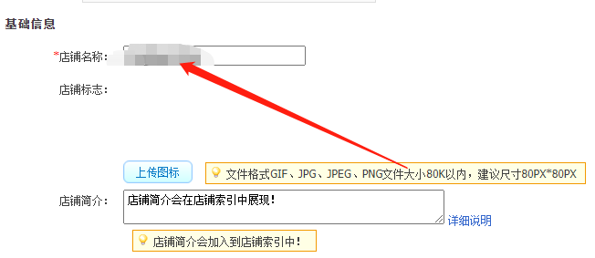
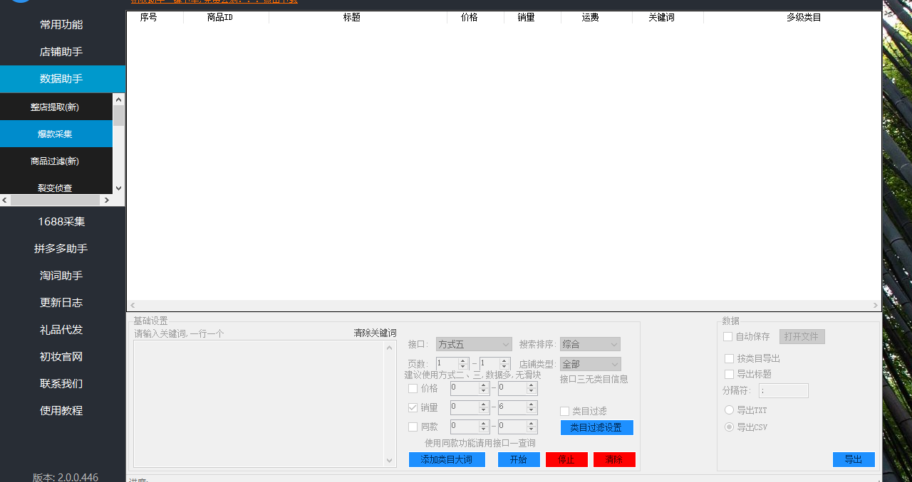

# 1. 什么是淘宝店群
---

## 1.1 店群的古往今来
---
店群起源于2015年，最早做的人群是淘宝客，后来千人千面出来，简单来说，最早期的概况就是开设数十上百家的淘宝店铺，并通过自动化软件大规模经营商品和管理店铺来实现盈利的目的。试想一下，如果一个店铺每天会有1000的流量，那么一百家店铺每天的流量就是10万，按照转化率1%计算，一天的成交也会有1000单。

从20年开始，店群的铺店模式已经不再存在，因为最早期的模式没办法做好售后，也没办法跟上服务

现在基本上主流的玩法，基本是一个人操作3-5家店，一家店可以达到3000以上的收益，如果你执行力够强，那么一家店可以做到2万到3万的收益

## 1.2 店群的盈利模式及流程
---
店群的盈利模式很简单，通过找不同的平台或者同平台的品，把品加价上传到自己店铺里面，这里面的差价就是你的利润

首先找到一些优质的产品，当然这里面会有很多的方法（我在下面会讲）来去找产品，把这些产品然后传到我们的店铺 ；第二步， 光是有产品，我们还要做一些标题，这样别人才能搜索到我们的产品

第三步，我们有了产品，有了标题就可以把这个宝贝通过软件上架到我们的店铺了，这样我们就可以开始去销售，在销售的时候呢还会有人来咨询你，问你一些问题，这个时候我们就要做好客服，提升我们的转化成交。第四步， 有客户下单了，那我们这时候肯定不能用手动了，如果是手动的话，我们每天可能你一直在下单，也就是下个二三十单，这时候我们就需要用到软件，配合我们采购发货全部用软件搞定就好了 ；最后，如果上家退货退款了，你把上家的地址直接给他，让他寄回上家就可以了

这张图片，可以看下，16.8的是上家，也就是我们要复制的链接，但是你看下其他赚15的，赚8块的，月销几百件，也就是一个品就可以赚不少哦；如果你一个店有10个这样的链接，一个月的利润不会低于1w，如果20个呢

# 2. 新手开店的基础建设
---

## 2.1 新手如何开淘宝店
---
如果你是开个人店（一个人可以开3个个人店）

首先，你先注册一个淘宝号，手机端就可以注册，然后绑定好支付宝

登入手机淘宝

点击商家入驻就可以了

## 2.2 快速设置淘宝店铺
---
1、下载千牛

首先你注册好淘宝店铺后，第一件事，就是下载手机和电脑版的千牛（淘宝商家版）

所有的操作都在这里面可以完成

下载完了以后，登录进去，就可以看到所有商家后台所有的权限了

2、缴纳保证金

登录千牛以后，右上角，有保证金，点击进去之后

直接点击购买保险，30块钱，就有1000的保证金额度了，就可以上货了

3、设置店铺名字

输入店铺名称，点击保存即可

关于店铺名字的建议，因为我们店群大部分都是卖百货，所以你可以写 xx百货店

这个名字不要用默认的就行，其他的基本都不怎么所谓

# 3. 认识软件，提高效率
---
软件可以说是在店群中必不可少的一个工具，然后软件不要再官网买，很贵，找软件贩子买， 很便宜

为什么这么说呢，软件可以代替人工做很多复杂的工作，下面我会介绍有哪些软件

1、采集软件

目前市面上常见的有**初妆助手，小草莓采集助手**；这些软件大部分的功能都是的，批量采集数据和数据过滤

2、上传软件

这类软件就像字面意思一样，就是把任何平台的链接，直接用这个软件，一键上传到淘宝上，根本不用你人工上传，所以一天传个几十上百条是很轻松的事情

现在市面上常见的有**初妆，点点，叮咚淘**

3、拍单软件

这类软件就是为了我们快速下单，一键识别地址，然后改到买手号，然后快速下单

下单新版教程：http://doc.1024youhui.com/web/#/1?page_id=122

这个是下单教程，到时候可以自己看下

简单来说，下单软件就是快速下单，一键复制你店铺买家的信息，快速下单，自动发货

# 4. 快速实战
---
这个方法的核心是通过季节来临前，上服饰的相关一些应季产品从而快速拉升流量

春季：年前-3月

夏季：4月-8月

秋季：9月-10月

冬季：10月-年前

上面是每个月份对应的上新时间表

我们接下来以冬季的产品举例

首先我们打开淘宝网，在搜索框输入冬，这个词

然后我们把这些词筛选一下

第一步，在淘宝网搜索这个词（以冬季外套女为例）

选择新品，如下

去除有logo，有大牌的图片

图中三个打字的链接是可以的，我们找到目标链接以后

打开拼多多手机端，然后搜图这个链接

https://detail.tmall.com/item.htm?spm=a230r.1.14.30.440679e5gbNeKl&id=653189789571&ns=1&abbucket=5

这个链接进去之后，拿拼多多

拍图搜索之后就可以找到很便宜的货源，你会发现，同样一件衣服，在拼多多上面只要22.8，而淘宝上108却卖出了3000多件

这时候，我们就可以去截取他的流量

我们做一张表格

一列把我们刚刚找的拼多多链接放进来

一列把我们淘宝对边的新品宝贝放进来

这里有2个问题需要注意
1. 拼多多销量好的产品才可以选择
2. 淘宝有些款可能找不到便宜的货源，我们就不要纠结，直接过，不要管就可以了

上面的选品方法，每天找个20条，可能也就花个1个小时左右的时间

那么就开始上传宝贝

这时候，我们要用到上传软件，这边用初妆助手（30/月）进行演示

因为我们这边要复制的链接是拼多多的链接，所以我们这边选择拼多多上淘宝

现在我们来设置参数

首先，我们要设置 我们指定的标题，这时候，就需要先在中间加个逗号

点击粘贴链接，然后看着导入成功

下一步，设置价格参数

我们这边把价格乘以二，比如，这个22块钱，这样子就变成了一口价44块钱，后续我们可以通过打折软件来调整价格，这个是没有关系的哦

我们通过上传之后，发布成功之后，就会在我们的店铺当中的仓库中宝贝，我们改下里面的属性就可以了上架

目前状态是在仓库中的，我们先看下相关的属性是否完整，能填的先自己填下（尤其注意宝贝长图）

这个自己去美图秀秀改下主图的尺寸，也是一键完成的

上传完成以后，我们开始

点击上架，这个宝贝就完成了

这时候，他的价格是2倍的拼多多价格，我们可能想自由的调价格，可以直接在

这里可以调整价格，也会及时更新到宝贝页面上去

到这一步，已经把宝贝上传上去了

你给自己每天定个目标，每天上传20-30条，也就在1小时左右

上传完以后，进行破零，因为大部分人都知道，没有销量，大部分人是不会买的，所以这时候，我们就给他来个销量3笔

最省钱的方法， 让一个买手买6个宝贝，相当于，你花了补一单的钱就补了6个销量；

一开始，你可以找下朋友帮你补，到后期就可以找鱼塘帮你放单，省心省力

基本来说，只要你每天坚持完成上新量，基本在5-7天就可以开单，

这个方法秘诀就是，每天坚持上新，找到不同的款式；补一个基础销量，就可以坐等开单，不需要任何的技术性操作

# 5. 软件采购发货
---
真实出单后，我们改怎么快速发货呢（以老k下单为例）前期订单少的时候，也可以手动下单

## 5.1 注册老K
---
注册地址：http://onekey.mayixiadan.com/#/register?inviteCode=anxin

## 5.2 安装插件和桌面端工具
---
前往http://onekey.mayixiadan.com/#/download下载插件

> 插件不需要登录,桌面端工具用注册的账号登录！！！！

## 5.3 添加店铺
---
在老K客户端添加店铺：

## 5.4 充值/续费
---
新店铺免费送15天，不用着急充钱

## 5.5 同步订单
---

## 5.6 采购下单
---

点击采购下单

跳出弹窗，输入上家链接，点击去下单

跳转商家详情页，核对sku，点击立即购买，核对地址

然后下单完成后，会检测下单是否成功

## 5.7 发货和备注
---
具体步骤如下:

前往一键下单页面点击检测发货按钮

http://onekey.mayixiadan.com/#/PlaceOrder

首先登录PDD采购账号；

点击发货检测按钮

查看日志内容，若有请开启客户端发货等字段，这时登录桌面端,软件会自动进行发货，无需任何操作。

（需要注意的点:目前极兔和韵达在淘宝没有物流信息，其他快递会正常显示物流信息！）

前往桌面端（发货 + 备注）

# 6. 客服接待与售后技巧
---
这边，我给各位准备了一份常见的话术回复，几乎是所有的问题

## 6.1 砍价、优惠、嫌价格高
---
亲，您看的这款产品是我们在亏本跑量做活动的哦，已经是最低价的呢。

亲可以在我们店铺首页领取优惠卷抵扣哦。

另外我们店铺还有一个小活动，收到货满意的话五星点满截图给客服，登记名额可以奖励一个小红包哦。

亲可以对比下别家的，质量一份价格一分货这个不用说了呢，我们家的质量是保证的哦。

亲不用担心质量呢，我们这边支持7天无理由退换，有运费赠送，不喜欢的话可以联系客服申请退货的哈。

亲您是发哪里呢？您下单的话这边给您优惠3-5元…（利润可观情况下回复，非偏远地区）

亲您是发哪里呢？亲您这个地区不包邮呢，您确定下单的话这边去申请一下给您优惠一些您看可以吗？（偏远地区）

（客户需要礼品，参考详情上家有没有赠送，没有赠送但客户一直想要，利润可观的情况下可以自己多搭配一件送过去，买衣服的可以送袜子，买杯子的送杯垫，买面具的送个口罩，都是几块钱的东西，可以另外单拍给客户，自行决定）

## 6.2 运费能不能免掉？
---
亲这个运费是快递收取那边收取的哦，所以运费免不了呢，亲您确定下单的话，这边可以给您在订单上优惠3-5元，亲可以考虑看看哈…（偏远地区，参考上家实际运费，给优惠不能免运费）

亲您发哪里呢？亲提交一下订单我看下地址需不需要给运费呢（非偏远地区，参考上家，包邮的就给包邮，不包邮的看订单收取运费

## 6.3 发货地址跟详情页显示不同，哪里发货？
---
亲我们这边是有分仓库的呢，下单以后仓库发货系统会根据地址就近安排哦（如果有客户问起，尽量在发货的前跟客户解释一下）

实在抱歉亲，可能是仓库发货系统分错订单，有时候软件确实不靠谱呢，这个也挺头疼的

亲您看下您急要吗？您看需要给您拦截快递吗？（急要的拦截，来不及签收的让客户拒收快递，联系上家拦截此件）

感谢亲的谅解~ 亲您收到以后，这边给您补偿2元当是小小心意，实在抱歉，耽误您收件时间了~（客户生气却理解的时候回复，一开始就理解的就不用给钱）

## 6.4 发货问题，多久发货？怎么还不发货？
---
亲我们正常是今明两天可以发出的哦，仓库按付款顺序安排呢，这边会尽快给您安排发出

亲实在抱歉，我这边给您催促下仓库。

亲仓库打包的小哥是新来的还不熟悉流程，亲亲先别着急哦，我再去催一下。

奇怪了亲，再慢也是两天左右发走的，我去问下怎么回事。

明白亲着急的心情，仓库也太不靠谱了，稍后我自己过去给亲打包~（上家答应可以发走的时候说）

（超过两天不发货的，卖家一直没有回复，找同款找相近产品去咨询能否今天发出，给客户换一家店铺拍下发货。相近却不同款的或者别的颜色，跟客户解释一下前面的缺货了，刚刚收到仓库通知，换一个能接受吗）

## 6.5 缺货、找不到同款、上家迟迟不发
---
在吗亲亲，仓库发货的时候发现这批商品有瑕疵需要返厂，暂时发不了了，您那边申请一下退款吧，真的抱歉哈。麻烦您退款理由选为其他，方便售后给您及时退款，谢谢~

## 6.6 售后
---

### 6.6.1 易碎品、收到货物破损、上家没有给实际回复，自己面对问题处理时
---
在的呢亲，麻烦您拍下照片我这边看下哦。（了解问题，让客户提供图片方便我们发给上家）

看到了呢，实在抱歉，我们发出的时候都检查完好的，您是刚收到吗？快递还在的话亲可以拒收这个件哦不用您承担运费的，只要拒收就可以了。拒收之后这边给您退款或者补发都是可以的，您看怎么方便的呢？（先让客户拒收，拒收不了的叫客户寄回，直接碎渣的安排补发或者让客户申请仅退款）

快递实在是太暴力了，也可能是我们这个包装不够完善，给您带来了不必要的麻烦，实在对不起呢。亲您看下这边给您安排补发可以吗？

亲这边给您安排补发的话，您记得收到包裹时先验货再签收哦，易碎产品呢，我们都会检查包裹再发的，有时候快递真的让我们挺头疼的，希望亲能谅解哦~（客户同意补发后，说一些好听的话，抛开自己的责任假装无辜，可以避免客户对产品的差评）

（处理售后，第一根据客户问题要图片要视频，先看看问题所在？第二，不管对错先道歉，安抚客户情绪，站在客户的立场想问题，收到一件坏的东西是什么心情，肯定是生气的。第三，跟客户解释，先把照片发给快递或者是仓库核实，是破损件就说快递，是瑕疵品的就说仓库，发错货颜色款式的说仓库，让客户耐心等待，晚点给他一个回复。第四，安抚好客户情绪，马上找上家反馈问题，看上家是给什么样的解决方案，给的不足自己补足，比方上家说退点差价，差价可能客户不满意，利润可观情况下自己可以多贴一点也没关系。）

### 6.6.2 收货后过几天反馈质量问题、不好用的难缠客户，嫌退换货麻烦补偿金额不满意，一直以差评威胁刁难的，或者要求退全款的
---
亲，很抱歉我们的产品让您不满意，这个问题我会跟工厂那边反馈的，您先消消气。

亲除了这个问题，还有其他问题吗？（先了解问题，看下客户信息参考客户好评率，好评率越低越难缠）

如果客户在淘宝文字表达不清楚，直接打电话过去跟客户了解情况，再委婉的说晚点回个电话给他，再去跟上家了解下处理办法，之后给客户回个电话。不可避免有些人就是不会打字，年级比较大的不懂表达问题，说不清楚，一着急起来什么都不要了，直接给差评。

亲您觉得XXX还能用的话，根据这个问题我申请一下给您退差价，当是一点小小的补偿，也是我们对您的歉意，实在抱歉。（退换麻烦，先提及补偿）

可以的话这边给您换一下，运费方面我们可以给您承担，您看下寄回运费多少钱的我们给您转您看可以吗？（补偿不满意，提议换货）

亲如果觉得不喜欢了，直接申请一下退货也是可以呢，我们都有送运费险的，运费赔付不够的话我们给您转过去您觉得呢？亲看下怎么方便的？（退货换货都不愿意，那就是觉得补偿的钱不够！学会揣摩客户心理）

亲我们看到您的问题都在积极处理对吗？您购买我们家的东西，自然包含售后服务呢，亲不用担心。换货退货补偿都可以呢，您退回来我们承担运费

明白亲的心情，收到的不好换我也难受的，这样呢订单的话我能申请的补偿额度是有限的呢亲，我这边能申请的是XXX钱，我这边私人给您多补XXX钱，一起给您转XXX，您觉得怎样呢？可以的话您发一下支付宝或者我给您发微信红包也是可以的~（说完这个都不依不饶，针对质量问题要求退全款的，软的不行来硬的，让退回吧，这个订单挽留没有用，留了也是给差评的，对自己店铺没有好处，强硬点说麻烦退回吧亲，运费我们承担）

# 7. 常见的违规与解决方案
---
1、问：淘宝店铺一个人可以开几个店，怎么开？

答：一个人可以开三个个人店，5个企业店，企业店可以开个体户，一张执照也就100多的成本，总体来说一个店铺的开店成本不到200

2、问：一个店，利润基本保持在多少？多久有效果

答：如果你每天坚持上新，基本5-7天就会慢慢出单，我们目前做的店铺，基本保持在3000-5000一个月的利润水平，如果你运气好，出了爆款，那可能几万一个月一个店

3、问：不补单可以吗？

可以，但是效果会非常慢，而且前期价格需要低一点

4、问：淘宝商品有哪些敏感词不能说的？

答： 国家级、世界级、最高级、最佳、第一、唯一、首个、最好、精确、顶级、最低、最底、最、最便宜、最大程度、最新技术、最先进科学、国家级产品、填补国内空白、绝对、独家、首…

特殊商品的广告语违禁字词 、祖传、抑制、秘制等虚假性词语; 、强力、特效、全效、强效、奇效、高效、速效等

5、问：做店群不能上的类目有哪些？

答：品牌，家电，化妆品，食品，医药，教育培训，3c数码配件，保险，理财等。

6、问：开了一个店，订单不稳定，有的时候有三四单，有时候一单都没有，怎么办？

答：1. 对产品进行布局，比如时效性的尽可能多上，同时做好优化，标题筛选相对优质的用，半个月没有流量的赶快优化其他款式，，优化无流量产品后一定要及时补充产品数量，不要中断时间长

2. 破零要有周期性，一般情况下是给2天以内有访客的产品破0，没有的话就看7天内的产品表现，持续有访客的可以尝试补单，还有UV价值刷的越高，淘宝对应给你店铺的流量就越多，淘宝系统也会判断给你店铺的流量和产出值，所以动销率越高越好

3. 上新比价有没有实现，一定要比爆款价格低，并且你有利润

7、问：访客五六百，六七百，但是转化率很低，为什么呢？

答：基本控制在1个点左右，转化率低的因素还是很多的，第一看进店的关键词。也就是说这个产品的关键词跟你的产品是不是完全匹配，其次要看你的价格是不是加的太多，最后才是看你的图片，是不是更有利于转化，这三点都要检查一下。

8、问：服装上新，换季的时候还需要每天上吗？

答：我们一般再换季的时候，选择躺平，比如9月中上旬很尴尬，就直接选择不上，因为上新有成本

9、问：新手，一开始开多个店铺可以吗

答：是可以，但我建议还是先开一个，毕竟开多了，时间、精力、财力都不允许，可能几个铺都能出点单，但没办法做起来高利润店铺，虽说可以做店群，也要一个店一个店的做，每个店都赚个万儿八千的，没有办法增长了再开新店，这样才能稳定长久。

10、问：这样直接复制别人宝贝，会有盗图风险吗？

答：目前淘宝对盗图的态度是整改就行，基本我们现在上100个宝贝基本就一个被要求删除，其他的，基本不会
