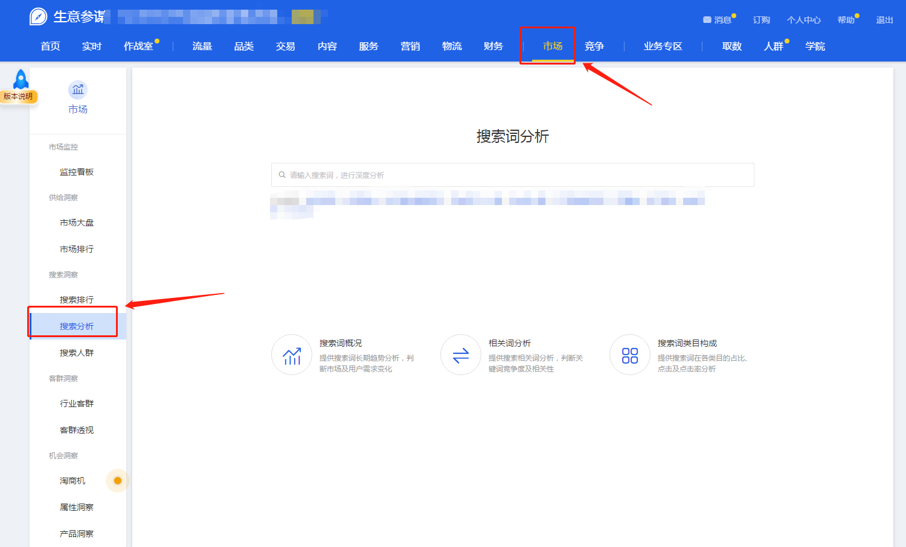

# 0.导言
---
其实关于蓝海概念，由来已久，各行各业都有蓝海的概念，电商行业也都知道要做蓝海，但真正的核心点在于细节，在于你对蓝海概念的理解。

我们邀请到盗坤老板来撰写了这份淘宝蓝海项目手册。
盗坤老板做的电商模式有很多种，而这个项目手册主要是面向个人中小卖家的一种电商玩法，即淘宝蓝海。

盗坤，一位93年的电商人。
做电商六年多了，目前运营着一家五十人的电商公司。
运营上百家淘宝C店，以及几十家抖音小店和拼多多。
大学就开始了解淘宝，15年开始全职做淘宝，也亏损了一整年。
到16年年底，通过《毛泽东选集》这套书悟到了蓝海理论，从此开始转型做淘宝蓝海。

盗坤：我们这套玩法的侧重点主要在于选品，选到那种竞争极其小的产品，然后实现降维打击。
并且我们使用一件代发不囤货的模式，所以相对而言，试错成本也比较低，可以快速试错。一旦跑通以后，就可以把相关流程sop，然后实现快速裂变复制。

# 1.阅读指引
---

## 1.1 零基础纯小白，纯新手卖家
---
一定要认真阅读我的全文内容，并且要根据我的内容去做好详细笔记，顺着我的指引去一一操作。

我想尝试将淘宝蓝海给大家写得细节满满，但是在具体编撰这个手册的时候，我才发现，淘宝确实是一个很复杂很复杂的体系。

从他的平台规则，到具体的实操步骤，行业经验，如果我要一一写完，这将是一个非常庞大的工作体系。

所以，我把你从0到1，学习淘宝蓝海最重要的一些环节，给大家罗列出来，讲解清楚。本手册，会基本阐述淘宝蓝海的具体流程，重要环节，以及所需要的一些配套资源以及一些信息搜集方法。

## 1.2 有一定经验的卖家
---
如果你是做过电商的，对于电商的底层逻辑非常了解，对于电商的基础运营操作也详细了解，那么你可以选择性阅读。

更加侧重于吸收我们的蓝海思维方面，对于具体的操作层面，比如如何开店，如何设置优惠券，如何做标题等等基础操作，你完全可以跳过忽略不计。

具体的学习计划，学习流程，也可以根据自己情况，选择性地调整。

## 1.3 有团队的大卖家
---
这份手册对于你的意义不大，淘宝蓝海的打法对于一个成熟的电商大公司来说，在战略层面和战术层面都没有太大的指导意义了。

淘宝蓝海项目更适合那种中小团队，通过无货源，一件代发的模式，轻资产，低成本试错，从而快速达到月入过万，接着再裂变复制。

所以，如果你是一个有着几十人的电商团队，那么这份手册对于你的意义不大了。
建议你可以直接跳跃性看一看我对于电商的经验之谈就可以了。

# 2.前期准备
---

## 2.1 信息渠道
---
文章的开头我就讲了，这是一个信息的爆炸时代，他有好也有坏。
正如狄更斯所说，这是一个最好的时代，也是一个最坏的时代。

最好的时代是因为，伴随着互联网的发展，我们可以免费地获取大量信息。

但也因为如此，这也是最坏的时代，我们需要浪费大量的时间去鉴别信息质量，增加了信息的筛选成本。

而且过多的信息，对于信息处理能力不强的人来说，还会造成信息冗杂，不成体系，无法学以致用。把收集到的信息应用于自己的实践。

而淘宝已经是一个运营非常成熟的电商平台，对于淘宝的运营是一个非常专业的技能，需要成体系化的知识结构。所以，碎片化的信息对于我们来说是不能学以致用的。

我们学习淘宝知识，需要有一个树状化的知识结构，再根据这个树状化的知识结构去一一添砖加瓦，构建自己的知识体系。具体的树状知识结构，我会在第三部分 [学习内容](#jump1) 给大家讲解，大家可以根据第三部分的内容，在思维导图画出自己的树状图（如下图是我自己根据自己的业务，所画出的树状图大框架）。再去根据这个树状图，一一补充具体每个环节。

我们获取信息，主要从两方面着手。

一是基础知识篇，一是认知经验篇。

### 2.1.1 基础知识
---
基础知识，指的就是关于淘宝运营的一些基础知识。比如如何注册账号，如何开设店铺，如何上架宝贝，如何设置优惠券，盗图处罚规则，发货规则等等。这些，都是一些基础操作篇的知识，有些知识是我们不用学习，凭我们的潜意识自然反应就可以学会的。所以，这部分，我也不想浪费大部分笔墨来写。

这部分问题，99%以上的基本上都都可以靠你们自己的信息搜集能力，把这个问题给解决掉。关于店铺基础操作的，至少有90%是可以靠百度和淘宝大学就能解决的。而且在后期，信息搜集能力也将是你非常非常重要的一个能力，保证你们在这个行业持续进步的能力。接下来，我给大家推荐几个常用的基础知识篇常用的信息搜集渠道。

+ 百度：其实时至今日，百度依然是PC端信息搜索非常便利的一个工具。比如你遇到一个淘宝如何开店的问题，只要在淘宝搜索，会有一些非常详细的“百度经验”“百度知道”“百度文库”以及一些其他站点链接介绍。所以，如果遇到一些基础操作篇的问题，还是可以利用好百度的。

+ 抖音：抖音现在绝对是一个非常棒的搜索系统，随着抖音流量越来越大，也有越来越多的电商博主入驻抖音。所以，当你有一些基础性的问题有不懂的时候，利用好抖音的搜索框，通过关键词来精准寻找你需要搜集的信息。这里也给大家普及一个讲基础知识篇的一个账号，【维斯纳电子商务】

+ 知乎：知乎是一个比百度更加高质量的搜索引擎系统，回答也更加专业，但是他的内容还是没有百度多，百度广。

+ 开淘网：这是PC端的一个电商信息网站，是蒋晖创办的，里面有各种关于淘宝基础操作的文章。其实类似的网站很多，但是这个网站是关于淘宝运营比较全面，所以我把他单独罗列出来。

+ 淘宝大学：这是淘宝官方的针对卖家培训的一个网站，很多人都会给你说淘宝大学是一个非常鸡肋，非常垃圾的网站。我想给大家说的是，这里面的课程大家不用专门去看，那里面的付费课程也都不要去报。对于一些有经验的卖家来讲，里面讲的也确实没啥营养。但是，对于一些纯小白，一些基础操作不懂的时候，还是可以用这个东西来搜索看看的。

+ 淘宝万象：淘宝卖家官方客服，具体的规则有不懂的，比如一个人可以开几个店，直接问万象就是了，以官方回答为准，比百度这些的准确度更高。

基础知识都是简单基础操作篇的，以上推荐的工具，都是不用每天去看，刻意去浏览的，只有遇到了，再去搜索即可。

### 2.1.2 认知经验
---
基础知识是针对基础操作的，其实很简单，遇到有不懂的，直接去搜索即可。
但是对于电商的认知，经验这个就是需要理论结合实践，在实操中不断提升的了。

接下来，我也会给大家推荐几个刷认知经验篇的工具。

同理，此类信息，大家也不用刻意去学习，而是习惯性地每天有空时抽一个小时刷一下这些软件，浏览一下即可。

+ 知乎：知乎上面现在的营销号太多了，也不乏一些有干货的博主，我本人也在知乎注册了账号的，但是这两年知乎的整体氛围没有以前那么好了，我都很少去活跃了。不过，知乎里面依然沉淀了大量电商类的干货帖子，所以大家有空时可以去刷刷知乎，看看里面的一些经验分享。

+ 抖音：抖音是一个短视频平台，抖音的知识都是碎片化的，但是也不乏一些优秀的观点和思维，所以大家有空时，也可以刷刷电商类相关的抖音账号。这里我就推荐推荐自己的，【盗坤电商运营】，我主要是讲认知经验篇的。

+ 公众号：一些优秀的电商博主，有开设自己的公众号，所以大家也可以订阅关注。

+ 知识星球：知识星球上有很多电商类的星球，里面除了有信息发布之外，也可以向星主提问，如果是免费的，可以随意加入。如果是付费的，自己可以参考一下星主本人的IP影响力，以及星球的具体服务内容。这里，我就不做具体推荐了。

### 2.1.3 工具软件
---
**信息渠道：**

做电商是需要用到一些软件和工具的，这些工具和软件有淘宝官方的，也有三方的。
具体包括如下一些渠道。

+ 盗坤团队：
    我自己在做社群，所以有专人去搜集对比市面上所有资源的最新动态，为我们社群成员提供性价比最高的资源。当然，也可以获取一部分小小的政策返点。所以大家有需要，也可以直接联系我们的资源对接官，向他咨询行业资源动态，他的微信号： dkzhuli_xl

+ 淘宝：是的，淘宝本身就是一个万能的淘宝，我们要用的许多工具也可以在淘宝搜索到。当然淘宝经常会定期排查删除这些三方工具，大家可以用简称，谐音词等。

+ 闲鱼、百度、微博、QQ群：当然，除了淘宝以外，闲鱼，百度，微博，QQ群都是我们可以搜索的渠道。

+ 淘宝卖家服务市场：这是淘宝官方的三方软件服务市场，包括像打折软件等等，但是例如生意参谋出租之类的工具插件还是只能用上述方法。

**资源汇总：**

接下来，给大家罗列一下一些我们自己整理的三方资源汇总。

当然，这些所有资源大家都可以咨询我们资源对接官。毕竟是他总结的，他也清楚哪些哪些坏，哪些是可以白嫖期的，哪些资源有他的坑，比如办理执照等等。而且，这些资源也在不断更新。

原本我们是只对我社群的开放的，考虑到张哥说要让大家都可以实操，我们确实也可以小赚一点点，真的是一点点钱，所以大家也可以具体咨询资源对接官：

**礼品物流网站：**

+ 大云代发

    http://www.dayundaifa.com/reg.html?recomuid=1788

+ 小天代发

    http://df.diantoushi.com/?inviteCode=0claw4#/

+ 初妆网

    http://df.lipinwang.cn/register?c=VP0HGD

+ 子牛代发

    http://tools.ziniu123.com/reg?foruid=703

+ 赏金礼品网

    http://lpdf99.com/?refer_id=278

+ 小商品

    http://lp.taobao007.vip/?inviteCode=MTgwOTk=

+ 淘神

    http://taoshen.qd1588.com.cn/

+ 小熊礼品网

    http://cs.awall.club/register.html?u=s5H3iJ

**补单资源：**

《商家补单优质资源列表》，可复制链接后用石墨文档 App 或小程序打开

https://shimo.im/sheets/5rk9drQmwPfxx7qx/wpO7k/ 

**工具类软件：**

1. 【将军令】

   将军令是分为网页在线功能和游览器插件功能。网页在线功能大概就是查词，分析竞品店信息，和一个选款透视。插件功能大致为参谋数据转化，直通车工具，淘客、市场等分析。

   

   缺点：
   + 因为它是网页版工具有时候网页会遇到奔溃，或者服务器崩溃等问题，导致无法使用，查询的词有些无数据显示等小缺陷较多。
     
   + 它无法查询蓝海词板块的实时数据，而且只能查询单天的数据，不可以查询7天，30天的数据分析，查询数据也有缺失。

   价格：
    
   目前我们已与将军令官方谈好合作，在官方价格基础上优惠100元。当然，还没有试用过的同学可通过下方链接获得试用期15天，觉得有必要再联系我进行转账开通
    https://www.musicheng.com/active/h34355.html，

   > 工具只是工具，不管是旧软件还是现在的将军令，并不能达到马上就选到好产品的效果
   如果没有注册过将军令的账号，初始密码为msc168。

2. 【蓝猫查词】

   **软件介绍：**
   
   蓝猫查词是一款专门针对查词的软件，它一次可以批量查询20个词，并且可以设置各种自己需要的参数指标。

   **软件界面：**

   

   **查词界面：**

   

   > 需要自己开通店铺然后绑定软件方开通了生意参谋的子店铺。

   缺点：
   + 功能比较单一，主要就是查词功能。
   + 另外需要绑定软件方开通了生意参谋的子店铺，偶会那边会自动取消绑定，然后需要使用者重新绑定子店铺。

   价格：
   
   月卡60 季卡150 年卡 500
   > 目前不支持新用户，可以等通知
   
3. 【初妆助手】

   **软件介绍：**
   
   初妆助手主是店群软件，主要可以用来采集和上下架宝贝。但是他有一个功能和蓝猫类似也是可以批量查词和筛选数据。

   

4. 【数据蛇】

   **软件介绍：**
   
   数据蛇也是一款竞店方面的三方工具。他和飞马，店查查的区别就是他是网页在线查询的模式。

   

5. 【店查查】

   **软件介绍：**
   
   可以白嫖免费版块，主要是拿来看店铺类目，采集评价和主图，分析评价和sku，需要其他功能再考虑付费。

此外【删差评资源】【办理执照资源】【申诉资源】等等，大家就直接联系资源对接官就是了，那些都是具体的微信，而且经常也在更换清理，我就不了解了。

## 2.2 学习工具
---

### 2.2.1 思维导图
---
前面我说到了，淘宝是一个非常复杂的知识体系，所以你需要把复杂的散状知识树状化，结构化，条理化，包括后期具体的知识点汇集整理，都需要用到思维导图这个软件。至于具体用 mindmaster 或者 Xmind 以及其他思维导图软件，大家可以视自己的需求而定（如下图）

### 2.2.2 云文档
---
树状化的思维导图有利于帮助我们梳理知识结构，但是我们还需要将具体的知识点做出细致化的补充和延展，这里就需要我们用到文档类工具来作为记录了。

我用的是石墨文档，大家也可以根据自己的需求选择适合的工具。
比如**飞书，石墨，金山，语雀**都可以的。

## 2.3 其他准备
---

### 2.3.1 资金
---
做淘宝是需要一定的资金的，以淘宝蓝海模式为例，至少需要几万起步，资金主要包括：
+ 店铺保证金（1000-5000元不等，关店可取回）
+ 样品购买 ( 视具体产品成本而定）
+ 拍照作图（整体成本500-800元）
+ 推广成本（主要是SD，根据自己能力来，一般两三千）
+ 流动资金（淘宝有一定的账期，需要一定的流动资金，视产品而定，一般两三万起步）

### 2.3.2 时间
---
做淘宝，要保证你白天可以自由地用手机回复客户消息，此外，每天还需要能有一到两个小时可以坐在电脑面前工作。

### 2.3.3 心态
---
没有什么行业是没有门槛的，淘宝也不例外，不要幻想着通过淘宝可以一夜暴富。现如今的淘宝也是一个非常传统的行业，受资本、团队、产品等因素制约，他的发展是需要一定的周期的。

### 2.3.4 工具
---
准备一台电脑，不需要太硬核的配置，满足基本的日常办公使用就可以了。此外，还需要准备一台手机，用以日常登录后台管理中心和客服聊天。

## 2.4 学习资料
---

### 2.4.1 书籍
---
没有特别推荐的，并没有让我觉得非常好的。如果真的要推荐，我就推荐一本，逐鹿的《7%暴利电商人》，讲思路思维的。

### 2.4.2 微课
---
网上微课千千万，但是质量参差不齐，而且单纯地微课对于知识吸收是不完善的，所以也不推荐任何微课。如果是100元以下的，或者一些盗版课程，大家还可以买来，闲暇时随意看看。

### 2.4.3 地图、日历、手册
---
这些碎片化的物理产品，对于系统化学习并没有什么帮助，有一定沉淀以后的卖家可以买来，无聊时翻一翻。

### 2.4.4 训练营
---
无论是淘宝学习，还是任何其他技能类的学习，如果真的要参加付费课程，我唯一推荐的，一定只有训练营。单纯看视频课程是非常枯燥的，许多具体化的问题仍然得不到解决。

必须是有售后交付，有答疑，有微信群，有一对一诊断的课程，大家才有必要参与。

# 3.学习内容
---

## 3.1 蓝海选品
---

### 3.1.1 为什么要做蓝海产品
---
把这个放在最前面讲，是因为知其然才知其所以然。只有讲清楚为什么要做淘宝蓝海，大家后面的所有操作才能有明确的指引。

淘宝的玩法有很多种，包括传统电商、店群、蓝海、内容电商、直播电商很多种。具体的，我就不去一一展开了。这些模式本质上其实都有共通的底层逻辑。

比如传统的店群，是无脑批量采集上架宝贝，靠着数量取胜，一个店铺上传几千上万个宝贝，做十个几十个店铺，那么就可以有N多链接和宝贝。但是随着平台打压，也在往蓝海选品，传统电商精细化靠拢。

而我们的蓝海玩法，就是依托于传统电商的运营规则，把运营的产品限定在蓝海产品上面，刻意围绕选品，提炼出一套选品方法，以及围绕蓝海产品研究出一套打法。但本质上，还是依照着传统电商的运营逻辑去做的，只是我们的重点是在选品！

所以，我们开篇要给大家讲清楚，我们为什么要做蓝海，什么是蓝海。

我们的主题是淘宝蓝海，第一个词是淘宝，第二个词是蓝海，而他的重点就在蓝海二字。淘宝蓝海其实就是把蓝海思维嫁接在淘宝这一项目上，事实上，蓝海思维还可以嫁接在很多项目上的。

蓝海是一个相对的概念，他是相对红海而言的一种称谓，也就是竞争不充分，不激烈的市场。每个人都有自己对蓝海的定义。拿我们做淘宝的来说，有的人觉得开个天猫店，人工干预1000单就能拿销量排序的第一，简直不要太轻松。在他眼里，这样的产品就是蓝海，但在有的人眼里，这样的产品，干预成本太高，这就是一个红海了。

所以，在我眼里【打得过的】都可以称之为蓝海。结合中小卖家的情况来说，具体就是指【对手弱】【对手少】，我们可以轻松地实现【降维打击】。当然，在此基础上还需要【试错成本低】。因为，留给我们中小卖家的试错资本并不多。

接下来，我将用理论知识来告诉大家，为什么要做蓝海产品。

我们整个淘宝的运营核心就是围绕一个公式展开的：

> 营业额 = 曝光 x 点击率 x 转化率 x 客单价

所以，我们运营的重点就是围绕访客和转化来展开的，这也是我们做淘宝非常重要的两个能力【流量获取能力】和【流量转化能力】。要给大家讲清楚为什么要做蓝海产品，就要从这两方面展开。

第一，站在平台的角度，他为什么会给我们流量？

第二，站在用户的角度，他为什么会买我们的东西？搞明白这两个问题以后，我们就能够得出今天的结论，要做蓝海产品。

**第一点，平台为什么会给我们流量**

关于这个流量分发的底层逻辑要一一去分析，讲述他的历史变迁，就比较复杂了。

我们今天呢，就直接给大家结论：平台是一个人工智能，他不是人为的分发流量，他是根据你宝贝各个维度的数据来给你决定你的曝光多少。

挑其中最重要的几个维度来讲，**坑产（也就是你的营业额）决定你的曝光量，点击率直接影响你的访客多少，最后转化率客单价人气等反过来作用于你的曝光。整个流量的分发其实是一个赛马机制**。

举例，平台给A，B两个产品都给了1000的曝光，其中A的点击率和转化率为10%，B的点击率和转化率只有5%，那么A的访客就是100，订单就是10个，B的访客就是50，订单才2.5个，这种情况下，你是平台，你会给谁更多的曝光？答案是显而易见的。

首先，是坑产决定曝光。我们新上架的一个宝贝，想要提高坑产的方法有哪几个呢？第一就是人工干预，第二可以通过付费推广，包括像直通车，超级推荐，钻展等。第三呢，可以通过活动，比如聚划算，天天特价，或者免费送等等。但是无论哪种方法，我们都是需要资金的。

其次是点击率直接影响访客多少。而如何提高点击率呢？你的视觉会影响点击率，大家肯定会点那种更美观，更有差异化的，这个需要优秀的团队来打造，这个还可以靠经验弥补；然后你的宝贝排名会也会影响点击率，越靠前的，越容易被点击，而要想靠前，就需要坑产，而提高坑产，前面说了需要资金；店铺资质也会影响点击率，猫店比C店更权威，点击率更高，但是猫店是需需要资金投入的。

最后是转化率、客单价、人气等会反作用于曝光。这其中最重要的是转化率，关于转化率我将放在第二部分用户为什么会买我们的产品讲。综合第一部分来看，平台给我们流量最核心的需要坑产，点击率，而要想做好这两点，我们就需要资金。

但是，我们小卖家最缺的就是资金，所以我们必须去选择那种坑产要求不高，视觉要求不高的产品，也就是市场小，对手猫店少，视觉还很弱的产品。也就是我们呼之欲出的答案，蓝海。

**第二点，用户为什么会买我们的产品**

同样，影响转化率的因素很多，我挑了三点来和大家讲。店铺资质，羊群效应和运营策划。

店铺资质这个就不多说了，猫店天然优势，这个需要的是资金。

羊群效应，即付款人数越多，销量越高，评论越多。举个袜子的例子，大家更愿意买销量更高的，又好像餐饮店，大家更愿意去人多的餐厅。那么新店开业如何吸引人多呢？打广告，做活动，还有的呢，比如奶茶店请托排队。对应我们淘宝就是做付费推广，搞活动，然后人工干预。其中，人工干预是效果最明显的，最直接的，还可以做评价。但是如果袜子这种产品，人家月销几万笔，你至少的做个几千笔的评价吧，一单的佣金十几块，十几万就出去了。所以我们要选择那些竞争小的，人工干预两三百单就可以当老大的。

运营策划，策划啥，视觉啊，也就是主图详情页，活动设计，客服话术等等，这个东西需要团队，咱们还可以靠自己的努力给弥补上。

不过整体来讲，大家算是看明白了吧。无论是想要平台给我们流量，还是想用户买我们的产品，资金都是很重要的。所以我们要选择那些资金投入不大的产品，也就是那些市场不大，天猫店不多，对手不强的产品，选择蓝海产品。

这里顺便给大家说一说我自己的淘宝运营历史。我15年开始全职做淘宝，然后15年亏了整整一年。为什么会亏钱？就是因为我做的都是些红海市场。最开始我是卖袜子，19.9元一盒的袜子，五双包邮，我一单也就赚五块钱。也就是说，我一个月就是卖1000单，我也就赚5000块钱。而且在排名不靠前的情况下，想卖1000单是非常困难的。所以有的人上来就想做这种红海类目，比如服装鞋帽啊，比如数据线、手机壳啊，其实是非常不理智的。你比如数据线大家都讲究性价比，你就算卖19.9，一个只能赚几块钱。卖1000条也就赚几千。我15年，会亏一整年，也就是这个原因。

我在15年亏了一整年之后，也想改变，我就花了9000多块钱，跑到福建莆田去学了。但是学完以后，我更加沮丧。

因为学完之后，我发现做淘宝是需要去冲量的，是需要资金去砸的。我大学同学当时一天开直通车三千块，一个星期人工干预1000单，一个链接做不起来，几万十几万就没了。而我总当时共只有八万块，所以我做的比较保守，一天也就开100块直通车，一个月人工干预1000单。所以在16年做了十几个链接，最后还是有两三个链接做起来，到年底算下来，赚了几万块钱。不过这段经历也让我有很多收获，对于淘宝运营的底层逻辑是弄明白了的。

转折在16年，16年年底的时候，我觉得有点撑不住了，想放弃。然后这个时候我就看毛主席的《毛泽东选集》，它里面讲了农村包围城市，还包括一些反围剿、集中优势兵力各个击破等等思维。其实就跟我们现在互联网降维打击很像。时间有限，这里就不展开说毛选了。

总之，做淘宝，大家都想做服装鞋帽，是因为这个市场很大。就好比服装市场是淘宝最大的城市，假设有2000个亿的市场，市场很大，所以呢也吸引了最多的卖家，假设有200万卖家来做，其中这200万卖家中有20万卖家的资金实力、运营实力都非常强大，他们就把1980个亿已经全部占领完了，最后180万的卖家来分个这二十亿。而且，我们在180万个卖家中排名都还很靠后，实力非常弱小。所以虽然服装市场那么大，我们依然赚不到钱。

那么，我应该去做哪些市场？

我应该去做“农村市场”，就是那些整个市场一年可能也就200万规模，但是做的卖家只有十几二十个，而且对手实力还很弱小的那种，那么这样的话，就很容易做起来。

所以当时我就做了一个产品“实体娃娃”。当时在淘宝上竞争非常小，没有天猫店。而且实体娃娃单价特别特别高，有卖三千多的，有卖七八千上万的。做的卖家也很少，主图详情页基本上就美图秀秀水平。当然，现在的情况已经完全不一样了啊，我后面还把这个产品这个经历在知乎公开了，引来了很多实力卖家，现在全是猫店了。

我当时做的时候竞争确实很小，而且我自己也怀疑究竟有没有人买。结果我做了以后第一个月卖出去五六单，就赚了一万五六。这个经历一下子就打开了我的思路，迅速在17年铺开这类东西，17年就赚了四五十万。

所以，为什么要做蓝海产品，我已经从理论和我的实际案例给大家说明了，这也是大家首先要在认知上搞清楚的问题。

### 3.1.2 蓝海产品的标准
---
前面给大家讲清楚为什么要做蓝海以后，接下来我就给大家说说蓝海产品的具体标准。

首先，我给大家普及一些基本概念：

**付款人数**：代表有多人下单付款购买了你的产品。

**月销笔数**：宝贝的销售笔数，举例一个人买了四单产品，那么增加的付款人数为1，增加的月销笔数为4。

**收货人数**：付款人数当中已经确认收货了的。在淘宝APP搜索某个关键词按销量排序的时候，即是展示的收货人数。

**搜索人气**：一个IP搜索一个词算一个人气。相对于【搜索热度】，搜索热度是指的次数。比如两个IP搜索了6次，那么搜索人气为2，搜索热度为6。

**点击人气**：同理，一个IP点击一个宝贝算一个点击人气，相对于【点击热度】，点击热度指的是点击次数。比如4个IP搜索了开心果12次，4个IP中有3个人点击了宝贝，点击了6次，那么搜索人气为4，搜索热度为12.点击人气为3，点击热度为6。

**在线商品数**：是指的包含有这个关键词的在售宝贝数，在线商品数越高，竞争就越大。

**商城点击占比**：指的是点击点击次数里，有多少百分比的点击是点击的天猫店。商城点击占比越高，竞争越大，对于C店的机会就越小。

**直通车参考价**：所选关键词当前的直通车参考点击单价，直通车参考价越高，说明推广出价越高，竞争越激烈。

在普及这些基本概念之后，我给大家介绍一个数据查询工具，【**生意参谋**】。这是淘宝官方的数据查询软件，我们可以用生意参谋的–搜索分析功能，来查询关键词数据。

这个软件呢，2021年7月1日以后，部分达到要求的商家可以免费。目前还是需要1000多一年，但是大家不用担心，网上有很多这种租用资源，几十元一个月左右。

大家可以自己去咸鱼搜索相关资源。不过友情提醒，这种资源不太稳定，一般建议不要买一个季度或一年，按月购买。

我们有了这个软件以后，就可以清晰地看到我们的关键词数据，也更有利于我们数据化的选品。前面我给大家大概讲解了一下蓝海的概念，那么今天就教大家用数据化的手段来判断蓝海。

大家可以看看，“连衣裙”这个关键词，每天有6万人在搜索，但是有131万个商品在竞争。

“男士皮鞋”这个词，每天有1万多人搜索，但是有2500万个商品在竞争，而且有69%的人选择了天猫商城。

这正如我昨天给大家说的，这种市场这是一个很大的蛋糕，但也正是因为这块蛋糕太大，而吸引了太多卖家进场，变成了一个红海绞肉机。

但是，大家再看看另外一个词“菜狗手办”，网红基金经理，蔡经理的手办。828的在线商品数，不足1%的商城点击占比。

那么，我们选择蓝海产品的基本原则，就是做那些竞争小，利润高的产品。主要就是两方面，第一是对手弱，第二是对手少。

**对手弱，主要指**：
+ 销量没有那么高：按销量排序，销量最高的收货人数一般不超过1000；
+ 商城占比不高：一般占比不超过20%.
+ 运营水平差：主图，详情页等视觉效果很差，基本上是美图秀秀水平，比如我的苜蓿酵素

**对手少，主要指**：
+ 绝对卖家数量少：在线商品数低，一般不超过5000
+ 相对卖家数量少：日搜人气大于在线商品数

此外呢，我们也还有一些具体的**指标**：

+ 过去30天每日搜索人气基本在1000-5000左右（通过阿明插件转化日搜索人数基本在500-1000人左右）
+ 这个产品商城点击占比不高于35%，天猫，全球购等店铺越少越好，最好是没有。
+ 关键词竞争度=日搜索人气/在线商品数>=1（尽量保证每个宝贝1天可以分得1个人气以上）
+ 客单价尽量在100以上，才能保证每单有足够的利润。（我的标准是1单50+利润以上）
+ 通过手淘搜索产品的蓝海词，销量第一月销尽量在300-500以下，对手主图详情页越差越好。

当然，我这个给的指标，也是一个灵活的指标，大家可以根据具体情况来调整。不要把自己框死在里面，数据是死的，产品是灵活变化的。而且我文章开头也说过，蓝海是相对的，打得过的都可以称之为蓝海。

比如，如果一个产品的日搜只有五百，但他的的竞争对手非常少。那么它同样是适合我们拿来练手的。任何蓝海产品的选品都是变通的，也不是说符合上述数据的就一定是蓝海产品，数据只是一方面，因为最后我们还得分析手淘与实际产品 。

至于利润高，这个就更好理解了。你想一个月赚5万块钱，卖袜子，一单赚5元，你一个月要卖1万单。但是如果一单利润有1000，你就只需要卖50单。你觉得是卖50单容易还是卖1万单容易？就算一周才卖一单，一个月才卖一单，也要抵你卖很多袜子了。

### 3.1.3 如何选择蓝海产品
---
挖掘蓝海产品的主要方法有两个，一个是通过**数据筛选**，一个是**挖掘小众需求**。

#### 3.1.3.1 数据筛选
---
数据筛选其实就是基于我们刚刚制定的选品标准，然后将生意参谋的数据做一道过滤筛选。这里呢，我也给大家介绍另一个工具【将军令】（说明一下，推荐这个软件不是因为它多好用，而是这个软件有试用期）。当然如果真的有需要购买的，这个产品是有优惠的，大家可以联系我刚刚说的资源对接官。

那么，如何通过选品软件选品呢？

我们主要通过设置筛选的数据，然后利用选品软件快速筛选到符合我们要求的产品。举例，我们用选品软件搜索“洗发水”这个关键词，大家可以看一看，“洗发水”这个词竞争很激烈。

我们把日搜索人气设置成1000以上，商城点击占比20%以下，然后再点击查询，就可以把符合蓝海要求的产品找出来了。

比如这里面的“玖蔻洗发水”竞争就小了很多很多了，我们再到淘宝去搜索关键词。

洗发水这个关键词按销量排序竞争非常激烈，收货人数都是几万+，而且都是天猫店，视觉效果很牛逼，还有直通车广告。

但是玖蔻洗发水这个词的竞争就小了很多很多了，最高收货人数才400多，对手主图详情页也很差，基本上150人收货就可以进入前三名了。

这就是用市面上的用选品软件数据筛选的一个选品方法。

对了，给大家补充一点：将军令里面蓝海值，竞争度，这些可以忽略，没有参考价值，不能盲目相信数据。

#### 3.1.3.2 小众需求
---
数据筛选固然可以提高效率，但我用的最多的方法还是通过挖掘小众需求来挖掘产品。

蓝海产品的本质就是小众需求，因为需求小众，所以知道的人就少，卖家就少，而且因为市场小，大卖家也看不上。所以有小众需求的地方，一般很容易挖掘出蓝海产品出来。

举例，小众运动，马术就是一个很小众的运动，这还是算一个高消费运动了。所以和这个运动相关的产品肯定也是小众的。就比如，马鞍。

当然除此之外，那些小众文化，小众爱好，小众品牌，影视剧同款，等等等等，都是大家可以挖掘的。

## 3.2 货源
---
新手卖家，一定一定不要囤货，而应该采用一件代发的模式。我自己的公司即使做到现在，上百个店铺，依旧用的是一件代发。

新手卖家进入淘宝，初期先不要想着挣钱，而应该是以最低的成本快速跑通基本路径。
你的第一个链接很大可能是赚不了钱的，主要是为了学经验。所以如果你要是囤了一堆货，最后没做起来，只有砸在自己手里。

所以不要一开始就傻乎乎地囤一堆货，不要还没开始赚钱，就先投入一大笔资金，到时候不好调整方向。用一件代发的模式，即使我们第一个产品没做起来，拍拍屁股，重新选择一个产品开始就可以了，不然一堆货砸手里，你想转型都不好转型。

做淘宝，产品本身很重要，但并不一定代表我们要囤货。自己囤货也不一定代表你的产品就比一件代发的发，你的发货速度就比一件代发的好。

新手卖家重营销，轻产品，控制试错成本。

**关于一些货源类的问题：**

Q1：哪里去找货源？

A1: 只有有利润差价的上家，都可以成为你的供货商。只要是信息集散地，都可以成为你找货源的地方。闲鱼、拼多多、淘宝、1688、微博、小红书、百度都可以是你找货源的地方。

-----
Q2：供货商不愿意退货怎么办？

A2：边卖边看，卖的同时也再找货源，反正不囤货。如果有退货的，不影响二次销售继续，影响了，可以闲鱼处理。反正最后，即使有一部分退货，能赚钱就继续卖，发现不赚钱就卖了就是。

-----
Q3：如何确定产品质量？产品有30，50，80，120的，我该选择哪个?

A3：把市面上的样品都买一个回来，和正品对比，在保证质量，正品的前提下，哪个最便宜用哪个，其余的都退回去。

-----
Q4：如何和供应商谈价格？

A4：我不擅长讲价，但是我一般都是高毛利产品我才做。所以我不太在意供货商贵个几块，十块的，我也不在意运费贵个几块的。和供货商，我一般是先卖，先不说那么多。量大了，再去找他谈，或者找新供货商。

## 3.3 主图详情制作
---
选好产品，找好货源，接下来，我们就要开始制作主图详情页了。

我以前会告诉新手，标题可以抄，图片不能盗图，因为盗图要是被对手发现并投诉的话，直接删除你的宝贝链接。最惨的是你刚刚起步有点起色的时候，被删除。

但现在，淘宝规则改变了，第一次盗图不会被删除。所以，为了节省时间，降低成本，同时快速测试这个产品是否可行。我现在也赞同初期先盗图上架，刷几十单测试一下，如果确实可行，我们再深度优化，自己做主图详情。

为什么要自己做主图详情页呢？首先，你抄过来的主图详情页是没有差异化的，那么问题来了，同样的宝贝，同样的主图详情页，别人的信誉比你高，销量比你高，评论比你多？你告诉我，你是客户，你选谁

其次，虽然盗图不会第一次就删除你的宝贝，只是要求你整改。但是一次整改以后，再次投诉，你的宝贝就会被删除，所以早晚都要自己拍照作图的。

那么我们该如何制作主图详情页呢？

### 3.3.1 指导思想
---
做好一个优秀的主图详情页的第一步是建立【用户同理心】。没有人喜欢被说教，被教育。

为什么现在大家都很反感销售？无论是买房子，买车，买保险，大家对于销售都带有天生的敌对心理，带有极强的防备心理。除了作为买卖双方，站在利益的两头，还有一个很重要的原因就是销售带有很强的攻击性，并且喜欢给用户制造极强的压强。销售在享受自己逼单的快感时，用户就有多么反感自己被动的局面。

没有人喜欢自己被说教，被教育。所以，即使你是非常真诚而专业的建议，在用户高度防御意识指导下，他也会对于你的建议产生高度戒备心理。

真正的好销售应该是建立在好产品的基础之上，销售通过顺应用户的潜意识，做好引导，将自己的产品优势一一引导出来，然后再利用好一些好的小技巧给消费者一些 “ 高性价比 ” “ 满足感 ” “ 安全感 ” 。最后突破用户防御，促成成交！

每一个人都偏向于相信自己所相信的东西。我不要【我觉得】，我要【你觉得】，做主图详情页，最忌讳的就是【我觉得】

通过主图详情页影响消费者的最高境界，并不是你向消费者灌输你的产品多牛逼，你向消费者宣扬你的产品多牛逼。而是通过引导消费者的思路，让他们在自己的心目中得出看法和结论。

就好比你强行宣传“官网正品”就不如晒“实体店照片”“购物发票”等素材让消费者自己去判断。

一个是你强加给消费者的观念，一个是消费者自己作出的判读和结论，你觉得，你自己是愿意被灌输还是愿意自己判断呢？

我们卖家不要“我觉得”怎样，要站在消费者的角度去想“你觉得”怎样？

就好比房产销售，消费者在走进你这个楼盘时其实就已经初步建立起了一个初步的认知体系，这是基于他的潜意识，而不是基于你的 “ 灌输 ”。包括你的品牌，区域位置，地铁交通，小区环境以及走进销售大厅后的装潢，物业销售人员的穿着、接待、话术等等…

所以，好的产品，是一个好销售的基础。产品既有的品牌，形态，展现方式已经在用户的潜意识里建立了一个认知基础。

一旦他对你的产品有了一个基础的认知，是很能改变的。比如你的交通很差劲，位置很偏僻，只要用户自己建立了这个认知，你是很难扭转他的想法的。除非是消费者基于信息不对称，你告知了他这里有其他的开发计划。可即使如此，消费者还是会对于此，保持一个怀疑态度。

即使他最后买了这个房，也并不是因为你告诉他这里会有新的开发计划而让他动了心，仅仅只是因为这个产品其他方面的优势打动了他，这个优势足以大到他可以忽略甚至自我麻痹交通上的这个缺陷不算缺陷。

所以，如果你作为一个销售，这种情况下，当你所售的房产确实交通上有无法弥补的缺陷的时候，你不要试着强行颠倒黑白，灌输这个交通其实很好，那是毫无意义的，只能徒增顾客的反感。

你能做的只能是尽量抓取有关于交通的有利的信息，如果客户仍然无法打消疑虑，那你就需要淡化这一缺点，然后尽量往其他优势上面引导。

前面给大家讲的是抽象的理论，接下来我将给大家具体来讲如何制作主图详情。

### 3.3.2 制作流程
---
首先是买样品，其次是自己设计文案，寻找素材，最后找专业美工制作主图详情。

在图的质量上，大家千万不要图省钱，直接盗图。因为盗图，一旦被投诉，那么你的宝贝就会被删除，你之前的所有努力就要打水漂，又要重新开始。

同时，大家自己本身不会美工也不要听一些所谓的导师给大家推荐的图怪兽啊之类的三方软件，自己做图。因为主图详情页是非常非常影响转化率的，我们做淘宝的最终目的是要赚到钱，而不是省钱。

如果你省钱自己做的主图详情页，转化率极其低，那么你最终还是没有达到赚钱的目的。所以，该花的钱，就要花。不要啥都想到免费的，除非你自己很懂PS，否则，还是交给三方去做吧。

找作图的美工，大家可以在淘宝网上搜索“淘宝主图详情页制作”。一般拍照也就两三百块一套，做图也就五六百一套。

接下来，我就开始来给大家介绍我们的主图详情页该如何制作。

我们的主图分两种：一种是800x800的，比例是1：1的，一种是750x1000的，也就是比利是3:4。

800x800的主图总共5张，主图第一张也叫首图，也就是展示在搜索界面的。最后一张图，一定用白底图，白底图的意思就是，没有任何文案，纯白底的图片。

为什么要放白底图呢？因为白底图有机会被系统抓取，推荐到手淘（手机淘宝）首页，那么你就有机会获得，手淘首页的流量。

750x1000的是长主图。如图所示，这种长尺寸的就是750x1000的长主图。这种长主图更加美观，但是开通这种长主图，需要上传3：4的视频，然后才可以上传长主图。

但是新店铺不可以上传视频，需要运营一段时间，所以我们一般都是初期用800x800的，后期就用750x1000的主图。

具体的，大家可以看下面的图。

说清楚主图的结构以后，我就接下来给大家说应该怎么去做主图详情页。

主图详情页的具体制作可以交给网上找的专业的三方美工制作。但是设计，布局要我们自己想清楚。

随着智能手机的普及，人们通过手机购物越来越便捷，人们的注意力越来越珍贵，越来越没耐心，稍不满意，就直接划走了。所以，我们一定要好好设计好主图详情页，珍惜好用户的有限注意力。

图片一般有两部分构成，一部分是文案，一部分是图片。

我们先说说这个文案。

其实文案信息，说起来很复杂，但是其实也就是三种信息：

+ 卖点信息（优惠券、满减、打折、满几送几....）
+ 产品信息（功效、使用方法、注意事项、适用人群....）
+ 卖点信息（7天无理由退换、假一罚十...）

做主图详情页就是通过你市场的调查，对对手的调查，对产品的调查，然后设计你的价格、活动、产品信息、产品卖点...

除了以上信息，我们还要知道，这个产品对应的客户群体，最关心哪些问题。那么我们就可以从【问大家】这个板块，以及【评论】这个板块，采集相关信息，统计出高频率问题

将这些信息全部罗列出来，按其重要性，排列先后顺序然后将这些信息编辑成文案，放在我们的主图详情页里。

我们要把最重要的信息放在主图，在详情页里再对这些信息进行更进一步的详细阐述。

聊完文案，再来给大家聊聊图片

产品图片，我们交给专业的摄影机构，他们更加专业。至于应该如何配色、排版，将我们的文案和图片结合起来，以期达到美观差异化的目的。

那么，我们一个完全没有设计经验的新人应该如何去设计主图详情页呢？

答案就是，模仿！

举例，如果我们卖的是海参。我们可以先自己设计好文案，再去淘宝上多逛。去逛那些优秀的，销量高的，大店的宝贝链接。找好模板，然后直接根据模板，调整套上去就可以了。

给大家看几个例子：

我们的文案：底播海参–大连，无盐无糖、15-17倍泡发率、纯天然无添加
淡干海参

我们找的模板：

运用上去就是：

另外一张同样是模板：

制作主图详情，多去看，多去逛，然后将设计好的文案，原图，模板都找出来，然后发给美工制作即可。

## 3.4 制作标题
---
选品、主图、详情页完成之后，我们需要为宝贝拟定一个上架标题。淘宝本质上也是一个【搜索引擎系统】，只是叠加了电商的属性而已。所以标题对于淘宝运营同样很重要，我们宝贝要获得曝光，首先就是标题里的关键词要被抓取到。

那么如何制作标题呢，接下来我将为大家一一讲解。

首先淘宝的标题最长只允许30个字，我们不能浪费任何一个字，一定要全部填满30个字，我们如何通过30个字的标题最大化我们访客人数呢？

什么是关键词？关键词就是构成我们标题的主要元素，分为以下几类：

+ 核心词 —— 也就是我们店铺产品的定位。如果不知道自己产品的定位可以在主题市场参考一下。
+ 属性词 —— 修饰产品的名词。例如：产品的款式、样式、颜色、特色。
+ 目标词 —— 核心词+属性词
+ 长尾词 —— 多个属性词的叠加

一个好的标题，是根据不同店铺、产品等状况，侧重“关键词”运用，让“产品”快速获得“展现/曝光”机会，从而获得更多“展现/曝光“

标题拟定分为以下三个步骤：
+ 如何挖掘关键词
+ 如何筛选关键词
+ 如何组合关键词

### 3.4.1 如何挖掘关键词
---
打开生意参谋，输入你做的产品的主要关键词，下面我依照“连衣裙“举例，主要关注过去7天的数据，关注下五个维度即可：
+ 搜索人气：有多少人搜索后收藏、加购
+ 搜索热度：搜索的的人频繁搜索多少次
+ 支付转化率：搜索人气中，产生多少订单的比率
+ 在线商品数：该关键词下有多少商品，暂指市场对手
+ 商城点击占比：搜索人气中，有多少人点击天猫的商品

生意参谋->市场分析->搜索分析->相关分析，在“7天数据”中，搜索人气、点击率、转化率、在线商品及商城占比，五个指标的数据。再从“Excel表格”新建表格，将这些关键词全部复制到表格内，选择一页显示50条或100条。

### 3.4.2 如何筛选关键词
---
首先，我们进行“初步筛选”，将一些不符合我们产品的品牌词、修饰词一一删除。比如：产品属于“韩版”，那就删除“欧美”；产品属于“圆领”，那就删除“v领”；产品属于“女装”，那就删除“女童”等等，请举一反三。

其次，我们再次“公式筛选”，用“竞争度”进行筛选。

> 竞争度 = 搜索人气 * 点击率 * 转化率 / 在线商品数 * 10000。

然后，我们用“Excel表格”的排序功能，对“竞争度”从大到小来选择，再把“竞争度很低”的词一一删除，最终剩下的“关键词”就精准多了。竞争度越大，说明这个词语越有优势，越容易后期人工干预的时候把这个关键词的权重刷上来，从而获得更多的手淘搜索流量。

此外，我们是淘宝C店，那就将“商城占比高”的词删了。

最后通过上述数据筛选之后，词语就没有剩下多少，我们就能从这些筛选出的词语当中去排列组合成我们宝贝的标题 。

这里需要注意几点：

1. 我们在挖掘“关键词”时，是多个同义词开始；比如，连衣裙、长裙、裙子、碎花裙等等，否则单靠“连衣裙”筛选下来，根本剩不了几个词。

2. 我们筛选“关键词”时，多参考生意参谋的相关词、属性词的行业趋势，用于后续的“标题组合”的排序先后。

### 3.4.3 如何组合关键词
---
1. 标题为30个字或60个字符，尽可量完善；
2. 不要多次堆砌关键词
3. 不要使用极限词、营销词
4. 善用AB词，比如连衣裙女 中长款与中长款连衣裙 女、空调扇 家用与家用空调扇
5. 某些词中有空格，在中间填入1-2个属性词或修饰词；如“港味连衣裙夏 气质”，“港味连衣裙夏学生气质裙子”
6. 注意首尾相连、紧密排序
7. 注意类目词、同义词、相关词在标题首中尾相连
8. 注意标题的通畅度、美观性
9. 淘宝收录的时候从两头往中间收录，所以前端和后端要放相对重要的关键词。
10. 优先遵守完全匹配、顺序无关原则，数据好的关键词不进行拆分。

以上就是打造一个好的宝贝标题的方法。

## 3.5 上架宝贝
---
详情页、主图、标题都准备齐全之后，我们就要开始上传宝贝。上架宝贝需要一个店铺，所以我先跟大家讲讲淘宝店铺的类型，该如何选择店铺。

### 3.5.1 天猫店
---
大家逛淘宝都能看见，随便搜一个产品，首页前几名一定是天猫店。这是阿里的亲儿子，天猫店的权重确实是高于C店，所以我们做蓝海产品其中一个重要的维度，那就是该产品天猫店占比一定要少。

天猫店成本非常高，买一个店十几万起步，还要几万保证金，几万技术年费，而且每一笔订单都要提成。所以我们没必要尝试，我到现在也没有开一个天猫店，各位中小卖家就更没必要。

### 3.5.2 C店
---
C店是企业店和个人店的统称。

企业店，即用企业营业执照注册以企业为主体的店铺，店铺名、子帐号的选择、商品数上都会有数量上的增加。个体户执照和公司执照价格都差不多，也都可以办理企业店铺，没有权重高低之分，一样的。

C店，CtoC，即个人对个人的交易模式，以个人身份证注册，无法转让。个人店铺开店步骤更加简单，所需材料也很容易准备，个人店铺也可以升级为企业店铺。

注意：每个人的名下最多拥有六个店铺，用身份证可以注册一个C店。另外可以再办五个个体户营业执照，一个执照办理一个C店。

我们中小卖家，开第一个店，不用那么复杂，就用身份证开个个人店就可以了。如果还需要开多店，可以用父母亲戚的，也可以找资源对接官办理三方执照。

开好店以后，大家需要对店铺进行一些基本设置，包括店铺名字啊等等。这里提醒一下大家，店铺的名字是可以随意更改的，但是旺旺号一旦设置了就不可以更改了，所以要慎重。

这里也给大家说一下，可以参考《淘宝大学》学习如何设置这些基础设置。但是友情提醒一下大家。第一，淘宝大学很多是废话，而且内容繁多，不建议大家去啥都瞎看一顿，很废时间。第二，淘宝大学有些课程要收费的，相信大家有自己的判断力。

关于上传宝贝，在确定好自己要卖什么后，首先就要确定这个产品属于什么类目，不同的类目对资质要求，保证金，都有不同，并且如果上传错了类目，访客量会受到很大的限制。

所以这里也严重提醒一下大家，千万千万千万不要放错类目了。而我们如何查看宝贝的类目呢，我下面给大家介绍两种看产品类目的方法：

1. 把浏览器安装店侦探或者店查查插件，将鼠标放置在类目这里，即可查清楚自己所要卖的东西属于啥类目。

2. 也是最精准的，通过生意参谋查询所查的关键词哪个类目占的流量最多，就是哪个类目。输入关键词，然后点击类目构成，即可以看到。我们这个关键词在哪个类目占的流量最大，就选择哪个类目。

## 3.6 人工干预
---
产品选好了，主图详情做好了，标题做好了，宝贝上架了，接下来就是需要推广带来流量访客了。这是我们整个淘宝运营消耗资金最大的一个版块，也是对我们的访客转化影响最大的一个版块。整个淘宝的主要营销推广都是基于一个大方向，先战略亏损积累销量、评价、权重，拉升排名，获取流量。

当然，要想搞清楚我们应该如何营销推广，大家应该搞清楚淘宝的流量的分发逻辑，计算宝贝权重的各个维度。这个，我之前的文章有所介绍，大家可以看看之前的文章。当然，如果追求精细化理解的，最好利用好本文前面《信息渠道》讲到的，还是多刷刷各种论坛，甚至买专业的课程讲解。但是我们淘宝蓝海没这个必要，我们就做搜索流量就可以了。我首先给大家讲讲我们常见的推广手段。

淘宝现在的营销推广有多种方法，但主要包括以下几个方面：

### 3.6.1 淘宝站内SEO
---
这是流量最大，也是最重要的流量来源，手淘搜索。

站内SEP，简单来讲，其实就是SD。淘宝站内SEO，就是要提高手淘搜索的流量，提高我们宝贝关键词的权重，从而提升宝贝综合排序，活得更好的曝光。而拉升关键词权重最好的办法，就是提高关键词成交，也就是我们所谓的坑产，即营业额。所以，我们最好的办法就是SD。

### 3.6.2 站内付费推广
---
最主要的工具包括直通车，超级推荐。直通车是最古老的站内付费推广工具，也就是关键词竞价排名。我自己是做淘宝蓝海模式的，甚少开车，但是如果在转化率OK的前提下，还是可以适当开车的。如果开车费用不大，流量占比不高，又或者像我们蓝海的关键词本身就不多，大家自行浏览一些开车帖子即可。

如果是大类目，开车预算大，流量占比高，需要持续开车，建议大家还是系统性地购买专业课程学习。

至于超级推荐，个人认为逻辑很简单，就是货找人模式。系统根据大数据，把你的宝贝投放给目标意向客户，简单摸索一下即可。

### 3.6.3 活动报名
---
这个主要是通过报名淘宝官方的活动，诸如聚划算，天天特价等活动，达到快速冲量的目的。但是这个活动报名有门槛要求，对于店铺的层级，营业额，库存，价格等都是有要求的。小卖家不适合，我也从来没有参加过。

如果当你的店铺涉及到这个层面了，建议你可以聘请专业的，有着活动经验的运营来做活动。如果是中小卖家，尤其是一件代发的卖家，基本上就不用参与了。

### 3.6.4 淘客冲量
---
淘宝客是淘宝官方的阿里妈妈旗下的淘宝联盟的营销工具。淘宝卖家将宝贝上传到淘宝联盟里，设置一定的佣金，然后淘宝客将生成的专属推广码，放到站外引流，通过推广码成交的订单，将会给淘宝客计算佣金的CPS模式。

不过淘宝客大多数时候是用来冲量的，而并不是用来销售产品赚钱的。而且跑淘宝客的产品一般都是一些生活必需品或者零食以及一些优质品牌，还需要有大量的优惠和佣金。

因为我自己做的是淘宝蓝海，销售的产品也都是一些稀奇古怪的冷门产品，许多人连听都没听说过，所以也不适合用淘宝客推广。各位也可以根据自己的产品特征选择。

需要找淘客推广的，可以在淘宝搜索“大淘客”有专门的淘客网站，也可以在QQ群搜索“淘客”找寻相关资源。

### 3.6.5 内容营销
---
包括在站内做淘宝直播，发布微淘，自己经营淘宝达人号。又或者去知乎、小红书、豆瓣等站外写软文引流。这种操作模式，对于个人的内容制作能力，平台引流能力要求比较高。如果不擅长的中小卖家，不建议刻意去经营。

虽然有各种各样的推广手段，但是我们做蓝海，都是一些小众产品。所以，我们就做好最核心的手淘搜索流量就可以了。而要做手淘搜索流量，性价比最高的还是人工干预。

当你通过牛逼的主图吸引客户点进了你的宝贝，通过丰满的详情页让你的消费者了解你的产品之后，这个时候，他就会点开你的买家秀。如果你的评论区啥都没有，没有追加评论，没有带图评论，甚至没有评论。那么很遗憾，大多数的情况下，你的客户他会直接往左滑动手机，退出你的宝贝界面，至多也就是加购收藏。所以，我们要通过补单解决你的基础评价问题

而且流量有很多种，有付费流量，免费流量，站外流量。抛开付费流量不谈，在免费流量里面又有手淘搜索，手淘首页，猜你喜欢等等，而这其中最精准的流量来源就是手淘搜索！

我们运营要做的重点工作就是获取免费的手淘搜索流量，答案就是补单，以下我们用人工干预代称。

模仿真实的购物轨迹，搜索关键词，找到宝贝，最后下单。这一过程就会增加这个关键词的权重，从而提高我们这个宝贝在这个关键词下的展现率，最终获得精准流量。

首先，我们人工干预分四个阶段：
+ 新品破零阶段：这是最简单，最基础的，新品想要获取更多曝光，上架24小时之内破零。
+ 基础销量评价阶段：宝贝要想有转化，就得有销量和评论，也是我们获取第一波测试流量的机会，一般在初期至少要做好二三十个基础精品评价。
+ 流量冲刺阶段：新品初期销量和评论不多，转化不理想，坑产不高，访客也不高。所以，这个阶段需要通过人工干预来快速提高坑产，增加销量和评论，提高访客，促进转化。
+ 维护阶段：宝贝进入了稳定期，出单稳定。这个阶段就需要做好宝贝的数据维护，维护好转化率，稳住搜索流量。

其次，给大家介绍一下淘宝是如何稽查人工干预的。宝贝降权，意味着该宝贝30天内，会被屏蔽搜索流量。用户通过关键词搜索，无论是综合排序还是销量排序都是无法找到你的宝贝的。对于该宝贝的其他流量，诸如猜你喜欢，手淘首页，购物车等流量渠道，没有影响；对于店铺的其他宝贝，没有影响。

那么淘宝又是如何稽查的呢？

淘宝的稽查分为三个层级：
+ 日常普通稽查
+ 专项稽查
+ 年度严查

随着稽查维度不一样，其稽查的力度，排查的力度也不一样，真的碰到年度严查，我们也很难规避，大家把这个当成正常损耗就是了。

具体来讲，淘宝稽查的维度以下几点:

1. 黑号占比

   黑号主要是指人群标签混乱，多个账号共用一台设备，一个IP，也就是购物行为不正常，经常被降权，从而被淘宝判定为恶意炒作信用的账号！所以，这些黑号，都是淘宝重点观察对象，这些黑号在你店铺订单占比过高，那么，轻则删除订单销量，严重，直接降权。

2. 关联度

   关联度才是我们最最最难避免的，关联度就是支付宝有过交易往来，互为好友,或者淘宝账号互为好友，分享过宝贝,并且经常共有一个IP，一个局域网。这些有关联度的账号如果一起到你店铺买东西，那么，你就危险了！

3. 物流

   不能使用空包物流，必须使用真实物流，直接用礼品单代替。

4. 宝贝数据

   如果超出行业数据太高，容易引起稽查。

当然，即使我们知道了这么多维度，还是很难去避免，因为买手资源质量，是我们很难把控的。这个大家也可以多去试试，我们在文章【工具软件】部分也把我们整理的资源信息公布给了大家，大家也可以直接联系我们的资源对接官。

除了知道人工干预的目的，阶段和稽查维度。我们还需要知道如何去人工干预，把控人工干预的节奏，而人工干预，最重要的就是三点：词、速、量。

第一，词要精准

我之前跟大家说了，我们刷的词，不能是一些功能性的词他必须是能找到特定产品的，那么搜索这个词的人全都是精准的。

比如说 么尚洗发水

如果你嫌这个词流量低，选择人工干预其他流量更大的词，想蹭其他品牌的流量。比如说就算你人工干预了500单【海飞丝洗发水】并获得了 展现，但是你获得的流量是不精准的。

人家搜索海飞丝洗发水就是想买海飞丝，看见你也不会点你的宝贝，就算不小心点进去也不会买你的东西，概率太低了。

还有如果你想人工干预【洗发水】这个词，可以看看我的截图。

pc端跟无线端搜索情况不一样，大家可以自己拿手机搜看一下。综合排序竞争是非常激烈的，并且搜索人群非常的不精准，就算流量大，有什么用，什么阿道夫，韩方五谷，都是一些没怎么听说过的品牌。

造成这种多品牌竞争的原因就是因为搜索【洗发水】这三个字的客户，自己都不知道自己要买什么产品。进而你想在这里面竞争，获得访客的难度非常大，就算有访客转化率也非常低。

所以，大家要刷的词必须是跟自己产品属性相关的，这样曝光才能精准，访客也才能精准。你乱人工干预一些词，带来的访客没有转化是没有意义的

所以我经常跟我的社群成员说，我们做淘宝，不看访客，不看转化，我们只看利润。

这分别是第一页跟最后一页的数据，大家可以看到，前四个词基本就已经占了9000的搜索量

“量”是什么意思呢？

淘宝是一个羊群效应非常严重的平台，尤其是那种标品，就比如这种么尚洗发水。他们长得都一模一样，价格也一样，功能也一样，规格也一样。那么客户会通过什么办法判断自己应该买哪家店？

那么消费者就会更依赖评论跟销量来形成自己的判断。所以流量也会越来越集中在前几名，销量也就越来越集中在前几名那么你想喝到汤，想赚钱，你的人工干预计划，就必须以前几名为目标来制定。

“速”，就是人工干预的速度

这里我给大家一个更直观的表格的展示。递增法就是指，我要人工干预三千单，但是我用一个比较长的时间慢慢的把它走完完，并且单量增长有一个逐级递增的过程8-15-20-30-

坑产法是什么，我先确定我要放三千单以后我就会用七天或者半个月把这三千单给放完，坑产法简单理解就是有计划地短期内大规模人工干预。

**递增法**

这是刚开始

这是后面

**坑产法**

当然，这个产品我走的并不猛，其实可以更快，我走的还是比较稳。因为我的目标不在前三名，有的产品也不一定非要进前三

那么这两种方法哪种更好，比较难评判。我用我的经验跟你们说吧，递增法风险比较小，但是出单慢。上面展示的图片算快的，竞争太小，我很想给大家找那种比较合适的例子又不太好找。

我自己的店铺很多就是用递增法人工干预20天左右才开始出单，一个月以后才能稳定出单，每天稳定一两单的样子。但是坑产法大家可以注意一下真实单的单量变化，第二天那一单真实单应该只是巧合，平常都是稳定在第七第八天开始出单，使用坑产法效果更快这个是毫无置疑的。

也就是说，递增效果没那么好，但是对流动资金的要求会更宽松，也更安全。坑产效果好，但是并不是很安全，资金要求较大

## 3.7 评论、买家秀和问大家
---
人工干预的目的除了带来流量，另外一个目的就是做基础销量和评价，从而影响转化。而这其中，评论对于转化的影响更是非常非常重要，我们在制作评论的时候，必须非常非常走心。

做评论很简单，只要给刷手拍好图片、文字评论一起发送过去，确认收货之后评论就可以了。但是大家一定要怼评论的内容多加研究，一个好的评论，对于转化的帮助是非常非常大的，要好好想清楚，哪些是客户在意的问题，关心的问题，不要为了做评价而做。

问大家该如何制作呢？问大家的机制是这样的，未购买过宝贝的买家可以通过手淘向已成功购买的买家提问，一般可以提3-5个问题，注意时间间隔。淘宝会把每个问题随机推送给3-5个已购买的买家，卖家可以回答每一个问题，只不过可能对于真实买家而言，卖家的回答没有这么有信任度。

所以做问大家一定要趁早，我一般一般只会在前50单里面操作，越往后，真实买家越多，你就越难去把控问大家的回答，保不齐真实买家收到了之后会说一些什么样的话影响转化。

前期等50个买手下单之后就安排身边的朋友对宝贝进行提问，而这些问题都是前期经过调研总结的，然后旺旺给这50个买手发消息，如果有收到某个问题截图给我，按照我给的模版回答，每一个人再奖励3-5元的现金红包。大部分的买手都会接受。

**操作流程如下：**

1. 刷前50单的时候，通过电话一个个联系加微信并做好备注，说确认收货之后如果收到问大家的问题来微信截图给我，可以额外领取5.2元的红包。千万不要吝啬这5.2元的红包，很多刷手刷一单才赚这么一点，所以她会很用心的每天查看提问，告诉你收到没，都不用等你主动问她，尤其是性格好的宝妈，特别配合你。你如果红包都不想发，凭什么人家天天浪费时间给你回答。

2. 问大家在买家确认收货的前2-3天，你提问他们一般很少能收到，所以我一般是在第一批刷手确认收货后7-10天左右提问，收到的概率是80%。

3. 提前准备好10个左右相关的痛点问题，一次性布局好，这样你就不用担心之后的真实买家再次提相同的问题了，也不用怕真实订单来怼你了。

4. 至少要保证50个前期刷手里面，有10-20个左右刷手收到了相关的问题，然后每个问题安排你想要的2个回答。

如果你前7天刷了50单，那么不出意外在15-20天的时候，你的评论和问大家就已经无比真实，只要你不断的提升坑产和付款人数，转化率这一块必定优秀于对手几个点，就是这几个点就可以让你逆风翻盘。

做完上述工作大概需要15-20天，累计花费12个小时，收集图片、撰写评论大概是5个小时，问大家这一块大约是7个小时，主要是要与每个刷手单独沟通无数次，太累了！但是评论是可以保留半年，问大家是永久保留的，前期花费的这12个小时，加上额外发送的20*5.2=104元可以让你未来减少大量的工作，你说值不值！

大家不要舍不得这3-5元的红包，仔细想一想，我们去购买某个产品的时候一般是先看差评-问大家-带图好评，所以在没有差评的情况下，问大家是绝大多数买家都会浏览的板块，如果是大额的宝贝，我觉得给8-10快都可以，千万不要吝啬，好评都刷了，害怕多刷一个问大家吗。

## 3.8 客服优化
---
当你做好主图详情页标题，上传了宝贝，补单提高了关键词权重，获得了展现，获得了点击，客户进入了你的店铺以后。部分顾客，他还会找你的客服咨询。这个时候，你就需要打造一个高水平的话术。

首先，你是个人卖家，没有专门的客服，你有时候要洗澡，有时候要开车，不一定随时随地都能回复客户吧。所以，你需要设置“快捷回复”，将客户最常问，最关心的问题整理成话术，设置快捷回复，这样，即使你没有办法随时随地回复客户，但也能自动回复客户，最大限度减少因为客服回复不及时而流失客户的问题。

其次，有些客户问的问题，你自己不知道咋回答，或者说回答的不是很好，临场反应就那么一两分钟，你反应不过来。可以以客户的身份向其他同行去提问，从而将他们优秀的回答摘取过来，总结成自己的话术，保存下来，以便随时回复客户。

同时，日常的运营中，我们还要同时注意后期的运营优化。当宝贝在运营一段时间以后，我们要想办法去优化店铺的运营，以提高我们的访客，增加我们的营业额，提高我们的利润。当然，运营优化同样也必须建立在我们对于店铺流量的底层逻辑的理解基础之上，主要包括以下几个方面：

1. 曝光

    淘宝的运营就是一句话，营业额= 曝光 x 点击率 x 转化率 x 客单价。而如何提高宝贝的曝光，就是我们运营需要做的事情。我们要实时监测市场，分析对手的坑产，紧盯对手，以及自己的点击率，转化率，保持我们的合理曝光。

2. 点击率

    点击率不光要同自己店铺比，我们要用动态的眼光，来比较这个月的点击率和上个月相比较如何，还需要横向同对手比较，谁的点击率更高。

    点击率的优化包括测图，通过直通车测试我们的首图曝光的展现以及产生的点击，进而测试出我们首图的点击率。同时，我们还需要把影响点击率的因素一一罗列出来，然后一一去优化。包括自身图片的美观度、文案等等，还有同对手相比较我们是否差异化。

3. 转化率

    如果访客进来了，我们却没有转化，这会降低我们的营业额，反过来又作用于我们的曝光，降低曝光，进而访客也会减少，形成一个恶性循坏。所以我们不光要把访客带到店里，还需要把访客留下来成交。

    而影响转化率的因素主要有销量、价格、活动评论、买家秀、问大家、客服。去一一检查自己这些因素，还有哪些可以优化的。

4. 客单价

    提高客单价的方法主要有关联销售和提高单量两个路径，关联销售很好理解，通过搭配销售关联产品的方式，提高客单价。关于关联销售，大家可以根据产品相关性设计活动，在主图详情进行关联销售的宣传，还可以直接利用“搭配宝”等工具，组合店铺内的产品搭配销售。

    而除了关联销售，另外一个提高客单价的方法就是通过提高单量的方法。设计活动，诸如买二送一，第二件半价等方法，提高客户的单量。
   
5. 复购率

    不停的获取新流量是一件非常痛苦的事情，只有提高复购，把公域流量变成私域流量才是正确的选择。而有时候产品本身也起了很大的作用。比如，你卖的是零食，复购率可能就高一些，但是如果你卖的是家具，那本身复购率就不高。所以我们在选品之初，就要把复购率的事情给考虑进来。

    如果我们选择了一个本身具有复购率的产品，接下来我们要做的就是，经营私域，提高我们的服务，设计好营销活动。把客户往私域到，然后打上标签，精细化运营，再有针对性地退出活动促销。

    当然，关于私域运营又是一门博大精深的学问了，我自己现在也在努力学习。我的建议是先集中精力把前端做好，后端私域及早布局，再慢慢优化。

6. 成本控制

    提升利润除了开源还需要节流，当你的店铺逐渐走上正轨以后，你还需要考虑如何来控制你的成本。所以这个时候，对外，你需要和你的供货商谈判，降低你的产品成本，和发货快递谈，降低你的运费。对内，你还需要控制好你的人力成本，推广费用，砍掉那些不盈利的店铺，缩减推广预算。

## 3.9 增长扩张
---
当你的店铺走向正规以后，这个时候你需要考虑的是做增长扩张的事情了。

做增长可以从两个方面来考虑，一个方面是纵向增长，持续深耕一个类目，提升竞争力，把他做大做强。从C店往天猫店升级，把产品持续优化升级，控制好成本，提高效率；另一个方面是做横向扩张，这也是我在采用的方式，因为我做的是淘宝蓝海模式，单店的天花板很低，所以我选择的是横向扩张，继续挖掘新产品，开新店，从一家店一直发展到现在上百家店。

当然，在做增长扩张的过程中，我们个人也需要继续加深学习了，我们所需要的关注的板块也要有所扩展，不再仅仅局限于电商运营知识本身，在这方面我给大家的建议就是，多看书，多学习，多去认识一些优秀的人。具体来讲，包括：

1. 业务管理

    业务肯定是最核心的，是我们公司生存的关键，我们需要及早建立起内部的业务SOP流程，这是我们增长扩张的关键。

2. 人事管理

    伴随着业务的增长，我们的团队也会增加。这个时候，对于人事的管理就显得尤为重要了，建立好公司的招聘流程、培训体系、KPI绩效考核、晋升通道、淘汰机制。完善的人事制度，是我们开疆拓土的保障。

3. 财务管理

    相信我，公司有一个好的财务管理者，他可以创造的价值不比你的电商运营人员创造的价值低。合理规范的财务制度，可以给我们的经营给出非常清晰的决策指导，极大降低我们的运营成本。

4. 组织架构

    对于整个公司的组织架构，老板一定要有一个清晰的认知，及早地梳理清楚公司各个职能部门版块，这将在很大程度上影响你公司的发展效率。

5. 公司文化

    我们最初的想法，只是想简单的挣点钱，这个很正常。不过当你发展到团队以后，你一定去想清楚你这个公司的未来在哪里，你们的使命，愿景，价值观是什么。这些东西，我自己现在都还在摸索，不过我已经有意识地在规范建设这些东西。

    公司文化这堂课，不能缺，一旦你前面落下了，后面再想补上，会吃很大的亏。

# 4.定期复盘
---

## 4.1 业务篇
---
业务篇想必大家应该都很好理解，对业务进行定期复盘。目标期内，我们运营了多少店铺，多少链接，新增多少店铺，多少链接，营收多少，利润多少，环比增长多少。

现存的店铺和链接里，有哪些是盈利的，哪些是盈亏平衡的，哪些是正在亏损的。

这些数据，我们都需要定期进行复盘，找出其中存在的问题，找到整改的方案，以此达到有效分配公司资源以及对未来进行合理规划的目的。

## 4.2 心态篇
---
可能很多人并没有过多关注自己的心态，但其实心态对于我们做电商，对于很多创业者来说都很重要。

创业本就是一个不断发现问题，解决问题的过程。在这个过程中，充满了许多的挫折和困难，有时候我们也会踟蹰不前，我们也会受挫，进而产生自我怀疑，有时候我们也会因为一些小成绩而窃喜，陷入骄傲自满的状态。

这个时候，我们定期的复盘，心态调整和建设就显得尤为重要了。

其实有时候许多问题一起蜂拥而至，会让我们短暂失去理性思考的能力。

这个时候，如果我们可以以一个平和的心态，将我们所遇到的问题进行一一罗列，一一进行拆解，我们迷茫焦虑的心态就会缓和很多。

和我同期创业做淘宝的朋友有很多人，但最后坚持下来的只有我和另外一两个朋友。在我创业做电商的这几年的过程中，能让我骄傲自满的时候不多，大多数的时候都是处于一种焦虑不安的状态。我也曾无数次怀疑过淘宝，怀疑过自己。

不过每当这个时候，我都会跳出业务来看看周围，然后我就释怀了，在这个社会，大多数的时候追逐成功的道路本就是崎岖不平的。

抬头看天，低头赶路，在赶路的同时，也别忘了偶尔停下来，给自己做个心理spa。

## 4.3 认知篇
---
认知篇是啥意思呢？

五年前我看电商，我看到的是SD,是黑科技，我每天在追逐三方资源，学习牛逼的黑科技。

两三年前，我看电商，看到的是资金，是产品，是精细化运营。
现在，我看到的是管理，是利他，是创造价值。

每一次看见，都是不同的认知，不同的格局。

就好像我今天写这篇文章，我是真的在践行我的“利他”思维，我是真的想要给愿意关注我的朋友带来价值。

如果他们能够因为关注我的公众号，阅读我的文章，有所收获，学会了淘宝，赚到了钱，我会由衷地觉得开心。

至于看了我文章以后，不需要参加我内训社了，我赚不到这个学费了，我觉得不重要！是真的不重要，交朋友最重要。

我说过我的内训社只赚那些想节省精力，提高效率的朋友的钱。

如果能够通过看了我的文章，给他带来了价值，赚到了钱，即使没有参加我的内训社，我也很开心，因为他也会认可我的。

那么未来有一天，我有一个其他刚好可以满足他需求的产品，他一样愿意为我买单的。这就是认知！

伴随着自己业务的发展，各位也一定要注意时刻复盘，跳出你的业务来看看你的未来，提升你的认知。

# 5.实操案例
---
张哥要我给一些实操案例出来，我也不知道哪些地方找案例了。
我自己社群倒是有一些案例分享，大家就直接看看我社群成员分享的吧。
不过，我不是为了打广告，大家可以完全忽略我们的社群。
有问题，一样可以在帖子下面给我提问的。

## 5.1 零基础淘宝蓝海小白，月入三万
---
我现在月入3万左右。应该在1-2个月到达月入5万（纯利润）。应该有不少人经历过月入过万，我的区别于他们的“经历过”，我的盈利是可控中持续盈利。群里应该大部分人没选到品或者选到一个赚钱的产品后已经死掉了，然后很多人会开始怀疑自己、怀疑做淘宝能不能年入十万百万。我觉得只要是在向总的群里的人都可以。为什么你还没赚到钱，接下来我就把方法交给你。分享这些最重要的初衷是想给向总交一份答卷，我刚开始做的时候遇到了几乎所有的坑，所有的麻烦事，我都觉得自己天生就是失败的人，向总没有放弃我，孜孜不倦的帮我，他觉得我能成功，现在就当给向总写一份入门的总结报告吧。

> 赚钱的方法很简单：赚钱 = 选品 + 管理

### 5.1.1 选品
---
1. 选品思路

   你们都在选一款赚钱的产品，其实都错了。你应该选的是适合自己的产品。
   因为淘宝上所有的产品都是赚钱的。
   你没有想明白本质问题。本质只是你赚不到而已。

    你想想有傻子吗？不赚钱为什么还有人做。
    有人会说营造热度招代理，那人家也是在赚钱，是你赚不到这个钱。
    有人会说有傻子刷单太多了销量虚高。
    那为什么傻子要刷单。因为这个赚钱啊！傻子刷到第一不赚钱，不代表销量第二、第三、第五不赚钱。

    所以，每个产品都是赚钱的，只是你赚不到，
    所以选品不存在找赚钱的产品，你要找适合自己的产品。
   
2. 选品方法

   选择适合自己的产品，方法很简单，三个维度：一销量，二图片，三价格。
   这几个维度应该是大家都明白的选品参考维度。

    但大部分人也都是在最简的问题上面做错了。

    一、销量，销量第一的销售数量客单价1.3（或1.5）来准备资金，很多产品评论越多你觉得越好。

    因为真实客户多，但往往这样的产品，你刷到第一发现真实单也不多，是因为评论多的店有老客户回购，这时候你要继续刷，刷到第一名销量的1.3或1.5倍，也可以跟他销量保持一致。

    但效果是一样的，你不出单，维持着这个销量也是在不赚钱，往往这时候就很多人撤了
   
    二、图片，图片做到极致也没用，你要看对手的图片。
    对手图片都是80分，你需要花很大的精力做到100分，觉得自己赢了。
    其实80到100你并没有多大转化的优势。
    你想在图片转化上得到足够优势，那就找特别垃圾的图片的产品。
   
    三、价格，别一上来就定高价，定高价是需要其他很多维度的支撑。
    你选品时参考前几名最低的价格。
    在这个价格水平上去测算利润才是你最终利润。
   
3. 选品的误区

   那为什么都明白还做不好？

    因为简单的标准都不执行，觉得产品定价一定要定高的，这样有逼格，利润大。

    还有一种情况兜里一万元非得去挑战月销10万的产品，刷不到第一或到销量到第一了就觉得立马会卖爆了，再补单就没实力了跟不住了。

    但你定高价是需要其他维度的支撑。
    不是谁都可以定高价的。
    自己觉得图片做的不错，但你不知道在对比其他垃圾图片你并没有提高多少转化。

    所以，你要找一个销量自己完全能驾驭了的。
    图片尽量特别垃圾的。不要盲目定价非要比别人高的。
    一款自己能驾驭的了产品。你百分百会赚钱。
    有人会看不懂，会觉得这样产品难找。
    其实不难找，太多了，我找产品几乎不需要软件跟参谋。

    你们不是找不到。是不稀罕做，眼高手低。

    看下销量跟价格测算一下感觉赚个3千5千都没啥意思。

    重点你只有先找到适合自己，自己完全能驾驭的了的产品，才能赚钱，很多人也许现在的能力可以驾驭的产品多数赚的少，虽然少，但这会让你稳定输出带来利润。

    当你随着量的变化就会质变。你的能力资本慢慢累积，自然就可以做更赚钱的产品了。

### 5.1.2 管理
---
很多人不愿意做符合自己能力的产品是因为赚的少或者不可复制。那是因为你不会管理。当你可以凭能力而不是运气赚到一元钱的时候，这也是一件好事。

你只需要去复制它就可以了。

就像很多人现在的能力找到一个符合自己的产品往往觉得赚的少，不可复制，麻烦等等。

那你只要做好管理就可以最大化的复制。做这个的管理很简单，你就自己一个人。

几个店，工作内容做图、上架、放单、进货、发货。这种模式下只需要做好时间管理跟财务管理就可以最大化复制，从而利润稳定即可观。

1. 时间管理

   我现在就一个人。5个店，每天上午十几分钟做一下表格。
   下午四点对照刷手区分出来真是客户发一次货。
   晚上半小时把第二天刷单表整理好，刷手的单子发货。
   就没事了。

    再就是随时的客户询单。
    其实没几个客户问的，问的我都怼客户。
    越怼他他就话越少，反而乖乖去下单。

    所以撑死两个小时，我可以做完所有的工作，询单的撑死合计一小时。

    其他的时间我可以自由安排，去哪里都没有限制。
    有一台电脑我可以一般旅游一边赚钱。
    你们觉得时间不够，做不了很多店是因为你们把流程搞复杂了。

    + 统计：上午把店铺数据、成本录入表格，我表格都是自动生成，几分钟就搞定了，几个店的汇总表是自动汇总的。所以很省时间（详见图1）

    + 发货：给货源发货时，转完账切换到记事本，这样第二天统计成本跟单量的时候就非常快直接出总和，给刷手发货我绑定店铺。发货直接复制一遍单号选礼品就发出去。也非常节省时间
    
    + 聊单：其实问题就那么几个，把问题答案编辑到快捷回复里面，聊单其实真的不会浪费时间。很简单。
    
    + 放单：每天晚上给刷手放单的时候，我嫌麻烦，我一般放单量不会每天都有波动，连续几天都是相同的数量，这样我每天给K神只发一个转账截图，连表格都不发。所以几乎一分钟就完成。有的人问，不发表格评论怎么办？评论我会一个月做两次，一次做10-20个，这样优化每个环节就可以节省很多时间，就可以做更多店铺
    
2. 财务管理

   我做到第二个店的时候还没有意识到这个问题，我每天可以看到每单的利润，看不到每天的利润总和，就导致比如一个店铺赚230左右，有时有退货有调价优惠、有成本增加的。

    我就会大致告诉自己今天利润200。比如赔180，我就大致估算今天赔200.这样我可以保证自己最后不会把利润估算高，亏损估算低了。

    当你一个店还好，也许可以准确。

    4-5个店你就会估算的更不准，一定要把每一分钱统计准确。

    否则这么估算会严重影响你的判断。如：本月实际利润4900，你每天估算少一些，或许你最后把利润估算到4000，少算900.那你三个店就少算2700.这2700也许就让你做决策的时候少补几天的单，甚至少做一个产品。

    图1是单店的数据统计表，列数很多，但需要手动填的只有几个而已，各店汇总表所有数据都是自动生成的。表格一般人都会做，但要根据自己需求做。我的表格的作用一是精准判断“经营情况”出真实的单量、刷单量、成本跟利润、资金回报率，二是判断店铺的“运营情况”访客、收藏、加购以便我对市场及产品有精准的判断。

总结一下：我觉得我分享的内容特别简单。

因为难点向总已经毫无保留的教给了大家，任何难题壁垒，你在群里跟星球都可以找到答案。

没赚到钱只是你没想通，你只需要：找一款适合自己的产品就一定能赚到钱，大部分人现在能驾驭的产品一定有个问题，就是市场不大利润有限。

那你只需要不断的复制下去。如何复制，优化流程，把时间最大化的利用起来。

当你慢慢赚到钱、各方面能力随之提升，适合的你的产品的天花板就会越高，利润就会越高。

这样才能走下去。如果对大家有帮助就点个赞，不明白的可以下面留言问我，最后希望群里的每个人都能赚钱，（不是希望，是一定能）期待向总的社群日益壮大。感恩遇见。

## 5.2 0经验小白拖了300天才开店， 没想到上架15天日利润就破千
---
1月7日加入内训，12月6日上架第一个链接，12月13日开单，12月22日真实订单9个
（净利润突破1000元）

大家好，我是亚勇，重庆人，之前经历一直是从事ToB大客户销售工作,对于在网上赚钱这件事完全是0经验。今天翻了下跟向总的聊天记录，1月份交的学费加入内训社，结果真正开始做淘宝也就是最近这一个月，现在每天都稳定出单，今天利润破千了我确实没想到，觉得自己还是很幸运在大家的帮助下第一个店铺开展得比较顺利。今天把我在内训社一年内发生的变化分享给大家，希望还在犹豫的同学看了我的分享能赶紧行动起来。

认识向总是通过另一个知识付费社群，那时候自己想做副业，发现淘宝蓝海项目非常适合，一台电脑一个手机就能操作、不需要囤货、不需要太多资金，门槛不高而且想象空间很大。

虽然项目优势很多，但我还是很谨慎，因为在我当时的认知里，淘宝的标签应该是天猫、品牌、大量的资金投入、而且风口也过了，现在进场还能赚钱吗？

幸运的是我跟向总也在同一个城市重庆，1月份那时候向总也没现在这么忙，接受了我参观公司的请求并且当面耐心给我讲解了整个淘宝蓝海项目的玩法和思路，对我冲击还是很大。

我也搞清楚了自己最关心的问题，这个生意是在认真运营店铺，不是在投机、薅羊毛，淘宝需要这样的商家，这符合平台的生态和发展，是一个可以长期投入的事业。回去之后很快啊，我就报名加入了内训社。

刚入社非常兴奋，相关课程很快看完一遍，立马开始选品，当时选品也是笨办法，直接找的每日5000蓝海词，发现像蓝海的词就对比生意参谋和淘宝主页。

这种方法在现在看来其实并不可取，效率低、选到的产品质量也不高，但即使用这种笨方法当时也选到一个可以做的产品。

给向总看了也觉得可以做，并且鼓励我说如果这个产品做不起来，他再拿个产品给我做。
（当时确实感动，结果最后还是放弃了，真的想给自己124）

选到产品之后的工作对于0经验的我来说才是真正的挑战。随着品调的逐渐深入，产品暴露出来的风险也随之增多。因为我选的品是一款潮鞋，整个品调的思路跟课程就会有很大差距，什么卖点信息、产品信息、产品效果对于鞋类根本不重要。

买家看重的是款式、店铺的美观度、产品拍摄出来的质感、以及买家秀的布局。课程里面的套路来做这个产品按部就班那肯定是行不通的，产品要拍照怎么拍才好看、主图要不要写卖点信息、怎么才能提高点击率、评论区这么多漂亮的买家秀我到哪里找。这些问题其实稍微花点心思去研究都不难，但是当时对于0经验的我来说不知道从何入手，很快就打了退堂鼓。

现在想想其实还是自己认知不够，自己没有真正赚过钱，我说的赚钱不是上班领工资那种赚钱。而是通过互联网发现需求、设计产品、营销包装，最后把产品卖出去让客户付钱。

小白的问题就是没有经历过这个闭环，对很多问题过于畏惧和不自信，害怕失败。只有自己真实体会了赚钱的过程之后，才会了解人心、认识世界，才会明白大部分困难都是自己吓自己。

第一个产品还没开始做就放弃了，一放弃就是10个月的时间，期间我把精力投入到了主业工作中，但是我也持续关注公众号和知识星球。

每次看到有新同学分享自己的经历，我既兴奋又羡慕，看到大家都赚钱了我也想行动起来，结果每回选两天品又放弃了，生意参谋每个月都在租，结果撒子都没选出来（真的又想给自己124），要说缺乏执行力，我这种就是典型代表。

11月内训社举办了第四次远征军的行动，这次活动我给自己下了任务不管如何都要跟着远征军操作一次产品，对待项目的态度发生了变化。

不再当成是随随便便的副业，而是像工作一样来对待，给自己下目标、排计划。当时我的目标是在远征军正式开始之前选好产品，知识星球大佬分享的选品思路已经非常多了，选择一个适合自己的方式执行即可，不要换来换去。

每天要求自己找到一个符合数据标准的词，一周之后再进行筛选和淘汰。有了明确的目标之后不到一个星期我就找到了现在这个产品。

执行的过程我给自己定的计划也很清晰，做一步学一步，品调的时候就看品调的课程，标题、补单什么的都不去管，到要做的时候再去学。遇到不懂的先记下来，后面课程多看几遍自然就懂了。

这个节奏很慢，但好处是每天要做什么很清晰，也不会遇到太多让自己焦虑的问题。

从品调、做图、上架链接我总共花了一个月的时间，真的是什么都不懂从0到1，第一次登录千牛后台的那种无所适从、店铺保证金不知道在哪里冲（找了半个小时）、店铺服务也不知道怎么加入、发布产品花了一整个下午，生怕哪里选错了。

不懂就多花点时间嘛，遇到问题先找百度，实在找不出来再厚起脸皮问同学、请教老师，大家都会很热情帮助。

整个店铺操作到现在我全部按着向总的课程和方法来操作，没有研究其他的套路。

下面这张图是我店铺的数据记录，12月6日第上架链接，黑搜7天开始出单，今天写文章的时候已经出9单了，每件利润一百多，排名还没到第一，访客还在每日持续增长中。按这个趋势发展，本周可实现资金流回正。

现在每天早上起床，经常能看到半夜睡觉的时候有顾客买了两单，这种感觉极度舒适，一天的心情都是好的。

店铺现在刚刚起步，也遇到了第一次危机，这个产品我是直接找厂家拿的货，厂家说年前不打算生产了，就剩100个库存，卖完让我年后谈批量采购，目前还在交涉中。

自己也在开展第二个店铺的工作了，鸡蛋不要放在一个篮子里。虽然以后还会遇到更棘手的问题，但现在我的心态已经强大多了，有信心把淘宝做好，因为我已经在淘宝上赚到了钱，我知道客户为什么会买我的产品、他们会问什么问题，我也知道下个产品我选好之后该怎么去设计怎么去营销。路越走越清晰，信心也越来越足，这就是执行和坚持带给我的成长

复盘自己的经验，我认为小白做淘宝最重要的还是**心态**，下面3点是我的心态分享给大家：

1. 要有赚钱的决心也要有亏钱的觉悟。

   第一个产品一定是冲着赚钱去的，我不是来花钱花时间买经验的，我也没想赚太多，第一个产品一个月能赚5000我就满足了，所以选品和后续资金投入我都是求稳，控制在自己的能力范围内。同时为了这个产品我也准备了1万元的专项资金，这一万就算亏完我也能接受，亏完了我再拿一万做第二个产品，不行就第三个。这份觉悟给予了我信心，就算遇到困难我也不会惊慌失措。

2. 做项目精力要专注。

   我关注了很多公众号，每天会分享很多赚钱的项目，有抖音、小红书、知乎等等。操作淘宝之后我再没去看其他项目了，就像木易大佬说的，赚钱的项目看多了只会增加焦虑和消耗精力，只有自己开始执行了才会有获得感才会觉得每天都充实。作为小白，专心做一个项目就行了。

3. 不懂不知道该做什么的时候就看课程，反复看，总会发现还有很多细节工作可以完善的。

   店铺搭建好开始刷单的那几天我也不知道自己该做什么，没有客户咨询，也不知道店铺哪里有缺陷，不晓得下一部该往哪个方向去优化。这个时候就把课程重新看一遍，马上又会有思路了。课程里的知识看一两遍是没办法完全吸收和记忆的，反复看反复记笔记，运营水平不知不觉就提升了。

最后感谢内训社内每个帮助过我的老师和同学，感谢向总、丁锐、布衣君子、桃子等等前辈耐心解答我的小白问题，内训社是一个有温度、有希望的社群，加入内训社也是我2020年最正确的决定之一，希望内训社越来越牛逼，也祝各位还没行动的同学也赶紧把店开起来，做淘宝爽的很！

## 5.3 微商产品如何做出高客单价？
---
大家好，我是caleb,19年8月加入的内训社，也算是内训社的老人了吧，期间在做蓝海单品的过程中也是经历坎坷，入行半年左右经历过日入千元的快感，20年3月左右的时候最高经历过日入3K。

但是好景不长，因为市场环境的原因，产品开始走下坡路，收入也在下跌，后面虽然也在不断的选品，上新，开新店，但做了十来个品都没有做起来，有几个月还是在亏损状态。

虽然过程很煎熬，但我都坚持下来了，没有放弃，经过一段时间的调整和努力，终于重新回到日入千元的状态了，在刚刚过去的618突破了4W+.两年不到的淘宝蓝海经历，我的收获是坚持加上良好的心态，是成功的前提。

今天我不是要和大家来分享我的淘宝中间经历的坎坷的，而是想通过复盘我其中的一个链接和大家一起分享关于微商的产品，如何做出高利润，希望对能对大家有所启发吧。

相信不少同学的第一个蓝海产品都是从微商产品开始的，因为选品相对容易，有一定的品牌认知度，出单相对也比较容易些。但是大部分人对于微商产品的定价，都是参考同行，或者做下竞调，从中选一个相对合适的价格。

而这个价格一般都要比官方价格便宜不少，毕竟来淘宝上买的客户，都是受不了微商的高价才来的。不然价格太高，客户肯定接受不了的。

这些认知也是我以前的想法，但我今天要分享的这个产品可以帮助大家打破以上的认知。

故事要从头说起，那我就从选品开始吧。这个产品的选品其实是挺意外的，一般人基本上用不到，这里其实要感谢一位同学和酷酷，我是去年双十一在酷酷的星球里发现一位同学在分享他的双十一战报。

他提到了一个产品，在双十一期间赚了5K左右，文章的结尾放了他的一张详情页的图片，图片中只有文案，说是他自己做的，觉得这个文案很好，所以转化也可以。

其实我第一眼看到这个文案的时候，真得觉得没啥特别的，但是我对这个产品比较感兴趣，就特别想知道是什么产品，由于整个文案中没有一点关于产品的介绍，我只能凭想像去猜测，功夫不负有心人，我经过不断的测试结合生意参谋终于找到了这个产品，并成功找到了这个同学的链接。

由于当天时间太晚了，我准备了一些资料后第二天才开始将产品上架。这里补充下，一般我确定的品，基本上都是当天上架，为什么速度会这么快呢？因为主图详情我都是自己做的，除了第一个产品在淘宝上花了450元请人做了一套主图详情，后面的产品都是我自己做的，因为自己做花不了太多的时间，图片前期以盗图为主，后面再慢慢优化，这样可以节约时间成本。PS我是不会的，扣图一般是美图秀秀就可以解决，其他的设计主要是图怪兽和稿定设计就可以了。

可能是我的对手也不太行吧，这样做出来的图算是还可以了，这个产品甚至不少客户还以为我是旗舰店，这是后话了。

上架的时候涉及到产品的定价，我对这个产品简单了解了一下，微商官方售价400元，第二次复购只要260左右，当时淘宝上大部分的同行都是卖248元，这个同学的定价是268元，成本是180元。

我不想和200多价位的正面竞争拼销量，所以我想把价格定高一点，而且那个同学的利润我觉得太低了，最后我决定卖388，是的，你没看错！我只比官方售价低了12元，而且如果别人在微商第二次购买的话还是比我这划算不少的。但是我还是觉得卖高价，我相信应该会有人买的。

时间证明我的判断是对的，上架后第七天开始出了一第一单，此后中间隔了一天没有出单外，后面都开始稳定出单了，在第九天的时候竟然出了一张6000元的大单，原来是一家公司的老板看上了这个产品，觉得不错，准备给他们公司的客户送礼用。

虽然最后经过讨价还价我只有1000多的利润，但毕竟是大单，一下子帮我增加了几十的销量
（有图有真相）。

此后这个链接逐渐开始稳定出单，并在双十二的当月给我贡献了19000的利润（见下图）。

在刚刚过去的618，这个产品也给我贡献了18000多的利润。

仔细对照上面的两张图，相信聪明的同学会发现出一些问题，就是这个产品的毛利率提升了不少，这是怎么回事呢？请听我慢慢道来。

刚开始这款产品其实我是没有找到合适的货源的，成本价180是我从同学的文章中得知的，我在1688，闲鱼，拼多多上面当时都没有找到这么低的价格，而且卖的人也不多，差价没有多少，相信不少同学在这里可能也就考虑放弃了，但是我因为找到了这个同学的链接，我就在他的店铺了买了一单，后面申请退货，找到了货源。于是我就找到了第一位供应商。

后面在做的过程中，不断的有微商做不下去的人找我，问我要不要回收，我虽然没有回收，但是从他们那里了解到了产品的价格在下跌，也逐渐的有供应商直接在店铺里找我要不要代发，于是价格一路下跌，从170到150，到后面的120多，110多，到目前为止我的进货价是101块，而我的售价只减少了20元。所以这导致我的利润率逐渐在上涨，卖一单是260多的净利。

相信大家可能更好奇为什么这么高的价格依然会有人在买呢？后面我也对客户画像作了一些分析，刚开始的时候我是按照同类型产品旗舰店的风格打造的主图详情，虽然都是盗图，但我也是盗的大店风格，从主图详情到评价都是，自动回复上还特别设置了关于价格为什么这么贵的回复，我设计了一套专门的话术来解释价格问题。

不少客户在咨询的时候以为我就是旗舰店。另外我根据客户的收货地址发现不少买的客户是在银行上班的，或者是公务员以及一些事业单位的工作人员，这类人对价格是不太敏感的，他们在乎的是产品是不是正品，所以这些人基本上从不咨询，直接下单，有一个银行的客户在自己买了一套后，第二个月又帮同事买了10套。

另外一部分客户是买给家人用的，老人或者孩子，他们对价格也是不太敏感，更关心是不是正品，所以当他们来找我咨询的时候，我都是重点强调正品，便宜没好货，假货危害身体安全等因素，他们中间大部分都会选择安全因素而下单。

另外的一些摇摆人群，我也会发一些真假对比视频给他们，帮助他们化解疑惑，有些实在化解不了的，我在刺激一下他们后就直接放弃了。

当然产品的经营不是这么一帆风顺的，在期间也经历了一些对手的价格战和同学的竞争，由于成本的下降，同行也开始打起了价格战，从开始的200多慢慢的下降到今天的138一套。

而且在此期间也涌入了至少四位同学以及几家天猫店。有两位同学是和定价一样的，一位比我低四十元，天猫店的价格也是和我一样。

刚开始我是点慌的，毕竟一下子进来这么多对手，我的单量也在下降。我准备开始反击，我把一套产品拆开卖，增加了几个低价SKU,S单的时候也是S低价的，开始也是有一点效果的，有些觉得一套贵的客户，也愿意买拆开的，而且也有复购，但是时间一长我发现了问题，就是低价把人群弄乱了，买整套的客户变得更少了，与些同时，同行间的价格战更厉害了，对手价格一降再降，那个比我低四十的同学，后面比我低一百多了。

我发现一度降价不是好办法，重新调整方案，把所有的低价SKU的库存都清零，专注做高客单的人群。

再好好布局评价，优化主图详情，这时效果开始显现，单量也开始回升了。

此时品牌方也开始了第一次投诉，我找了三方申诉过了，但投诉过后有几家天猫店退出了，帮我清理了几个对手，投诉也不全是坏事，一个月后一位同学退出了，我看了他的操作，他是完全模仿我的主图详情，换了一种颜色而已，黑搜上来之后没出什么真实单，估计成本都没怎么收回来就放弃了。

对手少了几个之后我的单量也慢慢上来了，这个时候只有两位同学还在坚持，一位是比我低一百多的，不和我在一个价格带上，销量也不高，主图详情看起来是找人做的，但是优化的也不咋地。

到现在为止一个月就二三十，算是佛系散养了，不足为惧。

另外一个对手，主图详情一看就是按照向总打造唯蜜瘦的那个模版来的，把自己打造成一个宝妈的形象，终于坚持了几个月也熬不下去了，现在已经关店大吉了。

我在写这个复盘的时候特意去看了下他的链接，只找到了这个。

> 截止目前我的对手只有一两家天猫，一家月销1，一家不超过两位数。

我这个价位的对手基本上没有了，另一个还在的同学也是散养状态，那个领我入行的同学我在一月份的时候就找不到他了，后来我加了他的微信，还特别表达了感激之情，我问他为什么不做了，他说没那么多时间和精力，在做别的品，但是再过一段时间我发现他的链接又重新上架了， 只是没有操作，在佛系散养，偶尔会有一两单成交，目前月销显示2.

事后我在脑海中仔细过了一下和同行的交锋，其实打败他们的不是我，而是他们自己，我只不过是比他们坚持的时间多一点而已，熬的时间久一点而已，其实做淘宝是这样，其他行业亦是如此，坚持真的非常重要。

我看了很多同学在做的产品，坚持不了一段时间就放弃了，我觉得很可惜，我其实也有一些产品没有做起来，但是我是把它们放在那里没有下架，有的产品都过去一年多了，销量早已清零，评价也没有了，还是有人会来买，还有老客户会复购。

我在做这个产品的过程中，有个客户和我说，他之前买的那个店找不到了，只能来我这里买，问我能不能优惠些，我给他优惠了，他就直接买了。我就在想，那些放弃的同学中可能也会有复购的客户吧，只是他们来找你的时候，你已经不在了。。。

前两天一个客户在凌晨4点多的时候拍了我一单，我早上起来一看单价500，这是我的一口价，打折软件早就过期了，我也没有去改过，这不是重点，这个产品销量为0，而且大部分的同行售价只有90多，而这个客户还在我店里买了别的产品。

这种意外的惊喜我经常会遇到，因为我有好几个这种链接，只是因为我没有下架他们而已。

另外我在做这个产品的时候上架了一个配件的链接，上架后一单没S，全部自然出单，目前已经卖出一百多单了，一个月有二三十单左右，也会有差评，因为客单低加上客户不愿意改，我都是直接下架，重新上新的，如果反复上过两次了，上个月新上了一个，目前月销也快20左右了，虽然利润不高，但都是自然出单，每月改善下伙食还是蛮香的。

这个链接先后经过两次品牌方投诉，我都申诉过了，一次降权，我花了10天左右恢复到之前的单量，上个月主链接被淘宝检测到要更换类目，目前副链接在操作，虽然经历各种状况但都是想办法解决，坚持不放弃，保持良好的心态去面对。这是我的总结，和大家共勉，希望对大家有所帮助。

## 5.4 小白从0-1做淘宝蓝海的复盘
---
大家好，我是紫琼，今天分享一下自己从0-1的过程，跟大家一起共同进步。
目前产品情况是第一个月回本，第二个月盈利6K+。

4月19日提交了选品表，得到老师回复后说这个产品可以做，4月28日正式开始上架S单，这次从选品到上架是最快的一次，这个产品也可以说是真正开始做的第一个产品，去年11月找到一个产品，当时刚好是产品的旺季，发现那个产品可以做，然后我拖到了1月份才开始上架。

1月份的时候就是淡季了，我S了几十单之后就不了了之，就是直接S了一波就走人什么都没干，我也不懂去分析什么数据，也不知道自己应该做什么，就S了一下，也有出了一些单，但是利润比较低，所以还没有挣回S单成本跟做图的成本就没继续搞了。

4月初的时候也是找到一个产品，花了大概半个月的时间做图那些，就在我准备上架的那天晚上，我发现了新进来了一个对手，感觉他各方面都做得比我好，而且之前监控前排的那些对手也都在猛S，所以这个产品我选择了放弃，感觉进去之后很血腥，这个产品就是没上架就夭折了，亏了做图片的钱。所以有了之前2次经历之后，我明白了一个道理，市场无时无刻都在变动，Ta不会让你慢慢地去做准备，谁先进去谁就能先占坑。

我告诉自己这次一定要以最快的速度上架，上架的时候其实我图片美工还没做好，我就随便自己先去淘宝40元找人扣了一张主图，其他副主图还有详情页什么的就随便找一些图片放上去，这个时候我只是想先上架产品开S，节省S单来评价的时间，我是用递增法S的。

在第五天5月2日，刚好S了26单，而且在我刚把主图详情全部替换上去之后就马上出了一单。

当时我觉得真的很神奇，一个评价都没有，而且还是默认下单的。
真的是又开心又怀疑，就这样出单了吗？

接下来的3天没有出单，5月6日的时候出了3天，然后就几乎每天都有出单，在前面15天里我其实很迷茫，访客的话其实是有在涨，但是我认为涨得还不够，我明明不是把坑产跟付款人数做上去了吗，为什么不是我想象中的那样呢？

但是由于每天都在递增S单，我一直担心转化率过高了怎么办？我每天看着主关键词生意参谋的数据，就是每天or最近7天这个词的转化率。

于是我就购买访客，开直通车等尽自己的能力去干预转化率别太高，一开始3天我是购买访客，后来觉得购买的访客可能没什么用，也不精准的，我就开始开一些直通车，结果就是发现不管我怎么去干预，这个转化率都比我在生意参谋看到的高。

反正前面15天我就一直在纠结这个事情，因为害怕呀，现在都抓得严呀，开直通车后呢我又发现关键词自然搜索的访客少了，都是通过直通车点击进来了，那时间久了自然访客会越来越少，因为直通车的点击不会带动这个词的权重，所以开了5天的直通车之后，我也没有继续开了，一切都顺其自然吧。

这个时候我其实有一个重点没有注意到，就是我没有去关注每天的进店词跟成交词，我都是在看生意参谋的数据，然后每天S单的时候就在S那个蓝海词，还搭配着1-2个小词，蓝海词是每天都会S，小词就轮流着S，但是我每天都会去看流量-选词助手，看看哪个词的访客最多，哪个词的成交最多。

直到这个时候我才突然觉醒，我应该一开始就要留心观察这些词，S单的话也是主要S这些进店词跟成交词，特别是表现好的词应该多S几单，让他表现更好，所以后来我就主S2个大词，其中一个大词是我一开始的蓝海词，另外一个是每天观察数据的时候发现的，虽然这个词在生意参谋也有出现，但是转化率偏低，我就直接忽略了Ta。

最后的实际情况是，这个词的访客跟成交都是比我选的那个蓝海词更多，更好的，所以我们不能一味地凭着自己的感觉去做，一切都需要靠数据去支撑，多关注这些细节点才会做得更好，这个就是实操之后得出的经验，如果没有实操的话，我可能永远不会关注到这个。

那么在前面15天一共出了11单，在没有纠结S单转化率过高的问题之后，我又发现，好像不对呀，真实订单的转化率好像有点低啊，到底是出了什么问题呢？

我真的天真地认为，把坑产跟付款人数做上去了，一切都是自然自然的，订单也会自动来找我的，然而我复盘的时候才发现，坑产跟付款人数决定了曝光，但是曝光不代表有访客，是点击了才有访客，那么如果访客少的话就是点击出了问题。

那么为什么别人不点击呢？是主图不够吸引吗？还是位置排得不够靠前呢？那么点击了之后为什么不转化呢？这时候的我可是信心满满呀，觉得我主图详情都做得很不错呀，我把该写的东西都写在主图上面了呀，各种优惠信息，售后服务什么都写了呀，我看不出来问题呀，但是转化率不行就是肯定有问题的，于是我开始优化主图详情，我把赠品信息加上去了，然后店铺重新做了定位，sku设置也区别于同行，自从主图优化后开始咨询的人多了，随着咨询的人多了。

我也开始发现了一些问题，就是他们咨询的问题我以前从来没有想过啊，我在做竞品调研的时候也没有发现这些就是客户的痛点呀，因为同行那里什么都没有展示啊，就是很普通很普通，不痛不痒的一个主图详情，根据客户咨询我的问题，我找了很多资料，包括一些图片呀，案例呀，也总结了一些回复的话术，然后客户咨询我的时候我就有经验去回复他们了，而且有时候我会发图片给他们看，这样就更加直观了，优化了这些之后转化率慢慢地提高了，访客也逐步在增加。

此时此刻的我才明白，做产品是一个需要不断优化的过程，可能我们刚开始做第一版主图详情什么的时候，我们get不到客户的那个点，不知道他们真正需要的到底是什么，或者说他们的痛点是什么，随着有客户咨询，我们就知道了客户在意的点了。

那么我们就需要根据这些点去优化我们的主图详情，甚至客服话术，这个有个经验就是，其实没有必要花钱去做一套主图详情，只要花几十元做好第一张主图，其他的不是很重要，在我优化的过程中，我所有的主图都更换了，都是自己手动ps一下就用上了，所以之前花了1000元做一套主图详情才用了几天也是浪费了。

因为大概率我们一开始都是不是特别清楚客户的痛点的，我们都需要后续优化，所以第一版主图详情很大概率上就不能再用了，所以也会造成浪费，刚好现在盗图的话也不会被下架产品了，所以我们就不需要再自己作图了，直接盗图上架再优化就好了。

还有一点就是客服的话术特别地重要，我几乎成交的每一单都是客户咨询过我然后再下单的，所以我会时刻在线，基本上能够做到第一时间回复客户，就算没有第一时间回复，我看到后也是会留言回复的，留言回复其实也挺重要的，有时候我们可能觉得我都这么久没有回复了，这个客户肯定就是跑了吧，但是实际上有些客户是在等你回复的，你留言给他的话，他说不定会回来找你的。

还有就是在做客服的过程中，我们需要主动一点，一般回复后客户已读消息，但是没有回复我的话的时候，我就会主动提问，亲，您现在主要还在考虑哪一方面呢？引导客户把她的顾虑说出来，然后再一步一步地打消她的顾虑，特别是有时候客户拿捏不准，不知道要选择哪个sku的时候，你给他讲解了之后需要帮她做决定，就是说建议她选择哪个sku，一般她都会听你的，然后促成下单，不然她在纠结选择哪个的时候，迟迟都不肯下单的。

在客服方面我觉得我需要改进的地方就是，快捷回复我设置了，但是不够详细，对于一些客户常问的问题那些我可以再总结归纳出来，让客户可以直接点击回答，而且这样也会显得更加正式，更加专业。

在做客服回复客户的时候，对产品的了解真的很重要，不然客户问我们的时候我们就会不懂，或者想不到用什么更好的办法来解决她的疑虑，这个问题其实在做品调的时候我们就需要涉及到了。

但是在做品调的那一刻没有想到那么多，以为自己该做的都做了，殊不知是没有做到位，不过在有客户咨询后我们必须去优化这些问题，通过他们的咨询，我们把他们在意的点重新体现在主图详情，甚至评论跟问大家上面，而且这个时候发现自己对客户咨询的问题不懂的话一定要多找相关资料，多学习产品信息。等到下一次有客户问你了，你就能够更好的回答。

做客服也是一个熟能生巧的技能，客户问多了一般都是那几个问题，你都会知道该怎么去回答，该怎么去促成他们下单，还有一个好处就是，客户咨询过我之后，肯定就是对我有了印象，然后她信任我了就会下单，一般她们下单后我马上添加他们的卫星。

他们都会直接通过，这就可以导流到了卫星端，并且他们收到产品后，一般产品没什么问题的话她们都会主动给好评，这样就形成了一个良性的循环，如果他们遇到了什么问题，我都积累地去给他们解决，该补发的补发，该退款的退款，该道歉的道歉，这样就能保证把整个售后都做好。

布局评伦的话我是上架的时候就准备了20条评论，其中带图的可能有10条左右，然后评论都是我自己写的，跟写故事那样去写，尽量做到相对的真实，图片的话也是自己买了产品回来，自己找各种场景去拍的，第一轮就这样布局上去了，因为同行都是这么做，我就跟着这么做上去，比较多的是晒一下收到货的图片之类的。

但是随着对客户群体的了解，我在思考，他们是否也会比较在意使用产品后的一些效果呢？于是我就去找相同行业的其他一些效果图片做上去，优化了一轮，确实发现带图片或者视频的浏览量是很多的，没带图片的话几乎是没有浏览量的，所以带图片带视频特别的重要。

千万不能偷懒，我觉得我准备的评论数量都是偏少了，有些同学都是准备50个以上的，所以这一块也需要改正，在运营的过程中呢，我也有慢慢地增加一些带图评论，一轮一轮地优化。

问大家的话其实应该S了40-50单后就需要开始布局了，但是我一直都没有动手，觉得这个事情怎么好像有点难呢？一直到我做了一个月之后，我才开始做问大家，我开始手动加S手的微信，跟他们说追加评论，一般的话他们都是直接通过了。

然后告诉他们有收到的话帮我回答一下，我给他们红包，就这样花了不到2天的时间布局了10多个问大家，其实真的很简单，一点都不难，只需要我们自己准备好问题跟答案，找人提问一下，让S手回答一下就完事了，而且真的是最前面开始S的S手收到问大家的概率是最大的，有些人还可以收到好几个。

所以不要凭自己的意念去认为一个事情很难，想偷懒，该做的事情一定要做到位，而且要做得比别人更好才有可能取胜。

期间还经历了6.1活动，6.18活动，对于一些活动的设置，价格定位等也有了初步的认识，整体的过程差不多就是这样子，最大的感受就是，没做之前都觉得很简单呀，觉得自己都做到位了呀，觉得自己每一步都做得还不错啊。

但是！做了之后才真正地发现都是细节呀，就好比如课程里面说到的品调，让我们调查清楚产品相关的东西，我们是否真的有根据课程里面提到的东西去做，甚至思考里面的底层逻辑是什么，怎么样可以做得更好。

其次就是，我们在做的过程中是否有真的在思考，有思考我们才会发现问题，发现问题了才会想办法去解决，解决了我们才有收获，有成长，没去解决的话我们就可能会认为这个产品不行的了，放弃吧。

现实就是这样需要一步一步地去优化，而不是把产品上架之后放在那里Ta自己就会很好，我们只能在行动中进步，不行动的话永远都不会进步，现在我回过头来看课程会发现有很多东西之前听了我漏了去做，或者说之前理解得没那么深刻，现在做了一遍之后重新理解发现更加深刻了。

所以，一切才刚刚开始，复盘也是一个查漏补缺的过程，还原自己做产品的过程，然后发现自己没做好的地方，记下来，下一次加以改正。

## 5.5 菜鸟小白成长为如今月利润2.5W-3W+的入行者之路
---
此文旨在给内训社同学们打气，像我这样基础不好，理解力一般，魄力不够，坚定心不足，还会拖延的学员，都能够打怪升级逐步走向一条比较顺畅的电商赚钱之路，那你们还有什么可以不坚定，不坚持，不好好跟着操作学习呢？

### 5.5.1 尝试并不断的摸索
---
19年12月加入的内训社，当时加入之前，在公众号上门把坤哥的很多文章拿来反复读反复看，最终确定了，内训社是自己想要加入的社群（实际上是因为自己的性格不够坚定，需要有社群这种可以沟通交流的氛围才能够在一定程度上让自己做事情稍微的坚定一些）

加入了内训社后，性格的不足又再次的体现出来，着急忙慌的看了一遍课程，就开始着手操作了。
记得当时做的第一个产品，是一个红海中的蓝海：百岁黑染发膏

当时做这个产品并没有考虑到这个产品是一个标品，厂房控价，前三名基本上吃掉了市场上80%的流量，而自己呢，资金不足，运营基础也不行。就马马虎虎的上架了。

开始进行人工干预，干预了21天出第一单。然后继续干预，一个多月，也就是偶尔一天出个一单两单。
当时我的干预都是比较稳的，每天最高的时候也就8单左右。
不仅基础不行，资金量不足，魄力也不够。

后来将近50天的时候，去咨询了坤哥，坤哥指出，这个产品是一个红海中的蓝海，头部卖家刷单量很大，并且厂房控价，对于当时的我想要做起来要做好打持久战的准备，如果资金量不够的话，就趁早换下一个品。

然后，这个产品就被我放弃了。

开始操作第二个产品，颜驰/依玖瘦（减肥产品）

这个产品操作的初期很顺利，做好主图详情后开始人工干预，在一周内出单，并且单量开始迅速上涨。

在操作快1个月的时候，利润有1.7w。当时快618了，在6月13号我的链接被投诉售假，……当时的心情，非常受打击，咨询了群里童鞋，去找了社区内部推荐的三方进行处理，然而，处理了几次都不过。

完美的也错过了618。

这个产品后，我的信心受到了非常大的打击。
但是产品还是要做的。
就算受打击，该做产品还是得做。

继续做产品，并且，由于自己的基础还不好，所以就给自己换了一份电商运营的工作。

这中间，我就开始了自己的打怪升级之路。

### 5.5.2 升级
---
这中间操作了一款面膜，随着自己在电商公司工作，对很多的细节理解也更加的到位了。
然后选品呢，经常看星球帖子，把所有的选品细节都记录好笔记。
对产品的判断，也加深了理解。
这之后操作的产品，都很安全，当然，也有被投诉的，但是也申诉解决了。

操作的：面膜、祛痘膏、眼贴膜等都是赚钱的。
但是，也有一定的问题，市场空间不大，涨不上去了。
这期间，还是在不断地看星球的知识贴。
并且，内训社中大家开始对店群比较的感兴趣，自己也加入了日常的操作尝试中。

店群的操作，由于当时自己边工作边搞自己的店铺，所以，仅仅是尝试了半个月。

根据词，每日进行选品，选好产品后，组2-3个标题，把选好的5-6个链接裂变上传。
上传后自己并没有进行批量的人工干预，当时的原因一个是为了省钱，另一个没有很充足的时间。

就这样，每天坚持上产品。

上传之后，大概1周左右，很多链接就开始有流量。
看到流量和收藏加购有上涨趋势的，就开始进行人工干预。

就这样，成功了几个产品，这几个产品每个产品带来的利润差不多都是1w+。

1、其中一款是趋势类。
当时是冬天快到了，在那个时间节点传了上去，半个月内起爆，一整个冬天，都在持续售卖。
不过，由于产品客单价低，人群素质不高，容易产生售后和差评。
冬天过去后就没有继续卖了。

2、还有一款产品，属于电视购物明星推荐类产品。
但是这个产品呢，存在一个问题，就是 主图要素不符（主图中 产品主体被放的很小）。
由于自己经验不足也判断不出来。
起势很快。成本非常的低，利润率达到 800%，并且买多盒的客户更多。

后来由于主图要素不符，做了一段时间被淘宝下架了。
当时双十二当天这个产品的纯利润是 5640元（12.12一天）

3、还有一款产品，属于女生护肤类的产品。
这个产品也是有问题的，属于国内注册品牌。
但是日本大牌把国内这个品牌词给告了（以类似商标给消费者造成同一品牌印象进行欺骗），这个由于自己当时操作的店群类没有一个一个的细查。

这个产品就是流量收藏加购起来比较快，然后人工干预跟上。之后就快速起量。

最多的时候，每天的出单量是120-130单。利润是13-15元每单。

当时突然起来让我很惊慌，因为时间真的完全的不够用，还要上班，如此多的单量伴随着咨询量大大的增加。

并且，产品也确实是好产品，但是美容护肤类的产品肯定是有一些客户的皮肤不适用的或者用法不对效果不好，也会伴随着一些售后。就这样的情况，真的是忙不过来。

这个单品后来被品牌方投诉，不能使用某一些关键词。

由于一开始上款的时候是裂变，这个产品上了5-6个链接，这些链接起了4个，所以链接就一个一个的被投诉，当被投诉后，与供货商沟通情况后，修改了产品的标题，产品标题中流量大词被修改掉了后，流量大幅度的下滑。

现在这个产品还在持续的出单，但是一个月也就只能带来1-2k的利润。（一直没有继续维护，纯自然出单）

当我这边被投诉的时候，当时的前3名中，（我的链接当时是第三名）有一家开始开直通车，他的链接继续每日出很多的单子。一直到现在，也是如此。
就这样，开始学习一些直通车的课程，还没有尝试，这个产品是3月份的事情，从5月份开始学习直通车。

在店群的尝试中，高利润单品也是一直在维护，有一个单品，从20年2月份开始做，一直到现在，也有2年多时间一直持续盈利，0差评，然而几乎不需要花费很多的时间进行维护。

后来，反思了店群给我造成的兵荒马乱和单品高利润的岁月静好之后，觉得，店群果然不适合当前的自己。

就继续接着对自己单品的瓶颈进行突破：单品一直选的都是市场小的，上升空间小的，虽然竞争不大，但是，后期利润上不去。还会随着市场的萎缩进一步的降低利润。

### 5.5.3 坚守
---
这一段时间是困扰最长的时间，我换了策略。因为不知道自己的问题到底在哪里，所以，开始重新翻看星球帖子。从头看到尾，做笔记。（以前没做过笔记）
并且，开始大量的选品。以前做产品，不管是店群还是单品，都是选到一个就开始做的，决定的非常的仓促的。不仔细。

随着翻看帖子，静下心来补基础细节，想法的深度提高了，并且自己的坚定地心反而形成了。
变得专注了。

某一天，突然想到，自己选的产品是因为市场上限的原因，所以限制住了自己的产品利润，天花板太低了，因为自己操作的都是人工干预，获得的是搜索流量。并没有任何的直通车花费，付费流量这一套自己不精通，无法通过后期的直通车引爆搜索。

所以，这个时间段开始，更改了自己的选品数据模型。
1. 搜 单个字
2. 搜出来后，日搜索人气＞1000。
3. 商城占比＜30%
4. 付款人数：＞15/日 （这个数据可以用店透视看到。其他一些爬虫类差价不推荐，否则会生意参谋违规。店透视是用了对比下来最安全的一家了）
（这一点是后来把自己做过的所有产品进行对比后，才做出的一个更改。有一款面膜，当时很早以前操作的产品，近一年的日付款人数已经掉到了5-6甚至都不到，但是，每个月的利润仍然可以保持在1000.因为这个市场我就是第一名。）

然后，就是利润，＞50是底限
（有些产品，sku比较多的，客户不会只买一件，最热销的sku 利润反而会＞100以上

当然，一般在淘宝市场筛选，我会看价格＞100或者150的。最起码利润高一些。（之所以自己的产品利润空间比较低，因为资金比较的有压力）

然后，剩下的，就是到淘宝环境中，查看销量排名，查看卖的好的最高销量，查看竞争程度，查看是否纯标品，查看上架时间，查看第一页最后一名销量。

来判断综合的竞争程度。

随着选品越来越多，思路也打开了，就是，淘宝市场上，只要是当前有的产品，他就一定是赚钱的。
只是，可能，你自己去做的时候，你的做法能不能赚钱。

别人的打法是不是跟你是一个赛道而已。

就这样，随着单品高利润的一些操作执行标准的更细化。
现在操作的产品，利润逐步的提升到了 2w+ 3w+。

选品和供货也开始有了自己的思路。
会去其他平台寻找一些淘宝市场可能没有的产品，如果是非标市场，那么可以自己创造一个淘宝上面的这样的链接，利润肯定是比较高的。因为首先避免掉了很多的同品竞争

### 5.5.4 稳扎稳打
---
这一时期，自己开始考虑是否要创业的事情。并且，随着内训社中同学们都越来越优秀，也看到大家好像都更早的转型了。
而我，才刚刚开始。

从一开始的 操作产品非常的马虎，急躁（主图之前被坤哥批了好几次，还专门截图发到了群里，丢脸 哎），到现在的，不轻易的开始，也不轻易的放弃。

自己的心态已经非之前可比。
当然，我现在需要突破的地方还是很多，但是，边操作边突破打怪升级。

希望自己能够突破自身更多的局限，也希望自己的这一路波折的经历，能够给大家一些鼓励吧。

希望大家共勉！

# 6.常见问题
---
Q1：一个人可以开几个店铺？

A1：一个人可以开六个店，身份证一个。另外可以再办五个个体户营业执照，一个执照办理一个B店。五个营业执照需要五个场地，免费办理五个营业执照，个体户就行了，办理跟注销都简单，公司比较麻烦，有营业执照都算企业店，做店群不用注册公司，公司每个月要报账，报账不及时要被税务罚款，注销还要几个月几千块，个体户也需要场地，只是说不用真实办公场地，只需要产权证明，找个三方，一千块以内可以搞定

-----
Q2：我以前有开过淘宝店铺被永久封了，身份证用么?

A2：身份证一旦封店，没办法用了，这种身份证开营业执照也不行

-----
Q3: 千牛有安装上限吗？

A3：千牛在电脑上，没有限制，只要电脑带得动，就像qq一样。但是要注意，同类目的店铺，最好只用一个，重复开一个类目的店铺，会稍微影响流量。

-----
Q4：在淘宝卖食品需要注意什么？

A4：卖食品，需要食品经营许可证，办理食品经营许可证，需要有营业执照；营业执照分公司和个体户，公司需要第一次去税务机关登记报道，此后每个月按时申报税务，即使没有任何收入，也要做零申报登记，个体户，不同地方有不同要求

-----
Q5：蓝海产品会一直存在吗？

A5：有人的地方就有需求，有需求就有小众需求，凡是小众的需求，皆为蓝海。
一些小众需求可能会成为主流需求，大众需求，竞争越发激烈，蓝海沦为红海，又或者是一些原本的小众需求，逐渐缩小，直至最后消失，蓝海也不复存在。但是，新的小众需求也会不断出现，新的蓝海也会不断出现。随着时间不断发展，有多少大众品牌逐渐沦为小众品牌，变成蓝海；也有一些小众品牌，支撑不住，消失于市场之中。但是，也有新的品牌在源源不断的出现。这些新出现的小品牌，就都是蓝海。

-----
Q6：同一个产品开两家店要两条网线吗？

A6：两个店不会判断重复铺货的，有条件两条网线，不行就租服务器，副店的主账号挂服务器，子账号挂电脑上，挂服务器别说两个店，十个都行

-----
Q7：哪些类目需要营业资质？

A7：食品类，营业资质，食品经营许可证，要不然自己有场地自己办，要不然花钱买，直接找资源对接官就可以了。

-----
Q8：DRS低了要不要管？

A8：Drs低了就把他提起来，只要不飘绿就行了，飘绿了就刷回来，要不然就给客户好评返现打电话，涨回来，drs太低跟坑产没关系

-----
Q9：之前开过店铺，现在是按照之前店铺认证开通，还是换号？个体执照是虚拟地址有没有影响？

A9：没影响，虚拟地址淘宝那边也可以开，开过店铺了的话，如果不是用营业执照再开的话就开不了的，如果是用执照去开就没影响关了的话就重新激活就可以的。

-----
Q10：之前开过店铺，有几个钻石的信誉，还可以重新用吗？ 还是要用营业执照重新开？ 可以把这个注销了重新来过吗？

A10：信誉上钻的店铺，只要没有售假过，没有严重处罚，还可以再用。信誉上钻的店铺，只要没有售假过，没有严重处罚，还可以再用。

-----
Q11：违规店铺还能用吗？还是需要开新店？

A11：只要没有严重违规和售假的店铺，都可以用。

-----
Q12：支付宝限制收款了，只能给人转账，不能进行收款，可以拿来开店铺吗？

A12：支付宝限制收款的不要拿来开店，可以用这个身份证办理一个营业执照，用营业执照重新开店。

-----
Q13：之前有企业店，营业执照类目是家具类，后面可卖其他类目的产品吗？

A13：可以卖其他类目的产品，具体可查看星球帖。

-----
Q14：怎么判断产品需不需要资质？

A14：看看同行的资质，点击卖家头像可以查看是否需要资质证件，也可以直接试着现在店铺发布宝贝，需要资质的会提醒发布不了。

-----
Q15：身份证开过的个人店铺违规封店了，还能开企业店铺吗？

A15：可以开企业店，对企业店没有影响。

-----
Q16：同一个产品开两家店需要两条网线吗？

A16：我们自己店铺没有重复铺货，也就是所有店铺都是卖的不同的产品，我们都是在一根网线下的。所以没有服务器的相关操作展示，不同的产品是不受影响的，具体可以查看星球帖。
