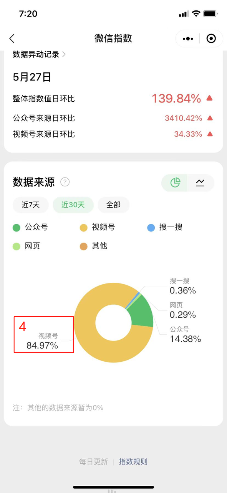

# 1.视频号带货SOP
---

## 1.1 做号前准备工作
---

### 1.1.1 准备手机
---
1. 二手手机（不太推荐）

   一般选择性价比价高安卓机，手机品牌推荐：OPPO、VIVO、iQOO、小米，常用购买渠道：京东、淘宝、拼多多、二手机贩子（谨慎，一定要找靠谱的，踩过雷）

    不推荐理由如下：

   + 安卓机便宜，千元左右即可，尽量选择大品牌；
   + 不建议使用小辣椒、摩托罗拉等能实现 6 开、8 开的手机，一个手机可同时登录 6、8 个微信。操作是方便了，但是未提前规避未知风险，不建议；
   + 苹果手机一个是太贵，一个是系统没有自带的应用分身，安卓一般都支持应用双开，一个手机可同时登录 2 个微信；（苹果二手机如果要直播的话，建议 ipone8 起步）
   + 当然，如果能找到靠谱的也可以尝试，哈哈。

   以下为飞鱼、张三真实踩雷体验，仅供参考：

   + 机型：小米 X5
   + 购入来源：二手机贩子
   + 价格：350
   + 使用体验：差

   耗电量大，部分手机待机不到半天就没电，需要经常充电，麻烦；
   
   操作卡，举例：使用微信时，点击【视频号】这一个操作经常要 3~5 秒时间才会跳转；
   
   而且之后要直播带货的话，可能会因为上述两个问题，有使用上的不便；

2. 新机（推荐）

   一般推荐选择性价比较高的安卓机（OPPO、VIVO、iQOO、红米），千元左右即可，购买渠道包括京东、淘宝、拼多多、靠谱的手机贩；推荐理由，新机操作体验好，待机时间长，不糟心，但就是成本高一些。

    飞鱼、张三真实够新机体验，仅供参考：

   + 机型：OPPO K9x 黑耀武士 8G+128G
   + 购入来源：认识的手机贩
   + 价格：1150（比市场价更便宜）
   + 使用体验：目前还可以，很丝滑，也够用
    
3. 手机避坑指南与建议：

   + 避坑：有些二手机是黑机，即黑灰渠道用过的，比如恶意营销，可能被微信记录了手机设备 id，即被加入微信的黑名单，会被风控，用这种手机发布视频很可能没流量，购买二手机，建议一定找靠谱渠道来源的手机，别贪便宜，因小失大！
   + 建议：买二手机尽量挑大平台，7 天无理由退换货，买回来的时候试一下耗电量，手机反应速度，发布视频的流量情况。
   + 有条件买新机就不推荐买二手机，除非你是大量铺号，那就另说！
    
### 1.1.2 申请手机号
---
注意事项：

+ 不管选择什么运营商，都建议走官方渠道，其他渠道可能会有潜在风险，提前规避风险和不必要的麻烦！（否则，吃了亏都没地方讲理去）
+ 现在虚拟号，都被风控，都无法直接注册微信了，但可以通过换绑操作，用老号注册。
+ 每个人每个运营商都可以申请 5 张卡。

1. 移动

   最低套餐实体卡 8 元/月。虚拟副号：和多号，60 元/年，下载【和多号】app；（我记得：和多号副号 4 月 28 日以前都是可以注册微信的，后面就不行了！）

2. 联通

   最低套餐实体卡 8 元/月。虚拟副号：沃小号，48 元/年，下载【沃小号】app；

3. 电信

   最低套餐实体卡 5 元/月。另外，无忧卡，5 元/张，在【电信营业厅】app，搜索【无忧卡】即可找到进行申请，但是有数量、地区限制；

4. 其他虚拟号

    * 阿里小号 36 元/年，下载阿里小号 app，一个淘宝号可申请 2 个，理论上一个人最多可申请 6 个；
    * 微小号 10 元/月，腾讯官方，微信搜过小程序【微小号】；
    * 另外，有些实体卡是可以免费申请实体副卡，或者 10 元/月申请副卡，这种实体副卡是可以直接注册微信的，但是数量有限制。
    
5. 查询

   打开【支付宝】app，搜索【一证通查】，点击【全国移动电话卡一证通查】，然后输入你的个人信息，之后你就会收到查询结果短信。根据查询结果，可以得知：【阿里小号】是不计算在每个人可以在每个人运营商办理 5 张卡的名额的，但是移动的和多号、联通的沃小号却是计算在内的。

    

6. 注意事项

   + 如果是异地申请实体卡，一般只能寄到你选择的归属地，然后还只能你本人签收，需要当面验证身份证和人脸识别，所以挺麻烦的。
   + 目前虚拟号，均无法直接注册微信，但可以通过换绑老号，再用老号注册新微信的方式实现注册新号，最近新注册的微信不算【老号】。
   + 关于最低消费的套餐，有些直接去线下营业厅直接说办最低的套餐就能直接办，有些地方可能不行，有地区差异。
   + 另外，如果是让异地家人申请的手机号，不要立马就寄到自己那里，可以让家里人插入卡槽，用一段时间后，再寄过去，或者最好放在一个手机里寄。
   
      + 因为可能归属地和你当前所在地相差比较远，然后你手机卡没有联网直接穿越那么远的距离，会被运营商风控。

      + 然后，会要求你重新激活，而且要求非常变态【需要该手机卡实名认证的本人，使用该卡的流量，在其 app 里重新提交实名信息，以及人脸识别】，我有一张就是我妈实名申请的，然后就不得不再寄回去给我妈重新实名，不然卡会给你限制使用，你就没法用。
   
### 1.1.3 注册微信号
---
1. 实体卡
   实体卡，一般都可以直接注册微信，如果你的是回收号，即注册时发现已经有人绑定了你当前的手机号，可以选择【不是我的，继续注册】，如果操作不成功，则需要联系微信官方，或者联系当前微信使用者，让 ta 换绑，或者注销换号。
   
2. 虚拟号

   现在的虚拟号、副号，均已无法直接注册微信，但是可以把老号的绑定手机号，换成虚拟号，然后用老号原来绑定的手机号，继续去注册微信。

3. 避坑指南

   + 注册的时候，最好一机一卡。如果没那么多手机，相对安全的方式是用双开手机（不要多开，比如 6，8 开，有潜在风险），不要一个手机不断切换多个微信，切换次数频繁，流量可能受影响。
   + 不要在同一区域，同个 wifi 下同时注册太多号，号容易被封，建议用流量注册。可以分别在家里、餐厅、公司，分开早上、晚上注册；或者可以在通勤的时候，坐地铁公交，每隔几个站，注册一个号。
   
4. 微信实名认证

   注意：一个身份证只能实名五个微信号，实名认证如何解绑？（一般人不会有这个烦恼，还没注册满5个微信号请跳过）

   1. 点击【设置】
   
      
   
   2. 点击【钱包】
   
      
   
   3. 点击【支付设置】
   
      
   
   4. 点击【关闭】（关闭前请确认这三项）
   
      
   
   **微信没有支付认证的卡看过来（主要针对想开新的视频号做带货号的人，小白请跳过）:**
   
      1. 打开手机微信，点击右下角【我】，选择【支付】（版本更新，现在是【服务】）
   
      
   
      2. 进入支付页面后，点击【钱包】
   
      

      3. 跳转至钱包页面后，点击【身份信息】，进行实名认证

      

      4. 页面跳转后，点击【立即认证】

      

      5. 阅读服务协议及隐私政策后，点击右下角【同意】

      

      6. 在此页面即可填写身份证信息，绑定身份证，随后点击【下一步】

      

      7. 输入需要添加的银行卡，接着点击【下一步】

      

      8. 根据页面提示填写持卡人的相关信息，然后点击【下一步】

      

      9. 官方会下发验证码至银行预留手机号，收到后填写验证码进行验证后点击【下一步】，然后设置支付密码即可实名认证成功

      

      > 注：目前无银行卡的未成年人及没有中国大陆境内银行卡的外籍人士/港澳台同胞，暂时无法通过实名认证。
      >
      > 以 iPhone 13 型号手机，iOS14.6 系统版本，8.0.6 微信版本为例子，不同型号版本手机操作通用。
   
### 1.1.4 注册视频号
---
首先我们打开桌面的【微信】点击屏幕下方的【发现】，可以看到在屏幕上方有一个【视频号】，选择进入【视频号】，轻点右上方的人像的图案，我们可以看到会自动跳转出如下的一个浏览设置的页面。

在这个页面中，我们可以看到下方有一个我的视频号，点击【发布视频】标志，选择自己的头像，输入相关的信息，勾选【我已同意并阅读微信视频号运营规范和隐私声明】，点击下方的【创建】即可。

注册好了微信，先进行实名认证，然后开通视频号。

一个身份证可以实名 5 个微信，即 5 个视频号。有条件、有需要的球友们，可以用家人的身份证多注册几个，早就是优势，以后注册视频号的门槛可能都会提高！

开通视频号之后，可以验证下发布视频、开直播功能是否可以直接使用，最近风控加紧，很多人注册的号多了，后面的新号发布视频、开直播都需要再次实名认证，甚至人脸识别。

### 1.1.5 注销视频号
---
号少的朋友，提高账号的利用率，没有起来的号，但是发布视频太多，可以考虑注销后，重新注册，又是一个全新的视频号。

目前，更新的规则是，一个微信只能注册 3 次视频号，也就是说注销次数是 2 次，谨慎使用！

**注销流程：**

**加速视频号注销的小技巧**

点击注销后，系统会提示等待 7 天后账号将注销，那么我们可以在之后的 12 小时内的任意时间点击撤销注销；

撤销后，间隔至少 1 小时，再次点击注销视频号，然后选择等待，一般情况下等待一天后，会提示还剩 6 天注销，有的则会提示还剩 24 小时注销，提示还剩 6 天的也不要着急（虽然系统写 6 天，但是我其中有 2 个账号 24 小时就完成了注销），可以继续选择撤销，然后间隔几小时，再注销；

ps：可能存在偶然性，现在这个方法可能失效了！

## 1.2 带货号操作流程
---

### 1.2.1 选择方向、赛道
---
1. 基本思路

   确定大方向和领域：

   + 首先，可以先结合自己的专业性、兴趣爱好、优势、渠道资源等，确定一个基本的方向；比如，你喜欢做饭、喜欢美食，那你可以确定美食赛道，然后分享自己平时做得美食，同时就可以推荐一个厨房用品、家居好物。
   + 然后根据你选择的大方向，在进行细分，找到更为垂直的方向；比如，三农领域，就有专门卖芒果、买榴莲，甚至专门讲解扦插技术技巧的，然后带货一些扦插使用的工具；甚至，张哥之前提到过的抓黄鳝，然后可以卖抓黄鳝的工具。

   总之，尽可能的细分、垂直，越垂直，你后期选品也就越容易。而且，越垂直的账号越值钱，因为垂直度越高，获取的流量也越精准，后期的转化效率自然也就更高。（垂直才可以拿到分发精准标签效率这个杠杆，越垂直杠杆越大）

2. 常用技巧和方法

   我们可以通过，多维度分析自己内容的受众，从而确定自己的赛道和方向，总的来说即：看人群、定需求、找痛点。

   我们都知道，视频号目前的主要受众是中老年，但是只知道中老年还不够，需求太泛了，还不够细分，我们可以进一步根据年龄、地域分布、具体使用场景去细化。
   
   比如 3040、4050，5060，6070 岁等不同年龄阶段的老人需求都是不一样的；一二线城市的老人和三四线下沉市场老人需求同样是有差异的；最后，我们可以结合具体的使用场景，去确定，比如卫生间、厨房、客厅、卧室、车库、车里、户外等等。

   当然，除了中老年，其他人群同样可以做，具体优先顺序，可以参考下面这个图，大家应该都不陌生。

   

   通过，上述的技巧、方法，我们基本上能确定自己要做的一个大方向，比如，三农领域，卖特产、卖农用工具、园艺工具；家居好物，可以推荐日常家用好物，可以根据具体场景（厨房、客厅、卫生间等）再细分；美食领域，推荐厨具、调料包、火锅底料、酱料包等等。

3. 赛道、方向选择思路借鉴

   飞鱼整理的一些选品思路：
   https://nxqkjofnyy.feishu.cn/docs/doccng2idz2mSCKngdN8X2LqCyb 
   
   密码：4fcO

   时间有点久了，不一定能做了，但是思路可以借鉴！

### 1.2.2 找对标、收集素材
---
1. 基本思路和方法

   确定赛道、方向后，我们就可以找一些对标账号进行学习和分析。
   
   分析一下，已经做得比较好的账号，视频是怎么拍的，怎么剪的，怎么带货的，是否直播，如何直播，数据如何，哪些我可以借鉴学习。
   
   同时，我们可以参考一下他们的选品，分析他们哪些视频数据好，哪些品类出单多，通过数据，去分析出单多的品类为什么出单多，理解底层逻辑，然后结合自己，自己能不能做，有没有什么优势，能不能做出差异化。
   
   怎么找？
   
   很简单，关键词搜索，比如常见的就是，好物分享、好物推荐、厨房好物等等。如果赛道、方向越细分，关键词自然更加精准，找到的对标账号也会更加匹配。
   
2. 收集素材

   基本套路：

      + 警惕找大号，粉丝多、且爆过的视频，播放非常高的大概率被搬得差不多，可以搬数据稍微差一点，但是有潜力的带货视频；
      + 或者，可以找粉丝体量相对小一点的号，然后搬 ta 数据比较好的视频进行二创、混剪，总之减小竞争，尽量保证能过查重。

   常用账号分析平台：**新视、新榜、百准、友望数据；**

   素材下载工具：

   + 抖音、快手单个下载工具、网站：
   + https://watermark.liumingye.cn/
   + http://tools.guoxiaorui.cn/

   因无法上传附件，其他工具可点击下面链接去下载：

   + 飞书链接：https://nxqkjofnyy.feishu.cn/docx/doxcnsRVHa22OVBd9LwCfqNW0Lh 
   
   + 密码：psMD
   
3. 避坑指南

   不要想当然，要有数据思维和主动思考，像什么音乐号，卖车载音乐优盘，看着简单，其实对普通人来说并不友好，做得好的人已经把这个壁垒拉高了，普通人很难做。

### 1.2.3 选品
---

#### 1.2.3.1 基本思路和逻辑
---
核心因素：人货场三者匹配

+ 以货为中心，匹配人，匹配场
+ 以人为中心，匹配货，匹配场
+ 以场为中心，匹配人，匹配货

选品大于一切

+ 做好选品之后，带货号就是怼量，尤其是非原创的带货号，你的壁垒绝对不是内容质量有多好，也不是专注保证自己的视频能过查重那一关！
  
+ 你要知道，你能做到的查重手法，别人也能做到，你能找到的素材，别人同样可以找到，所以你要建立壁垒，必须以量取胜，以数量去搏概率！（就比如抖音上的：打丸哥旗舰店 [15.3w 个作品]、乔乔好物 [4.2w 个作品]）
  
+ 所以，做带货号，第一步一定是做好【选品】！

其次，选品要选择好卖的，也要选择打得过的！

+ 选品定生死，选品的重要性一定是大于你的视频内容，选品我们不仅要选择好卖的，也要选择自己能打得过的，即最好要有自己的优势，找到差异化和自己的竞争力；或者说尽量去选【相对蓝海】的品类，注意是相对蓝海！

+ 如果，你觉得自己很聪明，发现了一个绝对的蓝海品类，这个时候，你不应该是高兴，而是先冷静下来，好好思考下，这个品类真的好做吗？好做为什么别人都不做？

+ 记住一句话，你能想到的，大概率别人都想过了，至于别人为什么不去做，你得好好去研究下这个品类和这个赛道了！

+ 选择好卖的，意味着转化率会更高；而打不打得过，就决定了你作为一个新手入场去厮杀，能不能赚到钱。

+ 如果说，你选择的品类很好卖，但是对于新手并不友好，需要有一定积累，那些专业的老手才能赚钱，那你入场就很难存活下去，因为你没有什么竞争力，根本打不过（比如之前说过的车载音乐优盘）！

关于选品我们需要关注的 3 个点：

1. 人群

   其实选品的核心，就是对于人群的理解，以及对人群的需求、痛点的探索，这个需要经验的积累和认知的提升。

   目前来说，视频号的主流人群，还是三四线下沉市场的老年人，之前我们都说中老年，其实核心是老年人，这个人群不仅有时间刷视频，也有比较强的消费能力。

   讲一个简单的案例，我们目前做的几个品，50岁以上的人群占了绝大部分，一般变现好的账号能达到 70% 以上，而且女性也将近 70%，你去分析订单，你也会发现大部分订单是女性用户，所以通过看你账号的用户画像，大概就能看得出来，你这个账号的转化好不好，变现能力强不强。

   

   

   所以，大家可以围绕这个人群去做选品。

2. 品类

   品类的话，就决定了你的这个品好不好卖，能不能卖得出去！

   你针对前一个我说的人群，再结合 ta 的需求，你好好思考下，如果你卖的是美容仪，你觉得 50 岁三四线的女士会有这个需求吗？真的能卖出去吗？好卖吗？大概率是否定答案。

   但如果你卖的是小型面条机，染发剂（别做了，已经很卷了），也许就好卖，但他们还需要思考自己是否真的需要，有一个决策成本，如果有需求就会下单，所以对于银发经济，大家还可以继续去挖掘他们的需求和痛点。

   那么，再举个例子，比如卖土特产，他一般没有需不需的决策成本，他更多想的是我想不想要，最近很多卖土特产的都是走正能量风，比如退伍军人回乡创业卖特土产，大一大二大三大四、单亲家庭、被抛弃一个人勤工俭学，在老家挖、做土特产卖，等等，满满的正能量，这个人群就特别吃这一套。

   以上，关于选品的时候，大家就真的需要多练基本功，多刷多看多感受，去找到目标用户，去找我们父辈、甚至爷爷辈，他们的需求和痛点。

   比如，老一辈可能对穿都没啥要求，但是对于吃的肉、野味、土特产啥的很愿意花钱，再比如她们可能愿意花几千大几万买什么蚕丝被等等。

   所以，多去跟长辈交流，多刷他们的手机，看看他们都看什么，喜欢什么，说不定就能发现，原先被我们忽略的好的产品和需求。

3. 价格

   价格就影响你具体的转化效果，比如销量、利润、成交速度。

   其实选择很简单，几个品你去做选择，比如同等成本情况下（发视频数量、直播时间），总利润一样，选择单量少，单个利润高的。

   总之，就是赶紧下场测试，把手弄脏，先赚到第一块钱，保护好自己的热情和自信心，赚到第一块钱，就是想着赚更多的钱，不断地去增强自己的动力和热情，早期走点弯路都无所谓，核心还是：干就完了！

   当然，一般优先选择利润高的产品，但利润高的一般也不建议选择单价过高的（高客单价，就必然对应着低销量），目前测试下来，一般 100 以内，几十块的，利润还可以的，都比较容易成交。

#### 1.2.3.2 选品工具与操作
---
新手选品的常见操作：跟品，绝对销量不错，好卖的品，自己上手做个号测试下。

蝉妈妈、考古加、有米云快选品
这个工具使用，球友有过分享，大家可移步：带货视频相关

小套路：视频号蓝海思路

分享 1 个看视频号蓝海的思路，类似于抖音巨量指数，但是数据不如巨量完整，（可以作为一个参考数据，但是实际上赛道卷不卷还得试了才知道，因为很多数据是不完整的）

微信小程序【微信指数】主要看底部数据来源的视频号占比

**操作流程：**

1. 搜索公众号【微信指数】，点击【服务】

   

2. 点击【查看指数】

   

3. 输入赛道名词、选品关键词，或者对标账号常用便签

   > 举例：【好物分享】

   

   

拉到最下面，看视频号占了多少的比重，就能大致判断出这个赛道卷不卷，或者说火不火，有些赛道虽然视频号占比很高，但是你实际去视频号上去搜相关的视频和账号，并不多，那是可以尝试的。

像这个【好物分享】视频号占比 84%，说明【好物分享】这个标签、标题有很多人用，或者很多人在视频号里搜索这个关键词，流量是不错的，但是卷不卷，你就可以去视频号去搜索相关的账号和视频分析，也可以看看有没有爆款视频，做得比较好的账号。

另外，你做选品，就可以选品，就可以用特别具体的【关键词】搜索，比如先看【饺子盒】的微信指数，看视频号占比大不大，大的话，再去搜视频号里搜【饺子盒】，看做这个品的账号、视频多不多，有没有爆款视频，就可以看出这个品火不火，卷不卷。

温馨提示：卷的话，一般在别的平台爆过的视频素材基本早就被人用烂了

如果要用这类素材，要么多步去重——往下找 [5.剪辑视频——手工去重常用方法](#jump1)

如果不想用这类素材，就要去找粉丝数低一点的，还没有什么人搬的优质视频，过系统的查重比较容易

#### 1.2.3.3 小套路：刷拼多多的【多多视频】
---
视频号的目标用户和拼多多有重叠之处，那就是面向下沉市场，因此我们可以从拼多多上选择好的品

具体操作如下

在拼多多首页，选择【多多视频】 ,不断刷新，直到你看到点赞和评论数量都很高的带货视频（带货视频会有购买链接），这就说明这个品的热度高，可以考虑拿到视频号上操作。

要注意的是，有些品在拼多多上售卖是合规的，但是视频号不允许，比如锌镁片等药品或者部分保健品。拼手速的时候来了~

**操作流程：**

1. 打开【拼多多】，点击下方的【多多视频】

   

2. 多去刷带货视频，你就会发现好多你想不到的产品

   比如下面这个【太阳能充电灯】，视频中售价￥2.79

   

3. 来看看视频号的【选品中心】的售价

   

   这时候会算数的球友就会发现 就算卖图上最便宜的 45.9 - 2.79 = 43.11

   这是什么？这是暴利!这是信息差！

   做一点延伸，比方说你不想要中间商赚差价，你可以自己开个 个体户或者企业小商店，把拼多多的品搬过来自己卖，有人会问，那发货怎么办？

   回答：搜索【拼多多无货源发货】，这个对很多新手来说还是有点门槛，建议了解就好，从0到出单，跑通带货号的变现路径，这才是更适合小白的

   过来人的心得：

   不要看到李四一天 1000 佣金，王五 3 天 1w 佣金之类的信息把自己弄焦虑了，人家之所以能够赚到钱，是因为人家付出了你看不见金钱，时间，人力，拥有你所没有的认知

   你要做的不是跟人家比，守住本心，按照自己的节奏来，比如说我今天什么都不会，那我给自己定个目标，今天先剪 1 个带货视频，在我看来就很好了。

#### 1.2.3.4 我的一些选品思路
---
其实，最近我一直在强调三农类的品类，因为这个不仅是平台所支持的，也是国家政策扶持的，所以三农，有条件的一定要去尝试，尤其是有原创能力的。

三农，可以做哪些呢？比如：农具、机械类的除草剂、翻土机，针对的是三四线农村下沉市场；园艺类，比如花卉绿植、园艺周边工具、盆、营养土肥之类的，更多的是针对一二线的中老年爱种花草的群体。

另外，还有土特产类，最近刷到很多卖榴莲、苹果等水果；也有山药、芦笋等蔬菜食材，还有正能量形象的退伍老兵，回乡创业卖红薯干；还有各种卖腐乳、腊肉等各种土特产。

### 1.2.4 装修视频号
---
1. 名字

   名字是为了让人更快的去理解你是做什么的，或者引导下单的

   比如xx好物，xx服饰，xx百货，xx优品（xx自己随便想个人名）

   举例：
   
   张哥严选好物（家居好物号）
   
   张哥五金工具（五金类）
   
   张哥精选名句、张哥国学经典（书单号）
   
   张哥土鸡（三农类）

   一般字数少的话，有个小技巧让人点击你头像
   
   后缀名写上：点头像，点头像下单，同款在主页

   举例：
   
   张哥严选好物点头像（家居好物号）
   
   张哥五金工具点头像下单（五金类）
   
   张哥土鸡同款在主页（三农类）

   一般公式：人名+赛道/产品+点头像

   因为视频号不能重名，而且每年只有5次修改名字的机会，所以最好是创建时能把名字大致确定下来，然后后面可以在此基础上做完善和优化，以免后期频繁修改名字增加不必要的解释成本

   剑走偏锋型-电话+xx（了解就好，不建议搞）

   

2. 头像

   拿家居好物类的账号头像举个例子

   卡通类 - 在小红书、微博，搜索关键词 【卡通头像女】

   

   

   美女-找图片的逻辑跟上面一样

   

   如果你是其他赛道的，可以看一下同行怎么选的，你再去搜图找找类似的，目前个人感觉只要不是头像不要太离谱都可以

3. 简介

   如何写一个好的简介？

   好的简介就两个原则：简单易懂，陈述利益

   简单易懂
   
   第一个一定要够简单，让想要关注你的人能快速抓住核心内容，所以就需要把最重要最核心的内容放在第一行

   陈述利益
   
   则是让用户在看到你的简介时，可以清楚的知道自己关注了这个视频号，可以给自己带来什么价值，自己能学到什么，有什么收获。比如，【鱼子酱t】，这个账号，简介就是【爱美食，爱分享】，你就知道关注后，可以轻松学习一些美食的制作方法之类的

   举例：xx爱分享（家居好物号）

   

   之前简介三行不会折叠，现在微信版本更新成 2 行了

   拿 【B哥有话要说】举例
   
   更新前（简介 3 行不会折叠）

   

   更新后 （简介 3 行会折叠）

   

   所以简介位置最重要的信息要在前 2 行

   举例：

   每天分享亲测居家好物
   
   视频同款在【商品】（后面再补一个引导的小手指向商品）

   

   小手怎么补？

   苹果手机-输入xiangxia，或者长按左下角【网络】副号切换选择【表情符号】里面可以找到

   

4. 置顶视频引导

   置顶视频通常就是为了引导下单，视频就是教客户怎么通过去下单

   举个例子（这个只做到了封面引导，细心的球友可以把整个流程做个视频教老人怎么去下单，记住不要错过任何步骤，很多老人连淘宝都不会用，所以你要一个步骤一个步骤教）

   如何置顶自己的视频：

   + 打开微信，点击视频号
   
      
   
   + 点击右上角-人头icon
   
      

   + 点击-自己的视频号
   
      
   
   + 点击-想要置顶的视频
   
      
   
   + 点击-右上角【…】
   
      
   
   + 点击-左下角【置顶】
   
      
   
5. 视频封面

   手机、网页后台上传作品，均可以在发布时，选择设置视频某一帧作为封面，你也可以调整显示的具体画面。

   网页端，设置封面，登录视频号网页后台：

   https://channels.weixin.qq.com/platform/login

   点击-发表动态，流程：

   

   + 点击-选择封面
   
      
   
   + 滑动时间轴，选取你要的视频封面，再拉动方框，裁剪视频封面
   
      
   
   + 封面设置为了统一视频封面，通常是观众对你一个视频感兴趣，点进去你的主页观看。
   
6. 企业微信

   认证号，绑定企微，可以设置【添加微信】+【联系客服】

   未认证号，绑定企微，可以将【私信】升级为【联系客服】

   设置步骤，可参考：

   

   

   需要用到的链接：

   企业微信：https://work.weixin.qq.com/wework_admin/loginpage_wx?from=myhome

   微信客服：https://kf.weixin.qq.com/kf

### 1.2.5 剪辑视频
---
一般是搬运、二创快速起号，因为爆款都是重复的，且已经被市场验证过，如果有原创能力，可以自己照着爆款拍，文案一样，就是二拍，提前规避搬运的潜在风险。

1. 剪辑工具与使用技巧

   剪映，电脑版、手机版，批量起号提高效率建议用电脑版。

   无法贴附件，可戳下面链接直达：

   飞书链接：https://nxqkjofnyy.feishu.cn/docx/doxcnsRVHa22OVBd9LwCfqNW0Lh 
   
   密码：psMD

2. 批量去重工具与使用技巧

   CRvideo——很多人在用，如果没有多步去重的话，效果可能不好，适合不太卷的赛道

   + 利用 CRVideoMate 软件完成基础混剪，详细参数如下（可自定义）

   

   + 制作水印 PNG 图片，使用软件所带水印功能
   
   

   + 如果直接加水印会遮盖住原视频的重要部位，可以压缩原视频高度，参数如下
   
   

   注意：此处「上下数值」高度应该大于等于我们水印的图案高度，这样画面才不会被水印遮住。我设置的 150，你们可以更高或者更低。

   螃蟹剪辑 -- 付费的，没用过，不评价

   建议：小白就看一下剪辑的思路，核心还是在选品上，选对品，找到好的素材，剪辑真的不重要，甚至可以直接搬运，虽然是跟平台做对抗，但对于普通人来说是最简单，也是最快拿到结果的方法。

3. 手工去重常用手法

   第一层 修改发布视频的标题 描述 以及封面等表层最简单的信息，这里的意义太简单，我就不多做解释了 （只做到第一层，肯定搬运失败）

   第二层 把将要搬运的视频素材 去水印 修改分辨率，加片头片尾 甚至加自己的水印

   去水印这块儿大家应该都懂，就是作者或者平台固有的记号，如抖音视频下载下来的抖音号，快手号等 或者作者自己打上的水印，什么XX影视俱乐部，XX电影天堂什么的 这里建议的去水印方式是直接裁剪，而不是模糊掉水印，因为这种模糊其实是可以被检测出来的，另外，裁剪的过程其实已经顺带进行修改分辨率了。

   拆剪掉后，可以顺带加自己的水印，当然也可以添加自己的片头片尾，水印包括文字水印，图片水印，如果加 gif 水印的话效果会更好。
（只做到第二层，很大概率也会搬运失败）

   第三层 帧率，滤镜，播放速度，背景音乐

   帧率: 一般视频的帧率为 25-60 之间，常见的去重手法有抽帧，删帧，加帧等，总之修改了之后就会起一定的效果 （本人一般借助软件修改）

   滤镜: 这个比较简单 可以通俗的理解为给视频画面简单的套一层颜色

   播放速度和背景音乐这块儿还是相对比较重要的，调整播放速度，加快，减慢，都可以。背景音乐的话直接把素材视频静音，再添加一条音乐或者解说即可。

   （做到第三层有一定几率被查重，取决于你的素材源是否高清以及搬运这条素材的人数多少）

   第四层 这一层非常重要

   镜像，滑动，画中画，视频蒙版，图片蒙版，背景颜色，背景图片，背景视频，模糊拓边

   镜像: 不难理解，常用的有左右反转和上下翻转，这里建议只要视频中没有文字，一定反转，作用还是挺大的。

   具体操作案例请前往：

   飞书链接：https://nxqkjofnyy.feishu.cn/docx/doxcnsRVHa22OVBd9LwCfqNW0Lh 
   
   密码：psMD

   还有很多类似的手法，都大同小异，无非是保证视频核心内容的同时多增加一些其他元素和画面

   （做到第四层，大概率能过审了，具体能过到什么程度，看平台爸爸的心情了，重点还是素材源的高清度和被搬运次数）

   第五层 混剪加过渡

   能达到这一层的，基本接近原创甚至已经是原创了

   混剪加过渡： 混剪，顾名思义就是混乱着去剪辑拼凑，比如 你找两条视频（有关联性的最好），视频A和视频B，把视频A的前3秒剪断取下来，把视频B的前2秒取下，再把视频A的 4-6秒取下，再把视频B的 2-4秒取下……（新视频就变成了：【A前3S】+【B前2S】+【A4-6S 】+【B2-4S】……）

   这样混剪拼凑到一起 成为一条全新的视频，这里面取视频片段的时长肯定是越短越好，这样才会有差异性，平台才不会判断搬运，但是核心还是要保证内容的可观赏性，具体要混多长，根据自己需求去定即可。

   这时候聪明的朋友想到了 ，那我是不是可以把一条视频先分割成A视频和B视频然后再组装拼接，答案当然是可以的 ，你甚至可以以此类推，N条视频分割，N条视频组装拼凑，源源不断……
   （一般建议软件批量操作，手动还是比较麻烦,设置好后每次启动制作就行）

   最后给大家总结一下：

   标题，描述，封面 频画面，水印，片头尾，画中画，蒙版，背景，音效，混剪 帧率等

   另外还有一些AI配音 AI抠像以及以后出现的新去重手法等原理都是一样的

   这里有个捷径给大家 那就是 找素材尽量找高清的素材源，举个夸张的例子，如果你有能力，把别人草稿箱还未发布素材直接拿来发布，都不用带去重的 哈哈哈……

   那么其次就是找不太容易被别人搬运的素材，比如 一些冷门平台的素材，一些冷门的关键词搜出来的素材，但凡是你能想到的一些比较泛关键词搜出来的，而且还是靠seo前面的素材源，那一定是很容易被人多次搬运的，搬运的人多了 相似度自然就高了，祖国的人口基数你寻思一下，猜猜你是第几个搬运的……

   这里跟大家特意强调一下，没有绝对百分之百去重的手法，只有相对的高概率去重技巧，包括有朋友问到之前火及一时的内录手机等等，其实都是钻平台的空子，现在平台的算法很强大，玩不了几天就不行了，不要把时间浪费在没意义的事情上，好奇了解一下可以的。

### 1.2.6 发布视频
---
1. 基本思路

   带货号，一般情况下无需养号、涨粉（如果你是团队，号实在太多，建议还是简单养下号），就直接发带货视频、流量视频，简单干脆。

   发表视频时，添加适当的话题标签，可以让你的视频更容易被看到

   添加方法

   点击【发表动态】

   

   

   在动态描述里输入 文案和【#你想要要加的标签】

   举例：家居好物号-视频展示的是 【切菜护指器】

   

   文案可以写：【切菜老是会切到手，大家都在用的护指神器快了解一下#好物分享】

   小技巧：加标签时，除了尽可能贴近你是视频内容和产品，也可以把这个标签放到【微信指数】里搜索下，看看指数高不高，尽可能选择【指数热度高】的关键词作为你标题里的【标签】，这样被推送或者说，被更多人看到的概率更大。

   骚操作：有些人，可能觉得自己的品特别好，容易爆，他可能标题、标签什么都没有，最多 @微信时刻 @微信创作者 等官方账号，甚至标题什么都不写，这样就可以减少到被同行，或者想做这个品的玩家搜到他的视频，也算是一个小技巧吧。

2. 新手玩带货号怎么提升效率

   其实，短视频电商是一个概率游戏，我们需要尽可能地增加自己在游戏中取胜的概率，比如增加账号，新手 5-10 个，有时间精力可以更多，尽可能多方向多品类去试错，每天 5-10 条视频，然后根据数据反馈，以及叠加时间的因素，不断地去优化迭代自己的视频内容。

   当然，如果你是原创内容，或者自己视频质量特别高，上面说的数量就只是一个参考了，可以根据具体情况增加！

   新手，一定要保持心态，先坚持一段时间，不要数据一不好，马上就放弃，除非你已经比较熟练，能清晰地感觉到这个赛道真的不可行，那就尽快收手，快速试错就切换赛道。

   如果你号多，据说有一个视频号批量管理工具，我没用过，据说用过的朋友说不太好用，感兴趣，想研究的可以戳：

   视小龙：https://www.shixiaolong.net/?inviteCode=SEMP58813

   有一个批量自动化发布的工具移步飞书：

   飞书链接：https://nxqkjofnyy.feishu.cn/docx/doxcnsRVHa22OVBd9LwCfqNW0Lh 
   
   密码：psMD

3. 带货号的视频内容发布策略

   一般是采取 70%-80% 的带货产品视频，用来引导转化和下单，20%-30% 的流量视频用于获取流量和涨粉，也是作为一个参考，大家可以根据情况自行调整，怎么转化高，怎么玩！

   流量视频，同样需要跟你的品类领域相关，只是不介绍商品，而是围绕你目标人群的需求、痛点、兴趣点去发视频！

   一个品可以一天发 5-10 个视频，数据号就接着发，数据不好，就可以快速换品测试。
   
### 1.2.7 带货
---
1. 如何从选品中心添加商品到视频号橱窗

   微信发现页->视频号->创作者中心->带货中心->去选品->在选品中心添加商品至橱窗。

   然后，你可以在带货中心，点击右上角的【小商店】图标，去管理你视频号橱窗里的商品，进行置顶、移除等操作。

   

   如果你绑定了合作商家的导购，想要上架商家的商品，操作步骤如下：

   微信发现页—>视频号—>创作者中心—>带货中心—>去选品—>右上角【商店图标】—>添加商品—>选择你绑定的商家店铺—>选择要上架到橱窗的商品，上架即可

   

   

   第三方平台账号关联，具体步骤：

   微信发现页—>视频号—>创作者中心—>带货中心—>账号关联—>选择对应的平台，比如【爱逛】
   
   爱逛平台结算佣金绑定视频号视频教程：

   https://h5.guang.com/live/growth-college/single-course-detail?id=133&from=share&shareUid=77625851

   

2. 视频号短视频带货挂车

   如何挂车，分为有短视频带货权限和无短视频带货权限的操作。
   短视频带货权限，认证的号一定有，未认证的账号也可能有，比如官方的定向邀请，前段时间，官方对一些账号发放了【短视频带货权限】，具体发放要求未知。（猜测跟作品数量，可能是原创作品，然后与粉丝量，作品的数据等等有一定关系）

   视频号带货官方指引

   如何在短视频分享商品信息：

   https://developers.weixin.qq.com/community/develop/article/doc/000ce66a294c08f157ad78b165b013

3. 有视频带货权限挂车

   发布作品时，点击下方的扩展链接，可以点击【商品】，选择视频号橱窗里的商品，实际效果如图，会显示橙红色的购物袋，观众可以点击下方链接，直达你的小商店程序进行下单！

   

   

   

   还没有获得短视频带货权限的，如果你是原创作品，或者比较头铁搬运二创的，请继续看下去【认证申请过程】，从而获取短视频带货权限：

   视频号认证：

   1. 如何申请认证？

      【手机】
      
      进入视频号 ＞页面右上角的个人按钮＞创作者中心＞认证，选择适合的认证类型，然后按页面提示进行行操作即可。
   
      

      【电脑】
      
      如果你需要申请企业或机构认证，也可以在电脑上前往视频号助手 (https://channels.weixin.qg.com)设置视频号认证，按页面提示操作即可。
   
   2. 个人认证和企业认证有什么区别？

      + 个人认证适合个人申请，包括线下职业身份或线上身份，如运动员、美食博主。
      + 企业和机构认证则适合非个人主体申请，如政府、事业单位、企业、媒体、其他组织或团体。
      + 创作者可根据视频号帐号的主体身份选择合适的认证。
   
   3. 申请职业认证有什么要求？

      + 最近30天发表过1个视频号动态
      + 已填写视频号简介。
      + 不同职业会有不同的认证要求，具体可在申请认证时阅读。建议你提交在职证明、职称证。
   
      
   
   4. 申请兴趣认证有什么要求？

      + 最近30天发表过1个视频号动态
      + 视频号有效关注数1000人以上。
      + 已填写视频号简介。
      + 在对应领域持续发表原创内容。

      建议你提交视频号、公众号或其他平台的粉丝数截图、后台截图和相关平台的实名信息截图来证明你的影响力，帮助提高认证成功率。
   
      
   
   5. 如何申请企业或机构认证？

      【通过公众号认证】
   
         + 如果你有已微信认证的同名公众号（包括订阅号和服务号），可以在手机上通过公众号进行认证。方法：进入视频号 ＞页面右上角的个人按钮＞创作者中心＞认证，选择企业或机构认证类型，然后将二维码发送给同名已微信认证公众号的管理员扫码确认。
         + 如果你的公众号已认证，但名字和视频号名字不一致，你可考虑修改视频号名字再申请认证
         + 如果你的公众号已认证，但名字超过20个字符（1汉字算2字符），你可选取其中连续的20个字符以内作为视频号名字，再申请认证。
         + 如果你的同名公众号尚末完成微信认证，请先到公众号申请认证，然后再为视频号申请认证。

      【提交资料认证】

         + 你也可以在手机，或者电脑上前往视频号助手(https://channels.weixin.qg.com） ＞设置＞视频号认证，提交资料申请认证。具体资料可在认证申请页面上阅读。
   
         
   
   6. 不同的认证图标表示什么含义？

      + 蓝 V 代表帐号为已认证的企业或机构帐号。
      + 白 V 代表帐号为已完成认证的个人帐号，且有效粉丝数超过1千。
      + 灰 V 代表帐号为已完成认证的个人帐号，且有效粉丝数超过5千。
      + 金 V 代表帐号为已完成认证的个人帐号，且有效粉丝数超过1万。

   7. 有效关注数是指关注你的视频号的正常用户数，不包括可疑的非正常使用用户（如使用外挂、参与刷量等）。当前有效关注数不包含当天新增关注。
   
4. 无视频带货权限挂车

   无短视频带货权限的账号，想要在短视频上加入商品链接，只能通过官方的【小商店好物推荐】公众号进行转链接进行展示。但是，公号链接带货，不推荐，主要是链路太长，转化并不好。

   **具体操作流程：**

   1. 获取复制链接：

      如果你是带的第三方平台，比如爱逛的商品，可以去【爱逛买手店】app，里获取视频号的视频带货链接：
   
      
   
      

      如果你是带的别人的个人店铺，则商家给你设置导购和视频号推广，然后你接收后，可以在【小商店助手】进入你导购的商家店铺，点击【推广商品】，选择你想带的商品，点击【分享】，选择【视频】，然后复制最下方的视频号文案链接，只需要把这个【扩展链接】的内容复制，然后填充到，发布短视频时下方的【扩展链接】里即可！
   
      
   
   2. 到视频号视频发布页【手机、网页后台均可】，复制获取的链接，放入下方的【公众号文章】链接中:
   
      
   
      
   
   3. 公众号转链接带货效果如图：
   
      
   
      

   最后，其实做带货号，尤其你不是原创内容的，【短视频带货权限】真的不重要，因为你非原创，搬运、混剪、二创的，大概率是限流的，所以，我们目前就算有【短视频带货权限】也不会去挂商品，因为限流，影响曝光，都是等视频爆了，开直播预约，然后直播去转化。

   当然，自行决定，并非一成不变。

5. 引导成交，重中之重

   名称、头像、简介引导，置顶视频 请看上面——装修视频号

   评论引导

   目标客户问我们怎么买，我们要及时回答：点头像进主页，点击商品链接购买

   评论区引导常用话术如下：

   视频同款商品购买方式：
   1. 点击我的头像
   2. 点击【商品】
   3. 找到您需要购买的商品

   微信规则经常变动，大家要注意做好准备，以上引导的方法也随时会违规，所以注意次数和频率，一般选择比较爆的视频去引导，别回复太多，太多可能会有【过度营销】的违规风险。

   

   为什么要及时回答：

      + 作者回答有加权重，点赞也有加权重，（权重就是优先级，权重越高，优先展示）
      + 一个好的评论是一个非常好的广告展示位
      + 客人看到信息，及时去买，以免后面他/她不想冲动消费

   小套路：

   自己多备几个小号，或者让亲戚、朋友帮你评论：怎么买？然后你去回答。

   如果视频感觉要爆的话，及时去做好评论区引导，可以增加商品的转化率

   不嫌麻烦的话，可以在简介上写上自己的微信，有些老年人确实不会购买，加上你微信，你点进橱窗，把他想要的商品转发给他/她，如果他/她还是不会操作，让他转钱，你帮他填地址信息也行，能引导到私域是最好的，可以做二次成交。

   加上微信，还有个一个好处是，如果你卖的产品都是他/她需要的，可以反复成交

6. 骚操作：

   评论置顶

   利用评论审核功能，变相将自己的评论置顶，网页版后台把评论设置为，仅展示精选评论，再把自己小号的评论设置为精选，大幅度提高引导性。

   步骤：登录后台——>评论——>选择单条动态——>评论权限，打开仅公开精选评论【目前，自己的评论自动会被精选】

   

### 1.2.8 直播
---
这一部分，主要分享，直播必须知道的一些规则和常见违规情况，以及常用的直播话术、引导（封面、标题、话术、商店名）、直播方法技巧。

总之，长期主义，必须符合平台规则，别擦边、别违规，正规直播才是王道！

带货号，主要的转化都是靠直播，所以提前练习直播，越早培养自己的直播技能有利无害！

1. 新手任务——新主播成长计划

   

   完成任务，奖励的流量券如何使用，一定要设置【每个观众进入的出价】

   

2. 直播规则、话术、引导

   > 直播规则

   + 微信视频号运营规范：
   
      https://weixin.qq.com/cgi-bin/readtemplate?lang=zh_CN&t=weixin_agreement&s=video
   + 微信视频号直播功能使用条款
     
      https://weixin.qq.com/cgi-bin/readtemplate?t=finder_live_privacy
   + 微信视频号直播行为规范
   
      https://weixin.qq.com/cgi-bin/readtemplate?t=finder_live_up_privacy
   + 微信视频号直播营销信息发布规范
   
      https://weixin.qq.com/cgi-bin/readtemplate?t=finder_live_marketing_guide&wechat_real_lang=zh_CN
   + 微信视频号直播功能禁止发布的营销信息列表
   
      https://weixin.qq.com/cgi-bin/readtemplate?t=finder_live_forbidden_list&lang=zh_CN
   + 微信视频号珠宝玉石类直播营销信息发布规范
   
      https://weixin.qq.com/cgi-bin/readtemplate?t=finder_live_jewelry_marketing_guide&lang=zh_CN
   + 微信视频号生鲜类直播营销信息发布规范
   
      https://weixin.qq.com/cgi-bin/readtemplate?t=finder_live_fresh_marketing_guide&lang=zh_CN
   + 微信视频号房地产类直播营销信息发布规范
   
      https://weixin.qq.com/cgi-bin/readtemplate?t=finder_estate_marketing_guide&lang=zh_CN
   + 微信视频号化妆品类直播营销信息发布规范
   
      https://weixin.qq.com/cgi-bin/readtemplate?t=finder_live_cosmetics_marketing_guide&lang=zh_CN
   + 视频号珠宝玉石类直播升级管理公告
   
      https://weixin.qq.com/cgi-bin/readtemplate?t=finder_live_jewellery
   + 视频号直播刀具类直播管理公告
   
      https://support.weixin.qq.com/cgi-bin/mmsupportacctnodeweb-bin/pages/LXi2vlbFIE81DNJy
   + 视频号直播钟表类直播管理公告
   
      https://support.weixin.qq.com/cgi-bin/mmsupportacctnodeweb-bin/pages/ea124zem5PiYwpLl
   
   > 店铺类规范
   
   + 商家违规管理规范总则
     
     https://developers.weixin.qq.com/doc/ministore/jiaoyiguize/weigui.html
   + 微信小商店功能交易争议处理规则
     
     https://developers.weixin.qq.com/doc/ministore/jiaoyiguize/jiufen.html
   + 珠宝玉石保证金
     
     https://developers.weixin.qq.com/doc/ministore/jiaoyiguize/baozhengjin.html
   + 关于专拍类商品把控公告
     
     https://developers.weixin.qq.com/community/minihome/doc/0004062ef200d86cb64dabd6651401?blockType=99
   + 珠宝玉石类商品发布规范
     
     https://developers.weixin.qq.com/community/minihome/doc/00066e4ced8cf09cb54dec66a51c01?blockType=99
   
   > 直播基础话术

   + 欢迎 -- 欢迎新进来直播间的哥哥姐姐们，我们正在讲解的是 XX，点击右下方的白色购物袋就可以下单
   + 逼单 -- 要拍的抓紧去拍，点击白色购物袋，我们的库存不多了，还没拍的哥哥姐姐们抓紧拍，库存卖完我们就下播了
   + 教导 -- 不会拍的哥哥姐姐们打字，我教你们怎么拍，点击右下角的白色购物袋，点击红色按钮就能下单，我们平时卖 99 米，今天直播间 49.9 米包邮送回家，7 天无理由退换货
   + 求关注 -- 大家没关注的给主播点一点左上角的关注。一定要关注主播，咱们以后XX不发愁，给主播点个关注，送运费险
   + 发货时间 -- 48小时发货，带口罩的区域延迟发货，时间会稍微长一点，希望哥哥姐姐们理解
   + 引导评论 -- 拍了的哥哥姐姐们 评论说声已拍，主播看到优先发货
   
3. 数据拆解分析

   可登录视频号网页后台（https://channels.weixin.qq.com/）—>数据中心—>直播数据【全部数据】、【单场数据】查看

   

   【全部数据】：可查看直播场次、观众总数、总热度、新增关注、成交金额、成交订单，近 7 天数据，近 30 天数据的数据趋势。

   【单场数据】查看，有如下数据，可自行实操看看，每次直播结束，可以查看分析。

   

   

   

4. 直播避坑

   关于直播，大家尽量一个号就用一个手机，不要在一个手机上切换账号直播，有人发现切换后，视频有流量，直播间会被限制流量！（以上，我还未测试，大家可以参考下，提前避坑！）另外，一个wifi 多台机器，听说也限流厉害。

   重中之重，就是别违规，别无人直播了，现在使用绿幕之类的也很容易被误判【录播】，所以人、货必须保持出境，长时间无人说话，也有风险，所以实在累了、困了，三急熬不住，就换人，别因小失大，被扣分得不偿失。

   **视频号直播帐号阶梯处置方案：**

   https://support.weixin.qq.com/cgi-bin/mmsupportacctnodeweb-bin/pages/YpJmURrrPnrN8ffK

   

   

### 1.2.9 开通自己的微信小商店
---
目前来说，个人小商店已经没有任何意义，无法上架，只能把选品中心的货上到橱窗（其实不开通也是可以的），所以，有需要、有条件建议开【个体工商户/企业】主体的商店。

**《微信小商店·商家成长学习资料》：**

https://developers.weixin.qq.com/community/business/course/00046880b44d7858a2caf974d5640d

开店前，非常有必要了解下，视频号橱窗可以上架的商品类目

**《视频号橱窗开放类目一览表》：**

https://docs.qq.com/sheet/DTURoVFZiVXdRQlJj?tab=BB08J2

另外，前期还没啥流量，可以就直接挂选品中心的产品，后期流量大了，稳定出单了，可以对接商家开定向佣金，或者自己开小商店，别人代发，或者自己发，都可以。

关于微信小商店：同一主体可开设多个小商店，企业和个体工商户营业执照都是上限 50；同一个微信号能同时开通 3 家企业/个体工商户小商店和 1 家个人小商店。下面是客服原话截图：

经营食品类，需要两证：营业执照、食品经营许可证；食品经营许可证，自己办会比较麻烦，一般需要有商用的地址，住宅不可以，会上门核实，但网上找人办，有可能是假证的风险。所以，打算做食品类，办证时多长个心眼。

+ 营业执照查询：http://www.gsxt.gov.cn/index.html
+ 食品经营许可证查询：https://spjyxk.gsxt.gov.cn/cfdaPub/index/page/
+ 电子营业执照下载：#小程序:电子营业执照

1. 开店流程

   官方教程，【企业&个体工商户 - 开店指引】

   https://developers.weixin.qq.com/community/develop/doc/00042e93c00b00754bcaec2575600d?highline=%E5%BC%80%E9%80%9A%E5%BE%AE%E4%BF%A1%E5%B0%8F%E5%95%86%E5%BA%97

   其他开店教程参考【有营业执照可点击查看第三部分】：

   https://w63nbfedzw.feishu.cn/docs/doccnh1YfJarDIeejsUcdKctSnh?from=from_parent_docs#

2. 开店后邀请达人带货

   **第一步：** 分销中心，把你需要推广的商品，放入【推广商品库】，具体佣金比例自行设置；

   

   **第二步：** 绑定分销中的导购，你自己的店可以给自己的微信设置一个导购管理员，然后需要给你带货的就设置导购员，他就可以分销你的商品；

   当然，如果有其他小团队需要帮你带货，你可以给一个人设置导购管理员，他可以再去设置导购员，形成多层分销。

   你可以自行设置佣金模板，不同的团队，你也可以根据具体的销售额，阶梯型的设置佣金，这都取决于你。

   

   **第三步：** 在推广中心，绑定需要帮你分销的视频号；

   

3. 达人带货流程

   https://docs.qq.com/slide/DVGtGdFhwS3hFZHds

   其他问题，可前往【微信开放社区】的微信小商店板块（大部分问题都能够解决）：

   https://developers.weixin.qq.com/community/minihome/mixflow/1351009109952512001

## 1.3 数据分析
---

### 1.3.1 短视频、直播带货如何提高转化
---
1. 短视频爆了之后立马开语音直播，千万千万不要放录音，放几分钟都不行，很快会判定违规

2. 立马找张你卖的产品图片，做直播封面，上面可以自己加一些字(产品卖点)，也可以加一个箭头指示指向购物袋

3. 话术不用太复杂，就是反复告诉他们怎么买，欢迎家人们进来?除非他们提问些其他问题，你再回答。还可以加一些话术告诉他们已拍的评论区打个加急，给他备注加急发货，新手也不用害怕直播，你就多告诉他们怎么买，有问题问，就百度，回答多了，你自然就熟练了。

4. 我之前爆视频没开直播，转化真的差很多，好多人真的不会买，来了直播间都不会买，而且他们会有一些问题想问你。从视频来的都是比较精准的流量，不需要太过华丽的直播间和话术，且都是三四线中老年人居多，所以还是很好去转化的。

5. 开直播相当于增加一个你的流量转化承接渠道，而语音直播从投产比的角度来说是成本最低的方式适用于我们没有专业主播能力的人。

> 如果视频号直播实名人如果不在身边，可以让他登录你的微信号开播前，做下人脸验证，然后你立马登录过来就可以开直播了，实测可以！

### 1.3.2 数据分析、如何优化
---
1. 直播间限流

   不要切换账号直播，切换之后，哪怕视频有流量，直播间也会被限制流量。

2. 没有违规等行为，直播间却没有流量

   自查信用分查询路径：视频号创作者中心违规查询，如有扣分则按要求整改，无则加勉！

   了解视频号流量分发机制：私域撬动公域

   视频号直播的平台逻辑是：使用私城撬动公域流量，开播时应先引入账号的私域流量，更多的私域流量可以吸引更多公域流量的进入。

   根据直播的 GPM （平均每一千个观众下单的总金额，常用来衡量直播间卖货能力。）以及电商行为撬动更多公域

   **影响直播间流星分发的因素：**

   + 开播时长：建议每场直播 4-6 小时以上;
   + 直播间封面：务必要醒目，提升CTR, 封面做的好，流星少不了:
   + 黄金 120s：消费者在直播间平均停留 120s 以上，将会更多被推荐;
   + 互动：引导用户评论，点赞转发，增加粉丝团等;
   + 直播间购物行为：商品气泡点击，直播间成交，直播间订单数，直播间下单人数，UV价值

   账号状志正常的，建议从产品、直播效果、主播能力等方面进行优化，流量方面可以通过直播预约、社群活动等积极推动私域，用私域带动公域增长。

3. 直播时长要久

   但定要注意时间节点要覆盖中老人人的作息时间，我测试出来的时间段为下午 4 点到晚上 10 点这段时间转化率和进入频率最高。

   如果你天只能播 6 个小时一 定要覆盖中老年人的黄金时间段， 因为人家这段时间才更有可能去刷视频号。

   当然，如果数据不好，比如播了很久人进来的不多，或者转化不好，可以下播，过一会重新开播，可能推流的人群会不一样！

4. 直播不能只是引导转化

   流量要二次利用，引导点关注加粉丝团，原因是点关注和加粉丝团的刷视频号时会有更大概率刷到我们，从而给我们的视频和直播做基础数据形成正向循环。

5. 直播是视频的流量的收银台

   很多中老人不会下单都会来直播间问和购买，所以视烦不要定多少播放量才开直播，只要确定这个品和视频流量稳定，直接开播测试转化数据才是正道。

6. 直播话术还是要有

   抖音直播里面扒同行话术，没有工具的就听了一下手机录音，练几遍就行。

7. 直播是有直播任务的在创作者中心后台有个直播任务

   别小看是有钱和流量拿的。所以不要只低头赶路，还需要抬头看天。

8. 直播间标题是有妙用的

   举例：【视频同款点这里】点我购买可以增加视频到直播间的点击穿透率。目前，可能会违规，现在很多虚假标题，引导性、营销型太强的标题，容易违规，可以导致无法开播或者被平台掐断，谨慎使用。

9. 直播记得用好封面图，下方小黄车点击购买，48小时内发货，有问题你打字人在。

   可以直接起到减轻工作量和增加在线静默转化率，因为很多中者人是不会去打字的不会直接就刷走了你也不知道，但看到字还是会去点购物车的。

以上，均有时效性，大家选择性尝试！

# 2.视频号带货问题答疑
---

## 2.1 关于注册
---
谨慎批量注册、比如可以切换地点注册多个号，避免同一时间同一地点大量注册，会被风控。

## 2.2 关于选品
---
问题1：视频号带货会被吞佣金的吗?

回答1：确实存在，系统自身 bug，我们遇到过很多。如果要稳妥，可以自己和店家做好核对，手动补差价。

问题2：视频号的播放不太稳定，有的几个播放有的几千播放，目前只爆过一个视频， 然后出了一些单，但感觉完全摸不到规律

回答2：视频号流量本身就是不稳定的，对抗方法只有矩阵

问题3：对于选品方向，目前在视频号富道是垂直到什么程度比较好?是二级类目还是做几种单品?

回答3：二级类目可以，单品也是可以的，书单号是卖这个人群的很多书，好物分享是每个视频卖的产品都不一样，很多商品不出单，而且出单的商品还要分散，哪个视频爆了或者出单了就去往那个方向去走
选品要根据人群去选，本身视频号目前来看，福利期就是新号期，所以选品很重要，视频号的人群是谁，中老年，宝妈，他们的需求是什么？多思考

问题4：我开不了官方小黄车，我用公众号发文章转链接带货可以吗？

问题4：别想着用官方小黄车去卖货，资质卡的比较严（后续可能降低开通小黄车的门槛，千粉号可以准备几个，前不久刚开通了一批没有认证的视频号的小黄车资格）
也别挂公众号链接，路径太长，直接引导主页商品橱窗下单即可，重视评论区的引导

问题5：什么样的产品好卖？

回答5：产品展示即内容，比如美食，玩具，三农，家居好物，魔术道具等等，多刷视频

问题6：食疗养生，养生茶能做吗？

回答6：不能，之前有人做过，导致视频号对这类监管很严

## 2.3 关于视频
---
问题1：1 个账号每天的发布频率是多少？

回答1：不超过 10 条（之前是 1 天几十条，现在随着进场的人多了，后面可能比 10 个更少也不一定）

问题2：想搬运的素材早就被用烂了，怎么办？

回答2：视频的人视频搬运不一定非得从抖音，快手；百度，youtube, b 站不是都可以搬嘛？

问题3：怎么做混剪视频过审？

回答3：做混剪过审，有两种情况，如果是横版视频，用批量剪辑软件，把上下各加一个图，覆盖原背景，基本就能过审，这样可以1分钟生产几十个视频，如果是竖版视频，建议人工剪辑，多视频混到起减。直接替换素材最好，什么放大，抽帧几乎没用

问题4：橱窗带货不出单，怎么办？

回答4：如果是通过橱窗引导下单，视频画面的展示，以及标题的引导非常非常的重要，一定要清晰明了的告诉用户，怎么买。比如进我主页选购“和点我头像，然后进主页选购”，看似没区别，转化车却差了很多，看你视频的可能是中老年人群，手机用不利索，所以别赚麻烦

问题5：几点发布视频？

回答5：没有做这个区分，我在用的早上 46 点，中午 1112 点，晚上 18~19 点，如果视频数量不多，可以先按我的来，视频多的话，其实感觉没什么区别

## 2.4 关于流量
---
1. 流量指标

   我们常说的【短视频】流量指标，就包括：播放、点赞、收藏、评论、转发、完播率、平均观看时长、点赞率、收藏率、评论率、转发率、视频带货转化率

   

   

   问题1：起号过程有没有好的方法或者成功标准?

   回答1：选品定生死，根据人群来选品，确定品以后，根据品去找热门视烦。最后就是混剪以后的持续发布

2. 推流、限流

   关于推流与限流，大家需要区分和辨别：

   推流，是指平台在对你上传的作品进行监测、查重通过之后，会给你推一个的初始流量，比如第一个流量池是 500，那就给你推 500 播放，如果得到的数据反馈不错，那么平台就会继续给你推下一个流量池，比如是 3000，根据数据反馈依次往下一个流量池推荐。

   比如：500—>3000—>1w—>10w—>100w—>...

   

   限流，一般是你的视频内容不符合规范，违规了平台规则，平台会限制推荐之后的。

   注意：低播放不一定是平台给你限流，可能是你的内容质量太差，或者平台还没给你推流，经常会出现延迟推流的情况。

   记住，低播放是常态，初期就是多发多测，别太在意一两个视频的低播放，大部分过于在意播放的，估计就是视频发得太少了；有的时候推流可能比较慢，所以，要耐得住性子，让数据先飞一会。

   问题1：在同个WIF下，多个视频号账号，会限流吗？
   
   回答1：目前没发现限流，但是不代表以后没有

   问题2：一个视频如果发布了3个小时， 播放0，要删了吗？
   
   回答2：再等久一点，现在有时候系统不是马上给你播放，如果1-2天都还是0，那就隐藏就好了

   问题3：刚发的视频，播放量很低，不知道怎么优化？
   
   回答3：不纠结单个视频的流量，用量覆盖，集中火力，一旦个账号上了热门， 视频流量会大幅下滑，所以目前采取的方式是不恋战，直接解除实名，注册新号， 先最大化的利用好这波红利，能挣多少挣多少，至于长线，自然出现

   问题4：为什么我视频爆了，商品橱窗却没人下单
   
   回答4：简介，置顶视频，评论区引导，这些做了吗？一般1w强带货属性的视频左右就可以出单，出不来单多优化一下，如果确实不出单，考虑赛道（我2000播就出过1单）但是这个不是说1w单就一定能出单，因赛道而异

## 2.5 关于矩阵账号的玩法
---
问题1：目前是同时做了8个号，每个号每天10个视频来发，增粉比较慢，还需要加大力度吗?是再开更多号选方向还是每个号每天发更多视频多测试?

回答1：建议10个视频以内，增粉较慢，要么视频内容不行，要么赛道不适合你，可以多去试一下其他赛道，我试了应该有8-9个赛道（不是说一发视频没流量就转赛道）

## 2.6 关于开店
---
问题1：有用户在视频号橱窗下单后，去抖音通过自己抖音达人号橱窗下单赚佣金不知道是否可行?

回答1：如果要做抖音小店的品，优先去拼多多淘宝找低价同款。如果找不到或者没利润，加抖店老板微信，让他微信发货

问题2：做后端，发现选品中心产品少，佣金低

回答2：是这样的，要么自己开店，要么找靠谱的后端

问题3：目前这个阶段，建议前端带货?还是后端带货?

回答3：前端 钱多事少

问题4： 个体户与企业注册区别？个体户可以多类目上传吗？1个微信小商店可以绑几个视频号？

回答4：

+ 视频号注册本身有微信就好了
+ 视频号前端带货不受资质影响，你是个人认证还是执照认证都行，你可以带市面上你能想到的货，个体户认证的视频号不影响你带货。如果用个体户开通微信小商店，需要受经营范围和资质影响
+ 1000个

问题5：为什么我的商品加入了小程序联盟，视频号的选品中心却依然搜索不到？

回答5：选品中心有筛选机制，不是百分百都能进

## 2.7 关于佣金
---
问题1：佣金要去第三方平台结算？

回答1：微信小商店是微信官方的，如果是微信小商店的产品，佣金是平台直接打给微信零钱。如果是三方平台的商品，那么就需要去对应的平台里去提现推广佣金，比如你是有赞的商品就去有赞APP提现佣金

问题2：前端带第三方的品掉链接，导致拿不到带货佣金？

回答2：最近有看其他人说过前端达人带选品中心第三方的品会掉链接，导致拿不到带货佣金。
现在达人带货能通过 [路径: 带货中心选品中心佣金.带货订单/第三方结算] 查看到带货数据。

## 2.8 关于直播
---
问题1：直播间没人进来？

回答1：视频挂预约再直播，用话术把人留下来，人就会越来越多

问题2：绿幕直播，obs 推流是什么？绿幕直播是不是一定要认证？

回答2：绿幕直播是种技术，OBS就是推流。就是指可以任意替换背景的技术，在视频号里用OBS就可以实现。

## 2.9 OBS的使用及推流直播
---

### 2.9.1 OBS 的安装
---
OBS 的安装

打开 obs 的下载地址：https://obsproject.com/download

根据你操作系统，选择对应的版本，进行下载。

### 2.9.2 OBS基础功能
---

#### 2.9.2.1 新建场景
---
安装完成后，打开 obs 软件，我们先来说下 OBS 的基本功能。

新建场景

点击右下角的 + 号，新建一个场景。

比如，命名为：推流直播，点击确定，新场景就创建完成了。

场景就是我们直播时展示的画面范围，注意不是画面，是画面显示的范围

#### 2.9.2.2 新建画面的信号源
---
一个场景里面，可以新建多个信号源。

常用的比如：图像、显示器采集、视频采集设备、音频输入采集、音频输出采集

#### 2.9.2.3 图片与视频
---
导入图片和视频的时候，不用新建信号源，直接把文件给拖到来源的窗口，就可以了。

然后新建一个分组文件夹，把图片或者视频拖到文件夹里就行了。

#### 2.9.2.4 显示当前屏幕的内容
---
直播需要用电脑屏幕时，需要新建一个「显示器采集」的信号源

输入名称后，会出现下面这个界面。

显示器采集，显示的就是我们电脑屏幕的内容了。

点击确定，就创建完成了。

#### 2.9.2.5 声音的采集
---
音频的采集，是通过新建「音频输入采集」和「音频输出采集」两种。

1. 音频输入采集

   音频输入采集的是我们直播时说话的声音。

   默认采集的是电脑自己音频的声音，新建完后，这时候，我们说话，是能看到右边「混音器」里面的声音会动的。

   

2. 视频的声音

   添加视频到 obs 后，播放的时候，如果没有声音，不要慌，这只是设置的问题。
   点击喇叭旁边的设置按钮，选择「高级音频属性」
   
   

   然后，滑到最右边，看一下「音频监听」是不是选择了关闭监听，点击，选择「监听并输出」，这个时候，再次播放视频，他就有声音了。

   

3. Mac 无声音的解决方法

   [Mac obs推流直播无声音解决方法_OBS教程](http://www.obsproject.com.cn/obs/78.html)

#### 2.9.2.6 捕获外接设备，如摄像头
---
obs 推流的时候，有时候需要外接摄像头，怎么显示摄像头的画面呢？

选择「视频采集设备」，然后在下一个页面，选择你的外部摄像头就可以了。

#### 2.9.2.7 重置布局
---
obs 底部的布局是可以调整的。

如果你不小心，或者因为其他原因，调整了布局，想要返回原始布局的话。

只需要选择顶部菜单栏的：视图 -> 停靠部件 -> 重置界面，就可以了。

### 2.9.3 如何用 OBS 做推流直播，obs 直播的流程
---

#### 2.9.3.1 把 obs 提前设置好
---
1. 先把直播间改为竖屏

   obs 默认是横屏 1920x1080 大小，改为竖屏也很简单。
   
   选择设置 -> 视频，把基础分辨率改成：1080x1920，直接把原来的删掉，直接输入就行啦。

   

   

   然后下面输出分辨率，也选择着 1080x1920，点击确定，画面就变成竖屏了。

   

2. 绿幕抠图

   如果是用推流做直播带货的话，一般后面都是绿幕，推流的时候，需要把绿幕给扣掉，以便显示做好的产品图。
   
   在创建好的「视频采集设备」（也就是你的摄像头），右击选择「滤镜」。
   
   然后在「效果滤镜」下面，点击「+」，选择『色度键』，输入名字，点击确定。

   

   

   默认的颜色就是绿色，如果是绿幕，这时候，已经设置好了。

   

   

   如果是其他颜色，可以选择其他颜色，或者直接输入颜色的色彩值。

   

3. 把素材给导入到 obs 中

   比如图片，视频等，提前调整一下图片、视频、或者 logo 的大小和位置。

   

   注意：
   + 素材是有层级关系的，上面的素材会遮住下面的素材，右边的小眼睛，点击可以控制素材的「显示/隐藏」。

   + 到这，前期的准备，就已经差不多了。其他的可以根据你自己的需求，进行设置。

#### 2.9.3.2 去视频号的后台，开启推流直播
---
打开视频号的后台，选择 直播 -> 直播间管理，创建一个推流直播。

然后会出现 推流地址 和 直播推流密钥

#### 2.9.3.3 设置 obs 的推流地址
---
打开 obs，选择设置 -> 推流。

服务选择自定义，然后把上面的「推流地址」复制到「服务器」栏里，把「推流密钥」复制到「串流密钥」中，点击确定。

然后点击 OBS 右下方的「开始推流」，这时候，打开微信视频号的后台，这里就会显示推流的直播画面了。

#### 2.9.3.4 微信视频号后台，点击「开始直播」
---
以上就是 OBS 的安装、基本功能、以及推流直播的流程。

## 2.10 关于视频号认证
---
问题1：申请认证有没有什么注意点呢？

回答1：你是二创的就不用想认证了，80% 过不了，而且也不建议去认证！

选择个人认证，选择自媒体或者博主其实没有太大区别和影响。

## 2.11 关于养号
---
如果你手上有多个微信号，在不久的以后，可能会需要养号，特别是新的的微信号，防止被封，大概看一下，以备不时之需。

养号防封大全（仅供参考）：

飞书链接：https://nxqkjofnyy.feishu.cn/docx/doxcnsRVHa22OVBd9LwCfqNW0Lh 

密码：psMD

# 3.其他参考文档
---
更多资料、工具可以移步「纪钿」整理的：

https://l5fobi2tsi.feishu.cn/docs/doccnqcsMURms5iy0XZk5C8X8sb?from=from_parent_docs#C2NQIt

微信视频号百宝书：

https://docs.qq.com/doc/DSU10dE9pdHdtWnNn?dver=

视频号选品表：

https://docs.qq.com/sheet/DSWhMaUFnWG1oWWZB?tab=BB08J2

来自「郭晓文」整理分享：

https://dwftbwhg9l.feishu.cn/docx/doxcnn9IYwUkxGkOPYsWUjrHJhh?from=from_parent_docs

来自「麦洛」整理分享：

https://bingosay.notion.site/9e578062ac4e4adfad642c4613118045
