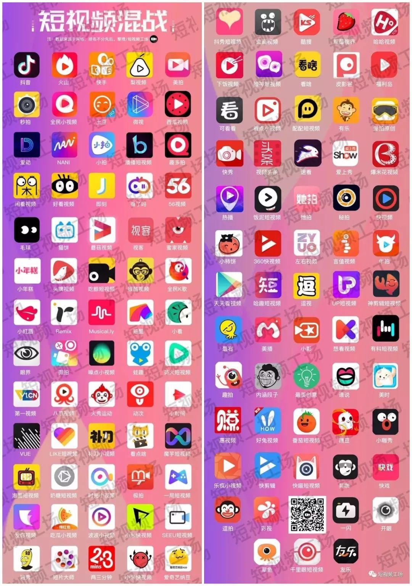
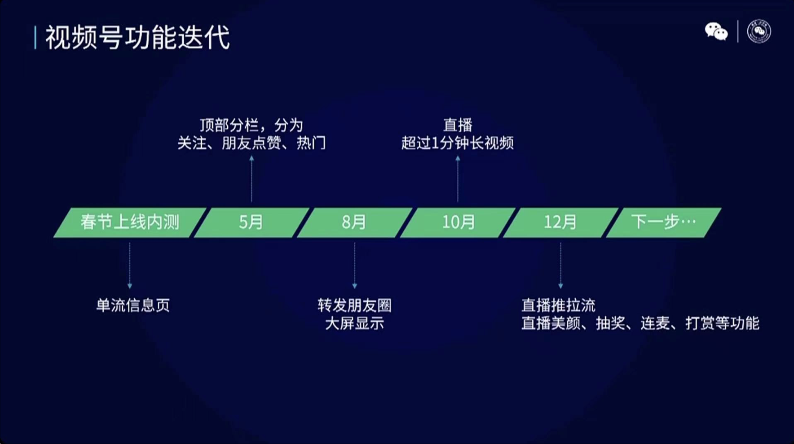

# 1. 视频号的缘起之因
---
> 以下内容，参考视频号官方发布的信息

## 1.1 视频展示取代图文表达成为新趋势
---
从 **2019 年的春节** 开始，就有越来越多的互联网巨头纷纷以视频的方式入局春晚，比如抖音、快手和微博等等，彼时还没有出现 「视频号」。

而 2020 年因为疫情，大家都没有感受到往常春晚的热闹。

但是当时间来到 **2021 年春晚** 的时候，各个短视频平台不仅再度发力，而且进一步加码投入。

其实，随着智能手机的普及和移动流量成本的下降，快手 在 2015 年就开始迎来爆发，用户量从 1 亿涨到 3 亿；作为后起之秀的抖音，也在 2018 年春晚前后迎来爆发性增长。2018 年，整个短视频迎来了全面的爆发，2018 年 6 月，短视频工场曾做了一个不完全统计，2018 上半年短视频APP多达127个；而下半年腾讯、爱奇艺、百度等平台不断加码短视频，在上半年的基础上，新增了至少15款短视频产品。

视频展示也逐渐取代图文成为了一个重要的社交方式。

许多的社交平台也纷纷置入新的视频功能，以视频的方式提升社交入口的吸引力已经成为市场趋势。

## 1.2 短视频大浪潮在微信生态的形式
---
2020年，是微信诞生的第九个年头，在铺天盖地的短视频大浪潮的时代，基于微信生态的「视频号」诞生了。

视频号自2020年1月开始内测，以超乎想象的迭代速度和质量体现了其在整个微信生态的重要位置。

在2020年的年底，更是进行了密集的更新。

为了2021年的春晚，同时上线连麦、美颜、打赏、抽奖等全新功能。

经过一年的发展，「视频号」成为微信生态重要链接板块，打通原本零散的公众号、朋友圈、小程序、小商店、直播、投放等产品组件，相互链接导流。

以「视频号」为核心的微信生态形成了更强大的生态体系，为短视频行业带来新一波红利。

## 1.3 视频号与抖音/快手的区别
---
说到「视频号」，就不得不提一下同在短视频赛道的抖音和快手。

快手的前身 「GIF快手」诞生于2011年3月，然后在2012年11月正式转型为短视频平台，抖音则诞生于2016年9月。

2020年1月份视频号诞生的时候，抖音和快手这两家短视频巨头公司已经在这个赛道上深耕多年，我们很有必要对比下他们之间的区别。

接下来主要从【用户、社交关系、使用场景】、【流量分发机制】以及【商业化】的角度进行对比。

### 1.3.1 用户、社交关系、使用场景
---
1. 用户
   
    从用户的角度来看，整体呈现的是：快手上移抖音下沉，视频号处于渗透阶段。

    在 2018 年之前，一直有南抖音北快手的说法，因为那时候快手用户的主要地区是北方，而抖音用户的主要地区是东南沿海和华南地区。

    快手在保持北方用户仍然是主要地区的情况下，加速实施向南方渗透的战略。

    而用户规模后来居上的抖音，最初的目标客群是潮流的年轻群体，随着用户的不断增长，也逐步改变理念主张“多元表达”，用户逐渐向低线城市、中青年人群覆盖，用户分布呈现下沉趋势。

    再到微信生态的「视频号」，用户分布还处于渗透阶段，很有可能成为短视频行业中的强力竞争者。

    总的来说，抖音/快手当前的用户规模是大幅领先于「视频号」的，但是各自都在做互相渗透，三者的用户重合度应该会越来越高。

2. 社交关系

   从社交关系的角度来看，整体呈现的是：快手是老铁粉丝，抖音是仰望追随，视频号是熟人社交。

    快手的宣传语是 「拥抱每一种生活」，凭着真实、接地气的内容和紧密的 “老铁关系” 拉近了创作者和用户之间的距离，社交互动的积极性会比较强。

    抖音的算法分发机制决定了优质内容可以获得更大的曝光，但是普通用户比较难创作出高质量的作品，所以抖音用户对 KOL 更多是处于欣赏、仰望和追随的状态。

「   视频号」由于背靠微信的十几亿用户生态，强调的是私域流量熟人社交，基于海量的社交关系链，通过点赞、分享、群聊等，可实现快速传播，触达更多用户。

3. 使用场景

   从使用场景的角度来看，整体呈现的是：快手、抖音侧重娱乐，视频号兼顾娱乐与专业场景。

    三者都有娱乐和直播交易场景，但快手和抖音目前主要涉及内容和消费场景，而「视频号」从诞生的那一天开始，就因为微信生态和熟人社交属性，更适合作为基础通讯、传播工具发展工作、生活场景。

### 1.3.2 流量分发机制
---
三者的流量分发机制都不太一样。

整体呈现的是：快手偏向于自主选择，抖音重视头部精品，视频号依赖微信社交。

快手采用的是 “去中心化”的流量分发体系，对头部的流量进行限流，保证了新发布视频的初次曝光量级，给予长尾用户（需求各异，体量巨大的用户）更多的曝光机会。

抖音采用的则是 “中心化” 的流量分发机制，使用多级流量池进行分级推荐，会比较注重完播率和点赞率，也更加注重头部、精品和热点作品，具有比较强的媒体性质和比较好的用户体验。

视频号采用的是关注、推荐和搜索为主的常规分发机制，以及基于朋友观看行为进行推荐的特色社交分发机制，流量庞大、来源丰富，兼顾了社交属性和内容分发的效率。

### 1.3.3 商业化
---
平台积累了流量之后，必定离不开商业化的问题。针对视频号/抖音/快手商业化的区别，可以从平台收入、广告、直播和电商几个角度来分析。

1. 平台收入

   从平台收入角度来看，目前抖音各个赛道都是处于领先的地位，快手的电商相对来说比较有潜力，视频号则处于刚刚起步的阶段，但是依托微信生态，综合商业价值潜力巨大。

2. 广告

   从广告收入角度来看，目前抖音是大幅领先的，这个得益于抖音的产品设计、流量分发和数据的积累。

    快手当前是处于增长迅猛的阶段，而且快手的广告形式比较丰富，包括开屏广告、信息流广告、快手粉条和挑战赛四大类。

    反观视频号，参考朋友圈的历程，则是属于潜力巨大的。

3. 直播

   从直播收入角度来看，抖音是增长迅猛的，快手是趋于成熟的，而视频号则处于刚刚起步的阶段。

    抖音的分发精准触达受众，加上两次“百万开麦”活动运营扶持以及对于头部明星的引进，推动了直播收入的快速增长。

    快手早期的直播收入是比较高的，但是目前直播付费渗透也已经逐渐饱和。

    视频号目前直播打赏的变现是比较克制的，所以还处于刚起步的阶段。

4. 电商

   从电商收入角度来看，抖音 GMV（商品交易总额） 增长迅猛，快手交易增长迅猛，视频号跟小程序的协同发展，则拥有广阔的想象空间。

    抖音当前以品牌商品为主、客单价较高，再结合从“短视频”公域种草到“短视频+直播”组合推广，抖音电商生态持续进化。

    快手电商以直播交易为主，源头农产品/白牌商品与品牌商品都有，同时快手比较看重供应链建设，自建好物联盟帮助中小主播带货，所以交易增长比较迅猛。

    视频号的电商变现建立在小程序以及小商店的推出和完善，进一步强化了微信底层的服务能力，拥有广阔的想象空间。

# 2. 视频号的价值所在
---
> 以下内容，参考视频号官方发布的信息
