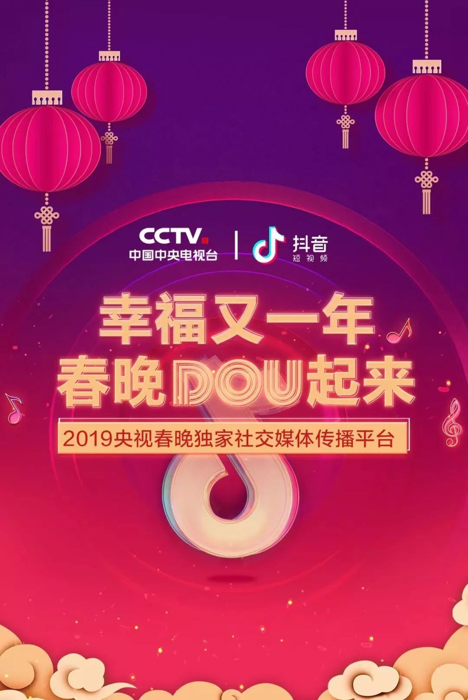
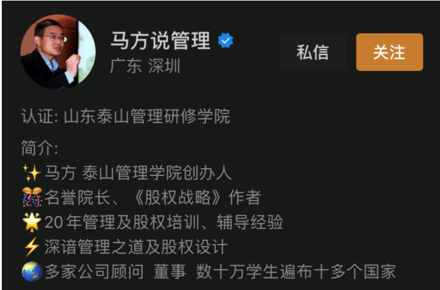
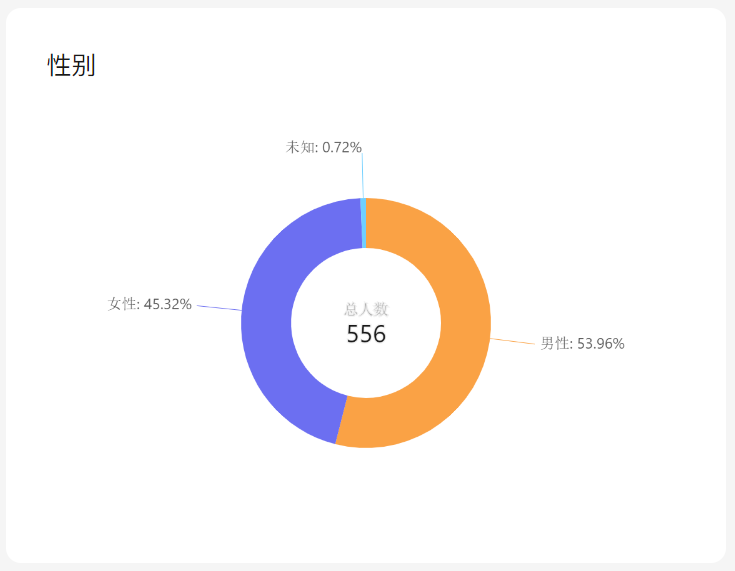
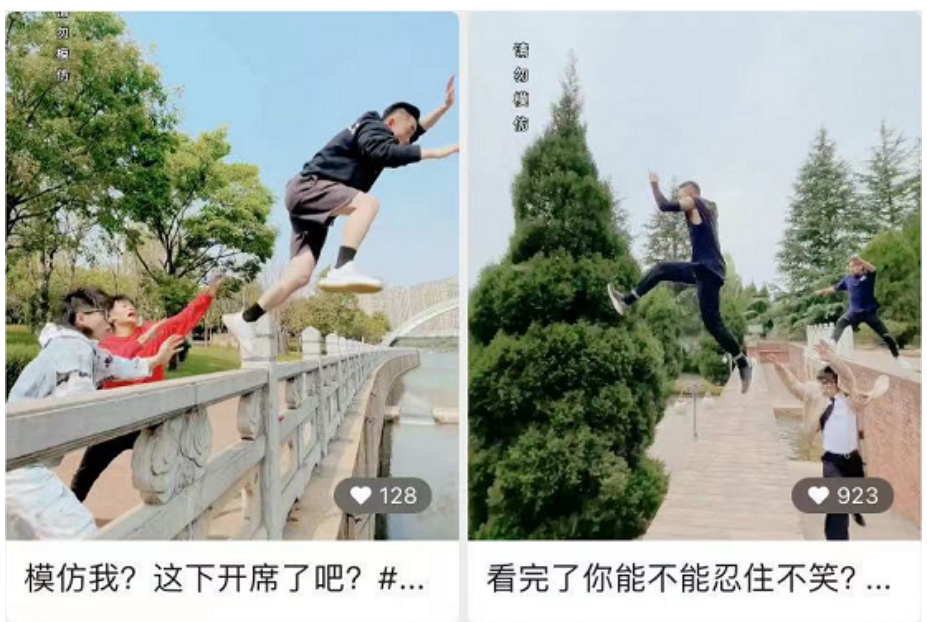

# 1. 视频号的缘起之因
---
> 以下内容，参考视频号官方发布的信息

## 1.1 视频展示取代图文表达成为新趋势
---
从 **2019 年的春节** 开始，就有越来越多的互联网巨头纷纷以视频的方式入局春晚，比如抖音、快手和微博等等，彼时还没有出现 「视频号」。

而 2020 年因为疫情，大家都没有感受到往常春晚的热闹。

但是当时间来到 **2021 年春晚** 的时候，各个短视频平台不仅再度发力，而且进一步加码投入。

其实，随着智能手机的普及和移动流量成本的下降，快手 在 2015 年就开始迎来爆发，用户量从 1 亿涨到 3 亿；作为后起之秀的抖音，也在 2018 年春晚前后迎来爆发性增长。2018 年，整个短视频迎来了全面的爆发，2018 年 6 月，短视频工场曾做了一个不完全统计，2018 上半年短视频APP多达127个；而下半年腾讯、爱奇艺、百度等平台不断加码短视频，在上半年的基础上，新增了至少15款短视频产品。

视频展示也逐渐取代图文成为了一个重要的社交方式。

许多的社交平台也纷纷置入新的视频功能，以视频的方式提升社交入口的吸引力已经成为市场趋势。

## 1.2 短视频大浪潮在微信生态的形式
---
2020年，是微信诞生的第九个年头，在铺天盖地的短视频大浪潮的时代，基于微信生态的「视频号」诞生了。

视频号自2020年1月开始内测，以超乎想象的迭代速度和质量体现了其在整个微信生态的重要位置。

在2020年的年底，更是进行了密集的更新。

为了2021年的春晚，同时上线连麦、美颜、打赏、抽奖等全新功能。

经过一年的发展，「视频号」成为微信生态重要链接板块，打通原本零散的公众号、朋友圈、小程序、小商店、直播、投放等产品组件，相互链接导流。

以「视频号」为核心的微信生态形成了更强大的生态体系，为短视频行业带来新一波红利。

## 1.3 视频号与抖音/快手的区别
---
说到「视频号」，就不得不提一下同在短视频赛道的抖音和快手。

快手的前身 「GIF快手」诞生于2011年3月，然后在2012年11月正式转型为短视频平台，抖音则诞生于2016年9月。

2020年1月份视频号诞生的时候，抖音和快手这两家短视频巨头公司已经在这个赛道上深耕多年，我们很有必要对比下他们之间的区别。

接下来主要从【用户、社交关系、使用场景】、【流量分发机制】以及【商业化】的角度进行对比。

### 1.3.1 用户、社交关系、使用场景
---
1. 用户
   
    从用户的角度来看，整体呈现的是：快手上移抖音下沉，视频号处于渗透阶段。

    在 2018 年之前，一直有南抖音北快手的说法，因为那时候快手用户的主要地区是北方，而抖音用户的主要地区是东南沿海和华南地区。

    快手在保持北方用户仍然是主要地区的情况下，加速实施向南方渗透的战略。

    而用户规模后来居上的抖音，最初的目标客群是潮流的年轻群体，随着用户的不断增长，也逐步改变理念主张“多元表达”，用户逐渐向低线城市、中青年人群覆盖，用户分布呈现下沉趋势。

    再到微信生态的「视频号」，用户分布还处于渗透阶段，很有可能成为短视频行业中的强力竞争者。

    总的来说，抖音/快手当前的用户规模是大幅领先于「视频号」的，但是各自都在做互相渗透，三者的用户重合度应该会越来越高。

2. 社交关系

   从社交关系的角度来看，整体呈现的是：快手是老铁粉丝，抖音是仰望追随，视频号是熟人社交。

    快手的宣传语是 「拥抱每一种生活」，凭着真实、接地气的内容和紧密的 “老铁关系” 拉近了创作者和用户之间的距离，社交互动的积极性会比较强。

    抖音的算法分发机制决定了优质内容可以获得更大的曝光，但是普通用户比较难创作出高质量的作品，所以抖音用户对 KOL 更多是处于欣赏、仰望和追随的状态。

   「视频号」由于背靠微信的十几亿用户生态，强调的是私域流量熟人社交，基于海量的社交关系链，通过点赞、分享、群聊等，可实现快速传播，触达更多用户。

3. 使用场景

   从使用场景的角度来看，整体呈现的是：快手、抖音侧重娱乐，视频号兼顾娱乐与专业场景。

    三者都有娱乐和直播交易场景，但快手和抖音目前主要涉及内容和消费场景，而「视频号」从诞生的那一天开始，就因为微信生态和熟人社交属性，更适合作为基础通讯、传播工具发展工作、生活场景。

### 1.3.2 流量分发机制
---
三者的流量分发机制都不太一样。

整体呈现的是：快手偏向于自主选择，抖音重视头部精品，视频号依赖微信社交。

快手采用的是 “去中心化”的流量分发体系，对头部的流量进行限流，保证了新发布视频的初次曝光量级，给予长尾用户（需求各异，体量巨大的用户）更多的曝光机会。

抖音采用的则是 “中心化” 的流量分发机制，使用多级流量池进行分级推荐，会比较注重完播率和点赞率，也更加注重头部、精品和热点作品，具有比较强的媒体性质和比较好的用户体验。

视频号采用的是关注、推荐和搜索为主的常规分发机制，以及基于朋友观看行为进行推荐的特色社交分发机制，流量庞大、来源丰富，兼顾了社交属性和内容分发的效率。

### 1.3.3 商业化
---
平台积累了流量之后，必定离不开商业化的问题。针对视频号/抖音/快手商业化的区别，可以从平台收入、广告、直播和电商几个角度来分析。

1. 平台收入

   从平台收入角度来看，目前抖音各个赛道都是处于领先的地位，快手的电商相对来说比较有潜力，视频号则处于刚刚起步的阶段，但是依托微信生态，综合商业价值潜力巨大。

2. 广告

   从广告收入角度来看，目前抖音是大幅领先的，这个得益于抖音的产品设计、流量分发和数据的积累。

    快手当前是处于增长迅猛的阶段，而且快手的广告形式比较丰富，包括开屏广告、信息流广告、快手粉条和挑战赛四大类。

    反观视频号，参考朋友圈的历程，则是属于潜力巨大的。

3. 直播

   从直播收入角度来看，抖音是增长迅猛的，快手是趋于成熟的，而视频号则处于刚刚起步的阶段。

    抖音的分发精准触达受众，加上两次“百万开麦”活动运营扶持以及对于头部明星的引进，推动了直播收入的快速增长。

    快手早期的直播收入是比较高的，但是目前直播付费渗透也已经逐渐饱和。

    视频号目前直播打赏的变现是比较克制的，所以还处于刚起步的阶段。

4. 电商

   从电商收入角度来看，抖音 GMV（商品交易总额） 增长迅猛，快手交易增长迅猛，视频号跟小程序的协同发展，则拥有广阔的想象空间。

    抖音当前以品牌商品为主、客单价较高，再结合从“短视频”公域种草到“短视频+直播”组合推广，抖音电商生态持续进化。

    快手电商以直播交易为主，源头农产品/白牌商品与品牌商品都有，同时快手比较看重供应链建设，自建好物联盟帮助中小主播带货，所以交易增长比较迅猛。

    视频号的电商变现建立在小程序以及小商店的推出和完善，进一步强化了微信底层的服务能力，拥有广阔的想象空间。

# 2. 视频号的价值所在
---
> 以下内容，参考视频号官方发布的信息

## 2.1 微信平台所给予的巨大流量优势
---
视频号的入口是微信，而微信又拥有 10 亿日活，这是一个超级入口。

它不像原来的微视，还要下载APP，本身就会流失很多用户。

微信是现成的超级入口，用户可以非常顺畅就切进来。

比起抖音，视频号更能充分挖掘用户熟人关系链、人脉资源的价值，帮助B端运营拓展私域流量和影响力。

视频号目前可以提供的便利之处是，你可以将视频和公众号文章进行打通，跟公众号相互导流。

再叠加微信小程序生态，视频号未来和小程序的打通也将在商业变现上的带来无穷的想象力。

想象一下，视频号+公众号+小程序+微信群+朋友圈 会是什么样的化学反应？

视频号是微信少有的带有公域流量入口的重要产品，推荐、#话题标签、搜一搜、看一看、公众号、附近的直播和人都打通了视频号，私域端的关注、朋友、名片页、发现页、朋友圈、微信群、微信聊天对话框等也都可以一键直达视频号。

视频号作为微信的战略级产品，一级入口位于朋友圈的下方，朋友圈的每天流量约为 100 亿人次，视频号在打通整个微信生态的情况下，拥有的巨大流量优势可想而知。

## 2.2 背靠微信的高效私域流量闭环力
---
私域流量早已不是新词，但正因为视频号的出现，它才得到了空前的重视。

到底什么是私域流量呢？

私域流量这个概念，其实是相对于公域流量而存在的，可以这么理解，把触达和运营更加自由的流量称为私域流量。

公域流量就像是大海，刚开始的时候，鱼多，捕鱼的人少，哪怕你技术一般，都有可能能捕到鱼；随着捕鱼的人越来越多，捕鱼的成本越来越高，对捕鱼技术的要求也越来越高，于是很多人就开始自建鱼塘养鱼，从而降低捕鱼的成本。

这种自建的鱼塘，我们就可以称为私域流量。

既然私域流量那么重要，那么无论是企业还是个人，都会想尽办法将视频号上的用户引导到自己的私域去。成功打造私域流量池，就成功地占据了一种低成本获客的渠道。

背靠微信的视频号，有私域流量闭环的天然优势。

首先，可以从微信群、朋友圈和公众号一键直达，打通微信生态的强大社交关系链，串联起潜在的社交消费的场景。

其次公众号和搜一搜作为内容生态圈的存在，对于视频号也放开了流量搜索入口，降低内容生产的门槛，提高传播效率，让视频号获得更好的曝光。

最重要的是，通过打通直播、小程序和小商店，形成微信生态内新的变现链条，视频号极有可能孕育出万亿电商市场。

## 2.3 对素人IP更易破圈的短视频赛道
---
视频号的底层逻辑是社交推荐，也正是这个原因，才让许多素人有勇气踏进短视频赛道，这也被认为是视频号最核心的吸引力。

其实也不难理解，由于微信的普及，用户不需要单独下载视频号，因为它就在朋友圈的下方，而创作者在视频号上发布的视频，可以通过好友、好友的好友……一层层点赞后推荐给了更多人观看。

正如人类关系的六度分隔理论，通过六个人就能认识全世界。

“只要你的内容优秀，你的朋友、你朋友的朋友，会帮你一直传播下去，就像是在喜马拉雅山上滚雪球一样，越滚越大。

相比其他平台要投入比较高的运营成本，初期积累较难。

视频号通过社交推荐，在目前的各大短视频平台里，算是对素人最友好、最扶持的了。

# 3. 视频号的操作指南
---
> 以下内容，参考视频号官方发布的信息

## 3.1 视频号基础功能的界面介绍
---

### 3.1.1 视频号主页
---
**我们常说的视频号主页，是自己视频号的“脸面”：**

+ 右上角的相机图标：发表视频动态、发起直播或直播预约
+ 右上角的三个点【…】：视频号设置页的入口
+ 简介下方的关注数：号主自己看到的是总关注数，而观众看到的是有多少共同关注好友

**观众点进你的视频号主页，可以在这里看到如下信息:**

+ 头像
+ 昵称
+ 认证标识（认证后在昵称旁边会有个加V标识）
+ 坐标
+ 认证类型（认证后在简介上方会显示类型，如：“认证：生活博主“）
+ 简介
+ 公众号：如果进行了公众号账号绑定，会看到当前所关联的公众号入口
+ 商店：号主自己的视频号商店入口（8.0.6版本微信此处被隐藏了）
+ 活动：如果号主在发表动态的时候创建了活动，也会展示在这个地方
+ 内容有四个栏目：
  * 动态：所有你发表的视频、图片动态信息 
  * 被提到：其他 @ 你的动态，只要你设置了允许展示，这里就能看到
  * 音乐视频：所有发表的音乐视频动态会被分到这个栏目下（只有发表过音乐视频，才会出现该栏目）
  * 商品：上架过小商店，才会出现该栏目
   

注意：考虑部分人已可以升级 8.0.6 版本，下图为【视频号商店】在新版本微信中的变动

视频号主页的界面介绍完，那么如何进入到自己的视频号主页呢？

**想要打开视频号主页，有两个入口：**

+ 微信->我->主页
+ 微信->发现->视频号->推荐页->右上角头像（视频号个人中心）->点击视频号名称->主页

**注：如何打开发现页视频号入口？**

如果在发现页面找不到【视频号】，可以通过 “我” -> “设置” -> “通用” -> “发现页管理” -> 打开【视频号】选项即可

### 3.1.2 视频号推荐页
---
上面提到了视频号的微信->发现->视频号->推荐页 点击【视频号】之后，会进入视频号的推荐页，在这里可以看到 3 个 tab：

1. 关注：你已经关注了的朋友的视频动态
2. 朋友：你的微信好友点过赞的动态
3. 推荐：微信官方所推荐的动态

然后点击右上角的【用户图标】进入视频号个人中心页面

### 3.1.3 视频号个人中心
---
首先，打开微信，切换到 【发现】页面，即可找到 【视频号】菜单，点击进入到**视频号推荐页**，点击推荐页右上角的【用户图标】，进入视频号的个人中心界面。

**页面分为两部分的内容：浏览设置 和 我的视频号**

### 3.1.4 视频号设置页
---

## 3.2 个人/企业开通视频号的步骤
---
个人视频号还是企业视频号在开通视频号的步骤都是一样的，只是在认证的时候选择的认证类型不一样导致的。

如果你的微信号是一个完全全新的微信号，那么按照下述步骤即可开通微信视频号。如果你的微信已经进行开通了微信支付，并且通过了微信实名认证，那么可以直接跳过下述步骤中“实名认证”的相关步骤。

### 3.2.1 打开视频号个人中心
---
点击【用户图标】之后，进入视频号的个人中心界面，分为两部分的内容：浏览设置 和 我的视频号。由于此时还没开通视频号，所以系统只显示【发表视频】的按钮，点击 【发表视频】 进入下一步

### 3.2.2 实名认证提醒
---
点击【发表视频】之后，如果此时还没有完成实名认证的话，会弹出【实名认证】提醒弹框，点击 【实名认证】

### 3.2.3 实名认证确认页
---
点击 【实名认证】后，会进入实名认证确认页，点击【立即认证】

### 3.2.4 隐私政策页面
---
点击【立即认证】后，会进入隐私政策页面，点击【同意】

### 3.2.5 身份信息页面
---
点击【同意】后，会进入填写身份信息页面，需要如实填写自己的实名认证信息

### 3.2.6 身份信息下一步
---
填写完实名信息后，点击下一步

### 3.2.7 添加银行卡
---
填写完实名信息后，还需要绑定银行卡，添加完银行卡后，继续点击下一步

填写完所有信息，勾选 同意用户服务协议，继续下一步，就可以进入视频号开通的最后一个页面了

### 3.2.8 开通视频号
---
我们来到最后一步
1. 上传头像
2. 填写视频号名字
3. 选择地区
4. 打开在个人名片上展示视频号开关
5. 勾选 我已阅读并同意《微信视频号运营规范》和《隐私说明》
最后点击创建，就完成视频号的创建了
   

## 3.3 昵称，头像和简介的设置流程
---
视频号已经开通，那么接下来说一下最基础的三个设置项：昵称、头像、简介如何设置

### 3.3.1 打开视频号主页
---
点击视频号主页右上方的【…】三个点，进入视频号设置页面

### 3.3.2 视频号设置页
---
点击【资料设置】选项，进入个人资料页

+ 头像：没有改动次数限制，可以重新拍照、从手机相册选择
+ 名字：一个视频号每年只有 2 次改变昵称的机会（不建议昵称超过 6 个字或使用生僻字）
+ 简介：字数限制 200 字以内（注意换行排版）

## 3.4 横屏/竖屏视频的最佳尺寸选取
---
如果你把在抖音或快手上剪辑视频的尺寸比例搬来视频号，那么你剪出来的视频发表后大概率会被自动裁剪，导致不能完美展示。这里就跟大家简单的介绍一下微信视频号官方推荐的最佳尺寸比例。

### 3.4.1 竖屏模式
---
官方给出的最佳竖屏尺寸是-比例6:7（分辨率 1080 * 1260）即：满屏效果

### 3.4.2 横屏模式
---
官方给出的最佳尺寸是-比例 16:9 （分辨率 1080 * 608）

两个模式下，只要视频的比例在此区间内的尺寸，画面都可以被完全展现出来，超过此范围的话，画面可能会自动被裁剪，或信息被遮挡！

## 3.5 易上手的视频拍摄剪辑软件推荐
---
视频必不可少会涉及：封面制作、视频拍摄、视频剪辑加工这几个步骤，下方为大家推荐几款从身边玩视频号的朋友身上收集而来软件。

除了：Adobe 家的几款软件（PS、PR、AE）、绘声绘影有一定的使用门槛（但在 B 站上搜索一下能找到大量的教程），其余几款软件都是非常基础的软件，大家可以先试用，然后根据自己爱好进行挑选使用。
关于视频号更多的拍摄剪辑技巧，可以看 [第6部分：视频号的拍摄剪辑](视频号项目手册.md#-6)。

### 3.5.1 图片制作软件
---
+ 醒图：是一款功能强大的修图软件，同时里面有很多的模板，可以用于制作视频封面
+ picsart：可以对照片进行效果处理、文字添加和增添艺术效果
+ Adobe Photoshop（简称：PS）：功能强大，门槛较高的专业制图软件

### 3.5.2 视频拍摄软件
---
+ 无他相机
+ 美颜相机
+ 轻颜相机
+ Faceu激萌
+ Camera360.
+ 美拍

### 3.5.3 视频剪辑软件
---
+ 剪映：抖音出品的视频剪辑工具，有非常丰富热门模板库，操作简单，用户跟风创作出非常美的视频
+ 快影：快手出品的视频剪辑工具，基础剪辑功能操作非常简单，创作门槛低
+ 必剪：B 站出品的剪辑工具，操作简单，更注重于音频功能的完善
+ 秒剪：腾讯专门为微信视频号打造的剪辑工具，操作非常简单，但目前剪辑功能相对简陋
+ 绘声绘影：相对PR、AE的门槛要低，如果不是需要非常高级的剪辑功能可以优先考虑
+ Adobe Premiere Pro，简称：PR
+ Adobe AfterEffects，简称：AE

## 3.6 上传和发布视频作品的详细流程
---

### 3.6.1 入口
---
**发表视频的入口有两个：**

+ 视频号首页：微信->我->视频号，

+ 视频号个人中心页：微信->发现->视频号->右上角头像

### 3.6.2 发表视频
---
1. 点击【视频号主页】右上角的【相机】图标，选择【发表视频】

   

2. 点击【视频号个人中心页】底部的【发表视频】

   

### 3.6.3 选择发表方式
---
+ 点击【发表视频】，选择发表视频动态的方式

    

+ 【拍摄】：调用的是手机系统的相机进行实时的拍照或拍视频，功能单一
+ 【从手机相册选择】：推荐使用上一小节中提到工具进行拍摄剪辑，再通过该方式发表动态
+ 【用秒剪制作视频】：通过微信视频号推荐的剪辑工具来制作发布

**注意：**

+ 如果动态展示类型是“图片”，那么一次发表动态可选择**1-9**张图片进行展示
+ 如果动态展示类型是“视频”，那么一次发表动态只能选择**1个**【视频根据时长分两类】
   * 短视频：用户只能截取选取视频中的其中一个片段，截取时长不得超过**1分钟**
     
   * 完整视频：截取的视频片段不得超过**30分钟**【完整视频在用户自己发表视频时，只能预览前 1 分钟视频片段，不影响观众用户实际观看】
   
### 3.6.4 编辑动态
---
选择好图片，可以对已选择的图片进行简单的编辑，编辑完成后点击“完成”即可。

支持的编辑操作非常简单，如：添加背景配乐、添加表情、添加文字、打马赛克。

### 3.6.5 编辑动态信息
---
编辑发表动态的描述

+ 话题-可以添加对应的话题标签-便于检索
+ @提到-@你自己想要提醒的人
+ 活动-可以发起一个活动，其他人也可以参与到这个打卡活动中来
+ 地标：标记了位置，更容易被同城的人看到
+ 扩展链接：可以放入一个自己想关联的网址，点击视频下方的网址可以跳转到对应页面

### 3.6.6 检查发表动态
---
如果发表动态成功，回到自己的视频号主页就可以看到了。

如果你使用电脑 PC 端比较多，也可以通过“视频号助手”https://channels.weixin.qq.com/ 完成上述操作，步骤基本一致，不再赘述。

## 3.7 如何发布音乐视频
---
前面介绍【视频号主页】的时候说到过，发表动态的时候还有一类【音乐】动态，这一小节就来和大家介绍一下如何发布音乐视频。

首先，打开【QQ 音乐】，找到自己喜欢的音乐，然后点击**右上角分享按钮**，选择分享到【微信好友】，流程如下图所示：

然后，从 微信好友 的聊天对话框中找到刚刚分享的音乐，点击进入播放页面，默认会随机播放一个这首歌的音乐视频，点击【转发】会看到弹出弹窗中有【创作音乐视频】的入口。

打开音乐视频编辑界面，从相册或者是视频号选择合适的视频，单击添加到音乐封面中。

点击视频后，进入视频截取界面，可以自由拖动视频进行编辑。

点击【确定】，完成一段音乐片段的视频编辑。按照上述的步骤，重复编辑完整首歌，然后点击【下一步】就会将各个编辑完的片段合并为一个完整的预览视频，如下图所示：

预览没有问题，点击【完成】即可生成一段完整的音乐视频了，然后点击【发表】即可在【视频号主页】的【音乐视频】栏目下看到了。

## 3.8 个人/企业加V认证的类型及流程
---
随着视频号的进一步放开，越来越多的用户进驻到视频号的行列，大家都在忙于视频号认证，那么今天一文告诉你视频号认证的分类、如何进行认证、需要准备哪些材料、认证需要注意的事项、视频号认证的具体步骤有哪些？

### 3.8.1 视频号的认证分类
---
目前，视频号认证分为：兴趣认证、职业认证、企业和机构认证。其中“兴趣认证”和“职业认证”适合个人申请，“企业和机构认证”适合企业或机构进行申请认证，详见配图

### 3.8.2 个人认证申请
---
进入视频号主页，然后点击右上角的 【…】打开视频号设置页，选择【认证】，随即进入到上述的视频号认证页面，您可以根据自己的条件选择【兴趣认证】或【职业认证】。

### 3.8.3 兴趣认证简介
---
兴趣认证分为三大类：

+ 自媒体
+ 博主
+ 主播

每一个大分类下又包含了不同的小方向认证分类（如：自媒体认证包括互联网自媒体、科技自媒体、科普自媒体等，类似的博主认证包括互联网博主、科技博主和科普博主等），在认证的时候可以进行具体的选择，每一个小分类认证都会有对应的认证条件说明，在此便不重复赘述。

兴趣认证基本要求：

+ 近 30 天发表 1 个内容
+ 有效关注数 1000 人以上（若开通了原创计划，该有效关注人数会相对应的降低）
+ 已填写简介

必须同时满足以上三点需求才可以发起认证申请。

### 3.8.4 兴趣认证需要准备资料
---
+ 在对应领域持续发表原创内容，且微信是癖好有效关注数 1000 以上，并提供内容创作资料证明
+ 在对应领域持续发表原创内容，且微信公众号有效关注数 10 万以上
+ 在对应领域持续发表原创内容，且除微信外的其他平台有效粉丝数 100 万以上

### 3.8.5 职业认证
---
职业认证几乎涵盖了当下所有职业考证的所有职业，需要满足的基本要求只有下述 2 个：

+ 近 30 天发表 1 个内容
+ 已填写简介

看似条件简单，实则不然。
因为一般都需要在职证明、职称证明、作品荣誉证明、行业协会会员证明等信息。

### 3.8.6 职业认证需要准备资料（以书法家举例）
---
1. 独立创作的作品在省级及以上书法家协会主办的展览中展出
2. 省级及以上书法家或硬笔书法家协会会员
3. 非书法家协会会员，但满足中国书法家协会入会条件者

### 3.8.7 个人认证等级
---
目前来说个人认证的等级分为三级，分别是

+ 白V：有效关注数 1000 人以上
+ 灰V：关注数 5000 人以上
+ 金V：关注数 10000 人以上

### 3.8.8 企业认证申请
---
企业认证和个人认证流程类似，都需要个人微信的实名身份认证，不过区别在于企业认证需要已经认证的公众号管理员扫码确认，企业认证的标识是“蓝V”，并且企业认证开直播是没有礼物打赏的功能的（因此建议每一个企业认证号也同步开通一个个人认证号）。

**企业认证步骤如下截图：**

### 3.8.9 个人/企业认证的区别
---
+ 个人认证：适合有线下身份的个人，或线上博主、自媒体申请
+ 企业和机构认证则适合非个人主体（比如政府机构、企业、品牌机构、媒体、社会团体等）

### 3.8.10 认证注意事项
---
1. 无论你是个人认证还是企业机构认证，一个视频号每年只有两次申请认证机会，两次修改机会
2. 选择企业认证的要先确认好微信号，因为一个微信号只有一个视频号

## 3.9 开通视频号小商店
---
说到直播，那么现在的人必定也会想到“带货”。这里就来跟大家介绍一下视频号带货所必须要的“小商店”是如何开通的。

### 3.9.1 小商店的入口
---
入口分为用户看到的【视频号商店前台】入口、管理员看到的【视频号商店管理后台入口】

+ 【视频号商店前台】可以通过【视频号主页】展示的商店标识入口进入
+ 【视频号商店管理后台入口】的入口在【视频号设置页】

### 3.9.2 开通小商店
---
+ 点击【我的商店】可以打开【小商店助手】，初次开店可以点击小程序的【免费开店】

    

+ 点击【免费开店】后，即可进行商店类型选择。商店有两类：
    * 企业/个体户/事业单位等：需要提供营养执照或个体户登记证书信息，但是没有收款限额
    * 个人：无需营养执照，人人都可以开，但是每天只能收款 10 万
    
    

+ 选择好小商店类型，勾选下方的服务条款，点击【下一步】，等待一会儿，看到如下方图片所示，则代表视频号小商店就自动开通好了。

+ 此时，点击【进入我的店】就可以去到自己小店的后台管理界面进行添加商品或带货了。

    

## 3.10 视频号新手的X种踩禁区类型
---
对于视频号的新手来说，弄清楚平台的禁区非常重要。

这个小节围绕：短视频、直播两个方面来简单谈一下。

+ 短视频违规被官方删除。
+ 主播身份造成的直播违规可能会导致直播中断，严重会导致封号或停止账号使用视频号功能；微信针对嘉宾身份造成的直播违规采用连坐方式，即：嘉宾连麦违规会导致嘉宾自己和主播共同受罚；观众身份造成的直播违规可能会导致直播间评论被屏蔽禁言，严重会被封号。

### 3.10.1 短视频的禁区
---
1. 侵权内容
   * 如：仿冒他人信息、侵犯他人各类合法权益、侵犯著作权
   * 最容易犯的就是：搬运其它含水印的视频

2. 低俗内容
   * 如：着装暴露、含侮辱性话语、违背伦理、不利于未成年人身心健康的内容
    
3. 过度营销或骚扰他人内容
   * 如：带传销性质内容、公开募捐、公开买卖或传播违规软件
   * 涉嫌捏造虚假信息进行营销
   * 整个视频都是广告导流、视频带有大量二维码等内容
    
4. 违法违规或令人不适内容
   * 如：违反国家法律法规、涉及暴力血腥或恐吓人性质、散布谣言等视频内容
    
5. 诱导性质内容
   * 如：通过各类非正规手段，诱导用户转发、点赞、评论或关注
    
6. 色情内容

### 3.10.2 主播直播禁区
---
1. 不能小孩子直播单独出镜
2. 直播期间不能讲政治或敏感话题、国际政治人物、国家名称等信息
3. 直播期间尽量不要出现具体的品牌名词
    + 例如：“抖音–>某音”、“快手–>某手”
4. 不要在车内做直播会被视为开车直播，会被中断，并被视频号团队警告

### 3.10.3 直播评论禁区
---
符合以下情况的一些词语，主播经常出现下列词语可能会被中断直播、限制开播十二小时至十年不等；观众发了之后可能会被直播间屏蔽（即：别人看不到你发的评论，多次触发则直接屏蔽所有评论）、限制视频号直播评论点赞连麦互动等功能。

**以下词语是在各互助群里群友踩坑试验总结出来的（不代表权威）**

+ 与 “ 最 “ 有关，如：最、最佳、最具、最爱、最赚、最优、最优秀等
+ 与 “ 一 “ 有关，如：中国第一、全网第一、销量第一、NO.1、TOP.1 …
+ 表示权威性的禁忌词，如：国家 XXX 领导人、机关推荐、质量免检、老字号、中国驰名商标、特供、专供…
+ 与 “ 首/家/国 “ 有关，如：首个、首选、全国首家、全网首发、独家、全国销量冠军…
+ 包含 “ 级/极 “ 的词语，如：国家级（相关单位颁发的除外）、全球级、顶级…
+ 表示品牌地位的相关词语，如：王牌、领袖品牌、世界领先、遥遥领先
+ 表示绝对、极限且无法考证的词语，如：绝无仅有、史无前例、万能、100%
+ 涉嫌欺诈消费者的表述，如：点击领奖、恭喜获奖、全民免单、点击有惊喜等
+ 虚假内容相关词语，如：史无前例、前无古人、永久、万能、祖传、特效、无敌等
+ 避免讨论：刷单、认证黄V，白V，灰V
+ 夸大效果，如：超级美白，超级补水，非常抗皱
+ 涉及宗教信仰问题，如：天主，耶稣，神，上帝等语言以及实物出境
+ 讨论国家法律法规、国际政治人物、敏感政治问题
+ 组织、宣传、诱导用户加入传销或有传销嫌疑的机构或组织
+ 长时间讨论导流，引流，抖音快手等第三方平台
+ 未经腾讯另行许可，对外宣称与腾讯或微信合作，或腾讯或微信独家授权的
+ 视频号直播间的违规画面小孩出镜、未成年参与直播或视频连麦。视频号直播连麦违规及应对措施连麦中一方违规，双方一起被封
+ 不当展示国家机关各部门的标识、徽章，如国旗、国徽、警徽等
+ 涉及黄赌毒的，比如黄色录像、色情图片、长时间暴露私密部位；展示赌球、赌马、赌石、玩老虎机、扑克牌、麻将机；讲解制毒过程、吸毒…
+ 侵犯合法权利肖像权，品牌 logo 出镜，侵犯名誉权，如：国家各级领导人、明星、马化腾、马云…
+ 侵犯他人隐私的，如：偷拍偷录、公布他人姓名、联系方式，聊天记录等
+ 盗播、转播他人知识产权的内容或泄露他人的商业机密
+ 投资、融资类的内容，如：荐股、网贷、推销金融产品、证券或期货有偿咨询
+ 暴力和恐怖的画面，如：虐待、杀害动物，殴打和暴力威胁他人
+ 假吃、以催吐方式进食、宣扬量大多吃、胡吃海塞、暴饮暴食等吃播内容
+ 展示使用（仿真）刀具、枪支，表演危险性动作
+ 未经资质审核，发布新闻或时政信息
+ 未经资质审核，发布募捐、筹款等公益慈善类内容
+ 宗教、迷信类内容，如：算命、法术、驱鬼、预测国运、个人发展
+ 未经资质审核，宣传医疗、药品、医疗器械、农药、兽药、保健食品、烟草、成人用品等
+ 解说或展示未取得文化行政部门内容审查批准文号或备案编号的网络游戏产品
+ 推广未经允许的第三方平台服务，如：其他平台的二维码、外部链接等（实际测试：长时间展示微信自己的二维码也会被中断）
+ 引导线下交易，导流至其他平台交易、银行卡交易
+ 展示、宣传假币，或出现人民币等纸币
+ 主播离开直播间，画面长时间不动，没有音频出现…会被迫中断直播
+ 录播，一人多机位直播或录播等情况会被中断（实测：直播放视频过多会被质疑为录播）
+ 视频号小商店功能使用小商店卖书，需要出版社提供的经营许可证，和书本扉页的合法出版证明
+ 选择「购物分类」的直播间，必须挂商品，不然会被警告和限流
+ 医药健康、服装、食品等直播带货视频号主，没有销售权限卖口罩、会被封
+ 个人商店日订单10万元以上，没有白名单，无法使用小商店
+ 直播间没有的产品，引导大家微信下单和支付等，也需要谨防被封
+ 含“小姐”、“搞”这类词语会被屏蔽，如：小姐姐、小姐、搞事情、搞东西…

# 4. 视频号的人设定位
---

## 4.1 关于昵称、头像和简介的设置
---

### 4.1.1 如何给自己取一个好名字
---
1. 以始为终，从运营目的出发
   
   开通视频号后，第一步就是起名字，很多人因为不知道用什么名字，在创建视频号的第一步就停住了。
    
    因为视频号不能重名，而且每年只有两次修改名字的机会，所以最好是创建时能把名字大致确定下来，然后后面可以在此基础上做完善和优化，以免后期频繁修改名字增加不必要的解释成本。

    可能有些人会告诉你很多起名字的方法和套路，什么样的名字更便于传播。

    这些方法本身是没有错的，但却并不适用于所有人。
    每个人运营视频号的目的不一样，起名的方法自然也是不一样的。
   
    运营目的大致可以分为三类：
    + 打造个人 IP，即个人品牌塑造
      * 下文我会这类视频号称为博主号
    + 打造公司企业品牌，传播企业文化
      * 下文我会把这类视频号成为企业号
   >（博主号和企业号都是通过信任感变现）

    + 获取平台流量，通过流量曝光
      * 下文我会把这类视频号称为自媒体号
   >（自媒体号则是通过流量变现）
   
2. 博主号、企业号取名的套路

   如果你运营视频号的主要目的是打造个人品牌，建立你在某个专业领域的个人影响力，而且你的视频号定位也是和你的职业相关，那些什么取名套路你就完全忽略吧，你直接用你的真名或者你在职场上惯用的名字就可以了。

    视频号主要是以社交链为推荐逻辑的平台，所以你肯定也希望你的客户、同行朋友、合作伙伴刷到你的视频时就知道是你做的，以此打造你的职场口碑，从而建立你在职场或者专业领域的影响力的。那么人家为什么能一眼看出是你做的，要么你用的是真名，要么就是你惯用的名字。

    如果你的名字过于常见或者有生僻字，常人都容易读错，引起误会的话。我会强烈建议你修改一下。而且名字一旦确认，最好不要大改，切忌频繁修改，然后就是做好全网统一，不然你之后影响力建立后，名字不同意，大家无法把你这个人和你的账号一一对应上，就会产生很多解释成本。

    最后，你还可以在自己的名字后面加上你的视频号的定位，这里也有一个套路：说讲聊教，用xx说园艺，xx讲理财，xx聊投资，xx教素描。总之简单说就是：名字+职业/领域/专业/方向，这样你的名字，别人一看就知道怎么称呼你，然后也知道你是做什么的。

    **案例分享：**

   * 马方说管理

    
    
   * 廖橘聊社群
    
    

   * 杰森聊投资
   
    

   * 痴海教 Python
   
    

   给公司/企业取名也是一样的。

   所以，起名字要以始为终，从目的出发，找到最适合自己的才是最好的。

3. 自媒体取名的几个小技巧

   如果你的目的并不是打造个人/公司企业品牌，而是做一个自媒体流量号，那么又该如何取名字呢，这里可以看看这几个技巧。

   > 从场景出发

   你可以思考下你的视频号具体使用场景是什么？可以从时间、空间、行为场景出发，比如，“陈翔六点半”、“爆笑办公室.”、“十点读书”、“睡前伴读”，这些名字是不是你一看到就可以联想到一个具体的情景，会让你印象深刻。

   **案例分享：**

   * 陈翔六点半
   
   

   * 爆笑办公室
   
   

   * 十点读书
   
   

   > 从受众出发

   思考一下你的视频号用户定位是什么，会关注你的人会是哪些群体。然后你就可以把这些群体的特质凸显在视频号的名字上，就会很容易吸引到这群人了。比如，“为她读书”、“料理猫王”、“嘎子学厨艺”。

   **案例分享：**

   * 为她读书
   
   

   * 料理猫王
   
   

   * 嘎子学厨艺
   
   

   > 从功能出发

   简单说就是你的视频号可以给人传达什么价值，别人会有哪方面的收获。给视频号起名尽量简单、直接，你可以试着用你的定位加上一个名词或者形容词的组合命名视频号。比如，“媛媛学姐说理财”、“火器酷”、“解毒科技”、“带你徒步世界”。

   **案例分享：**

   * 媛媛学姐说理财
   
   

   * 火器酷
   
   

   * 解毒科技
   
   

   * 带你徒步世界
   
   

   这样取名的一个好处就在于，如果观众不是通过推荐刷到你的视频，而是去搜索关键词寻找相关视频时，就可以增加搜索到你视频号的概率，从而引来更多流量。

   > 使用数字

   比如，“一分钟做美食”、“一分钟说普法”、“30秒学美妆”这些都是通过数字来强调可以用很短的时间让用户学习到知识、技能，就非常巧妙的命中了那些想通过碎片化时间学习的人的痛点。

   **案例分享：**

   * 一分钟做美食
   
   

   * 一分钟说普法
   
   

   * 30秒学美妆
   
   

   > 吸睛博眼球

   通过有趣、有创意的名字吸引眼球，激发好奇心。比如“奥特曼遇到小怪兽”、“馋哭日记”。

   **案例分享：**

   * 奥特曼遇到小怪兽
   
   

   * 馋哭日记
   
   

### 4.1.2 如何选取一个适合自己的头像
---
视频号的头像体现了号主的品味和风格，同时也关系着粉丝对号主的印象和信任程度，就像我们出门时的衣着装扮，也是展示号主的小窗口，所以我们一定不能敷衍，要用心选择，尽可能减少解释成本。但是对于自媒体号和博主号，头像的选取也是有所区别的。

博主号是指打造个人 IP，个人在某个领域的影响力，更偏向个人的自我展示，比如张哥“stormzhang”，禅叔的“阿禅”，虽然张哥认证的是科技自媒体。而自媒体号则是进行流量运作的个人和机构账号。

**博主号如何选取好的图片制作头像？**

1. 像素清晰，图片品质高

   我们想通过视频号头像这个窗口很多的展现自己，首先就要确保头像图片是清晰的、而且画面背景元素简单、不要太杂，人物尽量大，占据居中较大位置，图片也不要因为被压缩导致变形。

2. 符合账号定位

   符合第一个条件后，我们头像就需要符合账号人设定位的，比如你是旅行博主，就不适合放职业照了，如果你是知识干货型的博主，就不适合用随意的生活照，大头贴之类的了。

   你也可以选择有创意、带话题性的图片作为头像。

   比如，你是摄影博主，你就可以把瘦小的你放在一个巨大的单反上，会让观众更加好奇，引起互动。

3. 真实可亲近，建立信任感

   尽量使用接近你本人外貌、气质，符合你性格的头像，否则就真成了“照骗”，别人当看到真实的你时，难免就会有些许失落，信任感会大打折扣，所以不要过度失真。然后，就不要用一些网图，用本人的头像会让人觉得容易接近，更有安全感。或者，使用你一直在互联网上用的头像、logo，别人一看到就能和你联系起来，也是可以的。

   自媒体号，可以不使用真人头像，但上面提到的三点还是有借鉴意义的，你还可以从网上找符合自己账号调性和内容定位的，而且没有版权的图片作为头像。其实，你最好可以自己设计一个头像，就注意不要引用有版权的图片和文字就好了。

### 4.1.3 如何写一个好的简介
---
名字、头像都有了，那么简介要怎么写呢？

很多人在点进你的视频号主页后，一般都会去通过简介来了解你，其实好的简介就两个原则：简单易懂，陈述利益。

简介简介，第一个一定要够简单，让想要关注你的人能快速抓住核心内容，所以就需要把最重要最核心的内容放在第一行，长篇大论的简介往往让人无法抓住重点。

大家注意观察的话，那些越牛逼的人，头衔和 title 是越短的。

而陈述利益，则是让用户在看到你的简介时，可以清楚的知道自己关注了这个视频号，可以给自己带来什么价值，自己能学到什么，有什么收获。比如，“鱼子酱t”，这个账号，简介就是“爱美食，爱分享”，你就知道关注后，可以轻松学习一些美食的制作方法之类的。

那么具体如何写呢，可以参考一下以下**几种方法：**

1. 自我介绍型
   
   比如你账号定位是打造个人品牌，简介就可以写成自我介绍，把最重要的部分，也就是和你视频号内容最相关的身份放在首行，比如“房琪kiki”的就是“旅行达人 优质视频创作者”。

2. 内容提炼型

   你可以用非常简洁的一句话提炼出你视频号最核心的内容，介绍你能提供的价值或者服务。
   
   比如，你是普法的，就可以写成“专注法律知识分享”，“每天一分钟普法”。
   
3. 强调受众型

   即根据你的目标用户，让有同样想法的人找到知己的感觉。
   
   比如，你是一个个人成长、践行长期主义、终身学习的博主，你就可以写成“一个践行长期主义、终身学习的聚集地”、“一个终身学习者的乌托邦”。
   
4. 引发共鸣型

   就是一句能直达观众心灵的一句话，走抒情路线。
   
   比如，“一条”的视频号简介是“所有未在美中度过的生活，都是被浪费了”。

5. 使用数字

   因为大家都是对数字特别敏感的。
   
   比如，你从事某领域多少年了，做出过多少成绩，用具体的数字表现，会更加立体和直观，一目了然。

看了上述的方法，你就可以根据自己的视频号定位，模仿起来了。

## 4.2 关于保持每条视频风格的统一
---
视频风格的统一，一是会让你视频号的主页看上去更为赏心悦目，再者会让用户慢慢习惯你的视频，从而爱不释手。

每条视频风格的统一包括主体内容、封面、拍摄技巧手法、配乐、剪辑手法、字幕、字体等等。

所以一旦确认自己的账号定位，就需要统一号自己视频的风格，培养用户的习惯，而且统一的风格，会让你后期视频制作的成本大大降低。

其实最重要，效果最明显的就是封面的统一，封面首先就需要有标题，观众看第一秒钟就知道视频的内容是什么，而好的封面在此基础上还需要美观、符合你的定位、有你自己的风格。

美观的话，每个人的审美素养不一样，那你就可以多问问你身边的朋友，和他们交流一下，尤其是你的受众群体。

封面的统一，一个就是标题（字体保持一致）、一个就是美观的背景。

其他拍摄、剪辑、配乐、字幕之类的，一般同一个人做得都不会相差太大，只要注意符合定位就好了，比如知识分享类的就很简单，不需要剪辑的过于花哨，配乐也不要很俏皮之类的。

我找了一些，我觉得视频风格统一做得还不错的视频号主，大家可以借鉴一下：

**案例分享：**

* 巨猩战略营销宋飞

* 鱼子酱t

* 鹤老师说经济

* 城南摄郎

## 4.3 关于了解粉丝群体的用户画像
---
可以登录网页版视频号助手：https://channels.weixin.qq.com

在后台——数据中心，查看关注者数据，点击关注者画像，可以查看截止到前一天 23 点 59 分的性别、访问设备、年龄分布、地域分布的相关数据。

# 5.视频号的内容策划
---

## 5.1 视频内容的素材来源渠道
---
找短视频素材必看系列，绝对有你不知道的平台和玩法，将文案、音频、视频三大素材类别全部包含进来了。

### 5.1.1 文案素材库
---
1. 名言通：https://www.mingyantong.com/

   名言通是个语录收集网站，这个网站最棒的地方不仅在于内容全面，而且还对素材进行了细致的分类。

   我们可以在网站里按照「名人名言」，「电影台词」，「动漫台词」等分类快速查找自己想要的文案。

2. 瑞文网：http://www.ruiwen.com/juzi/

   这个网站里有很多优美、励志、伤感的句子，适合写一些矫情的文案。

3. 毒鸡汤：http://www.8zt.cc/soup/f26c4.html

   一个比较小众化的网站，汇集了众多毒鸡汤素材。

   神转折是爆款视频经常使用的一种经典手法，将神转折体现地最淋漓尽致的内容就是毒鸡汤了，如果视频风格匹配，加上神转折的元素，视频内容会更加受到用户喜爱。

4. 文案狗：http://www.wenangou.com/

   不知道怎么写出谐音的神句，直接用文案狗就可以了。

### 5.1.2 音频素材库
---
配乐是短视频的灵魂所在，如果你仔细观察的话，你会发现，真正火爆的短视频，配乐一定是比较魔性，和视频主题相符合的。

短视频的配乐，虽然没有固定的公式可以照搬，但还是有一些小技巧可以使用。

1. 根据情感基调来选择背景音乐

   不同的音乐色调给人带来的情感体验是有差距的，比如，搞笑风格的音乐和温馨欢快的音乐节奏给人的体验完全不同。明确短视频传达的情感基调，才能进行短视频的配乐筛选。

2. 把控视频节奏感

   除了偏IP类和偏叙事类的短视频，大部分短视频的节奏和情绪都是由背景音乐来带动。
   
3. 遇事不定轻音乐

   背景音乐的存在，真实目的是为了让别人忽略掉背景音乐，从而沉浸在视频内容里。不知道哪种类型的音乐与视频相符，就选择轻音乐。

   轻音乐的包容性强，情感色彩比较淡，对视频的兼容度很高，不会出现好视频被坏音乐毁掉的情况。

   + 爱给网：https://www.aigei.com/music/
      * 爱给网是国内最大的数字娱乐素材网站，不仅提供免费的音效配乐，还有3D模型、视频、游戏素材等等多种资源，算是短视频初入者的一个必备网站。
   
   + 秒音网：http://www.miaoyin365.com/b/
      * 虚拟配音合成网站，这个网站可以合成各种各样的虚拟主播配音，比起SIRI和其它文字转语音的软件，这个网站更加「人性化」，很多动画类的短视频都是通过这个网站来合成语音的。
   
### 5.1.3 视频素材库
---
1. 预告片世界：https://www.yugaopian.cn/

   B站里UP主的常用网站，混剪创作者的天堂。几乎可以下载所有上映和即将上映的电影预告片。

   素材全面而且高清，有时还会提供PSD海报（可以用来做视频封面），这个网站不需要注册就可以下载，非常方便。更方便的一点是预告片上【没有字幕】，省去了删减字幕的麻烦。

   预告片一般浓缩了全影片的精华，官方为了吸引眼球，将预告片视频拍摄的非常精致和唯美，是做视频混剪的最佳素材。

2. 音范丝：http://www.yinfans.me/

   一个专门提供电影素材下载的网站，可以在这里找到大量高清无水印的4K优质电影素材，另外还可以根据“影单“查看全球人气影视人物和作品详情，快速理清人物关系，用这个网站做人物混剪，可以省掉很多麻烦。

3. 片源网：http://www.xxi5.cn/

   这个网站将用户体验做到了极致。比如影片分不同画质，甚至可以用不同格式下载，而且无水印，对视频创作者非常友好。

   筛选功能优化的也很好，可以用类型，年代，国家等来筛选影片下载。

4. 爱给网：https://www.aigei.com/music/

   爱给网是中国最大的数字娱乐免费素材下载网站，免费提供免费的音效配乐、3D模型、视频、游戏素材资源下载。

   是初入短视频领域朋友们必备的资源网站，其中含有很多热门内容。

5. Videvo：https://www.videvo.net/

   Videvo网站是一个提供完全免费的视频录像和动态动画视频的网站，可应用于任何商业项目。
   
   该网站由位于英国牛津市的小团队在2012年创办，致力于生产和收集一些互联网中免费的视频片段。

   高质量视频UGC，有上千种优质的视频供大家挑选。

6. 蓝光网：http://www.languangdy.com/

   蓝光网提供720P、1080P、BluRay蓝光原盘、3D、4K超清电影下载,免费BT种子、磁力链迅雷下载高清电影,无需注册,是蓝光高清电影爱好者的聚集地!

7. Vidlery：http://vidlery.com/

   Vidlery 则是一个专注动画视频的网站，视频风格多样，不过大部分画风较为简单，数量也十分有限，比较推荐用作主页背景。

## 5.2 做好视频内容的主题规划
---
视频和文章一样，想要让一条视频上热门，重点还是在于内容是否足够吸引人。只有优质内容才能经得起时间的考验，不断的吸引更多的用户观看、点赞和评论。

所以，为了账号的长久发展，我们在开始制作内容之前，需要规划好我们账号的定位，未来拍什么视频。

### 5.2.1 内容定位
---
内容定位就是明确自己的方向和目标。
简单来说，就是要确定短视频内容的方向和给粉丝打造什么样的人设。

在做内容定位之前可以先问自己几个问题：
你想做什么？你能做什么？你要做给谁看？有粉丝后怎么赚钱？

最后选择一个自己擅长或者喜欢的，并且未来容易变现的领域，在这个领域寻找一个更加细分的方向，去创作内容，将视频打磨到极致。

比如我想做一个美妆类账号，但是现在美妆账号竞争这么激励，我如何才能脱颖而出呢？

借助我们的内容定位方法，我可以选择从女性这个群体选择一个更加细分的怀孕女性群体，甚至再细分产后女性群体，这样同行之间的竞争就会小很多。

### 5.2.2 内容产量
---
内容产量就是指在确定时间内发布的视频数量，通俗点来说就是视频更新频率。

不论哪一个平台，它都需要创作者源源不断的给它提供优质的内容，让普通用户愿意留在在平台上消费内容。

因此我们需要保持一个稳定的更新频率，提高账号活跃度，在保证质量的前提下，努力多生产一些优质内容。

不要迷信网上的说一天只能发一两条视频的言论，只要是我们自己原创的、甚至二次剪辑的，没有抄袭他人的视频，平台都是非常欢迎的。

### 5.2.3 内容稳定性
---
所谓的内容稳定性，就是在你所选择的领域，持续不断生产内容。

这也是为什么我们一开始做内容定位的时候，需要选择一个自己擅长和喜欢的领域，只有这样才能保持我们在前期稳定的生产内容。

到了后期，就需要我们不断的去创新，学习其他人的视频内容形式，保证产出优质的内容。

### 5.2.4 内容调性
---
简单来说内容调性就是你和别人不一定的地方——差异点。

在内容创作者这么多的今天，如何才能脱颖而出呢？就需要我们有差异化，因为千篇一律的内容大家都已经看腻了，必须找到自己与其他人不一样的地方作为自己的亮点。

在今后的视频创作种，不断的强化这一点，可以是一句话也可以是一个动作，甚至是整个视频的风格。

比如李家琦的 「Oh,my god」， 冬泳怪哥的名言「奥里给」，这些差异化的词语已经渗透到观众的认知里，一提到这句话就会想到他们俩。

## 5.3 视频内容的4种展现形式
---

### 5.3.1 图文形式
---
在抖音和视频号里，你应该经常会看到一种类似 PPT 幻灯片的图文视频，视频内容多以情感句子、名人名言为主。

这是一种非常简单的视频形式，比较适合批量做一些情感类、成功学语录、知识文字类账号。

但由于制作门槛低，越来越多的创作者加入后，同质化越来越严重，没有个人 IP 也很难让粉丝记住和相信，所以非常难变现。

### 5.3.2 脱口秀类
---
这也是目前比较常见的一种形式，如「虎哥说车」，通过向用户介绍豪车的一些性能知识圈粉 3000 多万。

还有在搞视频号矩阵的「樊登读书」，利用樊登的个人语录，向用户传递正能量，分享一些为人处世的知识圈粉。

脱口秀形式最重要的就是能够为大家提供什么样的价值，通过这有些价值内容的吸引，让用户看后有所收获，用户认可你信任你，自然会持续关注你。

### 5.3.3 情景短剧类
---
通过情景短剧的形式将你要表达的主题演出来，这种形式的拍摄周期与视频制作都比较复杂，适合有一定资金和人力的同学。

首先是准备，需要收集资料写好剧情及相关脚本，设计好拍摄场景，其次是拍摄，需要掌握最基本的如运镜、转场等技巧。

最后是剪辑，几段视频合成一个视频，要保证视频的连贯性、完整性，另外还要添加字幕，进行特效处理等。

这类视频比其他形式的视频更能清晰地表达主题，情感更加丰富，更易引起共鸣。

### 5.3.4 生活 vlog
---
vlog 也是比较火的领域，不论是视频号、抖音、B站都在推视频号。

它就如我们写日记一样，只不过以视频的形式展现，比如“房琪kiki”就是该领域比较出名的案例，她以vlog的形式与用户分享她的旅游经历，很受用户喜欢。

这类视频拍摄的重点： 第一要有主题； 第二主次分明，突出重点，千万不能像流水账一样，那样的视频没人观看的； 第三注意拍摄效果，多学习一些拍摄技巧。

## 5.4 视频脚本的4种套路模板
---
脚本，作为短视频拍摄的重要依据，所有参与短视频拍摄工作人员的行为、动作都要根据脚本来开展。

并且脚本在短视频开拍前，就确定了拍摄设备、道服化、环境、角色、场景、旁白等元素。

因此，脚本可以提前统筹安排好每一个人每一步要做的事情，提高大家的工作效率，并保证视频的高质量完成。

### 5.4.1 视频脚本怎么写
---
了解了脚本之后，我们就要学会写短视频脚本，接下来我们会分享如何写短视频脚本。

1. 框架搭建、拟大纲

   一个脚本先期从哪些方面考虑问题，比如：拍摄主题、故事线索、人物关系、场景选在哪里拍摄等。

   我们需要根据这些问题提前设计好人物、环境相互之间的联系，以及需要用的道具。
   
   短视频脚本列大纲的目的在于提前设计好人物、环境相互之间的联系。
   
   根据账号定位确定故事选题，建立故事框架，确定角色、场景、时间及所需要的道具，然后根据这些“道具”开始创作故事。

2. 明确主题

   在构思内容之前，需要找到中心点，即你想表达的内容主题是什么，比如：绿茶鉴定、智斗闺蜜、奇葩室友…

   确定好中心主题，就可以围绕这个点开始头脑风暴写出大纲，如果能写成有转折、有冲突、有故事的剧情，更能激发粉丝的播放、评论、点赞。

3. 场景设计

   和电视剧一样，有质感的场景设计，更能获得粉丝的信任和点赞。并且，高质量特效的制作成本也很高，无特殊的场景要求，选取真实符合的场景即可。

   当然，场景必须与脚本剧情表现相契合，比如学生上课是在教室里、办公室剧情就在公司办公室，要让观看者有代入感、真实感，有观看的欲望，而不是分分钟让人出戏。

4. 时间把控

   这里所讲的时间把控，并不是让你去纠结视频一定要卡到多少秒，而是如何在时间节点上设置转折、反转，以此留住用户。

   比如说，用10s吸引用户、10s制造反转、20s吸引用户关注。

5. 背景音乐、配音

   BGM是一个短视频拍摄必要的构成部分，配合场景选择合适的音乐非常关键。
   而配音可以用抖音、快手自带工具来做，操作起来也很简单。
   
### 5.4.2 5种套路模板
---
1. 反转套路

   搞笑的内容无论是以视频还是文字，无论在哪个平台都是一个非常热门的领域。搞笑视频的核心套路是需要神转折，视频结尾越让观众意外，观众越喜欢。

   神转折前面先做一些剧情铺垫，先给人一种已经猜到后面剧情的感觉，最后来个大家都没想要的，带笑点的神反转。

   比如《陈翔六点半》的视频，很多粉丝在他们的视频的开头都会去猜结局的反转，但是很少会有人猜对，往往都是令人意想不到的神转折结局。

   

   上面这个视频，开头给观众营造氛围是男主角结婚，但是他最亲的兄弟连人不来连份子钱也没有随，让男主角和女主角都非常生气。

   到结尾来了个大反转，女主角是兄弟的前妻，男主角就是那个拐跑兄弟老婆的第三者，他们俩竟然还有脸让人家随份子钱，令观众哈哈大笑。

2. 励志鸡汤

   励志鸡汤类视频也是一个非常火的领域，不管什么人群都有需要喝鸡汤的时候，这种视频也非常容易裂变传播。

   主要套路是搬运一些成功人士语录、为人处世的情感句子，配上一个适合的背景音乐，勾起观众的情绪。

   一般情况下一条视频里的金句至少要有两点，情景交融，发人深省，正能量，适合观众分享给好友和朋友圈里树立良好的人设。

   

   比如上图的视频种的文案：「世界本来就是不公平的，所以我们要比别人多努力一点」，这种句子对于正遇到困难的用户来说，或者喜欢在朋友圈分享一些正能量的人来说，他们是非喜欢分享到朋友圈里的。

3. 实用教程

   相信大家都在网上看过 Excel 和 PPT 教程视频，这类视频非常火的原因说明这个需求很大，但是如果你也模仿他们去录视频可能就不会火。

   因为大多数人都有一个误区，认为教程类视频不需要写脚本，直接录个视频就行了。

   其实教程类视频它也有一个通用的套路，通常是先提出问题，再戳痛点，然后解决问题，最后总结。

   

   在上图中，批量处理数据这个问题在工作是经常遇到的问题，大多数人看到这种技巧都想要收藏学习一下。

   因为我们的目标用户并不是专业人士，所以我们在日常选题里侧重分享一些低门槛的、实用的小技巧，吸引普通人的关注。

4. 种草带货

   好物安利、种草带货是一个非常火的领域，而且是最容易变现的领域。

   通常的套路是「痛点+产品」、「痛点+效果」和「效果+产品」，视频前半部分戳用户痛点，然后带货的引出产品，给解决方案。

   

   

   上图中的老中医的这个视频应用的套路就是「效果+产品」，先说将家里的大米的炒一炒，比很多药都管用，然后引出自己推荐的产品。

## 5.5 视频文案标题的6种引导形式
---
1. 互动类文案

   互动类文案的重点是引发用户的点赞评论转发动作，比如设置开放性的问题，让用户去评论区留言，提升于用户的互动性。

   例如，「你会怎么做？」、「你还想知道什么，评论留言给我」、「你的男朋友也会这样对你吗？」、「转发给你的闺蜜看」

   

   举个例子，如上图种的标题文案，这种开放式的问题粉丝看到就想去回答，有时候评论区经常还会分成正反两派，一直在评论区留言互动吵架。

   不知不觉种就增加了这条视频的评论量、完播率等，机器算法就会认你的这条视频是一条优质视频，给你分配更多的流量。

2. 叙述类文案

   叙述类文案要从叙事视角、叙事时间等方面探究生活，建议选用富有场景感的故事来吸引人，真实的现实场景更能给用户代入感，让用户反复观看、反复思考。

   适合讲解社会新闻，或者热点话题，简单的背景音乐，娓娓道来，画面简洁，角度鲜明，有自己的独立主观思考，尤其要有能和其他人迅速差异化的观点。

   

   例如：「要来男生二维码却扫不出，急得女生用笔涂，网友：幸福真的要主动」，「厉害了！一个人就是一支队！队友出警未归，站岗消防员独自出警」

   这样的文案，简单的把一件事描述清楚，为用户呈现了一个接近生活的场景，让用户仿佛置身其中，易引起用户共鸣。

3. 悬念类文案

   这类文案通常是把话说了一半，那么用户看了你视频后就会去猜疑、揣测中期待着视频接下来将发生什么。

   悬念类的视频通常在最后一秒进行反转，获取用户更长的页面停留时间，这也是提高视频完播率最常用的方法。

   那文案就这样设置，例如“最后那辆车是你的梦想吗？”“最后那个笑死我了哈哈哈”“听说看完过这些电视剧的人都老了”…

   勾起好奇心，在标题就埋下钩子，吸引别人打开观看，满足他们的好奇心，看完视频就能找到答案，在公众号取标题也会常用。

   

4. 段子类文案

   段子类文案的魅力在于，内容往往只是生活中发生接地气的小事，而段子可以用文字写出来带给读者笑料。

   这类文案可以与视频无关，但需要有较强的场景感。

   例如“一位年轻人在地铁上发牢骚说：做事最多的我，受表扬的是组长，拿奖金的是经理，这个世界太虚伪了。年轻人身旁一位老人上前安慰说：你看看你的手表，人们经常第一眼看到的是时针，然后继续看分针，反而一秒不得闲的秒针常被人忽视。年轻人听完盯着手表陷入了沉思，就在这个颇有意义的瞬间，老人顺走了年轻人的钱包”…

   案例中本身文案的反转就很好玩，同时，还能够激起受众强烈的反馈，这就是段子的魅力。

   

5. 情绪类文案

   共谋类视频，也可以理解为共情、共勉。

   例如励志、同情、真善美等，核心思想就是让用户觉得我们是同一类人，我可以做到你也可以做到。

   例如“被相信对象拒绝后，我用3个月从 160 减到 124，体重不再是我终身幸福的绊脚石”…

   用户会想，如果我按照你的视频中分享的诀窍，也能和你一样瘦下来，谁会拒绝变得更好呢？

   

   在很多vlog常见，充分调动用户的情绪，各种励志，爱情，友情，亲情的情感属性，感性，走心，高唤醒，能够用用户产生共情心理，配合视频的音乐，画面，和配音，激发用户点赞。很多内容平淡的视频内容，一旦配上走心文案就有了灵魂，抖音房琪kiki的文案写法就很值得参考。

6. 恐吓类文案

   最后说一下恐吓类视频。除了普通用户，各品牌、商家也都已经准备在此领域大展拳脚，广告和内容也已经更加难以辨别。

   如果说广告的目的是制造自卑感，那么“恐吓型”视频的文案就是那个让你自我怀疑的临门一脚。

   例如“我们每天都在吃的水果，你真的懂吗？”；“每天敷面膜，你不怕吗？”；“去年的衣服配不上今年的你”..

   

   这种文案效果是非常好的，用户一般都会把视频看完，因为安全这种事情宁可信其有，不可信其无。

   恐吓型的文案，就是让你自我怀疑，会暗自问自己“真的是这样？”比如“我们每天在吃的水果，你真的懂吗？”“每天吃两个鸡蛋，会对身体有害处？”诸如此类，让用户想一探究竟！

# 6.视频号的拍摄剪辑
---
短视频的制作通常分为四个阶段：策划、拍摄、剪辑、运营。通过前期的策划，明确短视频的拍摄内容，现阶段只需通过拍摄、剪辑，将策划的内容以短视频的形式呈现出来。

## 6.1 让人眼前一亮的视频内容如何选取
---

### 6.1.1 短视频的内容构造
---
视频的内容尽量时长控制在60秒以内，不易过长，这样可以提高短视频的完播率。一个完整的短视频，可拆分为三个部分：片头、主体、片尾。

1. 片头

   推荐使用1秒的视频封面作为短视频的片头，吸引用户的目光，激发用户点进去浏览的欲望和好奇。

2. 主体

   短视频的核心部分就是在内容上与用户产生共鸣，主要是将前期整理好的脚本短通过视频的方式展现出来，因为好的内容它是能吸引用户兴趣，告知用户价值，有效组织主体内容，还能呼吁用户去行动。

   其中包括以下几点：
   + 抓手—就是一个勾子，用来吸引听众（3秒吸引用户）ps：鸡蛋炒饭既简单又复杂，为什么会这么说呢？
   + 要点—就是明确的观点（一句话表达你要说的东西）PS:因为要做到每一粒米上有蛋，可不是一件容易的事。
   + 结构体—就是组织内容，把要点讲清楚(挑重要的讲三点)PS：做好鸡蛋炒饭有以下三个技巧：首先放什么，其次放什么，然后放什么；
   + 呼吁行动—就是让听众开始行动（所有的改变都是从行动开始的）PS：看完今天的视频要不要做一份好吃的鸡蛋炒饭呢？
   
3. 片尾

   一个好的片尾不仅可以加深用户对视频的印象，也可以起到引导效果，留存更多用户，提升粉丝的黏性，保持对视频号的高频关注。
   
   片尾主流的几种形式：
   + 使用固定的片尾1ogo或一句固定的结束语，增强视频辨识度，有利于打造个人IP形象。
   + 若封面或片头有设置悬念，片尾与其相呼应，首尾相应达到锦上添花的效果。
   + 添加下期视频主题预告或彩蛋，吸引用户好奇心，提升用户转化。
   
### 6.1.2 短视频特效的添加
---
短视频的内容制作完成后，根据短视频的风格、场景，可选择添加视频特效，合理的添加视频特效可增加视频的趣味性，常见的特效处理有以下几种：

1. 转场特效

   镜头之间根据内容情节选择对应的特殊转场效果，例如：采用淡入淡出，圈出圈入、动画、3D、声音、色彩、等多种转场方式，以达到对视频主题的艺术构思渲染效果。

2. 速度特效

   在正常拍摄视频中，通过软件提供的特效技术手段，将视频画面做延时或快速以及定格处理，来到达一定的艺术效果，为视频主题服务。

3. 色彩特效

   拍摄时加特殊滤镜的除外，精剪好的视频依据故事情节的要求，为烘托主题在视频色象基调做出特效处理，或者个别场景进行色调特效处理，色彩饱和度，明度、色相、还有对视频曝光度的偏差进行调整，也属于特效处理的范畴。

4. 艺术特效

   为了体现视频画面艺术效果，可对画面进行特殊处理，例如：虚化、柔光、马赛克、黑白效果，画面的锐度等多种特效处理方法。

5. 字幕特效

   字幕的特效在片头片尾尤为突出，那选择什么样的字体，更加体现视频的内容格调，达到与视频的完美统一；例如是立体字还是美术字，是正楷书，还是行楷或草书，字体颜色、出入画面的方式等都需要做技术艺术特效处理。

### 6.1.3 视频号创作的红线
---
**视频号的内容创作时，注意不能触碰微信平台的7大红线：**
1. 出现视频水印、搬运、未经授权的正版内容片段。
2. 出现饮酒、吸烟、危险、血腥恐怖、色情低俗等引人不适内容。
3. 出现电话、微信、公众号、网站链接等敏感个人信息。
4. 出现商标、明显广告用语等敏感信息。
5. 出现商标LOGO、 二维码、电话、网站链接等诱导信息。
6. 出现国家机关标识和门牌，公务人员制服、国旗、国徽等。
7. 出现少数民族、宗教、政治、黄赌毒等敏感信息。

## 6.2 让人停住脚步的视频封面如何选取
---
视频的封面就好像标题，一个高质量的封面可以是可以突出主题的，前提是封面内容一定要和视频内容相关，这样会勾起用户对视频内容的期待与好奇心，从而促使用户完成视频的完播率。

### 6.2.1 视频封面选择技巧
---
1. 封面清晰明亮，有吸引力

   封面太模糊或者昏暗，不仅会让作品显得质量低下，而且大大降低用户视觉体验。

2. 布局简洁、层次分明

   封面图片突出主体，选择封面时，尽量选择布局清晰、背景干净简单的素材，将主要内容放居中。

3. 避免遮挡关键内容

   制作封面时，封面的核心内容就放在封面的中间偏上，避免视频下方的文案以及视频转、评、赞信息遮挡一部分视频画面。

4. 封面文字标题

   封面的字体部分主题要突出，推荐每次编辑都是用固定排版，这样可以加深用户印象，同时字体不易太多，这样简单明了，提升封面的整体美感。

### 6.2.2 视频封面选择的类型
---
1. 悬念封面

   通过封面上吸引人的场景、画面、人物等方式，让用户产生进一步的了解欲望，并且迫切想了解事实真相，洞悉事件走向。

   

   

2. 效果封面

   通过对图片加工、美化制作出来吸引力的画面，这样的画面具有让人眼前一亮、赏心悦目的作用。

   比如，一些美食创作者分享视频先把最终成品通过拍照片美化后，配上菜品是什么的文字说明展示，这样可以让观众看到就有一种想学习制作和欣赏的欲望，达到吸引用户观看的目的。

   

   

3. 猎奇封面

   猎奇是人类的天性，同时也是一种通过寻找、探索新奇事物满足好奇心的心理。但凡跟猎奇相关的内容也非常受大众喜爱，比如探险类的影视剧、探索类的纪录片等都是长盛不衰的好题材。

   

   

4. 故事封面

   故事封面就是通过 “图片 + 文字” 的形式瞬间调动用户的情绪、心理或是精神上的共鸣等，讲述角度往往以第一人称诉说亲身经历为主，或者创作者的一个故事，这样容易让人信服，也容易产生极强的感染力。

   

   

5. 精彩封面

   精彩封面指的是自己在短视频中最精彩的一瞬间或让人眼前一亮、心悦诚服的定格画面，可以吸引用户的注意力。

   比如有一些做极限运动的创作者，视频内容记录的是从如何助跑到使用完美的姿势翻越过去，而他在封面上选择了画面中跳跃到半空的定格瞬间，顿时让人产生钦佩之情，同时也会让人带着疑问点开观看，想要了解创作者到底是如何做到的。

   

   

6. 人设封面

   人设封面尽可能地具有标志性，这样可以展示最真实的自己，建议用人设+内容的方式作为封面，也可以设计一套专属的模版风格，加上logo、slogan或标签，在呈现视觉上具有统一性，给观众留下深刻的印象。

   比如李子柒和一禅小和尚的视频封面上往往选取个人IP形象，有意识地持续强化用户对其形象的记忆，增强粉丝黏性。

   

   

### 6.2.3 封面制作的几个注意事项
---
1. 避免长期单一的视频封面系列，引发审美疲劳。
2. 视频号封面不可带有如引导关注公众号、其他平台账号、添加个人微信、二维码、营销信息、敏感词等涉嫌导流的内容。若有违规行为将被清空、删除对应内容,多次违规还会被限流、降权、封号。
3. 注意图片和字体的版权问题一定要重视，尽量选择无版权内容，避免带来不必要的麻烦。

## 6.3 加强情感共鸣的背景音乐如何选取
---
一般来说，很多短视频的节奏和情绪都是由背景音乐来带动的，清楚视频的高潮点在哪里、转折点在哪里，哪里需要切入音乐，然后将配乐与视频内容对应起来，使得二者在节奏上互相契合，匹配度越高，整体画面看起来会更和谐，更有代入感。

所以，在认真做好内容的前提下，多积累音乐素材，在选取合适的背景音乐时，将背景音乐的作用在视频中发挥到至关重要的作用，因为背景音乐选得合适，会产生1+1>2的效果。

### 6.3.1 选择背景音乐的技巧
---
1. 根据风格选择音乐

   根据视频的风格和主题选择音乐，因为背景音乐会起到烘托气氛的作用，从而产生情感共勉的效果。比如搞笑视频应选择欢快的音乐，沉重的视频就应选择忧伤的音乐。

2. 根据镜头选音乐

   首先确定视频的风格与整体画面节奏，包括内容和镜头节奏，两者匹配度越高，画面就会越有带入感。
   
   在对音乐熟悉的前提下，按照拍摄或者整理视频的顺序进行粗剪，根据每个镜头的长度、快慢节奏，转折等，去寻找合适的音乐。比如：一般慢节奏的音乐适用于长镜头，快节奏或者比较强烈的音乐适用于多镜头的切换剪辑。

3. 根据情感基调选音乐

   在视频内容展现的场景下，考虑音乐卡点，是燃点、泪点、还是舒缓，这个情绪要什么时候起，什么时候到达高点等，以此选择合适的背景音乐。

4. 万能的纯音乐

   除了一些节奏感强的音乐外，歌词表达应景也很重要。有时候视频本身不好匹配音乐时，优先选择纯音乐，或者外文歌曲。
   
   因为并不是所有歌曲的内容都能和视频匹配，而使用纯音乐打破了情感色彩的约束，包容性更强，更适用于视频背景音乐。

5. 注意背景音乐的定位

   背景音乐只是为了衬托短视频的氛围，避免短视频显得单调、枯燥，对于整个短视频内容起着画龙点睛的作用，切记不要让背景音乐主导你的视频内容，否则喧宾夺主。所以在背景音乐没有更好的选择的时候，建议选择轻音乐，或者外文音乐。

### 6.3.2 背景音乐选择案例
---
1. 故事类

   故事类短视频往往是以创造者口播的形式讲述一个故事，背景音乐优先选择与视频风格相似的轻音乐，轻音乐注意音量不要太高，避免产生喧宾夺主的现象。

2. 搞笑类

   搞笑、段子类的短视频可选取一些搞怪类别的音乐作为背景音乐，或者是选取与剧情差异较大的音乐，可以突显出反转的效果。

3. 旅行类

   + 若气势磅礴的景色可选取一些气势恢宏的音乐，或者节奏鲜明的爵士音乐、流行音乐；
   + 若古朴典雅的景色、建筑则选取古典音乐，或者是较为小众的民谣歌曲；
   + 若侧重文化底蕴的旅行短视频节目，可选取温暖、轻柔的曲风来渲染气氛，增强用户的代入感。

4. 美食类

   美食类短视频带有舒缓内心的作用，优先挑选一些欢快、愉悦风格的音乐作为背景音乐，包括纯音乐、流行音乐等，让用户产生心情舒畅、身心愉悦的感觉。

5. 时尚、美妆类

   时尚、美妆类短视频比较潮流、前沿，一般通过极具吸引力的节奏感快速带动用户的情绪，可挑选一些节奏快、自带时尚属性的音乐，如流行音乐、电子乐、摇滚音乐等。

### 6.3.3 背景音乐素材来源
---
通过全网音乐平台，可以找到大量的音乐素材，包括民谣、柔和、摇滚、电子、Vlog风、音效等多种类型，请务必要有版权意识，需要用于商业用途时特别注意。但大部分免费的背景音乐是可以用于任何非商业和商业用途，就不用担心版权问题。

1. 寻找背景音乐的网站

   + 爱给网：https://www.aigei.com/music/
     
     爱给网是国内最大的数字娱乐素材网站，不仅提供免费的音效配乐，还有3D模型、视频、游戏素材等等多种资源，有提供可商用的音乐素材和商用素材。
   
   + 秒音网：http://www.miaoyin365.com/b/

     秒音网是一个虚拟配音合成网站，可以合成各种各样的虚拟主播配音，也是做短视频常用的一个音乐网站
   
   + FreePD：https://freepd.com/

     FreePD 是一个汇集了互联网海量音乐资源的免费下载网站。其主要音乐类型有科幻、环境、民谣、电影、爵士、雷鬼、钢琴等25种，支持在线聆听，也可以选择下载。
   
   + musopen：https://musopen.org/

     musopen是一个古典音乐的下载网站。大部分音乐都没有版权. 可以不受限制地下载数千个免版税音乐文件。
   
   + besound：https://www.bensound.com/

     Bensound网站下带有免费许可证（即带黑色下载按钮）的音乐可免费使用在短视频中。
   
   + looperman：https://www.looperman.com/loops

     looperman是一个服务音乐爱好者、制作人的社区，注册后即可免费下载音乐使用或上传自己的音乐。
   
2. 手机APP软件收藏

   + 网易云音乐

     歌单推荐简直就是背景音乐神器，只要输入关键词搜索，想要的风格基本应有尽有，而且收录的曲库也比较全面，不过要开通会员才可以下载。
   
   + 抖音和剪映

     在抖音平台既可以通过关键词搜索相关音乐，也可以在日常刷视频时听到不错的音乐进行收藏，使用时可以通过剪映选择“音频”，进行导入。
   
   + 音乐收藏

     背景音乐的选取还是需要多听，多想，培养感觉，在平时听到音乐时多积累，遇到比较好的音乐，分类整理起来，建立自己的音乐库。
   
### 6.3.4 音频使用许可协议
---
**选取背景音乐时，需注意音频使用许可协议：**

1. CC0 公众共享协议

   原作者已将音频贡献至公有领域，您可以复制、修改、发行和演绎该音频，甚至可用于商业性目的，都无需考虑著作权的问题。

2. CC-BY 保留署名协议

   可以复制、修改、发行和演绎该音频，甚至可用于商业性目的，但在这些过程中必须保留原作者对该音频的署名。

3. CC-BY-NC 署名-禁止商业协议

   可以复制、修改、发行和演绎该音频，但不可用于商业性目的，同时在这些过程中必须保留原作者对该音频的署名。

4. Royalty-Free 免版税许可协议

   个人及商业使用该音频时无需为该音频支付版权费用，但不具备其所有权，因此不能二次传播或销售该音频文件。

5. Fair use 合理使用

   可以在不影响作者利益的情况下有限地使用该音频于个人及商业行为，而无需获得版权所有者的许可。

6. Public Domain 公有领域

   任何个人或团体都不具该音频的所有权，可以在法律允许的范围内不受任何限制地使用和加工它们。

# 7.视频号的涨粉攻略
---

## 7.1 视频账号自带的简介去引导
---
现在视频号就是我们每个人的社交名片，而简介就是名片上的内容，如果你的简介写的没有足够的吸引力，那么很难让别人重视。

只有你的简介写的好，才能让人爱不释手，而不是拿到手中，扫一眼直接就丢进垃圾桶。

**那么如何写才能让人眼前一亮呢？**

1. 你要告诉大家你是谁，让熟悉你的人先关注你。
2. 你是做什么的，你有什么优势？告诉大家你在哪一个行业，做了多久，有哪方面的经验，让别人一看就知道你是这一行的专家，突出你的身份，强化人设。
3. 也是最重要的一点，你能提供什么价值？告诉大家从你这能够得到什么好处。大多人最在乎的是跟自己有什么关系，对自己能产生什么帮助。比如关注你以后，你可以送东西，或者长知识，亦或是链接同行业大咖人脉等，都可以。

> 在这里告诉大家一个小窍门，如果实在不知道如何写自己的简介，就去找同行业做的好的视频号观摩，吸取精华，先模仿，再超越

如果以上三点你都写好了，那我相信你躺着不动都会有人不断关注你的。

下面给大家一些优秀的参考案例，供参考

## 7.2 用个人私域流量进行冷启动
---
我们刚开始玩视频号的时候，难免会陷入一些困局，自己辛辛苦苦拍的视频点赞人很少，甚至没有人点赞，这个时候就该用我们的私域流量来进行冷启动了。要知道视频号内容是可以在微信整个生态里360度无死角的进行传播。

1. 你可以发送给自己的亲朋好友，号召大家帮你点赞，由此获得第一波流量。
2. 在你参加的各种微信群都可以进行转发，让群好友帮你点赞。
   
   此处可以顺带发几个红包，凡事心诚则灵。
3. 把视频内容发送到朋友圈，配上一段简短的视频精华内容介绍，引导朋友圈的人帮你点赞，朋友圈里有巨大的流量，有各种各样的人，也许你不了解的某一个人帮你点个赞就会顺利的进入他身边朋友的圈子，打开一个超级流量池的入口。

在这里要给大家一个建议，在你选择好友或者微信群发送视频内容时，最好进行一下筛选，你要了解自己的视频对什么样的群体有帮助，会让什么样的人群好奇，你要优先发给他们，因为这些人的圈子里有更多的人会给你点赞，并关注你，相信经过亲朋好友，微信群，朋友圈三部曲之后，你的视频一定会被更多的人看到。

## 7.3 多去参与热度高的话题活动
---

### 7.3.1 多参与生活热门话题
---
参考微博热搜，每一条热搜都是流量大到了一定的程度而形成的，同样的，在视频号上也同样如此，我们也可以借鉴，当一个新的热点出事，我们要学会及时而不失风度的参与其中，比如在发视频动态时添加上与之相关的关键词标签等。下面我们来讲一下具体操作。

1. 参与关键人物的热点，如某个大明星离婚呀，出轨呀，如果你能在第一时间发布相关，视频内容，那么你的第一波流量就有了。
2. 要参与那些话题性更强的活动，一个话题只有大家都愿意参与进去，一起讨论，这样子才能像滚雪球一样越滚越大，而你的视频曝光量也会越大。
3. 去参与固定的热点，如重大的节日，这些都是固定时间节点的热点，这些你可以提前准备好，到点及时发送就可以了。

在这里需要注意的是，你选择参与的热点最好是和你的垂直领域相关性比较强的，否则到最后即便你有涨粉几万，也许还不如涨100精准粉丝，毕竟我们最终商业化落地需要的是那些可以和你成交的人。

下面是几个经典的示范供大家参考: 

### 7.3.2 多参与官方热门话题
---
搜索微信小程序 视频号创作者社区 ，这个是视频号官方的小程序，会提供各种热门活动、话题等，视频号创作者社区主界面如下图所示，主要有四个部分：话题专区、优创计划、学院视频以及秒剪专区。

### 7.3.3 热门话题
---
在热门话题专区，热门话题每周更新，无论是什么内容品类的创作者，都可以在这里找到合适的话题，在视频号作品文案里插入这些热门话题，会增加视频曝光率，会让更多的人发现你的精彩作品。

参加热门话题活动，不仅有流量曝光的机会，如果足够优秀的话还有活动奖品可以拿呢。

目前，官方热门话题分为14类，分别为：情感、知识、美食、旅行、时尚、Vlog、亲子、体育、萌宠、音乐、汽车、二次元、游戏、非遗，共有几十个热门话题。

如何参与热门话题呢？可以点开任何一个话题，比如点开 #春日营业中 这个话题，可以看到，参与条件很简单：在视频号发布内容，带上话题 #春日营业中，并@微信时刻。

话题参与案例，在发视频时的文字描述区域添加话题即可。

### 7.3.4 优创计划
---
优创计划是微信视频号推出的助力各垂类创作者激发创作灵感、提升创作水平的交流计划。

创作者进入各垂类申请页并提交资料，视频号官方会对提交报名的创作者进行视频号内容创作能力评估，并联系邀请有潜力的创作者加入“优创计划”给予冷启曝光鼓励。

**建议都可以提交资料申请一下，万一通过了呢？**

### 7.3.5 学院视频
---
学院视频专区是指导用户怎么运营视频号，这里不做展开。

### 7.3.6 秒剪专区
---
秒剪专区是指导用户怎么剪辑短视频，这里不再展开。

## 7.4 自己直播获得官方热度推荐
---
视频号玩家里除了颜值主播，每次直播都需要准备很多内容，很多东西，目的当然是为了可以获得更多的流量倾斜。那么最快的办法自然是获得官方的热度推荐。

在这里我们来一起研究一下如何获得官方的热度推荐。

想要获得官方推荐，就要保证自己直播间里的活跃。

1. 设置吸引人的直播主题，让人一看到主题就忍不住进去看一看。
2. 讲自己的深耕领域，专业才能获得更多人的关注，案例随口道来，充分展示你的专业度和思想魅力，让人忍不住停留。
3. 要有属于你自己的风格，也就是展现你自己的个性和人格魅力，要给粉丝留下深刻的印象，不管是互动方式，亦或是你的穿着打扮，这些都是可以展示你独有魅力的时刻。

如果以上三点你都做好了，那么号召粉丝点点赞，或者刷个小礼物，这就是水到渠成的小事，而一旦人数有了，互动多了，点赞上去了，你想不被官方推荐都难。

最后说一下最近的官方直播激励机制: 

相信大家明白这个激励体制的目的，跟着官方所鼓励的方向去努力，相信可以让你事半功倍，加油。

## 7.5 视频号身份逛大V直播间刷榜
---
我们前面说了简介，冷启动 参与热点话题和直播引导等方法。接下来我们来讲一个暴力涨粉的方法，以视频号的身份去逛大微直播间刷榜。首先在这里要讲一下，进了直播间打榜前一定要记得切换成自己的视频号身份，否则即便你刷的再多也没有人关注你，这是**重点**，一定要记得。接下来我们就说一说具体的方法。

1. 对于没有时间也资金不富裕的用户，直接上一颗小爱心挂榜，这种方法，是涨粉最慢的。
2. 对于有时间没资金的用户，上一颗小爱心之后，相应主播号召，在评论区进行互动，名言金句会让你上墙，增加你的曝光量，引起直播间里更多人的关注。相对来说这个方法会比第一个涨粉快上很多。
3. 对于没时间而有资金的用户，直接上榜前十，有实力就上榜一，你不参与互动，主播也会卖力的为你喊关注。

最后就是对于既有时间又有资金的用户，第二和第三相配合，甚至直接和主播进行连麦，简直就是直播间涨粉的王炸操作，相信一天下来你增加的粉丝会让你大吃一惊。在这里要说一点，在选择直播间的时候一定要选择人气较高，场内比较活跃的直播间。只有在这些直播间，你打的榜才会物有所值。

榜上的排名一目了然，打开第一眼看到的画面就是这个样子，所以榜一更容易得到大家的关注。

被主播上墙后也更容易让大家看到，就如图中的营养师一样，看到的人多了，关注的人自然会变多。

打榜后参与评论区的互动，榜前十的会有数字标注，如第二个图显示，与其他人区分开来，这样子也更容易得到大家的关注。

# 8.视频号的组合管理
---

## 8.1 视频号 & 微信公众号
---
目前视频号已经打通了微信公众号，当视频号与关联公众号之后，视频号主页即会出现绑定的公号名称和链接，公众号主页上也会出现绑定的视频号的提示，方便粉丝直接点击打开和关注。

简单说就是，视频号主页和公众号主页双向展示，并且支持一键跳转，最终实现双向打通、相互导流。

### 8.1.1 助力视频号冷启动
---
如果你之前是公众号创作者，有一定的粉丝基础，那么你做视频号的时候冷启动相对来说简单一点。

因为视频号是基于社交推荐的，用户给视频点赞后他的朋友都会看见他的推荐，而人以群分，用户的朋友们都是同类人群。

所以你可以利用自己的公众号去推广自己的视频号，引导粉丝关注和点赞视频，粉丝的好友大概率也会是你的目标用户，这样就可以助力视频号在初期的冷启动裂变。

如果你有公众号互推资源，也可以发动其他公众号推广你的视频号视频，一篇文章里面进行多个视频号的推荐，要注意的是同一次推荐中，最好不要有同类型的号主，最好都是不同类型的，推荐数量也不宜过多。

### 8.1.2 为公众号涨粉
---
目前视频号只支持插入公众号文章链接，这个链接必须是已经群发的文章，目前常见的玩法是利用扩展链接引导添加好友、进群、卖货。

所以，大家就需要从各个方向上去引导，比如我们通常会在视频结尾的时候，口播引导大家点击视频下方链接，来私聊帮用户解决问题或者答疑，或者给用户某种福利，放在视频下方的链接中，这些都是需要你在视频中告诉他们。

另外，你也可以通过视频下方的文案来提醒大家点击文章。

当然，如果你的内容本身就是适合埋伏笔的，或者留个悬念，或者视频本身就是一个简介，想要了解具体的就要看视频下方的链接，这些都会有助于用户打开这个链接，具体的就看大家怎么设置了。

比如，有些做各种情感测试的，给用户测自己是什么类型的，然后答案是放在公众号链接的，那这种的用户的打开率就比较高了，大多人测试完了一定是想要看答案的。那大家自己的内容适合哪种形式，你们自己可以思考一下。

## 8.2 视频号 & 微信社群
---

### 8.2.1 私域社群
---
在前期我们刚刚开始做视频号的时候，可以利用自己微信私域社群，每天把自己的视频号内容发到群里，发个红包引导大家点赞和关注视频号。

如果你没有自己的社群，也可以去加入一些高质量的互赞群，这样的群对于前期视频号内容推广会有很不错的帮助，对播放量提高也很有效果。

因为社群中的人都是真实存在的，都是具有自己的社交圈，有自己的微信好友的，而视频号的算法就是基于社交关系链来推送的。

但是，不要依赖点赞群，最重要的还是要提升自己的视频内容质量，因为点赞只是装点门面，帮助我们吸引更多新用户。

### 8.2.2 积累私域流量
---
微信社群是博主与用户之间沟通路径最短，成本最低，效率最高的方式，能够帮助博主很好的与粉丝建立情感连接。

跟抖音、快手类似，视频号的个人简介是最直接的引流区域，可以通过加微信交流学习、领取资料包、提供服务等方式吸引粉丝添加微信。

将粉丝添加到社群里之后，我们可以通过社群进行视频号直播通知预告、直播互动，还可以通过社群进行裂变，扩大自己的私域流量池。

在直播开始前，通过在微信群预告直播内容、直播嘉宾、抽奖内容等信息，提升群里的用户对于本次直播的兴趣，引导用户预约直播。

通过群也可以实现用户的精细化运营，对用户进行分层管理，圈层在不同的群里，提升了客户的满意度，转化就自然而然了。

## 8.3 视频号 & 其他平台
---
目前微信的日活已经超过12亿，几乎每一个中国人都会使用微信，不论你在哪一个平台搞流量，最终想要沉淀私域流量还是会回到微信。

只有在微信里才能及时的跟粉丝互动链接，视频号的定位不仅仅是一个短视频娱乐平台，它更像是跟朋友圈一样的功能，任何人都可以低门槛使用的工具。

通过视频号，我们可以用视频或者定期直播的方式，拉近与粉丝之间的距离，提高用户的粘性。

接下来，分享下视频号与其他平台如何结合起来去玩。

### 8.3.1 多平台内容同步
---
任何平台永远都缺优质内容，只要你的内容有价值，不论是不是在他们的平台首发，他们都是非常欢迎的。

当我们作为个人单打独斗的时候，肯定没有精力去针对每一个平台重新剪辑视频，调整到合适的尺寸。

因此我们可以选择一个主力平台，其他的内容平台全部作为内容分发，在能保证一定曝光度的情况下，也可以获取一部分粉丝。

这里我们就不细化到每一个平台了，除了我们的主要运营平台，其他同步分发的平台都是次要的，只是为了引流而已。

### 8.3.2 沉淀私域流量
---
为什么要做私域流量，因为公域流量我们只是拥有使用权，平台说给你限流就限流，想给你封号就给你封号。

而私域流量是掌握在我们自己手里的，想什么时候触达就什么时候触达，还可以免费往其他平台导流。

在微信私域里，我们可以利用视频号直播定期跟粉丝互动，提高粉丝粘性。

比如抖音给我封号了，那如果我沉淀了50万粉丝在私域里，现在要转移阵地到快手，只要群里发个群公告，让大家关注下新号就行了，是不是非常容易。

### 8.3.3 反哺其他平台
---
不论我们是做视频号还是做抖音，一定要有矩阵思维，不要把鸡蛋放在一个篮子里，尽可能地降低风险。

从平台上积累了一部分私域流量之后，就要利用私域流量反哺其他平台，帮助其他平台也快速成长起来。

比如视频号、抖音、B站视频发布完成后，转发到私域社群里，引导用户评论区点赞互动，这样就可以帮助我们的视频渡过了冷启动阶段，顺利进入下一个更大的流量池里。

再利用上热门的视频积累更多的粉丝，从而实现流量闭环。

# 9.视频号的直播索引
---

## 9.1 直播可选择的3种类型
---
目前视频号直播有3种形式可选，游戏直播、视频直播、语音直播，其中视频直播是最普遍的直播形式。

### 9.1.1 游戏直播
---
目前安卓机和苹果机都可以游戏直播

然后就进入游戏，微信登录游戏，开始直播即可。

另一种方式，直接打开游戏，游戏开局进入组队状态。

游戏隐私保护也很好，如下图。

所以喜欢玩游戏的小伙伴，可放心直播。

### 9.1.2 视频直播
---
目前最常见的直播形式，也是对主播综合素能要求最高的。

### 9.1.3 语音直播
---
在主播不方便出境的情况下，可选择将摄像头关闭，直播过程中显示直播封面，无主播画面。

## 9.2 视频直播的5种主题形式
---
根据直播主题的5个分类来看，分别为日常生活，颜值，知识教学，才艺，购物
根据你直播之前设置的分类，公域流量会从直播广场不同类别下进入直播间。

### 9.2.1 日常生活
---

### 9.2.2 颜值
---

### 9.2.3 知识教学
---

### 9.2.4 才艺
---

### 9.2.5 购物
---

## 9.3 从0到1开启你的视频直播
---
针对还未开通直播的球友，普及一个小白基础操作，手把手教你从0到1开启视频直播。

### 9.3.1 发起直播的3个入口
---
1. 打开自己的视频号主页，点击【相机】按钮开播。

   注意：第一次开直播，需要通过系统认证，满足条件，同意视频号运营规范和直播规则。

   

2. 微信【发现】页面，进入【直播和附近】，点击【开播】

   

3. 微信【发现】页面，进入【视频号】，点击【人像】，在个人页面【发起直播】

   

### 9.3.2 直播页面的介绍
---
点击【发起直播】后，会进入直播页面的设置，总共有10个功能区域，下面按照数字标识详解

1. 设置直播封面和主题

   默认为视频号账号头像，可自定义设置【修改封面】
   
   根据你准备直播的内容提炼吸引人的【主题】，留住进来的直播间的观众。
   
   比如“聊聊我10年销售的道与术”“今晚抽奖送《微信背后的产品观》”

2. 选择分类

   根据主播人设和主题，共有5类可选，分别为日常生活，颜值，知识教学，才艺，购物，选择之后还有二级分类。

3. 是否指定观众，默认是公开

   可以从群选择、从通讯录选择、从名单选择（视频号助手 https://channels.weixin.qq.com/ 添加名单），便于特殊用途的内部直播。

4. 设置红包群，最多可以关联 5 个群

   关联后会将直播链接自动的发到对应的群中且提醒 “xxx的直播间即将派发红包”，点击可直接跳转到主播的直播间。

5. 是否显示你的位置

   设定位置后可引流同城的流量，让观众知道主播在哪里。

6. 画面

   有5个功能：美颜，滤镜，镜像，翻转，关闭摄像头。
   
   其中最常用的是美颜、滤镜，保证主播的出境形象。
   
   镜像，适用于直播间展示文字。
   
   翻转，切换前后置摄像头。
   
   关闭摄像头，适用于语音直播，观众会看到你的直播封面。

7. 音乐

   可设置直播间的背景音乐，后台打通的是QQ音乐，可直接添加歌单。

8. 商品

   可以开通小商店，【添加商品】在直播间展示，观众可直接购买。

9. 游戏直播

   目前开通的游戏有王者荣耀、和平精英。

10. 三个点设置直播间的3个功能开关

   可设置是否关闭评论、是否开启连麦、是否关闭送礼物。

### 9.3.3 直播黄金三步
---
1. 直播前

   + 设定直播主题，可邀请连麦分享嘉宾，明确直播时长，设置好直播流程时间线。
   + 设置直播预约，避免粉丝错过直播时间，如果有重要嘉宾连麦，建议提前做海报前宣，引导粉丝扫描预约直播。

      * 直播预约的开启流程：主播在每次开播之前，都可以设置直播预告，方便粉丝预约直播，不错过提醒。
   
      * 直播预约设置：点击【发起直播】，选择【直播预告】

      

   + 提前选好直播封面，默认为视频号头像，成功的封面便于直播广场引流。
   + 设置红包群，最多可选5个，便于直播过程中发红包，社群往直播间引流。
   + 选择分类，根据主播人设和直播主题，总共有5类，分别为日常生活，颜值，知识教学，才艺，购物。
   + 设置粉丝权限，选择公开，或者指定观众，一般适用于群内部分享。
   + 设置画面，有5个功能，美颜，滤镜，镜像，翻转，关闭摄像头，提前进行设置。
   + 设置背景音乐，提前选好歌单，可在直播过程中播放背景音乐。
   + 直播间挂商品，提前开通小商店，“添加商品”可将商品挂在直播间。
   
2. 直播进行中

   + 开播前5分钟，热场，让粉丝三转，转发社群，转发朋友圈，设为个人状态
   + 巧用福袋和红包抽奖，设置小目标，比如场观达到XX，开始抽奖。 制造惊喜，提高直播间转发率和留人率。
   + 时刻记得提醒观众，点击主播进行关注，右下角大拇指免费点赞，提升直播间喝彩数。
   + 直播内容设置“燃点”“爆点”，提前做好时间点预告，比如X点整，分享XX干货。
   
   

   > 干湿结合，三分干货，七分湿货，做到直播间有情有趣有用有料。

   + 提前设置下次直播预告，提醒观众进行预约。
   + 设置抓手和钩子，引导观众加V，作为私域留存。
   + 欢迎进场新观众，调动氛围组观众，不能盲目自嗨。
   + 分时间段喊榜，送过礼物的观众表示感谢，引导大家互相关注。
   + 照顾连麦嘉宾，控制节奏，引导关注，表示感谢。
   
3. 直播结束后

   + 截图直播数据，有5个数据，直播时长，观众总数，总热度，喝彩，新增关注，做好数据记录，视频号助手后台也可查看直播相关数据，每次下播对数据复盘，寻找可优化的环节。（同一场直播，两者数据会稍有出入）
   
   

   + 进入视频号个人设置页面，找到【直播抽奖记录】，对中奖的观众私信，发放奖品。
   
   

   + 在粉丝数少的情况下，新增关注也建议私信沟通，从善待每个粉丝开始。
   + 整理直播截图和录屏，作为短视频素材，或者图文复盘的资料备用。
   
## 9.4 直播常见的3种问题分析
---

### 9.4.1 如何克服镜头恐惧?
---
主要存在于第一次开直播的情况，

1. 建议寻找已经直播过的朋友协助，可以先从连麦开始寻找主播的感觉
2. 多逛直播广场，找到喜欢的主播类型，先模仿再优化
3. 直播间录屏，观察自己的镜头表现，坐姿形态，语音语调，寻找可以优化的环节

找到最真实的，又最舒服的直播状况。

### 9.4.2 直播间，分享什么主题？不知道应该聊什么内容
---
1. 多逛直播广场，找到普通人的场子，看看大家都在聊什么，什么主题能够吸引你。
2. 沉淀，找到自己的人设和定位，发掘自己的优势选项，可以询问身边朋友的建议。
选题不局限于读书分享，热点新闻共读，技术交流，交友谈心。
3. 寻找氛围组，评论区互动，调用直播间氛围，根据观众留言进行回复和话题展开。

### 9.4.3 如何提高场观和在线人数？（开了直播没人进/进来的观众如何留下）
---
先调整心态，不要只看金字塔现象，没有私域的纯素人在任何平台都要段蓄水期，魔鬼藏在细节中，时刻不忘直播黄金三步。

1. 每次开播前的准备充分，比如直播预告、直播封面和主题、选好红包群。
2. 直播过程中分时间段发群红包，喊出新来的观众的ID，评论上墙，在线人数少，不影响主题进行的同时，多和观众互动，设置福袋和钩子留人。
3. 直播结束后，观察数据对比，流程优化，为下一次直播做好准备工作。

# 10.视频号的变现方式
---

## 10.1 直播打赏收入
---
玩视频号，有两种玩法：短视频、直播，直播是短视频领域的一个重要组成部分。直播会给主播带来几种收入：**打赏收入、热度收入、带货收入**

### 10.1.1 打赏收入
---
在直播的时候，如果观众对你直播内容的认可，会给你打赏，打赏是以虚拟物品的形式实现，有爱心、干杯、撸串、奶茶、抱抱、告白气球、牛气冲天、火箭、摘星星、桃花岛，价格从1微信豆到8888微信豆不等。

微信豆微信推出的虚拟货币，用于直播打赏度量单位，可在微信定义的规则下与人民币进行等价交换。其中安卓手机，1元人民币购买10豆子；苹果手机，1元人民币购买7豆子。

以安卓手机为例，微信豆充值时共有1元、18元、50元、128元、518元、1298元6种选择。

### 10.1.2 热度收入
---
根据视频号的规则，用户打赏的热度，除 10，再 50% ，就是主播的本场热度收入。热度即观众点赞或打赏会有对应的热度。

比如：主播的一场直播的热度是 10000 ，则实际主播的收入为 500 RMB （这里不涉及扣税 ）

现在官方大力推广视频号直播，完成直播任务会获得对应的奖励，以四月份的直播任务奖励为例，最高可以获得热度 15%的奖励 ，建议直播每次尽量2小时以上，4小时更佳。

月任务分为直播和发视频两种，直播也有两个阶段，如下图所示：
1. 有效开播7天 ，有效直播 25小时 ，奖励 5%
2. 有效开播11天，有效直播 50小时，奖励 12%
3. 发视频 15条，奖励 3%

### 10.1.3 带货收入

直播时，可以选择微信小商品的商品进行带货，小商店里的商品可以是自己自产自销的商品，也可以带货，可通过小程序 **小商店助手** 管理商品，选品等。

目前小商店支持从京东、拼多多、有赞等渠道选品，佣金有多有少，带货商品需要在上架小商店之后才可以在视频号直播的时候进行选择添加并售卖。

在直播开始或者直播中都可以选择商品进行带货，以直播开始时的界面为例：

**带货的几个要点：**

+ 介绍
  * 主播需要对产品进行介绍，一定要对产品有足够的了解，着重介绍产品的优点
  * 列举参数，数据（因为数据更有说服力）等
   
+ 评测
  * 主播要能够把商品的卖点讲的很清楚，可以与其他同类商品做对比、客户评价等
   
+ 引导下单
  * 主播可以自己视频号拍一些关于该商品的一系列内容，再通过直播间制造氛围、情感共鸣，引导用户下单，这方面可以多看看带货大主播是怎么做的，都有什么“话术”。
   
## 10.2 广告营销合作
---
当视频号有一定的流量基础后，就可以接广告进行变现，渠道大概有两种：

### 10.2.1 广告主主动联系
---
这种渠道是当自身有了比较大的流量基础，广告主投放商才会主动上门，联系你给做品牌、商品推广，只需要用户自身做好视频号内容，等待广告主上门联系。

### 10.2.2 内容产业服务平台接广告
---
以新榜为例：在新榜有赚官网（https://a.newrank.cn/center/#/user/）绑定视频号，即可开启广告接单的旅程

新榜视频宝的广告价格折算方式是按万粉价进行交易，举个例子：广告的万粉价格300元，你的视频号有50W粉丝数，广告按要求发送后，你将获得300*50=15000元。

再看看接单详情，一般有三点要求：**推广要求、接单限制、发布要求**。

新榜的视频号接单专区：

## 10.3 付费社群导流
---
通过视频号这个入口，可以将用户引导到付费社群，将视频号的流量私域化。

付费社群目前有知识星球、得到、小鹅通、付费微信群、付费QQ群等。

付费社群的玩法一般是先沉淀到 个人微信 ，再到免费群，再到付费社群，先免费让用户了解你，信任你，才会对你知识付费。

业内的种草玩法：发布相关短内容，带上公众号链接，公众号链接里通过微信的二维码或者小程序二维码，进行一个私域流量的获客。

## 10.4 小微企业主合作
---
与小微企业主合作，给企业带货，或者推广，这也是视频号变现的一种方式。

### 10.4.1 以带货为例
---
通过以下几个步骤，实现从视频号到公众号、小程序的带货流程
1. 发布视频号内容时选择添加对应的小微企业公众号卖货推文（目前支持插入已发布过的微信公众号推文）；
2. 在视频内口播或者通过文字引导用户点击小微公众号推文跳转到公众卖货推文；
3. 进入到推文后就通过小微企业小程序或者网页链接的形式跳转到商品详情页面；

### 10.4.2 推广
---
找有资源的小微企业合作，小微企业提供该企业产品或其他福利，通过直播间免费送或抽奖等形式给于小微企业进行品牌曝光 。

### 10.4.3 跟小微企业做联名活动
---
小微企业提供活动福利赞助，用户自己视频号组织做活动，全程给小微企业进行品牌曝光，达到互赢的局。

案例分析：**101巨星直播挑战赛**，欧蓓恩提供活动赞助，几十位视频号主播参与该活动，视频号活动封面设计及直播间全程给欧蓓恩进行品牌推广，双方互赢。

# 11. 视频号的商业生态
---
> 以下内容，来自视频号官方发布的信息

## 11.1 视频号生态图谱：发展相对初期，更多产业链企业待进入
---
+ IP授权
+ 私域流量运营
+ 代运营
+ 直播服务
+ 数据服务
+ 营销服务
+ SaaS服务

## 11.2 视频号基础设施搭建完毕，多元化商业模式待释放
---
+ 广告业务：主要包括各种类型的广告及推广业务，按CPC/CPM 或按照曝光时长及广告位收费
+ 直播电商：主要提供主播直播带货平台，以抽取一定比例的销售流水为主要的盈利模式
+ 直播打赏：提供多元化的直播场景，以打赏抽成为主要的盈利模式
+ 知识付费：提供知识类蓄力产品交易平台，主要收费方式为小商店销售抽成
+ 游戏直播：基于腾讯生态游戏IP资源优势进行游戏直播，以打赏抽成，游戏联运等为主要盈利模式， 同时拥有商家广告和直播门票等收入
+ 创新性玩法：特殊事件线上party等玩法，以出售许愿币等虚拟产品为主要盈利模式

## 11.3 视频号广告与社交生态相结合，缔造巨大商业空间
---
1. 广告生态

   + 信息流广告：位于推荐位可每隔3-5行出现一次。用户点击底部链接可进入落地页或App下载页
   + 搜索广告：以品牌定制搜索资源为主，包括品牌关键词定制的搜索页面，偏品牌营销诉求。
   + 固定位广告：开屏、banner、热搜、人气榜单等固定广告位
   + 视频号推广：内测中功能，目前可按年龄、人群、性别、地区投放到朋友圈
   
2. 社交生态

   + 品牌种草：通过私域流量运营实现品牌种草，提高消费转化率
   + 创作平台：帮助内容创作者在平台接受广告主订单，通过短视频或者直播定制与发布获得内容收益
   + 互动广告：在作品后贴片广告或在评论区及话题区添加广告信息
   + 挑战赛：广告主发起话题挑战，用户通过参与挑战获得广告主奖励。主要适用于年轻用户。
   
## 11.4 电商带货形成以“短视频+直播+小商店”为核心的商业闭环
---
商家（品牌商 、代理商、经销商、生厂商）➡️视频号、MC➡️工具、电商运营（供应链、物流、直播服务）➡️微信支付➡️消费者

## 11.5 直播打赏及宣传通过社交属性构建多元化直播形态
---
+ 秀场直播：以唱歌跳舞等表演为主要的直播形式。主播不限于明星、网红，因为熟人社交特点让素人主播早期也更容易吸引流量。
+ 企业直播：视频号企业认证号主占比约15%，远高于其他短视频平台。未来将一定程度取代官网的功能，成为企业对外宣传的新名片。
+ 特别事件：双子座流星雨直播、元旦追光直播等相继出圈，超150万人在线许愿。视频号特色化直播形态已具雏形。
+ 政务直播：时事新闻、民生政务类号主占比约4%，表现非常活跃。视频号是进行推动舆论宣传工作的最佳平台。
+ 文化直播：短视频是非物质文化遗产的最佳宣传途径之一。
+ 科普直播：视频号中的人设娱乐属性略低，更加正能量。因此视频号是科学科普类内容传播的最佳途径之一。

## 11.6 视频号是知识付费产品最理想阵地
---
+ 知识付费店铺：通往小商店上传课程产品，用户进入店铺即可自行购买课程内容
+ 有偿观看视频：主打一分钟干货视频，用户付费观看，用简练的语言高效表达实用知识点
+ 附公众号链接：每条视频附公众号链接，延展视频号知识内容，或通过公众号收款码成为年卡会员
+ 沉淀私域社群：将用户沉淀在微信群提供售后服务，同时聚集粘性用户提供升级服务二次变现

## 11.7 投资机构入场视频号生态，未来独角兽项目待发现
---
+ 新电商平台
+ 第三方数据和营销平台
+ 电商交易SaaS 平台
+ 新国货品牌
+ 内容矩阵
+ 新形式 MCN
+ 品牌企业代运营
+ 私域流量解决方案提供商
+ IP授权
