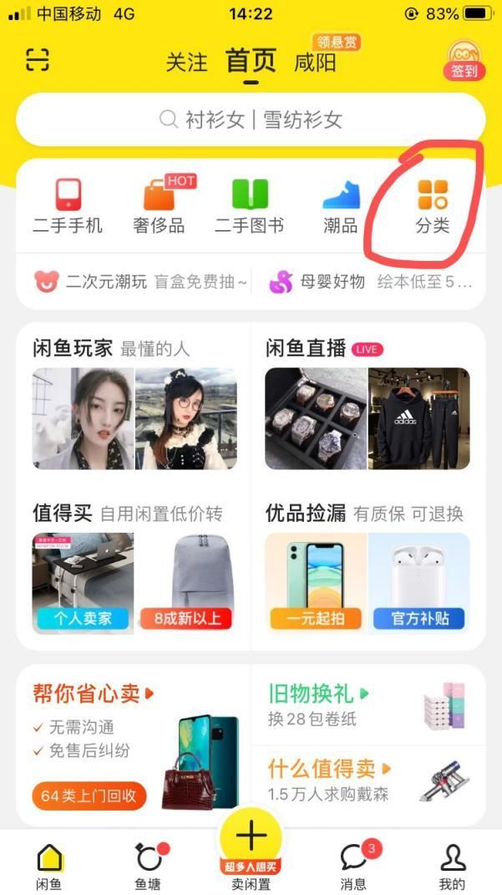

# 1.重新认识闲鱼无货源副业
---

## 1.1 什么是闲鱼无货源？
---
说到闲鱼无货源，很多人可能都或多或少的听说过，也可能有人已经在闲鱼上出售过产品，也盈利过。

但是，如果要让他们说清楚「到底什么是闲鱼无货源？如何在闲鱼才能盈利？如何选一个爆款产品？」这些问题，他们就很难说清楚了。

闲鱼无货源这个项目是建立在「闲鱼 APP」上的，闲鱼是阿里旗下的产品，目前拥有 5 亿注册用户，是全国最大的线上二手交易平台。

闲鱼无货源不是我们把一些自己不用的商品挂到闲鱼上出售，而是上传「**我们想要卖的产品**」，用户下单后，我们从其他**价格较低**的平台发货，**赚的是差价**。

我们只需按照要求将其他平台的产品，上传到闲鱼店铺，无需推广，就能轻松获取平台流量。

用户从我们的店铺买了产品，我们再从真实有货的商家按照要求地址拍下，商家发货后，我们再点击给用户发货了，然后填上单号。

这是一个无货源、轻资产，在家、上班兼职状态下，每天花费 1-2 个小时，只用手机即可操作的项目的。

## 1.2 它有哪些优势？
---
1. 与其他电商平台相比：

   相比于其他电商平台，闲鱼直接以不需要保证金，回款周期短，单个人可注册多个等优势直接居于前面。

    单个手机即可轻松操作，不需要电脑，外加不需要比较深的运营知识，相对来说比较简单。

    不过这里的简单相对于上面这些平台来说，一个不太了解的人直接去做闲鱼无货源，也会有很多坑。

    我自己也是一路趟坑过来的，最难受的时候，百单直接到了 0 单，很尴尬，一个人在那发呆，还有不少难受的时刻，也算是九死一生的吧！

    我通过不断的总结整理，到现在单日稳定百单，再回过头看闲鱼，的确比较简单。

2. 与其他行业相比

   一些自媒体行业，比如今日头条等自媒体，需要使用电脑，很多人可能就不方便，外加需要一定的写作水平。

    抖音，快手，视频号，更是需要一些拍摄剪辑，编排能力，而这些对于咱们还是比较有难度的。

    知乎好物，一样需要使用电脑编辑外加需要选品能力。

    并不是说上面这些做不好，不能做的意思，一样，任何一个行业都会有厉害的人存在。

    只不过相比较而言，闲鱼还是有这些优势在的：

    单个手机即可操作整个流程；

    随时随地操作，盈利赚钱—-出去旅游，但是收益完全不影响。

    轻资产创业，不需要投入电脑，实体店，压货 这些。直接几千块钱就可以操作，当然几千块钱还是你的，只不过需要有人在闲鱼买了产品，咱们去其他平台拍下，都是一些大的平台，走资金流水而已，无任何资金风险。

## 1.3 为什么闲鱼可以卖出去产品？
---

两个图进行对比，每一个平台都会有部分人群进行比对，而最后就有了闲鱼的这部分人群。

厂家直销、个人好物、一些商铺的尾货清仓、以及农家原生态的标签，而这些标签也注定了闲鱼的一些基本交易额。

存在即合理，而咱们需要做的就是分析出来他的一些特点，然后抓住特点，在规则内，用心做好做大即可。

## 1.4 哪些人在平台购买？
---
闲鱼的用户人群，主要上面四类，而每一类会有他特定的一些需求产品，一样根据需求去发掘，然后卖给他们需要的产品即可。

## 1.5 闲鱼的前景怎么样
---
闲鱼的前景还是很不错的，背靠阿里，能无缝衔接支付宝、淘宝。

我以我自己的经历来说明。

上图是我当时操作的一个新号，操作第三天的时候，直接 2 小时干了 400 多单，利润 1000 多。上一天 8 单，第二天直接爆了起来。

这是闲鱼单店铺，早上 8 点 51 刚刚睡醒，只有 38 个产品，一早直接干 100 单，当天最后 300 多单，利润自然上千。

而这个号单月差不多平均产出 1.5 万左右，当然有时候也能到 2 万左右，利润率平均 20% 。

单个店铺曝光，录的视频，单天曝光 1300 万，这里记录不太方便，所以直接放上截图，当时单天单店访客几万，和天猫流量差不多。

上面这些数据，可能有的小伙伴觉得我有点显摆，其实不是这样。

我只是想说明闲鱼平台目前仍旧属于红利，市场依旧，完全可以继续操，并且作为一个长期稳定的项目进行。

# 2.实操前的准备
---

## 2.1 店铺前期准备
---
**闲鱼账号 = 淘宝账号 = 支付宝账号**

闲鱼账号可以直接用「支付宝」或者「淘宝」账号直接登录。支付宝、淘宝就不用说了，大家应该都有。下载完「闲鱼 APP 」后，直接用支付宝或淘宝登录就可以了。

### 2.1.1 主账号的准备
---
主账号，也就是用来做闲鱼店铺的账号，要求支付宝芝麻信用分 650 以上，700 分左右算是很不错的，当然越高越好，展现给的流量也会更多。

一般建议用家人或者自己的，因为后期涉及人脸识别，以及短信通知，都是比较麻烦，自己或者家人的用起来比较方便。

检查完自己的支付宝芝麻信用分之后，就可以直接去应用商城下载“闲鱼” APP，用支付宝直接登录。

### 2.1.2 闲鱼无货源的流程
---
我们做的是无货源电商，一般电商会涉及到：产品、宣传、包装、发货几个步骤，但我们这里**没有货源，也无需打包、发货**，这些步骤，都是其他人操作就可以。

我们做的就是**宣传**。把其他平台的商品搬到闲鱼，有人在这里买了，我们去上家拍下，等上家发货后，我们再去闲鱼点发货，将单号填写 进去就好了，当然我们也有售后，只不过是直接找上家处理即可，完全不承担任何风险。

这里平台宣传就是“闲鱼”。

### 2.1.3 完善闲鱼账号
---
手机下载好闲鱼后，登录上面准备好的主账号，芝麻信用分 650 以上的支付宝账号。

按照下面提示，逐一进行完善个人信息，并开通账号。

信息完善后，到这一步闲鱼店铺基本的准备就完了，下来到商家代发平台的一个准备了的。

## 2.2 下载选商家代发平台
---
无货源的好处在于，不用拘泥于任何产品，借助一个手机，在家即可轻松完成整个流程。

而我们需要做的，就是等用户在我们店铺内买了，然后我们去满足要求的商家店铺按照用户地址给用户拍下，商家发走了，我们再给真实用户发走即可。

所以，选择那个商家作为上家就是一个重点。

那么，哪些可以作为我们真实货源商家平台？满足什么要求才可以当做我们的代发商家货源呢？

下来会逐一给大家说。

市面上真实有货的都可以当做我们的一个货源商家，比如，拼多多，淘宝，1688，淘宝特价版，京喜（京东旗下低价的平台）~

这几个都是大平台，有保证，不会出现货物丢失、钱款受损的情况。

以下是这几个平台的对比：

+ 拼多多：48小时内发走，每件产品都包邮，价格偏低。

+ 淘宝特价版，京喜：价格偏低；每件都包邮。

+ 1688：批发价，部分更低，需要考虑到运费。

> 小技巧

货源这块也可以借助返佣平台，多一笔营收的。

拼多多有一个返佣平台 - 「多多团长」。

拼多多很多商家借助这个官方平台进行推广活动，也就是你在拼多多看上一件产品，可能 10 元，而商家在这个平台可能还有 2 元优惠券，完了还返佣 10%。

也就是相当于一件 10 元产品，最后拿到手上 （10-2）*（1-10%）=7.2 元，更加便宜。

可以直接通过上方扫码下载即可，而其他电商平台的也可以进行一个搜索进行来的。

而上面几个电商平台 APP，可以在手机应用商城内进行一个下载即可，上面几个，就是一般常用的几个选商家代发的平台。

# 3.闲鱼核心3大选品思路
---

## 3.1 验证产品是否爆款的 2 条思路
---
说到实操之前，先说一句我自己总结的闲鱼无货源**最核心的东西：**

借助平台属性将用户需要的东西出售给他们，我们从更低成本商户那里发给他们，从中间获取一定的收益。

当然这句话也可以沿用到其他电商平台上，而这句话在闲鱼这块归纳起来核心点有：平台属性；用户需要什么产品；找到更低商户；

通俗，完善一下的话，这里就可以划分成：选品-选上家-编辑上架-优化-客服订单处理-放大。

凡事有个顺序流程，做事自然不会慌乱。

而上面这些也就是自己操作闲鱼的流程，外加核心。

这次分享主要将闲鱼选品这块给大家详细讲一下。

选品，就类似于一个射手，射箭的靶子，只有当你的方向是正确的，那么过程中做的努力才会有结果，最后才会射中应该射中的靶心位置。其次选品，也直接决定了你后期店铺的订单，利润，算是整个闲鱼操作的第一个核心点。

闲鱼他本身没有类似淘宝生意参谋这些数据参考；在淘宝，拼多多，京东上卖的好的品，在闲鱼上并不通吃。

所以，闲鱼的选品我们是通过从闲鱼平台去走的，借助闲鱼平台的一些数据进行参考、借用。

## 3.2 验证产品是否爆款的 3 条思路
---
这里我将这些数据参考称之为，验证思路。验证思路里面主要参考的点有：想要数；同行动态；多家情况。

每一个参考的点背后都有他存在的价值，上面这个表就是一个具体的说明。

这里我以一个“瑜伽垫”搜索为例，之前做的时候 30% 的利润率，轻松 3 天直接干到单天不怎么管的情况下 200-400 利润，不过目前已经被压得有点狠，这里进行举例，进行说明：

（1）想要数：代表了有多少个用户给这个商家私发了消息，咨询这个产品。这里有几千人咨询了这个产品，自然说明被很多人需要。

   

   一般想要数越多越好。但是有时候也会出现一种情况，咨询的多，买的少，这个时候就需要参考下一个，同行动态了。

（2）同行动态：显示这个同行卖出去的产品，外加件数，那么在看了想要数多的基础上，看一下他的动态，看这个产品销量，也就是转化情况。这里举例这个瑜伽垫，可以看见，占比很大，转化还是可以的。

   

   > 这里补充 2 个点：

   1. 有时候会出现上面这种，没有显示卖出去的产品，单有评价。这种情况可以通过点击评价查看卖出去那个产品
      
   2. 另外可以依据：买的用户：评价产品数=10:1，然后判断这个产品单天出去的件数，像上面这个单天 16 条评价，差不多就可以预估到单天 160 件左右单天。

   

   看下 16 条评价的这个同行，来了闲鱼 151 天，卖出去 2384 件产品，还是比较厉害的。当然操作上万件的学员也有，闲鱼可玩性还是比较大的，现在还依旧可以做。

（3）多家情况：一个同行分析完了，再看一下其他家的，例如瑜伽垫这个，按照上面两个看完了，一个同行好厉害，再看一下其他家的想要数，动态占比，发现这个品多家都比较好，那么这个品可以选。

   

   按照流程的化，下来再看下我们成本，确定下上家成本情况，发现中间利润可以的情况下，那么这个品就没多大问题，直接可以上架。

   当然验证过程中，可能出现了，只有个别几家同行在卖这个品，这几个都卖的比较好，这个品就有点类似淘宝里面的蓝海品，直接可以开搞，几个号都上这个品。供给少，需求大，做的话自然比较好来。

说完了闲鱼选品中的，核心验证思路，那么就有人发憷了，刚开始根据习惯进行选品好来，那么到了后面，自己都不知道选什么品。

## 3.3 快速选出上万种爆款的 3 大方法
---
而在这里，下来说下三个选品方法，让你选出源源不断个闲鱼上爆的品：
1. 换位思考，根据日常选品法。

2. 借助产品分类选品法。

3. 同行，源源不断选品法。

### 3.3.1 换位思考，根据日常选品法
---
顾名思义，想下自己会去二手市场想买一些什么产品，外加看自己生活日常中需要什么产品，出去看到那些品，以及做电商卖的一些好的，然后去闲鱼搜索，按照上方验证思路查看即可。

### 3.3.2 借助产品分类选品法
---
1. 按照分类内有的

   打开闲鱼首页，这里有一个分类，然后点击进去，就可以看到这里第二个图，分类，外加这个分类下有哪些品，当然这里显示部分，类目下还有其他好多品。而根据类目，验证下面的品，即可。

   

   其次，也可以借助淘宝无线端流量词汇，然后进行选品，筛选淘宝类目下卖的比较好的品，然后去验证（相对来说比较齐全，需要的话可以，私聊进行发到）

   

2. 大的类目词进行搜索

   这里搜索大类目词“运动用品”，那么运动用品下的一些品，全部会出来，这个时候再将这些品搜索验证即可。这里可以被搜的就很多了，厨房用品，酒店用品，日用品等。

   这个方法的话，会找到很多自己想都想不到，但是很不错的品。

   

3. 看同行，源源不断选品法

   依次点开瑜伽垫同行动态的时候，猛地他店铺里面“网红波波球”销量也成，那么我们不就在原先的基础上多了一个品，之后去搜索验证新品“网红波波球”的时候，又会发现其他同行，还有其他新的卖得不错的品，依次源源不断，可以找到很多。

   

   思路的延伸，总能发现很多无穷无尽好玩的东西，这个时候将人总会关注比自己厉害人的这个思路用到闲鱼这块，会发现同行会比自己厉害的同行。

   我们就去看他关注的同行卖那些好的品，而关注的同行还会关注其他人~~依次源源不断，源源不断，发现厉害的同行，发现厉害的品。

   上图：

   像这个，关注了61个，然后点开，可以看到，很多都是粉丝比较多的，粉丝较多的，一般也是卖货可以的，点开这些人，发现新的品。

   依次翻看，并看翻看人关注的人~~源源不断，超级好玩。

   

以上便是 闲鱼店群 这块的核心部分-选品。

3 种选品方法+核心验证思路，足够找到至少上万种不错的品。

在选这些比较好的品的时候，总会记了这个，忘了另外一个。

那么在这就可以借助闲鱼选品表格，将好的品按照类目进行汇总，建立属于自己的闲鱼选品库。如下图，自己建的一个选品库，平时看到一些不错的品，及时按照类目更新着，当做的时候直接上手操作即可，节省时间。

选好了品，下来就是 找上家，无货源的优势就在于，不必拘泥产品问题，也不必担心囤货，压资金问题，全网有货的都是我们的货源渠道，一件代发，受平台保护，不怕拿了钱跑路之类，这个时候找到价格低于市场的时候，那么就可以编辑上架了。

编辑上架的话，最简单的方法就是参考同行，好的标题进行修改，图片裁剪，然后为我所用。

上了的产品如何拉开与市场其他人的区别，并遥遥领先领先，这个时候就需要依靠平台的一些参数值，浏览量，想要数，超赞数，收藏，留言，及时回复率，好评率。在这些上下功夫即可。

这块比较简单的话就是 和别人互想要，超赞，留言。（需要注意：直接在闲鱼上发互，很容易被检测违规，可以截图或者谐音字来的）

选上家，编辑上架，优化相对来说讲的比较粗糙，一方面因为篇幅原因，太多肯定大家没有耐心看；其次这边有付费的学员，全部讲完了，估计被他们知道会被拿着几米长的大刀，凶神恶煞的直愣愣朝我砍来，所以点到为止了。

不过上面这些，按照操作，单月 3000 左右还是还不少人可以达到。

# 4.寻找低价质优一键代发货源的四大技巧
---
**思路：** 选品的内在逻辑是发现用户需求，然后通过选品去满足用户需求，我这边给大家介绍多种选品方式给大家参考！

## 4.1 淘宝及1688 配合选品
---
准备：淘宝官网，1688 官网，找货神器（shen.1688.com）

思路:根据阿里的发家史，淘宝的崛起离不开阿里巴巴，所以我今天就来分享1688与淘宝结合的隐藏技巧，这套技巧同样不仅适用于闲鱼选品，同样适用于淘宝等平台的电商选品。

1. 登录shen.1688.com，下载找货神器浏览器插件，推荐使用chrome浏览器完成这个流程

   

2. 打开淘宝官网，选择左边的导航栏，这里有很多一级类目，然后大家可以在里找自己的意向类目

   

3. 我就以左边的厨具/收纳/清洁为例，选择最上方的清洁工具，然后就是下面这个样子

   

4. 经过初步筛选，我选择了第三个宝贝(10000+销量)，然后找货神器显示如下

   

5. 然后点击主图右侧的同款货源，然后进行货源分析

   

6. 最后选定这个供货商，价差有二十多元，能一件代发，所以这个品就能选品上架到闲鱼

   

   > 提示：可以在淘宝精细化筛选，比如选择价格段，选择综合排序或销量排序，同样以清洁工具为例，如下图所示

   

   

**小结分析：** 由于淘宝和闲鱼互相打通数据，因此淘宝上卖的好的，同样在闲鱼也能卖的不错，且当用户访问了某淘宝宝贝，根据大数据猜你喜欢，闲鱼会优先展现推荐在闲鱼的同款宝贝，且1688已经将同款货源与淘宝打通，然后闲鱼进行一系列优化操作，是能接住淘宝过来的用户，从而促成成交。

## 4.2 闲鱼与拼多多配合选品
---
**思路：** 众所周知，闲鱼的大部分卖家的大部分货源均来自拼多多，所以我的独特思路是通过闲鱼热卖的宝贝反向选品，从而找出拼多多的优质货源

1. 于是乎我在闲鱼的猜你喜欢随便刷新逛了逛，看到某款音响竟有100+我想要，于是乎我就点开了这个宝贝，就是这个样子

   

   

   

2. 简单分析了一下，就马上保存了这个音响的主图，打开了拼多多，搜主图搜同款

   

3. 结果让我很震惊，最低档次赚50元，其他档次就是100多起跳，最高利润三百左右，所以这是个不错的品拿到闲鱼去卖。

   

   

**提示：** 闲鱼反向选品不仅可以通过闲鱼的猜你喜欢，还可以通过搜索框搜索一些通用词，如音响，耳机等，还可以通过这些热销宝贝的同行卖家的个人主页找到更多的热销商品，然后去拼多多找同款，多种渠道，多种拓展，互相促进。

> 还可以通过闲鱼全部分类来选品

**小结分析：** 对于小白而言，若是对选品没有基本信心，可以采取这种方式进行抄作业复制选品，因为同行就是最好的老师，他们已经把最热最好卖的品帮你筛选出来，敲重点，就三个字，抄作业。

## 4.3 多多团长推荐选品
---
**思路：** 多多团长的优点在于它能提供一定的热销商品数据支持，而且他会把佣金最高，最热销的商品挑选展示出来。

1. 比如APP上方他会分为精选、清仓、百货、母婴等类目，下方有实时榜单，今日爆款等栏目，如下图所示，话不多说，我们来看具体操作吧。

   

2. APP上方的精选、清仓、百货、母婴等栏目，点击清仓这个栏目就能看到一些潜在的爆款，按综合排序我首先发现了排第一的卡帝乐鳄鱼女包（价格亲民19.8元，6.9万销量，符合爆品原则）

   

3. 然后点进去进行进一步分析，同时打开闲鱼搜索卡帝乐鳄鱼女包（都是几百个我想要，且价格价格有利可图35元上下），所以这款宝贝可以定价 25 元上下，符合选品原则。

   

4. 然后再按佣金比例排序，我发现了两个佣金比例极具诱惑的宝贝（两款衣服），如下所示，一个27.9元63%佣金，一个25元45.9%佣金。

   

5. 由于服装属于非标类目，所以这两款商品只能对标短袖清仓，对比之下仍有利可图（建议上架时标题写上清仓，特价，折扣等打折优惠词汇，这样能获得更大流量）

   

   

6. 最后是销量排序，这里就不赘述，大家可以多去探索。

7. 接着是实时榜单，然而你们以为也是直接通过榜单选品吗，是，也不是，我是通过实时榜单里的热销商品进行关键词提取选品，比如下图所示，我看到了南极人空调被这个关键词。

   

8. 然后我在多多团长首页搜索南极人空调被，我看到了如下排序，简单地分析了一下，主要是要以低价销量为主，所以我又点击了销量排序，不出所料，首屏全是10万+销量。

   

9. 接着闲鱼搜索南极人空调被依旧有利可图，80100：拼7.59元，闲12元，200230:拼28.94，闲35~36.9。

   

   
   
> 提示:多多团长下方的信息流也可以进行实时榜单这类操作，也能进行不错的选品。

**小结分析：** 多多团长APP上方的精选、清仓等栏目中的爆品也可参照实时榜单中的关键词提取操作进行选品，比如卡帝乐，卡帝乐鳄鱼女包等词在多多团长首页进行搜索。

## 4.4 多多批发推荐选品
---
**思路：** 多多批发这个平台不被大家所熟知，因为他是2020年7月底拼多多低调上线的一个对平台商家类似于1688之于淘宝的批发平台（pifa.pinduoduo.com）。因为这个平台注册必须成为拼多多卖家，但在这里我给大家分享一个技巧，可以完美解决。

**技巧提示：** 下载拼多多商家版APP，用自己的手机号注册，注意：商家账号与拼多多平台账号不通用，互相独立，大家注册了商家账号之后不需要点击认证就可以登录商家版APP，也就是说直接登录多多批发。好了，接下来就是我的实操！

1. 手机浏览器登陆pifa.pinduoduo.com直达多多批发（也可电脑登陆，我这里是用手机操作），点击右上角的三个横杠按钮进入分类页面。

   

2. 然后选择女装的短外套分类，映入眼帘的就是防晒衣，所以经过分析我选择了防晒衣进行选品示范操作，我点进了右上角的链接，着重看了价格（15.65元），觉得闲鱼应该有很大机会。

   

3. 打开闲鱼搜索防晒衣，结果拼多多15.65，闲鱼竟然21.99元，而且有一个闲鱼我点开宝贝竟显示卖掉了，可见需求之大，废话不多说，上对比图。

   

   

**提示：** 由于多多批发两件及以上才有折扣，一部分折扣很大，一部分折扣很低，由于没有收藏按钮，所以看到心仪的多多批发宝贝就加入购物车保存。

如果碰到闲鱼只卖了一件的情况(大多数时候是这样的)，多多批发宝贝页面下方有店铺名，打开拼多多搜索店铺名，页面出来后点击搜索栏左侧商品按钮，选择店铺搜索，选择第一个店铺进入即可。

**小结分析：** 其实多多批发所有商品与拼多多共通，然后大家又可以通过拼多多的同款链接。

去多多团长看是否有佣金，然后我把刚才的宝贝在多多团长一搜，佣金虽然不多，但比多多团长的折扣还低，所以善用平台工具也能提高利润。

**总结：** 上述的四种方法可以互相配合使用，比如方法1在1688找到货源，去方法2的拼多多平台对比货源，然后对比方法3的多多团长返佣比例，选择最优的进货价格，从而实现更低的售价，更高的利润。

# 5.爆款产品编辑上架的几大要点
---
**思路：** 优化篇主要是要优化四个方面，分别为主图优化，关键词优化，打标签，详情撰写。这里我以这个清洁工具为例进行示范。

## 5.1 主图优化
---

### 5.1.1 在淘宝上选择没有带特殊信息的图片
---
比如这张图片就要进行处理，因为下方标注了赠品，所以应该把它裁剪掉，保留核心关键信息

### 5.1.2 然后是讲其他主图和详情页页面的亮点图片进行保存
---
这里就不发出来了，因为图片太多了，总之最后凑够九张进行亮点组合。

**提示：** 可以将淘宝详情页的短视频加入闲鱼编辑，增加亮点曝光，吸引顾客，下面是22秒的短视频！

**小结分析：** 主图和详情页应尽量把最有卖点的图片展示出来，这样就是抓住买家的眼球，提高曝光和出单率。

## 5.2 关键词优化
---
**思路：** 由于淘宝闲鱼是一个体系，关键词是获取流量重大因素，正所谓万物皆可seo,没有关键词怎么能获取尽可能多的流量呢，因此如何去拓展更多相关的关键词，接下来看我操作。

### 5.2.1 首先淘宝找到的这款宝贝的关键词就可以复制
---
如左图所示，然后是在收藏里找到这款宝贝，点击右侧找相似，如右图所示。

### 5.2.2 复制关键词
---
由于之前通过这款宝贝的主图和详情已经初步了解了该产品的亮点，所以可以在下方的页面中找到最相似的宝贝，进行复制关键词。

### 5.2.3 接下来是复制的关键词集合，然后开始组合拓词
---
+ 主宝贝: 擦玻璃神器擦窗家用双面高楼双层中空强磁窗户器清洁工具清洗刮刷

+ 相似宝贝1: 诚成擦玻璃神器三层双层中空擦窗户强磁家用工具双面擦高层搽刷刮

+ 相似宝贝2: 擦玻璃神器家用双面万用双层搽檫工具高楼清洗窗户器中空强磁高层

+ 相似宝贝3: 擦玻璃神器高楼家用双层三层厚中空双面搽檫万用刮水洗窗户器强磁

+ 相似宝贝4: 诚成家用高层擦玻璃器双层三层厚玻璃双面擦清洗工具擦窗户神器

### 5.2.4 这个方法是尽可能组合不一样的特点相符的词
---
经过组合，以下是闲鱼宝贝的**标题：**

擦玻璃神器擦窗家用双面高楼双层中空强磁窗户器清洁工具清洗刮刷擦窗户家用工具擦高层搽刷刮万用搽擦水洗擦厚玻璃

**小结分析：** 关键词拓展的第一原则是关键词与宝贝匹配(就是不能牛头不对马嘴，擦玻璃就不能拓展擦地)，第二原则是尽可能多，但不能满屏堆砌，最多不能超过70-80个(就是闲鱼宝贝文字最开头的第一段即为默认的标题)，认准这两个原则才能更多获取平台流量

## 5.3 打标签(主图打标签)
---
**思路：** 闲鱼新品打标签就相当于淘宝新品打标，原理是阿里的千人千面，所以利用好事半功倍！

> 用贴纸贴上全新

如图，首先用贴纸贴上全新，然后选择上方已经组合好的关键词组合拆分成十个标签即可，我这边选择的十个词如下：

擦玻璃神器，擦窗家用，窗户双面清洁，双层中空强磁窗户器，刮刷擦工具，擦高层搽刷刮，万用搽擦，水洗擦厚玻璃，高层双面擦窗工具，窗户清洁器

**小结分析：** 一定要贴全新，打满十个标签。

## 5.4 详情编辑
---
**思路：** 详情编辑得好，是宝贝优化的最后一公里，是买家下单的最后一关，所以我来示范一下如何编辑一个合适的详情页。

### 5.4.1 找同款
---
首先打开那个宝贝页面，淘宝找一个类似的就可以了，边看宝贝详情边看接下来的内容

### 5.4.2 通过阿里同款货源列出sku
---
+ 3-8mm+32礼包 强磁单层 不可调 29.9元包邮

+ 5-12mm+32礼包 强磁单层加厚 不可调 49.9元包邮

+ 15-24mm+32礼包 强磁双层 不可调 64元包邮

+ 5-25mm+109礼包 强磁双层 可调磁 79.9包邮

+ 15-30mm+32礼包 强磁双层 不可调磁 89.9包邮

+ 5-30mm+109礼包 强磁双层 加厚可调磁 99包邮

### 5.4.3 然后通过淘宝详情页提炼出卖点和核心优势
---
**产品卖点：**

+ 一面擦，两面净，高层玻璃，轻松擦洗

+ 双面强磁玻璃擦给你一片清洁，省时省力，高效擦窗

+ 档位自动回调，无需自动调节，隔磁支架，安全防夹手

+ 擦窗一遍过，90度无死角轻松擦，强磁力，吸得紧

+ 适合各类玻璃使用，阳台浴室客厅玻璃都能用

+ 安全套绳防坠落，系住手腕掉了也不怕

### 5.4.4 然后就是一些注意事项
---
+ 全国包邮，偏远地区除外

+ 如若漏发少发，及时响应，及时补发

+ 若有质量问题，无理由全额退款

### 5.4.5 最后加上前面的关键词就是这样的
---
**擦玻璃神器擦窗家用双面高楼双层中空强磁窗户器清洁工具清洗刮刷擦窗户家用工具擦高层搽刷刮万用搽擦水洗擦厚玻璃**

+ 3-8mm+32礼包 强磁单层 不可调 29.9元包邮

+ 5-12mm+32礼包 强磁单层加厚 不可调 49.9元包邮

+ 15-24mm+32礼包 强磁双层 不可调 64元包邮

+ 5-25mm+109礼包 强磁双层 可调磁 79.9包邮

+ 15-30mm+32礼包 强磁双层 不可调磁 89.9包邮

+ 5-30mm+109礼包 强磁双层 加厚可调磁 99包邮

**产品卖点：**

+ 一面擦，两面净，高层玻璃，轻松擦洗

+ 双面强磁玻璃擦给你一片清洁，省时省力，高效擦窗

+ 档位自动回调，无需自动调节，隔磁支架，安全防夹手

+ 擦窗一遍过，90度无死角轻松擦，强磁力，吸得紧

+ 适合各类玻璃使用，阳台浴室客厅玻璃都能用

+ 安全套绳防坠落，系住手腕掉了也不怕

+ 全国包邮，偏远地区除外

+ 如若漏发少发，及时响应，及时补发

+ 若有质量问题，无理由全额退款

**提示：** 建议用句易网（www.ju1.cn）检测文案是否违规，之前文案有违禁词，检测出来删除后才在闲鱼成功发布了。

**小结分析：** 这样写一目了然，打造自己的核心优势和卖点，能减少顾客的理解成本，买家买不买能很快能做决定。

**该篇总结：** 细节决定成败，每个地方都优化好，才能将有竞争力的品的能量发挥到极致，不放弃任何一个获得流量和成交的地方。

# 6.超高转化率客服话术流程+出单发货流程
---
**思路：** 销售直接关系到后端转化，是获得收入和利润的临门一脚，所以必须尽可能做到回复及时，态度良好，服务满分，这样才能长久。

## 6.1 售前
---
1. 按每个宝贝的属性和特点设置自动回复

   收到咨询消息第一时间及时回复，推荐将闲鱼的各方位手机权限调至最高级，还可以配备小米手环进行提醒（我就是这么做的），很好用，体验感很好

2. 话术方面，主要是要强调全新包邮，非买家原因的售后卖家全责（比如包来回运费），真的退货了，你找上家处理就行。

## 6.2 售中
---
1. 根据地址和拍下的订单找对应的上家下单发货。

   注意，由于是手动下单，难免出错，所以初期需要多次检查，尽量避免出错，建议拼多多的默认地址随便乱写一个，优选江浙沪一带，这样即使出错，也可以原路返回，不受影响。

2. 售中最多的就是物流查询问题，主要是韵达和极兔比较麻烦，一个填了没物流信息，一个不能填单号，需要去手动查询，在发货填单号的过程中，注意将韵达按程序发货，然后发给顾客单号，将极兔直接无需物流，再将单号发过去。

> 注：极兔的订单发的开头单独解释一下（单号录不进，新快递，反正能到），然后单独发极兔的单号（单独一个消息发，方便复制)。

## 6.3 售后
---
1. 顾客想退货，直接回复，扣发货运费，退货运费自负，一般发货运费金额可以说8块左右，按发货地和收货地距离合理报价，因为拼多多图书大多退货包运费，一来一回，发货退货的运费都在你口袋里了（其实比这个订单赚的还多得多），但是尽量别让买家退货，很麻烦，而且容易影响权重，主要是让他们知难而退。

2. 东西确实有问题，比如发错货，漏发，这种马上联系上家核实，以上家的处理方案和顾客的选择为准则，但是一定要妥善处理，以买家利益为先，还有比如有封面破损、折痕这种，友善解决，可以适当出几元钱补偿，评价维护很重要，切勿因小失大。

3. 最后说一句，以买家合理利益诉求为准，凡事好商量，遇事不怕事，客观公正对待各种问题。

## 6.4 下单小技巧
---
1. 在选品的时候，用拼多多进行初筛，然后复制链接打开多多团长，就可以查看佣金比例，对比几个同款宝贝，不过这时候就会显示比价订单，然后第二天就直接从多多团长下单，还有就是用小号拼多多链接跳转大号多多团长，就不会显示比价订单，就可以直接下单多多团长。

2. 如果你不想占用太多资金，可以多多团长下单，然后系统会自动跳转微信小程序，填好订单信息后微信不付款，去拼多多app付款，然后用支付宝花呗付款，这样资金压力就没那么大，而且能提升支付宝信用分，何乐而不为。

## 6.5 货源备用
---
不管是1688，还是拼多多的货源，都要有1个主货源，2-3个以上的备用货源，以防涨价和缺货

**销售篇总结：** 一切以用户体验为中心，保证买家的合理正当要求被满足。

# 7.官方推荐闲鱼工具的高效操作教程
---
众所周知，闲鱼群控软件是业界公认的闲鱼店群操作工具，虽然有着实实在在的便利性，但终究只是闲鱼APP操作界面加个壳，我称之为控制闲鱼APP操作的操作软件，且不说安全性问题有待商榷，购买成本也是一笔不小的开销，对新手卖家不太友好。

所以，我在这里向大家推荐使用闲鱼官方推荐第三方工具——闲鱼管家，大家可以理解为闲鱼的千牛卖家后台，百度搜索闲鱼管家即可进入，或者直接网址栏输入 https://goofish.pro/ 亦可进入，这款软件不仅是官方自己开发的，而且更重要的是免费，安全性问题更毋庸置疑，但是有个局限性是仅限闲鱼pro账号，可瑕不掩瑜，让我为大家详解这款软件的神奇之处吧。

本次分享内容请大家全部认真看完，切勿中途跳出去操作，不然有可能出错乃至风控。

## 7.1 注册与登录
---
1. 登录 goofish 进入闲鱼管家，打开后是登录界面。

   

2. 点击免费注册，填写相关信息，注意：这个商家姓名可以自定义，密码也可以跟闲鱼账号密码设置得不一样，只要你能记住，怎么做都行。

   

3. 然后点击注册，就是授权并登录淘宝账号，注意：是你闲鱼号对应的淘宝号，别号多弄得乱了，建议以注册手机号做为这些关联账号的一致条件。

   

4. 然后就是绑定闲鱼号，按提示操作，点击完成。

   

5. 最后呈现的就是这个界面了。

   

## 7.2 概况篇
---
概况主要分为两块，**待处理和统计**。这个界面主要是让大家对自己的全店数据做一个可视化汇总。

待处理分为待发货订单，仅退款（未发货），仅退款（已发货），退货退款四个。

统计分为待发布，销售中，已销售，成交金额，在售总库存五个。

## 7.3 商品篇
---
> 新建商品

1. 点击商品，在商品初始页面，点击新建商品。

   

2. 然后就是大家似曾相识的画面，跟闲鱼APP的发布界面如出一辙，大家可以根据自己的需求进行发布，发布选项有三个，保存草稿箱，添加待发布，发布商品。

   

   

3. 这里跟大家详解一下：

   选择商品分类并选填结构化属性（就是类目属性）

   商品图片：点击图片可放大，鼠标悬浮在图片处可操作删除或改变排 序，最多上传9张图成色：成色为选填项商品标题：必填项，最多输入30个汉字；商品描述：选填项发货地：选择一次后，后续新建商品会默认是用上次的发货地，必填项

   商品规格：选填项，若商品有多规格（如颜色/尺码等），请先添加商品规格售价/库存：为必填项，库存默认为“1” 原价/商家编码：选填项

   可随时保存草稿箱，必填项填完后可添加待发布或者立即发布商品

> 其他列表

4. 草稿箱

   顾名思义，随时编辑得宝贝，区别于待发布，你们可以理解为待发布的待发布。

   

5. 待发布

   待发布，因为我一样的测试宝贝分别编辑了草稿箱和待发布，待发布比草稿箱多一个上架按钮。

   

6. 处理中

   未处理或处理失败的宝贝会显示在这，处理失败可以查看原因。

   

7. 销售中

   就是店铺在上架中的宝贝。

   

8. 拍卖中

   拍卖后续可能会有新玩法。

   

9. 手动下架

   手动下架的商品可操作编辑或上架。

   

10. 售出下架

   宝贝库存变成0后就下架。

   

11. 拍卖下架

   同拍卖中。

   

## 7.4 订单及售后
---
> 订单

1. 用一张图让你们看明白。

   

2. 接下来是订单页面的截图。

   

> 售后

1. 仅退款（未发货）列表页场景：买家下单后，不想要了或看上其他的

   流程：买家下单——商家收到订单暂未发货——买家申请仅退款

   超时时间：24 小时，超时未处理系统将自动退款给买家

   订单来源：指的是商家产生订单的那个闲鱼号

   订单状态：指的是该订单所处的订单状态，正常是待发货

   货物状态：指的是商品此时的状态，正常是未发货

   退款状态：
      + 待商家处理：买家提交，等待商家处理
      + 退款成功：商家同意退款，款原路返回给买家
      + 退款关闭：商家拒绝退款，直接发货

   操作：点击“操作退款”进入商品详情页

   

2. 仅退款（已发货）列表页场景：买家收到货后，发现商品有瑕疵，要求商家补偿

   流程：买家下单——商家收到订单并已发货——买家收到货后申请仅退款

   超时时间：3 天，超时未处理系统将自动退款给买家

   订单来源：指的是商家产生订单的那个闲鱼号

   订单状态：指的是该订单所处的订单状态，正常是已发货

   货物状态：指的是买家在前端 APP 提交申请时选择的货物状态

   退款状态：
      + 待商家处理：买家提交，等待商家处理
      + 退款成功：商家同意退款，款原路返回给买家
      + 退款关闭：商家拒绝退款

   操作：点击“操作退款”进入商品详情页

   

3. 退货退款列表页场景：买家收到货后，发现商品不是自己想要的，申请了退货退款

   流程：买家下单——商家收到订单并已发货——买家收到货后申请仅退款

   超时时间：
      + 退款待处理：是提交时间的 3 天后到期
      + 同意退货申请：同意退货后的 7 天到期
      + 买家退货：买家提交物流单号后的 10 天到期

   订单来源：指的是商家产生订单的那个闲鱼号

   订单状态：指的是该订单所处的订单状态，正常是已发货

   货物状态：指的是商品的当时所处的状态，如买家将商品寄回，则为 “已寄回”

   退款状态：
      + 待商家处理：买家提交，等待商家处理
      + 待买家退货：商家同意退货，等待买家退货
      + 待商家收货：买家退货，提交物流单号，等待商家收货
      + 退款成功：商家同意退款，款原路返回给买家
      + 退款关闭：商家拒绝退款

   

## 7.5 淘宝搬家
---
1. 点击设置里的搬家授权，如图所示。

   

2. 然后点击绑定淘宝账号，可以绑定多个淘宝店，绑定步骤如图按提示操作，这里就不演示了。

   

3. 然后点击搬家，里面直接跳转到淘宝搬家，先同步商品，之后淘宝店的商品都会同步出来。

   

4. 随便选择一个测试宝贝进行搬家，之后就会跳转到该宝贝的发布页面，选择发布到草稿箱或者待发布都是直接进了后台的草稿箱。

   

   

5. 另外还有批量搬家，点击批量搬家即可。

   

   

## 7.6 闲鱼子账号设置
---
1. 点击设置，如下图所示，闲鱼管家后续可能可以绑定多个闲鱼pro号，因为点击绑定闲鱼账号，现在说只能绑定一个，不排除以后开放的可能。

   

   

2. 然后点击系统账号，点击创建账号，就能创建子账号，这里我就试着创建一个，根据提示设置，选择开设的权限即可（这里提一嘴，手机号已经注册了闲鱼号的不能添加，要换个没注册过的，其他没有要求)。

   

   

   

3. 然后我们试着打开另一个浏览器登录，根据提示输入信息，结果真的登录成功了，所以团队化批量操作指日可待。

   

   

## 7.7 闲鱼管家在线客服功能
---
1. 点击左下角的闲鱼图标，就可以看到提示绑定页面。

   

2. 登录闲鱼对应的淘宝号，记住账号写淘宝用户名，手机号和邮箱是不行的。这里就演示了，按提示操作就行。

3. 然后你就能看到跟闲鱼app一样的聊天界面了。

   

   

## 7.8 其他想要说的
---

### 7.8.1 规避敏感操作
---
1. 一些操作有可能引起闲鱼风控，比如异地登录+绑定其他淘宝店店铺搬家，因为我是借的朋友pro账号进行测试，异地登录在所难免，而且她闲鱼APP账号也随时在线，所以有冲突，触发了闲鱼风控（闲鱼认证信息复核）。

   

2. 在这里，我的建议是进行闲鱼管家操作要保持手机电脑ip地一致，另外可以开设一个全能子账号（权限全开）进行淘宝搬家和其他敏感操作，如果不幸还是风控，只要你是找亲戚朋友注册的，找他们闲鱼复核认证个人信息即可，望知悉。

### 7.8.2 关于闲鱼管家的几点优势
---
1. 闲鱼官方原生安全可靠

   再厉害的闲鱼群控系统，也不可能做到官方推荐系统的安全和效率，尤其是安全性，其他系统再厉害终究是壳。

2. 数据可视化优势无可比拟

   在闲鱼管家后台，你能很清晰地看到自己的订单等各方面情况，轻松掌控全局。

3. 批量发货解放双手

   批量发货支持模板导入，先导出订单，然后再根据模板导入，批量发货幸福感满满。

4. 淘宝搬家效率翻倍

   如果你恰好是淘宝卖家想转战闲鱼，那个这个官方免费工具让你分分钟切换平台，效率杠杠的。

5. 在线聊天轻松高效

   闲鱼询单也能在电脑端操作，极大地便捷闲鱼卖家的用户体验，提升效率的不二之选。

6. 子账号管理让团队化批量操作成为可能

   因为有了子账号，团队各成员能够高效分工，因为你是pro账号，至少500个宝贝的上限让你完全可以像经营淘宝天猫店那样去做，毕竟闲鱼也是有4亿用户的，且是阿里亲儿子，优势无以比拟。

> 最后的最后，送大家一句话，君子生非异也，善假于物也。

# 8.闲鱼日常注意事项+违禁封号注意点
---

## 8.1 注意筛选客户
---
芝麻信用分为差、极差的，和上年纪的大爷大妈不建议交易

做电商赚不赚钱一码事，容易被 xx 搞心态，所以我个人在谈单过程中会筛选客户，哪怕已经拍下付款了，我觉得这个人有点毛病我也会选择关闭订单不发货，宁愿少赚点钱也不受气。

下面分享两个我的**惨痛案例**，善良的我还是打了码

一开始说卡槽放不进去，我以为卡住了，结果她想用本来超大手机的卡槽，塞进 iPhone7！！！

以上。。。在我历经半个小时事无巨细的文字+视频指导后，她申请退货退款了！！！那一天我记得很清楚。

太阳在外面散发温暖，我在教室里怀疑人生，脑海里只剩下一种旋律，我是谁，我在哪。。。

好了，这个是 60 后大妈，我原谅她，也放过我自己，告一段落。

-----

第二个案例，这个就把我恶心坏了，就算已经隔了很久我也没有拿起来截图的欲望。

简单说下，他买完手机，不确认收货，然后一直申请退款不退货，我拒绝他就再申请，问他也不说话，就是搞心态。

这里涉及到闲鱼的一个 xx 机制问题，我着重说下：

你发货完，往后数 10 天，客户会自动确认收货，钱到账。

如果客户东西拿到手，不确认收货，直接申请售后，会给你三天的确定时间，重点来了

「等待你确认处理售后时，10 天自动确认收货机制冻结」

「在你拒绝无脑售后之后，客户可以无限次重新发起售后」

「客户第一次发起售后会有提醒，往后没有提醒」

「卖家无法主动申请介入闲鱼小法庭」

在这上面四个机制的累加下，我获得了成就「无限冻结」

第一次客户申请完，闲鱼给我短信提醒，我拒绝。往后他就一直申请，因为你三天内如果不处理，他是会默认同意给买家退货/退款的，而且往后的申请售后闲鱼不会给你任何提示。

这就导致我每天都得留一个心眼看着他是不是又来搞我，他只申请退款不退货，超时了我就钱财两空，我找客服申请介入闲鱼小法庭，客服说只能买家介入。真的是心态爆炸，一直僵持了一个月才解决。

以上。。所以我现在看到芝麻信用分极差，较差等的，上了年纪的大爷大妈的，全部拒绝交易，对自己好一点，身体最重要。

下面这个也是同行遇到的情况，到手刀，这种会上小法庭的还好，有理有据没输过。

-----

**帮朋友买：**

这个也是史诗级巨坑！！！会造成什么结局呢？

他朋友拿到手：哎呀，这玩意我发现买来也用不上啊，你帮我退了，我不要了

客户：兄弟，我朋友说他不喜欢，你给我退了呗

我：啊这，闲鱼是不支持七天无理由退款的，这边有质量问题可以退换，个人喜好问题是不退换的，商品链接和发货前都说的很清楚了

客户：你就给我退了呗能咋地，我朋友他不要我拿着也没用啊

我：真没办法%￥……&￥兄弟

客户：那你这手机有质量问题，我要退

我：？？？？有啥问题

客户：（实在想不出来）电池太垃圾了！！

我：本来就是二手机啊兄弟，别人用过的机子电池肯定都会有损耗的呀，你寄过来我给你换个新电池。

客户：￥%￥……我不要我就是要退

然后，就介入闲鱼小法庭了，我赢了，给了我个带图差评……

所以，看到客户出现「帮朋友买」这四个字，慎重啊！！！！叫他朋友自己来买！！！

不然出现问题，客户被夹在中间，最终都会演化为对你讨伐。。得不偿失

客户强烈要求要买的话，下面是正解，打足预防针！！

**补一个最稳妥的结束交易流程方法：**

引导客户尽可能快地确认收货，如好评返现，确认收货返邮费等。

且你主动给出评价，客户15天后系统会默认评价，如果双方都没有评价，哪怕时隔半年，客户一样都能给你补一个差评！且显示在最新的评论区，**客户收货后一定要主动给评论！这是维系账号评论区的重中之重！**

## 8.2 引流
---
引流属于闲鱼的红线区域了，不适当的引流方式会导致禁言/封号/删链接等

切记不要在聊天过程中打出：微信、QQ、VX等字样。

20年时可以图片引流，就是截图微信「我」的图片即可，现在已经不行了，我之前被查出来一次，发了一张图分五天扣了我11分，12分永久禁言（年底清零），闲鱼真的很喜欢秋后算账，打电话找了闲鱼客服也没有用，没有按发一张图扣一次去处理，大哥说了算。

现在推荐的引流方式是，通过已拍下付款客户的电话号码直接去微信主动添加，客户会考虑到你能提供给他的后续售后服务等，通过率有80%左右。

未成交的客户可以通过打**纯数字**的电话号码/微信绑定的QQ号码进行引流，扣分率较低，但也不是100%不扣。

另外一种方法是客户主动要微信号时，你语音和他说：发你的。避免我们自己违规，但也有同行说客户发微信号扣他分的，捉摸不定。

总之引流环节要慎重，对于普通玩家来说，一张身份证只能注册三个闲鱼账号，对应三个支付宝账号，珍惜好每一个账号！引流建议使用第一种方法，不会留下把柄，且已经完成一个交易流程也更容易使客户有信任感基础，对接下来的复购、安利环节有帮助。

## 8.3 防诈骗
---
+ 面交：等待你的可能不是正经买家，而是好几个五大三粗的汉子和你「强制交易」

+ 虚假物流：字面意思，拖够十天，系统自动确认收货

+ 退款不退货：如上的筛选客户环节，第一次申请退货退货，之后时不时来一下退款不退货，看走眼就没了

+ 同行引导：同行搞事情，诱导你说一些违规词，举报就被封号

+ 换货掉包：买家联合快递员掉包换货，说货不对板，申请退货退款。这种情况比较少见，但也不是没有，寄出高价值物品时建议全程录视频留作证据，退货拆快递时也全程录视频，发生掉包事件时上闲鱼小法庭有证据基本上也稳赢。

## 8.4 不要做
---

### 8.4.1 无限次「编辑」「重新发布」获取曝光
---
看到有人说利用「编辑」「重新发布」去不断刷新擦亮获取曝光，这是极其错误的做法，不要再做了。

在你的商品没有卖出去之前，每一次编辑发布都会触发审核机制，看账号权重，短则一两分钟，长则三天、半个月，审核期间链接会被保护起来，就是单机版本，你看得到自己的链接，别人是看不到、搜不到的。

卖出后可以编辑，重新上架，不要更改任何东西。

### 8.4.2 大幅度修改标题、文案、图片
---
同上，改一个标点符号也会触发审核机制，大概率降权，链接会冷下来，特别是图片一定不要改。小错别字、一点数字可以改，大改建议删掉重新上架。

### 8.4.3 售假、虚拟产品等
---
闲鱼公约明确指出的品类不要卖，100%封号，哪怕你上架秒删、一单没出，闲鱼喜欢秋后算账。同淘宝的三振出局、12分扣分机制，封号7天、15天、永封。当然不同品类也有差异性，有7 15 15的，也有7 7 7的。

### 8.4.4 发言不友善，骂人被举报大概率禁言七天、严重的永久禁言（可以打语音电话）
---
遇到极品买家小 Tips：带有骂人、脏字、泄露隐私（手机号、地址）的评论可以找客服直接删除，聊天也可以举报对面。

### 8.4.5 退货换货原因客户选「质量问题」
---
让客户改成不喜欢/不想要/或者其他，这个我吃过大亏，次数多系统一样会判定你是售假，封号、删链接处理

### 8.4.6 短时间大批量上架/下架/删除链接
---
以上操作间隔每次半个小时，一天不要超过五次，过多过快一样会降权、限流。

### 8.4.7 违规词总结（闲鱼喜欢秋后算账）
---
「假」、「仿」、「裸」、「洗面奶」、「计生用品」、「正品」

「SB」（USB 流下了泪水）、「ED」（LED 同样哭泣）、「ml」（用毫升代替）

「极限词」（极致、第一、最好、历史最低、极其、100%、一定、绝对等）

「动物制品」、「涉政」、「迷信」、「要授权才能上架的品牌词」等

### 8.4.8 虚假承诺
---
比如答应客户好评返现没返、假货当正品卖等，遇到较真的客户去找客服吐槽，有概率冻结资金、降权
